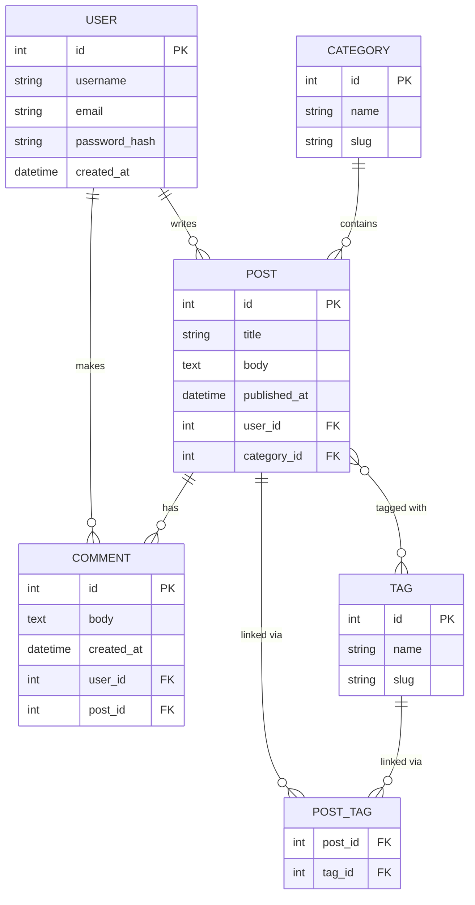

# 📐 Chapter 2: Data Modeling and ER Diagrams

> "A good data model is worth a thousand lines of code." — Every senior developer who has refactored a bad schema at 2am.

---

## 🗺️ What Is Data Modeling?

Before you write a single line of SQL or touch a database tool, you need a **blueprint**. Data modeling is the process of designing that blueprint — deciding what data you need to store, how it's structured, and how different pieces of data relate to each other.

Think of it like an architect's floor plan. You wouldn't build a house by just randomly pouring concrete — you plan where walls go, where doors open, how rooms connect. Data modeling does the same thing for your database.

A good data model:
- Eliminates redundancy (no storing the same thing in 10 places)
- Keeps data consistent (no contradictions)
- Makes querying intuitive and efficient
- Makes future changes less painful

The visual language for expressing a data model is the **Entity-Relationship Diagram (ER Diagram)**.

---

## 🧩 Entities: The "Things" in Your World

An **entity** is any distinct object or concept in your domain that you want to store information about. If you were building a blog, the meaningful "things" might be:

| Entity | Real-World Meaning |
|---|---|
| `USER` | A person who has an account |
| `POST` | An article or blog post written by a user |
| `COMMENT` | A reply left on a post |
| `TAG` | A keyword label like "javascript" or "tutorial" |
| `CATEGORY` | A broad grouping like "Tech" or "Lifestyle" |

In an ER diagram, entities are drawn as **rectangles**.

> **Rule of thumb:** If you'd naturally say "I need to keep track of [X]", then [X] is probably an entity.

---

## 🏷️ Attributes: Properties of an Entity

Each entity has **attributes** — the individual pieces of information you store about it. For a `USER` entity, you might have:

- `id` — a unique identifier (primary key)
- `name` — the user's display name
- `email` — unique email address
- `password_hash` — stored securely, never plain text
- `created_at` — timestamp of account creation

For a `POST` entity:

- `id` — unique identifier
- `title` — the headline
- `body` — the full content
- `published_at` — when it went live (nullable if still a draft)
- `user_id` — foreign key linking back to the author

In ER diagrams, attributes are often shown as **ovals** connected to their entity (in classic Chen notation) or listed inside the entity rectangle (in Crow's Foot / IE notation — which is what most modern tools use).

---

## 🔗 Relationships Between Entities

The power of a relational database is in the *relationships* between entities. There are three main types:

### 1:1 — One-to-One

**Example:** `USER` → `PROFILE`

One user has exactly one profile. One profile belongs to exactly one user.

This is fairly rare. It usually appears when you want to split a large table for performance or security reasons (e.g., keeping sensitive profile details separate from login info).

```
USER ——— PROFILE
```

### 1:N — One-to-Many

**Example:** `USER` → `POSTS`

One user can write many posts. But each post belongs to exactly one user.

This is the most common relationship in any database. You implement it with a **foreign key** on the "many" side.

```
USER ——<  POST
```
*(The crow's foot symbol `<` means "many")*

### M:N — Many-to-Many

**Example:** `STUDENTS` ↔ `COURSES`

One student can enroll in many courses. One course can have many students. Neither side is the "one".

You **cannot** implement this directly in a relational database. You need a **junction table** (also called a join table, bridge table, or associative table) in between:

```
STUDENT ——< ENROLLMENT >—— COURSE
```

The `ENROLLMENT` table holds foreign keys to both `STUDENT` and `COURSE`, and can also carry extra data about the relationship itself (like `enrolled_at` or `grade`).

---

## 📊 ER Diagram Notation: Crow's Foot

The most widely-used notation today is **Crow's Foot** (also called IE notation). Here's the legend:

| Symbol | Meaning |
|---|---|
| `||` | Exactly one (mandatory, single) |
| `o|` | Zero or one (optional, single) |
| `|<` | One or more (mandatory, many) |
| `o<` | Zero or more (optional, many) |

You read relationships from **both directions**. Take this example:

```
USER ||--o{ POST : "writes"
```

Read left to right: "One user writes zero or more posts."
Read right to left: "Each post is written by exactly one user."

The `||` on the USER side means "exactly one" — a post must have an author.
The `o{` on the POST side means "zero or more" — a user might have written nothing yet.

### Cardinality vs Optionality

- **Cardinality** = the *maximum* (one vs. many) — shown by the crow's foot or single line
- **Optionality** = the *minimum* (mandatory vs. optional) — shown by the `|` (mandatory) or `o` (optional) closest to the entity

---

## 🔍 How to Read an ER Diagram

Follow this process every time:

1. **Identify the entities** — the rectangles
2. **Read each relationship line** in both directions
3. **Check the symbols** at each end for cardinality and optionality
4. **Look at the label** on the line — it describes what the relationship means in plain English
5. **Note foreign keys** — the "many" side always holds the foreign key

Practice: Cover the labels and try to reconstruct the English sentence from the symbols alone. If you can do that fluently, you can read any ER diagram.

---

## 🏗️ Step-by-Step: Designing an ER Diagram for a Blog System

Let's design a real system from scratch. Our blog platform needs:

- Users who register and write content
- Posts authored by users
- Comments left by users on posts
- Tags that can be applied to posts (a post can have many tags; a tag applies to many posts)
- Categories that organize posts (a post belongs to one category)

**Step 1: List your entities**
`USER`, `POST`, `COMMENT`, `TAG`, `CATEGORY`

**Step 2: Define attributes for each**

- `USER`: id, username, email, password_hash, created_at
- `POST`: id, title, body, published_at, user_id (FK), category_id (FK)
- `COMMENT`: id, body, created_at, user_id (FK), post_id (FK)
- `TAG`: id, name, slug
- `CATEGORY`: id, name, slug
- `POST_TAG` (junction): post_id (FK), tag_id (FK) — this handles the M:N

**Step 3: Define the relationships**

| Relationship | Type | Notes |
|---|---|---|
| USER writes POST | 1:N | A user can write many posts |
| USER makes COMMENT | 1:N | A user can make many comments |
| POST has COMMENT | 1:N | A post can have many comments |
| POST tagged with TAG | M:N | Needs POST_TAG junction table |
| POST belongs to CATEGORY | N:1 | Many posts share one category |

**Step 4: Draw (or code) the diagram**

---

## 🖼️ Full ER Diagram: Blog System



> **Note:** The `POST }o--o{ TAG` line is a shorthand in Mermaid for the M:N. In a real database, this is implemented through `POST_TAG`. Some diagrams show the junction table explicitly, others abbreviate it at the diagram level.

---

## ⚖️ Cardinality and Optionality: Mandatory vs Optional

These two concepts often trip up beginners:

**Mandatory (required)** — the relationship *must* exist.
- A `COMMENT` must belong to a `POST`. A post_id cannot be null on a comment.
- Shown with `||` (a single line touching the entity).

**Optional** — the relationship *may or may not* exist.
- A `USER` might have zero posts (brand new account, hasn't written anything).
- Shown with `o|` or `o{` (the circle represents "zero is possible").

Getting this right matters when you design your tables — it determines which columns are `NOT NULL` and which can be `NULL`.

---

## 👻 Weak Entities

A **weak entity** is an entity that cannot be uniquely identified by its own attributes alone — it depends on another entity for its identity.

**Example:** Consider `ORDER_ITEM`. An order item only makes sense in the context of a specific `ORDER`. If the order is deleted, the order item has no meaning. Its primary key is a combination of its own sequence number *and* the `order_id` of the parent.

Weak entities:
- Are shown with a double rectangle in classic notation
- Always have a **mandatory** relationship to their "owner" entity (called the identifying entity)
- Use a composite key (own attribute + parent's PK)

In practice, many developers use surrogate keys (auto-increment IDs) for everything, which technically makes every table "strong". But understanding weak entities helps you reason about real-world dependency.

---

## ❌ Common Mistakes in Data Modeling

### 1. Storing multiple values in one column
Bad: `tags = "javascript,react,node"` as a string in a column.
Good: A proper `TAG` table with a `POST_TAG` junction.

### 2. Missing the junction table for M:N
Beginners try to add a `tags` array column on posts, or duplicate rows. Always use a junction table for many-to-many.

### 3. Modeling too early without understanding the domain
Talk to stakeholders (or re-read the requirements) before drawing. A model built on wrong assumptions costs more to fix later.

### 4. Ignoring optionality
Not specifying whether a relationship is optional or mandatory leads to `NULL` columns everywhere and inconsistent data.

### 5. Using natural keys as primary keys
Using email as a PK for `USER` seems smart — it's unique! But emails change. Always prefer a surrogate key (`id` auto-increment or UUID) as the PK, and put a `UNIQUE` constraint on email separately.

### 6. Over-normalization (splitting too aggressively)
Sometimes developers split data into so many tiny tables that simple queries require 8 JOINs. Balance normalization with practical query performance.

### 7. Forgetting timestamps
Almost every table benefits from `created_at` and `updated_at`. Add them by default; removing them later is easy, adding them after-the-fact is annoying.

---

## 🎯 Key Takeaways

- **Data modeling** is designing your database structure *before* you build it — like an architectural blueprint.
- **Entities** are the meaningful "things" in your domain (User, Post, Product).
- **Attributes** are the properties of an entity (name, email, price).
- The three relationship types are **1:1**, **1:N**, and **M:N** — and M:N always needs a junction table.
- **Crow's Foot notation** uses `||`, `o|`, `|{`, `o{` to express cardinality and optionality.
- Read every relationship **in both directions** to fully understand it.
- **Weak entities** depend on a parent entity for their identity.
- Common mistakes: storing CSV in a column, missing junction tables, ignoring nullability, and using mutable natural keys as PKs.

---

## 🧪 Quiz

Test yourself before moving on:

**Question 1:** You're designing a database for a library. A book can be checked out by many members over time, and a member can check out many books. What relationship type is this, and what do you need to implement it?

<details>
<summary>Answer</summary>

**Many-to-Many (M:N).** You need a junction table — typically called `CHECKOUT` or `LOAN` — with foreign keys to both `BOOK` and `MEMBER`, plus attributes like `checked_out_at` and `returned_at`.

</details>

---

**Question 2:** In Crow's Foot notation, what does `o{` mean at the end of a relationship line?

<details>
<summary>Answer</summary>

It means **"zero or more"** — the relationship is **optional** (zero is allowed, shown by the `o`) and the cardinality is **many** (shown by the crow's foot `{`). Example: a user can have zero or more posts.

</details>

---

**Question 3:** You're building a school system. A `GRADE` record only makes sense if it belongs to a specific `STUDENT` and a specific `ENROLLMENT`. If the enrollment is deleted, the grade has no standalone meaning. What type of entity is `GRADE`?

<details>
<summary>Answer</summary>

`GRADE` is a **weak entity**. It cannot be uniquely identified without referencing its parent entity (`ENROLLMENT` or `STUDENT`), and its existence depends on the parent. It uses a composite or dependent key.

</details>

---

*Next up: Chapter 3 — Normalization: Organizing Your Database to Eliminate Redundancy*
