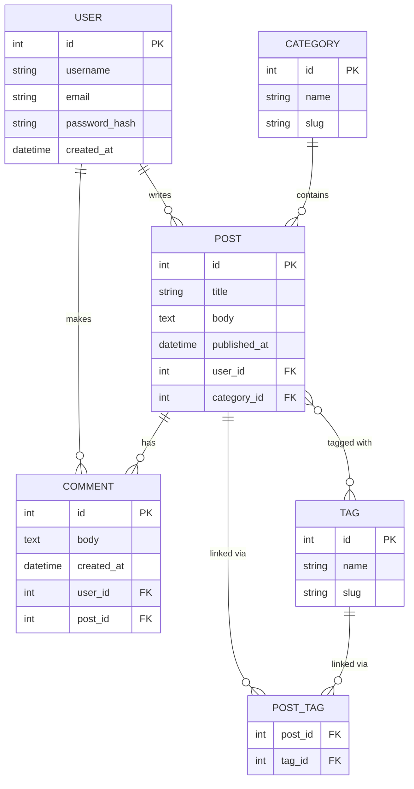

# 📐 Chapter 2: Data Modeling and ER Diagrams

> "A good data model is worth a thousand lines of code." — Har senior developer jisne 2am pe ek bekar schema refactor kiya ho.

---

## 🗺️ Data Modeling Hai Kya?

Socho tumhe ek naya Zomato jaisa app banana hai. SQL likhne se pehle, database tool kholne se pehle, tumhe ek **blueprint** chahiye. Data modeling basically yehi process hai — decide karna ki kaunsa data store karna hai, woh kaise structured hoga, aur alag-alag pieces of data ek dusre se kaise related honge.

Isko ek architect ke floor plan jaisa socho. Ghar banate waqt koi random concrete nahi daalta — pehle plan hota hai ki walls kahan aayengi, doors kahan khulenge, rooms kaise connect honge. Data modeling database ke liye exactly yehi kaam karta hai.

Ek achha data model:
- Redundancy khatam karta hai (same cheez 10 jagah store nahi hoti)
- Data consistent rakhta hai (koi contradiction nahi)
- Querying ko intuitive aur efficient banata hai
- Future mein changes karna easy banata hai

Data model ko express karne ki visual language hai **Entity-Relationship Diagram (ER Diagram)**.

---

## 🧩 Entities: Tumhari Duniya Ki "Cheezein"

**Entity** matlab koi bhi distinct object ya concept jisme tum apne domain mein information store karna chahte ho. Agar tum ek blog bana rahe ho, to meaningful "cheezein" kuch aisi hongi:

| Entity | Real-World Meaning |
|---|---|
| `USER` | Woh insaan jiska account hai |
| `POST` | User ka likha hua article ya blog post |
| `COMMENT` | Post pe kisi ka reply |
| `TAG` | Ek keyword label jaise "javascript" ya "tutorial" |
| `CATEGORY` | Ek broad grouping jaise "Tech" ya "Lifestyle" |

ER diagram mein entities **rectangles** ki tarah draw ki jaati hain.

> **Rule of thumb:** Agar tum naturally bolte ho "mujhe [X] track karna hai", to [X] probably ek entity hai.

---

## 🏷️ Attributes: Entity Ki Properties

Har entity ke **attributes** hote hain — woh individual pieces of information jo tum uske baare mein store karte ho. `USER` entity ke liye:

- `id` — ek unique identifier (primary key)
- `name` — user ka display name
- `email` — unique email address
- `password_hash` — securely store hota hai, kabhi plain text mein nahi
- `created_at` — account kab bana uska timestamp

`POST` entity ke liye:

- `id` — unique identifier
- `title` — headline
- `body` — poora content
- `published_at` — kab live hua (nullable agar abhi draft hai)
- `user_id` — foreign key jo author ko point karti hai

ER diagrams mein attributes ko **ovals** ki tarah dikhaya jaata hai jo entity se connected hote hain (classic Chen notation mein), ya entity rectangle ke andar list ki jaati hain (Crow's Foot / IE notation mein — jo aaj kal ke zyaadatar tools use karte hain).

---

## 🔗 Entities Ke Beech Relationships

Relational database ki asli power hi entities ke beech ke *relationships* mein hai. Teen main types hote hain:

### 1:1 — One-to-One

**Example:** `USER` → `PROFILE`

Ek user ka exactly ek profile hota hai. Ek profile exactly ek user ka hota hai.

Yeh kaafi rare hota hai. Usually tab dikhta hai jab tum ek badi table ko performance ya security ke liye split karna chahte ho (jaise sensitive profile details ko login info se alag rakhna).

```
USER ——— PROFILE
```

### 1:N — One-to-Many

**Example:** `USER` → `POSTS`

Ek user bahut saare posts likh sakta hai. Lekin har post exactly ek user ka hota hai.

Yeh kisi bhi database mein sabse common relationship hai. Isko implement karte ho "many" side pe ek **foreign key** rakhke — bilkul waise jaise Swiggy mein ek restaurant ke bahut saare orders hote hain, par ek order sirf ek restaurant se aata hai.

```
USER ——<  POST
```
*(Crow's foot symbol `<` ka matlab hai "many")*

### M:N — Many-to-Many

**Example:** `STUDENTS` ↔ `COURSES`

Ek student bahut saare courses le sakta hai. Ek course mein bahut saare students ho sakte hain. Yahan koi bhi side "one" nahi hai.

Isko relational database mein direct implement **nahi kar sakte**. Beech mein ek **junction table** (jise join table, bridge table, ya associative table bhi kehte hain) chahiye hoti hai:

```
STUDENT ——< ENROLLMENT >—— COURSE
```

`ENROLLMENT` table `STUDENT` aur `COURSE` dono ki foreign keys rakhti hai, aur relationship ke baare mein extra data bhi carry kar sakti hai (jaise `enrolled_at` ya `grade`). Bilkul Ola-Uber jaise sochlo — ek driver multiple rides le sakta hai, ek rider multiple drivers ke saath ride kar sakta hai, aur beech mein ek `RIDE` table hoti hai jo dono ko connect karti hai aur fare, time jaisa extra data rakhti hai.

---

## 📊 ER Diagram Notation: Crow's Foot

Aaj sabse zyaada use hone waali notation hai **Crow's Foot** (jise IE notation bhi kehte hain). Yeh raha legend:

| Symbol | Meaning |
|---|---|
| `||` | Exactly one (mandatory, single) |
| `o|` | Zero or one (optional, single) |
| `|<` | One or more (mandatory, many) |
| `o<` | Zero or more (optional, many) |

Relationships ko **dono directions** se padho. Yeh example lo:

```
USER ||--o{ POST : "writes"
```

Left se right padho: "Ek user zero ya usse zyaada posts likhta hai."
Right se left padho: "Har post exactly ek user ne likha hai."

USER side pe `||` ka matlab hai "exactly one" — post ka ek author hona hi hona chahiye.
POST side pe `o{` ka matlab hai "zero or more" — ho sakta hai user ne abhi tak kuch bhi na likha ho.

### Cardinality vs Optionality

- **Cardinality** = *maximum* (one vs. many) — crow's foot ya single line se dikhaya jaata hai
- **Optionality** = *minimum* (mandatory vs. optional) — `|` (mandatory) ya `o` (optional) se dikhaya jaata hai, jo entity ke sabse close hota hai

---

## 🔍 ER Diagram Kaise Padhein

Har baar yeh process follow karo:

1. **Entities identify karo** — rectangles
2. Har relationship line ko **dono directions mein** padho
3. Har end pe symbols check karo — cardinality aur optionality ke liye
4. Line pe **label** dekho — yeh plain English mein relationship ka matlab batata hai
5. **Foreign keys note karo** — "many" side hamesha foreign key rakhti hai

Practice: Labels ko cover karke sirf symbols se English sentence banane ki koshish karo. Agar yeh fluently kar paate ho, to koi bhi ER diagram padh sakte ho.

---

## 🏗️ Step-by-Step: Blog System Ke Liye ER Diagram Design Karna

Chalo scratch se ek real system design karte hain. Humara blog platform mein chahiye:

- Users jo register karke content likhte hain
- Users ke authored posts
- Users ke posts pe chhode gaye comments
- Tags jo posts pe apply ho sakte hain (ek post ke many tags ho sakte hain; ek tag many posts pe apply ho sakta hai)
- Categories jo posts ko organize karti hain (ek post ek hi category ka hota hai)

**Step 1: Apni entities list karo**
`USER`, `POST`, `COMMENT`, `TAG`, `CATEGORY`

**Step 2: Har ek ke attributes define karo**

- `USER`: id, username, email, password_hash, created_at
- `POST`: id, title, body, published_at, user_id (FK), category_id (FK)
- `COMMENT`: id, body, created_at, user_id (FK), post_id (FK)
- `TAG`: id, name, slug
- `CATEGORY`: id, name, slug
- `POST_TAG` (junction): post_id (FK), tag_id (FK) — yeh M:N ko handle karta hai

**Step 3: Relationships define karo**

| Relationship | Type | Notes |
|---|---|---|
| USER writes POST | 1:N | Ek user bahut saare posts likh sakta hai |
| USER makes COMMENT | 1:N | Ek user bahut saare comments kar sakta hai |
| POST has COMMENT | 1:N | Ek post ke bahut saare comments ho sakte hain |
| POST tagged with TAG | M:N | POST_TAG junction table chahiye |
| POST belongs to CATEGORY | N:1 | Bahut saare posts ek category share karte hain |

**Step 4: Diagram draw karo (ya code karo)**

---

## 🖼️ Full ER Diagram: Blog System



> [!info]
> `POST }o--o{ TAG` line Mermaid mein M:N ke liye ek shorthand hai. Real database mein isko `POST_TAG` ke through implement kiya jaata hai. Kuch diagrams junction table ko explicitly dikhate hain, kuch diagram level pe abbreviate kar dete hain.

---

## ⚖️ Cardinality Aur Optionality: Mandatory vs Optional

Yeh do concepts beginners ko aksar confuse karte hain:

**Mandatory (required)** — relationship *hona hi hona chahiye*.
- Ek `COMMENT` ka `POST` se belong karna zaruri hai. Comment pe post_id null nahi ho sakta.
- `||` se dikhaya jaata hai (entity ko touch karti ek single line).

**Optional** — relationship *ho bhi sakta hai, nahi bhi*.
- Ek `USER` ke zero posts ho sakte hain (naya account hai, abhi kuch likha hi nahi).
- `o|` ya `o{` se dikhaya jaata hai (circle represent karta hai ki "zero possible hai").

Yeh sahi samajhna zaroori hai jab tum apni tables design karte ho — isi se decide hota hai kaunse columns `NOT NULL` honge aur kaunse `NULL` ho sakte hain.

---

## 👻 Weak Entities

**Weak entity** woh entity hoti hai jise apne khud ke attributes se uniquely identify nahi kiya ja sakta — uski identity kisi doosri entity pe depend karti hai.

**Example:** `ORDER_ITEM` ko socho. Ek order item tabhi meaningful hai jab woh kisi specific `ORDER` ke context mein ho. Agar order delete ho jaaye, to order item ka koi matlab nahi bachta. Iski primary key hoti hai uske apne sequence number aur parent ke `order_id` ka combination — jaise Swiggy pe ek order ke andar ke individual items sirf us order ke reference ke saath hi make sense karte hain.

Weak entities:
- Classic notation mein double rectangle se dikhayi jaati hain
- Apni "owner" entity (jise identifying entity kehte hain) ke saath hamesha ek **mandatory** relationship rakhti hain
- Composite key use karti hain (apna attribute + parent ki PK)

Practically, bahut saare developers har table ke liye surrogate keys (auto-increment IDs) use karte hain, jisse technically har table "strong" ban jaati hai. Par weak entities samajhna tumhe real-world dependency ke baare mein reason karna sikhata hai.

---

## ❌ Data Modeling Mein Common Mistakes

### 1. Ek column mein multiple values store karna
Bura: `tags = "javascript,react,node"` ek string ke column mein.
Achha: Ek proper `TAG` table with `POST_TAG` junction.

### 2. M:N ke liye junction table miss karna
Beginners posts pe `tags` array column add karte hain, ya rows duplicate kar dete hain. Many-to-many ke liye hamesha junction table use karo.

### 3. Domain samjhe bina jaldi modeling karna
Draw karne se pehle stakeholders se baat karo (ya requirements dobara padho). Galat assumptions pe bana model baad mein fix karna zyaada mehenga padta hai.

### 4. Optionality ignore karna
Yeh specify na karna ki relationship optional hai ya mandatory, har jagah `NULL` columns aur inconsistent data laata hai.

### 5. Natural keys ko primary key banana
Email ko `USER` ka PK banana smart lagta hai — woh unique to hai! Par emails change ho sakte hain. Hamesha surrogate key (`id` auto-increment ya UUID) ko PK banao, aur email pe alag se `UNIQUE` constraint lagao.

### 6. Over-normalization (zyaada hi split karna)
Kabhi kabhi developers data ko itni chhoti-chhoti tables mein split kar dete hain ki simple queries ke liye 8 JOINs chahiye ho jaate hain. Normalization aur practical query performance mein balance rakho.

### 7. Timestamps bhool jaana
Almost har table ko `created_at` aur `updated_at` se fayda hota hai. Inhe default mein add karo — baad mein hatana easy hai, baad mein add karna painful.

---

## 🎯 Key Takeaways

- **Data modeling** matlab database build karne se *pehle* uska structure design karna — jaise ek architectural blueprint.
- **Entities** tumhare domain ki meaningful "cheezein" hoti hain (User, Post, Product).
- **Attributes** entity ki properties hoti hain (name, email, price).
- Teen relationship types hain **1:1**, **1:N**, aur **M:N** — aur M:N ko hamesha junction table chahiye.
- **Crow's Foot notation** `||`, `o|`, `|{`, `o{` use karke cardinality aur optionality express karta hai.
- Har relationship ko **dono directions mein** padho taaki poori tarah samajh aaye.
- **Weak entities** apni identity ke liye parent entity pe depend karti hain.
- Common mistakes: column mein CSV store karna, junction tables miss karna, nullability ignore karna, aur mutable natural keys ko PK banana.

---

## 🧪 Quiz

Aage badhne se pehle khud ko test karo:

**Question 1:** Tum ek library ke liye database design kar rahe ho. Ek book time ke saath bahut saare members ke through checkout ho sakti hai, aur ek member bahut saari books checkout kar sakta hai. Yeh kaunsa relationship type hai, aur isko implement karne ke liye kya chahiye?

<details>
<summary>Answer</summary>

**Many-to-Many (M:N).** Tumhe ek junction table chahiye — usually `CHECKOUT` ya `LOAN` naam ki — jisme `BOOK` aur `MEMBER` dono ki foreign keys hon, plus `checked_out_at` aur `returned_at` jaise attributes.

</details>

---

**Question 2:** Crow's Foot notation mein, relationship line ke end pe `o{` ka kya matlab hota hai?

<details>
<summary>Answer</summary>

Iska matlab hai **"zero or more"** — relationship **optional** hai (zero allowed hai, `o` se dikhaya jaata hai) aur cardinality **many** hai (crow's foot `{` se dikhayi jaati hai). Example: ek user ke zero ya usse zyaada posts ho sakte hain.

</details>

---

**Question 3:** Tum ek school system bana rahe ho. `GRADE` record tabhi meaningful hai jab woh kisi specific `STUDENT` aur specific `ENROLLMENT` se belong kare. Agar enrollment delete ho jaaye, to grade ka koi standalone matlab nahi bachta. `GRADE` kaunsi type ki entity hai?

<details>
<summary>Answer</summary>

`GRADE` ek **weak entity** hai. Isko apne parent entity (`ENROLLMENT` ya `STUDENT`) ka reference liye bina uniquely identify nahi kiya ja sakta, aur iska existence parent pe depend karta hai. Yeh composite ya dependent key use karti hai.

</details>

---

*Next up: Chapter 3 — Normalization: Organizing Your Database to Eliminate Redundancy*
