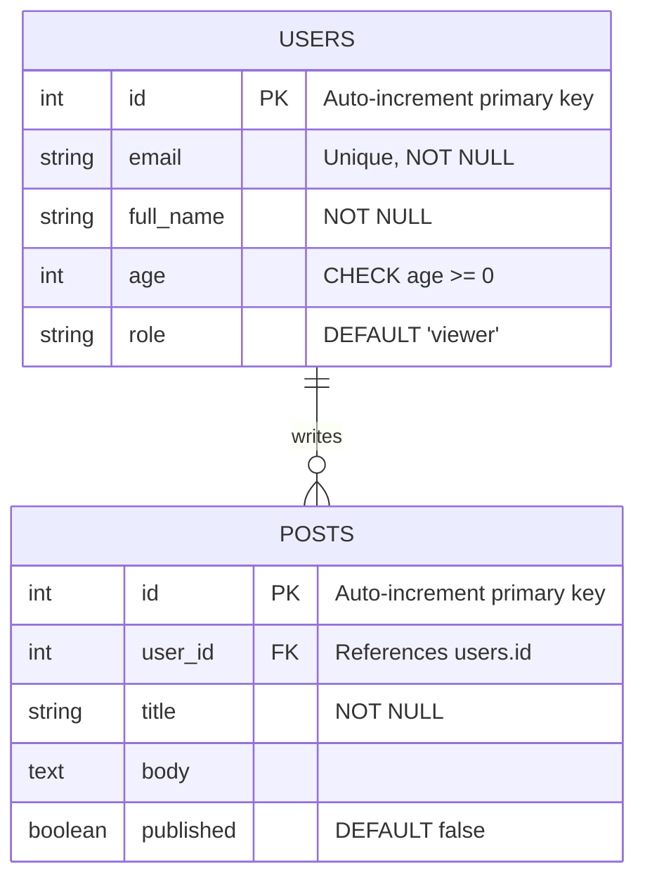

# The Relational Model Explained

> **Chapter 3 of Database Fundamentals**
> Prerequisites: Chapter 01 (What is a Database?) | Chapter 02 (SQL Basics)

---

## 🗂️ What Is the Relational Model?

In 1970, a mathematician named **Edgar F. Codd** published a paper at IBM titled *"A Relational Model of Data for Large Shared Data Banks."* This paper fundamentally changed how we think about storing and querying data — and the ideas it introduced still power almost every major database system you will use today.

Before Codd, databases were navigational: to find a record, you had to follow pointers and links manually, like traversing a linked list. Codd proposed something radically simpler: **organize all data into tables**, and let the database engine figure out how to retrieve it.

The relational model rests on three core ideas:

1. **Data is stored in tables** (called *relations* in formal mathematics).
2. **Each table has a strict structure** — the same columns for every row.
3. **Tables are linked to each other** through shared values, not physical pointers.

That is the entire foundation. Everything else — joins, constraints, indexes, normalization — is built on top of these three ideas.

---

## 📋 Tables (Relations): Rows and Columns

A **table** is the fundamental unit of storage in a relational database. Think of it as a spreadsheet, but with strict rules about what each column can contain.

```
+----+-------------------+-----+
| id | email             | age |
+----+-------------------+-----+
|  1 | alice@example.com |  28 |
|  2 | bob@example.com   |  34 |
|  3 | carol@example.com |  22 |
+----+-------------------+-----+
```

This table has:
- **3 columns**: `id`, `email`, `age`
- **3 rows**: one for Alice, one for Bob, one for Carol

### Rows = Records = Tuples

A **row** (also called a *record* or formally a *tuple*) represents one single entity in the table. In the example above, each row is one user. Every row must conform to the column structure — you cannot have a row with a missing column or an extra column that others do not have.

### Columns = Fields = Attributes

A **column** (also called a *field* or formally an *attribute*) represents a single property shared across all rows. In the users table, every row has an `id`, an `email`, and an `age` — those are the columns.

Columns also carry a **data type** — more on that in the Domain section below.

---

## 🔑 Primary Key (PK)

A **primary key** is one or more columns whose values **uniquely identify each row** in a table. No two rows can share the same primary key value, and a primary key column can never be NULL.

Think of it as the "address" of a row — if you know the primary key value, you can find exactly one row.

### Types of Primary Keys

#### 1. Surrogate Key (Auto-Increment ID)

A surrogate key is an artificial identifier generated by the database. It has no real-world meaning — its only purpose is to be unique.

```sql
-- PostgreSQL: SERIAL or GENERATED ALWAYS AS IDENTITY
CREATE TABLE users (
    id SERIAL PRIMARY KEY,       -- older syntax
    -- id INT GENERATED ALWAYS AS IDENTITY PRIMARY KEY,  -- modern syntax
    email TEXT NOT NULL
);

-- MySQL: AUTO_INCREMENT
CREATE TABLE users (
    id INT AUTO_INCREMENT PRIMARY KEY,
    email VARCHAR(255) NOT NULL
);

-- SQL Server: IDENTITY(1,1)
CREATE TABLE users (
    id INT IDENTITY(1,1) PRIMARY KEY,
    email NVARCHAR(255) NOT NULL
);

-- Oracle: GENERATED AS IDENTITY (12c+)
CREATE TABLE users (
    id NUMBER GENERATED AS IDENTITY PRIMARY KEY,
    email VARCHAR2(255) NOT NULL
);
-- Older Oracle (pre-12c) uses a SEQUENCE object separately
```

> **Note on syntax differences:** The concept is identical across all databases — auto-generate a unique number for each new row — but each vendor has its own keyword for doing so. `SERIAL`, `AUTO_INCREMENT`, `IDENTITY`, and `GENERATED AS IDENTITY` all mean the same thing.

#### 2. Natural Key

A natural key is a real-world value that is already unique. Email addresses are a classic example.

```sql
CREATE TABLE users (
    email VARCHAR(255) PRIMARY KEY,
    full_name TEXT NOT NULL
);
```

Natural keys have one big risk: real-world uniqueness can fail. A user might change their email, or two people might share a phone number. For this reason, surrogate keys are preferred in most production systems.

#### 3. Composite Key

A composite primary key uses **two or more columns together** to form a unique identifier. Neither column alone needs to be unique — only the combination.

```sql
CREATE TABLE order_items (
    order_id   INT  NOT NULL,
    product_id INT  NOT NULL,
    quantity   INT  NOT NULL,
    PRIMARY KEY (order_id, product_id)  -- composite PK
);
```

Here, the same `order_id` can appear many times (one order has many products), and the same `product_id` can appear many times (the same product on many orders). But a single order can only contain each product once — so the pair `(order_id, product_id)` is unique.

---

## 🔗 Foreign Key (FK) and Referential Integrity

A **foreign key** is a column in one table whose values must match a primary key value in another table. It is the mechanism that *links tables together*.

```sql
CREATE TABLE users (
    id    SERIAL PRIMARY KEY,
    email TEXT   NOT NULL
);

CREATE TABLE posts (
    id         SERIAL PRIMARY KEY,
    user_id    INT  NOT NULL REFERENCES users(id),
    title      TEXT NOT NULL,
    body       TEXT
);
```

In this example, `posts.user_id` is a foreign key that references `users.id`. Every post must belong to a user that actually exists in the `users` table.

### Referential Integrity

**Referential integrity** is the guarantee that a foreign key value always points to a real, existing row. The database enforces this automatically:

- You **cannot insert** a post with `user_id = 99` if no user with `id = 99` exists.
- You **cannot delete** a user if that user has posts pointing to them — unless you configure what to do in that case.

You can configure the behavior when a referenced row is deleted or updated:

```sql
CREATE TABLE posts (
    id      SERIAL PRIMARY KEY,
    user_id INT REFERENCES users(id)
        ON DELETE CASCADE    -- delete posts when the user is deleted
        ON UPDATE CASCADE,   -- update user_id if the user's id changes
    title   TEXT NOT NULL
);
```

Common `ON DELETE` options:
| Option | Behavior |
|---|---|
| `CASCADE` | Delete child rows automatically |
| `SET NULL` | Set the FK column to NULL |
| `RESTRICT` | Prevent deletion (error) |
| `NO ACTION` | Same as RESTRICT (default in most databases) |

---

## 📐 Table Relationship Diagram

Here is a visual representation of a `users` table linked to a `posts` table via a foreign key:



**Reading the diagram:**
- `||` means "exactly one" (one user)
- `o{` means "zero or more" (a user can have zero or many posts)
- The arrow reads: one user **writes** zero or more posts

---

## 🚫 Constraints

Constraints are rules enforced by the database on the data in a column. They prevent invalid data from ever entering the table.

### UNIQUE Constraint

Guarantees that no two rows have the same value in a column (or combination of columns).

```sql
CREATE TABLE users (
    id    SERIAL  PRIMARY KEY,
    email VARCHAR(255) UNIQUE NOT NULL   -- no duplicate emails
);
```

Unlike a primary key, a UNIQUE column **can** contain NULL (in most databases). NULL is considered "unknown" and two unknowns are not considered duplicates.

### NOT NULL Constraint

Guarantees that a column always has a value — it can never be left empty.

```sql
CREATE TABLE users (
    id        SERIAL  PRIMARY KEY,
    full_name TEXT    NOT NULL,   -- required
    bio       TEXT               -- optional (nullable)
);
```

If you try to insert a row without providing `full_name`, the database will reject it with an error.

### CHECK Constraint

Allows you to define a custom rule using any boolean expression.

```sql
CREATE TABLE users (
    id    SERIAL PRIMARY KEY,
    email TEXT   NOT NULL,
    age   INT    CHECK (age >= 0 AND age <= 150)
);

CREATE TABLE products (
    id    SERIAL PRIMARY KEY,
    name  TEXT   NOT NULL,
    price NUMERIC CHECK (price > 0)
);
```

The database evaluates the CHECK expression on every INSERT and UPDATE. If it returns false, the operation is rejected.

### DEFAULT Values

A DEFAULT value is used automatically when no value is provided for that column during INSERT.

```sql
CREATE TABLE users (
    id         SERIAL      PRIMARY KEY,
    email      TEXT        NOT NULL,
    role       TEXT        NOT NULL DEFAULT 'viewer',
    created_at TIMESTAMP   NOT NULL DEFAULT CURRENT_TIMESTAMP,
    is_active  BOOLEAN     NOT NULL DEFAULT true
);
```

Now if you run:
```sql
INSERT INTO users (email) VALUES ('alice@example.com');
```

The database automatically fills in `role = 'viewer'`, `is_active = true`, and `created_at = <now>` without you having to specify them.

---

## ⚡ Indexes (Preview)

An **index** is a separate data structure the database maintains alongside your table to make lookups faster. Think of it like the index at the back of a textbook — instead of reading every page to find "referential integrity," you jump directly to the page number listed in the index.

```sql
-- Create an index on the email column of users
CREATE INDEX idx_users_email ON users (email);
```

Without an index on `email`, finding a user by email requires scanning every single row. With an index, the database can jump directly to matching rows.

**Key things to know now (details in a later chapter):**
- Primary keys are **automatically indexed** by every major database.
- Indexes **speed up reads** (SELECT, JOIN, WHERE) but **slow down writes** (INSERT, UPDATE, DELETE) because the index must be updated too.
- Do not add indexes blindly — they use disk space and have a maintenance cost.

---

## 🧮 Domain: Allowed Values for a Column

In formal relational theory, a **domain** is the set of all valid values a column can hold. In practice, domains are expressed through **data types**.

```sql
CREATE TABLE products (
    id          SERIAL          PRIMARY KEY,
    name        VARCHAR(255)    NOT NULL,       -- up to 255 characters
    price       NUMERIC(10, 2)  NOT NULL,       -- number with 2 decimal places
    quantity    INT             NOT NULL,        -- whole number
    launched_at DATE,                            -- calendar date
    in_stock    BOOLEAN         NOT NULL DEFAULT true
);
```

Common data types across databases:

| Category | PostgreSQL | MySQL | SQL Server |
|---|---|---|---|
| Integer | `INT`, `BIGINT` | `INT`, `BIGINT` | `INT`, `BIGINT` |
| Decimal | `NUMERIC`, `DECIMAL` | `DECIMAL` | `DECIMAL`, `NUMERIC` |
| Text | `TEXT`, `VARCHAR(n)` | `VARCHAR(n)`, `TEXT` | `NVARCHAR(n)`, `TEXT` |
| Date/Time | `DATE`, `TIMESTAMP` | `DATE`, `DATETIME` | `DATE`, `DATETIME2` |
| Boolean | `BOOLEAN` | `TINYINT(1)` | `BIT` |
| UUID | `UUID` | `CHAR(36)` | `UNIQUEIDENTIFIER` |

> **Note:** MySQL does not have a native BOOLEAN type — it uses `TINYINT(1)` where 0 = false and 1 = true. SQL Server uses `BIT` for the same purpose.

Choosing the right data type is important: it enforces the domain (the database will reject a string in an INT column), it controls storage size, and it affects how comparisons and sorting work.

---

## 🏗️ Schema: The Structure Definition

A **schema** is the complete structural definition of your database — all the tables, their columns, data types, constraints, relationships, and indexes, but **no actual data**.

Think of the schema as the blueprint of a building. The blueprint defines the rooms and their sizes, but it is not the building itself.

```sql
-- This is a schema (structure, no data)
CREATE TABLE users (
    id         INT  GENERATED ALWAYS AS IDENTITY PRIMARY KEY,
    email      VARCHAR(255) UNIQUE NOT NULL,
    full_name  TEXT NOT NULL,
    role       TEXT NOT NULL DEFAULT 'viewer',
    created_at TIMESTAMP NOT NULL DEFAULT CURRENT_TIMESTAMP
);

CREATE TABLE posts (
    id         INT  GENERATED ALWAYS AS IDENTITY PRIMARY KEY,
    user_id    INT  NOT NULL REFERENCES users(id) ON DELETE CASCADE,
    title      VARCHAR(500) NOT NULL,
    body       TEXT,
    published  BOOLEAN NOT NULL DEFAULT false,
    created_at TIMESTAMP NOT NULL DEFAULT CURRENT_TIMESTAMP
);

CREATE INDEX idx_posts_user_id ON posts (user_id);
```

In PostgreSQL and SQL Server, "schema" also has a second meaning: a named namespace inside a database (like `public.users` or `dbo.users`). When people say "database schema" in conversation, they almost always mean the first meaning — the structural definition.

---

## 💻 How the Relational Model Maps to Real Code

When you use an ORM (Object-Relational Mapper) like Prisma, SQLAlchemy, ActiveRecord, or Hibernate, you are writing code that generates and interacts with this relational model.

**Prisma (Node.js/TypeScript):**
```typescript
model User {
  id        Int      @id @default(autoincrement())
  email     String   @unique
  fullName  String
  role      String   @default("viewer")
  createdAt DateTime @default(now())
  posts     Post[]
}

model Post {
  id        Int      @id @default(autoincrement())
  userId    Int
  user      User     @relation(fields: [userId], references: [id])
  title     String
  body      String?
  published Boolean  @default(false)
  createdAt DateTime @default(now())
}
```

**SQLAlchemy (Python):**
```python
class User(Base):
    __tablename__ = "users"

    id         = Column(Integer, primary_key=True, autoincrement=True)
    email      = Column(String(255), unique=True, nullable=False)
    full_name  = Column(Text, nullable=False)
    role       = Column(Text, nullable=False, default="viewer")
    created_at = Column(DateTime, nullable=False, default=func.now())

    posts = relationship("Post", back_populates="user")

class Post(Base):
    __tablename__ = "posts"

    id        = Column(Integer, primary_key=True, autoincrement=True)
    user_id   = Column(Integer, ForeignKey("users.id"), nullable=False)
    title     = Column(String(500), nullable=False)
    body      = Column(Text)
    published = Column(Boolean, nullable=False, default=False)

    user = relationship("User", back_populates="posts")
```

Notice the 1-to-1 mapping: every concept from the relational model — primary key, foreign key, unique, not null, default — has a direct counterpart in the ORM code. The ORM translates your class definitions into the SQL `CREATE TABLE` statements shown throughout this chapter.

---

## 🎯 Key Takeaways

- The relational model, invented by E.F. Codd in 1970, organizes data into **tables** made of **rows** and **columns**.
- A **primary key** uniquely identifies each row. It can be surrogate (auto-generated), natural (real-world value), or composite (multiple columns).
- A **foreign key** links one table to another and **referential integrity** ensures the link always points to a real row.
- **Constraints** (UNIQUE, NOT NULL, CHECK, DEFAULT) are rules enforced by the database — they are your first line of defense against bad data.
- A **domain** defines what values are allowed in a column; in SQL this is expressed through data types.
- A **schema** is the structure of your database — the blueprint with no data in it.
- **Indexes** speed up reads at the cost of slower writes; primary keys are always indexed automatically.
- Every concept in the relational model maps directly to ORM code — ORMs are just an abstraction layer on top of these fundamentals.

---

## 🧩 Quiz

Test your understanding before moving to the next chapter.

**Question 1:** You are designing a table for airport flight routes. Each route goes from one airport to another, and the combination of `departure_airport_code` and `arrival_airport_code` must be unique. What type of primary key would you use, and why?

<details>
<summary>Show Answer</summary>

A **composite primary key** on `(departure_airport_code, arrival_airport_code)`. Neither column alone is unique — an airport can have many departures and many arrivals — but the same pair of airports cannot define two different routes in the same direction.

</details>

---

**Question 2:** You delete a user from the `users` table. Their posts still exist in the `posts` table with `user_id` pointing to the now-deleted user. What database concept has been violated, and how could you have prevented it?

<details>
<summary>Show Answer</summary>

**Referential integrity** has been violated — the foreign key `posts.user_id` now points to a row that no longer exists (a "dangling reference"). You could prevent this by defining `ON DELETE CASCADE` on the foreign key (which would delete the posts automatically) or `ON DELETE RESTRICT` (which would prevent deleting the user while posts exist).

</details>

---

**Question 3:** What is the difference between a PRIMARY KEY constraint and a UNIQUE constraint? Name one way they behave differently.

<details>
<summary>Show Answer</summary>

A **PRIMARY KEY** must be unique AND cannot be NULL. A **UNIQUE** constraint must be unique but **can** contain NULL values (and in most databases, multiple NULL values are allowed in a UNIQUE column, because NULL is considered "unknown" and no two unknowns are considered equal). Additionally, a table can have only one PRIMARY KEY but can have many UNIQUE constraints.

</details>

---

*Next Chapter: Chapter 04 — Normalization: Designing Tables That Do Not Lie*
