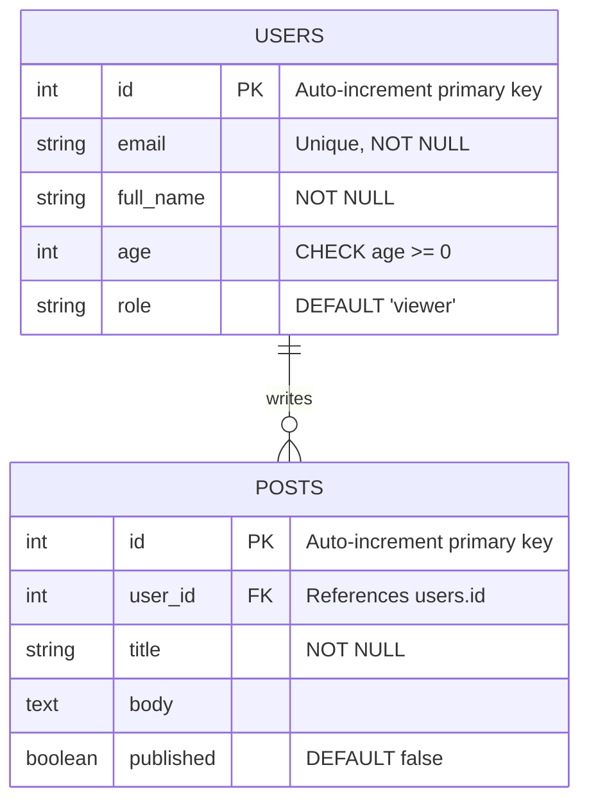

# The Relational Model Explained

> **Chapter 3 of Database Fundamentals**
> Prerequisites: Chapter 01 (What is a Database?) | Chapter 02 (SQL Basics)

---

## 🗂️ Relational Model Hai Kya?

1970 mein, **Edgar F. Codd** naam ke ek mathematician ne IBM mein ek paper publish kiya tha — *"A Relational Model of Data for Large Shared Data Banks."* Yeh paper itna game-changing tha ki aaj bhi jo bhi major database tum use karte ho (Postgres, MySQL, SQL Server) — sab isi idea pe based hai.

Codd se pehle databases "navigational" hote the — matlab kisi record ko dhundhne ke liye tumhe pointers aur links manually follow karne padte the, bilkul linked list traverse karne jaisa. Codd ne ek simple aur genius idea diya: **saara data tables mein organize karo**, aur retrieve karne ka kaam database engine pe chhod do.

Relational model teen core ideas pe khada hai:

1. **Data tables mein store hota hai** (formal mathematics mein inhe *relations* kehte hain).
2. **Har table ka strict structure hota hai** — har row ke liye same columns.
3. **Tables ek dusre se linked hote hain** shared values ke through, physical pointers ke through nahi.

Bas itna hi foundation hai. Baaki sab kuch — joins, constraints, indexes, normalization — isi teen idea ke upar bana hai.

---

## 📋 Tables (Relations): Rows aur Columns

**Table** relational database ka fundamental storage unit hai. Isko ek spreadsheet jaisa socho, bas har column mein kya aa sakta hai uske strict rules hote hain.

```
+----+-------------------+-----+
| id | email             | age |
+----+-------------------+-----+
|  1 | alice@example.com |  28 |
|  2 | bob@example.com   |  34 |
|  3 | carol@example.com |  22 |
+----+-------------------+-----+
```

Is table mein hai:
- **3 columns**: `id`, `email`, `age`
- **3 rows**: ek Alice ke liye, ek Bob ke liye, ek Carol ke liye

### Rows = Records = Tuples

**Row** (jise *record* ya formally *tuple* bhi kehte hain) table mein ek single entity represent karta hai. Upar wale example mein, har row ek user hai. Har row ko column structure follow karna hi padega — tum kisi row mein column miss nahi kar sakte, na hi extra column daal sakte ho jo baaki rows mein nahi hai.

### Columns = Fields = Attributes

**Column** (jise *field* ya formally *attribute* bhi kehte hain) ek single property represent karta hai jo saari rows mein common hota hai. Users table mein, har row ka ek `id`, ek `email`, aur ek `age` hota hai — yehi columns hain.

Columns ka apna **data type** bhi hota hai — iske baare mein niche Domain section mein baat karenge.

---

## 🔑 Primary Key (PK)

**Primary key** ek ya zyada columns hote hain jinki value se **har row uniquely identify** hoti hai. Do rows kabhi same primary key value share nahi kar sakte, aur primary key column kabhi NULL nahi ho sakta.

Isko row ka "address" samjho — agar tumhe primary key value pata hai, to tum exactly ek row dhundh sakte ho. Bilkul Aadhaar number jaisa — do log same Aadhaar number share nahi kar sakte.

### Primary Key ke Types

#### 1. Surrogate Key (Auto-Increment ID)

Surrogate key ek artificial identifier hota hai jo database khud generate karta hai. Iska real-world mein koi matlab nahi hota — iska bas ek kaam hai: unique hona.

```sql
-- PostgreSQL: SERIAL or GENERATED ALWAYS AS IDENTITY
CREATE TABLE users (
    id SERIAL PRIMARY KEY,       -- older syntax
    -- id INT GENERATED ALWAYS AS IDENTITY PRIMARY KEY,  -- modern syntax
    email TEXT NOT NULL
);

-- MySQL: AUTO_INCREMENT
CREATE TABLE users (
    id INT AUTO_INCREMENT PRIMARY KEY,
    email VARCHAR(255) NOT NULL
);

-- SQL Server: IDENTITY(1,1)
CREATE TABLE users (
    id INT IDENTITY(1,1) PRIMARY KEY,
    email NVARCHAR(255) NOT NULL
);

-- Oracle: GENERATED AS IDENTITY (12c+)
CREATE TABLE users (
    id NUMBER GENERATED AS IDENTITY PRIMARY KEY,
    email VARCHAR2(255) NOT NULL
);
-- Older Oracle (pre-12c) uses a SEQUENCE object separately
```

> [!info]
> **Syntax differences pe note:** Concept sabme same hai — har naye row ke liye automatically ek unique number generate karo — bas har vendor ka apna keyword hai. `SERIAL`, `AUTO_INCREMENT`, `IDENTITY`, aur `GENERATED AS IDENTITY` — sab ek hi cheez hain, bas naam alag-alag.

#### 2. Natural Key

Natural key ek real-world value hoti hai jo already unique hoti hai. Email address iska classic example hai.

```sql
CREATE TABLE users (
    email VARCHAR(255) PRIMARY KEY,
    full_name TEXT NOT NULL
);
```

Natural keys mein ek bada risk hai: real-world uniqueness fail ho sakti hai. User apna email change kar sakta hai, ya do logo ka phone number same ho sakta hai. Isi wajah se, production systems mein zyada tar surrogate keys hi prefer ki jaati hain.

#### 3. Composite Key

Composite primary key mein **do ya zyada columns milke** ek unique identifier banate hain. Akela koi column unique hone ki zarurat nahi — sirf combination unique honi chahiye.

```sql
CREATE TABLE order_items (
    order_id   INT  NOT NULL,
    product_id INT  NOT NULL,
    quantity   INT  NOT NULL,
    PRIMARY KEY (order_id, product_id)  -- composite PK
);
```

Socho Swiggy ka order — ek `order_id` mein multiple `product_id` aa sakte hain (ek order mein kayi items), aur ek `product_id` multiple `order_id` mein aa sakta hai (same item alag-alag orders mein). Lekin ek order mein wahi product do baar nahi aa sakta — isliye `(order_id, product_id)` ka pair unique hai.

---

## 🔗 Foreign Key (FK) aur Referential Integrity

**Foreign key** ek column hai jiski values dusre table ke primary key values se match karni chahiye. Yehi mechanism hai jo *tables ko aapas mein link* karta hai.

```sql
CREATE TABLE users (
    id    SERIAL PRIMARY KEY,
    email TEXT   NOT NULL
);

CREATE TABLE posts (
    id         SERIAL PRIMARY KEY,
    user_id    INT  NOT NULL REFERENCES users(id),
    title      TEXT NOT NULL,
    body       TEXT
);
```

Is example mein, `posts.user_id` ek foreign key hai jo `users.id` ko reference karta hai. Har post kisi na kisi aise user ka hona chahiye jo `users` table mein actually exist karta ho.

### Referential Integrity

**Referential integrity** ek guarantee hai ki foreign key value hamesha ek real, existing row ko point karegi. Database yeh automatically enforce karta hai:

- Tum ek post **insert nahi kar sakte** `user_id = 99` ke saath, agar `id = 99` wala koi user exist hi nahi karta.
- Tum ek user **delete nahi kar sakte** agar uske posts uspe point kar rahe hain — jab tak tum yeh configure na karo ki us case mein kya karna hai.

Socho jaise Zomato pe ek restaurant delete ho jaaye lekin uske orders history mein still reference ho — system usko allow nahi karega jab tak proper cleanup rule na ho.

Tum configure kar sakte ho ki referenced row delete ya update hone pe kya hoga:

```sql
CREATE TABLE posts (
    id      SERIAL PRIMARY KEY,
    user_id INT REFERENCES users(id)
        ON DELETE CASCADE    -- delete posts when the user is deleted
        ON UPDATE CASCADE,   -- update user_id if the user's id changes
    title   TEXT NOT NULL
);
```

Common `ON DELETE` options:
| Option | Behavior |
|---|---|
| `CASCADE` | Child rows ko automatically delete kar deta hai |
| `SET NULL` | FK column ko NULL set kar deta hai |
| `RESTRICT` | Deletion prevent karta hai (error deta hai) |
| `NO ACTION` | RESTRICT jaisa hi (zyada tar databases mein default) |

---

## 📐 Table Relationship Diagram

Yeh raha ek visual representation — `users` table `posts` table se foreign key ke through linked hai:



**Diagram kaise padhein:**
- `||` matlab "exactly one" (ek user)
- `o{` matlab "zero or more" (ek user ke zero ya kayi posts ho sakte hain)
- Arrow padho: ek user **writes** zero ya zyada posts

---

## 🚫 Constraints

Constraints woh rules hain jo database column ke data pe enforce karta hai. Yeh galat data ko table mein aane se pehle hi rok dete hain.

### UNIQUE Constraint

Guarantee deta hai ki kisi column (ya columns ke combination) mein do rows same value na rakhe.

```sql
CREATE TABLE users (
    id    SERIAL  PRIMARY KEY,
    email VARCHAR(255) UNIQUE NOT NULL   -- no duplicate emails
);
```

Primary key ke unlike, UNIQUE column mein NULL **aa sakta hai** (zyada tar databases mein). NULL ko "unknown" mana jaata hai, aur do unknowns ko duplicate nahi maana jaata.

### NOT NULL Constraint

Guarantee deta hai ki column mein hamesha koi value ho — kabhi khaali nahi chhoda ja sakta.

```sql
CREATE TABLE users (
    id        SERIAL  PRIMARY KEY,
    full_name TEXT    NOT NULL,   -- required
    bio       TEXT               -- optional (nullable)
);
```

Agar tum `full_name` diye bina row insert karne ki koshish karte ho, database usko error de ke reject kar dega.

### CHECK Constraint

Yeh tumhe koi bhi boolean expression use karke custom rule define karne deta hai.

```sql
CREATE TABLE users (
    id    SERIAL PRIMARY KEY,
    email TEXT   NOT NULL,
    age   INT    CHECK (age >= 0 AND age <= 150)
);

CREATE TABLE products (
    id    SERIAL PRIMARY KEY,
    name  TEXT   NOT NULL,
    price NUMERIC CHECK (price > 0)
);
```

Database har INSERT aur UPDATE pe CHECK expression evaluate karta hai. Agar woh false return kare, to operation reject ho jaata hai.

### DEFAULT Values

Agar INSERT ke time koi column ke liye value nahi di gayi, to DEFAULT value automatically use ho jaati hai.

```sql
CREATE TABLE users (
    id         SERIAL      PRIMARY KEY,
    email      TEXT        NOT NULL,
    role       TEXT        NOT NULL DEFAULT 'viewer',
    created_at TIMESTAMP   NOT NULL DEFAULT CURRENT_TIMESTAMP,
    is_active  BOOLEAN     NOT NULL DEFAULT true
);
```

Ab agar tum yeh run karo:
```sql
INSERT INTO users (email) VALUES ('alice@example.com');
```

Database automatically `role = 'viewer'`, `is_active = true`, aur `created_at = <now>` fill kar dega — tumhe yeh specify karne ki zarurat nahi.

---

## ⚡ Indexes (Preview)

**Index** ek alag data structure hai jo database tumhare table ke saath maintain karta hai taaki lookups fast ho sakein. Bilkul textbook ke peeche wale index jaisa — "referential integrity" dhundhne ke liye har page padhne ke bajaye, tum seedha index mein diye gaye page number pe jump kar jaate ho.

```sql
-- Create an index on the email column of users
CREATE INDEX idx_users_email ON users (email);
```

`email` pe index ke bina, kisi user ko email se dhundhne ke liye har single row scan karni padegi. Index ke saath, database seedha matching rows pe jump kar sakta hai.

**Abhi ke liye yeh jaan lo (details agle chapter mein):**
- Primary keys **automatically indexed** hote hain har major database mein.
- Indexes **reads ko fast** karte hain (SELECT, JOIN, WHERE) lekin **writes ko slow** karte hain (INSERT, UPDATE, DELETE) kyunki index bhi update karna padta hai.
- Blindly indexes mat add karo — yeh disk space use karte hain aur inka maintenance cost hota hai.

---

## 🧮 Domain: Column ke Allowed Values

Formal relational theory mein, **domain** un saari valid values ka set hota hai jo ek column hold kar sakta hai. Practice mein, domains **data types** ke through express hote hain.

```sql
CREATE TABLE products (
    id          SERIAL          PRIMARY KEY,
    name        VARCHAR(255)    NOT NULL,       -- up to 255 characters
    price       NUMERIC(10, 2)  NOT NULL,       -- number with 2 decimal places
    quantity    INT             NOT NULL,        -- whole number
    launched_at DATE,                            -- calendar date
    in_stock    BOOLEAN         NOT NULL DEFAULT true
);
```

Common data types across databases:

| Category | PostgreSQL | MySQL | SQL Server |
|---|---|---|---|
| Integer | `INT`, `BIGINT` | `INT`, `BIGINT` | `INT`, `BIGINT` |
| Decimal | `NUMERIC`, `DECIMAL` | `DECIMAL` | `DECIMAL`, `NUMERIC` |
| Text | `TEXT`, `VARCHAR(n)` | `VARCHAR(n)`, `TEXT` | `NVARCHAR(n)`, `TEXT` |
| Date/Time | `DATE`, `TIMESTAMP` | `DATE`, `DATETIME` | `DATE`, `DATETIME2` |
| Boolean | `BOOLEAN` | `TINYINT(1)` | `BIT` |
| UUID | `UUID` | `CHAR(36)` | `UNIQUEIDENTIFIER` |

> [!warning]
> MySQL mein native BOOLEAN type nahi hota — woh `TINYINT(1)` use karta hai jahan 0 = false aur 1 = true. SQL Server isi purpose ke liye `BIT` use karta hai.

Sahi data type choose karna important hai: yeh domain enforce karta hai (database INT column mein string aane pe reject kar dega), storage size control karta hai, aur comparisons aur sorting ke behavior ko affect karta hai.

---

## 🏗️ Schema: Structure ki Definition

**Schema** tumhare database ki complete structural definition hoti hai — saare tables, unke columns, data types, constraints, relationships, aur indexes, lekin **koi actual data nahi**.

Schema ko building ka blueprint samjho. Blueprint rooms aur unke sizes define karta hai, lekin woh khud building nahi hai.

```sql
-- This is a schema (structure, no data)
CREATE TABLE users (
    id         INT  GENERATED ALWAYS AS IDENTITY PRIMARY KEY,
    email      VARCHAR(255) UNIQUE NOT NULL,
    full_name  TEXT NOT NULL,
    role       TEXT NOT NULL DEFAULT 'viewer',
    created_at TIMESTAMP NOT NULL DEFAULT CURRENT_TIMESTAMP
);

CREATE TABLE posts (
    id         INT  GENERATED ALWAYS AS IDENTITY PRIMARY KEY,
    user_id    INT  NOT NULL REFERENCES users(id) ON DELETE CASCADE,
    title      VARCHAR(500) NOT NULL,
    body       TEXT,
    published  BOOLEAN NOT NULL DEFAULT false,
    created_at TIMESTAMP NOT NULL DEFAULT CURRENT_TIMESTAMP
);

CREATE INDEX idx_posts_user_id ON posts (user_id);
```

PostgreSQL aur SQL Server mein, "schema" ka ek second meaning bhi hota hai: database ke andar ek named namespace (jaise `public.users` ya `dbo.users`). Jab log conversation mein "database schema" bolte hain, to zyada tar pehle wale meaning ki hi baat kar rahe hote hain — structural definition.

---

## 💻 Relational Model Real Code Mein Kaise Map Hota Hai

Jab tum koi ORM (Object-Relational Mapper) jaise Prisma, SQLAlchemy, ActiveRecord, ya Hibernate use karte ho, to tum aisa code likh rahe ho jo isi relational model ko generate aur usse interact karta hai.

**Prisma (Node.js/TypeScript):**
```typescript
model User {
  id        Int      @id @default(autoincrement())
  email     String   @unique
  fullName  String
  role      String   @default("viewer")
  createdAt DateTime @default(now())
  posts     Post[]
}

model Post {
  id        Int      @id @default(autoincrement())
  userId    Int
  user      User     @relation(fields: [userId], references: [id])
  title     String
  body      String?
  published Boolean  @default(false)
  createdAt DateTime @default(now())
}
```

**SQLAlchemy (Python):**
```python
class User(Base):
    __tablename__ = "users"

    id         = Column(Integer, primary_key=True, autoincrement=True)
    email      = Column(String(255), unique=True, nullable=False)
    full_name  = Column(Text, nullable=False)
    role       = Column(Text, nullable=False, default="viewer")
    created_at = Column(DateTime, nullable=False, default=func.now())

    posts = relationship("Post", back_populates="user")

class Post(Base):
    __tablename__ = "posts"

    id        = Column(Integer, primary_key=True, autoincrement=True)
    user_id   = Column(Integer, ForeignKey("users.id"), nullable=False)
    title     = Column(String(500), nullable=False)
    body      = Column(Text)
    published = Column(Boolean, nullable=False, default=False)

    user = relationship("User", back_populates="posts")
```

Dekho, yeh 1-to-1 mapping hai: relational model ka har concept — primary key, foreign key, unique, not null, default — ka ORM code mein direct counterpart hai. ORM tumhare class definitions ko waise hi SQL `CREATE TABLE` statements mein translate kar deta hai jaise is chapter mein dikhaye gaye hain. Matlab, Prisma ya SQLAlchemy koi jaadu nahi kar rahe — bas wahi relational concepts ko developer-friendly syntax mein wrap kar rahe hain.

---

## 🎯 Key Takeaways

- Relational model, jo E.F. Codd ne 1970 mein invent kiya, data ko **tables** mein organize karta hai jo **rows** aur **columns** se bane hote hain.
- **Primary key** har row ko uniquely identify karta hai. Yeh surrogate (auto-generated), natural (real-world value), ya composite (multiple columns) ho sakta hai.
- **Foreign key** ek table ko dusre se link karta hai, aur **referential integrity** guarantee karti hai ki link hamesha ek real row ko point kare.
- **Constraints** (UNIQUE, NOT NULL, CHECK, DEFAULT) database ke enforce kiye hue rules hain — yeh bad data ke against tumhari pehli defense line hain.
- **Domain** define karta hai ki column mein kaunsi values allowed hain; SQL mein yeh data types ke through express hota hai.
- **Schema** tumhare database ka structure hai — bina data ka blueprint.
- **Indexes** reads ko fast karte hain lekin writes thodi slow ho jaati hain; primary keys hamesha automatically indexed hote hain.
- Relational model ka har concept directly ORM code mein map hota hai — ORMs bas in fundamentals ke upar ek abstraction layer hain.

---

## 🧩 Quiz

Agle chapter pe jaane se pehle apni understanding test karo.

**Question 1:** Tum airport flight routes ke liye ek table design kar rahe ho. Har route ek airport se dusre airport tak jaata hai, aur `departure_airport_code` aur `arrival_airport_code` ka combination unique hona chahiye. Kaunsa type ka primary key use karoge, aur kyun?

<details>
<summary>Show Answer</summary>

Ek **composite primary key** on `(departure_airport_code, arrival_airport_code)`. Akela koi column unique nahi hai — ek airport ke kayi departures aur kayi arrivals ho sakte hain — lekin airports ka wahi pair usi direction mein do alag routes define nahi kar sakta.

</details>

---

**Question 2:** Tum `users` table se ek user delete karte ho. Uske posts abhi bhi `posts` table mein exist karte hain, `user_id` us ab-delete-ho-chuke user ko point kar raha hai. Yahan kaunsa database concept violate hua hai, aur tum isko kaise prevent kar sakte the?

<details>
<summary>Show Answer</summary>

**Referential integrity** violate hui hai — foreign key `posts.user_id` ab ek aisi row ko point kar raha hai jo exist hi nahi karti (isko "dangling reference" kehte hain). Tum isko `ON DELETE CASCADE` define karke prevent kar sakte the (jo posts ko automatically delete kar deta) ya `ON DELETE RESTRICT` se (jo user ko delete hone se rok deta jab tak posts exist karte hain).

</details>

---

**Question 3:** PRIMARY KEY constraint aur UNIQUE constraint mein kya difference hai? Ek tareeka batao jisme unka behavior alag hota hai.

<details>
<summary>Show Answer</summary>

Ek **PRIMARY KEY** unique hona chahiye AUR NULL nahi ho sakta. Ek **UNIQUE** constraint unique hona chahiye lekin usme NULL values **aa sakti hain** (aur zyada tar databases mein, UNIQUE column mein multiple NULL values allowed hain, kyunki NULL ko "unknown" maana jaata hai aur do unknowns ko equal nahi maana jaata). Iske alawa, ek table mein sirf ek hi PRIMARY KEY ho sakta hai lekin kayi UNIQUE constraints ho sakte hain.

</details>

---

*Next Chapter: Chapter 04 — Normalization: Designing Tables That Do Not Lie*
