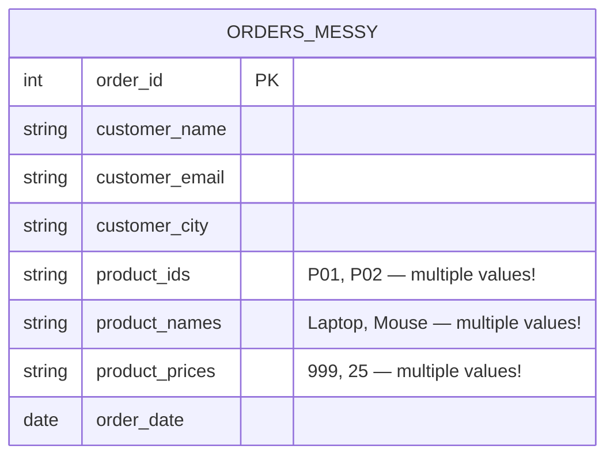
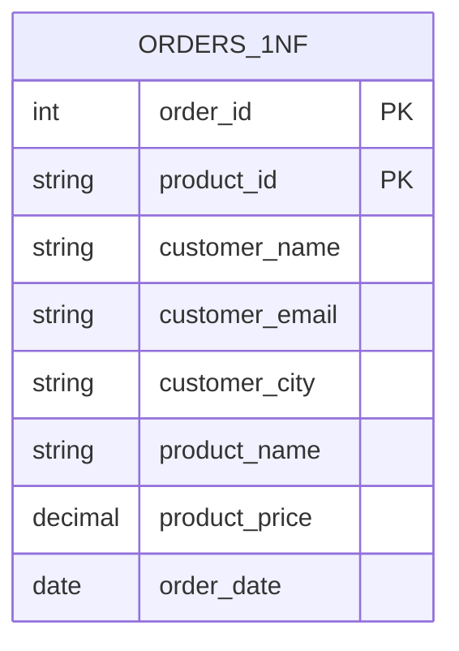
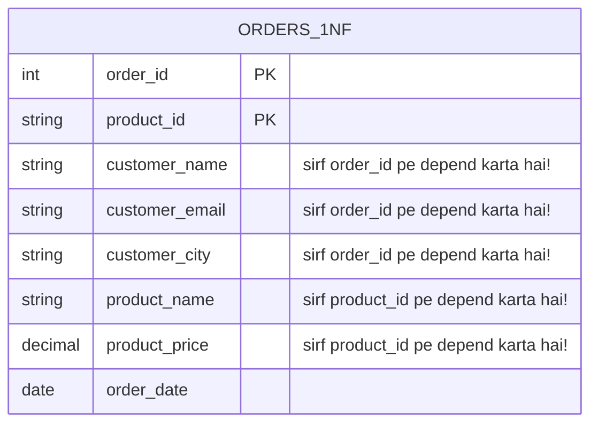
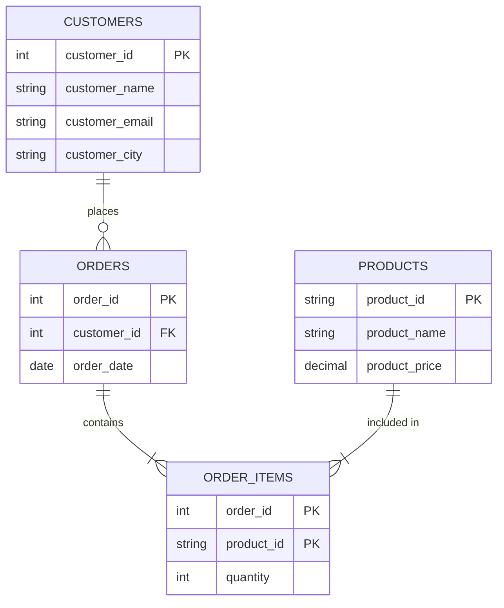
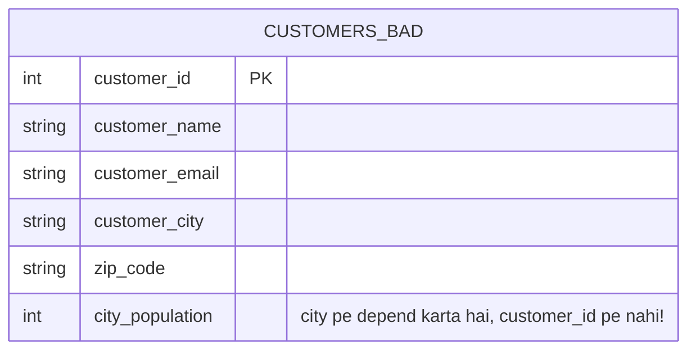

# 📦 Normalization

> **Goal:** Seekhna hai ki database tables ko organize kaise karein taaki data clean, consistent, aur efficient rahe — na duplicates, na hidden traps.

---

## 🤔 Normalization Hai Kya?

Normalization ek process hai **relational database ko structure karne** ka, taaki data redundancy kam ho aur data integrity badhe. Simple bhasha mein: iska matlab hai ki har piece of information exactly ek hi jagah rahe, aur tumhari tables logically organize ho.

### Almirah Wala Analogy

Socho tumhara ek gandi almirah hai. Shirts, socks, jackets — sab kuch mix karke ek saath thoos diya hai. Ek specific shirt dhoondhne mein hi 10 minute lag jaate hain. Naya shirt aaya? Bas upar se daal do pile mein. Agar saare laal kapde nikalne hain, toh pura dhundhna padega.

Ab socho tumne **us almirah ko organize kar diya** — shirts left rack pe color-wise, socks upar wale drawer mein, jackets right side. Har cheez ki apni jagah hai. Naya shirt daalna aasan, laal shirt dhoondhna 2 second ka kaam.

Normalization tumhare data ke saath yahi karta hai. Har piece of information ko ek logical, dedicated ghar deta hai.

---

## 💣 Unnormalized Data Ka Problem

Chalo ek real example se shuru karte hain. Socho tum ek e-commerce app bana rahe ho aur ek hi bada `Orders` table bana diya jisme sab kuch daal diya.

### Gandi "All-In-One" Orders Table

| order_id | customer_name | customer_email      | customer_city | product_ids  | product_names        | product_prices | order_date |
|----------|---------------|---------------------|---------------|--------------|----------------------|----------------|------------|
| 1001     | Alice Brown   | alice@email.com     | New York      | P01, P02     | Laptop, Mouse        | 999, 25        | 2024-01-15 |
| 1002     | Bob Smith     | bob@email.com       | Chicago       | P02          | Mouse                | 25             | 2024-01-16 |
| 1003     | Alice Brown   | alice@email.com     | New York      | P03          | Keyboard             | 75             | 2024-01-18 |

Pehli nazar mein toh sab theek lagta hai. Lekin ismein teen serious problems chhupi hain.

---

### Problem 1: Redundancy (Space Waste)

Alice ka naam, email, aur city **row 1 aur row 3** dono mein hai. Agar Alice 100 orders place kare, toh uska contact detail 100 baar store hoga. Isse storage waste hoti hai aur data pe bharosa karna mushkil ho jata hai — agar row 1 mein "New York" likha ho aur row 3 mein "NY", toh sahi kaunsa hai?

### Problem 2: Update Anomaly

Alice Boston shift ho gayi. Ab tumhe **har us row ko update karna padega** jisme Alice ka naam hai. Ek bhi row miss ho gayi toh database mein contradictory information reh jayegi. Isko kehte hain **update anomaly**.

### Problem 3: Insert Anomaly

Tumhe ek naya product (Webcam, $89) catalog mein add karna hai. Lekin is table mein `order_id` compulsory hai — usmein kya daaloge? Bina order ke product insert nahi kar sakte. Isko kehte hain **insert anomaly**.

### Problem 4: Delete Anomaly

Order 1002 Bob ka sirf ek hi order hai. Agar tum us order ko delete kar do, toh Bob ki contact information bhi hamesha ke liye chali jayegi. Isko kehte hain **delete anomaly** — ek cheez delete karne se related-unrelated sab kuch destroy ho jata hai.

---

## 🧱 Normal Forms

Normal forms rules ka ek series hain. Har form pichle form pe build hota hai. Inhe video game ke levels jaisa socho — level 1 clear kiye bina level 2 nahi khel sakte.

```
Raw Data → 1NF → 2NF → 3NF → BCNF → 4NF
          ↑ production databases ke liye sabse common stopping point ↑
```

---

## 1️⃣ First Normal Form (1NF)

### Rule Kya Hai?

> Har cell mein **ek single atomic value** honi chahiye. No lists, no sets, ek column mein repeating groups nahi hone chahiye.

"Atomic" ka matlab hai indivisible — jaise ek atom. Ek cell mein ek hi value honi chahiye, comma-separated list nahi.

### Violation Ka Example

Wapas apni original table dekho:

| order_id | product_ids | product_names  | product_prices |
|----------|-------------|----------------|----------------|
| 1001     | P01, P02    | Laptop, Mouse  | 999, 25        |

`product_ids`, `product_names`, aur `product_prices` columns mein har ek **multiple values** hain. Ye 1NF todta hai.

### BEFORE (1NF violate karta hai)



### AFTER (1NF satisfy karta hai)

Har product ko apni alag row de do:

| order_id | customer_name | customer_email   | customer_city | product_id | product_name | product_price | order_date |
|----------|---------------|------------------|---------------|------------|--------------|---------------|------------|
| 1001     | Alice Brown   | alice@email.com  | New York      | P01        | Laptop       | 999           | 2024-01-15 |
| 1001     | Alice Brown   | alice@email.com  | New York      | P02        | Mouse        | 25            | 2024-01-15 |
| 1002     | Bob Smith     | bob@email.com    | Chicago       | P02        | Mouse        | 25            | 2024-01-16 |
| 1003     | Alice Brown   | alice@email.com  | New York      | P03        | Keyboard     | 75            | 2024-01-18 |

Ab **primary key** `(order_id, product_id)` ka combination ban gaya — kyunki ek order mein multiple products ho sakte hain.



Ab har cell mein exactly ek value hai. 1NF achieve ho gaya. Lekin redundancy abhi bhi hai — Alice ki details multiple rows mein repeat ho rahi hain.

---

## 2️⃣ Second Normal Form (2NF)

### Rule Kya Hai?

> Table 1NF mein honi chahiye, AUR har **non-key column** ko **poori** primary key pe depend karna chahiye — sirf uske ek part pe nahi.

Ye tab hi matter karta hai jab tumhari primary key ek **composite key** ho (do ya usse zyada columns se milkar bani ho). Agar koi column sirf composite key ke *ek part* pe depend kare, toh use kehte hain **partial dependency** — jo 2NF ka violation hai.

### Violation Ka Example

Hamari 1NF table mein composite primary key hai: `(order_id, product_id)`.

Khud se poocho: kya `customer_name` order_id AUR product_id dono pe depend karta hai? Nahi — ye sirf `order_id` pe depend karta hai. Customer wahi rahega chahe koi bhi product order kare. Ye ek partial dependency hai.

Isi tarah `product_name` aur `product_price` sirf `product_id` pe depend karte hain, `order_id` pe nahi.

### Dependencies Ko Pehchano

```
(order_id, product_id) → order_date      ✅ full dependency
order_id               → customer_name   ❌ partial dependency
order_id               → customer_email  ❌ partial dependency
order_id               → customer_city   ❌ partial dependency
product_id             → product_name    ❌ partial dependency
product_id             → product_price   ❌ partial dependency
```

### BEFORE (2NF violate karta hai)



### AFTER (2NF satisfy karta hai)

Table ko teen alag tables mein todo, har ek ki apni focused primary key ho:

**Customers table:**

| customer_id | customer_name | customer_email   | customer_city |
|-------------|---------------|------------------|---------------|
| C01         | Alice Brown   | alice@email.com  | New York      |
| C02         | Bob Smith     | bob@email.com    | Chicago       |

**Products table:**

| product_id | product_name | product_price |
|------------|--------------|---------------|
| P01        | Laptop       | 999           |
| P02        | Mouse        | 25            |
| P03        | Keyboard     | 75            |

**Order Items table (junction wali):**

| order_id | product_id | quantity | order_date |
|----------|------------|----------|------------|
| 1001     | P01        | 1        | 2024-01-15 |
| 1001     | P02        | 2        | 2024-01-15 |
| 1002     | P02        | 1        | 2024-01-16 |
| 1003     | P03        | 1        | 2024-01-18 |

> Note: Customers ko order_ids se link karne ke liye `Orders` table bhi chahiye. Wo neeche diagram mein add karenge.



Ab har column apni poori key pe depend karta hai. 2NF achieve ho gaya.

---

## 3️⃣ Third Normal Form (3NF)

### Rule Kya Hai?

> Table 2NF mein honi chahiye, AUR koi **transitive dependency** nahi honi chahiye — non-key columns ko doosre non-key columns pe depend nahi karna chahiye.

Transitive dependency tab hoti hai jab Column C, Column B pe depend kare, aur Column B, Column A (key) pe depend kare. Toh C key se sirf *indirectly* related hai.

### Violation Ka Example

`Customers` table ko dekho:

| customer_id | customer_name | customer_email  | customer_city | zip_code | city_population |
|-------------|---------------|-----------------|---------------|----------|-----------------|
| C01         | Alice Brown   | alice@email.com | New York      | 10001    | 8336817         |
| C02         | Bob Smith     | bob@email.com   | Chicago       | 60601    | 2696555         |

Yahan, `city_population` depend karta hai `customer_city` pe, `customer_id` pe nahi. Dependency chain kuch aisi hai:

```
customer_id → customer_city → city_population
```

`city_population` ki primary key ke saath **transitive dependency** hai, jo `customer_city` ke through aa rahi hai. Ye ek violation hai.

### BEFORE (3NF violate karta hai)



### AFTER (3NF satisfy karta hai)

Transitively dependent columns ko apni alag table mein nikaal do:

**Customers table:**

| customer_id | customer_name | customer_email   | city_id |
|-------------|---------------|------------------|---------|
| C01         | Alice Brown   | alice@email.com  | NYC     |
| C02         | Bob Smith     | bob@email.com    | CHI     |

**Cities table:**

| city_id | city_name | zip_code | city_population |
|---------|-----------|----------|-----------------|
| NYC     | New York  | 10001    | 8336817         |
| CHI     | Chicago   | 60601    | 2696555         |

Ab har non-key column apni table ki primary key pe directly aur sirf usi pe depend karta hai. 3NF achieve ho gaya.

---

## 🔬 Boyce-Codd Normal Form (BCNF)

### Rule Kya Hai?

> Ye 3NF ka ek strict version hai. Har functional dependency `A → B` ke liye, A ko ek **superkey** hona chahiye (aisi key jo row ko uniquely identify kare).

BCNF un edge cases ko pakadta hai jo 3NF miss kar deta hai — usually un tables mein jahan **multiple overlapping candidate keys** hoti hain.

### Quick Example

Socho ek `Course_Assignments` table hai:

| student | course   | instructor |
|---------|----------|------------|
| Alice   | Math     | Prof. Lee  |
| Bob     | Math     | Prof. Lee  |
| Alice   | Physics  | Prof. Kim  |

Rules: Har course ka sirf ek instructor hai. Har instructor sirf ek course padhata hai.

Candidate keys: `(student, course)` ya `(student, instructor)`.

Dependency `course → instructor` exist karti hai, lekin `course` akela superkey nahi hai. Ye BCNF violate karta hai, chahe table 3NF mein ho.

**Fix:** Isko `Course_Instructors(course, instructor)` aur `Student_Courses(student, course)` mein split karo.

Practically, agar tumhari tables 3NF mein achhe se design hui hain, toh BCNF violations rare hote hain. Zyadatar production databases 3NF target karte hain aur BCNF cases jab aaye tab handle kar lete hain.

---

## 🌐 Fourth Normal Form (4NF)

### Rule Kya Hai?

> Table BCNF mein honi chahiye, AUR usmein **koi multi-valued dependency** nahi honi chahiye — jahan ek column independently doosre column mein multiple values determine kare.

### Quick Example

| employee | skill      | language |
|----------|------------|----------|
| Alice    | Python     | English  |
| Alice    | Python     | French   |
| Alice    | SQL        | English  |
| Alice    | SQL        | French   |

Alice ke skills aur languages ek doosre se **independent** hain — inka aapas mein koi lena-dena nahi hai. Naya language add karne ke liye saare skill rows duplicate karne padenge. Ye ek multi-valued dependency hai.

**Fix:** Isko `Employee_Skills(employee, skill)` aur `Employee_Languages(employee, language)` mein split karo.

4NF typical business applications mein kam hi matter karta hai. Ye zyada tar highly normalized analytical ya scientific databases mein important hota hai.

---

## 📊 Normal Forms: Quick Reference Table

| Level | Full Name             | Rule                                                         | Common Violation Example                         | Fix                                              |
|-------|-----------------------|--------------------------------------------------------------|--------------------------------------------------|--------------------------------------------------|
| 1NF   | First Normal Form     | Sirf atomic values, koi repeating groups nahi                | `product_ids = "P01, P02"` ek hi cell mein        | Har product ki alag row                          |
| 2NF   | Second Normal Form    | Composite key pe koi partial dependency nahi                 | `customer_name` sirf `order_id` pe depend karta hai | Customer data ko Customers table mein move karo  |
| 3NF   | Third Normal Form     | Koi transitive dependency nahi                                | `city_population` city pe depend karta hai, key pe nahi | City data ko Cities table mein move karo   |
| BCNF  | Boyce-Codd Normal Form| Har determinant superkey hona chahiye                         | `course → instructor` jahan course key nahi hai   | Course_Instructors aur Student_Courses mein split karo|
| 4NF   | Fourth Normal Form    | Koi multi-valued dependency nahi                              | Employee skills aur languages cross-joined        | Alag skill aur language tables mein split karo    |

---

## ⚡ Denormalization: Rules Ko Jaan-Boojh Kar Todna

Data integrity ke liye normalization bahut badhiya hai. Lekin kabhi-kabhi performance-critical scenarios mein ye tumhare against kaam karta hai. **Denormalization** ek deliberate decision hai jisme speed ke liye redundancy wapas introduce ki jaati hai.

### Denormalize Kyun Karein?

Ye query socho: "Dashboard ke liye saare orders customer name, product name, aur quantity ke saath do."

Fully normalized schema mein, iske liye 4 tables join karne padenge:

```sql
SELECT c.customer_name, p.product_name, oi.quantity, o.order_date
FROM orders o
JOIN customers c ON o.customer_id = c.customer_id
JOIN order_items oi ON o.order_id = oi.order_id
JOIN products p ON oi.product_id = p.product_id;
```

Joins expensive hoti hain. Agar dashboard ye query din mein lakh baar chalata hai, 5 crore rows wali table pe, toh ye kaafi slow ho sakta hai.

Ek denormalized approach mein data ko pre-join karke ek single `order_summary` table mein daal do:

| order_id | customer_name | product_name | quantity | order_date |
|----------|---------------|--------------|----------|------------|
| 1001     | Alice Brown   | Laptop       | 1        | 2024-01-15 |
| 1001     | Alice Brown   | Mouse        | 2        | 2024-01-15 |

Ab dashboard query ek single table scan ban jaati hai — bahut fast. Trade-off ye hai: Alice apna naam change kare, toh tumhe multiple rows mein update karna padega.

### Common Denormalization Techniques

- **Computed columns store karna** — jaise `total_order_price` ko har baar calculate karne ke bajaye store kar lo
- **Frequently read columns duplicate karna** — jaise `customer_name` ko orders table mein bhi rakhna
- **Pre-aggregated summary tables** — jaise ek `daily_sales_summary` table
- **Flattened denormalized tables reporting ke liye** — wide tables jismein sara relevant data ek jagah ho

---

## 🔀 Kab Normalize Karein Vs Kab Denormalize

Iska jawaab bahut depend karta hai ki tumhara database kya kar raha hai.

### OLTP (Online Transaction Processing) — Normalize Karo

OLTP systems un apps ko power karte hain jo real-time writes handle karte hain: order place karna, profile update karna, payment process karna. Ye systems:

- Data frequently write karte hain
- Data integrity chahiye (koi anomalies nahi)
- Bahut saare chhote transactions handle karte hain
- Duplicate data afford nahi kar sakte jo out of sync ho jaaye

**Verdict: 3NF tak normalize karo.** Data integrity priority hai. Tumhara app joins handle kar lega.

Examples: e-commerce platforms, banking systems, CRM tools.

### OLAP (Online Analytical Processing) — Denormalize Karo

OLAP systems reporting aur analytics ko power karte hain: revenue dashboards, sales trends, business intelligence. Ye systems:

- Write se kahin zyada read karte hain
- Bade datasets pe fast query response chahiye
- Aksar star schemas ya snowflake schemas use karte hain
- Kuch redundancy tolerate kar lete hain kyunki data batch mein update hota hai, real-time mein nahi

**Verdict: Jaan-boojh kar denormalize karo.** Speed priority hai. Data warehouses jaise tools (Snowflake, BigQuery, Redshift) isi ke liye bane hain.

Examples: analytics dashboards, reporting databases, machine learning feature stores.

### Decision Framework

```
Kya writes frequent hain aur integrity critical hai?
  HAAN → Normalize karo (OLTP)

Kya reads dominant hain aur performance joins ki wajah se bottleneck ho rahi hai?
  HAAN → Denormalization consider karo (OLAP)

Sure nahi ho?
  → Normalized se shuru karo. Denormalize sirf tab karo jab real performance problem measure kar sako.
```

> "Premature optimization is the root of all evil." — Donald Knuth. Pehle normalize karo, denormalize tab karo jab data proof de de ki zaroorat hai.

---

## 🔑 Key Takeaways

1. **Normalization = redundancy hataana.** Har piece of data exactly ek jagah rehta hai.

2. **Normal forms ek doosre pe build hote hain.** 2NF ke liye 1NF chahiye. 3NF ke liye 2NF chahiye. Levels skip nahi kar sakte.

3. **1NF:** Sirf atomic values — ek cell mein lists nahi.

4. **2NF:** Har non-key column POORI composite key pe depend kare — koi partial dependencies nahi.

5. **3NF:** Koi transitive dependencies nahi — non-key columns doosre non-key columns pe depend nahi karte.

6. **BCNF aur 4NF** edge cases handle karte hain. Zyadatar production databases 3NF target karte hain.

7. **Denormalization ek galti nahi, ek tool hai.** Ye read performance ke liye ek deliberate, measured trade-off hai.

8. **OLTP databases normalization prefer karte hain.** OLAP/analytics databases aksar denormalization prefer karte hain.

9. **Doubt ho toh pehle normalize karo.** Redundancy tabhi add karo jab prove kar sako ki isse real performance problem solve hoti hai.

---

## 🧠 Quiz

**Question 1**

Tumhare paas ye table hai, primary key `employee_id` ke saath:

| employee_id | employee_name | department_id | department_name |
|-------------|---------------|---------------|-----------------|
| E01         | Carol         | D01           | Engineering     |
| E02         | Dave          | D01           | Engineering     |
| E03         | Eve           | D02           | Marketing       |

Ye kaunsa normal form violate karta hai, aur kyun?

<details>
<summary>Answer Dekho</summary>

Ye **Third Normal Form (3NF)** violate karta hai. Ek transitive dependency hai: `employee_id → department_id → department_name`. `department_name`, `department_id` pe depend karta hai, `employee_id` pe directly nahi. Fix: `department_id` aur `department_name` ko alag `Departments` table mein move karo.

</details>

---

**Question 2**

Ek table ki composite primary key `(order_id, product_id)` hai. Column `order_date` sirf `order_id` pe depend karta hai. Ye kaunsa normal form violate karta hai?

<details>
<summary>Answer Dekho</summary>

Ye **Second Normal Form (2NF)** violate karta hai. `order_date` ki ek **partial dependency** hai — ye sirf `order_id` pe depend karta hai, jo composite key ka sirf ek part hai, poori key nahi. Fix: `order_date` ko ek `Orders` table mein move karo jahan `order_id` hi sole primary key ho.

</details>

---

**Question 3**

Tumhara analytics dashboard 5 tables ke across ek complex join chala raha hai aur load hone mein bahut time le raha hai. Ek colleague suggest karta hai ki pre-joined data ko ek single flat table mein store kar do. Kya ye achha idea hai? Trade-off kya hai?

<details>
<summary>Answer Dekho</summary>

Haan, ye **denormalization** hai — aur ye ek achha idea ho sakta hai analytics/OLAP context mein jahan read performance critical hai aur writes infrequent hain (usually batch updates). Trade-off hai **redundancy aur update complexity**: agar source data change hota hai, toh flat table ko refresh karna padega. Ye acceptable hai un dashboards ke liye jo schedule pe refresh hote hain (jaise nightly ETL). Lekin ye bura idea hoga ek transactional system ke liye jahan data frequently likha jaata hai aur accuracy real-time honi chahiye.

</details>

---

*Next Chapter: Indexes — How Databases Find Data Blazing Fast*
