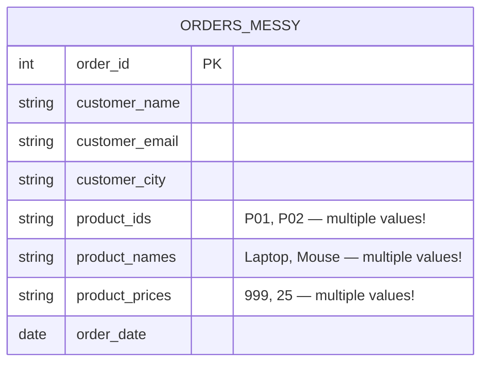
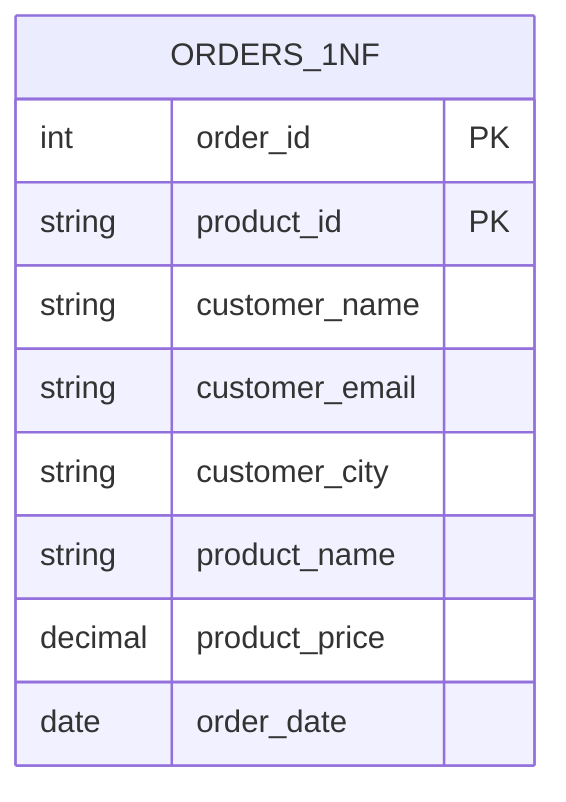
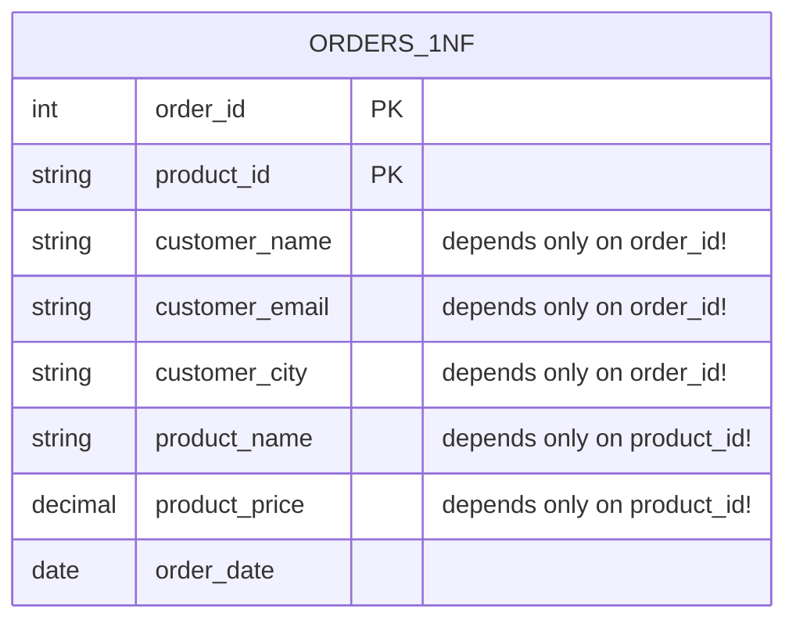
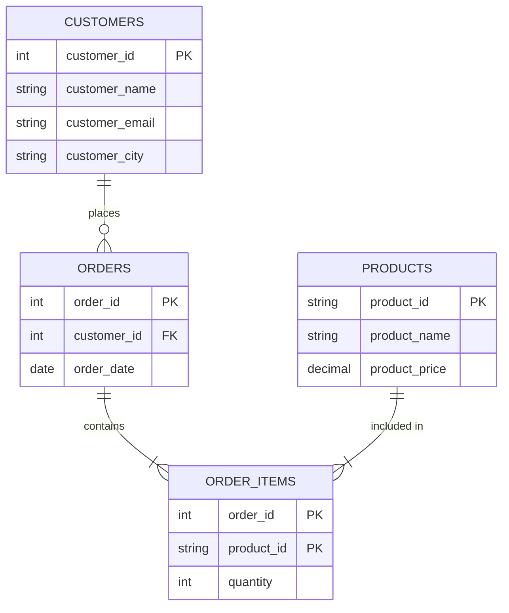
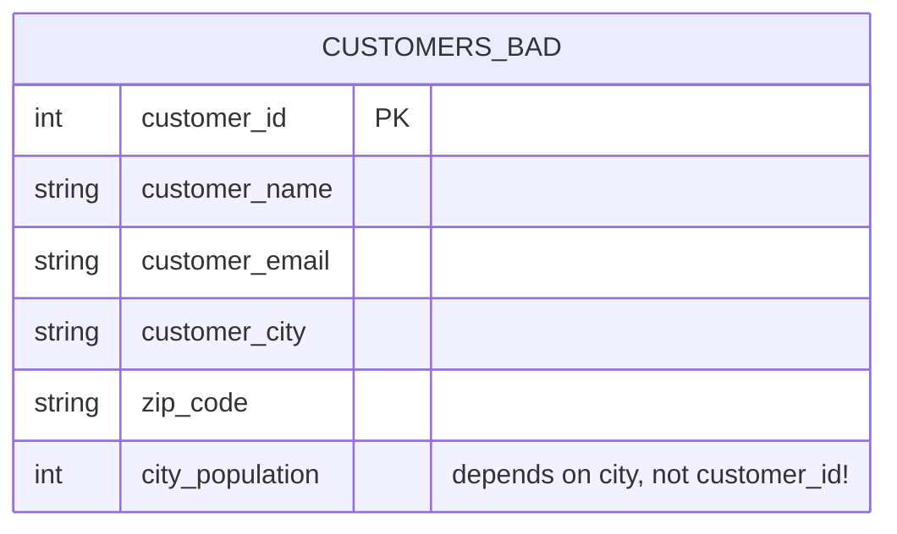

# 📦 Normalization

> **Goal:** Learn how to organize database tables so data is clean, consistent, and efficient — no duplicates, no hidden traps.

---

## 🤔 What Is Normalization?

Normalization is the process of **structuring a relational database** to reduce data redundancy and improve data integrity. In plain English: it is about making sure every piece of information lives in exactly one place, and that your tables are organized logically.

### The Closet Analogy

Imagine you have a messy bedroom closet. Shirts, socks, and jackets are all thrown in together. Finding a specific shirt takes forever. If you buy a new shirt, you just throw it on top of the pile. If you want to throw out all red clothing, you have to dig through everything.

Now imagine you **organize that closet** — shirts on the left rack, sorted by color; socks in the top drawer; jackets on the right. Everything has a place. Adding a new shirt is easy. Finding red shirts takes two seconds.

Normalization does the same thing for your data. It gives every piece of information a logical, dedicated home.

---

## 💣 The Problem with Unnormalized Data

Let us start with a real example. Imagine you are building an e-commerce app and you create one big `Orders` table to store everything.

### The Messy "All-In-One" Orders Table

| order_id | customer_name | customer_email      | customer_city | product_ids  | product_names        | product_prices | order_date |
|----------|---------------|---------------------|---------------|--------------|----------------------|----------------|------------|
| 1001     | Alice Brown   | alice@email.com     | New York      | P01, P02     | Laptop, Mouse        | 999, 25        | 2024-01-15 |
| 1002     | Bob Smith     | bob@email.com       | Chicago       | P02          | Mouse                | 25             | 2024-01-16 |
| 1003     | Alice Brown   | alice@email.com     | New York      | P03          | Keyboard             | 75             | 2024-01-18 |

This looks fine at first glance. But it is hiding three serious problems.

---

### Problem 1: Redundancy (Wasted Space)

Alice's name, email, and city appear in **row 1 and row 3**. If Alice places 100 orders, her contact details are stored 100 times. This wastes storage and makes the data harder to trust — what if row 1 says "New York" but row 3 says "NY"? Which is correct?

### Problem 2: Update Anomaly

Alice moves to Boston. You have to update **every single row** that mentions Alice. If you miss even one row, your database now contains contradictory information. This is called an **update anomaly**.

### Problem 3: Insert Anomaly

You want to add a new product (Webcam, $89) to your catalog. But this table requires an `order_id` — what do you put there? You cannot insert a product without an order. This is an **insert anomaly**.

### Problem 4: Delete Anomaly

Order 1002 is the only order Bob has ever made. If you delete that order, you lose Bob's contact information entirely. This is a **delete anomaly** — deleting one thing accidentally destroys unrelated information.

---

## 🧱 The Normal Forms

Normal forms are a series of rules. Each form builds on the previous one. Think of them as levels in a video game — you must complete level 1 before level 2.

```
Raw Data → 1NF → 2NF → 3NF → BCNF → 4NF
          ↑ most common stopping point for production databases ↑
```

---

## 1️⃣ First Normal Form (1NF)

### The Rule

> Every cell must contain a **single atomic value**. No lists, no sets, no repeating groups in a single column.

"Atomic" means indivisible — like an atom. A cell should hold one value, not a comma-separated list of values.

### Violation Example

Look at our original table again:

| order_id | product_ids | product_names  | product_prices |
|----------|-------------|----------------|----------------|
| 1001     | P01, P02    | Laptop, Mouse  | 999, 25        |

The `product_ids`, `product_names`, and `product_prices` columns each hold **multiple values**. This breaks 1NF.

### BEFORE (violates 1NF)



### AFTER (satisfies 1NF)

Split each product into its own row:

| order_id | customer_name | customer_email   | customer_city | product_id | product_name | product_price | order_date |
|----------|---------------|------------------|---------------|------------|--------------|---------------|------------|
| 1001     | Alice Brown   | alice@email.com  | New York      | P01        | Laptop       | 999           | 2024-01-15 |
| 1001     | Alice Brown   | alice@email.com  | New York      | P02        | Mouse        | 25            | 2024-01-15 |
| 1002     | Bob Smith     | bob@email.com    | Chicago       | P02        | Mouse        | 25            | 2024-01-16 |
| 1003     | Alice Brown   | alice@email.com  | New York      | P03        | Keyboard     | 75            | 2024-01-18 |

The **primary key** is now the combination of `(order_id, product_id)` — because one order can have multiple products.



Now every cell has exactly one value. 1NF achieved. But we still have redundancy — Alice's details appear in multiple rows.

---

## 2️⃣ Second Normal Form (2NF)

### The Rule

> The table must be in 1NF, AND every **non-key column** must depend on the **entire** primary key — not just part of it.

This only matters when your primary key is a **composite key** (made of two or more columns). If a column only depends on *part* of the composite key, that is a **partial dependency** — a violation of 2NF.

### Violation Example

Our 1NF table has a composite primary key: `(order_id, product_id)`.

Ask yourself: does `customer_name` depend on both `order_id` AND `product_id`? No — it only depends on `order_id`. The customer is the same no matter which product they ordered. This is a partial dependency.

Similarly, `product_name` and `product_price` depend only on `product_id`, not on `order_id`.

### Identifying the Dependencies

```
(order_id, product_id) → order_date      ✅ full dependency
order_id               → customer_name   ❌ partial dependency
order_id               → customer_email  ❌ partial dependency
order_id               → customer_city   ❌ partial dependency
product_id             → product_name    ❌ partial dependency
product_id             → product_price   ❌ partial dependency
```

### BEFORE (violates 2NF)



### AFTER (satisfies 2NF)

Split the table into three separate tables, each with its own focused primary key:

**Customers table:**

| customer_id | customer_name | customer_email   | customer_city |
|-------------|---------------|------------------|---------------|
| C01         | Alice Brown   | alice@email.com  | New York      |
| C02         | Bob Smith     | bob@email.com    | Chicago       |

**Products table:**

| product_id | product_name | product_price |
|------------|--------------|---------------|
| P01        | Laptop       | 999           |
| P02        | Mouse        | 25            |
| P03        | Keyboard     | 75            |

**Order Items table (the junction):**

| order_id | product_id | quantity | order_date |
|----------|------------|----------|------------|
| 1001     | P01        | 1        | 2024-01-15 |
| 1001     | P02        | 2        | 2024-01-15 |
| 1002     | P02        | 1        | 2024-01-16 |
| 1003     | P03        | 1        | 2024-01-18 |

> Note: We also need an `Orders` table to link customers to order_ids. We will add that in the diagram below.



Now every column depends on its whole key. 2NF achieved.

---

## 3️⃣ Third Normal Form (3NF)

### The Rule

> The table must be in 2NF, AND there must be **no transitive dependencies** — non-key columns must not depend on other non-key columns.

A transitive dependency is when Column C depends on Column B, which depends on Column A (the key). C is only *indirectly* related to the key.

### Violation Example

Look at the `Customers` table:

| customer_id | customer_name | customer_email  | customer_city | zip_code | city_population |
|-------------|---------------|-----------------|---------------|----------|-----------------|
| C01         | Alice Brown   | alice@email.com | New York      | 10001    | 8336817         |
| C02         | Bob Smith     | bob@email.com   | Chicago       | 60601    | 2696555         |

Here, `city_population` depends on `customer_city`, not on `customer_id`. The dependency chain is:

```
customer_id → customer_city → city_population
```

`city_population` has a **transitive dependency** on the primary key through `customer_city`. This is a violation.

### BEFORE (violates 3NF)



### AFTER (satisfies 3NF)

Extract the transitively dependent columns into their own table:

**Customers table:**

| customer_id | customer_name | customer_email   | city_id |
|-------------|---------------|------------------|---------|
| C01         | Alice Brown   | alice@email.com  | NYC     |
| C02         | Bob Smith     | bob@email.com    | CHI     |

**Cities table:**

| city_id | city_name | zip_code | city_population |
|---------|-----------|----------|-----------------|
| NYC     | New York  | 10001    | 8336817         |
| CHI     | Chicago   | 60601    | 2696555         |

Now every non-key column depends directly and only on the primary key of its table. 3NF achieved.

---

## 🔬 Boyce-Codd Normal Form (BCNF)

### The Rule

> A stricter version of 3NF. For every functional dependency `A → B`, A must be a **superkey** (a key that uniquely identifies a row).

BCNF catches edge cases that 3NF misses — usually in tables with **multiple overlapping candidate keys**.

### Quick Example

Imagine a `Course_Assignments` table:

| student | course   | instructor |
|---------|----------|------------|
| Alice   | Math     | Prof. Lee  |
| Bob     | Math     | Prof. Lee  |
| Alice   | Physics  | Prof. Kim  |

Rules: Each course has only one instructor. Each instructor teaches only one course.

Candidate keys: `(student, course)` or `(student, instructor)`.

The dependency `course → instructor` exists, but `course` alone is not a superkey. This violates BCNF even though the table is in 3NF.

**Fix:** Split into `Course_Instructors(course, instructor)` and `Student_Courses(student, course)`.

In everyday practice, if your tables are well-designed at 3NF, BCNF violations are rare. Most production databases aim for 3NF and handle BCNF cases as they arise.

---

## 🌐 Fourth Normal Form (4NF)

### The Rule

> The table must be in BCNF, AND it must have **no multi-valued dependencies** — where one column independently determines multiple values in another column.

### Quick Example

| employee | skill      | language |
|----------|------------|----------|
| Alice    | Python     | English  |
| Alice    | Python     | French   |
| Alice    | SQL        | English  |
| Alice    | SQL        | French   |

Alice's skills and languages are **independent** of each other — they do not interact. Adding a new language requires duplicating all skill rows. This is a multi-valued dependency.

**Fix:** Split into `Employee_Skills(employee, skill)` and `Employee_Languages(employee, language)`.

4NF is rarely a concern in typical business applications. It matters most in highly normalized analytical or scientific databases.

---

## 📊 Normal Forms: Quick Reference Table

| Level | Full Name             | Rule                                                         | Common Violation Example                         | Fix                                              |
|-------|-----------------------|--------------------------------------------------------------|--------------------------------------------------|--------------------------------------------------|
| 1NF   | First Normal Form     | Atomic values only, no repeating groups                      | `product_ids = "P01, P02"` in one cell           | One row per product                              |
| 2NF   | Second Normal Form    | No partial dependencies on a composite key                   | `customer_name` depends only on `order_id`       | Move customer data to a Customers table          |
| 3NF   | Third Normal Form     | No transitive dependencies                                   | `city_population` depends on `city`, not the key | Move city data to a Cities table                 |
| BCNF  | Boyce-Codd Normal Form| Every determinant must be a superkey                         | `course → instructor` where course is not a key  | Split into Course_Instructors and Student_Courses|
| 4NF   | Fourth Normal Form    | No multi-valued dependencies                                 | Employee skills and languages cross-joined       | Split into separate skill and language tables    |

---

## ⚡ Denormalization: Breaking the Rules on Purpose

Normalization is great for data integrity. But sometimes it works against you in performance-critical scenarios. **Denormalization** is the deliberate decision to reintroduce redundancy for speed.

### Why You Might Denormalize

Consider this query: "Get all orders with customer name, product name, and quantity for the dashboard."

With a fully normalized schema, this requires joining 4 tables:

```sql
SELECT c.customer_name, p.product_name, oi.quantity, o.order_date
FROM orders o
JOIN customers c ON o.customer_id = c.customer_id
JOIN order_items oi ON o.order_id = oi.order_id
JOIN products p ON oi.product_id = p.product_id;
```

Joins are expensive. On a dashboard that runs this query a million times a day against a table with 50 million rows, this can be painfully slow.

A denormalized approach might pre-join the data into a single `order_summary` table:

| order_id | customer_name | product_name | quantity | order_date |
|----------|---------------|--------------|----------|------------|
| 1001     | Alice Brown   | Laptop       | 1        | 2024-01-15 |
| 1001     | Alice Brown   | Mouse        | 2        | 2024-01-15 |

Now the dashboard query is a single table scan — blazing fast. The trade-off: if Alice changes her name, you have to update it in multiple rows.

### Common Denormalization Techniques

- **Storing computed columns** — e.g., `total_order_price` instead of calculating it every time
- **Duplicating frequently read columns** — e.g., storing `customer_name` in the orders table
- **Pre-aggregated summary tables** — e.g., a `daily_sales_summary` table
- **Flattened denormalized tables for reporting** — wide tables with all relevant data in one place

---

## 🔀 When to Normalize vs. Denormalize

The answer depends heavily on what your database is doing.

### OLTP (Online Transaction Processing) — Normalize

OLTP systems power apps that handle real-time writes: placing an order, updating a profile, processing a payment. These systems:

- Write data frequently
- Need data integrity (no anomalies)
- Deal with many small transactions
- Cannot afford duplicate data that gets out of sync

**Verdict: Normalize to 3NF.** Data integrity is the priority. Your app will handle the joins.

Examples: e-commerce platforms, banking systems, CRM tools.

### OLAP (Online Analytical Processing) — Denormalize

OLAP systems power reporting and analytics: revenue dashboards, sales trends, business intelligence. These systems:

- Read data far more than they write it
- Need fast query response on huge datasets
- Often use star schemas or snowflake schemas
- Tolerate some redundancy because data is updated in batch, not real-time

**Verdict: Denormalize deliberately.** Speed is the priority. Tools like data warehouses (Snowflake, BigQuery, Redshift) are built for this.

Examples: analytics dashboards, reporting databases, machine learning feature stores.

### The Decision Framework

```
Are writes frequent and integrity critical?
  YES → Normalize (OLTP)

Are reads dominant and performance is bottlenecked by joins?
  YES → Consider denormalization (OLAP)

Are you unsure?
  → Start normalized. Denormalize only when you can measure a real performance problem.
```

> "Premature optimization is the root of all evil." — Donald Knuth. Normalize first, denormalize when you have data proving you need to.

---

## 🔑 Key Takeaways

1. **Normalization = removing redundancy.** Every piece of data lives in exactly one place.

2. **The normal forms build on each other.** 2NF requires 1NF. 3NF requires 2NF. You cannot skip levels.

3. **1NF:** Atomic values only — no lists in a single cell.

4. **2NF:** Every non-key column depends on the WHOLE composite key — no partial dependencies.

5. **3NF:** No transitive dependencies — non-key columns must not depend on other non-key columns.

6. **BCNF and 4NF** handle edge cases. Most production databases target 3NF.

7. **Denormalization is a tool, not a mistake.** It is a deliberate, measured trade-off for read performance.

8. **OLTP databases prefer normalization.** OLAP/analytics databases often prefer denormalization.

9. **When in doubt, normalize first.** Add redundancy only when you can prove it solves a real performance problem.

---

## 🧠 Quiz

**Question 1**

You have the following table with primary key `employee_id`:

| employee_id | employee_name | department_id | department_name |
|-------------|---------------|---------------|-----------------|
| E01         | Carol         | D01           | Engineering     |
| E02         | Dave          | D01           | Engineering     |
| E03         | Eve           | D02           | Marketing       |

Which normal form does this violate, and why?

<details>
<summary>Show Answer</summary>

This violates **Third Normal Form (3NF)**. There is a transitive dependency: `employee_id → department_id → department_name`. The `department_name` depends on `department_id`, not directly on `employee_id`. Fix: move `department_id` and `department_name` into a separate `Departments` table.

</details>

---

**Question 2**

A table has the composite primary key `(order_id, product_id)`. The column `order_date` depends only on `order_id`. Which normal form does this violate?

<details>
<summary>Show Answer</summary>

This violates **Second Normal Form (2NF)**. `order_date` has a **partial dependency** — it depends only on `order_id`, which is just part of the composite key, not the whole key. Fix: move `order_date` to an `Orders` table where `order_id` is the sole primary key.

</details>

---

**Question 3**

Your analytics dashboard is running a complex join across 5 tables and is too slow to load. A colleague suggests storing the pre-joined data in a single flat table. Is this a good idea? What is the trade-off?

<details>
<summary>Show Answer</summary>

Yes, this is **denormalization** — and it can be a good idea in an analytics/OLAP context where read performance is critical and writes are infrequent (usually batch updates). The trade-off is **redundancy and update complexity**: if the source data changes, the flat table must be refreshed. This is acceptable for dashboards that are refreshed on a schedule (e.g., nightly ETL). It would be a bad idea for a transactional system where data is written frequently and accuracy must be real-time.

</details>

---

*Next Chapter: Indexes — How Databases Find Data Blazing Fast*
