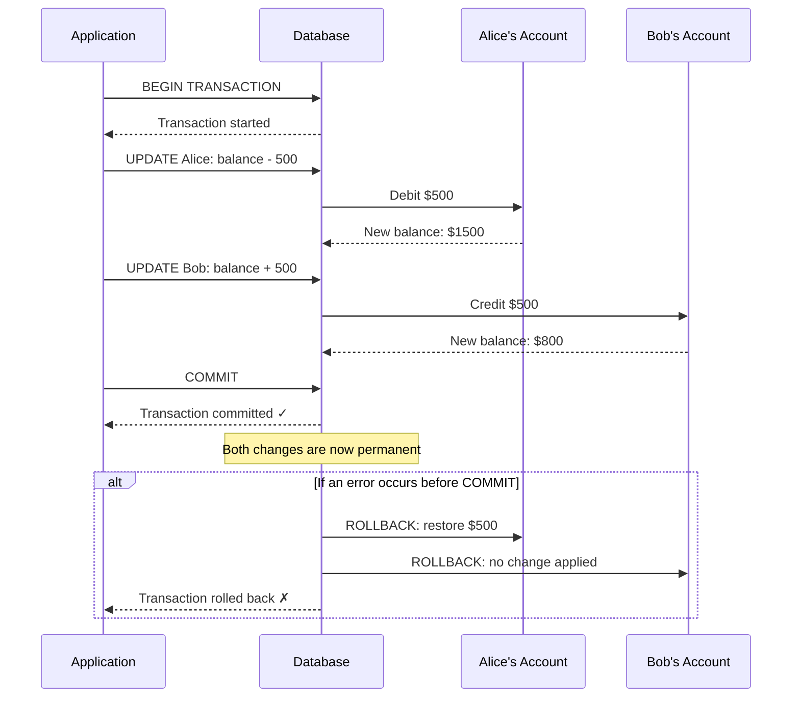

# Chapter 5: ACID Properties

> "Databases promises karte hain. ACID unke promises nibhaane ka tarika hai."

---

## Table of Contents

1. [Transaction Kya Hota Hai?](#what-is-a-transaction)
2. [Real-World Analogy: Bank Transfer](#real-world-analogy-bank-transfer)
3. [A — Atomicity](#a--atomicity)
4. [C — Consistency](#c--consistency)
5. [I — Isolation](#i--isolation)
6. [D — Durability](#d--durability)
7. [COMMIT, ROLLBACK, aur SAVEPOINT](#commit-rollback-and-savepoint)
8. [Cross-Database Default Isolation Levels](#cross-database-default-isolation-levels)
9. [Key Takeaways](#key-takeaways)
10. [Quiz](#quiz)

---

## 🔄 Transaction Kya Hota Hai?

Socho tumne UPI se paise transfer kiye — ek nahi, do steps hote hain: pehle tumhare account se paisa katega, phir doosre ke account mein add hoga. Ab agar beech mein kuch fail ho jaaye toh? Yahi cheez handle karne ke liye **transaction** hota hai.

Ek **transaction** ek **unit of work** hai — SQL operations ka ek group jinhe database ek hi single, indivisible action ki tarah treat karta hai. Database guarantee deta hai ki ya toh **transaction ke saare operations successful honge**, ya phir **koi bhi apply nahi hoga**. Beech ka koi option nahi hai.

Transaction ko ek promise samjho: "Main ye saare kaam ek saath karunga, ya phir sab undo kar dunga jaise kuch hua hi nahi."

```sql
-- A transaction wrapping two related operations
BEGIN;

  UPDATE accounts SET balance = balance - 500 WHERE account_id = 1;
  UPDATE accounts SET balance = balance + 500 WHERE account_id = 2;

COMMIT;
```

Upar wale example mein dono `UPDATE` statements ek hi transaction ka part hain. Database kabhi bhi ek ko success aur doosre ko fail nahi hone dega.

---

## 🏦 Real-World Analogy: Bank Transfer

Socho tumhe **Alice ke account** se **Bob ke account** mein $500 transfer karna hai — bilkul Paytm se paise bhejne jaisa.

Database level pe iska matlab hai do alag operations:

1. **Alice ko debit karo**: Alice ke balance se $500 minus karo
2. **Bob ko credit karo**: Bob ke balance mein $500 add karo

Ab socho — agar step 1 ke baad light chali jaye, step 2 se pehle? Transactions ke bina, Alice ke $500 gayab ho jaayenge aur Bob ko kabhi milenge hi nahi — paisa hawa mein udd jaayega!

Transaction ke saath, database guarantee deta hai: **ya toh dono operations complete honge, ya koi bhi nahi**. Agar beech mein kuch galat hua, toh Alice ka debit automatically reverse (rollback) ho jaayega.

Yahan ek sequence diagram hai jo ye flow dikhata hai:



Ye "all or nothing" guarantee hi ACID ka core idea hai.

---

## ⚛️ A — Atomicity

**Atomicity** ka matlab hai ek transaction **atomic** hota hai — indivisible, yaani usse chhote pieces mein todha nahi ja sakta (jaise atom, classical sense mein). Ya toh transaction ke andar ke saare operations succeed karenge, ya phir poora transaction rollback ho jaayega jaise hua hi nahi.

### Kyun Zaruri Hai?

Agar atomicity na ho, toh partial updates tumhara data corrupt kar sakte hain. Socho ek half-completed bank transfer kaisa dikhega:

| State | Alice's Balance | Bob's Balance | Total Money |
|---|---|---|---|
| Transfer se pehle | $2,000 | $300 | $2,300 |
| Debit ke baad (atomicity nahi) | $1,500 | $300 | $1,800 |
| Dono steps ke baad (atomic) | $1,500 | $800 | $2,300 |

Atomicity ke bina $500 seedha gayab ho jaate hain. Atomicity ke saath, ya toh total $2,300 hi rehta hai, ya original state — kabhi bhi ek broken beech ki state nahi.

### Databases Isse Kaise Implement Karte Hain

Databases ek mechanism use karte hain jisse **transaction log** (ya undo log) kehte hain, jo transaction ke dauraan har change track karta hai. Agar kuch fail ho jaaye — crash, constraint violation, application error — database is log ka use karke saare changes **undo** kar deta hai, wapas transaction shuru hone se pehle wali state pe.

```sql
BEGIN;

  UPDATE accounts SET balance = balance - 500 WHERE account_id = 1; -- Alice
  UPDATE accounts SET balance = balance + 500 WHERE account_id = 99; -- Bob (wrong ID!)

  -- The second UPDATE fails: account_id 99 does not exist
  -- The database automatically rolls back the first UPDATE too

COMMIT; -- Never reached
```

Result: Alice ka debit reverse ho jaata hai. Data safe rehta hai.

---

## ✅ C — Consistency

**Consistency** ka matlab hai ek transaction database ko **ek valid state se doosri valid state** mein le jaata hai. Database ke rules — uske constraints — kabhi bhi violate nahi hote, chahe transaction se pehle ho, dauraan ho, ya baad mein.

### "Consistent State" Ka Matlab Kya Hai

Ek consistent state woh hai jahan saare defined rules satisfy ho rahe hon:

- **Primary Key constraints**: koi duplicate IDs nahi
- **Foreign Key constraints**: koi orphaned references nahi
- **NOT NULL constraints**: required fields mein hamesha value ho
- **CHECK constraints**: values allowed range mein hi hon
- **UNIQUE constraints**: unique columns mein koi duplicate value nahi

Agar transaction ke andar koi bhi operation in rules mein se kisi ko break karega, toh **poora transaction reject** ho jaata hai.

### Example

```sql
-- Suppose accounts.balance has a CHECK constraint: balance >= 0
-- Alice currently has $200

BEGIN;

  UPDATE accounts SET balance = balance - 500 WHERE account_id = 1;
  -- This would set balance to -300, violating CHECK(balance >= 0)
  -- The database rejects the transaction

COMMIT; -- Never reached
```

Database kabhi bhi invalid state mein nahi jaata. Alice ka balance $200 pe hi rehta hai.

### Consistency vs. Application Logic

Ye samajhna zaruri hai ki **ACID mein consistency** database-level constraints ko refer karta hai. Business logic consistency (jaise, "ek user ke paas 5 se zyada active subscriptions nahi ho sakte") tumhari application ki responsibility hai. Database sirf wahi enforce karta hai jo tumne explicitly constraint ki tarah define kiya hai.

---

## 🔒 I — Isolation

**Isolation** control karta hai ki **concurrent transactions ek doosre ke saath kaise interact karte hain**. Real system mein, sau-do-sau transactions ek saath chal rahe hote hain — bilkul Swiggy ke peak dinner time jaisa, jahan hazaaron orders parallel mein process ho rahe hote hain. Isolation ensure karta hai ki wo ek doosre ke pair pe pair na rakhein unexpected tarike se.

### Isolation Kaunse Problems Solve Karta Hai

Proper isolation ke bina, teen tarah ki read anomalies ho sakti hain:

#### 1. Dirty Read
Transaction A wo data padhta hai jo Transaction B ne likha hai **lekin abhi commit nahi kiya**. Agar B baad mein rollback kar de, toh A ne aisa data padh liya jo kabhi officially exist hi nahi kiya.

```
Time →
T1:  BEGIN → reads balance ($500, written by T2 but not committed)
T2:  BEGIN → writes balance = $500 → ROLLBACK (balance reverts to $300)
T1:  uses $500 (which is now "dirty" — it was never real)
```

#### 2. Non-Repeatable Read
Transaction A ek hi row ko do baar padhta hai aur **alag-alag values** milti hain, kyunki Transaction B ne A ke do reads ke beech mein row update karke commit kar diya.

```
Time →
T1:  BEGIN → reads balance = $300
T2:  BEGIN → updates balance to $500 → COMMIT
T1:  reads balance again = $500  ← different from first read!
```

#### 3. Phantom Read
Transaction A ek hi query do baar chalata hai aur **rows ka alag set** milta hai, kyunki Transaction B ne A ke do queries ke beech mein rows insert ya delete kar diye.

```
Time →
T1:  SELECT COUNT(*) FROM orders WHERE user_id = 7  → returns 3
T2:  INSERT INTO orders (user_id, ...) VALUES (7, ...)  → COMMIT
T1:  SELECT COUNT(*) FROM orders WHERE user_id = 7  → returns 4  ← phantom row!
```

---

### Isolation Levels

SQL char standard isolation levels deta hai, har ek **data accuracy** aur **performance** ke beech alag trade-off deta hai (jitna zyada isolation, utna zyada locking, utna slower concurrency).

#### READ UNCOMMITTED (Sabse Kam)
- Transactions doosre transactions ke **uncommitted changes** padh sakte hain
- Sabse fast, lekin sabse kam safe
- Dirty reads, non-repeatable reads, aur phantom reads — sab possible hain
- Practice mein rarely use hota hai

```sql
SET TRANSACTION ISOLATION LEVEL READ UNCOMMITTED;
```

#### READ COMMITTED
- Transactions sirf **committed data** padhte hain
- Dirty reads eliminate ho jaate hain
- Non-repeatable reads aur phantom reads abhi bhi possible hain
- **PostgreSQL, SQL Server, aur Oracle ka default**

```sql
SET TRANSACTION ISOLATION LEVEL READ COMMITTED;
```

#### REPEATABLE READ
- Guarantee deta hai ki agar tumne ek row ek baar transaction mein padhi, toh dobara padhne pe **same value** milegi
- Dirty reads aur non-repeatable reads eliminate ho jaate hain
- Phantom reads abhi bhi possible hain (naye rows appear ho sakte hain)
- **MySQL InnoDB ka default**

```sql
SET TRANSACTION ISOLATION LEVEL REPEATABLE READ;
```

#### SERIALIZABLE (Sabse Zyada)
- Transactions aise behave karte hain jaise wo **ek-ek karke, sequentially** execute hue hon
- Saari anomalies eliminate ho jaati hain: dirty reads, non-repeatable reads, phantom reads
- Sabse safe, lekin locking aur blocking ki wajah se kaafi slow ho sakta hai
- Use karo jab absolute correctness chahiye (jaise financial reconciliation)

```sql
SET TRANSACTION ISOLATION LEVEL SERIALIZABLE;
```

---

### Isolation Levels Summary Table

| Isolation Level | Dirty Read | Non-Repeatable Read | Phantom Read | Performance |
|---|---|---|---|---|
| READ UNCOMMITTED | Possible | Possible | Possible | Fastest |
| READ COMMITTED | Prevented | Possible | Possible | Fast |
| REPEATABLE READ | Prevented | Prevented | Possible | Moderate |
| SERIALIZABLE | Prevented | Prevented | Prevented | Slowest |

> [!tip]
> Rule of thumb: READ COMMITTED se shuru karo (sabse common default). Isolation ko SERIALIZABLE tak tabhi badhao jab tumhe correctness problems dikhein. READ UNCOMMITTED tab tak use mat karo jab tak koi bahut specific reason na ho aur tumhe risks poori tarah samajh na aayein.

---

## 💾 D — Durability

**Durability** ka matlab hai ki ek baar transaction **commit** ho jaaye, toh uske changes **permanent** ho jaate hain — chahe server turant crash ho jaaye.

### Durability Ke Bina Problem Kya Hai

Socho tumne ek payment transaction commit kiya aur success confirmation dikha. Uske turant baad server ki power chali gayi. Jab wapas start hoga, kya tumhara payment abhi bhi wahan hoga? Durability ke saath, haan — hamesha.

### Durability Kaise Kaam Karta Hai: Write-Ahead Logging (WAL)

Databases durability implement karte hain ek technique se jisse **Write-Ahead Logging (WAL)** kehte hain. Idea simple hai lekin powerful hai:

> **Actual data files mein koi bhi change likhne se pehle, database sabse pehle change ko ek log file mein record karta hai.**

Log file sequential hoti hai aur likhne mein fast hoti hai. Chahe server mid-operation crash ho jaaye, database startup pe **log ko replay** karke ek consistent, committed state pe recover kar sakta hai.

Yahan simplified WAL flow hai:

```
1. Transaction begins
2. Changes are made in memory (buffer pool)
3. The change is written to the WAL log file on disk  ← this happens FIRST
4. The database confirms COMMIT to the application
5. Eventually, the actual data files are updated on disk
```

Agar server step 3 aur 5 ke beech crash ho jaaye, WAL log mein itni information hoti hai ki server restart hone pe committed changes ko redo kiya ja sake. Committed transaction kabhi lost nahi hota.

### Sequential Log Writes Itni Fast Kyun Hoti Hain

Ek sequential log file ke end mein likhna, disk ke idhar-udhar bikhre hue data files mein random writes karne se kaafi fast hota hai. Isi wajah se WAL databases ko fast transaction commit karne deta hai, wo bhi durability guarantee karte hue.

```
WAL Log (sequential, on disk):
[LSN 1001] BEGIN tx_42
[LSN 1002] UPDATE accounts SET balance=1500 WHERE id=1
[LSN 1003] UPDATE accounts SET balance=800 WHERE id=2
[LSN 1004] COMMIT tx_42   ← Once this is written, durability is guaranteed
```

---

## 🔁 COMMIT, ROLLBACK, aur SAVEPOINT

### COMMIT

`COMMIT` transaction ko end karta hai aur uske saare changes **permanent** bana deta hai. Commit ke baad, doosre transactions ye changes dekh sakte hain, aur ye changes crashes ke baad bhi survive karte hain.

```sql
BEGIN;
  INSERT INTO orders (user_id, total) VALUES (7, 249.99);
  UPDATE inventory SET stock = stock - 1 WHERE product_id = 42;
COMMIT; -- Both changes are now permanent
```

### ROLLBACK

`ROLLBACK` transaction ko end karta hai aur transaction shuru hone ke baad se hue **saare changes ko undo** kar deta hai. Database exactly usi state mein wapas chala jaata hai jaisa `BEGIN` se pehle tha.

```sql
BEGIN;
  DELETE FROM users WHERE user_id = 5;
  -- Wait, that was the wrong user!
ROLLBACK; -- The DELETE never happened
```

### SAVEPOINT

`SAVEPOINT` transaction ke andar ek **named checkpoint** banata hai. Tum poore transaction ko chhode bina, ek savepoint tak rollback kar sakte ho. Ye complex transactions ke liye useful hai, jahan tum ek sub-step ko retry karna chahte ho bina apna pehle ka kaam khoye.

```sql
BEGIN;

  INSERT INTO orders (user_id, total) VALUES (7, 249.99);   -- Step 1
  SAVEPOINT after_order;                                     -- Checkpoint

  INSERT INTO order_items (order_id, product_id) VALUES (1, 42);  -- Step 2
  -- Oops, wrong product. Roll back just Step 2:
  ROLLBACK TO SAVEPOINT after_order;

  INSERT INTO order_items (order_id, product_id) VALUES (1, 55);  -- Retry Step 2
  RELEASE SAVEPOINT after_order;

COMMIT; -- Step 1 and the corrected Step 2 are committed
```

> [!info]
> `RELEASE SAVEPOINT` savepoint ko remove kar deta hai (tracking overhead free kar deta hai) bina rollback kiye. Ek transaction mein tum multiple savepoints alag-alag naam se rakh sakte ho.

---

## 🗄️ Cross-Database Default Isolation Levels

Alag-alag databases alag default isolation levels choose karte hain, jo unki design philosophy aur common use cases ko reflect karta hai. Ye ek **bahut important** practical detail hai — do databases "same" SQL chalate hue bhi concurrency ke under alag behave kar sakte hain.

| Database | Default Isolation Level | Notes |
|---|---|---|
| PostgreSQL | READ COMMITTED | MVCC use karta hai; snapshot behavior ki wajah se phantom reads practice mein rare hain |
| MySQL (InnoDB) | REPEATABLE READ | Gap locks is level pe bhi zyadatar phantom reads prevent kar dete hain |
| SQL Server | READ COMMITTED | Optionally RCSI (snapshot-based READ COMMITTED) enable kar sakte ho |
| Oracle | READ COMMITTED | MVCC use karta hai; sabse lowest level pe bhi dirty reads possible nahi |
| SQLite | SERIALIZABLE | Single-writer model; default se effectively serializable |

> [!warning]
> Practical tip: Jab bhi databases switch karo ya applications port karo, isolation level hamesha verify karo. Wo code jo MySQL ki REPEATABLE READ pe sahi chalta hai, wo READ COMMITTED database pe unexpectedly break ho sakta hai agar wo assume karta hai ki repeated reads identical values return karenge.

---

## 💡 Key Takeaways

- Ek **transaction** multiple SQL operations ko ek single "all-or-nothing" unit of work mein group karta hai.

- **Atomicity** ensure karta hai ki agar transaction ka koi bhi part fail ho, toh saare changes rollback ho jaayein — koi partial update kabhi persist nahi hota.

- **Consistency** ensure karta hai ki database hamesha valid states ke beech move kare, kabhi bhi defined constraints (PK, FK, NOT NULL, CHECK) violate na kare.

- **Isolation** control karta hai ki concurrent transactions ek doosre ka kaam kaise dekhte hain. Char levels — READ UNCOMMITTED, READ COMMITTED, REPEATABLE READ, SERIALIZABLE — safety aur performance ke beech trade-off karte hain.

- **Durability** ensure karta hai ki committed data crashes ke baad bhi survive kare, Write-Ahead Logging (WAL) ke through implement hota hai.

- `COMMIT` changes ko permanent banata hai; `ROLLBACK` saare changes undo karta hai; `SAVEPOINT` mid-transaction checkpoints banata hai partial rollbacks ke liye.

- Default isolation levels databases mein alag hote hain: PostgreSQL aur SQL Server READ COMMITTED use karte hain; MySQL InnoDB REPEATABLE READ use karta hai.

---

## 📝 Quiz

Apni understanding test karo. Hints dekhne se pehle khud answer karne ki koshish karo.

---

**Question 1**

Tum ek e-commerce checkout ke liye database likh rahe ho. Checkout process teen kaam karta hai:
1. Inventory se item deduct karta hai
2. Customer ka card charge karta hai (external API call ke through, jo fail ho sakti hai)
3. Ek order record create karta hai

External payment API step 1 complete hone ke baad fail ho jaati hai. Kaunsi ACID property ensure karti hai ki inventory deduction automatically undo ho jaaye, aur kaunsa SQL command ye undo trigger karta hai?

<details>
<summary>Hint</summary>

Socho kaunsi ACID property "all-or-nothing" behavior govern karti hai, aur transaction ke beech mein error aane pe kya hota hai.

</details>

<details>
<summary>Answer</summary>

**Atomicity** ensure karta hai ki teenon steps ek saath succeed karein ya koi bhi apply na ho. Jab payment API fail hoti hai, application (ya error pe database khud) `ROLLBACK` issue karta hai, jo inventory deduction ko undo kar deta hai. Order record bhi kabhi create nahi hota.

</details>

---

**Question 2**

Do transactions same time pe chal rahe hain:

- **Transaction A** ek user ka account balance padhta hai, $1,000 dikhta hai
- **Transaction B** us balance ko $750 update karta hai aur **commit** kar deta hai
- **Transaction A** balance dobara padhta hai aur ab $750 dikhta hai

Kaunsi read anomaly hui hai, aur kaunsa isolation level isse prevent karega?

<details>
<summary>Hint</summary>

Key detail ye hai ki Transaction A ne same row ko do baar padha aur ek hi transaction ke andar do alag values mili.

</details>

<details>
<summary>Answer</summary>

Ye ek **non-repeatable read** hai. Transaction A ko same row ke liye alag-alag values dikhein, ek single transaction ke andar, kyunki Transaction B ne beech mein ek change commit kar diya.

Isolation level ko **REPEATABLE READ** (ya usse zyada) set karne se ye prevent ho jaayega. REPEATABLE READ pe, Transaction A ko guarantee milti hai ki jo bhi row wo pehle padh chuka hai, uski poori transaction duration mein wahi value dikhegi.

</details>

---

**Question 3**

Ek developer argue karta hai: "Humein SERIALIZABLE isolation ki zaroorat nahi hai — bahut slow hai. Hum bas READ COMMITTED use karenge, sab theek rahega."

Ek real scenario describe karo jahan READ COMMITTED isolation galat result de sakta hai, jo SERIALIZABLE prevent kar deta. Kaunsi type ki anomaly hogi?

<details>
<summary>Hint</summary>

Socho ek transaction jo rows count karke uss count ke basis pe decision leta hai — aur doosra transaction same time pe rows insert kar raha hai.

</details>

<details>
<summary>Answer</summary>

Socho ek system jo users ko max 3 active orders tak limit karta hai. Logic ye hai:

1. Transaction A: `SELECT COUNT(*) FROM orders WHERE user_id = 7` → returns 2 (limit ke under)
2. Transaction B: `INSERT INTO orders ... WHERE user_id = 7` → commits (ab 3 orders)
3. Transaction A: proceed karke ek naya order `INSERT` karta hai → ab user 7 ke paas 4 orders hain, limit violate ho gayi

Ye ek **phantom read** hai — Transaction A ki count query dobara execute karne pe alag result deti hai. READ COMMITTED pe, Transaction A step 2 pe Transaction B ka uncommitted insert nahi dekh sakta, lekin ek baar B commit ho jaaye, toh A ki subsequent queries (ya pehle wale count pe based logic) affect ho sakti hain.

**SERIALIZABLE** pe, database ensure karta hai ki Transaction A ka `orders` table ka view uski transaction ki poori duration mein stable rahe (range locks ya predicate locking ke through), aur Transaction B ko aise rows insert karne se rokta hai jo A ke query results ko affect karein, jab tak A commit na ho jaaye.

</details>

---

*Next chapter: Indexes — How Databases Find Data Fast*
