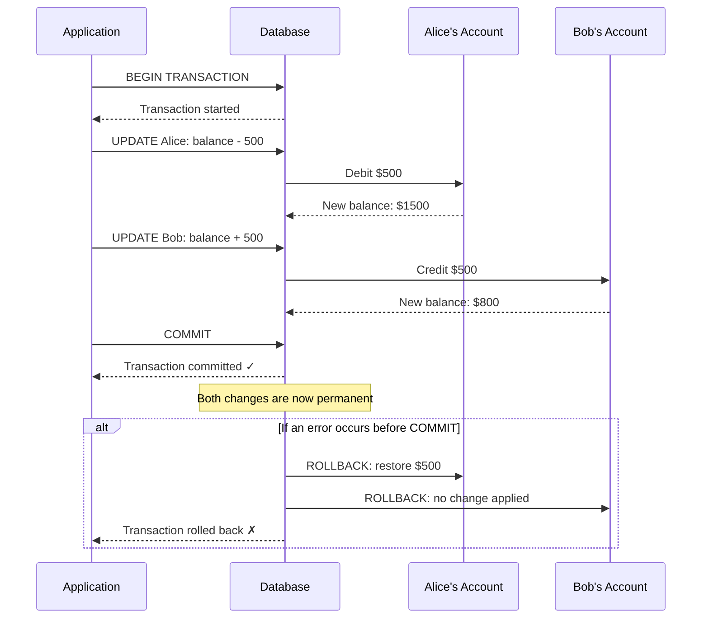

# Chapter 5: ACID Properties

> "Databases make promises. ACID is how they keep them."

---

## Table of Contents

1. [What Is a Transaction?](#what-is-a-transaction)
2. [Real-World Analogy: Bank Transfer](#real-world-analogy-bank-transfer)
3. [A — Atomicity](#a--atomicity)
4. [C — Consistency](#c--consistency)
5. [I — Isolation](#i--isolation)
6. [D — Durability](#d--durability)
7. [COMMIT, ROLLBACK, and SAVEPOINT](#commit-rollback-and-savepoint)
8. [Cross-Database Default Isolation Levels](#cross-database-default-isolation-levels)
9. [Key Takeaways](#key-takeaways)
10. [Quiz](#quiz)

---

## 🔄 What Is a Transaction?

A **transaction** is a **unit of work** — a group of one or more SQL operations that are treated as a single, indivisible action. The database guarantees that either **all operations in the transaction succeed**, or **none of them take effect**. There is no in-between.

Think of a transaction as a promise: "I will do all of these things together, or I will undo everything and pretend nothing happened."

```sql
-- A transaction wrapping two related operations
BEGIN;

  UPDATE accounts SET balance = balance - 500 WHERE account_id = 1;
  UPDATE accounts SET balance = balance + 500 WHERE account_id = 2;

COMMIT;
```

In the example above, both `UPDATE` statements are part of one transaction. The database will not let one succeed while the other fails.

---

## 🏦 Real-World Analogy: Bank Transfer

Imagine you want to transfer $500 from **Alice's account** to **Bob's account**.

At the database level, this involves two separate operations:

1. **Debit Alice**: subtract $500 from Alice's balance
2. **Credit Bob**: add $500 to Bob's balance

What happens if the power goes out after step 1 but before step 2? Without transactions, Alice loses $500 and Bob never receives it — money disappears into thin air.

With a transaction, the database guarantees: **either both operations complete, or neither does**. If anything goes wrong mid-way, the debit to Alice is automatically reversed (rolled back).

Here is a sequence diagram showing this flow:



This "all or nothing" guarantee is the essence of ACID.

---

## ⚛️ A — Atomicity

**Atomicity** means a transaction is **atomic** — indivisible. Like an atom (in the classical sense), it cannot be split into smaller pieces. Either every operation inside the transaction succeeds, or the entire transaction is rolled back as if it never happened.

### Why It Matters

Without atomicity, partial updates could corrupt your data. Consider what a half-completed bank transfer looks like:

| State | Alice's Balance | Bob's Balance | Total Money |
|---|---|---|---|
| Before transfer | $2,000 | $300 | $2,300 |
| After debit (no atomicity) | $1,500 | $300 | $1,800 |
| After both steps (atomic) | $1,500 | $800 | $2,300 |

Without atomicity, $500 simply vanishes. With atomicity, either the total stays at $2,300 or stays at the original state — never a broken in-between.

### How Databases Implement It

Databases use a mechanism called the **transaction log** (or undo log) to track every change made during a transaction. If anything fails — a crash, a constraint violation, an application error — the database uses the log to **undo** all changes back to the state before the transaction started.

```sql
BEGIN;

  UPDATE accounts SET balance = balance - 500 WHERE account_id = 1; -- Alice
  UPDATE accounts SET balance = balance + 500 WHERE account_id = 99; -- Bob (wrong ID!)

  -- The second UPDATE fails: account_id 99 does not exist
  -- The database automatically rolls back the first UPDATE too

COMMIT; -- Never reached
```

Result: Alice's debit is reversed. Data is safe.

---

## ✅ C — Consistency

**Consistency** means a transaction takes the database from **one valid state to another valid state**. The database's rules — its constraints — are never violated before, during, or after a transaction.

### What "Consistent State" Means

A consistent state is one where all defined rules are satisfied:

- **Primary Key constraints**: no duplicate IDs
- **Foreign Key constraints**: no orphaned references
- **NOT NULL constraints**: required fields always have values
- **CHECK constraints**: values fall within allowed ranges
- **UNIQUE constraints**: no duplicate values in unique columns

If any operation within a transaction would break one of these rules, the **entire transaction is rejected**.

### Example

```sql
-- Suppose accounts.balance has a CHECK constraint: balance >= 0
-- Alice currently has $200

BEGIN;

  UPDATE accounts SET balance = balance - 500 WHERE account_id = 1;
  -- This would set balance to -300, violating CHECK(balance >= 0)
  -- The database rejects the transaction

COMMIT; -- Never reached
```

The database never enters an invalid state. Alice's balance stays at $200.

### Consistency vs. Application Logic

It is important to understand that **consistency in ACID** refers to database-level constraints. Business logic consistency (e.g., "a user cannot have more than 5 active subscriptions") is your application's responsibility. The database enforces what you explicitly define as a constraint.

---

## 🔒 I — Isolation

**Isolation** controls how **concurrent transactions interact with each other**. In a real system, hundreds of transactions may be running at the same time. Isolation ensures they don't step on each other's toes in unexpected ways.

### The Problems Isolation Solves

Without proper isolation, three types of read anomalies can occur:

#### 1. Dirty Read
Transaction A reads data that Transaction B has written **but not yet committed**. If B then rolls back, A has read data that never officially existed.

```
Time →
T1:  BEGIN → reads balance ($500, written by T2 but not committed)
T2:  BEGIN → writes balance = $500 → ROLLBACK (balance reverts to $300)
T1:  uses $500 (which is now "dirty" — it was never real)
```

#### 2. Non-Repeatable Read
Transaction A reads the same row twice and gets **different values** because Transaction B updated and committed the row between A's two reads.

```
Time →
T1:  BEGIN → reads balance = $300
T2:  BEGIN → updates balance to $500 → COMMIT
T1:  reads balance again = $500  ← different from first read!
```

#### 3. Phantom Read
Transaction A executes the same query twice and gets **different sets of rows** because Transaction B inserted or deleted rows between A's two queries.

```
Time →
T1:  SELECT COUNT(*) FROM orders WHERE user_id = 7  → returns 3
T2:  INSERT INTO orders (user_id, ...) VALUES (7, ...)  → COMMIT
T1:  SELECT COUNT(*) FROM orders WHERE user_id = 7  → returns 4  ← phantom row!
```

---

### Isolation Levels

SQL provides four standard isolation levels, each offering a different trade-off between **data accuracy** and **performance** (higher isolation = more locking = slower concurrency).

#### READ UNCOMMITTED (Lowest)
- Transactions can read **uncommitted changes** from other transactions
- Fastest, but least safe
- Dirty reads, non-repeatable reads, and phantom reads are all possible
- Rarely used in practice

```sql
SET TRANSACTION ISOLATION LEVEL READ UNCOMMITTED;
```

#### READ COMMITTED
- Transactions only read **committed data**
- Eliminates dirty reads
- Non-repeatable reads and phantom reads are still possible
- **Default in PostgreSQL, SQL Server, and Oracle**

```sql
SET TRANSACTION ISOLATION LEVEL READ COMMITTED;
```

#### REPEATABLE READ
- Guarantees that if you read a row once in a transaction, it will return the **same value** if you read it again
- Eliminates dirty reads and non-repeatable reads
- Phantom reads are still possible (new rows can appear)
- **Default in MySQL InnoDB**

```sql
SET TRANSACTION ISOLATION LEVEL REPEATABLE READ;
```

#### SERIALIZABLE (Highest)
- Transactions behave as if they were executed **one at a time**, sequentially
- Eliminates all anomalies: dirty reads, non-repeatable reads, and phantom reads
- Safest, but can be significantly slower due to locking and blocking
- Use when absolute correctness is required (e.g., financial reconciliation)

```sql
SET TRANSACTION ISOLATION LEVEL SERIALIZABLE;
```

---

### Isolation Levels Summary Table

| Isolation Level | Dirty Read | Non-Repeatable Read | Phantom Read | Performance |
|---|---|---|---|---|
| READ UNCOMMITTED | Possible | Possible | Possible | Fastest |
| READ COMMITTED | Prevented | Possible | Possible | Fast |
| REPEATABLE READ | Prevented | Prevented | Possible | Moderate |
| SERIALIZABLE | Prevented | Prevented | Prevented | Slowest |

> **Rule of thumb**: Start with READ COMMITTED (the most common default). Only increase isolation to SERIALIZABLE when you observe correctness problems. Do not use READ UNCOMMITTED unless you have a very specific reason and fully understand the risks.

---

## 💾 D — Durability

**Durability** means that once a transaction is **committed**, its changes are **permanent** — even if the server crashes immediately afterward.

### The Problem Without Durability

Imagine you commit a payment transaction and see the success confirmation. Then the server loses power. When it comes back up, is your payment still there? With durability, yes — always.

### How Durability Works: Write-Ahead Logging (WAL)

Databases implement durability using a technique called **Write-Ahead Logging (WAL)**. The idea is simple but powerful:

> **Before writing any change to the actual data files, the database first records the change in a log file.**

The log file is sequential and fast to write. Even if the server crashes mid-operation, the database can **replay the log** on startup to recover to a consistent, committed state.

Here is the simplified WAL flow:

```
1. Transaction begins
2. Changes are made in memory (buffer pool)
3. The change is written to the WAL log file on disk  ← this happens FIRST
4. The database confirms COMMIT to the application
5. Eventually, the actual data files are updated on disk
```

If the server crashes between steps 3 and 5, the WAL log contains enough information to redo the committed changes when the server restarts. The committed transaction is never lost.

### Why Sequential Log Writes Are Fast

Writing to the end of a sequential log file is much faster than random writes to data files scattered across the disk. This is why WAL allows databases to commit transactions quickly while still guaranteeing durability.

```
WAL Log (sequential, on disk):
[LSN 1001] BEGIN tx_42
[LSN 1002] UPDATE accounts SET balance=1500 WHERE id=1
[LSN 1003] UPDATE accounts SET balance=800 WHERE id=2
[LSN 1004] COMMIT tx_42   ← Once this is written, durability is guaranteed
```

---

## 🔁 COMMIT, ROLLBACK, and SAVEPOINT

### COMMIT

`COMMIT` ends a transaction and makes all its changes **permanent**. After a commit, other transactions can see the changes, and the changes survive crashes.

```sql
BEGIN;
  INSERT INTO orders (user_id, total) VALUES (7, 249.99);
  UPDATE inventory SET stock = stock - 1 WHERE product_id = 42;
COMMIT; -- Both changes are now permanent
```

### ROLLBACK

`ROLLBACK` ends a transaction and **undoes all changes** made since the transaction began. The database returns to exactly the state it was in before `BEGIN`.

```sql
BEGIN;
  DELETE FROM users WHERE user_id = 5;
  -- Wait, that was the wrong user!
ROLLBACK; -- The DELETE never happened
```

### SAVEPOINT

`SAVEPOINT` creates a **named checkpoint within a transaction**. You can roll back to a savepoint without abandoning the entire transaction. This is useful for complex transactions where you want to retry a sub-step without losing all prior work.

```sql
BEGIN;

  INSERT INTO orders (user_id, total) VALUES (7, 249.99);   -- Step 1
  SAVEPOINT after_order;                                     -- Checkpoint

  INSERT INTO order_items (order_id, product_id) VALUES (1, 42);  -- Step 2
  -- Oops, wrong product. Roll back just Step 2:
  ROLLBACK TO SAVEPOINT after_order;

  INSERT INTO order_items (order_id, product_id) VALUES (1, 55);  -- Retry Step 2
  RELEASE SAVEPOINT after_order;

COMMIT; -- Step 1 and the corrected Step 2 are committed
```

> `RELEASE SAVEPOINT` removes the savepoint (frees the tracking overhead) without rolling back. You can have multiple savepoints with different names within one transaction.

---

## 🗄️ Cross-Database Default Isolation Levels

Different databases choose different default isolation levels, reflecting their design philosophy and common use cases. This is a **very important** practical detail — two databases running the "same" SQL can behave differently under concurrency.

| Database | Default Isolation Level | Notes |
|---|---|---|
| PostgreSQL | READ COMMITTED | Uses MVCC; phantom reads rare in practice due to snapshot behavior |
| MySQL (InnoDB) | REPEATABLE READ | Gap locks prevent most phantom reads even at this level |
| SQL Server | READ COMMITTED | Can optionally enable RCSI (snapshot-based READ COMMITTED) |
| Oracle | READ COMMITTED | Uses MVCC; no dirty reads possible even at lowest level |
| SQLite | SERIALIZABLE | Single-writer model; effectively serializable by default |

> **Practical tip**: Always verify the isolation level when switching databases or porting applications. Code that works correctly on MySQL's REPEATABLE READ may behave unexpectedly on a READ COMMITTED database if it assumes repeated reads return identical values.

---

## 💡 Key Takeaways

- A **transaction** groups multiple SQL operations into a single "all-or-nothing" unit of work.

- **Atomicity** ensures that if any part of a transaction fails, all changes are rolled back — no partial updates ever persist.

- **Consistency** ensures the database always moves between valid states, never violating any defined constraints (PK, FK, NOT NULL, CHECK).

- **Isolation** controls how concurrent transactions see each other's work. The four levels — READ UNCOMMITTED, READ COMMITTED, REPEATABLE READ, SERIALIZABLE — trade off safety for performance.

- **Durability** ensures committed data survives crashes, implemented via Write-Ahead Logging (WAL).

- `COMMIT` makes changes permanent; `ROLLBACK` undoes all changes; `SAVEPOINT` creates mid-transaction checkpoints for partial rollbacks.

- Default isolation levels differ across databases: PostgreSQL and SQL Server use READ COMMITTED; MySQL InnoDB uses REPEATABLE READ.

---

## 📝 Quiz

Test your understanding. Try to answer these before looking at the hints.

---

**Question 1**

You are writing a database for an e-commerce checkout. The checkout process does three things:
1. Deducts the item from inventory
2. Charges the customer's card (via an external API call that can fail)
3. Creates an order record

The external payment API fails after step 1 completes. What ACID property ensures that the inventory deduction is automatically undone, and what SQL command triggers this undo?

<details>
<summary>Hint</summary>

Think about which ACID property governs "all-or-nothing" behavior, and what happens when an error occurs mid-transaction.

</details>

<details>
<summary>Answer</summary>

**Atomicity** ensures all three steps succeed together or none take effect. When the payment API fails, the application (or the database on error) issues a `ROLLBACK`, which undoes the inventory deduction. The order record is never created either.

</details>

---

**Question 2**

Two transactions are running at the same time:

- **Transaction A** reads a user's account balance, sees $1,000
- **Transaction B** updates that balance to $750 and **commits**
- **Transaction A** reads the balance again and now sees $750

Which read anomaly has occurred, and which isolation level would prevent it?

<details>
<summary>Hint</summary>

The key detail is that Transaction A read the same row twice and got two different values within the same transaction.

</details>

<details>
<summary>Answer</summary>

This is a **non-repeatable read**. Transaction A saw different values for the same row within a single transaction because Transaction B committed a change in between.

Setting the isolation level to **REPEATABLE READ** (or higher) would prevent this. At REPEATABLE READ, Transaction A is guaranteed to see the same value for any row it has already read, for the duration of its transaction.

</details>

---

**Question 3**

A developer argues: "We don't need SERIALIZABLE isolation — it's too slow. We'll just use READ COMMITTED and it'll be fine." 

Describe a real scenario where READ COMMITTED isolation could produce a wrong result that SERIALIZABLE would prevent. What type of anomaly would occur?

<details>
<summary>Hint</summary>

Think about a transaction that needs to count rows and then make a decision based on that count — and another transaction inserting rows at the same time.

</details>

<details>
<summary>Answer</summary>

Consider a system that limits users to a maximum of 3 active orders. The logic is:

1. Transaction A: `SELECT COUNT(*) FROM orders WHERE user_id = 7` → returns 2 (under limit)
2. Transaction B: `INSERT INTO orders ... WHERE user_id = 7` → commits (now 3 orders)
3. Transaction A: proceeds to `INSERT` a new order → now user 7 has 4 orders, violating the limit

This is a **phantom read** — Transaction A's count query returns different results if re-executed. At READ COMMITTED, Transaction A cannot see Transaction B's uncommitted insert at step 2, but once B commits, A's subsequent queries (or logic based on the earlier count) can be affected.

At **SERIALIZABLE**, the database ensures Transaction A's view of the `orders` table remains stable for the duration of its transaction (via range locks or predicate locking), preventing Transaction B from inserting rows that would affect A's query results until A commits.

</details>

---

*Next chapter: Indexes — How Databases Find Data Fast*
