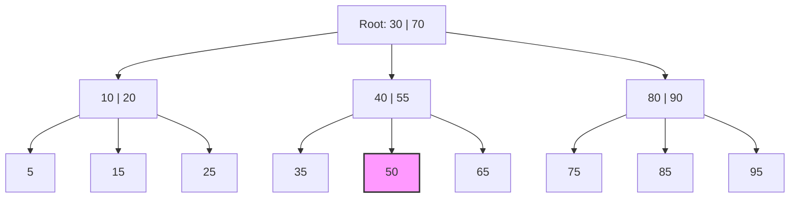

# 06 — Indexes: How Databases Find Data Fast

> **Level:** Beginner | **Estimated read time:** 20–25 min

---

## 📖 The Book Analogy — Why Indexes Exist

Imagine you have a 1,000-page technical book and you need to find every page that mentions "foreign key." You have two choices:

1. Read every single page from page 1 to page 1,000 (painful).
2. Flip to the **index at the back**, find "foreign key," see "pages 47, 203, 418," and go directly there.

A **database index** is exactly that back-of-the-book index. It is a separate data structure maintained by the database that lets queries jump straight to relevant rows instead of reading every row in a table.

---

## 🐢 Without an Index: Full Table Scan (O(n))

When a table has no index on the column you are filtering by, the database has no choice — it must read **every single row** and check the condition.

```sql
-- Table: users (5,000,000 rows)
SELECT * FROM users WHERE email = 'alice@example.com';
```

Without an index on `email`, the database reads all 5 million rows one by one. This is called a **full table scan** and its time complexity is **O(n)** — the more rows you have, the slower it gets, linearly.

For small tables (a few thousand rows) this is barely noticeable. For tables with millions of rows, a full scan can take seconds or even minutes.

---

## ⚡ With an Index: B-Tree Lookup (O(log n))

Add an index on `email` and the same query completes in microseconds, because the database can navigate a **sorted tree structure** and eliminate half the remaining candidates at every step. This is **O(log n)** — adding millions of rows barely increases lookup time.

```sql
CREATE INDEX idx_users_email ON users(email);
```

Now the query jumps straight to the matching row(s). The default index type in every major relational database (PostgreSQL, MySQL, SQL Server, Oracle) is the **B-tree**.

---

## 🌳 B-Tree Index: How It Works

B-tree stands for **Balanced Tree**. It keeps all leaf nodes at the same depth, so every lookup takes the same number of steps regardless of which value you search for.

### Structure

- **Root node** — the entry point.
- **Internal nodes** — contain key ranges used to route the search left or right.
- **Leaf nodes** — contain the actual index keys plus pointers to the row locations on disk (heap pointers in PostgreSQL, primary key values in MySQL InnoDB).

### ASCII Visualization

```
                  [  30  |  70  ]           ← Root (internal)
                 /         |        \
          [10|20]       [40|55]     [80|90]  ← Internal nodes
          /  |  \       /  |  \     /  |  \
        [5] [15] [25] [35][50][65][75][85][95]  ← Leaf nodes (point to rows)
```

Searching for value `50`:
1. Start at root `[30 | 70]` — 50 is between 30 and 70, go middle.
2. Reach `[40 | 55]` — 50 is between 40 and 55, go middle.
3. Reach leaf `[50]` — found it. Follow pointer to the actual row.

Three steps for a tree that could index billions of rows. That is O(log n).

### Mermaid Diagram



B-trees also support **range queries** efficiently (`WHERE age BETWEEN 20 AND 40`) because leaf nodes are linked in sorted order — the database just scans from the start value to the end value along the leaf level.

---

## #️⃣ Hash Index: Exact Lookups Only

A hash index stores a **hash map**: it computes `hash(value)` and stores the result mapped to the row pointer.

- **Lookup:** O(1) for exact equality — `WHERE email = 'alice@example.com'`
- **Cannot** support range queries — `WHERE age > 30` is useless with a hash index.
- **Cannot** support sorting, prefix matching, or `LIKE 'alice%'`.

### When to Use a Hash Index

Use a hash index only when:
- You exclusively need exact equality lookups.
- You never need range queries or ordering on that column.

In PostgreSQL you can explicitly create one:
```sql
CREATE INDEX idx_users_email_hash ON users USING HASH (email);
```

In MySQL InnoDB, the engine automatically creates an **Adaptive Hash Index** internally — you cannot create hash indexes manually in InnoDB for on-disk use. In PostgreSQL, B-tree handles equality so well that hash indexes are rarely worth reaching for.

---

## 🗂️ Composite Index: Column Order Matters!

A **composite index** covers multiple columns.

```sql
-- Index on (last_name, first_name)
CREATE INDEX idx_users_name ON users(last_name, first_name);
```

Think of it like a phone book sorted first by last name, then by first name within each last name.

### The Left-Prefix Rule

The database can use this index for:
- `WHERE last_name = 'Smith'` ✅ (leftmost column)
- `WHERE last_name = 'Smith' AND first_name = 'Alice'` ✅ (both columns)
- `WHERE last_name = 'Smith' AND first_name LIKE 'A%'` ✅ (range on trailing column)

But **not** for:
- `WHERE first_name = 'Alice'` ❌ (skips the leftmost column)
- `WHERE first_name = 'Alice' AND last_name = 'Smith'` — the optimizer may reorder this, but it depends on the database.

**Rule of thumb:** Put the column you filter on most (highest selectivity, or the equality filter) first, range/sort columns last.

---

## 🔒 Unique Index vs Regular Index

A **unique index** enforces a constraint: no two rows can have the same value in the indexed column(s).

```sql
-- Regular index (allows duplicates)
CREATE INDEX idx_users_country ON users(country);

-- Unique index (no duplicates allowed)
CREATE UNIQUE INDEX idx_users_email ON users(email);
```

`PRIMARY KEY` automatically creates a unique index. `UNIQUE` constraint also creates one under the hood. A unique index is both a performance tool and a **data integrity guarantee**.

---

## 🏠 Clustered vs Non-Clustered Index

This is where databases start to diverge.

### What "Clustered" Means

A **clustered index** determines the **physical order of rows** on disk. The table data is sorted and stored in the same structure as the index. There can only be **one** clustered index per table.

A **non-clustered index** is a separate structure that points back to the actual row data.

### PostgreSQL

PostgreSQL uses **heap storage** — rows are stored in an unordered heap, completely separate from indexes. This means:

- **All indexes in PostgreSQL are non-clustered** by default.
- Every index lookup reads the index, then follows a pointer back to the heap (a "heap fetch").
- The `CLUSTER` command physically reorders the table on disk once, but PostgreSQL does **not** maintain that order as new rows are inserted. It is a one-time operation.

```sql
-- PostgreSQL: one-time physical reorder (does NOT stay clustered on writes)
CLUSTER users USING idx_users_email;
```

### MySQL InnoDB

MySQL InnoDB is the opposite:

- The **PRIMARY KEY is always the clustered index**. The table rows are stored inside the primary key B-tree leaf pages.
- Secondary indexes store the primary key value (not a heap pointer) to look up the actual row — meaning a secondary index lookup does two B-tree traversals.
- If you define no PRIMARY KEY, InnoDB silently creates a hidden 6-byte rowid clustered index.

```sql
-- MySQL: PRIMARY KEY automatically becomes the clustered index
CREATE TABLE orders (
    order_id INT PRIMARY KEY,   -- this IS the clustered index
    user_id  INT,
    total    DECIMAL(10,2)
);
```

### SQL Server

SQL Server calls this concept explicitly:
- A **clustered index** physically orders the table. By default, `PRIMARY KEY` creates one.
- A **non-clustered index** is a separate B-tree that stores row locators.
- You can create a clustered index on any column (not required to be the PK).

```sql
-- SQL Server: explicit clustered index
CREATE CLUSTERED INDEX idx_orders_date ON orders(order_date);
```

### Oracle

Oracle behaves similarly to SQL Server. By default, a **primary key** creates a unique non-clustered index unless you specify `ORGANIZATION INDEX` (an Index-Organized Table, equivalent to a clustered index).

### Quick Comparison Table

| Database     | Clustered Index Behavior |
|---|---|
| PostgreSQL   | No clustered index; all indexes point to heap |
| MySQL InnoDB | PRIMARY KEY is always clustered; no choice |
| SQL Server   | Optional; defaults to PK; can be any column |
| Oracle       | Index-Organized Tables (IOT) are clustered |

---

## 🎯 Partial Index (PostgreSQL)

A **partial index** only indexes rows that satisfy a condition. This is a PostgreSQL-specific feature (also supported in SQLite).

```sql
-- Only index active users, not deactivated ones
CREATE INDEX idx_active_users_email ON users(email)
WHERE is_active = true;
```

Benefits:
- **Smaller index** — only a fraction of rows are indexed.
- **Faster writes** — fewer rows need to update the index.
- **Queries that filter on the same condition** can use this index.

A query like `WHERE email = 'alice@example.com' AND is_active = true` will use this index. A query without `is_active = true` will not.

---

## 🔡 Index on Expression (PostgreSQL)

You can index the **result of a function or expression**, not just a raw column value.

```sql
-- Case-insensitive email lookups
CREATE INDEX idx_users_email_lower ON users(LOWER(email));
```

Now this query uses the index:
```sql
SELECT * FROM users WHERE LOWER(email) = 'alice@example.com';
```

Without the expression index, `LOWER(email)` would force a full table scan because the index on raw `email` cannot help when the column value is transformed.

Other examples:
```sql
-- Index on extracted year
CREATE INDEX idx_orders_year ON orders((EXTRACT(YEAR FROM created_at)));

-- Index on JSONB field
CREATE INDEX idx_users_meta_city ON users((metadata->>'city'));
```

---

## 📝 MySQL FULLTEXT Index

For searching free-form text (articles, descriptions, comments), MySQL offers a **FULLTEXT index** that uses an inverted index structure optimized for natural language search.

```sql
CREATE FULLTEXT INDEX idx_articles_body ON articles(title, body);

-- Use MATCH ... AGAINST syntax
SELECT * FROM articles
WHERE MATCH(title, body) AGAINST('database performance' IN NATURAL LANGUAGE MODE);
```

Regular B-tree indexes cannot efficiently search for words inside text (e.g., `WHERE body LIKE '%database%'` always full-scans). FULLTEXT indexes solve this. PostgreSQL has its own full-text search via `tsvector`/`tsquery` and GIN indexes instead.

---

## 📊 Covering Index

A **covering index** includes all columns that a query needs, so the database never has to touch the actual table rows at all — it gets everything from the index itself.

```sql
-- Query needs: user_id filter, returns email and created_at
SELECT email, created_at FROM users WHERE user_id = 42;

-- Covering index: includes all columns the query touches
CREATE INDEX idx_users_covering ON users(user_id, email, created_at);
```

The query can be answered entirely from the index pages. In PostgreSQL this is called an **Index-Only Scan** (you can see it in `EXPLAIN ANALYZE`). This is the fastest possible index strategy.

---

## 🔍 How to Know When You Need an Index: EXPLAIN ANALYZE

The single most useful tool for index decisions is `EXPLAIN ANALYZE`. It shows you exactly what the database did to execute your query.

```sql
EXPLAIN ANALYZE
SELECT * FROM users WHERE email = 'alice@example.com';
```

Sample output (PostgreSQL):
```
Seq Scan on users  (cost=0.00..1823.00 rows=1 width=128)
                   (actual time=45.231..45.231 rows=1 loops=1)
  Filter: ((email)::text = 'alice@example.com'::text)
  Rows Removed by Filter: 89999
Planning Time: 0.089 ms
Execution Time: 45.312 ms
```

`Seq Scan` = full table scan. `Rows Removed by Filter: 89999` = it read 90,000 rows to find 1.

After adding the index:
```
Index Scan using idx_users_email on users  (cost=0.42..8.44 rows=1 width=128)
                                           (actual time=0.042..0.043 rows=1 loops=1)
  Index Cond: ((email)::text = 'alice@example.com'::text)
Planning Time: 0.102 ms
Execution Time: 0.065 ms
```

`Index Scan` = used the index. Execution time dropped from 45ms to 0.065ms.

**Signals that you need an index:**
- `Seq Scan` on a large table in a frequently-run query.
- High `actual time` values.
- `Rows Removed by Filter` is orders of magnitude larger than the returned rows.

---

## 📉 When Indexes HURT Performance

Indexes are not free. Every index has costs:

### Write Overhead
Every `INSERT`, `UPDATE`, and `DELETE` must update all indexes on the table. A table with 10 indexes pays 10 index update costs per write. Heavy write workloads (logging, event streams, bulk imports) can be significantly slowed by too many indexes.

```sql
-- Before a large bulk insert, consider dropping indexes, importing, then recreating
DROP INDEX idx_logs_user_id;
COPY logs FROM '/data/logs.csv' CSV;
CREATE INDEX idx_logs_user_id ON logs(user_id);
```

### Storage
Each index is stored on disk. A B-tree index on a large `TEXT` column can consume as much space as the table itself.

### Index Bloat
Over time, as rows are deleted and updated, index pages can contain many dead entries that are never reclaimed. This is called **index bloat**. It wastes storage and slows down scans.

In PostgreSQL, `VACUUM` reclaims dead tuples, but fragmented index pages may remain. Use `REINDEX` to fully rebuild a bloated index:
```sql
-- PostgreSQL: rebuild index without locking the table (PG 12+)
REINDEX INDEX CONCURRENTLY idx_users_email;
```

### When NOT to Index

- **Low-cardinality columns** — a column like `gender` (values: M/F/Other) is a terrible index candidate. The database might read 33% of the table anyway; a full scan is often faster.
- **Tiny tables** — fewer than a few thousand rows, full scans are trivially fast.
- **Write-heavy tables** — if the table is written 100x more than it is read, indexes slow you down.
- **Rarely-queried columns** — an index that is never used is pure overhead.

---

## 🔑 Key Takeaways

| Concept | One-Line Summary |
|---|---|
| Full table scan | O(n) — reads every row; unavoidable without an index |
| B-tree index | O(log n) — default type; handles equality, ranges, sorts |
| Hash index | O(1) equality only; no ranges, no sorting |
| Composite index | Multi-column; left-prefix rule determines usability |
| Unique index | Enforces no-duplicate constraint + speeds lookups |
| Clustered index | Data rows stored inside the index (MySQL PK; SQL Server default) |
| Non-clustered index | Separate structure pointing to heap rows (PostgreSQL always) |
| Partial index | Indexes only rows matching a WHERE condition (PostgreSQL/SQLite) |
| Expression index | Indexes a computed value like `LOWER(email)` (PostgreSQL) |
| Covering index | Index contains all columns needed; avoids touching the table |
| Index bloat | Dead entries accumulate over time; use REINDEX to reclaim |
| EXPLAIN ANALYZE | Your primary tool for diagnosing slow queries and missing indexes |

---

## 🧪 Quiz

Test yourself before moving on.

**Question 1**
You have a table `orders` with 50 million rows. A query runs `WHERE status = 'pending'` and only 2% of orders are pending. What type of PostgreSQL index would give you the smallest, most efficient index for this query?

<details>
<summary>Answer</summary>

A **partial index**: `CREATE INDEX idx_orders_pending ON orders(status) WHERE status = 'pending';`

This indexes only the 2% of rows that match the condition, keeping the index tiny and writes fast for the 98% of rows that are not pending.

</details>

---

**Question 2**
You create a composite index `CREATE INDEX idx ON events(user_id, event_type, created_at)`. Which of the following queries will use this index, and which will not?

- (a) `WHERE user_id = 5`
- (b) `WHERE event_type = 'click'`
- (c) `WHERE user_id = 5 AND event_type = 'click'`
- (d) `WHERE user_id = 5 ORDER BY created_at`

<details>
<summary>Answer</summary>

- (a) ✅ Uses the index — `user_id` is the leftmost column.
- (b) ❌ Cannot use the index — skips the leftmost column.
- (c) ✅ Uses the index — both leading columns present.
- (d) ✅ Uses the index — `user_id` equality filter, then `created_at` is the trailing column used for sorting.

</details>

---

**Question 3**
In MySQL InnoDB, you have a table with `PRIMARY KEY (order_id)` and a secondary index on `user_id`. When you query `WHERE user_id = 42`, how many B-tree lookups does MySQL perform internally?

<details>
<summary>Answer</summary>

**Two B-tree lookups:**
1. The secondary index on `user_id` is traversed to find the matching `order_id` values.
2. The primary key clustered index is traversed using those `order_id` values to retrieve the full row data.

This is called a **double lookup** (or bookmark lookup). If you only needed columns covered by the secondary index itself, the second lookup would be avoided (covering index scenario).

</details>

---

## 📌 Cross-DB Syntax Reference

```sql
-- Create a standard B-tree index (works in PostgreSQL, MySQL, SQL Server, Oracle)
CREATE INDEX index_name ON table_name(column_name);

-- Unique index (all major databases)
CREATE UNIQUE INDEX index_name ON table_name(column_name);

-- Composite index (all major databases)
CREATE INDEX index_name ON table_name(col1, col2, col3);

-- Drop an index
DROP INDEX index_name;                          -- PostgreSQL, Oracle
DROP INDEX index_name ON table_name;            -- MySQL
DROP INDEX index_name ON table_name;            -- SQL Server (schema-qualified)

-- PostgreSQL only: partial index
CREATE INDEX index_name ON table_name(column_name) WHERE condition;

-- PostgreSQL only: expression index
CREATE INDEX index_name ON table_name(LOWER(column_name));

-- PostgreSQL only: hash index
CREATE INDEX index_name ON table_name USING HASH (column_name);

-- MySQL only: FULLTEXT index
CREATE FULLTEXT INDEX index_name ON table_name(column_name);

-- PostgreSQL: see query plan
EXPLAIN ANALYZE SELECT ...;

-- MySQL: see query plan
EXPLAIN SELECT ...;

-- SQL Server: see query plan
SET STATISTICS IO ON;
-- or use the graphical execution plan in SSMS
```

---

*Next Chapter: Transactions and ACID — Keeping Your Data Consistent*
