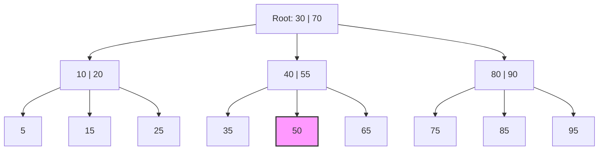

# 06 — Indexes: Database Data Ko Fast Kaise Dhundhti Hai

> **Level:** Beginner | **Estimated read time:** 20–25 min

---

## 📖 Kitaab Wala Analogy — Index Exist Kyun Karta Hai?

Socho tumhare paas ek 1,000-page ki technical book hai aur tumhe har wo page dhundhna hai jahan "foreign key" mention hua ho. Do options hain:

1. Page 1 se page 1,000 tak har page padho (bilkul painful).
2. Seedha **book ke aakhir wale index** pe jao, "foreign key" dhundho, wahan likha mile "pages 47, 203, 418," aur directly wahi pages pe pahunch jao.

**Database index** bhi exactly wahi back-of-the-book index hai. Ye ek separate data structure hai jo database maintain karta hai, taaki queries har row padhe bina seedha relevant rows tak pahunch jayein.

---

## 🐢 Bina Index Ke: Full Table Scan (O(n))

Jab kisi column pe index nahi hota jispe tum filter kar rahe ho, to database ke paas koi chara nahi — usse **har ek row** padhni padegi aur condition check karni padegi.

```sql
-- Table: users (5,000,000 rows)
SELECT * FROM users WHERE email = 'alice@example.com';
```

`email` pe index na ho to database saare 5 million rows ek-ek karke padhega. Isse **full table scan** kehte hain, aur iski time complexity hai **O(n)** — jitni zyada rows, utna slow, linearly.

Chhoti tables (kuch hazaar rows) ke liye ye barely noticeable hota hai. Lekin lakhon rows wali tables mein full scan seconds ya minutes tak le sakta hai — Zomato ka poora order history bina index ke scan karne jaisa, imagine karo kitna time lagega.

---

## ⚡ Index Ke Saath: B-Tree Lookup (O(log n))

`email` pe index laga do, aur wahi query microseconds mein complete ho jayegi, kyunki database ek **sorted tree structure** navigate kar sakta hai aur har step pe baaki bache candidates ko aadha kar deta hai. Ye hai **O(log n)** — lakhon rows add karne pe bhi lookup time barely badhta hai.

```sql
CREATE INDEX idx_users_email ON users(email);
```

Ab query seedha matching row(s) tak jump karti hai. Har major relational database (PostgreSQL, MySQL, SQL Server, Oracle) ka default index type hai **B-tree**.

---

## 🌳 B-Tree Index: Ye Kaam Kaise Karta Hai

B-tree ka matlab hai **Balanced Tree**. Isme saare leaf nodes same depth pe rehte hain, isliye har lookup mein steps ki same number lagti hai, chahe tum koi bhi value search karo.

### Structure

- **Root node** — entry point.
- **Internal nodes** — key ranges hote hain jo search ko left ya right route karte hain.
- **Leaf nodes** — actual index keys plus disk pe row locations ke pointers hote hain (PostgreSQL mein heap pointers, MySQL InnoDB mein primary key values).

### ASCII Visualization

```
                  [  30  |  70  ]           ← Root (internal)
                 /         |        \
          [10|20]       [40|55]     [80|90]  ← Internal nodes
          /  |  \       /  |  \     /  |  \
        [5] [15] [25] [35][50][65][75][85][95]  ← Leaf nodes (rows ki taraf point karte hain)
```

Value `50` dhundhte waqt:
1. Root `[30 | 70]` se start karo — 50, 30 aur 70 ke beech mein hai, middle mein jao.
2. `[40 | 55]` pe pahuncho — 50, 40 aur 55 ke beech mein hai, middle mein jao.
3. Leaf `[50]` pe pahuncho — mil gaya. Pointer follow karo actual row tak.

Sirf teen steps, aur tree mein billions of rows ho sakti hain. Yahi hai O(log n).

### Mermaid Diagram



B-trees **range queries** bhi efficiently support karte hain (`WHERE age BETWEEN 20 AND 40`), kyunki leaf nodes sorted order mein linked hote hain — database bas start value se end value tak leaf level pe scan kar leta hai.

---

## #️⃣ Hash Index: Sirf Exact Lookups Ke Liye

Hash index ek **hash map** store karta hai: ye `hash(value)` compute karke result ko row pointer ke saath map kar deta hai.

- **Lookup:** O(1) exact equality ke liye — `WHERE email = 'alice@example.com'`
- **Range queries support nahi karta** — `WHERE age > 30` hash index ke saath bekaar hai.
- **Sorting, prefix matching, ya `LIKE 'alice%'` bhi support nahi karta.**

### Hash Index Kab Use Karna Chahiye

Hash index tabhi use karo jab:
- Tumhe sirf exact equality lookups chahiye.
- Us column pe kabhi range queries ya ordering ki zaroorat nahi padegi.

PostgreSQL mein tum explicitly ek bana sakte ho:
```sql
CREATE INDEX idx_users_email_hash ON users USING HASH (email);
```

MySQL InnoDB mein, engine internally automatically ek **Adaptive Hash Index** bana leta hai — InnoDB mein on-disk use ke liye manually hash indexes nahi bana sakte. PostgreSQL mein, B-tree equality ko itna acha handle karta hai ki hash indexes ki zaroorat kabhi-kabhaar hi padti hai.

---

## 🗂️ Composite Index: Column Order Matter Karta Hai!

Ek **composite index** multiple columns cover karta hai.

```sql
-- Index on (last_name, first_name)
CREATE INDEX idx_users_name ON users(last_name, first_name);
```

Isse socho ek phone book jaisa — pehle last name se sorted, phir har last name ke andar first name se sorted.

### Left-Prefix Rule

Database is index ko use kar sakta hai:
- `WHERE last_name = 'Smith'` ✅ (leftmost column)
- `WHERE last_name = 'Smith' AND first_name = 'Alice'` ✅ (dono columns)
- `WHERE last_name = 'Smith' AND first_name LIKE 'A%'` ✅ (trailing column pe range)

Lekin **nahi** use kar sakta:
- `WHERE first_name = 'Alice'` ❌ (leftmost column skip ho raha hai)
- `WHERE first_name = 'Alice' AND last_name = 'Smith'` — optimizer ise reorder kar sakta hai, lekin ye database pe depend karta hai.

**Rule of thumb:** Jis column pe sabse zyada filter karte ho (highest selectivity, ya equality filter), usse pehle rakho, range/sort wale columns ko last mein.

---

## 🔒 Unique Index vs Regular Index

Ek **unique index** ek constraint enforce karta hai: kisi bhi do rows mein indexed column(s) ki value same nahi ho sakti.

```sql
-- Regular index (duplicates allow karta hai)
CREATE INDEX idx_users_country ON users(country);

-- Unique index (duplicates allow nahi)
CREATE UNIQUE INDEX idx_users_email ON users(email);
```

`PRIMARY KEY` automatically ek unique index bana deta hai. `UNIQUE` constraint bhi under the hood ek bana deta hai. Unique index ek performance tool bhi hai aur ek **data integrity guarantee** bhi.

---

## 🏠 Clustered vs Non-Clustered Index

Yahan se databases alag-alag rasta pakadte hain.

### "Clustered" Ka Matlab Kya Hai

Ek **clustered index** rows ka **physical order** disk pe decide karta hai. Table ka data usi structure mein sorted aur stored hota hai jo index hai. Har table mein sirf **ek hi** clustered index ho sakta hai.

Ek **non-clustered index** ek separate structure hai jo actual row data ki taraf point karta hai.

### PostgreSQL

PostgreSQL **heap storage** use karta hai — rows ek unordered heap mein store hote hain, jo indexes se completely separate hai. Iska matlab:

- **PostgreSQL ke saare indexes by default non-clustered hain.**
- Har index lookup pehle index padhta hai, phir ek pointer follow karke heap tak jaata hai (isse "heap fetch" kehte hain).
- `CLUSTER` command table ko disk pe ek baar physically reorder kar deta hai, lekin PostgreSQL naye rows insert hone pe wo order maintain **nahi** karta. Ye ek one-time operation hai.

```sql
-- PostgreSQL: one-time physical reorder (writes pe clustered NAHI rehta)
CLUSTER users USING idx_users_email;
```

### MySQL InnoDB

MySQL InnoDB isse opposite hai:

- **PRIMARY KEY hamesha clustered index hota hai.** Table ki rows primary key B-tree ke leaf pages ke andar hi store hoti hain.
- Secondary indexes heap pointer nahi, balki primary key value store karte hain actual row dhundhne ke liye — matlab secondary index lookup mein do B-tree traversals lagte hain.
- Agar tum koi PRIMARY KEY define nahi karte, to InnoDB silently ek hidden 6-byte rowid clustered index bana deta hai.

```sql
-- MySQL: PRIMARY KEY automatically clustered index ban jaata hai
CREATE TABLE orders (
    order_id INT PRIMARY KEY,   -- yahi hai clustered index
    user_id  INT,
    total    DECIMAL(10,2)
);
```

### SQL Server

SQL Server isko explicitly define karta hai:
- Ek **clustered index** table ko physically order karta hai. By default, `PRIMARY KEY` ek bana deta hai.
- Ek **non-clustered index** ek separate B-tree hai jo row locators store karta hai.
- Tum kisi bhi column pe clustered index bana sakte ho (PK hona zaroori nahi).

```sql
-- SQL Server: explicit clustered index
CREATE CLUSTERED INDEX idx_orders_date ON orders(order_date);
```

### Oracle

Oracle SQL Server jaisa hi behave karta hai. By default, ek **primary key** ek unique non-clustered index banata hai, jab tak tum `ORGANIZATION INDEX` specify na karo (ek Index-Organized Table, jo clustered index ke equivalent hai).

### Quick Comparison Table

| Database     | Clustered Index Behavior |
|---|---|
| PostgreSQL   | Koi clustered index nahi; saare indexes heap ki taraf point karte hain |
| MySQL InnoDB | PRIMARY KEY hamesha clustered hota hai; koi choice nahi |
| SQL Server   | Optional; default PK hai; koi bhi column ho sakta hai |
| Oracle       | Index-Organized Tables (IOT) clustered hote hain |

---

## 🎯 Partial Index (PostgreSQL)

Ek **partial index** sirf un rows ko index karta hai jo ek condition satisfy karte hain. Ye PostgreSQL-specific feature hai (SQLite mein bhi supported hai).

```sql
-- Sirf active users ko index karo, deactivated ko nahi
CREATE INDEX idx_active_users_email ON users(email)
WHERE is_active = true;
```

Benefits:
- **Chhota index** — sirf rows ka ek fraction hi indexed hota hai.
- **Faster writes** — kam rows ko index update karna padta hai.
- **Same condition pe filter karne wali queries** is index ko use kar sakti hain.

`WHERE email = 'alice@example.com' AND is_active = true` jaisi query is index ko use karegi. `is_active = true` na ho to query is index ko use nahi karegi.

---

## 🔡 Expression Pe Index (PostgreSQL)

Tum kisi **function ya expression ka result** index kar sakte ho, sirf raw column value nahi.

```sql
-- Case-insensitive email lookups
CREATE INDEX idx_users_email_lower ON users(LOWER(email));
```

Ab ye query index use karegi:
```sql
SELECT * FROM users WHERE LOWER(email) = 'alice@example.com';
```

Expression index ke bina, `LOWER(email)` full table scan force kar dega, kyunki raw `email` pe bana index tab kaam nahi aata jab column value transform ho jaati hai.

Aur examples:
```sql
-- Extracted year pe index
CREATE INDEX idx_orders_year ON orders((EXTRACT(YEAR FROM created_at)));

-- JSONB field pe index
CREATE INDEX idx_users_meta_city ON users((metadata->>'city'));
```

---

## 📝 MySQL FULLTEXT Index

Free-form text search ke liye (articles, descriptions, comments), MySQL ek **FULLTEXT index** deta hai jo natural language search ke liye optimized inverted index structure use karta hai.

```sql
CREATE FULLTEXT INDEX idx_articles_body ON articles(title, body);

-- MATCH ... AGAINST syntax use karo
SELECT * FROM articles
WHERE MATCH(title, body) AGAINST('database performance' IN NATURAL LANGUAGE MODE);
```

Regular B-tree indexes text ke andar words efficiently search nahi kar sakte (jaise `WHERE body LIKE '%database%'` hamesha full-scan karega). FULLTEXT indexes isko solve karte hain. PostgreSQL ka apna full-text search hai `tsvector`/`tsquery` aur GIN indexes ke through.

---

## 📊 Covering Index

Ek **covering index** wo saare columns include karta hai jo query ko chahiye, isliye database ko actual table rows chhoona hi nahi padta — sab kuch index se hi mil jaata hai.

```sql
-- Query ko chahiye: user_id filter, return email aur created_at
SELECT email, created_at FROM users WHERE user_id = 42;

-- Covering index: query jo bhi columns touch karti hai, sab include
CREATE INDEX idx_users_covering ON users(user_id, email, created_at);
```

Query poori tarah index pages se hi answer ho sakti hai. PostgreSQL mein isse **Index-Only Scan** kehte hain (tum ise `EXPLAIN ANALYZE` mein dekh sakte ho). Ye sabse fastest possible index strategy hai.

---

## 🔍 Kaise Pata Chale Index Chahiye Ya Nahi: EXPLAIN ANALYZE

Index decisions ke liye sabse useful tool hai `EXPLAIN ANALYZE`. Ye exactly dikhata hai ki database ne query execute karne ke liye kya kiya.

```sql
EXPLAIN ANALYZE
SELECT * FROM users WHERE email = 'alice@example.com';
```

Sample output (PostgreSQL):
```
Seq Scan on users  (cost=0.00..1823.00 rows=1 width=128)
                   (actual time=45.231..45.231 rows=1 loops=1)
  Filter: ((email)::text = 'alice@example.com'::text)
  Rows Removed by Filter: 89999
Planning Time: 0.089 ms
Execution Time: 45.312 ms
```

`Seq Scan` matlab full table scan. `Rows Removed by Filter: 89999` matlab 1 row dhundhne ke liye 90,000 rows padhi gayin.

Index add karne ke baad:
```
Index Scan using idx_users_email on users  (cost=0.42..8.44 rows=1 width=128)
                                           (actual time=0.042..0.043 rows=1 loops=1)
  Index Cond: ((email)::text = 'alice@example.com'::text)
Planning Time: 0.102 ms
Execution Time: 0.065 ms
```

`Index Scan` matlab index use hua. Execution time 45ms se 0.065ms tak gir gaya.

**Ye signals batate hain ki tumhe index chahiye:**
- Bade table pe frequently-run query mein `Seq Scan` dikhna.
- High `actual time` values.
- `Rows Removed by Filter` returned rows se orders of magnitude zyada hona.

---

## 📉 Jab Indexes Performance HURT Karte Hain

Indexes free nahi hote. Har index ki apni costs hoti hain:

### Write Overhead
Har `INSERT`, `UPDATE`, aur `DELETE` ko table ke saare indexes update karne padte hain. 10 indexes wali table har write pe 10 index update costs pay karti hai. Heavy write workloads (logging, event streams, bulk imports) bahut saare indexes se significantly slow ho sakte hain — jaise Swiggy ke live order tracking system mein har second hazaaron writes hoti hain, wahan zyada indexes seedha performance khaa jayenge.

```sql
-- Bade bulk insert se pehle, indexes drop karke, import karke, phir recreate karne ka socho
DROP INDEX idx_logs_user_id;
COPY logs FROM '/data/logs.csv' CSV;
CREATE INDEX idx_logs_user_id ON logs(user_id);
```

### Storage
Har index disk pe store hota hai. Bade `TEXT` column pe B-tree index utni hi space le sakta hai jitni khud table.

### Index Bloat
Time ke saath, jaise rows delete aur update hoti hain, index pages mein bahut saari dead entries accumulate ho jaati hain jo kabhi reclaim nahi hoti. Isse **index bloat** kehte hain. Ye storage waste karta hai aur scans ko slow kar deta hai.

PostgreSQL mein `VACUUM` dead tuples reclaim karta hai, lekin fragmented index pages reh sakte hain. Bloated index ko fully rebuild karne ke liye `REINDEX` use karo:
```sql
-- PostgreSQL: table ko lock kiye bina index rebuild karo (PG 12+)
REINDEX INDEX CONCURRENTLY idx_users_email;
```

### Kab Index NAHI Banana Chahiye

- **Low-cardinality columns** — `gender` (values: M/F/Other) jaisa column ek bekaar index candidate hai. Database shayad table ka 33% padh hi lega; full scan aksar isse fast hota hai.
- **Chhoti tables** — kuch hazaar se kam rows, full scans trivially fast hote hain.
- **Write-heavy tables** — agar table read se 100x zyada write hoti hai, to indexes tumhe slow kar denge.
- **Rarely-queried columns** — jo index kabhi use hi nahi hota, wo pure overhead hai.

---

## 🔑 Key Takeaways

| Concept | One-Line Summary |
|---|---|
| Full table scan | O(n) — har row padhta hai; index ke bina unavoidable hai |
| B-tree index | O(log n) — default type; equality, ranges, sorts sab handle karta hai |
| Hash index | O(1) sirf equality; koi ranges ya sorting nahi |
| Composite index | Multi-column; left-prefix rule usability decide karta hai |
| Unique index | No-duplicate constraint enforce karta hai + lookups fast karta hai |
| Clustered index | Data rows index ke andar hi stored hote hain (MySQL PK; SQL Server default) |
| Non-clustered index | Alag structure jo heap rows ki taraf point karta hai (PostgreSQL hamesha) |
| Partial index | Sirf WHERE condition match karne wali rows index karta hai (PostgreSQL/SQLite) |
| Expression index | `LOWER(email)` jaisi computed value index karta hai (PostgreSQL) |
| Covering index | Index mein saare needed columns hote hain; table touch karne ki zaroorat nahi |
| Index bloat | Time ke saath dead entries accumulate hoti hain; reclaim ke liye REINDEX use karo |
| EXPLAIN ANALYZE | Slow queries aur missing indexes diagnose karne ka primary tool |

---

## 🧪 Quiz

Aage badhne se pehle khud ko test karo.

**Question 1**
Tumhare paas `orders` table hai jisme 50 million rows hain. Ek query `WHERE status = 'pending'` chalati hai aur sirf 2% orders pending hain. Is query ke liye sabse chhota, sabse efficient PostgreSQL index kaunsa hoga?

<details>
<summary>Answer</summary>

Ek **partial index**: `CREATE INDEX idx_orders_pending ON orders(status) WHERE status = 'pending';`

Ye sirf 2% matching rows ko index karta hai, jisse index chhota rehta hai aur baaki 98% non-pending rows ke liye writes fast rehti hain.

</details>

---

**Question 2**
Tumne ek composite index banaya `CREATE INDEX idx ON events(user_id, event_type, created_at)`. In queries mein se kaunsi is index ko use karegi, aur kaunsi nahi?

- (a) `WHERE user_id = 5`
- (b) `WHERE event_type = 'click'`
- (c) `WHERE user_id = 5 AND event_type = 'click'`
- (d) `WHERE user_id = 5 ORDER BY created_at`

<details>
<summary>Answer</summary>

- (a) ✅ Index use hoga — `user_id` leftmost column hai.
- (b) ❌ Index use nahi hoga — leftmost column skip ho raha hai.
- (c) ✅ Index use hoga — dono leading columns present hain.
- (d) ✅ Index use hoga — `user_id` equality filter hai, aur `created_at` trailing column sorting ke liye use ho raha hai.

</details>

---

**Question 3**
MySQL InnoDB mein tumhare paas ek table hai `PRIMARY KEY (order_id)` ke saath, aur `user_id` pe ek secondary index hai. Jab tum `WHERE user_id = 42` query karte ho, MySQL internally kitne B-tree lookups perform karta hai?

<details>
<summary>Answer</summary>

**Do B-tree lookups:**
1. `user_id` pe secondary index traverse hota hai matching `order_id` values dhundhne ke liye.
2. Us `order_id` values ko use karke primary key clustered index traverse hota hai poori row data retrieve karne ke liye.

Isse **double lookup** (ya bookmark lookup) kehte hain. Agar tumhe sirf wo columns chahiye hote jo secondary index mein hi cover ho jaate, to second lookup avoid ho jaata (covering index wala scenario).

</details>

---

## 📌 Cross-DB Syntax Reference

```sql
-- Standard B-tree index banao (PostgreSQL, MySQL, SQL Server, Oracle sabme kaam karta hai)
CREATE INDEX index_name ON table_name(column_name);

-- Unique index (saare major databases)
CREATE UNIQUE INDEX index_name ON table_name(column_name);

-- Composite index (saare major databases)
CREATE INDEX index_name ON table_name(col1, col2, col3);

-- Index drop karo
DROP INDEX index_name;                          -- PostgreSQL, Oracle
DROP INDEX index_name ON table_name;            -- MySQL
DROP INDEX index_name ON table_name;            -- SQL Server (schema-qualified)

-- PostgreSQL only: partial index
CREATE INDEX index_name ON table_name(column_name) WHERE condition;

-- PostgreSQL only: expression index
CREATE INDEX index_name ON table_name(LOWER(column_name));

-- PostgreSQL only: hash index
CREATE INDEX index_name ON table_name USING HASH (column_name);

-- MySQL only: FULLTEXT index
CREATE FULLTEXT INDEX index_name ON table_name(column_name);

-- PostgreSQL: query plan dekho
EXPLAIN ANALYZE SELECT ...;

-- MySQL: query plan dekho
EXPLAIN SELECT ...;

-- SQL Server: query plan dekho
SET STATISTICS IO ON;
-- ya SSMS mein graphical execution plan use karo
```

---

*Next Chapter: Transactions and ACID — Keeping Your Data Consistent*
