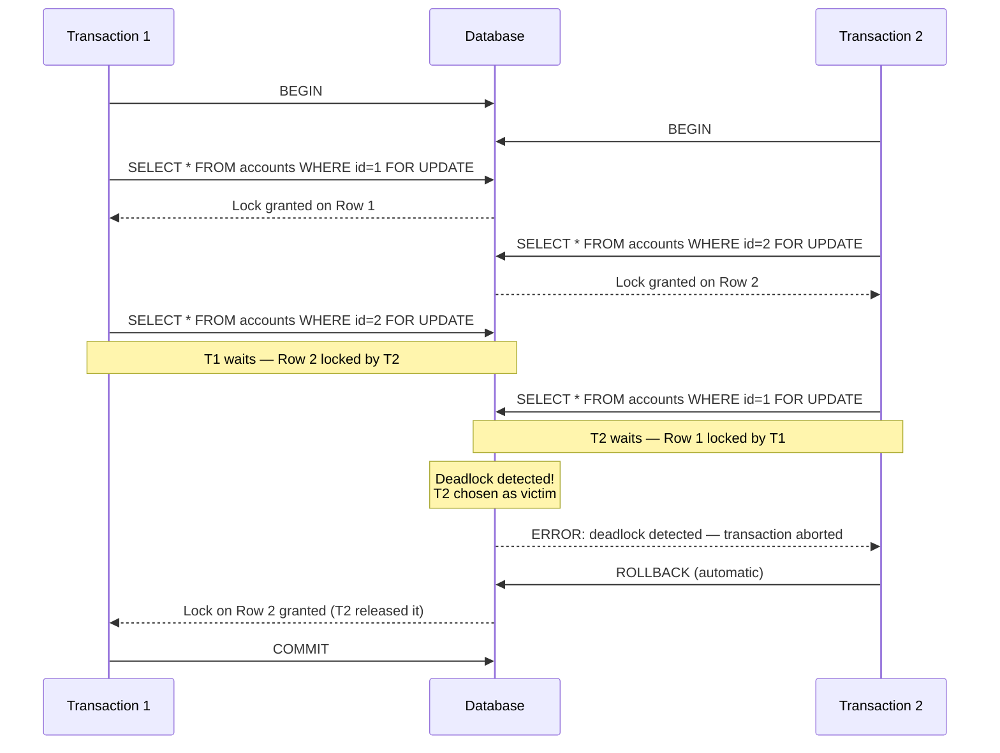

# 🔐 Transactions Deep Dive

> **Audience:** Complete beginners to databases. No prior knowledge of concurrency or locking assumed.
> **Goal:** Understand what transactions are, why they matter, and how databases keep your data safe when multiple users hit the system at once.

---

## 🔁 What Is a Transaction (Recap)?

Imagine you are transferring $500 from your savings account to your checking account. This involves two steps:

1. Deduct $500 from savings.
2. Add $500 to checking.

What happens if the database crashes after step 1 but before step 2? You lose $500. This is exactly the problem transactions solve.

A **transaction** is a group of one or more SQL statements that the database treats as a single, indivisible unit of work. Either all statements succeed together, or none of them take effect. This guarantee is captured by the **ACID** properties:

| Property | Meaning |
|---|---|
| **A**tomicity | All-or-nothing. Either every statement commits or none do. |
| **C**onsistency | The database moves from one valid state to another. Rules (constraints) are never broken. |
| **I**solation | Concurrent transactions do not interfere with each other. |
| **D**urability | Once committed, data survives crashes (it is written to disk). |

---

## 🚀 Starting a Transaction: BEGIN / START TRANSACTION

You tell the database "everything I do next belongs to one transaction" by explicitly opening one.

```sql
-- PostgreSQL / MySQL
BEGIN;
-- or equivalently:
START TRANSACTION;

-- SQL Server
BEGIN TRANSACTION;

-- Oracle
-- No BEGIN needed. Oracle is ALWAYS inside a transaction implicitly.
-- Every session starts a transaction automatically.
```

> **Cross-DB note:** PostgreSQL and MySQL both accept `BEGIN` or `START TRANSACTION`. SQL Server requires the `TRANSACTION` keyword. Oracle never needs you to open a transaction; it is already open.

Until you close the transaction (with `COMMIT` or `ROLLBACK`), every change you make is tentative — visible to you, but not yet permanent.

---

## ✅ COMMIT — Making Changes Permanent

`COMMIT` finalises the transaction. The database writes all changes durably to disk and makes them visible to other sessions.

```sql
BEGIN;

UPDATE accounts SET balance = balance - 500 WHERE id = 1;
UPDATE accounts SET balance = balance + 500 WHERE id = 2;

COMMIT; -- Both updates are now permanent and visible to everyone
```

After `COMMIT`, there is no going back. The data is saved.

---

## ↩️ ROLLBACK — Undoing Everything

`ROLLBACK` cancels the entire transaction. The database discards every change made since `BEGIN`, as if none of it happened.

```sql
BEGIN;

UPDATE accounts SET balance = balance - 500 WHERE id = 1;

-- Oops! We realise id = 2 does not exist.
ROLLBACK; -- The deduction is reversed. Account 1 is untouched.
```

This is the safety net. If anything goes wrong — an error, a constraint violation, or application logic deciding to abort — `ROLLBACK` returns the database to the state it was in before the transaction started.

---

## 🔖 SAVEPOINT and ROLLBACK TO SAVEPOINT

Sometimes you want a partial undo — rolling back only part of a transaction without losing everything. `SAVEPOINT` creates a named checkpoint inside a transaction.

```sql
BEGIN;

INSERT INTO orders (id, product) VALUES (101, 'Laptop');

SAVEPOINT after_order; -- Mark this point

INSERT INTO order_items (order_id, qty) VALUES (101, 2);

-- Something went wrong with order items only
ROLLBACK TO SAVEPOINT after_order; -- Undo only the order_items insert

-- The orders insert is still in effect
COMMIT; -- Commits just the orders row
```

Think of savepoints like save slots in a video game — you can reload a mid-point without restarting from the beginning.

> **Note:** `RELEASE SAVEPOINT name` removes the savepoint without rolling back. Oracle calls them `SAVEPOINT` too. SQL Server uses `SAVE TRANSACTION name` and `ROLLBACK TRANSACTION name`.

---

## ⚠️ Concurrency Problems Without Proper Isolation

When multiple transactions run at the same time without isolation controls, strange and dangerous things can happen.

### 1. Dirty Read

Transaction A reads data that Transaction B has written but not yet committed. If B rolls back, A has read data that never officially existed.

```
T1: BEGIN; UPDATE accounts SET balance = 0 WHERE id = 1;
T2:   -- Reads balance = 0 (dirty!)
T1: ROLLBACK; -- balance reverts to original
T2:   -- T2 made a decision based on a lie
```

### 2. Non-Repeatable Read

Transaction A reads a row. Transaction B updates and commits that row. Transaction A reads the same row again and gets a different value — within the same transaction.

```
T1: SELECT balance FROM accounts WHERE id = 1; -- Returns 1000
T2:   UPDATE accounts SET balance = 500 WHERE id = 1; COMMIT;
T1: SELECT balance FROM accounts WHERE id = 1; -- Returns 500 !!
```

The same query returns different results within one transaction. This breaks the assumption that a single transaction sees a consistent world.

### 3. Phantom Read

Transaction A queries a set of rows matching a condition. Transaction B inserts new rows matching that condition and commits. Transaction A re-runs the query and sees new "phantom" rows that were not there before.

```
T1: SELECT * FROM orders WHERE amount > 100; -- Returns 5 rows
T2:   INSERT INTO orders (amount) VALUES (200); COMMIT;
T1: SELECT * FROM orders WHERE amount > 100; -- Returns 6 rows !!
```

### 4. Lost Update

Two transactions both read the same value, both modify it based on what they read, and both write back — the second write silently overwrites the first.

```
T1: reads stock = 10, then writes stock = 9
T2: reads stock = 10 (same read!), then writes stock = 9
-- One sale is lost. Stock should be 8, but it is 9.
```

---

## 🔒 Locking: Pessimistic vs Optimistic

There are two philosophies for preventing the concurrency problems above.

### Pessimistic Locking

"Assume conflict will happen. Lock the data before anyone else can touch it."

**`SELECT FOR UPDATE`** — locks the selected rows. Other transactions that try to modify or also lock these rows must wait.

```sql
BEGIN;
SELECT balance FROM accounts WHERE id = 1 FOR UPDATE;
-- Row is now locked. No other transaction can UPDATE it until we COMMIT or ROLLBACK.
UPDATE accounts SET balance = balance - 500 WHERE id = 1;
COMMIT;
```

**`SELECT FOR SHARE`** (PostgreSQL) / `LOCK IN SHARE MODE` (MySQL) — allows other transactions to also read with a share lock, but prevents any exclusive write lock. Useful when you want to read and assert the row has not changed, without blocking other readers.

```sql
SELECT * FROM products WHERE id = 42 FOR SHARE;
```

**When to use pessimistic:** High-contention scenarios where conflicts are frequent and the cost of retrying is high (e.g., bank transfers, inventory deduction).

### Optimistic Locking

"Assume conflicts are rare. Do not lock upfront. Check at commit time whether anyone else changed the data."

The most common technique is a **version column** (or timestamp):

```sql
-- Table has a `version` column
-- Step 1: Read the row and note the version
SELECT id, balance, version FROM accounts WHERE id = 1;
-- Returns: id=1, balance=1000, version=5

-- Step 2: Update only if version has not changed
UPDATE accounts
SET balance = 500, version = version + 1
WHERE id = 1 AND version = 5;

-- If 0 rows updated, someone else changed it first. Retry.
```

If another transaction updated the row and bumped the version to 6, your `WHERE version = 5` matches nothing. The application detects this (rows affected = 0) and retries.

**When to use optimistic:** Low-contention scenarios where conflicts are rare (e.g., user profile updates, content editing). It avoids the overhead of holding locks.

---

## 💀 Deadlocks

A **deadlock** occurs when two (or more) transactions each hold a lock the other needs, and neither can proceed.

```
T1 holds lock on Row A, wants lock on Row B
T2 holds lock on Row B, wants lock on Row A
-- Neither can proceed. Deadlock!
```

### Deadlock Sequence Diagram



### How Databases Detect and Resolve Deadlocks

Databases use a **wait-for graph** — a graph where each node is a transaction and each directed edge means "this transaction is waiting for that transaction's lock." When a cycle is detected in this graph, a deadlock exists.

The database picks one transaction as the **victim** (usually the one that has done the least work or holds the fewest locks), aborts it, and releases its locks. The other transaction(s) can then proceed.

**Your application must handle deadlock errors** — catch the error and retry the transaction.

### How to Avoid Deadlocks

1. **Always acquire locks in the same order.** If T1 and T2 both always lock Row 1 before Row 2, no cycle can form.
2. **Keep transactions short.** Fewer locks held for less time means fewer chances for circular waits.
3. **Use `SELECT FOR UPDATE SKIP LOCKED`** (PostgreSQL/MySQL) in queue-style workloads to skip already-locked rows rather than waiting.
4. **Avoid user input inside a transaction.** Never open a transaction, prompt the user, and wait for a response before committing.

---

## 🔑 Two-Phase Locking (2PL)

Two-Phase Locking is a theoretical protocol that guarantees serializability (the strongest isolation level). It has two phases:

1. **Growing phase:** A transaction acquires all the locks it needs. It can request new locks but cannot release any.
2. **Shrinking phase:** A transaction releases its locks. It cannot acquire any new locks.

The key insight is the **lock point** — the moment the transaction holds its maximum set of locks. No new locks can be acquired after that point.

Most databases implement **Strict 2PL**: all locks are held until the transaction commits or rolls back (the shrinking phase happens all at once at the end). This prevents cascading rollbacks (where aborting one transaction forces others to abort because they read its dirty data).

You do not configure 2PL directly — it is an internal guarantee the database engine provides. Understanding it helps you reason about why long transactions are so costly: they hold all their locks through their entire lifetime.

---

## 📸 MVCC — Multi-Version Concurrency Control

Traditional locking means readers block writers and writers block readers. **MVCC** solves this by keeping multiple versions of each row and giving each transaction a consistent snapshot of the database as it existed when the transaction started.

**Analogy:** Imagine the database is a Git repository. When your transaction starts, you get your own branch — a snapshot of the main branch at that moment. Other transactions committing new changes to main do not affect your branch. You always see a consistent, frozen view of the data.

### How PostgreSQL Implements MVCC

Every row in PostgreSQL has two hidden system columns:
- `xmin` — the transaction ID that created this row version.
- `xmax` — the transaction ID that deleted (or updated) this row version.

When you run `SELECT`, PostgreSQL does not lock rows. Instead, it finds all row versions where `xmin <= your_snapshot_txid` and `xmax` is either null (not deleted) or a transaction ID that had not yet committed when your snapshot was taken.

This means **readers never block writers, and writers never block readers** in PostgreSQL. Each reader sees a consistent past snapshot; writers create new row versions alongside old ones.

### How MySQL InnoDB Implements MVCC

InnoDB uses an **undo log** — a log of old row images. When a row is updated, the old version is written to the undo log. A reader who needs to see an older consistent version reconstructs it by applying undo log entries backwards.

InnoDB also maintains a **read view** per transaction (at the start of the transaction under `REPEATABLE READ`, or at the start of each statement under `READ COMMITTED`).

### The Cost of MVCC

Old row versions must be kept as long as any active transaction might need them. In PostgreSQL, this is called **dead tuples** — rows that are logically deleted but physically still on disk. The `VACUUM` process periodically cleans these up. If a long-running transaction holds a snapshot open, old versions cannot be vacuumed, causing **MVCC bloat** and table bloat on disk.

---

## ⏳ Long-Running Transactions: Why They Are Dangerous

A transaction that runs for minutes or hours is one of the most damaging things you can do to a database under load.

### Problems Caused by Long Transactions

| Problem | Explanation |
|---|---|
| **Locks held for too long** | Pessimistic locks acquired early in the transaction block other transactions from proceeding until the long transaction finishes. |
| **MVCC bloat (PostgreSQL)** | Old row versions cannot be vacuumed while any transaction holds a snapshot older than those versions. Tables and indexes grow on disk. |
| **Increased deadlock risk** | More locks held for longer increases the probability of circular wait situations. |
| **Slow crash recovery** | The database must replay or undo a long transaction during recovery after a crash, making restart times longer. |
| **Undo log growth (MySQL)** | The InnoDB undo log grows to accommodate all old versions needed by the long-running read view. |

### Best Practices

- Break large batch operations into smaller transactions that commit after every N rows.
- Never leave a transaction open while waiting for user input or an external API call.
- Set `statement_timeout` (PostgreSQL) or `innodb_lock_wait_timeout` (MySQL) to automatically abort runaway transactions.
- Monitor long-running transactions with `pg_stat_activity` (PostgreSQL) or `INFORMATION_SCHEMA.INNODB_TRX` (MySQL).

```sql
-- PostgreSQL: find transactions open for more than 5 minutes
SELECT pid, now() - pg_stat_activity.query_start AS duration, query, state
FROM pg_stat_activity
WHERE state != 'idle'
  AND (now() - pg_stat_activity.query_start) > INTERVAL '5 minutes';
```

---

## 🗂️ Isolation Levels Summary

SQL defines four standard isolation levels. Each one prevents a different set of anomalies:

| Isolation Level | Dirty Read | Non-Repeatable Read | Phantom Read |
|---|---|---|---|
| `READ UNCOMMITTED` | Possible | Possible | Possible |
| `READ COMMITTED` | Prevented | Possible | Possible |
| `REPEATABLE READ` | Prevented | Prevented | Possible (Prevented in MySQL InnoDB) |
| `SERIALIZABLE` | Prevented | Prevented | Prevented |

```sql
-- Set isolation level for the current transaction
SET TRANSACTION ISOLATION LEVEL REPEATABLE READ;
BEGIN;
-- ...
```

Higher isolation = more safety, but potentially more locking overhead and lower concurrency. Most applications run fine at `READ COMMITTED` (the default in PostgreSQL and SQL Server) or `REPEATABLE READ` (default in MySQL InnoDB).

---

## 🎯 Key Takeaways

- A **transaction** groups multiple SQL statements into an atomic unit — all succeed or all fail.
- **`BEGIN`** opens a transaction; **`COMMIT`** saves it permanently; **`ROLLBACK`** undoes everything.
- **`SAVEPOINT`** creates a partial rollback point within a transaction.
- Without isolation, concurrent transactions suffer from **dirty reads**, **non-repeatable reads**, **phantom reads**, and **lost updates**.
- **Pessimistic locking** (`SELECT FOR UPDATE`) blocks competing transactions upfront; best for high-contention work.
- **Optimistic locking** (version column) detects conflicts only at write time; best for low-contention work.
- **Deadlocks** happen when transactions form a circular lock dependency; databases detect and resolve them by aborting a victim transaction.
- Always acquire locks in a **consistent order** to prevent deadlocks.
- **Two-Phase Locking (2PL)** is the theoretical protocol behind serializable isolation — grow then shrink, never mix.
- **MVCC** lets readers and writers coexist without blocking each other by keeping multiple row versions and giving each transaction a snapshot.
- **Long-running transactions** hold locks and old row versions longer than necessary — keep transactions short and focused.

---

## 📝 Quiz

**Question 1:** You run `BEGIN; UPDATE orders SET status = 'shipped' WHERE id = 99;` but then your application crashes before reaching `COMMIT`. What happens to the update?

<details>
<summary>Answer</summary>

The update is automatically rolled back. The database detects the incomplete transaction during crash recovery and applies the rollback, reverting the `orders` row to its state before the transaction started. The change never becomes visible to other users.

</details>

---

**Question 2:** Transaction A reads a product's stock as 50 units. Meanwhile, Transaction B also reads 50 units, sells 1, and commits (writing 49). Transaction A then sells 1 and commits (writing 49 again). The database now shows 49 units, but two sales happened. What concurrency problem is this, and how would optimistic locking prevent it?

<details>
<summary>Answer</summary>

This is a **Lost Update**. Transaction B's update was silently overwritten by Transaction A.

With optimistic locking, the `products` table would have a `version` column. Both transactions read `version = 7`. Transaction B updates `stock = 49, version = 8 WHERE version = 7` and succeeds. When Transaction A then tries `WHERE version = 7`, it matches 0 rows (version is now 8), detects the conflict, and retries the operation by reading the fresh stock of 49 before proceeding.

</details>

---

**Question 3:** A PostgreSQL database has a transaction that has been running for 6 hours, holding a snapshot of the data from 6 hours ago. What specific operational problem does this cause for the database, and which background process is affected?

<details>
<summary>Answer</summary>

The long-running transaction holds an old **read snapshot** (transaction ID from 6 hours ago). PostgreSQL's **VACUUM** process cannot remove any dead tuples (old row versions) that were created after that snapshot point, because the old transaction might still need to read them. This causes **MVCC bloat** — the physical table files on disk grow continuously with dead tuples that cannot be cleaned up, degrading query performance and consuming disk space. `AUTOVACUUM` is also affected and may not be able to advance the `relfrozenxid` horizon, risking transaction ID wraparound over very long periods.

</details>

---

*Next chapter: Indexes — How Databases Find Data Fast*
