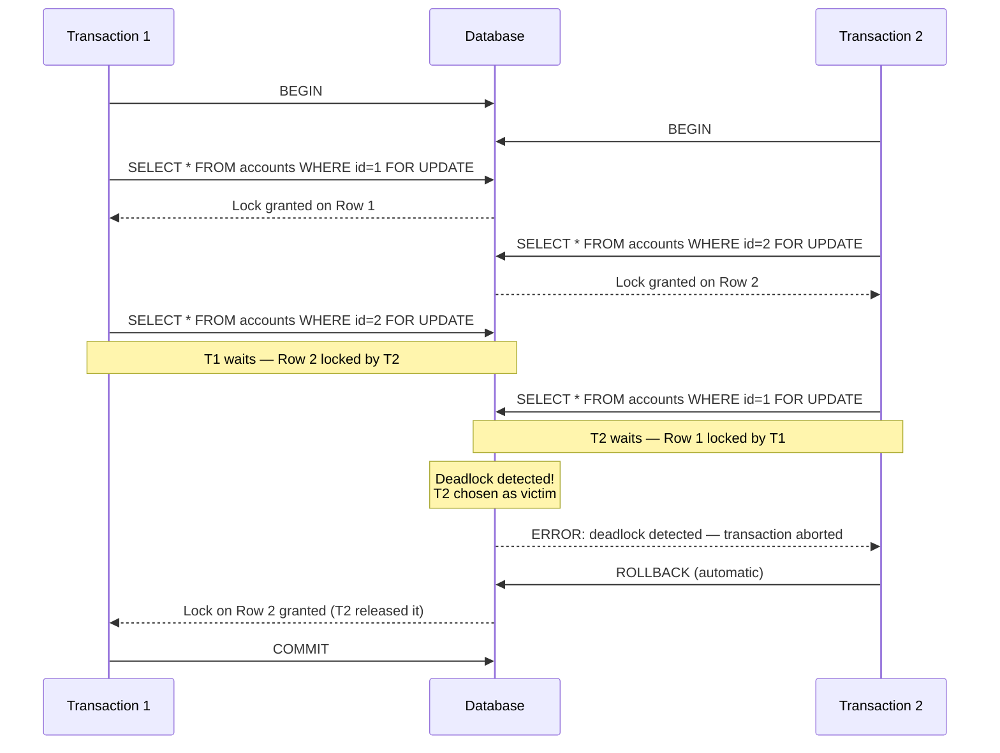

# 🔐 Transactions Deep Dive

> **Audience:** Database mein bilkul naye log. Concurrency ya locking ka koi prior knowledge assume nahi kiya gaya.
> **Goal:** Samjho transactions kya hote hain, kyun zaruri hain, aur jab bahut saare users ek saath system hit karte hain tab database tumhara data safe kaise rakhta hai.

---

## 🔁 Transaction Hota Kya Hai (Recap)?

Socho tum apne savings account se checking account mein $500 transfer kar rahe ho. Isme do steps hain:

1. Savings se $500 minus karo.
2. Checking mein $500 add karo.

Ab agar step 1 ke baad database crash ho jaaye, step 2 se pehle? Tumhare $500 gayab! Exactly yahi problem transactions solve karte hain.

Ek **transaction** matlab ek ya zyada SQL statements ka group jise database ek single, indivisible unit of work ki tarah treat karta hai. Ya to saare statements succeed karenge, ya koi bhi effect mein nahi aayega. Yeh guarantee **ACID** properties se aati hai:

| Property | Matlab |
|---|---|
| **A**tomicity | All-or-nothing. Ya to har statement commit hoga ya koi nahi. |
| **C**onsistency | Database ek valid state se doosri valid state mein jaata hai. Rules (constraints) kabhi break nahi hote. |
| **I**solation | Ek saath chal rahe transactions ek doosre ko disturb nahi karte. |
| **D**urability | Ek baar commit ho gaya, toh data crash mein bhi survive karta hai (disk pe likha ja chuka hota hai). |

---

## 🚀 Transaction Start Karna: BEGIN / START TRANSACTION

Database ko batana padta hai "ab jo bhi main karunga woh ek transaction ka hissa hai" — iske liye explicitly ek transaction open karna padta hai.

```sql
-- PostgreSQL / MySQL
BEGIN;
-- ya equivalently:
START TRANSACTION;

-- SQL Server
BEGIN TRANSACTION;

-- Oracle
-- BEGIN ki zarurat nahi. Oracle HAMESHA implicitly ek transaction ke andar hota hai.
-- Har session automatically ek transaction start kar deta hai.
```

> **Cross-DB note:** PostgreSQL aur MySQL dono `BEGIN` ya `START TRANSACTION` accept karte hain. SQL Server ko `TRANSACTION` keyword chahiye hi. Oracle mein tumhe transaction open karne ki zarurat kabhi nahi padti — woh pehle se open hi hota hai.

Jab tak transaction close nahi karte (`COMMIT` ya `ROLLBACK` se), tab tak jo bhi changes tum kar rahe ho woh tentative hain — sirf tumhe dikhte hain, permanent nahi hote.

---

## ✅ COMMIT — Changes Ko Permanent Banana

`COMMIT` transaction ko finalise karta hai. Database saare changes ko durably disk pe likh deta hai aur unhe doosre sessions ke liye bhi visible bana deta hai.

```sql
BEGIN;

UPDATE accounts SET balance = balance - 500 WHERE id = 1;
UPDATE accounts SET balance = balance + 500 WHERE id = 2;

COMMIT; -- Dono updates ab permanent hain aur sabko dikhenge
```

`COMMIT` ke baad wapis jaane ka koi rasta nahi. Data save ho chuka hai — jaise UPI payment ka "success" screen aa jaaye, ab undo nahi hota.

---

## ↩️ ROLLBACK — Sab Kuch Undo Karna

`ROLLBACK` poore transaction ko cancel kar deta hai. Database `BEGIN` ke baad kiya gaya har change discard kar deta hai, jaise kuch hua hi nahi.

```sql
BEGIN;

UPDATE accounts SET balance = balance - 500 WHERE id = 1;

-- Oops! Pata chala id = 2 exist hi nahi karta.
ROLLBACK; -- Deduction reverse ho gaya. Account 1 untouched.
```

Yeh tumhara safety net hai. Kuch bhi galat ho jaaye — error, constraint violation, ya application logic khud decide kare abort karna — `ROLLBACK` database ko wapis usi state mein le aata hai jaisa transaction shuru hone se pehle tha.

---

## 🔖 SAVEPOINT aur ROLLBACK TO SAVEPOINT

Kabhi kabhi tumhe partial undo chahiye hota hai — poora transaction cancel kiye bina sirf ek hissa undo karna. `SAVEPOINT` transaction ke andar ek named checkpoint create karta hai.

```sql
BEGIN;

INSERT INTO orders (id, product) VALUES (101, 'Laptop');

SAVEPOINT after_order; -- Yahan ek checkpoint mark kar do

INSERT INTO order_items (order_id, qty) VALUES (101, 2);

-- Order items mein kuch gadbad ho gayi
ROLLBACK TO SAVEPOINT after_order; -- Sirf order_items wala insert undo

-- Orders wala insert abhi bhi effect mein hai
COMMIT; -- Sirf orders row commit hoga
```

Savepoints ko video game ke save slots jaisa socho — beech ke point se reload kar sakte ho, poore se restart karne ki zarurat nahi.

> **Note:** `RELEASE SAVEPOINT name` savepoint ko hata deta hai bina rollback kiye. Oracle mein bhi `SAVEPOINT` hi kehte hain. SQL Server mein `SAVE TRANSACTION name` aur `ROLLBACK TRANSACTION name` use hota hai.

---

## ⚠️ Bina Proper Isolation Ke Concurrency Problems

Jab multiple transactions ek saath bina isolation controls ke chalte hain, toh strange aur dangerous cheezein ho sakti hain.

### 1. Dirty Read

Transaction A woh data padh leta hai jo Transaction B ne likha hai lekin abhi commit nahi kiya. Agar B rollback ho jaaye, toh A ne aisa data padh liya jo officially kabhi exist hi nahi kiya.

```
T1: BEGIN; UPDATE accounts SET balance = 0 WHERE id = 1;
T2:   -- Balance = 0 padh liya (dirty!)
T1: ROLLBACK; -- Balance wapis original ho gaya
T2:   -- T2 ne ek jhooth ke basis pe decision le liya
```

### 2. Non-Repeatable Read

Transaction A ek row padhta hai. Transaction B usi row ko update karke commit kar deta hai. Transaction A wahi row dobara padhta hai aur — same transaction ke andar — different value milta hai.

```
T1: SELECT balance FROM accounts WHERE id = 1; -- 1000 return hua
T2:   UPDATE accounts SET balance = 500 WHERE id = 1; COMMIT;
T1: SELECT balance FROM accounts WHERE id = 1; -- 500 return hua !!
```

Same query se ek hi transaction ke andar alag-alag results aa gaye. Yeh us assumption ko todta hai ki ek transaction ek consistent duniya dekhta hai.

### 3. Phantom Read

Transaction A ek condition match karne wale rows query karta hai. Transaction B us condition ko match karne wale naye rows insert karke commit kar deta hai. Transaction A dobara query chalata hai aur naye "phantom" rows dikhte hain jo pehle nahi the.

```
T1: SELECT * FROM orders WHERE amount > 100; -- 5 rows aaye
T2:   INSERT INTO orders (amount) VALUES (200); COMMIT;
T1: SELECT * FROM orders WHERE amount > 100; -- 6 rows aaye !!
```

### 4. Lost Update

Do transactions dono same value padhte hain, dono usi ke basis pe modify karte hain, aur dono write back karte hain — doosra write chupke se pehle wale ko overwrite kar deta hai.

```
T1: stock = 10 padha, phir stock = 9 likha
T2: stock = 10 padha (same read!), phir stock = 9 likha
-- Ek sale gayab ho gaya. Stock 8 hona chahiye tha, lekin 9 hai.
```

> [!warning]
> Yeh sab problems tab hoti hain jab do orders ek saath Zomato pe same last plate biryani book karne ki koshish karein — dono ko "available" dikhta hai, dono order confirm kar dete hain, aur restaurant ke paas ek hi plate hai!

---

## 🔒 Locking: Pessimistic vs Optimistic

Upar wali concurrency problems ko rokne ke liye do philosophies hain.

### Pessimistic Locking

"Maan lo conflict hoga hi. Data ko lock kar do isse pehle koi aur usse touch kare."

**`SELECT FOR UPDATE`** — select kiye gaye rows ko lock kar deta hai. Doosre transactions jo in rows ko modify ya lock karna chahte hain, unhe wait karna padega.

```sql
BEGIN;
SELECT balance FROM accounts WHERE id = 1 FOR UPDATE;
-- Row ab lock ho gaya. Koi doosra transaction ise UPDATE nahi kar sakta jab tak hum COMMIT ya ROLLBACK na karein.
UPDATE accounts SET balance = balance - 500 WHERE id = 1;
COMMIT;
```

**`SELECT FOR SHARE`** (PostgreSQL) / `LOCK IN SHARE MODE` (MySQL) — doosre transactions ko bhi share lock ke saath padhne deta hai, lekin koi exclusive write lock nahi lagne deta. Useful hai jab tumhe padhna hai aur confirm karna hai ki row change nahi hua, bina doosre readers ko block kiye.

```sql
SELECT * FROM products WHERE id = 42 FOR SHARE;
```

**Kab use karein pessimistic:** High-contention scenarios jahan conflicts frequent hote hain aur retry karne ka cost bahut zyada hai (jaise bank transfers, inventory deduction — socho IRCTC tatkal booking, jahan sabko wahi seat chahiye).

### Optimistic Locking

"Maan lo conflicts rare hain. Pehle se lock mat lagao. Commit ke time check karo ki kisi aur ne data change toh nahi kiya."

Sabse common technique hai ek **version column** (ya timestamp):

```sql
-- Table mein ek `version` column hai
-- Step 1: Row padho aur version note kar lo
SELECT id, balance, version FROM accounts WHERE id = 1;
-- Returns: id=1, balance=1000, version=5

-- Step 2: Sirf tab update karo agar version change nahi hua
UPDATE accounts
SET balance = 500, version = version + 1
WHERE id = 1 AND version = 5;

-- Agar 0 rows update hue, matlab kisi aur ne pehle change kar diya. Retry karo.
```

Agar doosre transaction ne row update karke version 6 kar diya, toh tumhara `WHERE version = 5` kuch match nahi karega. Application isse detect karti hai (rows affected = 0) aur retry karti hai.

**Kab use karein optimistic:** Low-contention scenarios jahan conflicts rare hote hain (jaise user profile updates, content editing). Isse locks hold karne ka overhead bach jaata hai.

---

## 💀 Deadlocks

Ek **deadlock** tab hota hai jab do (ya zyada) transactions ek doosre ka lock hold karke rakhte hain jo doosre ko chahiye, aur koi bhi aage nahi badh pata.

```
T1 ke paas Row A ka lock hai, Row B ka lock chahiye
T2 ke paas Row B ka lock hai, Row A ka lock chahiye
-- Koi aage nahi badh sakta. Deadlock!
```

### Deadlock Sequence Diagram



### Database Deadlocks Ko Detect aur Resolve Kaise Karta Hai

Databases ek **wait-for graph** use karte hain — ek graph jisme har node ek transaction hai aur har directed edge ka matlab hai "yeh transaction us transaction ke lock ka wait kar raha hai." Jab is graph mein cycle detect hoti hai, matlab deadlock exist karta hai.

Database ek transaction ko **victim** chunta hai (usually woh jisne sabse kam kaam kiya ho ya sabse kam locks hold kiye ho), use abort kar deta hai, aur uske locks release kar deta hai. Baaki transaction(s) fir aage badh sakte hain.

**Tumhari application ko deadlock errors handle karne hi padenge** — error catch karo aur transaction retry karo.

### Deadlocks Kaise Avoid Karein

1. **Hamesha locks ko same order mein acquire karo.** Agar T1 aur T2 dono hamesha Row 1 ko Row 2 se pehle lock karein, toh cycle ban hi nahi sakta.
2. **Transactions ko short rakho.** Kam locks, kam time ke liye hold — matlab circular wait ke chances bhi kam.
3. **`SELECT FOR UPDATE SKIP LOCKED`** use karo (PostgreSQL/MySQL) queue-style workloads mein — pehle se locked rows ko wait karne ke bajaye skip kar do.
4. **Transaction ke andar user input ka wait mat karo.** Kabhi bhi transaction open karke user se response ka wait mat karo commit karne se pehle.

---

## 🔑 Two-Phase Locking (2PL)

Two-Phase Locking ek theoretical protocol hai jo serializability guarantee karta hai (sabse strong isolation level). Iske do phases hain:

1. **Growing phase:** Transaction apne zarurat ke saare locks acquire karta hai. Naye locks request kar sakta hai lekin koi bhi release nahi kar sakta.
2. **Shrinking phase:** Transaction apne locks release karta hai. Ab koi naya lock acquire nahi kar sakta.

Key insight hai **lock point** — woh moment jab transaction apna maximum set of locks hold kar raha hota hai. Uske baad koi naya lock acquire nahi ho sakta.

Zyadatar databases **Strict 2PL** implement karte hain: saare locks tab tak hold hote hain jab tak transaction commit ya rollback nahi ho jaata (shrinking phase ek saath, end mein hoti hai). Isse **cascading rollbacks** rukte hain (jahan ek transaction abort hone se doosron ko bhi abort hona padta hai kyunki unhone uska dirty data padh liya tha).

Tumhe 2PL directly configure karne ki zarurat nahi — yeh ek internal guarantee hai jo database engine deta hai. Isse samajhna helpful hai yeh samajhne ke liye ki long transactions itne costly kyun hote hain: woh apni poori lifetime tak apne saare locks hold karke rakhte hain.

---

## 📸 MVCC — Multi-Version Concurrency Control

Traditional locking mein readers writers ko block karte hain aur writers readers ko. **MVCC** isse solve karta hai — har row ke multiple versions rakh kar, aur har transaction ko ek consistent snapshot dekar jaisa database transaction start hone ke waqt tha.

**Analogy:** Database ko ek Git repository socho. Jab tumhara transaction start hota hai, tumhe apni khud ki branch mil jaati hai — main branch ka ek snapshot us moment ka. Doosre transactions jo main mein naye changes commit karte hain, woh tumhari branch ko affect nahi karte. Tum hamesha ek consistent, frozen view dekhte ho.

### PostgreSQL MVCC Kaise Implement Karta Hai

PostgreSQL mein har row ke do hidden system columns hote hain:
- `xmin` — jis transaction ID ne yeh row version create kiya.
- `xmax` — jis transaction ID ne yeh row version delete (ya update) kiya.

Jab tum `SELECT` chalate ho, PostgreSQL rows lock nahi karta. Iske bajaye, woh saare row versions dhoondta hai jahan `xmin <= your_snapshot_txid` ho aur `xmax` ya toh null ho (delete nahi hua) ya ek aisa transaction ID ho jo tumhara snapshot lene tak commit nahi hua tha.

Iska matlab **readers kabhi writers ko block nahi karte, aur writers kabhi readers ko block nahi karte** PostgreSQL mein. Har reader ek consistent past snapshot dekhta hai; writers purane versions ke saath naye row versions create karte hain.

### MySQL InnoDB MVCC Kaise Implement Karta Hai

InnoDB ek **undo log** use karta hai — purane row images ka ek log. Jab koi row update hota hai, purana version undo log mein likh diya jaata hai. Jis reader ko purana consistent version chahiye, woh undo log entries ko backwards apply karke usse reconstruct karta hai.

InnoDB har transaction ke liye ek **read view** bhi maintain karta hai (transaction start hone pe `REPEATABLE READ` ke under, ya har statement ke start pe `READ COMMITTED` ke under).

### MVCC Ka Cost

Purane row versions ko tab tak rakhna padta hai jab tak koi active transaction unhe zarurat rakh sakta hai. PostgreSQL mein isse **dead tuples** kehte hain — rows jo logically delete ho chuke hain lekin physically disk pe abhi bhi hain. `VACUUM` process periodically inhe clean karta hai. Agar koi long-running transaction snapshot open rakhe, purane versions vacuum nahi ho paate, jisse **MVCC bloat** aur table bloat disk pe ho jaata hai.

---

## ⏳ Long-Running Transactions: Yeh Dangerous Kyun Hain

Ek transaction jo minutes ya hours tak chalta hai, load ke under database ke liye sabse zyada damaging cheezon mein se ek hai.

### Long Transactions Se Hone Wali Problems

| Problem | Explanation |
|---|---|
| **Locks bahut der tak hold hote hain** | Pessimistic locks jo transaction ke shuru mein acquire hue the, woh doosre transactions ko block kiye rakhte hain jab tak long transaction khatam na ho. |
| **MVCC bloat (PostgreSQL)** | Purane row versions vacuum nahi ho sakte jab tak koi transaction un versions se purana snapshot hold kare. Tables aur indexes disk pe badhte rehte hain. |
| **Deadlock risk badh jaata hai** | Zyada locks, zyada der tak hold — matlab circular wait situations ki probability badh jaati hai. |
| **Slow crash recovery** | Crash ke baad database ko ek long transaction replay ya undo karna padta hai, jisse restart time badh jaata hai. |
| **Undo log growth (MySQL)** | InnoDB ka undo log badhta jaata hai taaki long-running read view ko zarurat ke saare purane versions accommodate ho sakein. |

### Best Practices

- Bade batch operations ko chhote transactions mein todo jo har N rows ke baad commit ho.
- Kabhi bhi transaction open rakh kar user input ya external API call ka wait mat karo.
- `statement_timeout` (PostgreSQL) ya `innodb_lock_wait_timeout` (MySQL) set karo taaki runaway transactions automatically abort ho jaayein.
- Long-running transactions ko `pg_stat_activity` (PostgreSQL) ya `INFORMATION_SCHEMA.INNODB_TRX` (MySQL) se monitor karo.

```sql
-- PostgreSQL: 5 minutes se zyada der se open transactions dhoondo
SELECT pid, now() - pg_stat_activity.query_start AS duration, query, state
FROM pg_stat_activity
WHERE state != 'idle'
  AND (now() - pg_stat_activity.query_start) > INTERVAL '5 minutes';
```

> [!tip]
> Long transaction ko aise socho jaise koi Swiggy delivery partner order pick karke raaste mein ruk kar chai peene baith jaaye — jab tak woh wapis nahi aata, restaurant ka table (lock) block rehta hai aur baaki orders wait karte rehte hain.

---

## 🗂️ Isolation Levels Summary

SQL mein chaar standard isolation levels defined hain. Har ek alag set ki anomalies rokta hai:

| Isolation Level | Dirty Read | Non-Repeatable Read | Phantom Read |
|---|---|---|---|
| `READ UNCOMMITTED` | Possible | Possible | Possible |
| `READ COMMITTED` | Prevented | Possible | Possible |
| `REPEATABLE READ` | Prevented | Prevented | Possible (MySQL InnoDB mein Prevented) |
| `SERIALIZABLE` | Prevented | Prevented | Prevented |

```sql
-- Current transaction ke liye isolation level set karo
SET TRANSACTION ISOLATION LEVEL REPEATABLE READ;
BEGIN;
-- ...
```

Zyada isolation = zyada safety, lekin potentially zyada locking overhead aur kam concurrency. Zyadatar applications `READ COMMITTED` (PostgreSQL aur SQL Server ka default) ya `REPEATABLE READ` (MySQL InnoDB ka default) pe fine chalte hain.

---

## 🎯 Key Takeaways

- Ek **transaction** multiple SQL statements ko ek atomic unit mein group karta hai — ya sab succeed karte hain ya sab fail.
- **`BEGIN`** transaction open karta hai; **`COMMIT`** permanently save karta hai; **`ROLLBACK`** sab kuch undo kar deta hai.
- **`SAVEPOINT`** transaction ke andar ek partial rollback point banata hai.
- Isolation ke bina, concurrent transactions **dirty reads**, **non-repeatable reads**, **phantom reads**, aur **lost updates** jhelte hain.
- **Pessimistic locking** (`SELECT FOR UPDATE`) competing transactions ko pehle se block kar deta hai; high-contention work ke liye best hai.
- **Optimistic locking** (version column) conflicts ko sirf write time pe detect karta hai; low-contention work ke liye best hai.
- **Deadlocks** tab hote hain jab transactions circular lock dependency bana lete hain; database ek victim transaction abort karke inhe detect aur resolve karta hai.
- Locks ko hamesha ek **consistent order** mein acquire karo taaki deadlocks se bacha ja sake.
- **Two-Phase Locking (2PL)** serializable isolation ke peeche ka theoretical protocol hai — pehle grow, phir shrink, kabhi mix mat karo.
- **MVCC** readers aur writers ko bina block kiye saath rehne deta hai — multiple row versions rakh kar aur har transaction ko ek snapshot dekar.
- **Long-running transactions** zarurat se zyada der tak locks aur purane row versions hold karte hain — transactions ko short aur focused rakho.

---

## 📝 Quiz

**Question 1:** Tumne `BEGIN; UPDATE orders SET status = 'shipped' WHERE id = 99;` chalaya lekin `COMMIT` tak pahunchne se pehle hi application crash ho gayi. Update ka kya hoga?

<details>
<summary>Answer</summary>

Update automatically rollback ho jaayega. Database crash recovery ke dauran incomplete transaction ko detect karta hai aur rollback apply kar deta hai, `orders` row ko transaction shuru hone se pehle wali state mein wapis le aata hai. Yeh change kabhi bhi doosre users ko visible nahi hota.

</details>

---

**Question 2:** Transaction A ek product ka stock 50 units padhta hai. Isi beech, Transaction B bhi 50 units padhta hai, 1 bechta hai, aur commit kar deta hai (49 likh kar). Transaction A phir 1 bechta hai aur commit karta hai (49 dobara likh kar). Database ab 49 units dikhata hai, lekin do sales hui thi. Yeh kaunsi concurrency problem hai, aur optimistic locking isse kaise rokega?

<details>
<summary>Answer</summary>

Yeh ek **Lost Update** hai. Transaction B ka update chupke se Transaction A ne overwrite kar diya.

Optimistic locking ke saath, `products` table mein ek `version` column hota. Dono transactions `version = 7` padhte. Transaction B `stock = 49, version = 8 WHERE version = 7` update karta hai aur succeed ho jaata hai. Jab Transaction A phir `WHERE version = 7` try karta hai, 0 rows match hote hain (version ab 8 hai), conflict detect hota hai, aur woh fresh stock 49 padh kar operation retry karta hai.

</details>

---

**Question 3:** Ek PostgreSQL database mein ek transaction 6 ghante se chal raha hai, jo 6 ghante purane data ka snapshot hold kar raha hai. Isse database ke liye kaunsi specific operational problem hoti hai, aur kaunsa background process affect hota hai?

<details>
<summary>Answer</summary>

Long-running transaction ek purana **read snapshot** hold kar raha hai (6 ghante purani transaction ID). PostgreSQL ka **VACUUM** process us snapshot point ke baad create hue kisi bhi dead tuples (purane row versions) ko remove nahi kar sakta, kyunki purana transaction shayad abhi bhi unhe padhna chahe. Isse **MVCC bloat** hota hai — table ki physical files disk pe continuously badhti hain dead tuples ke saath jinhe clean nahi kiya ja sakta, jisse query performance degrade hoti hai aur disk space consume hota hai. `AUTOVACUUM` bhi affect hota hai aur `relfrozenxid` horizon ko advance nahi kar paata, jisse bahut lambe time period mein transaction ID wraparound ka risk badh jaata hai.

</details>

---

*Next chapter: Indexes — How Databases Find Data Fast*
