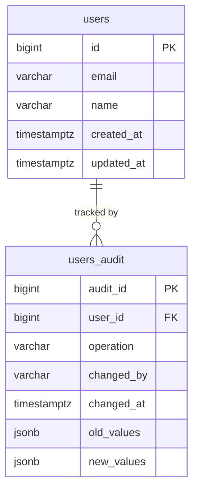

# 🗄️ Chapter 9: Database Design Best Practices

> "Ek acha schema design bilkul clean kitchen jaisa hota hai — har cheez ki apni jagah hoti hai, aur cooking ek mazaa ban jaata hai. Kharab schema ek bhari hui junk drawer jaisi hoti hai — technically sab kuch fit ho jaata hai, par kuch dhoondhna hell ban jaata hai."

---

## 📋 Table of Contents

1. [Naming Conventions](#naming-conventions)
2. [Surrogate Primary Keys](#surrogate-primary-keys)
3. [Timestamp Columns](#timestamp-columns)
4. [Soft Deletes](#soft-deletes)
5. [UUID vs Auto-Increment vs ULID/CUID](#uuid-vs-auto-increment-vs-ulidcuid)
6. [Anti-Patterns to Avoid](#anti-patterns-to-avoid)
7. [Polymorphic Associations](#polymorphic-associations)
8. [Storing JSON in a Relational Database](#storing-json-in-a-relational-database)
9. [Audit Tables / History Tables](#audit-tables--history-tables)
10. [Partitioning Large Tables](#partitioning-large-tables)
11. [Multi-Tenancy Patterns](#multi-tenancy-patterns)
12. [Key Takeaways](#key-takeaways)
13. [Quiz](#quiz)

---

## 🏷️ Naming Conventions

Kya hota hai? Naming ek documentation ka sabse sasta form hai. Agar tables aur columns ke naam consistent honge, to poori team confuse hone se bach jaayegi — chahe kitne bhi tools ya languages use ho rahe ho.

### Tables

- **Plural `snake_case`** use karo: `users`, `user_profiles`, `order_items`
- Plural isliye kyunki table ek collection of rows hoti hai — `users` table mein bahut saare user records padhe hote hain
- Abbreviations avoid karo: `usr_prf` padhne mein `user_profiles` se zyada mushkil hai
- CamelCase avoid karo: SQL kaafi jagah case-insensitive hota hai, aur mixed case cross-platform issues create karta hai

```sql
-- Good
CREATE TABLE user_profiles (...);
CREATE TABLE order_items (...);

-- Avoid
CREATE TABLE UserProfile (...);
CREATE TABLE usrprf (...);
```

### Columns

- **`snake_case`** use karo: `first_name`, `created_at`, `is_active`
- **Primary key**: hamesha `id` naam do — simple, universal, aur sabko samajh aata hai
- **Foreign keys**: pattern follow karo `tablename_id` (singular table name + `_id`)

```sql
CREATE TABLE orders (
  id          BIGINT PRIMARY KEY,
  user_id     BIGINT REFERENCES users(id),   -- FK to users table
  product_id  BIGINT REFERENCES products(id) -- FK to products table
);
```

Iska fayda simple hai — koi bhi `user_id` dekhega to turant samajh jaayega ki yeh `users` table ko reference kar raha hai. Zomato ki app mein jaise `restaurant_id` column dekh ke pata chal jaata hai ki yeh `restaurants` table se joda hai, waisa hi.

---

## 🔑 Surrogate Primary Keys

**Har table ko ek surrogate primary key do** — ek `id` column jiska sirf ek kaam hai: har row ko uniquely identify karna, business data se bilkul independent.

```sql
CREATE TABLE countries (
  id      SERIAL PRIMARY KEY,
  code    CHAR(2) UNIQUE NOT NULL,  -- business key, not the PK
  name    VARCHAR(100) NOT NULL
);
```

Kyun zaruri hai `code` (jaise `'US'`, `'IN'`) ko directly PK na banaya jaaye?

- Business keys change ho sakte hain (country codes reassign ho sakte hain, emails change ho sakte hain)
- Surrogate keys kabhi change nahi hote — yeh stable references hote hain
- Ek single integer pe JOINs strings pe JOINs se zyada fast hote hain
- ORM frameworks aur tooling ek single `id` column expect karte hain

Socho — agar CRED ka koi user apna email change kar de, aur email hi tumhara primary key ho, to har jagah cascading update karna padega. `id` alag rakhne se yeh headache hi khatam ho jaata hai.

---

## ⏱️ Timestamp Columns

**Har table mein `created_at` aur `updated_at` columns hone hi chahiye.** Yeh almost free hote hain, aur baad mein ghanton ka debugging time bacha dete hain.

```sql
CREATE TABLE posts (
  id         BIGINT      PRIMARY KEY,
  title      VARCHAR(255) NOT NULL,
  body       TEXT,
  created_at TIMESTAMPTZ  NOT NULL DEFAULT NOW(),
  updated_at TIMESTAMPTZ  NOT NULL DEFAULT NOW()
);
```

### Auto-updating `updated_at` — Cross-Database

Tricky part yeh hai ki `updated_at` ko automatically current rakhna. Har database iska handling alag tarike se karta hai:

| Database       | Mechanism                                     |
|---------------|-----------------------------------------------|
| **MySQL**      | `ON UPDATE CURRENT_TIMESTAMP` — built-in      |
| **PostgreSQL** | Trigger chahiye — koi built-in support nahi   |
| **SQL Server** | Trigger chahiye                               |
| **Oracle**     | Trigger chahiye                               |

**MySQL** (easy mode):
```sql
updated_at DATETIME NOT NULL DEFAULT CURRENT_TIMESTAMP ON UPDATE CURRENT_TIMESTAMP
```

**PostgreSQL** (trigger chahiye):
```sql
CREATE OR REPLACE FUNCTION set_updated_at()
RETURNS TRIGGER AS $$
BEGIN
  NEW.updated_at = NOW();
  RETURN NEW;
END;
$$ LANGUAGE plpgsql;

CREATE TRIGGER posts_updated_at
BEFORE UPDATE ON posts
FOR EACH ROW EXECUTE FUNCTION set_updated_at();
```

Trigger function ek baar likho, phir usko globally create karke sabhi tables mein reuse kar sakte ho.

---

## 🗑️ Soft Deletes

Row ko physically remove (`DELETE FROM ...`) karne ke bajaye, **soft delete** row ko ek nullable `deleted_at` column ke through "deleted" mark kar deta hai.

```sql
ALTER TABLE users ADD COLUMN deleted_at TIMESTAMPTZ DEFAULT NULL;

-- Soft delete
UPDATE users SET deleted_at = NOW() WHERE id = 42;

-- Query only active users
SELECT * FROM users WHERE deleted_at IS NULL;
```

### Soft Deletes ke Pros

- **Data recovery**: galti se customer delete ho gaya? Bas `deleted_at = NULL` set kar do
- **Audit trail**: pata chalta hai ki record *kab* remove hua
- **Referential integrity**: FKs jo us row ko point karte hain, valid rehte hain
- **Compliance**: regulations (GDPR audit logs, financial records) kabhi kabhi data preserve karna mandatory karte hain

### Soft Deletes ke Cons

- **Har query ko filter chahiye**: `WHERE deleted_at IS NULL` bhool gaye, to ghost rows silently include ho jaayengi
- **Unique constraints toot jaate hain**: agar koi user account delete karke same email se dobara register kare, to `email` pe unique constraint us soft-deleted row ke against fire ho jaayega
- **Indexes bloat hote hain**: deleted rows bhi index space occupy karte rehte hain
- **Complexity badhti jaati hai**: JOINs aur views sabko filter apply karna padta hai

**Mitigation**: partial unique index (PostgreSQL) ya ek view use karo jo hamesha deleted rows filter kare.

```sql
-- Partial unique index: email must be unique only among active users
CREATE UNIQUE INDEX users_email_active ON users (email)
WHERE deleted_at IS NULL;
```

> [!warning]
> Soft delete power dete hain, par discipline maangte hain. Ek bhi query mein filter bhool gaye, to production mein data leak jaisa bug aa sakta hai.

---

## 🆔 UUID vs Auto-Increment vs ULID/CUID

Apni primary key ka type choose karna schema ke sabse consequential decisions mein se ek hai.

### Auto-Increment Integer (`SERIAL` / `BIGINT AUTO_INCREMENT`)

```sql
id BIGINT GENERATED ALWAYS AS IDENTITY PRIMARY KEY
```

- **Simple**: database sab kuch khud handle karta hai
- **Chota size**: 4–8 bytes, UUID ke 16 bytes ke comparison mein
- **Ordered**: rows insertion time ke hisaab se naturally sort ho jaate hain
- **Easy joins**: chote integers cache-friendly hote hain
- **Predictable**: `/users/1`, `/users/2` — lekin iska matlab hai enumerable bhi (security risk)

Best for: internal tables, lookup tables — kuch bhi jo distributed nahi hai ya publicly expose nahi hoga.

### UUID (`uuid`)

```sql
id UUID DEFAULT gen_random_uuid() PRIMARY KEY
```

- **Globally unique**: client-side generate karna safe hai, databases merge karna bhi safe hai
- **Guess nahi kar sakte**: `/users/550e8400-e29b-41d4-a716-446655440000` kuch expose nahi karta
- **Central sequence nahi chahiye**: distributed systems ke liye badhiya
- **Bulkier**: 16 bytes, 36-character strings; random UUIDs B-tree indexes ko fragment kar dete hain (write amplification)

Best for: public-facing IDs, distributed systems, microservices jahan records multiple nodes pe create hote hain.

### ULID / CUID — Best of Both Worlds

**ULID** (Universally Unique Lexicographically Sortable Identifier) apne pehle 10 characters mein ek millisecond timestamp encode karta hai, jisse ULIDs **creation time ke hisaab se sortable** ban jaate hain, phir bhi globally unique rehte hain.

```
01ARZ3NDEKTSV4RRFFQ69G5FAV
└──────────┘└─────────────┘
 timestamp    randomness
```

**CUID2** bhi similar approach use karta hai — timestamp prefix + random suffix — aur URL-safe hai.

- Ordered inserts = B-tree index compact rehta hai (fragmentation nahi)
- Globally unique = central sequence ki zarurat nahi
- Human-readable ordering = debugging easier ho jaata hai

Jab UUID ke distribution benefits chahiye ho, par index fragmentation ki penalty nahi chahiye — tab ULID/CUID use karo. Socho IRCTC apne PNR numbers ke liye kuch aisa hi karta to ordering aur uniqueness dono mil jaate.

---

## 🚫 Anti-Patterns to Avoid

### The God Table

**God Table** ek single table hoti hai jismein sainkdo columns hote hain, aur woh system ki har possible entity ko represent karne ki koshish karti hai.

```sql
-- The God Table (do NOT do this)
CREATE TABLE entities (
  id              BIGINT PRIMARY KEY,
  name            VARCHAR,
  type            VARCHAR,   -- 'user', 'company', 'product', ...
  field_1         VARCHAR,
  field_2         VARCHAR,
  field_3         DECIMAL,
  -- ... 200 more columns ...
  field_200       TEXT
);
```

**Yeh kyun hota hai**: "Humein alag-alag type ki cheezein store karni hain, chalo ek flexible table bana dete hain."

**Yeh kyun bura hai**:
- Zyadatar rows ke liye zyadatar columns NULL rehte hain — storage waste, aur queries confusing ban jaati hain
- Koi meaningful constraint nahi (`field_47` ka matlab kya hai product ke liye vs user ke liye?)
- Schema changes ke liye ek hi massive table ALTER karna padta hai
- Indexes meaningless ho jaate hain

**Fix**: har entity type ke liye alag table banao, ya proper inheritance patterns use karo.

---

### EAV (Entity-Attribute-Value)

EAV data ko columns ki jagah key-value pairs ki tarah store karta hai:

```sql
-- EAV schema (usually a mistake)
CREATE TABLE attributes (
  entity_id   BIGINT,
  attr_name   VARCHAR(100),
  attr_value  TEXT          -- everything is text!
);
```

**Kab yeh smart lagta hai**: "Customers ko custom fields chahiye — humein schema pehle se pata nahi!"

**Yeh kyun usually galat idea hai**:
- Data types kho jaate hain — sab kuch `TEXT` hai, isliye numeric comparisons break ho jaate hain
- Har attribute ke liye NOT NULL, UNIQUE, ya FK constraints enforce nahi kar sakte
- Simple queries multi-join nightmares ban jaati hain
- Scale pe performance collapse ho jaata hai

**Better alternatives**:
- Truly dynamic attributes ke liye JSONB column (PostgreSQL)
- Separate extension tables: `user_custom_fields (user_id, field_name, field_value)`
- Class-table inheritance — ek base table + type-specific tables

EAV ke legitimate use cases bhi hain (jaise HL7 jaisa medical records system, kuch CMS platforms), par isko last resort ki tarah treat karo.

---

## 🔗 Polymorphic Associations

**Polymorphic association** mein ek FK column, ek `type` discriminator column ke basis pe *different* tables ki rows ko point kar sakta hai.

```sql
CREATE TABLE comments (
  id              BIGINT PRIMARY KEY,
  body            TEXT,
  commentable_id  BIGINT,           -- could point to posts OR videos
  commentable_type VARCHAR(50)      -- 'Post' or 'Video'
);
```

**Pros**:
- Ek `comments` table bahut saare entity types ki service kar deti hai
- Schema duplication kam hoti hai
- Rails ke ActiveRecord, Laravel ke Eloquent mein popular pattern hai

**Cons**:
- **Foreign key enforcement nahi hota** — database validate nahi kar sakta ki `commentable_id` sach mein correct table mein exist karta hai
- Queries mein pehle se type pata hona chahiye
- Types ke across reporting karna awkward ho jaata hai
- `(commentable_type, commentable_id)` pe index karna kaam karta hai, par ek real FK jitna tight nahi hota

**Alternative**: har relationship ke liye alag join table use karo (`post_comments`, `video_comments`) ya ek shared abstract parent table jismein parent ka FK ho.

---

## 📦 Storing JSON in a Relational Database

Modern databases (PostgreSQL `jsonb`, MySQL `JSON`, SQL Server `NVARCHAR` + `ISJSON`) ek column ke andar JSON store karne dete hain.

### Kab yeh sense banata hai

- **Truly dynamic, schema-less attributes**: product metadata jo category ke hisaab se bahut alag ho
- **Third-party API payloads**: raw webhook body ko apne normalized columns ke saath store karna
- **Sparse optional fields**: ek `settings` blob jahan 95% keys per user optional hain
- **Audit snapshots**: row ki state ka before/after JSON diff

```sql
CREATE TABLE products (
  id          BIGINT PRIMARY KEY,
  name        VARCHAR(255) NOT NULL,
  price       DECIMAL(10,2) NOT NULL,
  attributes  JSONB          -- {"color": "red", "weight_kg": 1.2}
);

-- PostgreSQL can index inside JSONB
CREATE INDEX ON products USING gin(attributes);
SELECT * FROM products WHERE attributes->>'color' = 'red';
```

### Kab yeh sense NAHI banata

- Individual JSON fields pe baar baar query karna (bas ek real column add kar do)
- JSON value pe referential integrity enforce karna
- Scale pe JSON field pe sorting ya aggregation karna

**Rule of thumb**: agar tum har query mein `WHERE data->>'status' = 'active'` likh rahe ho, to `status` ko ek real column bana do.

---

## 📝 Audit Tables / History Tables

**Audit table** source table mein hui har change record karti hai — kisne kya change kiya, kab, aur kis value se kis value tak.



**Implementation** (PostgreSQL trigger):

```sql
CREATE TABLE users_audit (
  audit_id    BIGSERIAL PRIMARY KEY,
  user_id     BIGINT        NOT NULL,
  operation   CHAR(1)       NOT NULL,  -- 'I', 'U', 'D'
  changed_by  VARCHAR(100),
  changed_at  TIMESTAMPTZ   NOT NULL DEFAULT NOW(),
  old_values  JSONB,
  new_values  JSONB
);

CREATE OR REPLACE FUNCTION audit_users()
RETURNS TRIGGER AS $$
BEGIN
  INSERT INTO users_audit (user_id, operation, old_values, new_values)
  VALUES (
    COALESCE(NEW.id, OLD.id),
    LEFT(TG_OP, 1),
    row_to_json(OLD),
    row_to_json(NEW)
  );
  RETURN NEW;
END;
$$ LANGUAGE plpgsql;

CREATE TRIGGER users_audit_trigger
AFTER INSERT OR UPDATE OR DELETE ON users
FOR EACH ROW EXECUTE FUNCTION audit_users();
```

> [!tip]
> Audit tables compliance (SOX, HIPAA) ke liye zaruri hain, production incidents debug karne mein kaam aate hain, aur undo/redo features implement karne ke liye bhi useful hain. Soch lo jaise CRED apni transactions ka poora history rakhta hai — taaki dispute ke waqt exact trace mil sake.

---

## ⚡ Partitioning Large Tables

Jab ek table sainkdo millions rows tak badh jaati hai, to acche indexes hone ke bawajood bhi queries slow ho jaati hain. **Partitioning** ek logical table ki physical storage ko chote-chote chunks mein baant deta hai.

### Range Partitioning

Ek continuous value ke basis pe divide karo — typically date:

```sql
CREATE TABLE events (
  id         BIGINT,
  event_type VARCHAR(50),
  created_at TIMESTAMPTZ NOT NULL
) PARTITION BY RANGE (created_at);

CREATE TABLE events_2024 PARTITION OF events
  FOR VALUES FROM ('2024-01-01') TO ('2025-01-01');

CREATE TABLE events_2025 PARTITION OF events
  FOR VALUES FROM ('2025-01-01') TO ('2026-01-01');
```

`WHERE created_at BETWEEN ...` wali queries irrelevant partitions ko poori tarah skip kar deti hain (partition pruning).

### List Partitioning

Discrete values ke set ke basis pe divide karo — region ya status ke liye useful:

```sql
CREATE TABLE orders (
  id     BIGINT,
  region VARCHAR(20) NOT NULL
) PARTITION BY LIST (region);

CREATE TABLE orders_us PARTITION OF orders FOR VALUES IN ('US', 'CA');
CREATE TABLE orders_eu PARTITION OF orders FOR VALUES IN ('DE', 'FR', 'UK');
```

### Hash Partitioning

Rows ko N partitions mein evenly distribute karo — jab koi natural range na ho, tab acha kaam karta hai:

```sql
CREATE TABLE sessions (
  id      UUID NOT NULL,
  user_id BIGINT NOT NULL
) PARTITION BY HASH (user_id);

CREATE TABLE sessions_p0 PARTITION OF sessions FOR VALUES WITH (MODULUS 4, REMAINDER 0);
CREATE TABLE sessions_p1 PARTITION OF sessions FOR VALUES WITH (MODULUS 4, REMAINDER 1);
-- ... p2, p3
```

**Kab partition karein**: jab ek single table ~50–100 million rows se zyada ho jaaye aur proper indexing ke bawajood bhi query performance kharab ho.

---

## 🏢 Multi-Tenancy Patterns

**Multi-tenant** application ek hi deployment se multiple customers (tenants) ko serve karti hai. Isके liye teen main schema strategies hain:

### 1. Shared Schema (Row-Level Isolation)

Sabhi tenants same tables share karte hain. Har table mein ek `tenant_id` column hota hai.

```sql
CREATE TABLE projects (
  id         BIGINT PRIMARY KEY,
  tenant_id  BIGINT NOT NULL REFERENCES tenants(id),
  name       VARCHAR(255) NOT NULL
);
-- Always filter: WHERE tenant_id = ?
```

- **Pros**: simple, sasta, horizontally scale karna easy
- **Cons**: ek bug data ko tenants ke beech leak kar sakta hai; per-tenant backup dena mushkil hai; ek noisy tenant sabko affect karta hai

### 2. Separate Schema (Schema-Level Isolation)

Har tenant ko apna khud ka PostgreSQL schema (namespace) milta hai:

```sql
-- Tenant A
CREATE SCHEMA tenant_acme;
CREATE TABLE tenant_acme.projects (...);

-- Tenant B
CREATE SCHEMA tenant_beta;
CREATE TABLE tenant_beta.projects (...);
```

- **Pros**: strong isolation; per-tenant migrations possible; ek tenant ka data export karna easier
- **Cons**: schema migrations N baar chalani padti hain; connection pooling harder ho jaata hai; hazaron tenants ke saath schema sprawl

### 3. Separate Database (Full Isolation)

Har tenant ki apni khud ki database instance hoti hai.

- **Pros**: complete isolation; dedicated resources; regulatory compliance (data residency) ke liye achha
- **Cons**: mehenga; operationally complex; cross-tenant reporting almost impossible

**Pattern kaise choose karein**:

| Factor                  | Shared Schema | Separate Schema | Separate DB |
|------------------------|:-------------:|:---------------:|:-----------:|
| Tenant count           | Thousands+    | Hundreds        | Tens        |
| Isolation requirement  | Low           | Medium          | High        |
| Cost sensitivity       | High          | Medium          | Low         |
| Compliance needs       | Low           | Medium          | High        |

Socho jaise OYO chahe kitne bhi hotels onboard kar le — usko shared schema hi chahiye hoga scale ke liye. Lekin ek banking SaaS product jismein har client ka data poori tarah alag rehna chahiye, wahan separate schema ya separate database better fit hoga.

---

## ✅ Key Takeaways

- **Naming clear rakho**: plural `snake_case` tables, PKs ke liye `id`, FKs ke liye `tablename_id` — consistency cleverness se better hai.
- **Har table ko `id`, `created_at`, `updated_at` chahiye** — yeh free insurance jaisa hai.
- **`updated_at` ka auto-update database ke hisaab se alag hota hai**: MySQL mein built-in hai; PostgreSQL, SQL Server, aur Oracle mein trigger chahiye.
- **Soft deletes powerful hain par discipline maangte hain** — hamesha `deleted_at IS NULL` filter karo, aur unique constraints ke liye partial indexes use karo.
- **PK type intentionally choose karo**: simplicity ke liye integer, global uniqueness ke liye UUID, distributed systems mein ordered uniqueness ke liye ULID/CUID.
- **God Tables aur EAV warning signs hain**: flexible lagte hain, par unmaintainable schemas bana dete hain — normalize karo ya JSONB use karo.
- **JSON columns ki apni jagah hai**, par agar tum har WHERE clause mein JSON field query kar rahe ho, to usko real column bana do.
- **Audit tables overhead ke saath bhi worth it hain** — kisi bhi important data ke liye triggers use karke automatically capture karo.
- **Bade tables ko range (date), list (category), ya hash (even spread) se partition karo** taaki data badhne pe bhi query performance maintained rahe.
- **Multi-tenancy strategy scale aur isolation needs pe depend karti hai** — zyadatar SaaS products shared schema se start karte hain aur compliance demands badhne pe separate schemas pe migrate karte hain.

---

## 🧠 Quiz

**Question 1**: Tumhari application blog comments store karti hai. Ek comment ya to `Post` ka ho sakta hai ya `Video` ka. Tum isko `commentable_id` aur `commentable_type` columns se implement karte ho. Is approach ka main technical risk kya hai?

<details>
<summary>Answer</summary>

Database referential integrity enforce nahi kar sakta — koi foreign key constraint nahi hai jo validate kare ki `commentable_id` sach mein correct table ki koi real row point kar raha hai. Agar tum ek post delete karo bina uske comments clean kiye, to orphaned rows aa jaayengi jinke against koi database-level protection nahi hai.

</details>

---

**Question 2**: Tum ek SaaS analytics platform bana rahe ho aur GDPR compliance ke liye har customer ka data completely isolated hona chahiye — tumhe ek customer ka data independently export ya delete karne ki ability chahiye. Konsa multi-tenancy pattern sabse appropriate hai, aur kyun?

<details>
<summary>Answer</summary>

Ya to **separate schema** ya **separate database** appropriate hai. Separate schema strong isolation deta hai aur ek tenant ka data dump ya drop karna easy banata hai bina doosron ko affect kiye, saath hi separate database se operational overhead kam rakhta hai. Separate database sabse strong isolation deta hai lekin scale pe kaafi zyada expensive ho jaata hai. Shared schema ruled out hai kyunki tenant data same tables mein co-mingled hota hai, jisse per-tenant exports aur deletions complex aur error-prone ban jaate hain.

</details>

---

**Question 3**: Tumhare paas ek `products` table hai jismein 500 million rows hain. `created_at` pe filter karne wali queries (jaise "is mahine add hue sabhi products") slow hain, jabki `created_at` indexed hai. Konsa database feature apply karna chahiye, aur yahan konsi partitioning strategy sabse appropriate hai?

<details>
<summary>Answer</summary>

**Table partitioning** apply karo, **range partitioning** ke saath `created_at` column pe. Har partition ek time window cover kare (jaise ek mahina ya ek saal). Jab query date range pe filter karti hai, database **partition pruning** use karke saare irrelevant partitions skip kar deta hai aur sirf relevant partition(s) scan karta hai — isse I/O drastically kam ho jaata hai, bina query change kiye ya naya index add kiye.

</details>

---

*Next Chapter: [Chapter 10 — Query Optimization and Execution Plans](./10-query-optimization.md)*
