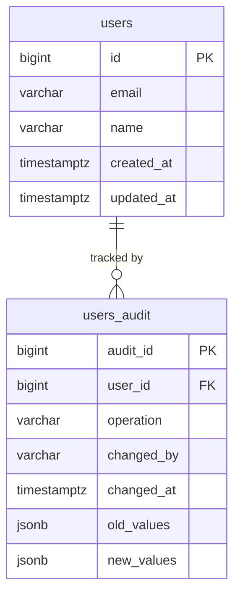

# 🗄️ Chapter 9: Database Design Best Practices

> "A well-designed schema is like a clean kitchen — everything has a place, and cooking is a joy. A poorly designed schema is like a junk drawer — technically everything fits, but good luck finding anything."

---

## 📋 Table of Contents

1. [Naming Conventions](#naming-conventions)
2. [Surrogate Primary Keys](#surrogate-primary-keys)
3. [Timestamp Columns](#timestamp-columns)
4. [Soft Deletes](#soft-deletes)
5. [UUID vs Auto-Increment vs ULID/CUID](#uuid-vs-auto-increment-vs-ulidcuid)
6. [Anti-Patterns to Avoid](#anti-patterns-to-avoid)
7. [Polymorphic Associations](#polymorphic-associations)
8. [Storing JSON in a Relational Database](#storing-json-in-a-relational-database)
9. [Audit Tables / History Tables](#audit-tables--history-tables)
10. [Partitioning Large Tables](#partitioning-large-tables)
11. [Multi-Tenancy Patterns](#multi-tenancy-patterns)
12. [Key Takeaways](#key-takeaways)
13. [Quiz](#quiz)

---

## 🏷️ Naming Conventions

Good naming is the cheapest form of documentation. Consistency prevents confusion across teams and tools.

### Tables

- Use **plural `snake_case`**: `users`, `user_profiles`, `order_items`
- Plural because a table is a collection of rows — `users` holds many user records
- Avoid abbreviations: `usr_prf` is harder to read than `user_profiles`
- Avoid CamelCase: SQL is often case-insensitive, and mixing case causes cross-platform issues

```sql
-- Good
CREATE TABLE user_profiles (...);
CREATE TABLE order_items (...);

-- Avoid
CREATE TABLE UserProfile (...);
CREATE TABLE usrprf (...);
```

### Columns

- Use **`snake_case`**: `first_name`, `created_at`, `is_active`
- **Primary key**: always name it `id` — simple, universal, readable
- **Foreign keys**: use the pattern `tablename_id` (singular table name + `_id`)

```sql
CREATE TABLE orders (
  id          BIGINT PRIMARY KEY,
  user_id     BIGINT REFERENCES users(id),   -- FK to users table
  product_id  BIGINT REFERENCES products(id) -- FK to products table
);
```

This convention means anyone reading `user_id` immediately knows it references the `users` table.

---

## 🔑 Surrogate Primary Keys

**Always give every table a surrogate primary key** — a column named `id` whose sole job is to uniquely identify each row, independent of business data.

```sql
CREATE TABLE countries (
  id      SERIAL PRIMARY KEY,
  code    CHAR(2) UNIQUE NOT NULL,  -- business key, not the PK
  name    VARCHAR(100) NOT NULL
);
```

Why not use `code` (e.g., `'US'`, `'IN'`) as the PK directly?

- Business keys change (country codes can be reassigned, emails change)
- Surrogate keys never need to change — they are stable references
- JOINs on a single integer are faster than JOINs on strings
- ORM frameworks and tooling expect a single `id` column

---

## ⏱️ Timestamp Columns

**Every table should have `created_at` and `updated_at` columns.** They cost almost nothing and save hours of debugging later.

```sql
CREATE TABLE posts (
  id         BIGINT      PRIMARY KEY,
  title      VARCHAR(255) NOT NULL,
  body       TEXT,
  created_at TIMESTAMPTZ  NOT NULL DEFAULT NOW(),
  updated_at TIMESTAMPTZ  NOT NULL DEFAULT NOW()
);
```

### Auto-updating `updated_at` — Cross-Database

The tricky part is keeping `updated_at` current automatically. Each database handles this differently:

| Database       | Mechanism                                     |
|---------------|-----------------------------------------------|
| **MySQL**      | `ON UPDATE CURRENT_TIMESTAMP` — built-in      |
| **PostgreSQL** | Requires a trigger — no built-in support      |
| **SQL Server** | Requires a trigger                            |
| **Oracle**     | Requires a trigger                            |

**MySQL** (easy mode):
```sql
updated_at DATETIME NOT NULL DEFAULT CURRENT_TIMESTAMP ON UPDATE CURRENT_TIMESTAMP
```

**PostgreSQL** (trigger required):
```sql
CREATE OR REPLACE FUNCTION set_updated_at()
RETURNS TRIGGER AS $$
BEGIN
  NEW.updated_at = NOW();
  RETURN NEW;
END;
$$ LANGUAGE plpgsql;

CREATE TRIGGER posts_updated_at
BEFORE UPDATE ON posts
FOR EACH ROW EXECUTE FUNCTION set_updated_at();
```

Write the trigger once, reuse it across all tables by creating the function globally.

---

## 🗑️ Soft Deletes

Instead of physically removing a row (`DELETE FROM ...`), a **soft delete** marks the row as deleted using a nullable `deleted_at` column.

```sql
ALTER TABLE users ADD COLUMN deleted_at TIMESTAMPTZ DEFAULT NULL;

-- Soft delete
UPDATE users SET deleted_at = NOW() WHERE id = 42;

-- Query only active users
SELECT * FROM users WHERE deleted_at IS NULL;
```

### Pros of Soft Deletes

- **Data recovery**: accidentally deleted a customer? Just set `deleted_at = NULL`
- **Audit trail**: you know *when* a record was removed
- **Referential integrity**: FKs pointing to the row remain valid
- **Compliance**: regulations (GDPR audit logs, financial records) sometimes require keeping data

### Cons of Soft Deletes

- **Every query needs a filter**: forget `WHERE deleted_at IS NULL` and you silently include ghost rows
- **Unique constraints break**: if a user deletes their account and re-registers with the same email, the unique constraint on `email` fires against the soft-deleted row
- **Indexes bloat**: deleted rows still occupy index space
- **Complexity creeps**: JOINs and views all need the filter applied

**Mitigation**: use a partial unique index (PostgreSQL) or a view that always filters out deleted rows.

```sql
-- Partial unique index: email must be unique only among active users
CREATE UNIQUE INDEX users_email_active ON users (email)
WHERE deleted_at IS NULL;
```

---

## 🆔 UUID vs Auto-Increment vs ULID/CUID

Choosing your primary key type is one of the most consequential schema decisions.

### Auto-Increment Integer (`SERIAL` / `BIGINT AUTO_INCREMENT`)

```sql
id BIGINT GENERATED ALWAYS AS IDENTITY PRIMARY KEY
```

- **Simple**: the database handles everything
- **Small**: 4–8 bytes vs 16 bytes for UUID
- **Ordered**: rows sort by insertion time naturally
- **Easy joins**: small integers are cache-friendly
- **Predictable**: `/users/1`, `/users/2` — but this also means enumerable (security risk)

Best for: internal tables, lookup tables, anything that won't be distributed or exposed publicly.

### UUID (`uuid`)

```sql
id UUID DEFAULT gen_random_uuid() PRIMARY KEY
```

- **Globally unique**: safe to generate client-side, safe to merge databases
- **Not guessable**: `/users/550e8400-e29b-41d4-a716-446655440000` exposes nothing
- **No central sequence**: great for distributed systems
- **Bulkier**: 16 bytes, 36-character strings; random UUIDs fragment B-tree indexes (write amplification)

Best for: public-facing IDs, distributed systems, microservices where records are created across multiple nodes.

### ULID / CUID — Best of Both Worlds

**ULID** (Universally Unique Lexicographically Sortable Identifier) encodes a millisecond timestamp in the first 10 characters, making ULIDs **sortable by creation time** while remaining globally unique.

```
01ARZ3NDEKTSV4RRFFQ69G5FAV
└──────────┘└─────────────┘
 timestamp    randomness
```

**CUID2** uses a similar approach — timestamp prefix + random suffix — and is URL-safe.

- Ordered inserts = B-tree index stays compact (no fragmentation)
- Globally unique = no central sequence needed
- Human-readable ordering = debugging is easier

Use ULID/CUID when you want UUID's distribution benefits without the index fragmentation penalty.

---

## 🚫 Anti-Patterns to Avoid

### The God Table

A **God Table** is a single table with hundreds of columns trying to represent every possible entity in the system.

```sql
-- The God Table (do NOT do this)
CREATE TABLE entities (
  id              BIGINT PRIMARY KEY,
  name            VARCHAR,
  type            VARCHAR,   -- 'user', 'company', 'product', ...
  field_1         VARCHAR,
  field_2         VARCHAR,
  field_3         DECIMAL,
  -- ... 200 more columns ...
  field_200       TEXT
);
```

**Why it happens**: "We'll need to store different types of things, let's just make one flexible table."

**Why it's bad**:
- Most columns are NULL for most rows — wasted storage, confusing queries
- No meaningful constraints (what does `field_47` mean for a product vs a user?)
- Schema changes require ALTERing one massive table
- Indexes become meaningless

**Fix**: separate tables per entity type, or use proper inheritance patterns.

---

### EAV (Entity-Attribute-Value)

EAV stores data as key-value pairs instead of columns:

```sql
-- EAV schema (usually a mistake)
CREATE TABLE attributes (
  entity_id   BIGINT,
  attr_name   VARCHAR(100),
  attr_value  TEXT          -- everything is text!
);
```

**When it seems smart**: "Our customers need custom fields — we can't know the schema upfront!"

**Why it's usually not**:
- You lose data types — everything is `TEXT`, so numeric comparisons break
- You cannot enforce NOT NULL, UNIQUE, or FK constraints per attribute
- Simple queries become multi-join nightmares
- Performance collapses at scale

**Better alternatives**:
- JSONB column for truly dynamic attributes (PostgreSQL)
- Separate extension tables: `user_custom_fields (user_id, field_name, field_value)`
- Class-table inheritance with a base table + type-specific tables

EAV has legitimate uses (medical records systems like HL7, some CMS platforms), but treat it as a last resort.

---

## 🔗 Polymorphic Associations

A **polymorphic association** lets one FK column point to rows in *different* tables depending on a `type` discriminator column.

```sql
CREATE TABLE comments (
  id              BIGINT PRIMARY KEY,
  body            TEXT,
  commentable_id  BIGINT,           -- could point to posts OR videos
  commentable_type VARCHAR(50)      -- 'Post' or 'Video'
);
```

**Pros**:
- One `comments` table serves many entity types
- Less schema duplication
- Popular in ActiveRecord (Rails), Eloquent (Laravel)

**Cons**:
- **No foreign key enforcement** — the database cannot validate that `commentable_id` actually exists in the referenced table
- Queries require knowing the type upfront
- Reporting across types is awkward
- Indexing `(commentable_type, commentable_id)` works but is not as tight as a real FK

**Alternative**: use a separate join table per relationship (`post_comments`, `video_comments`) or a shared abstract parent table with FK to the parent.

---

## 📦 Storing JSON in a Relational Database

Modern databases (PostgreSQL `jsonb`, MySQL `JSON`, SQL Server `NVARCHAR` + `ISJSON`) let you store JSON inside a column.

### When it makes sense

- **Truly dynamic, schema-less attributes**: product metadata that varies wildly by category
- **Third-party API payloads**: store the raw webhook body alongside your normalized columns
- **Sparse optional fields**: a `settings` blob where 95% of keys are optional per user
- **Audit snapshots**: a before/after JSON diff of a row's state

```sql
CREATE TABLE products (
  id          BIGINT PRIMARY KEY,
  name        VARCHAR(255) NOT NULL,
  price       DECIMAL(10,2) NOT NULL,
  attributes  JSONB          -- {"color": "red", "weight_kg": 1.2}
);

-- PostgreSQL can index inside JSONB
CREATE INDEX ON products USING gin(attributes);
SELECT * FROM products WHERE attributes->>'color' = 'red';
```

### When it does NOT make sense

- Querying frequently on individual JSON fields (just add a real column)
- Enforcing referential integrity on a JSON value
- Sorting or aggregating on a JSON field at scale

**Rule of thumb**: if you find yourself writing `WHERE data->>'status' = 'active'` in every query, promote `status` to a real column.

---

## 📝 Audit Tables / History Tables

An **audit table** records every change made to a source table — who changed what, when, and from what value to what value.



**Implementation** (PostgreSQL trigger):

```sql
CREATE TABLE users_audit (
  audit_id    BIGSERIAL PRIMARY KEY,
  user_id     BIGINT        NOT NULL,
  operation   CHAR(1)       NOT NULL,  -- 'I', 'U', 'D'
  changed_by  VARCHAR(100),
  changed_at  TIMESTAMPTZ   NOT NULL DEFAULT NOW(),
  old_values  JSONB,
  new_values  JSONB
);

CREATE OR REPLACE FUNCTION audit_users()
RETURNS TRIGGER AS $$
BEGIN
  INSERT INTO users_audit (user_id, operation, old_values, new_values)
  VALUES (
    COALESCE(NEW.id, OLD.id),
    LEFT(TG_OP, 1),
    row_to_json(OLD),
    row_to_json(NEW)
  );
  RETURN NEW;
END;
$$ LANGUAGE plpgsql;

CREATE TRIGGER users_audit_trigger
AFTER INSERT OR UPDATE OR DELETE ON users
FOR EACH ROW EXECUTE FUNCTION audit_users();
```

Audit tables are essential for compliance (SOX, HIPAA), debugging production incidents, and implementing undo/redo features.

---

## ⚡ Partitioning Large Tables

When a table grows into hundreds of millions of rows, queries slow down even with good indexes. **Partitioning** splits the physical storage of one logical table into smaller chunks.

### Range Partitioning

Divide by a continuous value — typically a date:

```sql
CREATE TABLE events (
  id         BIGINT,
  event_type VARCHAR(50),
  created_at TIMESTAMPTZ NOT NULL
) PARTITION BY RANGE (created_at);

CREATE TABLE events_2024 PARTITION OF events
  FOR VALUES FROM ('2024-01-01') TO ('2025-01-01');

CREATE TABLE events_2025 PARTITION OF events
  FOR VALUES FROM ('2025-01-01') TO ('2026-01-01');
```

Queries with `WHERE created_at BETWEEN ...` skip irrelevant partitions entirely (partition pruning).

### List Partitioning

Divide by a discrete set of values — useful for region or status:

```sql
CREATE TABLE orders (
  id     BIGINT,
  region VARCHAR(20) NOT NULL
) PARTITION BY LIST (region);

CREATE TABLE orders_us PARTITION OF orders FOR VALUES IN ('US', 'CA');
CREATE TABLE orders_eu PARTITION OF orders FOR VALUES IN ('DE', 'FR', 'UK');
```

### Hash Partitioning

Distribute rows evenly across N partitions — good when there's no natural range:

```sql
CREATE TABLE sessions (
  id      UUID NOT NULL,
  user_id BIGINT NOT NULL
) PARTITION BY HASH (user_id);

CREATE TABLE sessions_p0 PARTITION OF sessions FOR VALUES WITH (MODULUS 4, REMAINDER 0);
CREATE TABLE sessions_p1 PARTITION OF sessions FOR VALUES WITH (MODULUS 4, REMAINDER 1);
-- ... p2, p3
```

**When to partition**: when a single table exceeds ~50–100 million rows and query performance degrades despite proper indexing.

---

## 🏢 Multi-Tenancy Patterns

A **multi-tenant** application serves multiple customers (tenants) from the same deployment. There are three main schema strategies:

### 1. Shared Schema (Row-Level Isolation)

All tenants share the same tables. Every table has a `tenant_id` column.

```sql
CREATE TABLE projects (
  id         BIGINT PRIMARY KEY,
  tenant_id  BIGINT NOT NULL REFERENCES tenants(id),
  name       VARCHAR(255) NOT NULL
);
-- Always filter: WHERE tenant_id = ?
```

- **Pros**: simple, cheap, easy to scale horizontally
- **Cons**: one bug leaks data across tenants; hard to give per-tenant backups; one noisy tenant affects all

### 2. Separate Schema (Schema-Level Isolation)

Each tenant gets their own PostgreSQL schema (namespace):

```sql
-- Tenant A
CREATE SCHEMA tenant_acme;
CREATE TABLE tenant_acme.projects (...);

-- Tenant B
CREATE SCHEMA tenant_beta;
CREATE TABLE tenant_beta.projects (...);
```

- **Pros**: strong isolation; per-tenant migrations possible; easier to export one tenant's data
- **Cons**: schema migrations must run N times; connection pooling is harder; schema sprawl with thousands of tenants

### 3. Separate Database (Full Isolation)

Each tenant has their own database instance.

- **Pros**: complete isolation; dedicated resources; regulatory compliance (data residency)
- **Cons**: expensive; operationally complex; cross-tenant reporting is nearly impossible

**Choosing a pattern**:

| Factor                  | Shared Schema | Separate Schema | Separate DB |
|------------------------|:-------------:|:---------------:|:-----------:|
| Tenant count           | Thousands+    | Hundreds        | Tens        |
| Isolation requirement  | Low           | Medium          | High        |
| Cost sensitivity       | High          | Medium          | Low         |
| Compliance needs       | Low           | Medium          | High        |

---

## ✅ Key Takeaways

- **Name things clearly**: plural `snake_case` tables, `id` for PKs, `tablename_id` for FKs — consistency beats cleverness.
- **Every table needs `id`, `created_at`, `updated_at`** — these are free insurance.
- **`updated_at` auto-update varies by database**: MySQL has it built-in; PostgreSQL, SQL Server, and Oracle need a trigger.
- **Soft deletes are powerful but require discipline** — always filter on `deleted_at IS NULL`, and use partial indexes for unique constraints.
- **Choose your PK type intentionally**: integer for simplicity, UUID for global uniqueness, ULID/CUID for ordered uniqueness in distributed systems.
- **God Tables and EAV are warning signs**: they feel flexible but create unmaintainable schemas — normalize or use JSONB instead.
- **JSON columns have a place**, but if you query a JSON field in every WHERE clause, make it a real column.
- **Audit tables are worth the overhead** for any data that matters — use triggers to capture them automatically.
- **Partition large tables by range (date), list (category), or hash (even spread)** to keep query performance as data grows.
- **Multi-tenancy strategy depends on scale and isolation needs** — most SaaS products start with shared schema and migrate to separate schemas as compliance demands grow.

---

## 🧠 Quiz

**Question 1**: Your application stores blog comments. A comment can belong to either a `Post` or a `Video`. You implement this with `commentable_id` and `commentable_type` columns. What is the main technical risk of this approach?

<details>
<summary>Answer</summary>

The database cannot enforce referential integrity — there is no foreign key constraint that validates `commentable_id` actually points to a real row in the correct table. If you delete a post without cleaning up its comments, you get orphaned rows with no database-level protection against it.

</details>

---

**Question 2**: You are building a SaaS analytics platform and need each customer's data to be completely isolated for GDPR compliance — you must be able to export or delete one customer's data independently. Which multi-tenancy pattern is most appropriate, and why?

<details>
<summary>Answer</summary>

Either **separate schema** or **separate database** is appropriate. Separate schema gives strong isolation and makes it easy to dump or drop one tenant's data without affecting others, while keeping operational overhead lower than separate databases. Separate database is the strongest isolation but significantly more expensive at scale. Shared schema is ruled out because tenant data is co-mingled in the same tables, making per-tenant exports and deletions complex and error-prone.

</details>

---

**Question 3**: You have a `products` table with 500 million rows. Queries filtering by `created_at` (e.g., "all products added this month") are slow even though `created_at` is indexed. What database feature should you apply, and which partitioning strategy is most appropriate here?

<details>
<summary>Answer</summary>

Apply **table partitioning** using **range partitioning** on the `created_at` column. Each partition covers a time window (e.g., one month or one year). When a query filters by date range, the database uses **partition pruning** to skip all irrelevant partitions and scan only the relevant one(s), dramatically reducing I/O even without changing the query or adding new indexes.

</details>

---

*Next Chapter: [Chapter 10 — Query Optimization and Execution Plans](./10-query-optimization.md)*
