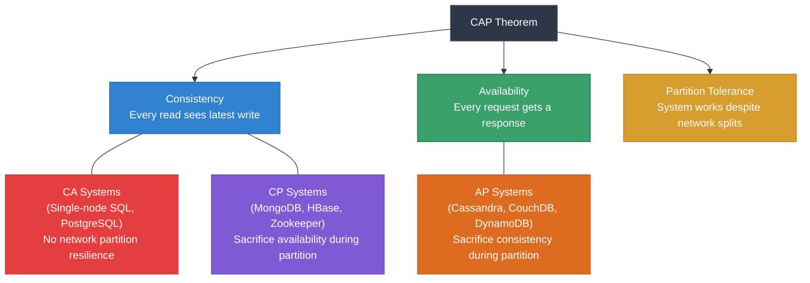
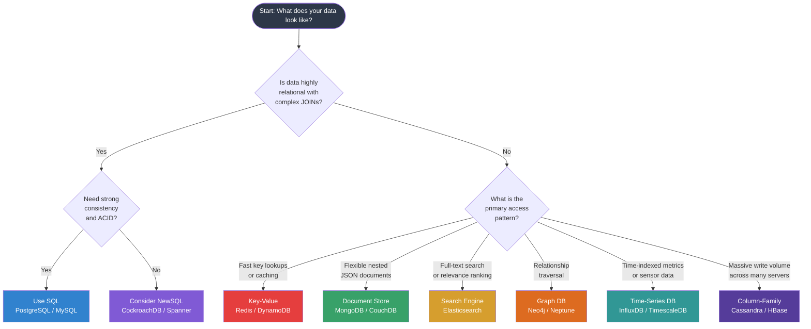

# 🗄️ Chapter 10: SQL vs NoSQL — Choosing the Right Database

> **Who this is for:** Developers just starting out with databases who want to understand the landscape before picking a technology.

---

## 🧭 Why This Choice Matters

Before you write a single line of code, one of the most consequential decisions you will make is: **which database do I use?** The wrong choice can mean painful migrations later, poor performance at scale, or unnecessary complexity for a simple app.

The good news: once you understand the trade-offs, the decision becomes much more intuitive.

---

## 🟦 The SQL (Relational) World

SQL databases have been the backbone of software for over 50 years. They store data in **tables** — rows and columns, like a very powerful spreadsheet — and relationships between tables are expressed using **foreign keys** and **JOIN** operations.

**Core characteristics:**

| Property | What it means |
|---|---|
| Structured data | Every row in a table has the same columns (schema) |
| Fixed schema | You define the structure upfront; changes require migrations |
| Relationships | Data across tables links together via foreign keys |
| ACID guarantees | Transactions are safe, consistent, and reliable |
| SQL language | Universally understood query language |

**Popular SQL databases:** PostgreSQL, MySQL, SQLite, Microsoft SQL Server, Oracle.

### ACID — The Reliability Promise

ACID is the gold standard for data integrity. Every transaction in a SQL database guarantees:

- **A — Atomicity:** A transaction either fully succeeds or fully fails. No half-written states. If you transfer money from Account A to Account B and the power cuts out halfway, the money does not vanish — the entire transaction rolls back.
- **C — Consistency:** The database only moves from one valid state to another. Rules (constraints, foreign keys) are always enforced.
- **I — Isolation:** Concurrent transactions do not interfere with each other. Two people booking the last concert seat at the same moment will not both get it.
- **D — Durability:** Once a transaction is committed, it survives crashes. The data is written to disk.

ACID is why banks, hospitals, and e-commerce checkouts trust relational databases with their most critical data.

---

## 🟩 The NoSQL World

NoSQL (sometimes read as "Not Only SQL") emerged in the 2000s when companies like Google, Amazon, and Facebook hit walls with traditional relational databases — specifically around **scale** and **flexibility**.

NoSQL is not one thing. It is a family of database designs that trade some relational guarantees for other benefits: flexible schemas, horizontal scaling, and specialization for particular access patterns.

**Core characteristics:**

| Property | What it means |
|---|---|
| Flexible schema | Documents/records can have different fields; no migration needed |
| Horizontal scaling | Add more servers rather than upgrading one big server |
| Eventual consistency | Reads might temporarily return stale data across replicas |
| Specialized access | Optimized for specific patterns (caching, search, graphs, etc.) |
| Varied query models | Each NoSQL type has its own query style |

---

## 🗂️ Types of NoSQL Databases

### 1. 📄 Document Stores — MongoDB, CouchDB

Data is stored as self-describing documents, typically in JSON or BSON format. Each document can have a completely different structure.

**Best for:** Content management systems, user profiles, catalogs, any data where structure varies between records.

```json
// A user document in MongoDB
{
  "_id": "u_12345",
  "name": "Priya Sharma",
  "email": "priya@example.com",
  "preferences": {
    "theme": "dark",
    "notifications": ["email", "sms"]
  },
  "addresses": [
    { "type": "home", "city": "Pune", "pincode": "411001" },
    { "type": "work", "city": "Mumbai", "pincode": "400001" }
  ]
}
```

The nested `addresses` array would require a separate table in SQL. In MongoDB, it lives naturally inside the document.

---

### 2. ⚡ Key-Value Stores — Redis, DynamoDB

The simplest model: a giant dictionary. You look up a value by its key. Extremely fast because there is no query planning — just direct lookups.

**Best for:** Caching, session storage, rate limiting, leaderboards, real-time counters.

```
SET session:abc123  '{"userId": 42, "role": "admin"}'  EX 3600
GET session:abc123
```

Redis can store millions of lookups per second and keeps data in memory for microsecond latency. It is usually the first thing added to an architecture when a SQL database gets too slow for repeated reads.

---

### 3. 🏛️ Column-Family Stores — Apache Cassandra, HBase

Data is organized into rows and columns like SQL, but with a twist: columns are grouped into **column families**, and rows can have different columns. Cassandra is designed to handle write-heavy workloads at massive scale across many servers.

**Best for:** Time-series data, IoT sensor readings, event logs, analytics at scale.

```
-- Cassandra writes are extremely fast; great for:
-- sensor_readings table
-- row key: device_id + timestamp
-- columns: temperature, humidity, pressure
```

Cassandra is used by Netflix, Apple, and Instagram for workloads that require writing millions of records per second without a single point of failure.

---

### 4. 🕸️ Graph Databases — Neo4j, Amazon Neptune

In a graph database, **relationships are first-class citizens**. Data is stored as nodes (entities) and edges (relationships between them). This makes traversing complex relationship chains incredibly efficient — something SQL JOINs struggle with at depth.

**Best for:** Social networks, recommendation engines, fraud detection, knowledge graphs.

```cypher
-- Find friends of friends who like Jazz in Neo4j (Cypher query)
MATCH (me:User {name: "Arjun"})-[:FRIENDS_WITH*2]-(fof:User)-[:LIKES]->(genre:Genre {name: "Jazz"})
RETURN fof.name
```

This query that traverses two levels of friendship would require multiple self-JOINs in SQL and would slow down significantly with millions of users.

---

### 5. 🔍 Search Engines — Elasticsearch, OpenSearch

Optimized for **full-text search** with relevance ranking. Under the hood they use inverted indexes — the same technique search engines use to find documents containing a word instantly across billions of records.

**Best for:** Product search, log analysis, autocomplete, document search, observability dashboards.

```json
// Search for "wireless headphones" sorted by relevance
{
  "query": {
    "match": { "description": "wireless headphones" }
  }
}
```

Elasticsearch powers the search on sites like GitHub, Wikipedia, and Stack Overflow.

---

### 6. ⏱️ Time-Series Databases — InfluxDB, TimescaleDB

Built specifically for data that is indexed by time: metrics, sensor readings, financial tick data, server performance. They use compression and storage layouts optimized for sequential time-based writes and range queries.

**Best for:** Server monitoring, IoT telemetry, financial market data, application performance monitoring (APM).

```sql
-- TimescaleDB (extends PostgreSQL)
SELECT time_bucket('1 hour', time) AS hour, avg(cpu_usage)
FROM server_metrics
WHERE time > NOW() - INTERVAL '24 hours'
GROUP BY hour
ORDER BY hour;
```

TimescaleDB is particularly interesting because it gives you time-series performance on top of a familiar PostgreSQL interface.

---

## 🔺 CAP Theorem — The Fundamental Trade-off

In 2000, computer scientist Eric Brewer proposed that distributed databases can only guarantee **two of these three properties** simultaneously:

- **C — Consistency:** Every read receives the most recent write (or an error).
- **A — Availability:** Every request receives a response (not guaranteed to be the latest data).
- **P — Partition Tolerance:** The system keeps operating even when network communication between nodes fails.

In any real distributed system, **network partitions will happen** — so P is not optional. That means you are really choosing between **CP** (consistency over availability) or **AP** (availability over consistency).



**Real-world examples:**

| System | CAP Position | Trade-off in practice |
|---|---|---|
| PostgreSQL (single node) | CA | No partition tolerance; great for one server |
| MongoDB | CP | During a network split, MongoDB refuses writes to stay consistent |
| Cassandra | AP | During a split, Cassandra keeps accepting writes; you might read stale data briefly |
| Zookeeper | CP | Prefers to be unavailable rather than return inconsistent data |
| DynamoDB | AP (configurable) | Eventual consistency by default; strong consistency available at cost |

---

## ⚗️ ACID vs BASE

SQL databases offer ACID. Many NoSQL databases operate on a looser model called **BASE**:

| | ACID | BASE |
|---|---|---|
| Full form | Atomicity, Consistency, Isolation, Durability | Basically Available, Soft state, Eventually consistent |
| Consistency model | Strong (immediate) | Eventual |
| Availability | May sacrifice for consistency | Prioritized |
| Use case fit | Financial transactions, bookings | Social feeds, analytics, caching |
| Example systems | PostgreSQL, MySQL, Oracle | Cassandra, DynamoDB, CouchDB |

**"Eventually consistent"** means: if you write a value and immediately read it from a different replica, you might briefly get the old value. Within milliseconds to seconds, all replicas converge. For a social media "like count" that is perfectly fine. For a bank balance, it is absolutely not.

---

## 🤔 Decision Guide — When to Use What



### Use SQL when:
- You have financial transactions or anything where partial writes would be catastrophic
- Your data has clear relationships (users, orders, products, invoices)
- You need complex queries with multiple JOINs
- Your team knows SQL well and your data fits in one server or a small cluster
- Regulatory compliance requires strong data integrity guarantees

### Use NoSQL when:
- Your schema changes frequently or varies between records
- You need to scale writes horizontally across many servers
- You have a specialized access pattern (search, graph, time-series, caching)
- You can tolerate eventual consistency for better availability
- You are building real-time features: live dashboards, activity feeds, leaderboards

---

## 📊 Big Comparison Table

| Feature | PostgreSQL (SQL) | MongoDB (Document) | Redis (Key-Value) | Cassandra (Column) | Neo4j (Graph) |
|---|---|---|---|---|---|
| Data model | Tables & rows | JSON documents | Key-value pairs | Wide-column rows | Nodes & edges |
| Schema | Strict, fixed | Flexible | None | Flexible | Flexible |
| Query language | SQL | MQL / aggregation pipeline | Commands (GET, SET) | CQL (SQL-like) | Cypher |
| ACID transactions | Full ACID | Multi-doc ACID (v4+) | Partial (MULTI/EXEC) | Lightweight transactions | ACID |
| Horizontal scaling | Limited (read replicas) | Good (sharding) | Good (cluster) | Excellent (by design) | Limited |
| Best for | Complex relational data | Varied/nested documents | Caching, sessions | High-write time-series | Relationship traversal |
| Consistency | Strong | Configurable | Strong (single node) | Eventual (tunable) | Strong |
| CAP position | CA | CP | CA/CP | AP | CA |
| Learning curve | Medium | Low-Medium | Low | Medium-High | Medium |

---

## 🆕 NewSQL — Best of Both Worlds?

NewSQL databases attempt to combine the ACID guarantees of SQL with the horizontal scalability of NoSQL.

**CockroachDB** and **Google Spanner** are the leading examples. They:
- Accept standard SQL queries
- Support full ACID transactions across distributed nodes
- Automatically shard data across many servers
- Survive entire data center failures

The trade-off: they are more complex to operate than traditional SQL and introduce higher latency due to distributed coordination (consensus protocols like Raft or Paxos).

**Use NewSQL when** you genuinely need both: SQL semantics AND global scale. A fintech startup expanding internationally is the classic use case — you need consistent financial transactions AND you need them to work reliably across regions.

---

## 🏗️ Real Architecture Example

A modern e-commerce application might use several databases simultaneously, each chosen for its strengths:

```
User authentication & profiles  →  PostgreSQL (ACID, relational)
Product catalog                 →  MongoDB (flexible schema per category)
Shopping cart & sessions        →  Redis (fast, ephemeral, key-value)
Order history & inventory       →  PostgreSQL (ACID transactions critical)
Product search                  →  Elasticsearch (full-text, facets, filters)
Recommendation engine           →  Neo4j (relationship traversal)
Server monitoring               →  InfluxDB (time-series metrics)
```

This pattern is called **polyglot persistence** — using the right database for each specific job rather than forcing every use case into a single database.

---

## 🔑 Key Takeaways

1. **SQL = structured, relational, ACID.** Use it for anything where consistency and relationships matter: finance, user accounts, inventory.

2. **NoSQL = flexible, scalable, specialized.** Not a single thing — document, key-value, column-family, graph, search, and time-series databases each solve a specific problem better than SQL.

3. **CAP theorem forces a choice.** In a distributed system you pick Consistency + Partition Tolerance (CP) or Availability + Partition Tolerance (AP). Strong consistency costs availability during network failures.

4. **ACID vs BASE is not good vs bad** — it is a trade-off. Eventual consistency is perfectly fine for social feeds; it is unacceptable for financial transfers.

5. **Polyglot persistence is normal.** Production systems routinely use 3-5 different databases. Pick the right tool for each job.

6. **NewSQL (CockroachDB, Spanner) bridges the gap** when you genuinely need both SQL semantics and global horizontal scale.

7. **Start with PostgreSQL.** For most new projects, PostgreSQL is the safest default — it is powerful, battle-tested, and can be extended with plugins like TimescaleDB. Only switch to a specialized database once you have a concrete reason.

---

## 🧪 Quiz — Test Your Understanding

**Question 1:** You are building a feature that lets users transfer money between bank accounts. Which consistency model is absolutely required, and which database type provides it by default?

<details>
<summary>Show answer</summary>

You need **ACID transactions** with **strong consistency**. Partial writes (money debited but not credited) would be catastrophic. A **SQL database** like PostgreSQL provides this by default. An AP NoSQL database like Cassandra would be a dangerous choice here.

</details>

---

**Question 2:** Your social app has a "People You May Know" feature that needs to find users who share 3 or more mutual friends. You have 10 million users. A SQL JOIN approach is timing out. Which database type should you consider, and why?

<details>
<summary>Show answer</summary>

A **graph database** like Neo4j. Relationship traversal (friends-of-friends) is exactly what graph databases are built for. In SQL, finding shared connections requires multiple self-JOINs that become exponentially slower as the user count grows. In Neo4j, you traverse the graph directly without expensive table scans.

</details>

---

**Question 3:** According to the CAP theorem, Cassandra is an AP system. What does this mean in practice when two data center nodes lose connectivity with each other?

<details>
<summary>Show answer</summary>

Cassandra prioritizes **Availability** over Consistency during a partition. Both nodes continue accepting reads and writes independently. When the network heals, Cassandra reconciles the diverged data using techniques like "last write wins" or vector clocks. This means a user might briefly read stale data, but the system never goes down. A CP system like MongoDB would instead refuse writes on the minority partition to protect consistency.

</details>

---

*Next chapter: Deep Dive into PostgreSQL — Indexes, Query Planning, and Performance Tuning*
