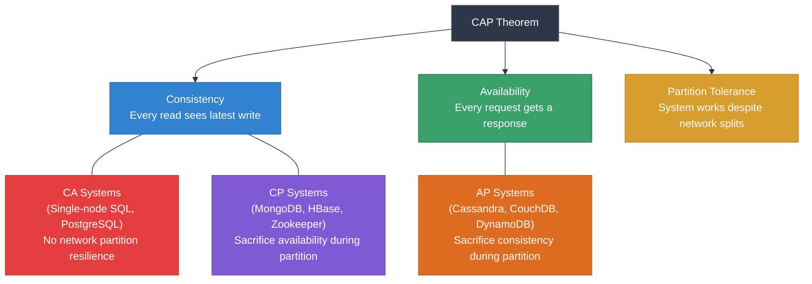
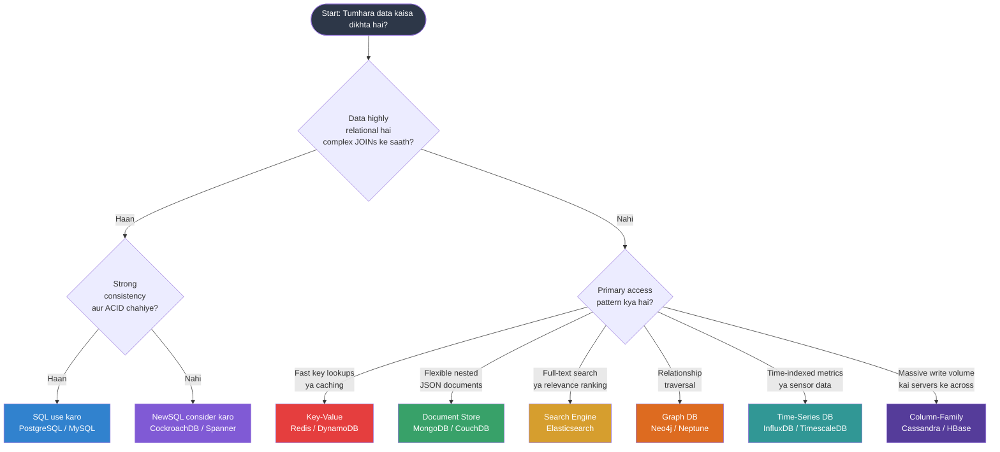

# 🗄️ Chapter 10: SQL vs NoSQL — Sahi Database Kaise Chuno

> **Yeh kiske liye hai:** Un developers ke liye jo databases mein naye hain aur kisi technology pe kood-ne se pehle poora landscape samajhna chahte hain.

---

## 🧭 Yeh Choice Itni Important Kyun Hai?

Code ki ek line likhne se pehle, sabse bada decision jo tum loge woh hai: **konsa database use karun?** Galat choice ka matlab hai — baad mein painful migrations, scale pe kharab performance, ya phir ek simple app ke liye bewajah complexity.

Achhi baat yeh hai: ek baar trade-offs samajh aa gaye, toh decision khud-ba-khud intuitive ban jata hai. Socho jaise tumhe Zomato pe restaurant choose karna hai — agar tumhe bas quick bite chahiye toh fast food, agar family dinner hai toh proper sit-down restaurant. Database bhi waise hi — use-case ke hisaab se choose karte hain.

---

## 🟦 SQL (Relational) Duniya

SQL databases pichle 50+ saal se software ki rीढ़ ki haddi (backbone) hain. Yeh data ko **tables** mein store karte hain — rows aur columns, ek powerful spreadsheet ki tarah — aur tables ke beech relationships **foreign keys** aur **JOIN** operations se banate hain.

**Core characteristics:**

| Property | Iska matlab kya hai |
|---|---|
| Structured data | Table ki har row mein same columns hote hain (schema fix hota hai) |
| Fixed schema | Structure pehle se define karte ho; badlaav ke liye migration chahiye |
| Relationships | Alag-alag tables ka data foreign keys se jud'ta hai |
| ACID guarantees | Transactions safe, consistent, aur reliable hote hain |
| SQL language | Universally samjhi jaane wali query language |

**Popular SQL databases:** PostgreSQL, MySQL, SQLite, Microsoft SQL Server, Oracle.

### ACID — Reliability ka Vaada

ACID data integrity ka gold standard hai. SQL database ka har transaction guarantee karta hai:

- **A — Atomicity:** Ek transaction ya toh poora successful hoga ya poora fail hoga. Aadha-adhoora state kabhi nahi rahega. Socho tum Account A se Account B mein paise transfer kar rahe ho aur beech mein bijli chali jaaye — paisa gayab nahi hoga, poora transaction rollback ho jayega. UPI transfer mein bhi yehi hota hai — agar transaction beech mein fail ho jaaye toh paisa waapas aa jata hai, atka nahi rehta.
- **C — Consistency:** Database sirf ek valid state se dusri valid state mein jata hai. Rules (constraints, foreign keys) hamesha enforce hote hain.
- **I — Isolation:** Ek saath chal rahe transactions ek dusre mein interfere nahi karte. IRCTC pe do log same waqt last waiting seat book karne ki koshish karein — dono ko seat nahi milegi, sirf ek ko milegi.
- **D — Durability:** Ek baar transaction commit ho gaya, toh woh crash ke baad bhi survive karta hai. Data disk pe likha ja chuka hota hai.

ACID isliye important hai kyunki banks, hospitals, aur e-commerce checkouts apna sabse critical data relational databases pe hi trust karte hain.

---

## 🟩 NoSQL Duniya

NoSQL (kabhi-kabhi "Not Only SQL" bhi padha jata hai) 2000s mein tab aaya jab Google, Amazon, aur Facebook jaisi companies traditional relational databases ke saath deewar se takra gayi — khaaskar **scale** aur **flexibility** ke maamle mein.

NoSQL koi ek cheez nahi hai. Yeh database designs ka ek pura parivaar hai jo kuch relational guarantees ko chhod kar dusre fayde deta hai: flexible schemas, horizontal scaling, aur specific access patterns ke liye specialization.

**Core characteristics:**

| Property | Iska matlab kya hai |
|---|---|
| Flexible schema | Documents/records mein alag-alag fields ho sakte hain; migration ki zarurat nahi |
| Horizontal scaling | Ek bade server ko upgrade karne ke bajaye zyada servers add karo |
| Eventual consistency | Reads kabhi-kabhi replicas ke beech stale data de sakte hain |
| Specialized access | Specific patterns (caching, search, graphs, etc.) ke liye optimized |
| Varied query models | Har NoSQL type ka apna query style hota hai |

---

## 🗂️ NoSQL Databases ke Types

### 1. 📄 Document Stores — MongoDB, CouchDB

Data self-describing documents ki tarah store hota hai, generally JSON ya BSON format mein. Har document ka structure poori tarah alag ho sakta hai.

**Kis kaam ke liye best:** Content management systems, user profiles, catalogs — jahan bhi records ka structure vary karta hai.

```json
// MongoDB mein ek user document
{
  "_id": "u_12345",
  "name": "Priya Sharma",
  "email": "priya@example.com",
  "preferences": {
    "theme": "dark",
    "notifications": ["email", "sms"]
  },
  "addresses": [
    { "type": "home", "city": "Pune", "pincode": "411001" },
    { "type": "work", "city": "Mumbai", "pincode": "400001" }
  ]
}
```

Yeh nested `addresses` array SQL mein ek alag table maangega. MongoDB mein yeh document ke andar hi naturally reh jata hai.

---

### 2. ⚡ Key-Value Stores — Redis, DynamoDB

Sabse simple model: ek bahut bada dictionary. Tum ek key se ek value dhoondte ho. Bahut fast hota hai kyunki koi query planning nahi — bas direct lookup.

**Kis kaam ke liye best:** Caching, session storage, rate limiting, leaderboards, real-time counters.

```
SET session:abc123  '{"userId": 42, "role": "admin"}'  EX 3600
GET session:abc123
```

Redis per second lakhon lookups handle kar sakta hai aur data ko memory mein rakhta hai — matlab microsecond latency. Jab bhi ek SQL database repeated reads ke liye slow ho jaata hai, sabse pehle architecture mein Redis hi add kiya jata hai. Bilkul Swiggy ke order status jaisa — baar-baar database hit karne ke bajaye ek fast cache se turant status mil jaata hai.

---

### 3. 🏛️ Column-Family Stores — Apache Cassandra, HBase

Data rows aur columns mein organize hota hai, SQL jaisa hi — lekin ek twist ke saath: columns ko **column families** mein group kiya jata hai, aur alag-alag rows ke alag-alag columns ho sakte hain. Cassandra khaas taur pe write-heavy workloads ko bahut bade scale pe, kai servers ke across, handle karne ke liye design kiya gaya hai.

**Kis kaam ke liye best:** Time-series data, IoT sensor readings, event logs, analytics at scale.

```
-- Cassandra writes bahut fast hote hain; achhe hain:
-- sensor_readings table
-- row key: device_id + timestamp
-- columns: temperature, humidity, pressure
```

Netflix, Apple, aur Instagram Cassandra use karte hain un workloads ke liye jahan single point of failure ke bina per second lakhon records likhne padte hain.

---

### 4. 🕸️ Graph Databases — Neo4j, Amazon Neptune

Graph database mein **relationships first-class citizens** hote hain. Data nodes (entities) aur edges (unke beech relationships) ki tarah store hota hai. Isse complex relationship chains ko traverse karna bahut efficient ho jata hai — jo SQL JOINs deep level pe struggle karte hain.

**Kis kaam ke liye best:** Social networks, recommendation engines, fraud detection, knowledge graphs.

```cypher
-- Neo4j mein Jazz pasand karne wale friends-of-friends dhoondo (Cypher query)
MATCH (me:User {name: "Arjun"})-[:FRIENDS_WITH*2]-(fof:User)-[:LIKES]->(genre:Genre {name: "Jazz"})
RETURN fof.name
```

Yeh query jo do level ki friendship traverse karti hai, SQL mein multiple self-JOINs maangegi aur millions of users ke saath bahut slow ho jaayegi.

---

### 5. 🔍 Search Engines — Elasticsearch, OpenSearch

**Full-text search** ke liye optimized, relevance ranking ke saath. Under the hood inverted indexes use hote hain — wahi technique jo search engines billions of records mein instantly ek word dhoondne ke liye use karte hain.

**Kis kaam ke liye best:** Product search, log analysis, autocomplete, document search, observability dashboards.

```json
// "wireless headphones" search karo relevance ke hisaab se sorted
{
  "query": {
    "match": { "description": "wireless headphones" }
  }
}
```

Elasticsearch GitHub, Wikipedia, aur Stack Overflow jaisi sites ki search power karta hai — bilkul jaise Flipkart pe tum "phone under 20000" search karte ho aur turant relevant results aa jaate hain.

---

### 6. ⏱️ Time-Series Databases — InfluxDB, TimescaleDB

Khaas taur pe us data ke liye bane hain jo time ke hisaab se index hota hai: metrics, sensor readings, financial tick data, server performance. Yeh compression aur storage layouts use karte hain jo sequential time-based writes aur range queries ke liye optimized hain.

**Kis kaam ke liye best:** Server monitoring, IoT telemetry, financial market data, application performance monitoring (APM).

```sql
-- TimescaleDB (PostgreSQL ko extend karta hai)
SELECT time_bucket('1 hour', time) AS hour, avg(cpu_usage)
FROM server_metrics
WHERE time > NOW() - INTERVAL '24 hours'
GROUP BY hour
ORDER BY hour;
```

TimescaleDB isliye interesting hai kyunki tumhe time-series performance milti hai ek familiar PostgreSQL interface ke upar hi.

---

## 🔺 CAP Theorem — Ek Fundamental Trade-off

2000 mein computer scientist Eric Brewer ne yeh proposal diya ki distributed databases ek saath in teen properties mein se sirf **do hi guarantee** kar sakte hain:

- **C — Consistency:** Har read sabse latest write hi return karega (ya error dega).
- **A — Availability:** Har request ka response milega (zaruri nahi ki data sabse latest ho).
- **P — Partition Tolerance:** Nodes ke beech network communication fail hone pe bhi system chalta rehta hai.

Kisi bhi real distributed system mein, **network partitions hoti hi hain** — toh P optional nahi hai. Iska matlab hai tum asal mein **CP** (consistency over availability) ya **AP** (availability over consistency) mein choose kar rahe ho.



**Real-world examples:**

| System | CAP Position | Practical trade-off |
|---|---|---|
| PostgreSQL (single node) | CA | Partition tolerance nahi hai; ek single server ke liye great |
| MongoDB | CP | Network split ke waqt, MongoDB writes mana kar deta hai consistent rehne ke liye |
| Cassandra | AP | Split ke waqt, Cassandra writes accept karta rehta hai; thoda stale data mil sakta hai |
| Zookeeper | CP | Inconsistent data return karne se behtar unavailable rehna pasand karta hai |
| DynamoDB | AP (configurable) | Default eventual consistency; strong consistency bhi milti hai extra cost pe |

---

## ⚗️ ACID vs BASE

SQL databases ACID dete hain. Bahut saare NoSQL databases ek loose model pe chalte hain jise **BASE** kehte hain:

| | ACID | BASE |
|---|---|---|
| Full form | Atomicity, Consistency, Isolation, Durability | Basically Available, Soft state, Eventually consistent |
| Consistency model | Strong (turant) | Eventual |
| Availability | Consistency ke liye sacrifice ho sakti hai | Priority di jaati hai |
| Use case fit | Financial transactions, bookings | Social feeds, analytics, caching |
| Example systems | PostgreSQL, MySQL, Oracle | Cassandra, DynamoDB, CouchDB |

**"Eventually consistent"** ka matlab: agar tum ek value likho aur turant use kisi doosre replica se padho, toh ho sakta hai thodi der ke liye purani value mil jaaye. Milliseconds se seconds ke andar, saare replicas converge kar jaate hain. Ek social media "like count" ke liye yeh bilkul theek hai. Ek bank balance ke liye, yeh bilkul bhi acceptable nahi hai.

---

## 🤔 Decision Guide — Kab Kya Use Karein



### SQL kab use karo:
- Tumhare paas financial transactions hain ya kuch aisa jahan partial writes disaster ban sakte hain
- Tumhara data clearly related hai (users, orders, products, invoices)
- Tumhe multiple JOINs wali complex queries chahiye
- Tumhari team SQL achhe se jaanti hai aur data ek server ya chhote cluster mein fit ho jata hai
- Regulatory compliance ke liye strong data integrity guarantees chahiye

### NoSQL kab use karo:
- Tumhara schema baar-baar badalta hai ya records ke beech vary karta hai
- Tumhe writes ko horizontally, kai servers ke across, scale karna hai
- Tumhare paas ek specialized access pattern hai (search, graph, time-series, caching)
- Tum better availability ke liye eventual consistency tolerate kar sakte ho
- Tum real-time features bana rahe ho: live dashboards, activity feeds, leaderboards

---

## 📊 Bada Comparison Table

| Feature | PostgreSQL (SQL) | MongoDB (Document) | Redis (Key-Value) | Cassandra (Column) | Neo4j (Graph) |
|---|---|---|---|---|---|
| Data model | Tables & rows | JSON documents | Key-value pairs | Wide-column rows | Nodes & edges |
| Schema | Strict, fixed | Flexible | None | Flexible | Flexible |
| Query language | SQL | MQL / aggregation pipeline | Commands (GET, SET) | CQL (SQL-like) | Cypher |
| ACID transactions | Full ACID | Multi-doc ACID (v4+) | Partial (MULTI/EXEC) | Lightweight transactions | ACID |
| Horizontal scaling | Limited (read replicas) | Good (sharding) | Good (cluster) | Excellent (by design) | Limited |
| Best for | Complex relational data | Varied/nested documents | Caching, sessions | High-write time-series | Relationship traversal |
| Consistency | Strong | Configurable | Strong (single node) | Eventual (tunable) | Strong |
| CAP position | CA | CP | CA/CP | AP | CA |
| Learning curve | Medium | Low-Medium | Low | Medium-High | Medium |

---

## 🆕 NewSQL — Dono Duniya ka Best?

NewSQL databases SQL ki ACID guarantees ko NoSQL ki horizontal scalability ke saath combine karne ki koshish karte hain.

**CockroachDB** aur **Google Spanner** iske leading examples hain. Yeh:
- Standard SQL queries accept karte hain
- Distributed nodes ke across full ACID transactions support karte hain
- Data ko automatically kai servers mein shard kar dete hain
- Poore data center ki failure bhi survive kar lete hain

Trade-off: yeh traditional SQL se operate karne mein zyada complex hain aur distributed coordination (Raft ya Paxos jaisa consensus protocol) ki wajah se higher latency introduce karte hain.

**NewSQL kab use karo** — jab tumhe genuinely dono chahiye: SQL semantics AND global scale. Ek fintech startup jo internationally expand kar raha hai, uska classic use case hai — tumhe consistent financial transactions bhi chahiye AND unhe multiple regions mein reliably kaam karna bhi zaruri hai.

---

## 🏗️ Real Architecture Example

Ek modern e-commerce application ek saath kai databases use kar sakta hai, har ek apni strength ke liye chuna hua:

```
User authentication & profiles  →  PostgreSQL (ACID, relational)
Product catalog                 →  MongoDB (har category ka flexible schema)
Shopping cart & sessions        →  Redis (fast, ephemeral, key-value)
Order history & inventory       →  PostgreSQL (ACID transactions critical hai)
Product search                  →  Elasticsearch (full-text, facets, filters)
Recommendation engine           →  Neo4j (relationship traversal)
Server monitoring               →  InfluxDB (time-series metrics)
```

Iss pattern ko **polyglot persistence** kehte hain — har specific job ke liye sahi database use karna, na ki har use-case ko ek hi database mein zabardasti fit karna. Bilkul Zomato jaisa socho — order tracking ke liye ek system, payment ke liye dusra, aur search ke liye teesra. Sab kuch ek hi database pe daalna ineffiecient hoga.

---

## 🔑 Key Takeaways

1. **SQL = structured, relational, ACID.** Jahan bhi consistency aur relationships matter karte hain, wahan use karo: finance, user accounts, inventory.

2. **NoSQL = flexible, scalable, specialized.** Yeh ek single cheez nahi hai — document, key-value, column-family, graph, search, aur time-series databases, har ek SQL se better tarike se ek specific problem solve karta hai.

3. **CAP theorem ek choice force karta hai.** Distributed system mein tum Consistency + Partition Tolerance (CP) ya Availability + Partition Tolerance (AP) mein se ek chunte ho. Strong consistency ki keemat network failure ke waqt availability se chukani padti hai.

4. **ACID vs BASE achha vs bura nahi hai** — yeh ek trade-off hai. Social feeds ke liye eventual consistency bilkul theek hai; financial transfers ke liye yeh unacceptable hai.

5. **Polyglot persistence normal hai.** Production systems mein routinely 3-5 alag-alag databases use hote hain. Har job ke liye sahi tool chuno.

6. **NewSQL (CockroachDB, Spanner) gap bridge karta hai** jab tumhe genuinely SQL semantics aur global horizontal scale, dono chahiye.

7. **PostgreSQL se start karo.** Zyaadatar naye projects ke liye, PostgreSQL sabse safe default hai — yeh powerful hai, battle-tested hai, aur TimescaleDB jaise plugins se extend bhi ho sakta hai. Kisi specialized database pe tabhi switch karo jab tumhare paas koi concrete reason ho.

---

## 🧪 Quiz — Apni Samajh Test Karo

**Question 1:** Tum ek feature bana rahe ho jisse users bank accounts ke beech paise transfer kar sakein. Konsa consistency model bilkul zaruri hai, aur konsa database type isse default mein deta hai?

<details>
<summary>Jawab dekho</summary>

Tumhe **ACID transactions** chahiye **strong consistency** ke saath. Partial writes (paisa debit ho gaya lekin credit nahi hua) disaster ban sakta hai. PostgreSQL jaisa ek **SQL database** yeh default mein deta hai. Cassandra jaisa AP NoSQL database yahan ek dangerous choice hoga.

</details>

---

**Question 2:** Tumhare social app mein ek "People You May Know" feature hai jisse 3 ya usse zyada mutual friends share karne wale users dhoondhne hain. Tumhare paas 10 million users hain. SQL JOIN approach timeout ho raha hai. Konsa database type consider karna chahiye, aur kyun?

<details>
<summary>Jawab dekho</summary>

Neo4j jaisa ek **graph database**. Relationship traversal (friends-of-friends) exactly wahi cheez hai jiske liye graph databases bane hain. SQL mein, shared connections dhoondhne ke liye multiple self-JOINs chahiye hote hain jo user count badhne ke saath exponentially slow ho jaate hain. Neo4j mein, tum expensive table scans ke bina directly graph traverse karte ho.

</details>

---

**Question 3:** CAP theorem ke hisaab se, Cassandra ek AP system hai. Jab do data center nodes ek dusre se connectivity kho dete hain, tab practically iska kya matlab hota hai?

<details>
<summary>Jawab dekho</summary>

Cassandra partition ke waqt **Consistency** ke upar **Availability** ko priority deta hai. Dono nodes independently reads aur writes accept karte rehte hain. Jab network waapas theek ho jata hai, Cassandra "last write wins" ya vector clocks jaisi techniques use karke diverged data ko reconcile kar leta hai. Iska matlab hai user ko thodi der ke liye stale data mil sakta hai, lekin system kabhi down nahi hota. MongoDB jaisa CP system iski jagah minority partition pe writes mana kar dega taaki consistency protect ho.

</details>

---

*Agla chapter: PostgreSQL mein Deep Dive — Indexes, Query Planning, aur Performance Tuning*
