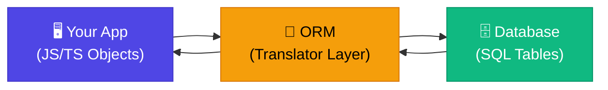

# 🗄️ What is an ORM?

> **Level:** Beginner | **Chapter:** 01 | **Series:** Database Notes

---

## 🤔 The Problem: Talking to a Database is Awkward

When you build a Node.js or TypeScript application, your data lives in two very different worlds:

- **Your app world** — JavaScript objects, TypeScript classes, arrays, functions
- **Your database world** — tables, rows, columns, SQL statements

These two worlds do not naturally understand each other. To get data in or out of a database, you have to write raw SQL strings inside your JavaScript code, like this:

```js
const result = await db.query(
  `SELECT * FROM users WHERE email = '${email}' AND is_active = true`
);
```

This works — but it is brittle, hard to read, and full of traps. What happens when `email` contains a single quote? What if you rename the `users` table? What if you mistype a column name? Your editor has no idea — there is no autocomplete, no type checking, nothing.

This is the problem an ORM was built to solve.

---

## 🌐 What is an ORM?

An **ORM (Object-Relational Mapper)** is a library that acts as a bridge between your application code and your relational database. It lets you interact with database tables using regular JavaScript or TypeScript objects and methods, instead of writing raw SQL strings.

The key idea is simple: your **database table** maps to a **class or model** in your code, and each **row** in the table maps to an **instance** of that class.

Instead of writing:

```sql
SELECT id, name, email FROM users WHERE id = 1;
```

You write:

```ts
const user = await User.findOne({ where: { id: 1 } });
console.log(user.name); // fully typed!
```

The ORM translates your object-oriented code into the correct SQL, sends it to the database, and hands the results back to you as proper JavaScript objects.

---

## 🔤 The Translator Analogy

Think of an ORM as a **real-time translator** sitting between you and a foreign-language speaker.

- **You** speak JavaScript/TypeScript.
- **The database** speaks SQL.
- **The ORM** listens to what you say in JavaScript and translates it into SQL in real time, then translates the SQL response back into JavaScript objects for you.

You never have to learn the other language in depth. You just talk naturally, and the translator handles the rest.



Your application talks to the ORM. The ORM talks to the database. They each speak their own language, and the ORM handles the translation in both directions.

---

## ❌ Without an ORM: Raw SQL in Your Code

Here is what database access looks like without an ORM, using a raw query library like `pg` for PostgreSQL:

```ts
// Fetching a user and their posts — raw SQL style
const userResult = await db.query(
  `SELECT * FROM users WHERE id = $1`,
  [userId]
);
const user = userResult.rows[0]; // plain object, no types

const postsResult = await db.query(
  `SELECT * FROM posts WHERE user_id = $1 ORDER BY created_at DESC`,
  [user.id]
);
const posts = postsResult.rows;
```

**Problems with this approach:**

- No autocomplete — you must remember every column name by heart
- No type safety — `user.nmae` (a typo) will compile fine but fail at runtime
- SQL strings can break if data changes (renamed columns, new tables)
- SQL injection risk if you forget to parameterize inputs
- Boilerplate piles up — every query is dozens of lines
- Database-specific syntax locks you into one vendor

---

## ✅ With an ORM: Clean, Typed, Object-Oriented

Here is the same logic using Prisma (a popular ORM):

```ts
// Fetching a user and their posts — Prisma ORM style
const user = await prisma.user.findUnique({
  where: { id: userId },
  include: { posts: { orderBy: { createdAt: "desc" } } },
});

console.log(user.posts[0].title); // fully typed, autocomplete works
```

One call. Full type safety. No raw strings. Autocomplete on every field.

---

## 👍 Pros of Using an ORM

| Benefit | Explanation |
|---|---|
| **Type safety** | Column names and types are reflected in TypeScript — typos are caught at compile time |
| **Autocomplete** | Your editor knows the shape of every model, so you get full IntelliSense |
| **Migrations** | ORMs can generate and run database migration files automatically |
| **Cross-DB compatibility** | Switch from PostgreSQL to MySQL by changing a config line (in theory) |
| **Less boilerplate** | Common CRUD operations are one-liners instead of multi-line SQL blocks |
| **Security** | Queries are parameterized by default, preventing SQL injection |
| **Readable code** | Business logic reads like English rather than a mix of JS and SQL strings |

---

## 👎 Cons of Using an ORM

No tool is perfect. ORMs come with real trade-offs:

**1. Performance overhead**
The ORM adds a layer between you and the database. For most apps this is negligible, but for high-throughput systems the extra abstraction costs CPU and memory.

**2. N+1 query problem**
A classic ORM pitfall. If you load 100 posts and then access `post.author` in a loop, the ORM might fire 100 separate SQL queries (one per post) instead of one join. This silently destroys performance. You have to be deliberate about eager loading.

```ts
// Danger: N+1 queries
const posts = await prisma.post.findMany();
for (const post of posts) {
  const author = await prisma.user.findUnique({ where: { id: post.authorId } }); // fires once per post!
}

// Safe: eager load in one query
const posts = await prisma.post.findMany({ include: { author: true } });
```

**3. Abstraction leaks for complex queries**
ORMs are great for CRUD. They struggle with complex analytical queries — multi-level joins, window functions, CTEs, subqueries. You often end up escaping into raw SQL anyway for the hard stuff.

**4. Learning curve**
You still need to understand SQL to debug what the ORM generates. Treating the ORM as a black box causes mysterious bugs.

---

## ⚖️ When to Use an ORM vs Raw SQL

| Use Case | ORM | Raw SQL |
|---|---|---|
| Create / Read / Update / Delete records | ✅ Perfect | Overkill |
| Simple filtering and sorting | ✅ Great | Fine too |
| Complex joins across many tables | Possible, with care | ✅ Preferred |
| Reporting and analytics queries | Awkward | ✅ Preferred |
| Aggregations, window functions | Limited | ✅ Preferred |
| Full-text search with custom scoring | Escaping required | ✅ Preferred |

**Rule of thumb:** Use an ORM for 80% of your app (CRUD, business logic, simple relations). Drop down to raw SQL for the 20% that involves complex, performance-critical queries.

---

## 🗂️ The Major Node.js / TypeScript ORMs

### 1. Prisma — The Modern Choice
**Schema-first, type-safe, excellent developer experience.**

You define your data model in a `.prisma` schema file. Prisma generates a fully-typed client from that schema. Every query is type-safe out of the box. Prisma also handles migrations cleanly.

```prisma
model User {
  id    Int    @id @default(autoincrement())
  email String @unique
  posts Post[]
}
```

```ts
const users = await prisma.user.findMany(); // User[] — fully typed
```

Best for: New TypeScript projects, teams that value DX, modern applications.

---

### 2. TypeORM — The Java Developer's Comfort Zone
**Decorator-based, similar to Java's JPA / Hibernate.**

Models are TypeScript classes decorated with annotations. Feels familiar to developers coming from Spring Boot or Java. Older style but very feature-complete.

```ts
@Entity()
export class User {
  @PrimaryGeneratedColumn()
  id: number;

  @Column()
  email: string;
}
```

Best for: Teams with Java backgrounds, legacy NestJS apps, enterprise patterns.

---

### 3. Sequelize — The Veteran
**The oldest Node.js ORM. Extensive documentation, huge community.**

Sequelize has been around since Node.js was young. It uses a callback-and-promise style. Less idiomatic TypeScript support compared to newer options, but there is more Stack Overflow coverage than any other ORM.

```js
const users = await User.findAll({ where: { isActive: true } });
```

Best for: Existing Sequelize projects, teams that need maximum documentation and community answers.

---

### 4. Drizzle ORM — The New Contender
**SQL-like API, ultra-lightweight, strongly typed.**

Drizzle is the newest player and is gaining popularity fast. Its query syntax closely mirrors SQL, so there is almost no abstraction — just a type-safe wrapper around the queries you would write anyway. Very fast, very small bundle size.

```ts
const result = await db.select().from(users).where(eq(users.isActive, true));
```

Best for: Developers who love SQL, performance-critical apps, edge environments (Cloudflare Workers, Vercel Edge).

---

### 5. Knex.js — The Query Builder (Honorable Mention)
**Not a full ORM — a SQL query builder.**

Knex does not give you models or migrations in the ORM sense. It gives you a fluent JavaScript API for constructing SQL queries. You write `knex('users').where({ isActive: true }).select()` and it produces the SQL. No auto-magic, no model classes — just clean query construction with parameterization and cross-DB support.

Best for: Teams that want raw SQL control with just enough abstraction to avoid string concatenation.

---

## 📊 Quick Comparison Table

| Feature | Prisma | TypeORM | Sequelize | Drizzle |
|---|---|---|---|---|
| **Language** | TypeScript | TypeScript | JS + TS | TypeScript |
| **Style** | Schema-first | Decorator-based | Model classes | SQL-like API |
| **Type Safety** | Excellent | Good | Basic | Excellent |
| **Migrations** | Built-in | Built-in | Built-in | Built-in |
| **Learning Curve** | Low | Medium | Low-Medium | Low (SQL knowledge helps) |
| **Bundle Size** | Medium | Medium | Medium | Very small |
| **Community** | Large, growing fast | Large | Very large | Small, growing fast |
| **Best For** | Modern TS apps | Enterprise / NestJS | Legacy / breadth | Edge / performance |
| **Release Style** | Schema file (.prisma) | Decorators on classes | JS class methods | Pure functions |

---

## 🏆 Why Prisma Has Become the Most Popular Choice for TypeScript Apps

Prisma solved a problem that older ORMs did not fully address: **it made the entire database interaction end-to-end type-safe without any manual effort.**

With TypeORM or Sequelize, you define types yourself and the ORM trusts you. If your schema drifts from your type definitions, nothing catches it. With Prisma, the schema IS the source of truth — the TypeScript client is auto-generated from it, so your types are always correct by construction.

Additional reasons developers love Prisma:

- **Prisma Studio** — a web-based GUI to browse and edit your data during development
- **Excellent error messages** — tells you exactly what went wrong and why
- **First-class migration workflow** — `prisma migrate dev` handles everything
- **Active development** — releases frequently, responds to community feedback fast
- **Docs that are actually good** — step-by-step, with real-world examples

The TypeScript ecosystem has largely converged on Prisma as the default ORM for new projects in 2024 and 2025. When you start a new Next.js, NestJS, or Express project with a database, Prisma is almost certainly the right starting point.

---

## 🔑 Key Takeaways

- An **ORM** sits between your app and your database, translating between JS/TS objects and SQL.
- Without an ORM you write raw SQL strings — no types, no autocomplete, high risk.
- With an ORM you work with classes and methods — typed, safe, readable.
- **Pros:** type safety, autocomplete, migrations, less boilerplate, cross-DB support.
- **Cons:** N+1 queries if careless, performance overhead, abstraction leaks on complex queries.
- **Use ORM for CRUD; use raw SQL for complex analytics.**
- The main Node.js ORMs: **Prisma** (modern), **TypeORM** (enterprise), **Sequelize** (veteran), **Drizzle** (lightweight), **Knex** (query builder).
- Prisma is the most popular TypeScript ORM today due to its schema-first design and automatic type generation.

---

## 🧪 Quiz

Test your understanding before moving on.

**Question 1**
What does ORM stand for, and what is its core job in a web application?

<details>
<summary>Show Answer</summary>

**Object-Relational Mapper.** Its core job is to act as a translator between your application's object-oriented code (JS/TS classes and objects) and a relational database (SQL tables and rows), letting you interact with the database without writing raw SQL strings.

</details>

---

**Question 2**
You are loading 500 blog posts and then accessing `post.author` inside a `for` loop. What performance problem are you likely causing, and how do you fix it?

<details>
<summary>Show Answer</summary>

You are causing the **N+1 query problem** — the ORM will fire one SQL query per post to load the author, resulting in 501 total queries instead of 1. Fix it by **eager loading**: use `include: { author: true }` (Prisma) or the equivalent in your ORM so that authors are fetched in a single join query alongside the posts.

</details>

---

**Question 3**
Your team needs to run a complex monthly sales report with window functions, multiple CTEs, and custom aggregations. Should you use your ORM or raw SQL for this query? Why?

<details>
<summary>Show Answer</summary>

**Raw SQL.** ORMs are optimized for CRUD operations and struggle to express complex analytical queries cleanly. Window functions, CTEs, and multi-level aggregations often require escaping to raw SQL anyway. Writing the query directly in SQL gives you full control, better readability for complex logic, and no ORM abstraction overhead for a performance-sensitive report.

</details>

---

*Next Chapter: Setting Up Prisma in a Node.js/TypeScript Project →*
