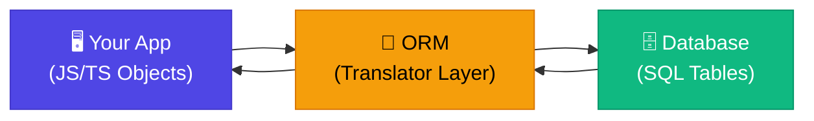

# 🗄️ What is an ORM?

> **Level:** Beginner | **Chapter:** 01 | **Series:** Database Notes

---

## 🤔 Problem Kya Hai: Database Se Baat Karna Awkward Hai

Jab tum ek Node.js ya TypeScript application banate ho, tumhara data do bilkul alag duniyao mein rehta hai:

- **Tumhari app ki duniya** — JavaScript objects, TypeScript classes, arrays, functions
- **Database ki duniya** — tables, rows, columns, SQL statements

Ye dono duniyayein ek dusre ki bhasha naturally nahi samajhti. Data ko andar-bahar le jaane ke liye, tumhe apne JavaScript code ke andar raw SQL strings likhni padti hain, kuch aisa:

```js
const result = await db.query(
  `SELECT * FROM users WHERE email = '${email}' AND is_active = true`
);
```

Ye kaam toh karta hai — lekin brittle hai, padhne mein mushkil hai, aur traps se bhara hua hai. Agar `email` mein single quote aa gaya toh? Agar tumne `users` table ka naam badal diya toh? Agar column name spell hi galat kar diya toh? Tumhare editor ko kuch pata nahi chalega — na autocomplete, na type checking, kuch nahi.

Yahi wo problem hai jise solve karne ke liye ORM banaya gaya.

---

## 🌐 ORM Kya Hota Hai?

**ORM (Object-Relational Mapper)** ek library hai jo tumhari application code aur relational database ke beech ek pul (bridge) ka kaam karti hai. Ye tumhe database tables ke saath regular JavaScript ya TypeScript objects aur methods use karke baat karne deti hai, raw SQL strings likhne ki jagah.

Idea simple hai: tumhara **database table** code mein ek **class ya model** banta hai, aur table ki har **row** us class ka ek **instance** banti hai.

Isko likhne ki jagah:

```sql
SELECT id, name, email FROM users WHERE id = 1;
```

Tum ye likhte ho:

```ts
const user = await User.findOne({ where: { id: 1 } });
console.log(user.name); // fully typed!
```

ORM tumhare object-oriented code ko sahi SQL mein translate karta hai, use database ko bhejta hai, aur result ko wapas proper JavaScript objects ki tarah tumhe de deta hai.

---

## 🔤 Translator Wali Analogy

ORM ko socho ek **real-time translator** ki tarah jo tumhare aur ek foreign-language bolne wale ke beech baitha hai.

- **Tum** JavaScript/TypeScript bolte ho.
- **Database** SQL bolta hai.
- **ORM** tumhari JavaScript sunta hai, use real time mein SQL mein translate karta hai, phir SQL ka response wapas JavaScript objects mein translate karke tumhe deta hai.

Tumhe doosri bhasha seekhne ki zarurat hi nahi padti. Tum bas natural tarike se baat karte ho, translator baaki sab sambhal leta hai.



Tumhari application ORM se baat karti hai. ORM database se baat karta hai. Dono apni-apni bhasha bolte hain, aur beech mein translation ka sara kaam ORM sambhalta hai.

---

## ❌ ORM Ke Bina: Code Mein Raw SQL

Bina ORM ke database access kaisa dikhta hai, ek raw query library `pg` (PostgreSQL ke liye) use karke dekhte hain:

```ts
// Fetching a user and their posts — raw SQL style
const userResult = await db.query(
  `SELECT * FROM users WHERE id = $1`,
  [userId]
);
const user = userResult.rows[0]; // plain object, no types

const postsResult = await db.query(
  `SELECT * FROM posts WHERE user_id = $1 ORDER BY created_at DESC`,
  [user.id]
);
const posts = postsResult.rows;
```

**Is approach ke problems:**

- Autocomplete nahi milta — har column ka naam yaad rakhna padta hai
- Type safety nahi hai — `user.nmae` (typo) compile toh ho jaayega, lekin runtime pe fail karega
- Data change hone pe SQL strings break ho sakti hain (renamed columns, naye tables)
- SQL injection ka risk hai agar inputs parameterize karna bhool gaye
- Boilerplate badhta jaata hai — har query mein dozens lines
- Database-specific syntax tumhe ek hi vendor mein lock kar deta hai

---

## ✅ ORM Ke Saath: Clean, Typed, Object-Oriented

Ab yehi same logic dekhte hain Prisma (ek popular ORM) ke saath:

```ts
// Fetching a user and their posts — Prisma ORM style
const user = await prisma.user.findUnique({
  where: { id: userId },
  include: { posts: { orderBy: { createdAt: "desc" } } },
});

console.log(user.posts[0].title); // fully typed, autocomplete works
```

Ek hi call. Full type safety. Koi raw string nahi. Har field pe autocomplete.

---

## 👍 ORM Use Karne Ke Fayde

| Fayda | Explanation |
|---|---|
| **Type safety** | Column names aur types TypeScript mein reflect hote hain — typos compile time pe hi pakde jaate hain |
| **Autocomplete** | Tumhara editor har model ka shape jaanta hai, isliye full IntelliSense milta hai |
| **Migrations** | ORM khud migration files generate aur run kar sakta hai |
| **Cross-DB compatibility** | PostgreSQL se MySQL pe switch karo bas ek config line badal ke (theory mein) |
| **Kam boilerplate** | Common CRUD operations multi-line SQL ki jagah one-liner ban jaate hain |
| **Security** | Queries default mein parameterized hoti hain, SQL injection se bachaav |
| **Readable code** | Business logic English jaisi padhti hai, JS aur SQL strings ke mix jaisi nahi |

---

## 👎 ORM Ke Nuksan

Koi bhi tool perfect nahi hota. ORM ke saath kuch real trade-offs aate hain:

**1. Performance overhead**
ORM tumhare aur database ke beech ek extra layer daal deta hai. Zyada tar apps ke liye ye negligible hai, lekin high-throughput systems ke liye ye extra abstraction CPU aur memory kharch karta hai.

**2. N+1 query problem**
Ye ek classic ORM pitfall hai. Socho tumne Zomato jaisi app banayi — agar tum 100 posts load karte ho aur phir loop mein `post.author` access karte ho, toh ORM ek join query fire karne ki jagah 100 alag-alag SQL queries fire kar sakta hai (har post ke liye ek). Ye chupke se tumhari performance khatam kar deta hai. Isliye eager loading ke baare mein deliberate rehna padta hai.

```ts
// Danger: N+1 queries
const posts = await prisma.post.findMany();
for (const post of posts) {
  const author = await prisma.user.findUnique({ where: { id: post.authorId } }); // fires once per post!
}

// Safe: eager load in one query
const posts = await prisma.post.findMany({ include: { author: true } });
```

**3. Complex queries ke liye abstraction leak hoti hai**
ORM CRUD ke liye kamaal ke hain. Lekin complex analytical queries mein struggle karte hain — multi-level joins, window functions, CTEs, subqueries. Aksar aisi cheezon ke liye tumhe wapas raw SQL mein hi jaana padta hai.

**4. Learning curve**
Tumhe SQL phir bhi samajhna hi padega taaki ORM jo generate kar raha hai use debug kar sako. ORM ko black box treat karne se mysterious bugs aate hain.

---

## ⚖️ ORM vs Raw SQL — Kab Kya Use Karna Hai

| Use Case | ORM | Raw SQL |
|---|---|---|
| Create / Read / Update / Delete records | ✅ Perfect | Overkill |
| Simple filtering aur sorting | ✅ Great | Ye bhi fine |
| Kai tables ke beech complex joins | Possible, thoda dhyan se | ✅ Preferred |
| Reporting aur analytics queries | Awkward | ✅ Preferred |
| Aggregations, window functions | Limited | ✅ Preferred |
| Custom scoring wali full-text search | Escape karna padta hai | ✅ Preferred |

**Rule of thumb:** Apni app ke 80% part ke liye ORM use karo (CRUD, business logic, simple relations). Baaki 20% ke liye jo complex, performance-critical queries hain, unke liye raw SQL pe utar aao.

---

## 🗂️ Node.js / TypeScript Ke Major ORMs

### 1. Prisma — The Modern Choice
**Schema-first, type-safe, zabardast developer experience.**

Tum apna data model ek `.prisma` schema file mein define karte ho. Prisma us schema se fully-typed client generate kar deta hai. Har query out of the box type-safe hoti hai. Prisma migrations bhi cleanly handle karta hai.

```prisma
model User {
  id    Int    @id @default(autoincrement())
  email String @unique
  posts Post[]
}
```

```ts
const users = await prisma.user.findMany(); // User[] — fully typed
```

Best for: Naye TypeScript projects, teams jo DX pasand karti hain, modern applications.

---

### 2. TypeORM — Java Developer Ke Liye Comfort Zone
**Decorator-based, Java ke JPA / Hibernate jaisa lagta hai.**

Models TypeScript classes hoti hain jo annotations se decorate hoti hain. Spring Boot ya Java se aane wale developers ko ye kaafi familiar lagega. Style thodi purani hai lekin feature-complete kaafi hai.

```ts
@Entity()
export class User {
  @PrimaryGeneratedColumn()
  id: number;

  @Column()
  email: string;
}
```

Best for: Java background wali teams, legacy NestJS apps, enterprise patterns.

---

### 3. Sequelize — The Veteran
**Sabse purana Node.js ORM. Bhari-bharkam documentation, bada community.**

Sequelize Node.js ke shuruaati din se hai. Ye callback-and-promise style use karta hai. Newer options ke comparison mein TypeScript support utna idiomatic nahi hai, lekin Stack Overflow pe kisi bhi doosre ORM se zyada coverage milegi.

```js
const users = await User.findAll({ where: { isActive: true } });
```

Best for: Existing Sequelize projects, teams jinhe maximum documentation aur community answers chahiye.

---

### 4. Drizzle ORM — The New Contender
**SQL jaisa API, ultra-lightweight, strongly typed.**

Drizzle sabse naya player hai aur teji se popular ho raha hai. Iska query syntax SQL se bahut milta-julta hai, isliye almost koi abstraction hi nahi hai — bas ek type-safe wrapper us query ke upar jo tum waise bhi likhte. Bahut fast, bahut chhota bundle size.

```ts
const result = await db.select().from(users).where(eq(users.isActive, true));
```

Best for: Wo developers jinhe SQL pasand hai, performance-critical apps, edge environments (Cloudflare Workers, Vercel Edge).

---

### 5. Knex.js — The Query Builder (Honorable Mention)
**Full ORM nahi hai — ek SQL query builder hai.**

Knex tumhe models ya migrations us ORM wale sense mein nahi deta. Ye tumhe SQL queries construct karne ke liye ek fluent JavaScript API deta hai. Tum `knex('users').where({ isActive: true }).select()` likhte ho aur ye SQL bana deta hai. Koi auto-magic nahi, koi model classes nahi — bas clean query construction, parameterization aur cross-DB support ke saath.

Best for: Teams jinhe raw SQL pe control chahiye, bas itna abstraction jitna string concatenation se bachne ke liye kaafi ho.

---

## 📊 Quick Comparison Table

| Feature | Prisma | TypeORM | Sequelize | Drizzle |
|---|---|---|---|---|
| **Language** | TypeScript | TypeScript | JS + TS | TypeScript |
| **Style** | Schema-first | Decorator-based | Model classes | SQL-like API |
| **Type Safety** | Excellent | Good | Basic | Excellent |
| **Migrations** | Built-in | Built-in | Built-in | Built-in |
| **Learning Curve** | Low | Medium | Low-Medium | Low (SQL knowledge helps) |
| **Bundle Size** | Medium | Medium | Medium | Very small |
| **Community** | Large, growing fast | Large | Very large | Small, growing fast |
| **Best For** | Modern TS apps | Enterprise / NestJS | Legacy / breadth | Edge / performance |
| **Release Style** | Schema file (.prisma) | Decorators on classes | JS class methods | Pure functions |

---

## 🏆 Prisma TypeScript Apps Ke Liye Sabse Popular Choice Kyun Ban Gaya

Prisma ne ek aisi problem solve ki jo purane ORMs ne poori tarah address nahi ki thi: **usne pura database interaction end-to-end type-safe bana diya, bina kisi manual effort ke.**

TypeORM ya Sequelize mein, types tum khud define karte ho aur ORM tum pe bharosa karta hai. Agar tumhara schema type definitions se drift kar jaaye, toh kuch bhi pakdega nahi. Prisma mein, schema hi source of truth hai — TypeScript client us se auto-generate hota hai, isliye tumhare types construction se hi hamesha sahi hote hain.

Prisma ko pasand karne ki aur bhi wajahein:

- **Prisma Studio** — data browse aur edit karne ke liye ek web-based GUI, development ke waqt
- **Zabardast error messages** — batata hai exactly kya galat hua aur kyun
- **First-class migration workflow** — `prisma migrate dev` sab sambhal leta hai
- **Active development** — frequently releases aati hain, community feedback pe fast respond karte hain
- **Docs jo genuinely achhi hain** — step-by-step, real-world examples ke saath

TypeScript ecosystem largely 2024 aur 2025 mein Prisma pe hi converge ho gaya hai naye projects ke default ORM ke tor pe. Jab bhi tum ek naya Next.js, NestJS, ya Express project database ke saath shuru karte ho, Prisma almost certainly sahi starting point hai.

---

## 🔑 Key Takeaways

- Ek **ORM** tumhari app aur database ke beech baithta hai, JS/TS objects aur SQL ke beech translate karta hai.
- ORM ke bina tum raw SQL strings likhte ho — no types, no autocomplete, high risk.
- ORM ke saath tum classes aur methods ke saath kaam karte ho — typed, safe, readable.
- **Fayde:** type safety, autocomplete, migrations, kam boilerplate, cross-DB support.
- **Nuksan:** careless rehne pe N+1 queries, performance overhead, complex queries pe abstraction leak.
- **CRUD ke liye ORM use karo; complex analytics ke liye raw SQL.**
- Node.js ke main ORMs: **Prisma** (modern), **TypeORM** (enterprise), **Sequelize** (veteran), **Drizzle** (lightweight), **Knex** (query builder).
- Prisma aaj sabse popular TypeScript ORM hai kyunki iska schema-first design hai aur automatic type generation.

---

## 🧪 Quiz

Aage badhne se pehle apni samajh test karo.

**Question 1**
ORM ka full form kya hai, aur ek web application mein iska core kaam kya hota hai?

<details>
<summary>Show Answer</summary>

**Object-Relational Mapper.** Iska core kaam hai tumhari application ki object-oriented code (JS/TS classes aur objects) aur relational database (SQL tables aur rows) ke beech translator ka kaam karna, taaki tum raw SQL strings likhe bina database ke saath interact kar sako.

</details>

---

**Question 2**
Tum 500 blog posts load kar rahe ho aur phir `for` loop ke andar `post.author` access kar rahe ho. Iska tumhe kaunsa performance problem ho sakta hai, aur usse kaise fix karoge?

<details>
<summary>Show Answer</summary>

Tum **N+1 query problem** create kar rahe ho — ORM har post ke author ko load karne ke liye ek alag SQL query fire karega, jisse total 1 ki jagah 501 queries ban jaayengi. Isse fix karne ke liye **eager loading** use karo: Prisma mein `include: { author: true }` (ya apne ORM ka equivalent) use karo, taaki authors posts ke saath ek hi join query mein fetch ho jaayein.

</details>

---

**Question 3**
Tumhari team ko ek complex monthly sales report chalana hai jisme window functions, multiple CTEs, aur custom aggregations hain. Is query ke liye ORM use karoge ya raw SQL? Kyun?

<details>
<summary>Show Answer</summary>

**Raw SQL.** ORMs CRUD operations ke liye optimize hote hain aur complex analytical queries ko cleanly express karne mein struggle karte hain. Window functions, CTEs, aur multi-level aggregations ke liye aksar waise bhi raw SQL mein escape karna padta hai. Query ko directly SQL mein likhna tumhe full control deta hai, complex logic ke liye better readability deta hai, aur ek performance-sensitive report ke liye koi ORM abstraction overhead nahi hota.

</details>

---

*Next Chapter: Setting Up Prisma in a Node.js/TypeScript Project →*
