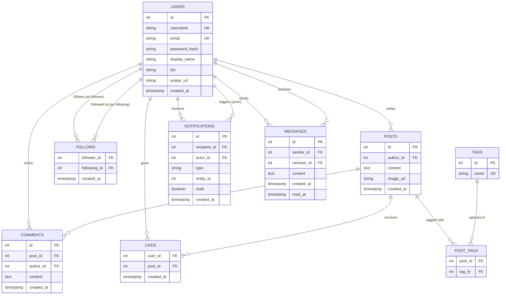

# Social Network: Requirements and Architecture

> **Project:** Ek social network ke liye database layer banayenge (Instagram + Twitter ka hybrid)
> **Stack:** PostgreSQL + Prisma + Node.js/TypeScript
> **Chapter:** 01 — Requirements and Architecture

---

## 🗺️ Kya Bana Rahe Hain?

Ye koi toy example nahi hai. Hum ek real-world social network ka poora database layer design kar rahe hain — Instagram (visual posts, follows, stories) aur Twitter (short text posts, hashtags, trending topics, DMs) ka best combo.

Is project series ke end tak, tumhare paas ek production-quality schema hoga, real queries likhi hongi, indexing ke decisions samajh aayenge, aur ye bhi dikhega ki Prisma jaisa ORM raw SQL concepts pe kaise map hota hai.

### Feature List

Socho ye tumhara khud ka startup hai — jaise Instagram/Twitter ka desi version. Ye saare features chahiye:

| # | Feature | Description |
|---|---------|-------------|
| 1 | **User Registration & Profiles** | Signup, login, bio, avatar, username |
| 2 | **Posts** | Text content, optional image ke saath |
| 3 | **Follow / Unfollow** | Ek user doosre ko follow karta hai; Twitter jaisa asymmetric (tumne follow kiya, zaruri nahi woh tumhe follow kare) |
| 4 | **Like Posts** | Post ko heart karna; ek user ek post ko sirf ek hi baar like kar sakta hai |
| 5 | **Comment on Posts** | Kisi bhi post pe text reply dena |
| 6 | **Hashtags / Tags** | Posts ko `#topics` se tag karna, taaki discover ho saken |
| 7 | **News Feed** | Jinko follow karte ho unke posts dikhein, recency ke hisaab se sorted |
| 8 | **Notifications** | Jab koi like, comment, ya follow kare to alert milna |
| 9 | **Direct Messages** | Do users ke beech private 1-to-1 conversation |
| 10 | **Search** | Username se user dhoondo; hashtag ya content se posts dhoondo |

Bas yahi scope hai. Har table jo design karenge, har column jo add karenge, har index jo banayenge — sab in features ko serve karne ke liye hai.

---

## 🧩 Entity Discovery: Requirements Ko Tables Mein Badalna

SQL ki ek line likhne se pehle, tumhe requirements ko ek detective ki tarah padhna hoga. Goal hai **nouns** dhoondna — woh cheezein jo tumhare system ko store karni hain.

### Step 1: Nouns Highlight Karo

Har feature padho aur khud se poocho: *"Isme kaunsi cheezein involved hain?"*

- **User Registration & Profiles** → `User`
- **Posts** → `Post`
- **Follow / Unfollow** → `Follow` (do Users ke beech ek relationship)
- **Like Posts** → `Like` (User aur Post ke beech ek relationship)
- **Comment on Posts** → `Comment`
- **Hashtags / Tags** → `Tag`, `PostTag` (junction table)
- **Notifications** → `Notification`
- **Direct Messages** → `Message`, `Conversation`
- **Search** → koi naya entity nahi, lekin indexing decisions pe asar padega

### Step 2: Entities Aur Relationships Ko Alag Karo

Kuch nouns **standalone cheezein** hoti hain (entities). Kuch **do cheezon ke beech connection** hote hain (relationships). Relationships kabhi-kabhi apna khud ka table ban jaate hain.

| Entity | Standalone? | Notes |
|--------|-------------|-------|
| User | Haan | Core entity |
| Post | Haan | Ek User ka hota hai |
| Comment | Haan | Ek Post aur ek User dono se belong karta hai |
| Tag | Haan | Ek hashtag jaise `#photography` |
| Notification | Haan | System events se generate hota hai |
| Message | Haan | Ek conversation ka single message |
| Follow | Relationship | User → User |
| Like | Relationship | User → Post |
| PostTag | Relationship | Post ↔ Tag (many-to-many) |

Jab kisi relationship mein **koi extra data nahi hota** (jaise simple follow), woh sirf do foreign keys wala junction table ban sakta hai. Jab **extra data ho** (jaise message ka text aur timestamp), woh ek full entity ban jaata hai.

> [!tip]
> Yehi Zomato ka "order" wala concept hai — agar sirf "customer ne restaurant se order kiya" track karna hota to ek simple junction table kaafi hota. Lekin order mein items, price, timestamp jaisa extra data hai, isliye woh apna khud ka full entity banta hai.

### Step 3: Attributes Identify Karo

Har entity ke liye, woh data list karo jo store karna hai:

- **User:** `id`, `username`, `email`, `password_hash`, `display_name`, `bio`, `avatar_url`, `created_at`
- **Post:** `id`, `author_id`, `content`, `image_url`, `created_at`
- **Comment:** `id`, `post_id`, `author_id`, `content`, `created_at`
- **Tag:** `id`, `name` (jaise "photography")
- **Follow:** `follower_id`, `following_id`, `created_at`
- **Like:** `user_id`, `post_id`, `created_at`
- **PostTag:** `post_id`, `tag_id`
- **Notification:** `id`, `recipient_id`, `actor_id`, `type`, `entity_id`, `read`, `created_at`
- **Message:** `id`, `sender_id`, `receiver_id`, `content`, `created_at`, `read_at`

---

## 🔗 Relationships Identify Karna

Entities haath mein aane ke baad, ab connections banayenge. Har relationship ki ek **direction** aur ek **cardinality** hoti hai (yaani ek cheez doosri cheez se kitni related hai).

### User → Post
Ek user bahut saare posts likh sakta hai. Ek post exactly ek hi user ka hota hai.
**Cardinality: One-to-Many (1:N)**

### User → Follow → User
Ek user bahut logo ko follow kar sakta hai. Ek user ko bahut log follow kar sakte hain. Ye ek self-referencing many-to-many relationship hai. `follows` table hi junction hai.
**Cardinality: Many-to-Many (M:N) — self-referencing**

### User → Like → Post
Ek user bahut saare posts like kar sakta hai. Ek post ko bahut saare users like kar sakte hain.
**Cardinality: Many-to-Many (M:N)**

### Post → Comment ← User
Ek post pe bahut saare comments ho sakte hain. Har comment ek user ne likha hota hai.
**Cardinality: Post ke many Comments hain (1:N); User bhi many Comments likhta hai (1:N)**

### Post → PostTag → Tag
Ek post pe multiple tags ho sakte hain. Ek tag multiple posts pe appear kar sakta hai.
**Cardinality: Many-to-Many (M:N)**

### User → Message → User
Ek message ek user bhejta hai, doosre user ko. Ye flat hai (koi threading nahi).
**Cardinality: Har message ka ek sender aur ek receiver hai (message ke har end pe 1:1)**

### User → Notification
Notifications ek recipient user ke hote hain aur ek actor user ko reference karte hain (jisne trigger kiya).
**Cardinality: Ek user ki bahut saari notifications hoti hain**

---

## 🤔 Cardinality Decisions: Wahi Decisions Jo Matter Karte Hain

Yahin pe junior aur senior developer alag ho jaate hain. Tables list karna toh koi bhi kar sakta hai. Asli skill hai **decisions** lena.

### Kya ek user ek post ko multiple baar like kar sakta hai?

**Decision: Nahi.**

Ye ek business rule hai. Instagram tumhe double-like nahi karne deta. Database mein isko enforce karne ka tareeka hai `(user_id, post_id)` ko `likes` table pe **compound primary key** banana. Database khud hi duplicate insert reject kar dega — application-level check ki zarurat hi nahi. Ye code mein check karne se kahin zyada reliable hai.

```sql
-- Compound PK database level pe hi uniqueness enforce karta hai
PRIMARY KEY (user_id, post_id)
```

> [!tip]
> Ye bilkul UPI transaction ID jaisa hai — ek baar payment ho gayi to system usi ID se dobara process nahi karega. Database khud gatekeeper ban jaata hai, tumhe manually check karne ki zarurat nahi.

### Kya ek post mein multiple images ho sakti hain?

**Decision: Abhi ke liye, ek single optional image.**

Hum `image_url` ko directly `posts` table pe store karte hain. Ye ek pragmatic starting point hai. Ek zyada advanced design mein `PostMedia` table banega jisse post pe multiple images ja saken (Instagram carousel jaisa). Isko future extension ke tor pe note karke rakhenge, aur abhi ke liye `Post` pe `image_url` ko nullable rakhenge — simplicity ke liye.

Agar multiple images chahiye hoti:
```
Post 1:N PostMedia (har row mein post_id + image_url + position hoga)
```

### Kya messages threaded hain ya flat?

**Decision: Flat.**

Har `Message` row ek single message represent karta hai, jisme `sender_id` aur `receiver_id` hota hai. Koi `conversation_id` grouping nahi hai aur na hi koi parent-child threading. Do users ke beech conversation nikaalne ke liye, tumhe query karni hogi jahan `(sender = A AND receiver = B) OR (sender = B AND receiver = A)`. Ye simple hai, beginner-friendly hai, aur V1 ke liye kaafi hai. Ek threaded conversation model (ek `Conversation` entity ke saath) natural next step hoga.

### Notification mein kya-kya jaata hai?

Notifications thodi tricky hoti hain kyunki woh alag-alag event types ko refer karti hain. Ek flexible approach hai — ek `type` field rakho (enum: `LIKE`, `COMMENT`, `FOLLOW`) aur ek `entity_id` jo us cheez ko point kare jisne notification trigger kiya (post, comment, ya user). Application layer isi combination ko interpret karta hai.

---

## 📐 Full ER Diagram



---

## ⚙️ Technology Stack

### PostgreSQL
Hamara database engine. PostgreSQL relational data ke liye professional ki pehli pasand hai. Ye deta hai:
- Full ACID transactions (tumhara data safe rehta hai)
- Rich data types (arrays, JSON, enums, full-text search)
- Powerful indexing (B-tree, GIN, partial indexes)
- Scale pe rock-solid performance

### Prisma
Hamara ORM (Object-Relational Mapper). Prisma Node.js aur PostgreSQL ke beech baithta hai aur deta hai:
- Ek `schema.prisma` file jo database schema ka single source of truth hoti hai
- Auto-generated, fully typed TypeScript client — raw SQL strings likhne ki zarurat nahi
- Ek migration system jo time ke saath schema changes track karta hai
- Readable query API: `prisma.post.findMany({ where: { authorId: userId } })`

Is series mein tum real SQL likhoge taaki underneath kya ho raha hai samajh aaye, aur phir dekhoge ki Prisma wahi operation kaise express karta hai.

### Node.js + TypeScript
Hamara application runtime. TypeScript woh type safety deta hai jo Prisma ke generated types ke saath haath mila ke chalta hai. Jab Prisma tumhare schema se ek `User` type generate karta hai, TypeScript ko har field pata hota hai — koi guessing nahi.

---

## 📚 Aage Kya Aane Wala Hai

Har chapter pichhle wale pe build hota hai. Ye raha roadmap:

| Chapter | Topic |
|---------|-------|
| **02** | Schema Design — Proper constraints ke saath `CREATE TABLE` statements likhna |
| **03** | Prisma Setup — `schema.prisma` mein schema define karna aur migrations run karna |
| **04** | Seeding — Database ko realistic test data se populate karna |
| **05** | Queries I — User ka profile, posts, aur follower counts fetch karna |
| **06** | Queries II — Joins aur ordering ke saath news feed banana |
| **07** | Queries III — `ILIKE`, full-text search, aur tag lookups se search karna |
| **08** | Indexing — Tumhari feed query slow kyun hai aur usko fix kaise karein |
| **09** | Transactions — Post like karna aur notification bhejna, ek saath atomically |
| **10** | Performance — Pagination, N+1 problems, aur `EXPLAIN` se query analysis |

---

## ✅ Key Takeaways

- Instagram/Twitter hybrid social network ke liye 10-feature scope define kiya.
- Requirements mein nouns dhoondh ke 9 core entities discover kiye: `Users`, `Posts`, `Comments`, `Likes`, `Follows`, `Tags`, `PostTags`, `Notifications`, `Messages`.
- Saare relationships aur unki cardinalities map ki (1:N, M:N, self-referencing).
- Teen clear design decisions liye: duplicate likes nahi (compound PK), post pe ek hi image (nullable column), flat messages (koi threading nahi).
- Saare entities ko jodta hua full ER diagram banaya.
- Stack hai PostgreSQL + Prisma + Node.js/TypeScript.
