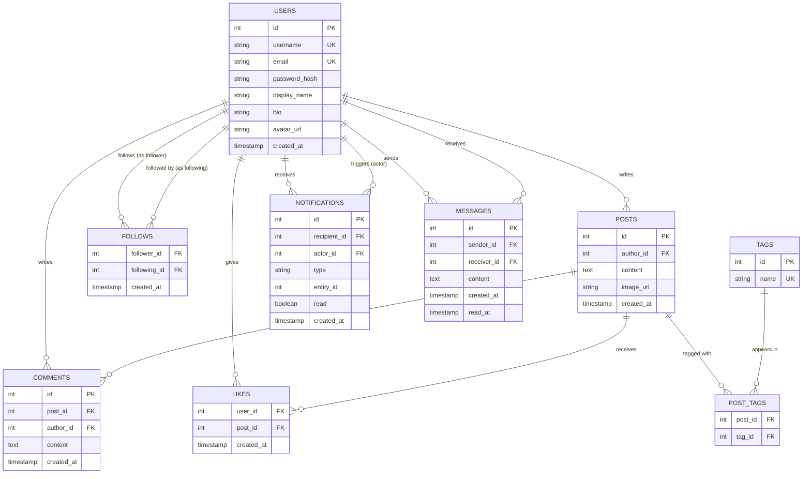

# Social Network: Requirements and Architecture

> **Project:** Building the database layer for a social network (Instagram + Twitter hybrid)
> **Stack:** PostgreSQL + Prisma + Node.js/TypeScript
> **Chapter:** 01 — Requirements and Architecture

---

## 🗺️ What We're Building

This is not a toy example. We are designing the full database layer for a real-world social network — something that combines the best of Instagram (visual posts, follows, stories) and Twitter (short text posts, hashtags, trending topics, DMs).

By the end of this project series, you will have built a production-quality schema, written real queries, understood indexing decisions, and seen how an ORM like Prisma maps onto raw SQL concepts.

### Feature List

| # | Feature | Description |
|---|---------|-------------|
| 1 | **User Registration & Profiles** | Sign up, login, bio, avatar, username |
| 2 | **Posts** | Text content with an optional image attachment |
| 3 | **Follow / Unfollow** | Users follow other users; asymmetric like Twitter |
| 4 | **Like Posts** | Heart a post; each user can only like a post once |
| 5 | **Comment on Posts** | Leave text replies under any post |
| 6 | **Hashtags / Tags** | Tag posts with `#topics` for discoverability |
| 7 | **News Feed** | See posts from people you follow, ordered by recency |
| 8 | **Notifications** | Alerts when someone likes, comments, or follows you |
| 9 | **Direct Messages** | Private 1-to-1 conversations between users |
| 10 | **Search** | Find users by username; find posts by hashtag or content |

This is the scope. Every table we design, every column we add, every index we create — it all exists to serve one or more of these features.

---

## 🧩 Entity Discovery: Turning Requirements into Tables

Before writing a single line of SQL, you need to read the requirements like a detective. The goal is to find the **nouns** — the things your system needs to store.

### Step 1: Highlight the Nouns

Read each feature and ask: *"What things does this involve?"*

- **User Registration & Profiles** → `User`
- **Posts** → `Post`
- **Follow / Unfollow** → `Follow` (a relationship between two Users)
- **Like Posts** → `Like` (a relationship between a User and a Post)
- **Comment on Posts** → `Comment`
- **Hashtags / Tags** → `Tag`, `PostTag` (junction table)
- **Notifications** → `Notification`
- **Direct Messages** → `Message`, `Conversation`
- **Search** → no new entity, but impacts indexing decisions

### Step 2: Separate Entities from Relationships

Some nouns are **standalone things** (entities). Others are **connections between things** (relationships). Relationships sometimes become their own tables.

| Entity | Standalone? | Notes |
|--------|-------------|-------|
| User | Yes | Core entity |
| Post | Yes | Belongs to a User |
| Comment | Yes | Belongs to a Post and a User |
| Tag | Yes | A hashtag like `#photography` |
| Notification | Yes | Generated by system events |
| Message | Yes | A single message in a conversation |
| Follow | Relationship | User → User |
| Like | Relationship | User → Post |
| PostTag | Relationship | Post ↔ Tag (many-to-many) |

When a relationship has **no extra data** (like a simple follow), it can be a junction table with just two foreign keys. When it has **extra data** (like a message with text and a timestamp), it becomes a full entity.

### Step 3: Identify Attributes

For each entity, list the data you need to store:

- **User:** `id`, `username`, `email`, `password_hash`, `display_name`, `bio`, `avatar_url`, `created_at`
- **Post:** `id`, `author_id`, `content`, `image_url`, `created_at`
- **Comment:** `id`, `post_id`, `author_id`, `content`, `created_at`
- **Tag:** `id`, `name` (e.g. "photography")
- **Follow:** `follower_id`, `following_id`, `created_at`
- **Like:** `user_id`, `post_id`, `created_at`
- **PostTag:** `post_id`, `tag_id`
- **Notification:** `id`, `recipient_id`, `actor_id`, `type`, `entity_id`, `read`, `created_at`
- **Message:** `id`, `sender_id`, `receiver_id`, `content`, `created_at`, `read_at`

---

## 🔗 Identifying Relationships

With entities in hand, we draw the connections. Every relationship has a **direction** and a **cardinality** (how many of one thing relates to how many of another).

### User → Post
One user can write many posts. One post belongs to exactly one user.
**Cardinality: One-to-Many (1:N)**

### User → Follow → User
A user can follow many users. A user can be followed by many users. This is a self-referencing many-to-many relationship. The `follows` table is the junction.
**Cardinality: Many-to-Many (M:N) — self-referencing**

### User → Like → Post
A user can like many posts. A post can be liked by many users.
**Cardinality: Many-to-Many (M:N)**

### Post → Comment ← User
A post can have many comments. Each comment is written by one user.
**Cardinality: Post has many Comments (1:N); User writes many Comments (1:N)**

### Post → PostTag → Tag
A post can have multiple tags. A tag can appear on multiple posts.
**Cardinality: Many-to-Many (M:N)**

### User → Message → User
A message is sent by one user to another user. This is flat (no threading).
**Cardinality: Each message has one sender and one receiver (1:1 on each end of the message)**

### User → Notification
Notifications belong to a recipient user and reference an actor user (who triggered it).
**Cardinality: One user has many notifications**

---

## 🤔 Cardinality Decisions: The Design Choices That Matter

This is where junior and senior developers diverge. Anyone can list tables. The skill is in the **decisions**.

### Can a user like a post multiple times?

**Decision: No.**

This is a business rule. Instagram doesn't let you double-like. The way to enforce this in the database is to make `(user_id, post_id)` a **compound primary key** on the `likes` table. The database itself will reject a duplicate insert — no application-level check needed. This is far more reliable than checking in code.

```sql
-- The compound PK enforces uniqueness at the database level
PRIMARY KEY (user_id, post_id)
```

### Can a post have multiple images?

**Decision: Single optional image (for now).**

We store `image_url` directly on the `posts` table. This is a pragmatic starting point. A more advanced design would create a `PostMedia` table allowing multiple images per post (like Instagram carousels). We'll note this as a future extension but keep `image_url` nullable on `Post` for simplicity.

If you needed multiple images:
```
Post 1:N PostMedia (each row has post_id + image_url + position)
```

### Are messages threaded or flat?

**Decision: Flat.**

Each `Message` row represents one message with a `sender_id` and a `receiver_id`. There is no `conversation_id` grouping and no parent-child threading. To retrieve a conversation between two users, you query for messages where `(sender = A AND receiver = B) OR (sender = B AND receiver = A)`. This is simple, beginner-friendly, and sufficient for a V1. A threaded conversation model (with a `Conversation` entity) would be a natural next step.

### What goes in a Notification?

Notifications are tricky because they refer to different event types. A flexible approach uses a `type` field (enum: `LIKE`, `COMMENT`, `FOLLOW`) and an `entity_id` that points to whatever triggered the notification (the post, comment, or user). The application layer interprets the combination.

---

## 📐 Full ER Diagram



---

## ⚙️ Technology Stack

### PostgreSQL
Our database engine. PostgreSQL is the professional's choice for relational data. It gives us:
- Full ACID transactions (your data is safe)
- Rich data types (arrays, JSON, enums, full-text search)
- Powerful indexing (B-tree, GIN, partial indexes)
- Rock-solid performance at scale

### Prisma
Our ORM (Object-Relational Mapper). Prisma sits between Node.js and PostgreSQL and gives us:
- A `schema.prisma` file that is the single source of truth for the database schema
- Auto-generated, fully typed TypeScript client — no raw SQL strings required
- Migration system that tracks schema changes over time
- Readable query API: `prisma.post.findMany({ where: { authorId: userId } })`

You will write real SQL in this series to understand what is happening underneath, and then see how Prisma expresses the same operation.

### Node.js + TypeScript
Our application runtime. TypeScript gives us type safety that works hand-in-hand with Prisma's generated types. When Prisma generates a `User` type from your schema, TypeScript knows about every field — no guessing.

---

## 📚 What's Coming Next

Each chapter builds on the last. Here is the roadmap:

| Chapter | Topic |
|---------|-------|
| **02** | Schema Design — Writing the `CREATE TABLE` statements with proper constraints |
| **03** | Prisma Setup — Defining the schema in `schema.prisma` and running migrations |
| **04** | Seeding — Populating the database with realistic test data |
| **05** | Queries I — Fetching a user's profile, posts, and follower counts |
| **06** | Queries II — Building the news feed with joins and ordering |
| **07** | Queries III — Search with `ILIKE`, full-text search, and tag lookups |
| **08** | Indexing — Why your feed query is slow and how to fix it |
| **09** | Transactions — Liking a post and sending a notification atomically |
| **10** | Performance — Pagination, N+1 problems, and query analysis with `EXPLAIN` |

---

## ✅ Chapter Summary

- We defined a 10-feature scope for an Instagram/Twitter hybrid social network.
- We discovered 9 core entities by reading requirements for nouns: `Users`, `Posts`, `Comments`, `Likes`, `Follows`, `Tags`, `PostTags`, `Notifications`, `Messages`.
- We mapped out all relationships and their cardinalities (1:N, M:N, self-referencing).
- We made three explicit design decisions: no duplicate likes (compound PK), single image per post (nullable column), flat messages (no threading).
- We drew the full ER diagram connecting all entities.
- Our stack is PostgreSQL + Prisma + Node.js/TypeScript.

In the next chapter, we translate this diagram into real SQL `CREATE TABLE` statements with primary keys, foreign keys, constraints, and sensible defaults.
