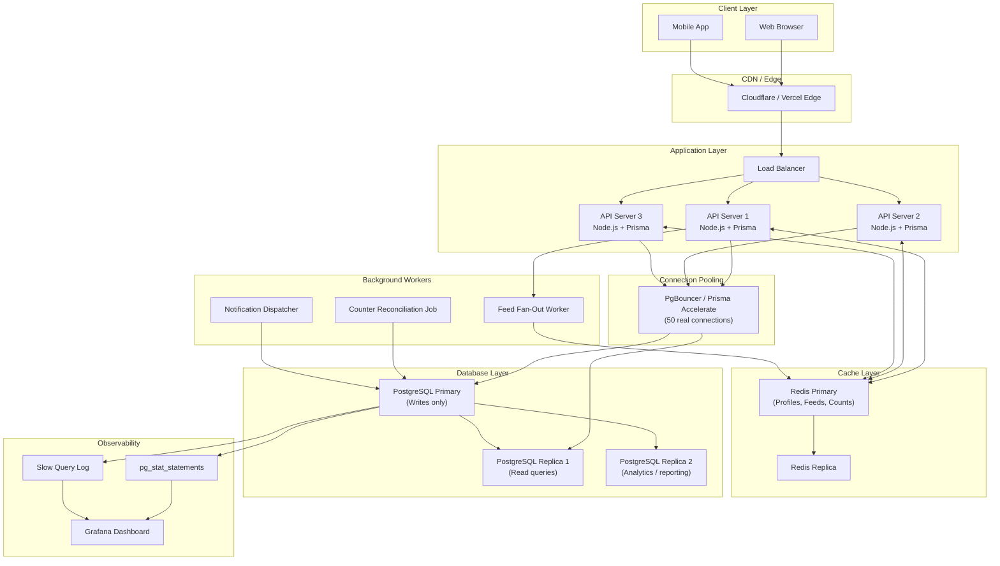

# Social Network: Query Optimization and Scaling

> **Chapter 5** — Performance and Scaling for Your First Real SQL Project

You have a working social network schema. Users can follow each other, post content, and like posts. Now imagine your app goes viral overnight and you wake up to 500,000 users hitting your database at the same time. This chapter is about not letting that moment break you.

We will cover every layer of the performance stack — from the right indexes to read replicas, from the N+1 trap in Prisma to the infamous celebrity problem. By the end, you will understand how production systems at real scale are structured.

---

## 🗂️ The Index Strategy

An index is a separate data structure your database maintains so it can find rows without scanning the entire table. Think of it like a book's index — instead of reading every page to find "pagination", you look it up in the back and jump straight there.

Without indexes, every query that filters or sorts data performs a **sequential scan** — reading every single row. On a table with 10 million posts, that is catastrophically slow.

### Core Indexes for a Social Network

```sql
-- Feed queries: "show me posts by user X, newest first, excluding deleted"
CREATE INDEX idx_posts_user_created
  ON posts(user_id, created_at DESC)
  WHERE deleted_at IS NULL;

-- Follow graph: "who does user X follow?"
CREATE INDEX idx_follows_follower ON follows(follower_id);

-- Follow graph: "who follows user X?"
CREATE INDEX idx_follows_following ON follows(following_id);

-- Like counts: "how many likes does post X have?"
CREATE INDEX idx_likes_post ON likes(post_id);

-- "Did the current user already like this post?"
CREATE INDEX idx_likes_user_post ON likes(user_id, post_id);

-- Comments per post
CREATE INDEX idx_comments_post_created
  ON comments(post_id, created_at DESC);

-- User profile lookup (username is usually unique, but an index speeds lookup)
CREATE INDEX idx_users_username ON users(username);

-- Notifications for a user, unread first
CREATE INDEX idx_notifications_user_read
  ON notifications(user_id, read_at)
  WHERE read_at IS NULL;
```

### Reading EXPLAIN ANALYZE Output

`EXPLAIN ANALYZE` runs the query and shows you exactly what the planner did and how long each step took. Always read it top to bottom (innermost step first).

```sql
EXPLAIN ANALYZE
SELECT p.*, u.username, u.avatar_url
FROM posts p
JOIN users u ON u.id = p.user_id
WHERE p.user_id = 42
  AND p.deleted_at IS NULL
ORDER BY p.created_at DESC
LIMIT 20;
```

**Without the index — sequential scan:**
```
Seq Scan on posts  (cost=0.00..48210.00 rows=23 width=512)
                   (actual time=0.042..892.331 rows=23 loops=1)
  Filter: ((user_id = 42) AND (deleted_at IS NULL))
  Rows Removed by Filter: 1999977
Planning Time: 0.8 ms
Execution Time: 892.4 ms   ← nearly 1 second!
```

**With `idx_posts_user_created` — index scan:**
```
Index Scan using idx_posts_user_created on posts
  (cost=0.56..98.34 rows=23 width=512)
  (actual time=0.031..0.187 rows=23 loops=1)
  Index Cond: (user_id = 42)
Planning Time: 0.7 ms
Execution Time: 0.3 ms     ← 3000x faster
```

**Key things to look for in EXPLAIN ANALYZE:**
- `Seq Scan` on a large table — almost always means a missing index
- `rows=X` estimate vs `actual rows=Y` — if they diverge wildly, run `ANALYZE` to refresh statistics
- `Execution Time` at the bottom — this is your baseline to beat

> **Rule of thumb:** Any query running over 100ms in your app is a candidate for optimization. Any query over 500ms is a fire to put out.

---

## 🔁 The N+1 Problem

The N+1 problem is the most common performance mistake developers make when using ORMs like Prisma. It happens when you fetch a list of N items and then run one additional query for each item to get related data — resulting in N+1 total queries instead of 1.

### How It Hides in Prisma Code

This looks completely fine at first glance:

```typescript
// BAD: N+1 problem
async function getFeedWithComments(userId: number) {
  const posts = await prisma.post.findMany({
    where: { userId },
    take: 20,
    orderBy: { createdAt: 'desc' }
  });

  // This runs ONE query per post — 20 queries for 20 posts!
  for (const post of posts) {
    post.comments = await prisma.comment.findMany({
      where: { postId: post.id },
      take: 3
    });
  }

  return posts;
}
```

When this runs, your database sees: 1 query for posts + 20 queries for comments = **21 round trips**. At 1ms per query, that is 21ms of pure database overhead before you even process data. At 100 posts, it is 101ms. At 1000 posts, over a second.

### The Fix: Use `include` or Join in One Query

```typescript
// GOOD: One query with a JOIN under the hood
async function getFeedWithComments(userId: number) {
  const posts = await prisma.post.findMany({
    where: { userId },
    take: 20,
    orderBy: { createdAt: 'desc' },
    include: {
      comments: {
        take: 3,
        orderBy: { createdAt: 'desc' },
        include: {
          author: {
            select: { id: true, username: true, avatarUrl: true }
          }
        }
      },
      author: {
        select: { id: true, username: true, avatarUrl: true }
      },
      _count: {
        select: { likes: true }
      }
    }
  });

  return posts;  // 1 query total (or 2-3 with Prisma's batching)
}
```

**Prisma's actual strategy:** For `include`, Prisma does not always produce a single SQL JOIN. It often runs a small number of batched queries (one per relation type) and merges results in memory. This is still dramatically better than N+1.

> **How to detect N+1 in development:** Set `log: ['query']` in your Prisma client config. If you see the same query repeated many times with only the ID changing, you have an N+1 problem.

```typescript
const prisma = new PrismaClient({
  log: ['query', 'info', 'warn', 'error']
});
```

---

## ⭐ The Celebrity Problem

Imagine a user with 10 million followers posts something. How do you get that post into 10 million people's feeds?

This is the **celebrity problem** (also called the **hotspot problem**), and it is one of the hardest challenges in social network engineering.

### Fan-Out on Write

When the celebrity posts, immediately write a copy of that post ID into the feed cache (Redis sorted set) of every single follower.

```
Celebrity posts → background job → iterate 10M followers → write to each feed
```

**Pros:** Feed reads are instant. Just fetch from your pre-built cache.
**Cons:** One post triggers 10 million writes. If Beyoncé posts at noon, your write infrastructure spikes massively. The post takes minutes to propagate.

### Fan-Out on Read

Store nothing up front. When a user loads their feed, query the database for posts from everyone they follow, merge and sort in real time.

```sql
SELECT p.*
FROM posts p
WHERE p.user_id IN (
  SELECT following_id FROM follows WHERE follower_id = $userId
)
AND p.deleted_at IS NULL
ORDER BY p.created_at DESC
LIMIT 20;
```

**Pros:** Posting is instant. No write amplification.
**Cons:** Reading is expensive. For users following 1000 people, this query touches a lot of data. For 100,000 users loading feeds simultaneously, your database melts.

### The Hybrid Approach (What Twitter Actually Did)

Twitter's architecture used a hybrid strategy that is the industry standard:

1. **Normal users (under ~10,000 followers):** Fan-out on write. When they post, their post ID is pushed into each follower's feed cache.
2. **Celebrity users (over ~10,000 followers):** Fan-out on read. Their posts are NOT pre-distributed. Instead, when any user loads their feed, the system fetches celebrity posts separately and merges them in at read time.

```
Feed for user A =
  (pre-computed feed from cache)  ← regular followees, fan-out on write
  MERGE WITH
  (real-time query for celebrity posts)  ← live database lookup
```

This means the write spike from a celebrity post is absorbed by distributed reads instead of 10 million immediate writes. The merge step in your application layer is cheap because you are only merging two sorted lists.

For a beginner project, implement fan-out on read first. It is simpler and perfectly adequate up to tens of thousands of users. Add the hybrid approach when you actually see database strain from feed queries.

---

## 📄 Pagination: Cursor vs Offset

When displaying a feed, you cannot return all posts at once. You need pagination. There are two approaches: **offset pagination** and **cursor pagination**.

### Why Offset Pagination Breaks at Scale

```typescript
// Offset pagination — looks fine, hides problems
const posts = await prisma.post.findMany({
  skip: page * 20,   // OFFSET 2000 means: scan 2000 rows and discard them
  take: 20,
  orderBy: { createdAt: 'desc' }
});
```

**Problem 1 — Performance:** `OFFSET 2000` does not "jump" to row 2000. The database scans and discards those 2000 rows first. At page 500, you are discarding 10,000 rows on every request.

**Problem 2 — Data drift:** If new posts are inserted between page 1 and page 2, all row numbers shift. Users see duplicate posts on the next page or miss posts entirely.

### Cursor Pagination: The Right Way

Instead of "skip N rows", cursor pagination says "give me posts newer/older than this specific post ID". Because IDs are stable, data drift is eliminated. Because the database uses an index seek, performance stays constant regardless of how deep into the feed you are.

```typescript
async function getFeed(userId: number, cursor?: number) {
  const followingIds = await prisma.follow.findMany({
    where: { followerId: userId },
    select: { followingId: true }
  });

  const userIds = followingIds.map(f => f.followingId);
  userIds.push(userId); // include own posts

  // Take 21 to detect whether there is a next page
  const posts = await prisma.post.findMany({
    where: {
      userId: { in: userIds },
      deletedAt: null,
    },
    take: 21,
    ...(cursor && {
      cursor: { id: cursor },
      skip: 1  // skip the cursor itself
    }),
    orderBy: { createdAt: 'desc' },
    include: {
      author: { select: { id: true, username: true, avatarUrl: true } },
      _count: { select: { likes: true, comments: true } }
    }
  });

  const hasMore = posts.length > 20;

  return {
    posts: posts.slice(0, 20),
    nextCursor: hasMore ? posts[19].id : null
  };
}
```

The client receives `nextCursor`. To load the next page, it passes that cursor back. When `nextCursor` is `null`, the feed is exhausted.

> **Important:** For cursor pagination to work correctly with `created_at DESC` ordering, your cursor column must be unique or combined with a tiebreaker. Using the post `id` (which is always unique and correlates with creation order for auto-increment IDs) works well as the cursor.

---

## 📊 Denormalization: Counter Columns

Every time you display a post, you probably show its like count and comment count. If you compute these with `COUNT(*)` on every page load, you are scanning the likes and comments tables constantly.

The solution is **denormalization** — storing derived data (the count) directly on the parent row, trading some write complexity for dramatically faster reads.

```sql
ALTER TABLE posts ADD COLUMN like_count INTEGER NOT NULL DEFAULT 0;
ALTER TABLE posts ADD COLUMN comment_count INTEGER NOT NULL DEFAULT 0;
ALTER TABLE users ADD COLUMN follower_count INTEGER NOT NULL DEFAULT 0;
ALTER TABLE users ADD COLUMN following_count INTEGER NOT NULL DEFAULT 0;
```

Now `SELECT like_count FROM posts WHERE id = $id` is a single index lookup — no join, no count.

### Keeping Counters Consistent: Three Approaches

**Approach 1 — Database Triggers (always consistent)**

```sql
CREATE OR REPLACE FUNCTION increment_like_count()
RETURNS TRIGGER AS $$
BEGIN
  UPDATE posts SET like_count = like_count + 1 WHERE id = NEW.post_id;
  RETURN NEW;
END;
$$ LANGUAGE plpgsql;

CREATE TRIGGER after_like_insert
  AFTER INSERT ON likes
  FOR EACH ROW EXECUTE FUNCTION increment_like_count();

CREATE OR REPLACE FUNCTION decrement_like_count()
RETURNS TRIGGER AS $$
BEGIN
  UPDATE posts SET like_count = like_count - 1 WHERE id = OLD.post_id;
  RETURN OLD;
END;
$$ LANGUAGE plpgsql;

CREATE TRIGGER after_like_delete
  AFTER DELETE ON likes
  FOR EACH ROW EXECUTE FUNCTION decrement_like_count();
```

Triggers run inside the same transaction as the INSERT/DELETE. The counter is always consistent. The tradeoff is that every like operation now does two writes (likes table + posts table update).

**Approach 2 — Application Layer (race condition risk)**

```typescript
// Do NOT do this without transactions — race condition!
await prisma.$transaction([
  prisma.like.create({ data: { userId, postId } }),
  prisma.post.update({
    where: { id: postId },
    data: { likeCount: { increment: 1 } }
  })
]);
```

Using `increment: 1` with Prisma generates `SET like_count = like_count + 1` in SQL — an atomic operation that avoids race conditions. Wrapping in a transaction ensures both writes succeed or both fail.

**Approach 3 — Scheduled Reconciliation**

Run a background job nightly or hourly to recompute all counters from scratch:

```sql
UPDATE posts p
SET like_count = (SELECT COUNT(*) FROM likes l WHERE l.post_id = p.id);
```

This is a safety net, not a primary strategy. Combine it with approach 1 or 2. It catches any drift caused by bugs, failed transactions, or manual database edits.

---

## 🔀 Read Replicas: Spreading the Load

In PostgreSQL, you can configure one primary (write) database and one or more replicas that receive a continuous stream of changes. Replicas are read-only. This lets you direct all SELECT queries away from your primary, freeing it to handle writes.

With Prisma, you configure multiple datasources using the `@prisma/extension-read-replicas` package:

```typescript
import { PrismaClient } from '@prisma/client';
import { readReplicas } from '@prisma/extension-read-replicas';

const prisma = new PrismaClient().$extends(
  readReplicas({
    url: process.env.DATABASE_REPLICA_URL  // your replica connection string
  })
);

// This read query automatically goes to the replica
const posts = await prisma.post.findMany({ take: 20 });

// This write always goes to the primary
const newPost = await prisma.post.create({ data: { ... } });

// Force a read to hit the primary (e.g., right after a write)
const freshPost = await prisma.$primary().post.findUnique({ where: { id: newPost.id } });
```

**When to use `$primary()` for reads:** Immediately after a write, the replica may be a few milliseconds behind (replication lag). If you write a post and immediately redirect to the post page, the replica might not have it yet. In this case, read from primary.

---

## 🔌 Connection Pooling: PgBouncer and Prisma Accelerate

PostgreSQL creates a process for each database connection. At 500 concurrent Node.js requests, each with its own connection, you would have 500 PostgreSQL processes — each consuming ~5-10 MB of RAM. This exhausts resources quickly.

**PgBouncer** sits between your app and PostgreSQL. It maintains a small pool of actual connections (say, 50) and multiplexes hundreds of application connections through them. In transaction pooling mode, a database connection is only held for the duration of one transaction, then returned to the pool.

**Prisma Accelerate** is a managed connection pooler from Prisma that also adds a built-in cache layer. Configure it by replacing your direct database URL:

```
# .env
DATABASE_URL="prisma://accelerate.prisma-data.net/?api_key=your_key"
```

Your Prisma code does not change at all — Accelerate handles pooling transparently.

**Connection pool sizing rule of thumb:** `connections = (2 * num_cpu_cores) + num_disk_spindles`. For a 2-core database server, ~5-10 connections is often enough. More connections does not mean more throughput — it means more contention.

---

## ⚡ Caching with Redis

A cache stores frequently read, rarely changed data in memory so you never hit the database for it. Redis is the standard choice.

### What to Cache

| Data | TTL | Reason |
|------|-----|--------|
| User profile (username, avatar) | 5 minutes | Read thousands of times per second, changes rarely |
| Post like count | 30 seconds | Slightly stale is acceptable |
| Feed for a celebrity | 60 seconds | Saves enormous repeated computation |
| `isFollowing(A, B)` check | 2 minutes | Repeated on every feed render |

### Redis Integration Pattern

```typescript
import { createClient } from 'redis';

const redis = createClient({ url: process.env.REDIS_URL });
await redis.connect();

async function getUserProfile(userId: number) {
  const cacheKey = `user:${userId}:profile`;

  // 1. Try cache first
  const cached = await redis.get(cacheKey);
  if (cached) return JSON.parse(cached);

  // 2. Cache miss — hit the database
  const user = await prisma.user.findUnique({
    where: { id: userId },
    select: { id: true, username: true, displayName: true, avatarUrl: true, bio: true }
  });

  if (!user) return null;

  // 3. Store in cache with 5-minute expiry
  await redis.setEx(cacheKey, 300, JSON.stringify(user));

  return user;
}

// Invalidate cache when user updates their profile
async function updateUserProfile(userId: number, data: Partial<User>) {
  await prisma.user.update({ where: { id: userId }, data });
  await redis.del(`user:${userId}:profile`);  // bust the cache
}
```

**Cache invalidation** (knowing when to clear the cache) is notoriously tricky. Keep it simple: invalidate on write, use short TTLs, and accept that some data may be a few seconds stale. For a social network, seeing a like count that is 30 seconds old is perfectly acceptable.

---

## 🔍 Database Monitoring

You cannot optimize what you cannot see. PostgreSQL ships with powerful built-in observability tools.

### pg_stat_statements

This extension tracks execution statistics for every query. Enable it in your PostgreSQL config:

```sql
-- In postgresql.conf:
-- shared_preload_libraries = 'pg_stat_statements'

-- Then in your database:
CREATE EXTENSION IF NOT EXISTS pg_stat_statements;

-- Find your top 10 slowest queries:
SELECT
  query,
  calls,
  round(total_exec_time::numeric, 2) AS total_ms,
  round(mean_exec_time::numeric, 2) AS avg_ms,
  round(stddev_exec_time::numeric, 2) AS stddev_ms,
  rows
FROM pg_stat_statements
ORDER BY mean_exec_time DESC
LIMIT 10;
```

This single query tells you exactly which SQL statements are hurting you the most. Run it weekly.

### Slow Query Log

In `postgresql.conf`, set:
```
log_min_duration_statement = 100   # log any query taking over 100ms
```

Slow query logs appear in your PostgreSQL log files. Ship them to a log aggregator (Datadog, Grafana Loki) so you get alerts when regressions appear.

### Key Metrics to Watch

- **Cache hit ratio** — should be above 95%. Below 90% means you need more RAM.
- **Active connections** — approaching your `max_connections` limit is a sign you need a pooler.
- **Table bloat** — DELETE/UPDATE operations leave dead rows. Run `VACUUM ANALYZE` regularly (PostgreSQL's autovacuum handles this automatically by default).
- **Replication lag** — the delay between a write on primary and its visibility on replicas, measured in bytes or milliseconds.

---

## 🧩 Sharding: Facebook Scale (Conceptual)

Sharding means splitting your data across multiple database servers — each server owns a subset of the data. For example, users with IDs 1-1M go to shard 1, users 1M-2M go to shard 2.

This is complex infrastructure you will not need until you are past millions of active users and hundreds of thousands of writes per second. Most successful startups never shard their primary database — they scale vertically (bigger machines), optimize queries, add caching, and use read replicas instead.

When you do need sharding, the key decisions are:
- **Shard key:** What column determines which shard a row lives on? For a social network, `user_id` is the natural choice — it keeps all of a user's data co-located.
- **Cross-shard queries:** A query that needs data from multiple shards is expensive. Design your shard key to minimize these.
- **Tools:** Citus (PostgreSQL extension), Vitess (MySQL), or moving to a natively distributed database like CockroachDB.

---

## 🏗️ Production Architecture Diagram



---

## ✅ Key Takeaways

**Indexes**
- A partial index (`WHERE deleted_at IS NULL`) is smaller and faster than a full-table index.
- Composite indexes should list the equality-filter column first, then the sort column.
- Always `EXPLAIN ANALYZE` your queries before and after adding an index.

**N+1**
- Use Prisma's `include` to load relations in one shot instead of looping.
- Enable query logging in development to catch N+1 problems before they reach production.

**Celebrity Problem**
- Start with fan-out on read (simpler).
- Graduate to a hybrid approach (fan-out on write for normal users, fan-out on read for celebrities) when feed query times climb.

**Pagination**
- Cursor pagination is always the right choice for large, live datasets.
- Pass the ID of the last item as your cursor; use `take: N+1` to detect if there is a next page.

**Denormalization**
- Counter columns (`like_count`, `follower_count`) are worth the write overhead.
- Prefer database triggers for correctness; use scheduled reconciliation as a safety net.

**Infrastructure**
- Read replicas handle read traffic; your primary only handles writes.
- A connection pooler (PgBouncer or Prisma Accelerate) is mandatory in production.
- Cache user profiles, post counts, and computed feeds in Redis with appropriate TTLs.
- `pg_stat_statements` is your best friend for finding slow queries.

**Sharding**
- You almost certainly do not need it yet. Optimize first, scale vertically second, shard last.

---

*Next Chapter: Testing Your Database Layer — Unit Tests, Integration Tests, and Seeding Strategies*
