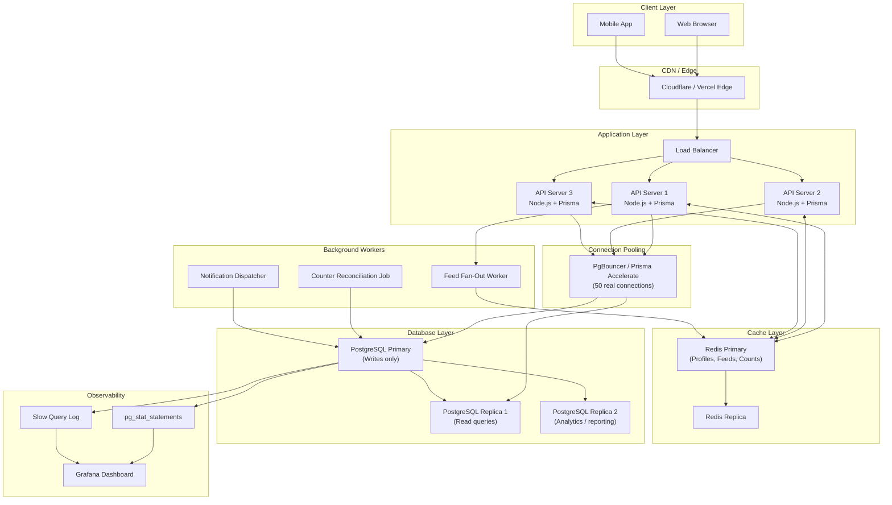

# Social Network: Query Optimization and Scaling

> **Chapter 5** — Performance and Scaling for Your First Real SQL Project

Tumhara social network schema ready hai — users follow kar sakte hain, post kar sakte hain, like kar sakte hain. Ab socho ek din tumhara app raatoraat viral ho jaata hai aur subah uthte hi dekhte ho 500,000 users ek saath tumhare database pe hit kar rahe hain. Yeh chapter isi moment ke liye hai — taaki woh moment tumhe todhe na.

Hum performance stack ki har layer cover karenge — sahi indexes se leke read replicas tak, Prisma ke N+1 trap se leke us famous "celebrity problem" tak. End tak tumhe samajh aa jaayega ki real production systems bade scale pe kaise structure kiye jaate hain.

---

## 🗂️ Index Strategy

Kya hota hai index? Ek index basically ek separate data structure hai jo tumhara database maintain karta hai taaki poori table scan kiye bina rows dhoondh sake. Bilkul kisi book ke index jaisa — "pagination" topic dhoondhne ke liye tum har page nahi palatte, seedha peeche index mein dekhte ho aur exact page pe pahunch jaate ho.

Bina index ke, koi bhi query jo filter ya sort karti hai, woh **sequential scan** karti hai — matlab har single row padhti hai. 10 million posts wali table pe yeh bilkul disaster level slow hai.

### Social Network Ke Liye Core Indexes

```sql
-- Feed queries: "show me posts by user X, newest first, excluding deleted"
CREATE INDEX idx_posts_user_created
  ON posts(user_id, created_at DESC)
  WHERE deleted_at IS NULL;

-- Follow graph: "who does user X follow?"
CREATE INDEX idx_follows_follower ON follows(follower_id);

-- Follow graph: "who follows user X?"
CREATE INDEX idx_follows_following ON follows(following_id);

-- Like counts: "how many likes does post X have?"
CREATE INDEX idx_likes_post ON likes(post_id);

-- "Did the current user already like this post?"
CREATE INDEX idx_likes_user_post ON likes(user_id, post_id);

-- Comments per post
CREATE INDEX idx_comments_post_created
  ON comments(post_id, created_at DESC);

-- User profile lookup (username is usually unique, but an index speeds lookup)
CREATE INDEX idx_users_username ON users(username);

-- Notifications for a user, unread first
CREATE INDEX idx_notifications_user_read
  ON notifications(user_id, read_at)
  WHERE read_at IS NULL;
```

### EXPLAIN ANALYZE Kaise Padhein?

`EXPLAIN ANALYZE` actually query ko run karta hai aur tumhe bata deta hai ki planner ne exactly kya kiya aur har step mein kitna time laga. Isko hamesha upar se neeche padho (innermost step sabse pehle).

```sql
EXPLAIN ANALYZE
SELECT p.*, u.username, u.avatar_url
FROM posts p
JOIN users u ON u.id = p.user_id
WHERE p.user_id = 42
  AND p.deleted_at IS NULL
ORDER BY p.created_at DESC
LIMIT 20;
```

**Bina index ke — sequential scan:**
```
Seq Scan on posts  (cost=0.00..48210.00 rows=23 width=512)
                   (actual time=0.042..892.331 rows=23 loops=1)
  Filter: ((user_id = 42) AND (deleted_at IS NULL))
  Rows Removed by Filter: 1999977
Planning Time: 0.8 ms
Execution Time: 892.4 ms   ← lagbhag 1 second!
```

**`idx_posts_user_created` ke saath — index scan:**
```
Index Scan using idx_posts_user_created on posts
  (cost=0.56..98.34 rows=23 width=512)
  (actual time=0.031..0.187 rows=23 loops=1)
  Index Cond: (user_id = 42)
Planning Time: 0.7 ms
Execution Time: 0.3 ms     ← 3000x tez
```

**EXPLAIN ANALYZE mein yeh cheezein dhundo:**
- Kisi badi table pe `Seq Scan` — matlab almost hamesha koi index missing hai
- `rows=X` estimate vs `actual rows=Y` — agar yeh dono bahut alag hain, `ANALYZE` chalao taaki statistics refresh ho jaayein
- Neeche `Execution Time` — yehi tumhara baseline hai jise beat karna hai

> **Rule of thumb:** Koi bhi query jo app mein 100ms se zyada leti hai, woh optimization ka candidate hai. 500ms se upar wali query toh aag bujhaane wali emergency hai.

---

## 🔁 N+1 Problem

N+1 problem woh sabse common mistake hai jo developers Prisma jaise ORMs use karte waqt karte hain. Yeh tab hota hai jab tum N items ki list fetch karte ho aur phir har item ke liye ek extra query chalate ho related data ke liye — result mein N+1 total queries ban jaati hain, jabki 1 hi kaafi thi.

### Prisma Code Mein Yeh Kaise Chhup Jaata Hai

Pehli nazar mein yeh bilkul theek lagta hai:

```typescript
// BAD: N+1 problem
async function getFeedWithComments(userId: number) {
  const posts = await prisma.post.findMany({
    where: { userId },
    take: 20,
    orderBy: { createdAt: 'desc' }
  });

  // This runs ONE query per post — 20 queries for 20 posts!
  for (const post of posts) {
    post.comments = await prisma.comment.findMany({
      where: { postId: post.id },
      take: 3
    });
  }

  return posts;
}
```

Jab yeh run hota hai, tumhara database dekhta hai: posts ke liye 1 query + comments ke liye 20 queries = **21 round trips**. 1ms per query ke hisaab se, yeh 21ms ka pure database overhead hai — data process karne se pehle hi. 100 posts pe yeh 101ms ban jaata hai. 1000 posts pe, ek second se zyada.

### Fix: `include` Ya Ek Hi Query Mein Join

```typescript
// GOOD: One query with a JOIN under the hood
async function getFeedWithComments(userId: number) {
  const posts = await prisma.post.findMany({
    where: { userId },
    take: 20,
    orderBy: { createdAt: 'desc' },
    include: {
      comments: {
        take: 3,
        orderBy: { createdAt: 'desc' },
        include: {
          author: {
            select: { id: true, username: true, avatarUrl: true }
          }
        }
      },
      author: {
        select: { id: true, username: true, avatarUrl: true }
      },
      _count: {
        select: { likes: true }
      }
    }
  });

  return posts;  // 1 query total (or 2-3 with Prisma's batching)
}
```

**Prisma ki actual strategy:** `include` use karne pe Prisma hamesha ek single SQL JOIN nahi banata. Zyaadatar woh thodi batched queries chalata hai (har relation type ke liye ek) aur results ko memory mein merge kar deta hai. Fir bhi yeh N+1 se kaafi behtar hai — jaise Zomato apne 20 restaurants ki details ek hi batched call mein fetch kar le, na ki har restaurant ke liye alag Ola bhejna pade.

> **Development mein N+1 kaise detect karein:** Apne Prisma client config mein `log: ['query']` set karo. Agar tumhe same query baar-baar dikhe, sirf ID change ho rahi ho — toh samajh jao N+1 problem hai.

```typescript
const prisma = new PrismaClient({
  log: ['query', 'info', 'warn', 'error']
});
```

---

## ⭐ Celebrity Problem

Socho ek user ke 10 million followers hain aur woh kuch post karta hai. Uss post ko 10 million logon ke feed tak kaise pahunchaoge?

Isko kehte hain **celebrity problem** (ya **hotspot problem**), aur yeh social network engineering ke sabse mushkil challenges mein se ek hai.

### Fan-Out on Write

Jab celebrity post karta hai, turant background job chalao jo har single follower ke feed cache (Redis sorted set) mein us post ID ki copy likh de.

```
Celebrity posts → background job → iterate 10M followers → write to each feed
```

**Fayda:** Feed reads instant hain. Bas apne pre-built cache se fetch karo.
**Nuksaan:** Ek post 10 million writes trigger kar deta hai. Agar Beyoncé dopahar 12 baje post karti hai, tumhara write infrastructure massively spike ho jaata hai. Post propagate hone mein minutes lag sakte hain.

### Fan-Out on Read

Kuch bhi pehle se store mat karo. Jab user apna feed load kare, tab database se query karo un sab logon ke posts jinko woh follow karta hai, aur real time mein merge-sort kar do.

```sql
SELECT p.*
FROM posts p
WHERE p.user_id IN (
  SELECT following_id FROM follows WHERE follower_id = $userId
)
AND p.deleted_at IS NULL
ORDER BY p.created_at DESC
LIMIT 20;
```

**Fayda:** Posting instant hai. Koi write amplification nahi.
**Nuksaan:** Reading mehengi hai. Jo user 1000 logon ko follow karta hai, uske liye yeh query kaafi data touch karti hai. Agar 100,000 users ek saath feed load karein, tumhara database pighal jaayega.

### Hybrid Approach (Jo Twitter Ne Actually Kiya)

Twitter ka architecture ek hybrid strategy use karta tha jo aaj industry standard hai:

1. **Normal users (~10,000 se kam followers):** Fan-out on write. Jab woh post karte hain, unki post ID har follower ke feed cache mein push ho jaati hai.
2. **Celebrity users (~10,000 se zyada followers):** Fan-out on read. Unke posts pehle se distribute nahi kiye jaate. Iski jagah, jab koi bhi user apna feed load karta hai, system celebrity posts ko alag se fetch karke read time pe merge karta hai.

```
Feed for user A =
  (pre-computed feed from cache)  ← regular followees, fan-out on write
  MERGE WITH
  (real-time query for celebrity posts)  ← live database lookup
```

Iska matlab hai ki celebrity post ka write spike 10 million immediate writes ki jagah distributed reads mein absorb ho jaata hai. Application layer mein merge step sasta hai kyunki tum sirf do sorted lists merge kar rahe ho.

Ek beginner project ke liye, pehle fan-out on read implement karo. Yeh simple hai aur tens of thousands of users tak bilkul theek chalta hai. Jab feed queries ki wajah se database pe real strain dikhe, tab hybrid approach add karo.

---

## 📄 Pagination: Cursor vs Offset

Feed dikhate waqt tum saare posts ek saath return nahi kar sakte. Pagination chahiye hi hoga. Iske do approaches hain: **offset pagination** aur **cursor pagination**.

### Offset Pagination Scale Pe Kyun Toot Jaata Hai

```typescript
// Offset pagination — looks fine, hides problems
const posts = await prisma.post.findMany({
  skip: page * 20,   // OFFSET 2000 means: scan 2000 rows and discard them
  take: 20,
  orderBy: { createdAt: 'desc' }
});
```

**Problem 1 — Performance:** `OFFSET 2000` seedha row 2000 pe "jump" nahi karta. Database pehle woh 2000 rows scan karta hai aur discard karta hai. Page 500 pe, tum har request pe 10,000 rows discard kar rahe ho — bilkul waste.

**Problem 2 — Data drift:** Agar page 1 aur page 2 ke beech naye posts insert ho jaayein, toh saare row numbers shift ho jaate hain. Users ko agle page pe duplicate posts dikhte hain ya posts miss ho jaate hain.

### Cursor Pagination: Sahi Tareeka

"Skip N rows" kehne ki bajaye, cursor pagination kehta hai "mujhe is specific post ID se newer/older posts do". Chunki IDs stable hoti hain, data drift khatam ho jaata hai. Aur chunki database index seek use karta hai, performance constant rehti hai chahe tum feed mein kitni bhi gehrai tak jao.

```typescript
async function getFeed(userId: number, cursor?: number) {
  const followingIds = await prisma.follow.findMany({
    where: { followerId: userId },
    select: { followingId: true }
  });

  const userIds = followingIds.map(f => f.followingId);
  userIds.push(userId); // include own posts

  // Take 21 to detect whether there is a next page
  const posts = await prisma.post.findMany({
    where: {
      userId: { in: userIds },
      deletedAt: null,
    },
    take: 21,
    ...(cursor && {
      cursor: { id: cursor },
      skip: 1  // skip the cursor itself
    }),
    orderBy: { createdAt: 'desc' },
    include: {
      author: { select: { id: true, username: true, avatarUrl: true } },
      _count: { select: { likes: true, comments: true } }
    }
  });

  const hasMore = posts.length > 20;

  return {
    posts: posts.slice(0, 20),
    nextCursor: hasMore ? posts[19].id : null
  };
}
```

Client ko `nextCursor` milta hai. Agla page load karne ke liye, woh usi cursor ko wapas bhej deta hai. Jab `nextCursor` `null` ho, matlab feed khatam ho gaya.

> **Zaruri baat:** `created_at DESC` ordering ke saath cursor pagination sahi se kaam kare, iske liye cursor column unique hona chahiye ya kisi tiebreaker ke saath combine hona chahiye. Post ki `id` (jo hamesha unique hoti hai aur auto-increment IDs ke case mein creation order se correlate karti hai) cursor ke taur pe accha kaam karti hai.

---

## 📊 Denormalization: Counter Columns

Jab bhi tum koi post dikhate ho, uske like count aur comment count bhi dikhate ho, right? Agar yeh har page load pe `COUNT(*)` se compute karoge, toh tum likes aur comments tables ko lagataar scan kar rahe hoge — bilkul waise jaise Swiggy har order pe restaurant ka poora rating history recalculate kare instead of ek saved number dikhane ke.

Solution hai **denormalization** — derived data (yaani count) ko directly parent row pe store karna, thodi write complexity ke badle mein dramatically faster reads.

```sql
ALTER TABLE posts ADD COLUMN like_count INTEGER NOT NULL DEFAULT 0;
ALTER TABLE posts ADD COLUMN comment_count INTEGER NOT NULL DEFAULT 0;
ALTER TABLE users ADD COLUMN follower_count INTEGER NOT NULL DEFAULT 0;
ALTER TABLE users ADD COLUMN following_count INTEGER NOT NULL DEFAULT 0;
```

Ab `SELECT like_count FROM posts WHERE id = $id` ek single index lookup hai — na join, na count.

### Counters Ko Consistent Rakhne Ke Teen Tareeke

**Approach 1 — Database Triggers (hamesha consistent)**

```sql
CREATE OR REPLACE FUNCTION increment_like_count()
RETURNS TRIGGER AS $$
BEGIN
  UPDATE posts SET like_count = like_count + 1 WHERE id = NEW.post_id;
  RETURN NEW;
END;
$$ LANGUAGE plpgsql;

CREATE TRIGGER after_like_insert
  AFTER INSERT ON likes
  FOR EACH ROW EXECUTE FUNCTION increment_like_count();

CREATE OR REPLACE FUNCTION decrement_like_count()
RETURNS TRIGGER AS $$
BEGIN
  UPDATE posts SET like_count = like_count - 1 WHERE id = OLD.post_id;
  RETURN OLD;
END;
$$ LANGUAGE plpgsql;

CREATE TRIGGER after_like_delete
  AFTER DELETE ON likes
  FOR EACH ROW EXECUTE FUNCTION decrement_like_count();
```

Triggers usi transaction ke andar chalte hain jisme INSERT/DELETE hua tha. Counter hamesha consistent rehta hai. Tradeoff yeh hai ki ab har like operation do writes karta hai (likes table + posts table update).

**Approach 2 — Application Layer (race condition ka risk)**

```typescript
// Do NOT do this without transactions — race condition!
await prisma.$transaction([
  prisma.like.create({ data: { userId, postId } }),
  prisma.post.update({
    where: { id: postId },
    data: { likeCount: { increment: 1 } }
  })
]);
```

`increment: 1` Prisma ke saath use karne pe SQL mein `SET like_count = like_count + 1` generate hota hai — ek atomic operation jo race conditions se bachaata hai. Transaction mein wrap karne se ensure hota hai ki dono writes ya toh success honge ya dono fail.

**Approach 3 — Scheduled Reconciliation**

Ek background job raat ko ya har ghante chalao jo saare counters ko scratch se recompute kar de:

```sql
UPDATE posts p
SET like_count = (SELECT COUNT(*) FROM likes l WHERE l.post_id = p.id);
```

Yeh ek safety net hai, primary strategy nahi. Isse approach 1 ya 2 ke saath combine karo. Yeh bugs, failed transactions, ya manual database edits se hui kisi bhi drift ko pakad leta hai.

---

## 🔀 Read Replicas: Load Failaana

PostgreSQL mein tum ek primary (write) database configure kar sakte ho aur ek ya zyada replicas jo changes ka continuous stream receive karte hain. Replicas read-only hote hain. Isse tum saari SELECT queries primary se door bhej sakte ho, aur primary sirf writes handle karta hai.

Prisma ke saath, tum `@prisma/extension-read-replicas` package use karke multiple datasources configure karte ho:

```typescript
import { PrismaClient } from '@prisma/client';
import { readReplicas } from '@prisma/extension-read-replicas';

const prisma = new PrismaClient().$extends(
  readReplicas({
    url: process.env.DATABASE_REPLICA_URL  // your replica connection string
  })
);

// This read query automatically goes to the replica
const posts = await prisma.post.findMany({ take: 20 });

// This write always goes to the primary
const newPost = await prisma.post.create({ data: { ... } });

// Force a read to hit the primary (e.g., right after a write)
const freshPost = await prisma.$primary().post.findUnique({ where: { id: newPost.id } });
```

**`$primary()` ka use kab karein reads ke liye:** Write ke turant baad, replica thoda sa peeche reh sakta hai (replication lag). Agar tum post likhkar turant post page pe redirect karo, ho sakta hai replica ke paas woh data abhi na pahuncha ho. Aise case mein primary se hi read karo.

---

## 🔌 Connection Pooling: PgBouncer Aur Prisma Accelerate

PostgreSQL har database connection ke liye ek process banata hai. 500 concurrent Node.js requests pe, har ek ka apna connection ho, toh tumhare paas 500 PostgreSQL processes ho jaayenge — har ek ~5-10 MB RAM khaate hue. Yeh resources ko bahut jaldi khatam kar deta hai.

**PgBouncer** tumhare app aur PostgreSQL ke beech baithta hai. Yeh actual connections ka ek chhota pool maintain karta hai (maano, 50) aur sainkdon application connections ko unhi se multiplex kar deta hai. Transaction pooling mode mein, ek database connection sirf ek transaction ki duration ke liye hold hota hai, phir wapas pool mein chala jaata hai.

**Prisma Accelerate** Prisma ka managed connection pooler hai jo saath mein ek built-in cache layer bhi deta hai. Isko configure karne ke liye bas apna direct database URL replace karo:

```
# .env
DATABASE_URL="prisma://accelerate.prisma-data.net/?api_key=your_key"
```

Tumhara Prisma code bilkul change nahi hota — Accelerate pooling ko transparently handle kar leta hai.

**Connection pool size ka rule of thumb:** `connections = (2 * num_cpu_cores) + num_disk_spindles`. 2-core database server ke liye, ~5-10 connections aksar kaafi hote hain. Zyada connections ka matlab zyada throughput nahi hota — iska matlab hai zyada contention.

---

## ⚡ Redis Ke Saath Caching

Kya hota hai cache? Cache frequently read hone waali, kam badalne waali data ko memory mein store karta hai taaki uske liye database hit hi na karna pade. Redis is field ka standard choice hai.

### Kya Cache Karein

| Data | TTL | Reason |
|------|-----|--------|
| User profile (username, avatar) | 5 minutes | Per second hazaaron baar read hota hai, rarely change hota hai |
| Post like count | 30 seconds | Thoda stale chalta hai |
| Celebrity ka feed | 60 seconds | Bahut zyada repeated computation bacha leta hai |
| `isFollowing(A, B)` check | 2 minutes | Har feed render pe repeat hota hai |

### Redis Integration Pattern

```typescript
import { createClient } from 'redis';

const redis = createClient({ url: process.env.REDIS_URL });
await redis.connect();

async function getUserProfile(userId: number) {
  const cacheKey = `user:${userId}:profile`;

  // 1. Try cache first
  const cached = await redis.get(cacheKey);
  if (cached) return JSON.parse(cached);

  // 2. Cache miss — hit the database
  const user = await prisma.user.findUnique({
    where: { id: userId },
    select: { id: true, username: true, displayName: true, avatarUrl: true, bio: true }
  });

  if (!user) return null;

  // 3. Store in cache with 5-minute expiry
  await redis.setEx(cacheKey, 300, JSON.stringify(user));

  return user;
}

// Invalidate cache when user updates their profile
async function updateUserProfile(userId: number, data: Partial<User>) {
  await prisma.user.update({ where: { id: userId }, data });
  await redis.del(`user:${userId}:profile`);  // bust the cache
}
```

**Cache invalidation** (yaani kab cache clear karna hai, yeh jaanna) badnaam roop se tricky hai — jaise UPI mein "payment pending" state samajhna. Simple raho: write pe invalidate karo, short TTLs use karo, aur accept karo ki kuch data thoda seconds purana ho sakta hai. Social network ke liye, like count 30 second purana dikhna bilkul acceptable hai.

---

## 🔍 Database Monitoring

Jo tumhe dikhta hi nahi, usko optimize nahi kar sakte. PostgreSQL ke saath powerful built-in observability tools already aate hain.

### pg_stat_statements

Yeh extension har query ke execution statistics track karta hai. Apne PostgreSQL config mein isko enable karo:

```sql
-- In postgresql.conf:
-- shared_preload_libraries = 'pg_stat_statements'

-- Then in your database:
CREATE EXTENSION IF NOT EXISTS pg_stat_statements;

-- Find your top 10 slowest queries:
SELECT
  query,
  calls,
  round(total_exec_time::numeric, 2) AS total_ms,
  round(mean_exec_time::numeric, 2) AS avg_ms,
  round(stddev_exec_time::numeric, 2) AS stddev_ms,
  rows
FROM pg_stat_statements
ORDER BY mean_exec_time DESC
LIMIT 10;
```

Yeh ek hi query tumhe exactly bata deti hai kaunse SQL statements tumhe sabse zyada dukha rahe hain. Isko weekly chalao.

### Slow Query Log

`postgresql.conf` mein set karo:
```
log_min_duration_statement = 100   # log any query taking over 100ms
```

Slow query logs tumhare PostgreSQL log files mein aate hain. Inhe kisi log aggregator (Datadog, Grafana Loki) ko bhejo taaki regressions aane pe alert mile.

### Dekhne Layak Key Metrics

- **Cache hit ratio** — 95% se upar hona chahiye. 90% se neeche matlab tumhe zyada RAM chahiye.
- **Active connections** — `max_connections` limit ke paas pahunchna sign hai ki tumhe ek pooler chahiye.
- **Table bloat** — DELETE/UPDATE operations dead rows chhod jaate hain. Regularly `VACUUM ANALYZE` chalao (PostgreSQL ka autovacuum by default yeh automatically handle karta hai).
- **Replication lag** — primary pe write aur replicas pe uski visibility ke beech ka delay, bytes ya milliseconds mein measure hota hai.

---

## 🧩 Sharding: Facebook Scale (Conceptual)

Sharding ka matlab hai apna data multiple database servers mein split karna — har server data ka ek subset apne paas rakhta hai. Jaise, IDs 1-1M waale users shard 1 mein jaayein, 1M-2M waale shard 2 mein.

Yeh complex infrastructure hai jiski zarurat tumhe tab tak nahi padegi jab tak tum millions active users aur lakhon writes-per-second cross na kar lo. Zyaadatar successful startups apna primary database kabhi shard nahi karte — woh vertically scale karte hain (bade machines), queries optimize karte hain, caching add karte hain, aur read replicas use karte hain.

Jab sharding ki zarurat aa hi jaaye, toh yeh key decisions lene padte hain:
- **Shard key:** Kaunsa column decide karega ki row kaunse shard pe rahegi? Social network ke liye, `user_id` natural choice hai — isse ek user ka saara data ek hi jagah rehta hai.
- **Cross-shard queries:** Jis query ko multiple shards se data chahiye, woh mehengi padti hai. Apni shard key aise design karo ki inhe minimize kiya ja sake.
- **Tools:** Citus (PostgreSQL extension), Vitess (MySQL), ya CockroachDB jaise natively distributed database pe move karna.

---

## 🏗️ Production Architecture Diagram



---

## ✅ Key Takeaways

**Indexes**
- Partial index (`WHERE deleted_at IS NULL`) full-table index se chhota aur tez hota hai.
- Composite indexes mein equality-filter column pehle list karo, phir sort column.
- Index add karne se pehle aur baad mein hamesha `EXPLAIN ANALYZE` chalao.

**N+1**
- Loop lagane ki bajaye Prisma ka `include` use karo taaki relations ek hi shot mein load ho jaayein.
- Development mein query logging enable karo taaki N+1 problems production tak pahunchne se pehle hi pakad lo.

**Celebrity Problem**
- Fan-out on read se start karo (simpler hai).
- Jab feed query times badhne lagein, tab hybrid approach pe upgrade karo (normal users ke liye fan-out on write, celebrities ke liye fan-out on read).

**Pagination**
- Bade, live datasets ke liye cursor pagination hamesha sahi choice hai.
- Last item ki ID ko cursor ke taur pe pass karo; next page hai ya nahi yeh detect karne ke liye `take: N+1` use karo.

**Denormalization**
- Counter columns (`like_count`, `follower_count`) ka write overhead uthana worth it hai.
- Correctness ke liye database triggers prefer karo; scheduled reconciliation ko safety net ki tarah use karo.

**Infrastructure**
- Read replicas read traffic handle karte hain; tumhara primary sirf writes handle karta hai.
- Production mein connection pooler (PgBouncer ya Prisma Accelerate) mandatory hai.
- User profiles, post counts, aur computed feeds ko Redis mein appropriate TTLs ke saath cache karo.
- Slow queries dhundhne ke liye `pg_stat_statements` tumhara best friend hai.

**Sharding**
- Almost certainly tumhe abhi iski zarurat nahi hai. Pehle optimize karo, phir vertically scale karo, sharding sabse last mein.

---

*Next Chapter: Testing Your Database Layer — Unit Tests, Integration Tests, and Seeding Strategies*
