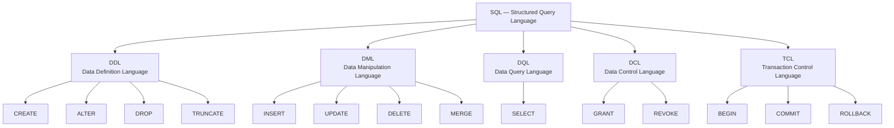

# Introduction to SQL

## Tum Kya Seekhoge?

Is chapter ke end tak tumhe pata chal jayega ki SQL hai kya, iski history kya rahi, apne machine pe database kaise set up karte hain, aur pehla simple statement kaise likhte hain. Koi prior database experience chahiye nahi — bilkul zero se shuru kar rahe hain.

---

## SQL Hai Kya Cheez?

**SQL** ka matlab hai **Structured Query Language**. Ye ek universal language hai jisse hum *relational databases* se baat karte hain — matlab wo software systems jo data ko structured tables (rows aur columns) mein store karte hain. Socho ek bahut hi well-organised Excel sheet, bas usse kahin zyada powerful.

SQL se tum ye sab kar sakte ho:

- **Create** — apne data ka structure banao (tables, schemas)
- **Insert, update, delete** — us structure ke andar data daalo, badlo, hatao
- **Query** — sawaal poocho jaise "pichle 30 din mein jitne bhi users signup hue hain, unki list do"
- **Access control** — decide karo kaun kya padh sakta hai, kaun kya change kar sakta hai
- **Transactions manage karo** — guarantee do ki operations ka ek group ya to poora successful hoga, ya poora rollback ho jayega

Almost har application jo data ko persist karti hai, wo kisi na kisi relational database ko touch karti hai — aur isliye SQL ko bhi. Yaani agar tumhe ek aisi skill seekhni hai jiska return sabse zyada ho, wo SQL hai.

---

## SQL Declarative Hai

Zyadatar programming languages **imperative** hoti hain — tumhe step-by-step batana padta hai ki kaam *kaise* karna hai:

```python
# Imperative: computer ko batao KAISE karna hai
result = []
for user in users:
    if user.age >= 18:
        result.append(user)
```

SQL **declarative** hai — tum sirf batate ho *kya* chahiye, aur database engine khud figure out karta hai ki usko sabse efficient tareeke se kaise laana hai:

```sql
-- Declarative: database ko batao KYA chahiye
SELECT * FROM users WHERE age >= 18;
```

Database ka **query planner/optimiser** decide karta hai ki kaunsa index use karna hai, tables ko kis order mein scan karna hai, kaam parallel mein hoga ya nahi, waghera waghera. Tumhara focus sirf result pe hota hai, algorithm pe nahi — jaise Zomato pe tum sirf "biryani chahiye" bolte ho, ye nahi ki "pehle kitchen A check karo, phir B, phir sort karo distance se."

---

## Ek Chhoti Si History

| Saal | Kya hua |
|------|---------|
| 1970 | Edgar F. Codd (IBM) ne relational model wala paper publish kiya |
| 1974 | IBM researchers ne SEQUEL (Structured English Query Language) banaya |
| 1979 | SEQUEL ka naam badalke SQL rakha gaya; pehla commercial product: Oracle v2 |
| 1986 | ANSI ne pehla SQL standard (SQL-86) publish kiya |
| 1992 | SQL-92 — aaj bhi zyadatar databases isi ko reference karte hain |
| 1999 | SQL:1999 mein recursive queries, triggers, aur bahut kuch add hua |
| 2003+ | SQL:2003, SQL:2008, SQL:2011, SQL:2016, SQL:2023 — evolution chalta hi raha |

SQL ne dozens "SQL killers" ko dekh dekh ke retire hote dekha hai, khud abhi bhi zinda hai. 50 saal se zyada purana ho chuka hai aur aaj bhi duniya ki dominant data query language hai.

> [!info]
> Jaise UPI ne payment ke tareeke ko revolutionize kiya lekin underlying banking rails abhi bhi stable hain, waise hi SQL bhi decades se apni jagah pe tika hua hai — naye tools aate rehte hain (NoSQL, GraphQL) lekin SQL replace nahi hota.

---

## SQL Ke Sub-languages

SQL ko paanch sub-languages mein baanta gaya hai, har ek ka apna specific kaam hai.



### DDL — Data Definition Language

**Kya hota hai?** DDL statements database ka **structure define ya change** karte hain. Ye tables, indexes, schemas jaise objects pe kaam karte hain.

| Statement | Kaam |
|-----------|------|
| `CREATE` | Naya table, index, view, schema, waghera banao |
| `ALTER` | Existing object ko modify karo (column add karo, rename karo, etc.) |
| `DROP` | Object aur uska pura data permanently delete kar do |
| `TRUNCATE` | Table ke saare rows hata do (DELETE se fast, kyunki row-by-row logging nahi hoti) |

```sql
CREATE TABLE employees (
    id   INT PRIMARY KEY,
    name VARCHAR(100),
    age  INT
);
```

### DML — Data Manipulation Language

**Kya hota hai?** DML statements tables ke **andar ka data** handle karte hain.

| Statement | Kaam |
|-----------|------|
| `INSERT` | Naye rows add karo |
| `UPDATE` | Existing rows modify karo |
| `DELETE` | Rows remove karo |
| `MERGE` | Upsert — row exist karta hai to update, warna insert |

```sql
INSERT INTO employees (id, name, age) VALUES (1, 'Alice', 30);
UPDATE employees SET age = 31 WHERE id = 1;
DELETE FROM employees WHERE id = 1;
```

### DQL — Data Query Language

DQL mein exactly ek hi statement hai — lekin SQL ka sabse important:

```sql
SELECT name, age FROM employees WHERE age > 25 ORDER BY name;
```

`SELECT` data retrieve karta hai. Ye woh statement hai jo tum sabse zyada likhoge, aur iske paas sabse richest set of clauses hai (`WHERE`, `JOIN`, `GROUP BY`, `HAVING`, `ORDER BY`, `LIMIT`, etc.).

### DCL — Data Control Language

**Kyun zaruri hai?** DCL control karta hai ki database mein **kaun kya kar sakta hai**. Socho ek Swiggy ke restaurant partner dashboard mein — kuch employees sirf orders dekh sakte hain, kuch menu edit kar sakte hain. DCL wahi permissions handle karta hai.

```sql
GRANT SELECT, INSERT ON employees TO analyst_role;
REVOKE INSERT ON employees FROM analyst_role;
```

### TCL — Transaction Control Language

**Kyun zaruri hai?** TCL **transactions** manage karta hai — statements ka woh group jinhe ya to sab succeed karna hai, ya sab fail. Jaise jab tum UPI se paisa transfer karte ho — tumhare account se paisa katega aur doosre ke account mein aayega, ye dono ek saath honge. Agar beech mein kuch fail ho jaaye, to poora transaction rollback ho jayega — half-completed transfer kabhi nahi hoga.

```sql
BEGIN;
    UPDATE accounts SET balance = balance - 500 WHERE id = 1;
    UPDATE accounts SET balance = balance + 500 WHERE id = 2;
COMMIT; -- Permanent kar do

-- Agar kuch galat ho jaaye:
ROLLBACK; -- Sab kuch BEGIN tak wapas undo kar do
```

---

## Local Database Set Up Karna

### Option 1 — SQLite (Zero Setup, Seekhne Ke Liye Best)

SQLite ek file-based database hai. Koi server install ya configure karne ki zarurat nahi.

- CLI download karo [sqlite.org/download.html](https://www.sqlite.org/download.html) se, ya
- DB Browser for SQLite use karo ([sqlitebrowser.org](https://sqlitebrowser.org))

```bash
# macOS / Linux — usually pehle se hi installed hota hai
sqlite3 mylearning.db

# Windows — downloaded sqlite3.exe run karo
sqlite3.exe mylearning.db
```

SQLite syntax seekhne ke liye perfect hai. Iski main limitation ye hai ki isme kuch advanced features (jaise full `ALTER TABLE` support, stored procedures) nahi milte jo tumhe production databases mein dikhenge.

### Option 2 — PostgreSQL (Real-World Skills Ke Liye Recommended)

PostgreSQL free hai, open-source hai, standards-compliant hai, aur industry mein bohot zyada use hota hai. Agar PostgreSQL pe seekhoge, to tumhari skills almost har jagah transfer ho jaayengi.

**Official site se install karo:**

Installer download karo [postgresql.org/download](https://www.postgresql.org/download/) se (Windows, macOS, Linux sab ke liye available hai). Installer ke saath pgAdmin bhi aata hai, ek GUI tool.

**Docker se instantly spin up karo (developers ke liye recommended):**

```bash
docker run -d \
  --name pg-learn \
  -e POSTGRES_PASSWORD=secret \
  -e POSTGRES_USER=admin \
  -e POSTGRES_DB=learningdb \
  -p 5432:5432 \
  postgres:16
```

Phir kisi bhi PostgreSQL client se connect karo:

```bash
# psql CLI use karke (container ke andar)
docker exec -it pg-learn psql -U admin -d learningdb

# Ya apni host machine se connect karo
psql -h localhost -p 5432 -U admin -d learningdb
```

### Option 3 — MySQL

MySQL kaafi widely used hai, especially PHP / WordPress / legacy stacks mein.

- **MAMP** (macOS): [mamp.info](https://www.mamp.info)
- **XAMPP** (Windows / Linux / macOS): [apachefriends.org](https://www.apachefriends.org)
- **Docker:**

```bash
docker run -d \
  --name mysql-learn \
  -e MYSQL_ROOT_PASSWORD=secret \
  -e MYSQL_DATABASE=learningdb \
  -p 3306:3306 \
  mysql:8
```

### Kaunsa Choose Karo?

| Goal | Recommended |
|------|-------------|
| Sabse fast start, koi install nahi | SQLite |
| Real-world skills, industry standard | PostgreSQL |
| Legacy PHP / WordPress ke saath kaam | MySQL |
| Microsoft stack (.NET, Azure) | SQL Server (Developer Edition — free) |

---

## GUI Tools

Command line powerful hai, lekin ek GUI se data explore karna kaafi aasan ho jaata hai, especially jab tum seekh rahe ho.

| Tool | Databases | Cost | Notes |
|------|-----------|------|-------|
| **DBeaver Community** | All major databases | Free | Best all-rounder; starting point ke liye recommended |
| **TablePlus** | All major databases | Free tier / Paid | Clean macOS/Windows UI |
| **pgAdmin 4** | PostgreSQL | Free | Official PostgreSQL GUI; powerful lekin thoda verbose |
| **MySQL Workbench** | MySQL | Free | Official MySQL GUI |
| **DB Browser for SQLite** | SQLite | Free | Simple, SQLite ke liye hi bana hai |

**Beginners ke liye recommended:** DBeaver Community Edition — ek hi tool jo tumhe milne wale har database ke saath kaam karta hai.

---

## SQL Syntax Ke Basics

### Keywords Case-Insensitive Hote Hain

SQL keywords case-insensitive hote hain. Neeche di gayi teeno lines exactly same hain:

```sql
SELECT name FROM users;
select name from users;
Select Name From Users;
```

**Convention:** keywords ko `UPPERCASE` mein likho aur identifiers (table names, column names) ko `lowercase_snake_case` mein. Isse query ek nazar mein padhna aasan ho jaata hai.

```sql
-- Good convention
SELECT first_name, last_name FROM employees WHERE department_id = 5;
```

### Comments

```sql
-- Ye ek single-line comment hai (sab databases mein chalta hai)

/*
   Ye ek
   multi-line comment hai
*/

SELECT id, name -- line ke end mein inline comment
FROM employees;
```

### Semicolons

Semicolon `;` ek SQL statement ke end ko mark karta hai. Interactive clients (psql, MySQL CLI) mein ye batata hai ki statement ko send karke execute kar do. Jab application code se SQL run karte ho, driver usually statement termination khud handle kar leta hai, lekin phir bhi semicolon lagana good practice hai.

```sql
SELECT * FROM users;   -- pehla statement
SELECT * FROM orders;  -- doosra statement
```

---

## Databases Ke Beech Ke Farak Jo Shuru Mein Hi Jaan Lo

Zyadatar SQL syntax sab databases mein portable hai. Lekin kuch cheezein alag hoti hain. Neeche most common early-learning gotchas diye hain:

### String Data Types

| Feature | PostgreSQL | MySQL | SQL Server | Oracle |
|---------|-----------|-------|------------|--------|
| Variable-length text | `VARCHAR(n)` ya `TEXT` | `VARCHAR(n)` ya `TEXT` | `VARCHAR(n)` ya `NVARCHAR(n)` | `VARCHAR2(n)` |
| Unlimited text | `TEXT` | `LONGTEXT` | `VARCHAR(MAX)` | `CLOB` |

### Auto-incrementing Primary Keys

```sql
-- PostgreSQL (modern, recommended)
CREATE TABLE employees (
    id BIGINT GENERATED ALWAYS AS IDENTITY PRIMARY KEY
);

-- PostgreSQL (purana style, abhi bhi kaafi common)
CREATE TABLE employees (
    id SERIAL PRIMARY KEY
);

-- MySQL
CREATE TABLE employees (
    id INT AUTO_INCREMENT PRIMARY KEY
);

-- SQL Server
CREATE TABLE employees (
    id INT IDENTITY(1,1) PRIMARY KEY
);

-- Oracle
CREATE TABLE employees (
    id NUMBER GENERATED ALWAYS AS IDENTITY PRIMARY KEY
);
```

### Query Results Limit Karna

```sql
-- PostgreSQL / MySQL / SQLite
SELECT * FROM employees LIMIT 10;

-- SQL Server
SELECT TOP 10 * FROM employees;

-- Oracle (12c+)
SELECT * FROM employees FETCH FIRST 10 ROWS ONLY;
```

> [!tip]
> Ye syntax differences yaad rakhne ki zarurat nahi — bas ye samajh lo ki har database ka apna flavor hota hai. Jab bhi naye database pe kaam karo, uska documentation check kar lena.

---

## Key Takeaways

- **SQL** relational databases se baat karne ki standard language hai. Ye declarative hai — tum result batate ho, steps nahi.
- SQL 1970s mein IBM mein invent hua tha aur 1986 se ANSI/ISO ne isko standardise kiya hai. Computing ki sabse durable technologies mein se ek hai ye.
- SQL paanch sub-languages mein divide hota hai: **DDL** (structure), **DML** (data changes), **DQL** (queries), **DCL** (access control), aur **TCL** (transactions).
- Seekhne ke liye **SQLite** se start karo (zero setup) ya Docker ke through **PostgreSQL** spin up karo (real-world ke sabse kareeb).
- GUI ke liye **DBeaver Community Edition** use karo — free hai aur har major database ke saath kaam karta hai.
- SQL keywords **case-insensitive** hote hain lekin convention hai `UPPERCASE`. Statements **semicolon** se end hote hain.
- Core syntax highly portable hai. Databases ke beech key differences data types, auto-increment syntax, aur result limiting mein dikhte hain.

---

## Quiz

Aage badhne se pehle apni samajh test kar lo.

**1. SQL ko declarative language kaha jaata hai. Iska practical matlab kya hai?**

a) Tumhe ek algorithm likhna padega jo batata hai database data kaise dhundhega
b) Tum batate ho ki tumhe kya data chahiye, aur database khud figure out karta hai ki usko kaise retrieve karna hai
c) SQL programs line-by-line, top se bottom run hote hain
d) Har SQL query execution se pehle machine code mein compile hoti hai

**2. Table ko delete kiye bina uske saare rows remove karne ke liye kaunsa SQL sub-language use karoge?**

a) DCL — `REVOKE`
b) TCL — `ROLLBACK`
c) DDL — `TRUNCATE`
d) DML — `DELETE` ya DDL — `TRUNCATE` (dono kaam karte hain, lekin `TRUNCATE` fast hai)

**3. Tum SQL statement likh rahe ho aur galti se `SELECT` ki jagah lowercase mein `select` type kar dete ho. Kya hoga?**

a) Database syntax error throw karega
b) Statement sahi se run ho jayega — SQL keywords case-insensitive hote hain
c) Database ise ek identifier (table name) samjhega, keyword nahi
d) Behaviour operating system pe depend karta hai

---

> **Answers:** 1-b, 2-d, 3-b

---

## Aage Kya Hai?

Agle chapter mein tum apna pehla real table banaoge, usme data insert karoge, aur apni pehli `SELECT` queries run karoge — including `WHERE` se filtering aur `ORDER BY` se sorting.
