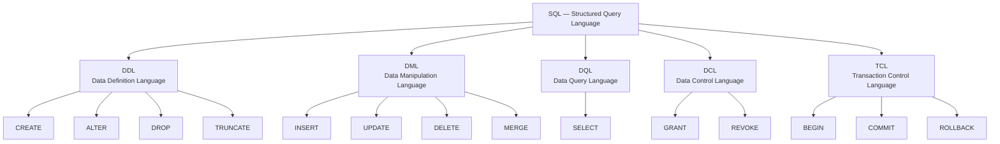

# Introduction to SQL

## What You Will Learn

By the end of this chapter you will be able to explain what SQL is, understand its history and structure, set up a local database environment, and write your first simple statements. No prior database experience required.

---

## What Is SQL?

**SQL** stands for **Structured Query Language**. It is the universal language used to communicate with *relational databases* — software systems that store data in structured tables made of rows and columns (think of a well-organised spreadsheet, but far more powerful).

SQL lets you:

- **Create** the structure (tables, schemas) that holds your data
- **Insert, update, and delete** data within those structures
- **Query** data — ask questions like "give me all users who signed up in the last 30 days"
- **Control access** — decide who can read or change what
- **Manage transactions** — guarantee that a series of operations either fully succeeds or fully rolls back

Almost every application that stores persistent data touches a relational database and, by extension, touches SQL. Learning SQL is one of the highest-return skills a developer can acquire.

---

## SQL Is Declarative

Most programming languages are **imperative** — you describe *how* to accomplish a task step by step:

```python
# Imperative: tell the computer HOW
result = []
for user in users:
    if user.age >= 18:
        result.append(user)
```

SQL is **declarative** — you describe *what* you want and let the database engine figure out the most efficient way to retrieve it:

```sql
-- Declarative: tell the database WHAT you want
SELECT * FROM users WHERE age >= 18;
```

The database's **query planner/optimiser** decides which indexes to use, in what order to scan tables, whether to parallelise work, and so on. You focus on the result, not the algorithm.

---

## A Brief History

| Year | Event |
|------|-------|
| 1970 | Edgar F. Codd (IBM) publishes the relational model paper |
| 1974 | IBM researchers develop SEQUEL (Structured English Query Language) |
| 1979 | SEQUEL renamed SQL; first commercial product: Oracle v2 |
| 1986 | ANSI publishes the first SQL standard (SQL-86) |
| 1992 | SQL-92 — the foundation most databases still reference |
| 1999 | SQL:1999 adds recursive queries, triggers, and more |
| 2003+ | SQL:2003, SQL:2008, SQL:2011, SQL:2016, SQL:2023 — ongoing evolution |

SQL has outlasted dozens of "SQL killers." It is over 50 years old and still the dominant data query language in the world.

---

## SQL Sub-languages

SQL is divided into five sub-languages, each serving a distinct purpose.



### DDL — Data Definition Language

DDL statements **define or change the structure** of a database. They operate on objects like tables, indexes, and schemas.

| Statement | Purpose |
|-----------|---------|
| `CREATE` | Create a new table, index, view, schema, etc. |
| `ALTER` | Modify an existing object (add a column, rename, etc.) |
| `DROP` | Permanently delete an object and all its data |
| `TRUNCATE` | Remove all rows from a table (faster than DELETE; no row-by-row logging) |

```sql
CREATE TABLE employees (
    id   INT PRIMARY KEY,
    name VARCHAR(100),
    age  INT
);
```

### DML — Data Manipulation Language

DML statements **work with the data inside** tables.

| Statement | Purpose |
|-----------|---------|
| `INSERT` | Add new rows |
| `UPDATE` | Modify existing rows |
| `DELETE` | Remove rows |
| `MERGE` | Upsert — insert or update depending on whether a row exists |

```sql
INSERT INTO employees (id, name, age) VALUES (1, 'Alice', 30);
UPDATE employees SET age = 31 WHERE id = 1;
DELETE FROM employees WHERE id = 1;
```

### DQL — Data Query Language

DQL has exactly one statement — the most important in SQL:

```sql
SELECT name, age FROM employees WHERE age > 25 ORDER BY name;
```

`SELECT` retrieves data. It is the statement you will write most often and the one with the richest set of clauses (`WHERE`, `JOIN`, `GROUP BY`, `HAVING`, `ORDER BY`, `LIMIT`, etc.).

### DCL — Data Control Language

DCL controls **who can do what** in the database.

```sql
GRANT SELECT, INSERT ON employees TO analyst_role;
REVOKE INSERT ON employees FROM analyst_role;
```

### TCL — Transaction Control Language

TCL manages **transactions** — groups of statements that must all succeed or all fail together.

```sql
BEGIN;
    UPDATE accounts SET balance = balance - 500 WHERE id = 1;
    UPDATE accounts SET balance = balance + 500 WHERE id = 2;
COMMIT; -- Make it permanent

-- If something goes wrong:
ROLLBACK; -- Undo everything back to BEGIN
```

---

## Setting Up a Local Database

### Option 1 — SQLite (Zero Setup, Great for Learning)

SQLite is a file-based database. There is no server to install or configure.

- Download the CLI from [sqlite.org/download.html](https://www.sqlite.org/download.html), or
- Use it through DB Browser for SQLite ([sqlitebrowser.org](https://sqlitebrowser.org))

```bash
# macOS / Linux — often pre-installed
sqlite3 mylearning.db

# Windows — run the downloaded sqlite3.exe
sqlite3.exe mylearning.db
```

SQLite is perfect for learning SQL syntax. Its main limitation is that it lacks some advanced features (e.g., full `ALTER TABLE` support, stored procedures) that you will encounter in production databases.

### Option 2 — PostgreSQL (Recommended for Real-World Skills)

PostgreSQL is free, open-source, standards-compliant, and used extensively in the industry. Learning on PostgreSQL means your skills transfer almost everywhere.

**Install from the official site:**

Download the installer from [postgresql.org/download](https://www.postgresql.org/download/) (available for Windows, macOS, Linux). The installer includes pgAdmin, a GUI tool.

**Spin it up instantly with Docker (recommended for developers):**

```bash
docker run -d \
  --name pg-learn \
  -e POSTGRES_PASSWORD=secret \
  -e POSTGRES_USER=admin \
  -e POSTGRES_DB=learningdb \
  -p 5432:5432 \
  postgres:16
```

Then connect with any PostgreSQL client:

```bash
# Using the psql CLI (inside the container)
docker exec -it pg-learn psql -U admin -d learningdb

# Or connect from your host machine
psql -h localhost -p 5432 -U admin -d learningdb
```

### Option 3 — MySQL

MySQL is widely used, especially in PHP / WordPress / legacy stacks.

- **MAMP** (macOS): [mamp.info](https://www.mamp.info)
- **XAMPP** (Windows / Linux / macOS): [apachefriends.org](https://www.apachefriends.org)
- **Docker:**

```bash
docker run -d \
  --name mysql-learn \
  -e MYSQL_ROOT_PASSWORD=secret \
  -e MYSQL_DATABASE=learningdb \
  -p 3306:3306 \
  mysql:8
```

### Which Should You Choose?

| Goal | Recommended |
|------|-------------|
| Quickest possible start, no install | SQLite |
| Real-world skills, industry standard | PostgreSQL |
| Working with legacy PHP / WordPress | MySQL |
| Microsoft stack (.NET, Azure) | SQL Server (Developer Edition — free) |

---

## GUI Tools

The command line is powerful but a GUI makes it much easier to explore data visually, especially when learning.

| Tool | Databases | Cost | Notes |
|------|-----------|------|-------|
| **DBeaver Community** | All major databases | Free | Best all-rounder; recommended starting point |
| **TablePlus** | All major databases | Free tier / Paid | Clean macOS/Windows UI |
| **pgAdmin 4** | PostgreSQL | Free | Official PostgreSQL GUI; powerful but verbose |
| **MySQL Workbench** | MySQL | Free | Official MySQL GUI |
| **DB Browser for SQLite** | SQLite | Free | Simple, purpose-built for SQLite |

**Recommended for beginners:** DBeaver Community Edition — one tool that works with every database you are likely to encounter.

---

## SQL Syntax Basics

### Case Insensitivity for Keywords

SQL keywords are case-insensitive. All of the following are identical:

```sql
SELECT name FROM users;
select name from users;
Select Name From Users;
```

**Convention:** write keywords in `UPPERCASE` and identifiers (table names, column names) in `lowercase_snake_case`. This makes queries easier to scan at a glance.

```sql
-- Good convention
SELECT first_name, last_name FROM employees WHERE department_id = 5;
```

### Comments

```sql
-- This is a single-line comment (works in all databases)

/*
   This is a
   multi-line comment
*/

SELECT id, name -- inline comment at end of a line
FROM employees;
```

### Semicolons

A semicolon `;` marks the end of a SQL statement. In interactive clients (psql, MySQL CLI), it tells the client to send and execute the statement. When running SQL from application code, the driver usually handles statement termination automatically, but including semicolons is still good practice.

```sql
SELECT * FROM users;   -- first statement
SELECT * FROM orders;  -- second statement
```

---

## Database Differences to Know Early

Most SQL syntax is portable across databases. However, a few things differ. Here are the most common early-learning gotchas:

### String Data Types

| Feature | PostgreSQL | MySQL | SQL Server | Oracle |
|---------|-----------|-------|------------|--------|
| Variable-length text | `VARCHAR(n)` or `TEXT` | `VARCHAR(n)` or `TEXT` | `VARCHAR(n)` or `NVARCHAR(n)` | `VARCHAR2(n)` |
| Unlimited text | `TEXT` | `LONGTEXT` | `VARCHAR(MAX)` | `CLOB` |

### Auto-incrementing Primary Keys

```sql
-- PostgreSQL (modern, recommended)
CREATE TABLE employees (
    id BIGINT GENERATED ALWAYS AS IDENTITY PRIMARY KEY
);

-- PostgreSQL (older style, still very common)
CREATE TABLE employees (
    id SERIAL PRIMARY KEY
);

-- MySQL
CREATE TABLE employees (
    id INT AUTO_INCREMENT PRIMARY KEY
);

-- SQL Server
CREATE TABLE employees (
    id INT IDENTITY(1,1) PRIMARY KEY
);

-- Oracle
CREATE TABLE employees (
    id NUMBER GENERATED ALWAYS AS IDENTITY PRIMARY KEY
);
```

### Limiting Query Results

```sql
-- PostgreSQL / MySQL / SQLite
SELECT * FROM employees LIMIT 10;

-- SQL Server
SELECT TOP 10 * FROM employees;

-- Oracle (12c+)
SELECT * FROM employees FETCH FIRST 10 ROWS ONLY;
```

---

## Key Takeaways

- **SQL** is the standard language for communicating with relational databases. It is declarative — you describe the result you want, not the steps to get there.
- SQL was invented at IBM in the 1970s and has been standardised by ANSI/ISO since 1986. It is one of the most durable technologies in computing.
- SQL is divided into five sub-languages: **DDL** (structure), **DML** (data changes), **DQL** (queries), **DCL** (access control), and **TCL** (transactions).
- For learning, start with **SQLite** (zero setup) or spin up **PostgreSQL** via Docker (closest to real-world usage).
- Use **DBeaver Community Edition** as your GUI — it works with every major database for free.
- SQL keywords are **case-insensitive** but convention is `UPPERCASE`. Statements end with a **semicolon**.
- Core syntax is highly portable. Key differences between databases appear in data types, auto-increment syntax, and result limiting.

---

## Quiz

Test your understanding before moving on.

**1. SQL is described as a declarative language. What does this mean in practice?**

a) You must write an algorithm explaining how the database should find the data  
b) You describe what data you want and the database figures out how to retrieve it  
c) SQL programs are run line by line, top to bottom  
d) Every SQL query is compiled to machine code before execution  

**2. Which SQL sub-language would you use to remove all rows from a table without deleting the table itself?**

a) DCL — `REVOKE`  
b) TCL — `ROLLBACK`  
c) DDL — `TRUNCATE`  
d) DML — `DELETE` or DDL — `TRUNCATE` (both work, but `TRUNCATE` is faster)  

**3. You are writing a SQL statement and accidentally type `select` in lowercase instead of `SELECT`. What happens?**

a) The database throws a syntax error  
b) The statement runs correctly — SQL keywords are case-insensitive  
c) The database treats it as an identifier (table name), not a keyword  
d) Behaviour depends on the operating system  

---

> **Answers:** 1-b, 2-d, 3-b

---

## What Is Next?

In the next chapter you will create your first real table, insert data into it, and run your first `SELECT` queries — including filtering with `WHERE` and sorting with `ORDER BY`.
