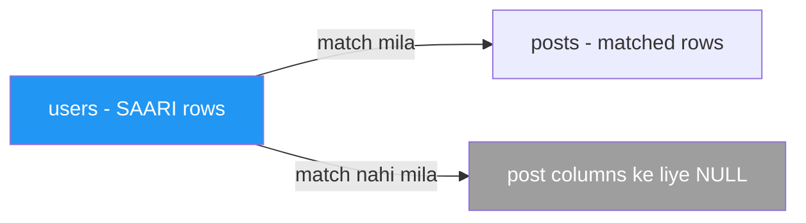
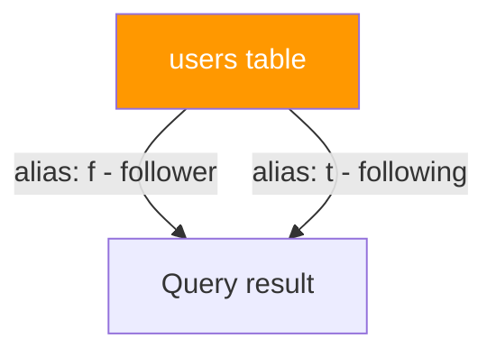

# 🔗 JOINs — Tables Ko Jodna

> **Chapter 6 of SQL From Scratch**
> Prerequisites: Chapter 4 (SELECT basics), Chapter 5 (Filtering with WHERE)

---

## 🧭 JOINs Kyun Zaruri Hain?

Socho ek e-commerce app bana rahe ho — Flipkart jaisa. Tum saara data ek hi giant spreadsheet mein nahi rakhte. Ek `users` table hai jisme user ka info hai, ek `orders` table hai jisme orders hain, ek `follows` table hai jisme pata chalta hai kaun kisko follow karta hai. Yeh design isliye use hota hai kyunki data duplicate nahi hota aur clean rehta hai — lekin real sawaalon ke jawab dene ke liye ("har post uske author ke naam ke saath dikhao"), tumhe yeh tables ek saath **jodni** padti hain query time pe. Yehi kaam JOIN karta hai.

JOIN ko aise socho: "Table A ke har row ke liye, table B mein related rows dhoondo aur unhe ek result row mein jod do." Bilkul waise jaise Swiggy tumhara order (`orders` table) aur restaurant ka naam (`restaurants` table) ek saath jod ke tumhe ek clean bill dikhata hai.

---

## 🗂️ Sample Schema (Social Network)

Is poore chapter ke examples isi simple social network schema pe based hain. CREATE aur INSERT statements ek baar run kar lo, phir saath saath follow karte raho.

```sql
CREATE TABLE users (
    user_id   INT PRIMARY KEY,
    username  VARCHAR(50),
    email     VARCHAR(100)
);

CREATE TABLE posts (
    post_id    INT PRIMARY KEY,
    user_id    INT,           -- FK → users.user_id
    title      VARCHAR(200),
    created_at DATE
);

CREATE TABLE follows (
    follower_id  INT,          -- FK → users.user_id
    following_id INT,          -- FK → users.user_id
    PRIMARY KEY (follower_id, following_id)
);

INSERT INTO users VALUES
  (1, 'alice',   'alice@example.com'),
  (2, 'bob',     'bob@example.com'),
  (3, 'carol',   'carol@example.com'),
  (4, 'dan',     'dan@example.com');   -- dan ne kabhi post nahi kiya

INSERT INTO posts VALUES
  (101, 1, 'Alice first post',  '2024-01-10'),
  (102, 1, 'Alice second post', '2024-02-15'),
  (103, 2, 'Bob intro post',    '2024-03-01'),
  (104, 5, 'Orphan post',       '2024-04-01');  -- user_id 5 exist hi nahi karta

INSERT INTO follows VALUES
  (1, 2),   -- alice follows bob
  (1, 3),   -- alice follows carol
  (2, 1),   -- bob follows alice
  (3, 1);   -- carol follows alice
```

---

## 1️⃣ INNER JOIN — Dono Tables Mein Match

### Kya hota hai?

INNER JOIN (jise aksar sirf `JOIN` bhi likha jata hai) sirf woh rows return karta hai jinka match join condition ke through **dono** tables mein milta hai. Jis row ka kisi bhi side match nahi milta, woh chupchap drop ho jaati hai.

Socho Zomato pe order tabhi dikhega jab restaurant bhi list mein ho aur order bhi place hua ho — dono taraf se match zaruri hai.

### ASCII Venn Diagram

```
  users          posts
 ┌──────┐       ┌──────┐
 │      │███████│      │
 │      │███████│      │
 └──────┘       └──────┘
         ↑
   Sirf overlap wala part
```

### Mermaid Diagram


### Syntax

```sql
SELECT columns
FROM   table_a
JOIN   table_b ON table_a.key = table_b.key;

-- INNER JOIN bhi bilkul same hai — INNER keyword optional hai
SELECT columns
FROM   table_a
INNER JOIN table_b ON table_a.key = table_b.key;
```

Yeh syntax PostgreSQL, MySQL, SQL Server, aur Oracle — sabme same hai.

### Real-World Example — Saare posts unke authors ke saath

```sql
SELECT
    u.username,
    p.post_id,
    p.title,
    p.created_at
FROM   users u
JOIN   posts p ON u.user_id = p.user_id;
```

**Result:**

| username | post_id | title              | created_at |
|----------|---------|--------------------|------------|
| alice    | 101     | Alice first post   | 2024-01-10 |
| alice    | 102     | Alice second post  | 2024-02-15 |
| bob      | 103     | Bob intro post     | 2024-03-01 |

Notice karo kya **gayab** hai: `dan` (uska koi post nahi hai) aur orphan post 104 (jiska koi matching user nahi hai). INNER JOIN ne dono drop kar diye — kisi bhi side match nahi tha.

---

## 2️⃣ LEFT JOIN — Left Table Ki Saari Rows

### Kya hota hai?

LEFT JOIN (jise LEFT OUTER JOIN bhi kehte hain) **left table ki har row** return karta hai, plus right table se jo bhi matching rows milein. Jab right side pe koi match nahi milta, toh right-side columns `NULL` se fill ho jaate hain.

Yeh bilkul waisa hai jaise Swiggy tumhe tumhare saare past orders dikhata hai — chahe kisi order ka rating diya ho ya nahi. Rating column empty (NULL) reh sakta hai, lekin order toh dikhega hi.

### ASCII Venn Diagram

```
  users          posts
 ┌──────┐       ┌──────┐
 │██████│███████│      │
 │██████│███████│      │
 └──────┘       └──────┘
  ↑       ↑
  Saara   Sirf matching
  left
```

### Mermaid Diagram



### Syntax

```sql
SELECT columns
FROM   table_a
LEFT JOIN table_b ON table_a.key = table_b.key;

-- LEFT OUTER JOIN bhi same cheez hai
LEFT OUTER JOIN table_b ON table_a.key = table_b.key;
```

Syntax sab major databases mein identical hai.

### Real-World Example — Saare users, jinke posts nahi hain unko bhi shaamil karo

```sql
SELECT
    u.username,
    p.post_id,
    p.title
FROM   users u
LEFT JOIN posts p ON u.user_id = p.user_id;
```

**Result:**

| username | post_id | title              |
|----------|---------|--------------------|
| alice    | 101     | Alice first post   |
| alice    | 102     | Alice second post  |
| bob      | 103     | Bob intro post     |
| carol    | NULL    | NULL               |
| dan      | NULL    | NULL               |

`carol` aur `dan` NULL post columns ke saath dikh rahe hain — unke koi posts nahi hain, lekin LEFT JOIN unhe rakhta hai.

---

## 3️⃣ RIGHT JOIN — Right Table Ki Saari Rows

### Kya hota hai?

RIGHT JOIN, LEFT JOIN ka mirror image hai. **Right** table ki har row return hoti hai, plus left se matching rows. Left side pe match na hone par left-side columns NULL ho jaate hain.

Practically, zyadatar developers LEFT JOIN hi prefer karte hain aur bas table ka order swap kar dete hain. RIGHT JOIN completeness ke liye exist karta hai, aur un cases ke liye jaha query structure ki wajah se yeh zyada natural lagta hai.

### ASCII Venn Diagram

```
  users          posts
 ┌──────┐       ┌──────┐
 │      │███████│██████│
 │      │███████│██████│
 └──────┘       └──────┘
          ↑       ↑
      Matching   Saara right
```

### Syntax

```sql
SELECT columns
FROM   table_a
RIGHT JOIN table_b ON table_a.key = table_b.key;
```

### Real-World Example — Saare posts, orphan posts sameth

```sql
SELECT
    u.username,
    p.post_id,
    p.title
FROM   users u
RIGHT JOIN posts p ON u.user_id = p.user_id;
```

**Result:**

| username | post_id | title              |
|----------|---------|--------------------|
| alice    | 101     | Alice first post   |
| alice    | 102     | Alice second post  |
| bob      | 103     | Bob intro post     |
| NULL     | 104     | Orphan post        |

Post 104 ka koi matching user nahi hai, isliye `username` NULL hai.

> [!tip]
> Upar wali query bilkul waisi hi hai jaise `posts` ko left pe rakh ke LEFT JOIN karo: `FROM posts p LEFT JOIN users u ON ...`. Jo bhi zyada natural lage, woh use karo.

---

## 4️⃣ FULL OUTER JOIN — Dono Tables Ki Saari Rows

### Kya hota hai?

FULL OUTER JOIN, LEFT aur RIGHT JOIN dono ko combine kar deta hai. Yeh **dono** tables ki har row return karta hai. Jaha match milta hai wahan columns fill ho jaate hain; jaha match nahi milta wahan doosri taraf ke columns NULL ho jaate hain.

### ASCII Venn Diagram

```
  users          posts
 ┌──────┐       ┌──────┐
 │██████│███████│██████│
 │██████│███████│██████│
 └──────┘       └──────┘
  ↑               ↑
  Saara left    Saara right
```

### Cross-Database Syntax

> [!warning]
> MySQL FULL OUTER JOIN natively support nahi karta. UNION workaround use karo.

```sql
-- PostgreSQL, SQL Server, Oracle
SELECT u.username, p.post_id, p.title
FROM   users u
FULL OUTER JOIN posts p ON u.user_id = p.user_id;
```

```sql
-- MySQL (UNION workaround)
SELECT u.username, p.post_id, p.title
FROM   users u
LEFT JOIN posts p ON u.user_id = p.user_id

UNION

SELECT u.username, p.post_id, p.title
FROM   users u
RIGHT JOIN posts p ON u.user_id = p.user_id;
```

`UNION` duplicate rows automatically hata deta hai. Agar tumhe duplicates rakhne hain (kabhi kabhi zarurat padti hai), toh `UNION ALL` use karo.

### Result

| username | post_id | title              |
|----------|---------|--------------------|
| alice    | 101     | Alice first post   |
| alice    | 102     | Alice second post  |
| bob      | 103     | Bob intro post     |
| carol    | NULL    | NULL               |
| dan      | NULL    | NULL               |
| NULL     | 104     | Orphan post        |

Har user aur har post exactly ek baar dikhta hai. Jinka match nahi mila unke missing side pe NULLs hain.

---

## 5️⃣ CROSS JOIN — Har Combination (Cartesian Product)

### Kya hota hai?

CROSS JOIN Cartesian product produce karta hai: left table ki har row, right table ki har row ke saath pair ho jaati hai. Agar table A mein 4 rows hain aur table B mein 3 rows, toh result mein 4 × 3 = 12 rows aayengi. Isme koi ON condition nahi hoti.

### Syntax

```sql
SELECT a.col, b.col
FROM   table_a a
CROSS JOIN table_b b;
```

Syntax sab major databases mein identical hai.

### Yeh kab useful hai?

- Saare possible combinations generate karne ke liye (jaise saare sizes × saare colours ek product catalogue ke liye — T-shirt ki tarah Myntra pe)
- Test data matrix banane ke liye
- Calendar scaffold banane ke liye (saari dates × saare time slots)

### Example — Saare possible user–post pairings (recommendation engine seed ke liye)

```sql
SELECT u.username, p.title
FROM   users u
CROSS JOIN posts p;
```

Yeh 4 users × 4 posts = 16 rows produce karega, har user-post combination ke liye, chahe authorship kuch bhi ho.

> [!warning]
> Bade tables pe CROSS JOIN billions rows produce kar sakta hai. Explore karte waqt hamesha LIMIT ya WHERE laga ke rakho — nahi toh production database hi hang ho jayega.

---

## 6️⃣ SELF JOIN — Table Khud Se Judti Hai

### Kya hota hai?

SELF JOIN mein ek table khud se hi join hoti hai. Tum same table ko do alag aliases dete ho aur unhe do separate tables ki tarah treat karte ho. Classic use case hai hierarchical relationship jo ek hi table mein stored hai — jaise employees aur unke managers, ya (hamare social network mein) users jo doosre users ko follow kar rahe hain.

### Syntax

```sql
SELECT a.col AS alias_a, b.col AS alias_b
FROM   my_table a
JOIN   my_table b ON a.fk = b.pk;
```

### Real-World Example — Followers, jinko woh follow karte hain unke naam ke saath

```sql
SELECT
    f.username  AS follower,
    t.username  AS following
FROM   follows fl
JOIN   users f ON fl.follower_id  = f.user_id
JOIN   users t ON fl.following_id = t.user_id;
```

**Result:**

| follower | following |
|----------|-----------|
| alice    | bob       |
| alice    | carol     |
| bob      | alice     |
| carol    | alice     |

`users` table **do baar** join hui hai — ek baar alias `f` (follower) ke saath, aur ek baar `t` (jise follow kiya ja raha hai) ke saath.

### Mermaid Diagram



---

## ⚙️ Advanced JOIN Topics

### 3+ Tables Join Karna

JOINs ko sequentially chain karo. Database result set ko ek-ek karke, left se right, build karta hai.

```sql
-- posts → author name → follower count, ek hi query mein
SELECT
    p.title,
    u.username  AS author,
    COUNT(fl.follower_id) AS author_followers
FROM   posts p
JOIN   users u  ON p.user_id     = u.user_id
LEFT JOIN follows fl ON fl.following_id = u.user_id
GROUP BY p.post_id, p.title, u.username;
```

Har additional JOIN pichle JOIN ke baad append hoti hai. Tum ek hi query mein JOIN types mix bhi kar sakte ho (INNER, LEFT, waghera).

---

### ON vs WHERE — Sabse Important Difference

`ON` aur `WHERE` dono rows filter karte hain, lekin query lifecycle mein alag alag point pe kaam karte hain.

| Clause | Kab chalta hai | Outer joins pe effect |
|--------|-------------|----------------------|
| `ON`   | JOIN ke dauran — decide karta hai kaunsi rows match hongi | LEFT/RIGHT JOIN mein unmatched rows (NULLs ke saath) rakhta hai |
| `WHERE`| JOIN ke baad — already-joined result set ko filter karta hai | NULL rows eliminate kar deta hai, effectively LEFT JOIN ko INNER JOIN bana deta hai |

**Example — `ON` pe filter (saare users rakhta hai):**

```sql
SELECT u.username, p.title
FROM   users u
LEFT JOIN posts p ON u.user_id = p.user_id AND p.created_at > '2024-02-01';
```

Jin users ke qualifying posts nahi hain, woh bhi dikhenge (NULL title ke saath).

**Example — `WHERE` pe filter (post-less users drop ho jaate hain):**

```sql
SELECT u.username, p.title
FROM   users u
LEFT JOIN posts p ON u.user_id = p.user_id
WHERE  p.created_at > '2024-02-01';
```

Ab jin users ke us period mein posts nahi hain, woh chupchap drop ho jaate hain — LEFT JOIN effectively INNER JOIN ban gaya. Yeh ek common, hard-to-spot bug hai — bahut developers is trap mein aa jaate hain.

---

### Un Rows Ko Dhoondna Jo Match NAHI Karti (Anti-JOIN)

LEFT JOIN use karo aur right side pe `NULL` ke liye filter lagao. Yeh standard SQL pattern hai table A mein woh rows dhoondne ka jinka table B mein koi matching row nahi hai.

```sql
-- Woh users dhoondo jinhone KABHI post nahi kiya
SELECT u.username
FROM   users u
LEFT JOIN posts p ON u.user_id = p.user_id
WHERE  p.post_id IS NULL;
```

**Result:**

| username |
|----------|
| carol    |
| dan      |

Step by step: LEFT JOIN saare users le aata hai; jinke posts nahi hain unke liye `post_id` column NULL hota hai; WHERE sirf un NULL rows ko rakhta hai.

---

### USING Clause — Jab Column Names Match Karte Hain

Jab join column ka naam **dono tables mein same** hai, toh tum poora `ON table_a.col = table_b.col` likhne ke bajaye `USING` shorthand use kar sakte ho.

```sql
-- Standard ON syntax
SELECT u.username, p.title
FROM   users u
JOIN   posts p ON u.user_id = p.user_id;

-- USING ke saath equivalent (column name dono side same hai)
SELECT u.username, p.title
FROM   users u
JOIN   posts p USING (user_id);
```

`USING`, `SELECT *` output mein join column ko de-duplicate bhi kar deta hai — woh do baar ke bajaye sirf ek baar dikhta hai. Yeh PostgreSQL, MySQL, aur Oracle mein kaam karta hai. SQL Server `USING` clause support **nahi** karta — waha `ON` use karo.

| Database   | USING support |
|------------|--------------|
| PostgreSQL | Yes          |
| MySQL      | Yes          |
| Oracle     | Yes          |
| SQL Server | No — ON use karo |

---

### NATURAL JOIN — Production Mein Avoid Karo

`NATURAL JOIN` automatically dono tables mein **same naam wale saare columns** pe join kar deta hai. `ON` ya `USING` ki zarurat nahi hoti.

```sql
-- NATURAL JOIN (recommend nahi karte)
SELECT * FROM users NATURAL JOIN posts;
-- Har common column name pe join hota hai — abhi sirf user_id hai, lekin
-- future mein agar dono tables mein 'updated_at' column add ho jaaye toh break ho sakta hai
```

**Kyun avoid karein:**

- Fragile hai: kisi bhi table mein same-naam wala column add karne se join condition chupchap change ho jaati hai
- Padhne mein mushkil: join condition query mein invisible hota hai
- Sab databases mein consistently support nahi hota (SQL Server support nahi karta)

**Rule:** Hamesha explicit `ON` ya `USING` prefer karo taaki join condition clear aur stable rahe.

---

### JOIN Performance — FK Columns Pe Indexes Kyun Zaruri Hain

Jab database JOIN execute karta hai, usse driving side ki har row ke liye matching rows dhoondni padti hain. Foreign key column pe index na ho toh yeh har lookup ke liye **full table scan** karta hai — har row padhta hai. Index ho toh yeh fast **index seek** karta hai.

Yeh bilkul waisa hai jaise IRCTC mein tumhe PNR se booking dhoondni ho — agar table sorted/indexed hai toh seedha jump kar jaata hai, warna har record check karna padta hai.

```sql
-- FK column pe index add karo
CREATE INDEX idx_posts_user_id ON posts(user_id);

-- Optimizer ab is index ko use kar sakta hai jab yeh execute ho:
SELECT * FROM users JOIN posts ON users.user_id = posts.user_id;
```

**Rule of thumb:** Har foreign key column ko index karo. Zyadatar databases yeh index automatically create **nahi** karte (PostgreSQL aur SQL Server referenced PK ke liye index banate hain, lekin child table ke FK column ke liye nahi).

Tum EXPLAIN se check kar sakte ho ki tumhari query index use kar rahi hai ya nahi:

```sql
-- PostgreSQL / MySQL
EXPLAIN SELECT u.username, p.title
FROM users u JOIN posts p ON u.user_id = p.user_id;

-- SQL Server
SET STATISTICS IO ON;
SELECT u.username, p.title
FROM users u JOIN posts p ON u.user_id = p.user_id;
```

Output mein "Index Scan" ya "Index Seek" dhoondo. Bade table pe "Seq Scan" ya "Table Scan" dikhna ek warning sign hai.

---

## 🌐 Real-World Query Collection

### Query 1 — Saare posts unke authors ke saath (INNER JOIN)

```sql
SELECT
    p.post_id,
    p.title,
    p.created_at,
    u.username  AS author,
    u.email     AS author_email
FROM   posts p
JOIN   users u ON p.user_id = u.user_id
ORDER BY p.created_at DESC;
```

### Query 2 — Saare users, jinke posts nahi hain unko bhi shaamil karo (LEFT JOIN)

```sql
SELECT
    u.user_id,
    u.username,
    COUNT(p.post_id)  AS post_count
FROM   users u
LEFT JOIN posts p ON u.user_id = p.user_id
GROUP BY u.user_id, u.username
ORDER BY post_count DESC;
```

### Query 3 — Woh users dhoondo jinhone kabhi post nahi kiya (LEFT JOIN + IS NULL)

```sql
SELECT u.username, u.email
FROM   users u
LEFT JOIN posts p ON u.user_id = p.user_id
WHERE  p.post_id IS NULL;
```

### Query 4 — Followers unki following info ke saath (SELF JOIN follows table pe)

```sql
SELECT
    follower.username   AS follower_name,
    follower.email      AS follower_email,
    following.username  AS following_name,
    following.email     AS following_email
FROM   follows fl
JOIN   users follower  ON fl.follower_id  = follower.user_id
JOIN   users following ON fl.following_id = following.user_id
ORDER BY follower.username;
```

### Query 5 — Mutual followers (jo ek dusre ko follow karte hain)

```sql
SELECT
    a.username AS user_a,
    b.username AS user_b
FROM   follows f1
JOIN   follows f2 ON f1.follower_id  = f2.following_id
                  AND f1.following_id = f2.follower_id
JOIN   users a ON f1.follower_id  = a.user_id
JOIN   users b ON f1.following_id = b.user_id
WHERE  a.user_id < b.user_id;  -- duplicate pairs avoid karne ke liye (alice-bob AUR bob-alice)
```

---

## 📊 JOIN Type Quick Reference

| JOIN Type       | Kaunsi Rows Return Hoti Hain | Left NULLs | Right NULLs | Common Use |
|-----------------|---------------|-----------|------------|------------|
| INNER JOIN      | Sirf matched  | No        | No         | Standard lookups |
| LEFT JOIN       | Saara left + matched right | No | Yes | Related data na hone par bhi rows include karna |
| RIGHT JOIN      | Saara right + matched left | Yes | No | LEFT JOIN ka mirror |
| FULL OUTER JOIN | Dono se saara | Yes       | Yes        | Do datasets ko reconcile karna |
| CROSS JOIN      | Saare combinations | No    | No         | Permutations generate karna |
| SELF JOIN       | Type pe depend karta hai | Depends | Depends   | Hierarchies, mutual relationships |

---

## 🔑 Key Takeaways

1. **INNER JOIN** default hai — use karo jab tumhe sirf woh rows chahiye jo dono tables mein exist karti hain.
2. **LEFT JOIN** workhorse hai — use karo jab primary (left) table ki saari rows preserve karni ho aur related data optionally la ke jodna ho.
3. **LEFT JOIN + IS NULL** anti-joins ka standard pattern hai (yeh dhoondna ki right table mein kya NAHI hai).
4. **FULL OUTER JOIN** MySQL mein support nahi hota — `LEFT JOIN UNION RIGHT JOIN` se emulate karo.
5. **ON join ke dauran filter karta hai; WHERE join ke baad filter karta hai** — inhe mix karne se outer joins chupchap inner joins ban jaate hain.
6. **CROSS JOIN** Cartesian products generate karta hai — production data pe run karne se pehle hamesha expected row count double-check karo.
7. **SELF JOIN** table aliases use karta hai ek hi table mein stored hierarchies query karne ke liye.
8. **Apne FK columns ko index karo** — har JOIN ko join column pe index ka fayda milta hai.
9. **NATURAL JOIN se zyada ON ya USING prefer karo** — NATURAL JOIN fragile aur debug karne mein mushkil hota hai.
10. **USING** ek clean shorthand hai jab column names match karte hain, lekin SQL Server mein support nahi hota.

---

## ❓ Quiz

**Question 1**

Tumhare paas ek `customers` table aur ek `orders` table hai. Tum yeh run karte ho:

```sql
SELECT c.name, o.order_id
FROM   customers c
LEFT JOIN orders o ON c.customer_id = o.customer_id
WHERE  o.order_id IS NULL;
```

Yeh query kya return karti hai?

- A) Saare customers jinka kam se kam ek order hai
- B) Saare orders jinka koi matching customer nahi hai
- C) Woh customers jinhone kabhi order place nahi kiya
- D) Saare customers aur saare orders

<details>
<summary>Answer</summary>

**C** — Woh customers jinhone kabhi order place nahi kiya. LEFT JOIN saare customers preserve karta hai; `WHERE o.order_id IS NULL` sirf unhe rakhta hai jinke join se koi match nahi mila.

</details>

---

**Question 2**

Ek colleague yeh query likhta hai, iska intention hai saare users milein lekin sirf 2024 ke posts dikhein:

```sql
SELECT u.username, p.title
FROM   users u
LEFT JOIN posts p ON u.user_id = p.user_id
WHERE  p.created_at >= '2024-01-01';
```

Isme kya galat hai, aur tum ise kaise fix karoge?

<details>
<summary>Answer</summary>

`WHERE` clause JOIN ke **baad** chalta hai aur woh rows eliminate kar deta hai jaha `p.created_at` NULL hai — jisme woh saare users shaamil hain jinke koi posts nahi hain. Isse LEFT JOIN chupchap INNER JOIN ban jaata hai.

Fix: date filter ko `ON` clause mein daal do, taaki non-posting users NULL post columns ke saath bhi return hon:

```sql
SELECT u.username, p.title
FROM   users u
LEFT JOIN posts p ON u.user_id = p.user_id
                 AND p.created_at >= '2024-01-01';
```

</details>

---

**Question 3**

Tumhe MySQL mein ek FULL OUTER JOIN run karna hai. Neeche wali query (jo PostgreSQL mein kaam karti hai) ke liye equivalent query likho:

```sql
SELECT u.username, p.title
FROM   users u
FULL OUTER JOIN posts p ON u.user_id = p.user_id;
```

<details>
<summary>Answer</summary>

```sql
-- MySQL equivalent
SELECT u.username, p.title
FROM   users u
LEFT JOIN posts p ON u.user_id = p.user_id

UNION

SELECT u.username, p.title
FROM   users u
RIGHT JOIN posts p ON u.user_id = p.user_id;
```

`UNION` duplicates hata deta hai, isse FULL OUTER JOIN jaisa hi result milta hai.

</details>

---

*Next chapter: Aggregation and GROUP BY →*
