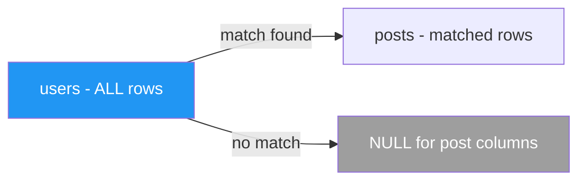
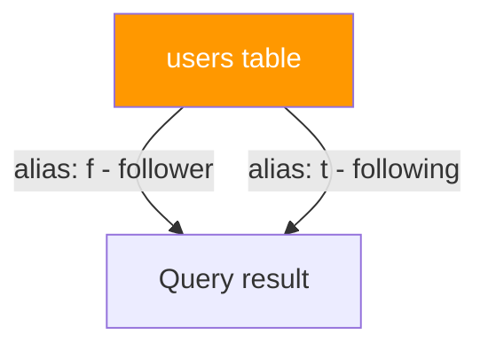

# 🔗 JOINs — Combining Tables

> **Chapter 6 of SQL From Scratch**
> Prerequisites: Chapter 4 (SELECT basics), Chapter 5 (Filtering with WHERE)

---

## 🧭 Why JOINs Exist

A relational database stores data across many focused tables instead of one giant spreadsheet. A `users` table holds user info. A `posts` table holds posts. A `follows` table tracks who follows whom. This design avoids duplication and keeps data clean — but to answer real questions ("show me every post with the author's name"), you need to **combine** those tables at query time. That is exactly what JOIN does.

Think of a JOIN as a way of saying: "For each row in table A, find the related rows in table B and stitch them together into a single result row."

---

## 🗂️ Sample Schema (Social Network)

All examples in this chapter use this simple social network schema. Run the CREATE and INSERT statements once to follow along.

```sql
CREATE TABLE users (
    user_id   INT PRIMARY KEY,
    username  VARCHAR(50),
    email     VARCHAR(100)
);

CREATE TABLE posts (
    post_id    INT PRIMARY KEY,
    user_id    INT,           -- FK → users.user_id
    title      VARCHAR(200),
    created_at DATE
);

CREATE TABLE follows (
    follower_id  INT,          -- FK → users.user_id
    following_id INT,          -- FK → users.user_id
    PRIMARY KEY (follower_id, following_id)
);

INSERT INTO users VALUES
  (1, 'alice',   'alice@example.com'),
  (2, 'bob',     'bob@example.com'),
  (3, 'carol',   'carol@example.com'),
  (4, 'dan',     'dan@example.com');   -- dan has never posted

INSERT INTO posts VALUES
  (101, 1, 'Alice first post',  '2024-01-10'),
  (102, 1, 'Alice second post', '2024-02-15'),
  (103, 2, 'Bob intro post',    '2024-03-01'),
  (104, 5, 'Orphan post',       '2024-04-01');  -- user_id 5 does not exist

INSERT INTO follows VALUES
  (1, 2),   -- alice follows bob
  (1, 3),   -- alice follows carol
  (2, 1),   -- bob follows alice
  (3, 1);   -- carol follows alice
```

---

## 1️⃣ INNER JOIN — Matches in Both Tables

### What it does

INNER JOIN (often written as just `JOIN`) returns **only** the rows where the join condition finds a match in **both** tables. Rows with no match on either side are silently dropped.

### ASCII Venn Diagram

```
  users          posts
 ┌──────┐       ┌──────┐
 │      │███████│      │
 │      │███████│      │
 └──────┘       └──────┘
         ↑
   Only the overlap
```

### Mermaid Diagram


### Syntax

```sql
SELECT columns
FROM   table_a
JOIN   table_b ON table_a.key = table_b.key;

-- INNER JOIN is identical — keyword INNER is optional
SELECT columns
FROM   table_a
INNER JOIN table_b ON table_a.key = table_b.key;
```

This syntax is identical across PostgreSQL, MySQL, SQL Server, and Oracle.

### Real-World Example — Get all posts with their authors

```sql
SELECT
    u.username,
    p.post_id,
    p.title,
    p.created_at
FROM   users u
JOIN   posts p ON u.user_id = p.user_id;
```

**Result:**

| username | post_id | title              | created_at |
|----------|---------|--------------------|------------|
| alice    | 101     | Alice first post   | 2024-01-10 |
| alice    | 102     | Alice second post  | 2024-02-15 |
| bob      | 103     | Bob intro post     | 2024-03-01 |

Notice what is **missing**: `dan` (no posts) and the orphan post 104 (no matching user). INNER JOIN dropped both — neither side had a match.

---

## 2️⃣ LEFT JOIN — All Rows from the Left Table

### What it does

LEFT JOIN (also called LEFT OUTER JOIN) returns **every row from the left table**, plus any matching rows from the right table. When there is no match on the right side, the right-side columns are filled with `NULL`.

### ASCII Venn Diagram

```
  users          posts
 ┌──────┐       ┌──────┐
 │██████│███████│      │
 │██████│███████│      │
 └──────┘       └──────┘
  ↑       ↑
  All     Matching only
  left
```

### Mermaid Diagram



### Syntax

```sql
SELECT columns
FROM   table_a
LEFT JOIN table_b ON table_a.key = table_b.key;

-- LEFT OUTER JOIN is the same thing
LEFT OUTER JOIN table_b ON table_a.key = table_b.key;
```

Syntax is identical across all major databases.

### Real-World Example — All users including those with no posts

```sql
SELECT
    u.username,
    p.post_id,
    p.title
FROM   users u
LEFT JOIN posts p ON u.user_id = p.user_id;
```

**Result:**

| username | post_id | title              |
|----------|---------|--------------------|
| alice    | 101     | Alice first post   |
| alice    | 102     | Alice second post  |
| bob      | 103     | Bob intro post     |
| carol    | NULL    | NULL               |
| dan      | NULL    | NULL               |

`carol` and `dan` appear with NULL post columns — they have no posts but the LEFT JOIN keeps them.

---

## 3️⃣ RIGHT JOIN — All Rows from the Right Table

### What it does

RIGHT JOIN is the mirror image of LEFT JOIN. Every row from the **right** table is returned, plus matching rows from the left. No match on the left side produces NULLs for left-side columns.

In practice, most developers prefer LEFT JOIN and simply swap which table is listed first. RIGHT JOIN exists for completeness and for cases where query structure makes it the more natural read.

### ASCII Venn Diagram

```
  users          posts
 ┌──────┐       ┌──────┐
 │      │███████│██████│
 │      │███████│██████│
 └──────┘       └──────┘
          ↑       ↑
      Matching   All right
```

### Syntax

```sql
SELECT columns
FROM   table_a
RIGHT JOIN table_b ON table_a.key = table_b.key;
```

### Real-World Example — All posts including orphaned ones

```sql
SELECT
    u.username,
    p.post_id,
    p.title
FROM   users u
RIGHT JOIN posts p ON u.user_id = p.user_id;
```

**Result:**

| username | post_id | title              |
|----------|---------|--------------------|
| alice    | 101     | Alice first post   |
| alice    | 102     | Alice second post  |
| bob      | 103     | Bob intro post     |
| NULL     | 104     | Orphan post        |

Post 104 has no matching user, so `username` is NULL.

> **Tip:** The query above is equivalent to listing `posts` on the left with a LEFT JOIN: `FROM posts p LEFT JOIN users u ON ...`. Pick whichever reads more naturally.

---

## 4️⃣ FULL OUTER JOIN — All Rows from Both Tables

### What it does

FULL OUTER JOIN combines LEFT and RIGHT JOIN. It returns every row from **both** tables. Where a match exists the columns are filled in; where no match exists the opposite side's columns are NULL.

### ASCII Venn Diagram

```
  users          posts
 ┌──────┐       ┌──────┐
 │██████│███████│██████│
 │██████│███████│██████│
 └──────┘       └──────┘
  ↑               ↑
  All left     All right
```

### Cross-Database Syntax

> **IMPORTANT:** MySQL does not support FULL OUTER JOIN natively. Use a UNION workaround.

```sql
-- PostgreSQL, SQL Server, Oracle
SELECT u.username, p.post_id, p.title
FROM   users u
FULL OUTER JOIN posts p ON u.user_id = p.user_id;
```

```sql
-- MySQL (workaround using UNION)
SELECT u.username, p.post_id, p.title
FROM   users u
LEFT JOIN posts p ON u.user_id = p.user_id

UNION

SELECT u.username, p.post_id, p.title
FROM   users u
RIGHT JOIN posts p ON u.user_id = p.user_id;
```

`UNION` removes duplicate rows automatically. If you want to keep duplicates (rare), use `UNION ALL`.

### Result

| username | post_id | title              |
|----------|---------|--------------------|
| alice    | 101     | Alice first post   |
| alice    | 102     | Alice second post  |
| bob      | 103     | Bob intro post     |
| carol    | NULL    | NULL               |
| dan      | NULL    | NULL               |
| NULL     | 104     | Orphan post        |

Every user and every post appears exactly once. Unmatched rows have NULLs on the missing side.

---

## 5️⃣ CROSS JOIN — Every Combination (Cartesian Product)

### What it does

CROSS JOIN produces the Cartesian product: every row in the left table paired with every row in the right table. If table A has 4 rows and table B has 3 rows, the result has 4 × 3 = 12 rows. There is no ON condition.

### Syntax

```sql
SELECT a.col, b.col
FROM   table_a a
CROSS JOIN table_b b;
```

Syntax is identical across all major databases.

### When is this useful?

- Generating all possible combinations (e.g., all sizes × all colours for a product catalogue)
- Creating a test data matrix
- Building a calendar scaffold (all dates × all time slots)

### Example — All possible user–post pairings (for a recommendation engine seed)

```sql
SELECT u.username, p.title
FROM   users u
CROSS JOIN posts p;
```

This produces 4 users × 4 posts = 16 rows, one for every user–post combination regardless of authorship.

> **Warning:** On large tables a CROSS JOIN can produce billions of rows. Always add a LIMIT or a WHERE when exploring.

---

## 6️⃣ SELF JOIN — A Table Joins Itself

### What it does

A SELF JOIN joins a table to itself. You give the same table two different aliases and treat them as if they were two separate tables. The classic use case is a hierarchical relationship stored in one table — such as employees and their managers, or (in our social network) users following other users.

### Syntax

```sql
SELECT a.col AS alias_a, b.col AS alias_b
FROM   my_table a
JOIN   my_table b ON a.fk = b.pk;
```

### Real-World Example — Followers with the names of who they follow

```sql
SELECT
    f.username  AS follower,
    t.username  AS following
FROM   follows fl
JOIN   users f ON fl.follower_id  = f.user_id
JOIN   users t ON fl.following_id = t.user_id;
```

**Result:**

| follower | following |
|----------|-----------|
| alice    | bob       |
| alice    | carol     |
| bob      | alice     |
| carol    | alice     |

The `users` table is joined **twice** — once under the alias `f` (the follower) and once under `t` (the person being followed).

### Mermaid Diagram



---

## ⚙️ Advanced JOIN Topics

### Joining 3+ Tables

Chain JOINs sequentially. The database builds up the result set one JOIN at a time, left to right.

```sql
-- posts → author name → follower count in one query
SELECT
    p.title,
    u.username  AS author,
    COUNT(fl.follower_id) AS author_followers
FROM   posts p
JOIN   users u  ON p.user_id     = u.user_id
LEFT JOIN follows fl ON fl.following_id = u.user_id
GROUP BY p.post_id, p.title, u.username;
```

Each additional JOIN is appended after the previous one. You can mix JOIN types freely (INNER, LEFT, etc.) in the same query.

---

### ON vs WHERE — The Critical Difference

Both `ON` and `WHERE` filter rows, but they operate at different points in the query lifecycle.

| Clause | When it runs | Effect on outer joins |
|--------|-------------|----------------------|
| `ON`   | During the JOIN — decides which rows are matched | Keeps unmatched rows (with NULLs) in LEFT/RIGHT JOIN |
| `WHERE`| After the JOIN — filters the already-joined result set | Eliminates NULL rows, effectively turning a LEFT JOIN into an INNER JOIN |

**Example — filter on `ON` (keeps all users):**

```sql
SELECT u.username, p.title
FROM   users u
LEFT JOIN posts p ON u.user_id = p.user_id AND p.created_at > '2024-02-01';
```

Users with no qualifying posts still appear (with NULL title).

**Example — filter on `WHERE` (drops users with no posts):**

```sql
SELECT u.username, p.title
FROM   users u
LEFT JOIN posts p ON u.user_id = p.user_id
WHERE  p.created_at > '2024-02-01';
```

Now users with no posts in that period are silently dropped — the LEFT JOIN has become an INNER JOIN in effect. This is a common, hard-to-spot bug.

---

### Finding Rows That DON'T Match (Anti-JOIN)

Use a LEFT JOIN and filter for `NULL` on the right side. This is the standard SQL pattern to find rows in table A that have no matching row in table B.

```sql
-- Find users who have NEVER posted
SELECT u.username
FROM   users u
LEFT JOIN posts p ON u.user_id = p.user_id
WHERE  p.post_id IS NULL;
```

**Result:**

| username |
|----------|
| carol    |
| dan      |

Step by step: the LEFT JOIN brings in all users; for those with no posts the `post_id` column is NULL; the WHERE keeps only those NULL rows.

---

### USING Clause — When Column Names Match

When the join column has **the same name in both tables**, you can use `USING` as a shorthand instead of writing the full `ON table_a.col = table_b.col`.

```sql
-- Standard ON syntax
SELECT u.username, p.title
FROM   users u
JOIN   posts p ON u.user_id = p.user_id;

-- Equivalent with USING (column name is identical on both sides)
SELECT u.username, p.title
FROM   users u
JOIN   posts p USING (user_id);
```

`USING` also de-duplicates the join column in `SELECT *` output — it appears only once instead of twice. This works in PostgreSQL, MySQL, and Oracle. SQL Server does **not** support the `USING` clause; use `ON` instead.

| Database   | USING support |
|------------|--------------|
| PostgreSQL | Yes          |
| MySQL      | Yes          |
| Oracle     | Yes          |
| SQL Server | No — use ON  |

---

### NATURAL JOIN — Avoid in Production

`NATURAL JOIN` automatically joins on **all columns with the same name** in both tables. No `ON` or `USING` needed.

```sql
-- NATURAL JOIN (not recommended)
SELECT * FROM users NATURAL JOIN posts;
-- Joins on every common column name — currently user_id, but could break
-- if a future migration adds an 'updated_at' column to both tables
```

**Why to avoid it:**

- Fragile: adding any same-named column to either table silently changes the join condition
- Hard to read: the join condition is invisible in the query
- Not supported consistently across databases (SQL Server does not support it)

**Rule:** Always prefer explicit `ON` or `USING` so the join condition is clear and stable.

---

### JOIN Performance — Why Indexes on FK Columns Matter

When the database executes a JOIN it needs to look up matching rows for each row on the driving side. Without an index on the foreign key column it performs a **full table scan** — reading every row — for each lookup. With an index it performs a fast **index seek**.

```sql
-- Add an index on the FK column
CREATE INDEX idx_posts_user_id ON posts(user_id);

-- The optimizer can now use this index when executing:
SELECT * FROM users JOIN posts ON users.user_id = posts.user_id;
```

**Rule of thumb:** Index every foreign key column. Most databases do NOT create this index automatically (PostgreSQL and SQL Server create an index for the referenced PK, but not the FK column in the child table).

You can inspect whether your query uses indexes using EXPLAIN:

```sql
-- PostgreSQL / MySQL
EXPLAIN SELECT u.username, p.title
FROM users u JOIN posts p ON u.user_id = p.user_id;

-- SQL Server
SET STATISTICS IO ON;
SELECT u.username, p.title
FROM users u JOIN posts p ON u.user_id = p.user_id;
```

Look for "Index Scan" or "Index Seek" in the output. "Seq Scan" or "Table Scan" on a large table is a warning sign.

---

## 🌐 Real-World Query Collection

### Query 1 — All posts with their authors (INNER JOIN)

```sql
SELECT
    p.post_id,
    p.title,
    p.created_at,
    u.username  AS author,
    u.email     AS author_email
FROM   posts p
JOIN   users u ON p.user_id = u.user_id
ORDER BY p.created_at DESC;
```

### Query 2 — All users including those with no posts (LEFT JOIN)

```sql
SELECT
    u.user_id,
    u.username,
    COUNT(p.post_id)  AS post_count
FROM   users u
LEFT JOIN posts p ON u.user_id = p.user_id
GROUP BY u.user_id, u.username
ORDER BY post_count DESC;
```

### Query 3 — Find users who have never posted (LEFT JOIN + IS NULL)

```sql
SELECT u.username, u.email
FROM   users u
LEFT JOIN posts p ON u.user_id = p.user_id
WHERE  p.post_id IS NULL;
```

### Query 4 — Followers with their following info (SELF JOIN on follows table)

```sql
SELECT
    follower.username   AS follower_name,
    follower.email      AS follower_email,
    following.username  AS following_name,
    following.email     AS following_email
FROM   follows fl
JOIN   users follower  ON fl.follower_id  = follower.user_id
JOIN   users following ON fl.following_id = following.user_id
ORDER BY follower.username;
```

### Query 5 — Mutual followers (who follows each other)

```sql
SELECT
    a.username AS user_a,
    b.username AS user_b
FROM   follows f1
JOIN   follows f2 ON f1.follower_id  = f2.following_id
                  AND f1.following_id = f2.follower_id
JOIN   users a ON f1.follower_id  = a.user_id
JOIN   users b ON f1.following_id = b.user_id
WHERE  a.user_id < b.user_id;  -- avoid duplicate pairs (alice-bob AND bob-alice)
```

---

## 📊 JOIN Type Quick Reference

| JOIN Type       | Rows Returned | Left NULLs | Right NULLs | Common Use |
|-----------------|---------------|-----------|------------|------------|
| INNER JOIN      | Matched only  | No        | No         | Standard lookups |
| LEFT JOIN       | All left + matched right | No | Yes | Include rows with no related data |
| RIGHT JOIN      | All right + matched left | Yes | No | Mirror of LEFT JOIN |
| FULL OUTER JOIN | All from both | Yes       | Yes        | Reconcile two datasets |
| CROSS JOIN      | All combinations | No    | No         | Generate permutations |
| SELF JOIN       | Depends on type | Depends | Depends   | Hierarchies, mutual relationships |

---

## 🔑 Key Takeaways

1. **INNER JOIN** is the default — use it when you only want rows that exist in both tables.
2. **LEFT JOIN** is the workhorse — use it to preserve all rows from the primary (left) table while optionally pulling in related data.
3. **LEFT JOIN + IS NULL** is the standard pattern for anti-joins (finding what does NOT exist in the right table).
4. **FULL OUTER JOIN** is not supported in MySQL — emulate it with `LEFT JOIN UNION RIGHT JOIN`.
5. **ON filters during the join; WHERE filters after** — mixing them up silently converts outer joins into inner joins.
6. **CROSS JOIN** generates Cartesian products — always double-check the expected row count before running on production data.
7. **SELF JOIN** uses table aliases to query hierarchies stored in a single table.
8. **Index your FK columns** — every JOIN you write benefits from an index on the join column.
9. **Prefer ON or USING over NATURAL JOIN** — NATURAL JOIN is fragile and hard to debug.
10. **USING** is a clean shorthand when column names match, but is not supported in SQL Server.

---

## ❓ Quiz

**Question 1**

You have a `customers` table and an `orders` table. You run:

```sql
SELECT c.name, o.order_id
FROM   customers c
LEFT JOIN orders o ON c.customer_id = o.customer_id
WHERE  o.order_id IS NULL;
```

What does this query return?

- A) All customers with at least one order
- B) All orders with no matching customer
- C) Customers who have never placed an order
- D) All customers and all orders

<details>
<summary>Answer</summary>

**C** — Customers who have never placed an order. The LEFT JOIN preserves all customers; the `WHERE o.order_id IS NULL` keeps only those whose join produced no match.

</details>

---

**Question 2**

A colleague writes this query intending to get all users but only see posts from 2024:

```sql
SELECT u.username, p.title
FROM   users u
LEFT JOIN posts p ON u.user_id = p.user_id
WHERE  p.created_at >= '2024-01-01';
```

What is wrong with it, and how would you fix it?

<details>
<summary>Answer</summary>

The `WHERE` clause runs **after** the JOIN and eliminates rows where `p.created_at` is NULL — which includes all users who have no posts. This silently turns the LEFT JOIN into an INNER JOIN.

Fix: move the date filter into the `ON` clause so that non-posting users are still returned with NULL post columns:

```sql
SELECT u.username, p.title
FROM   users u
LEFT JOIN posts p ON u.user_id = p.user_id
                 AND p.created_at >= '2024-01-01';
```

</details>

---

**Question 3**

You want to run a FULL OUTER JOIN in MySQL. Write the equivalent query for the following (which works in PostgreSQL):

```sql
SELECT u.username, p.title
FROM   users u
FULL OUTER JOIN posts p ON u.user_id = p.user_id;
```

<details>
<summary>Answer</summary>

```sql
-- MySQL equivalent
SELECT u.username, p.title
FROM   users u
LEFT JOIN posts p ON u.user_id = p.user_id

UNION

SELECT u.username, p.title
FROM   users u
RIGHT JOIN posts p ON u.user_id = p.user_id;
```

`UNION` removes duplicates, giving you the same result as FULL OUTER JOIN.

</details>

---

*Next chapter: Aggregation and GROUP BY →*
