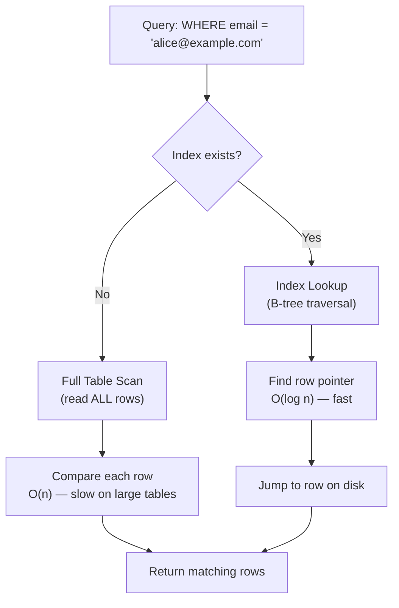

# 11 - Indexes and Query Performance

> "An index on a database table is like an index at the back of a book — instead of reading every page to find a topic, you jump straight to the right page."

---

## 📖 Table of Contents

1. [What is an Index?](#1-what-is-an-index)
2. [Visualizing Index vs Full Scan](#2-visualizing-index-vs-full-scan)
3. [EXPLAIN: Reading the Query Plan](#3-explain-reading-the-query-plan)
4. [Understanding Query Plan Output](#4-understanding-query-plan-output)
5. [Index Types](#5-index-types)
6. [Composite Index Column Order](#6-composite-index-column-order)
7. [Index-Only Scan and Covering Indexes](#7-index-only-scan-and-covering-indexes)
8. [Partial Indexes](#8-partial-indexes)
9. [Expression Indexes](#9-expression-indexes)
10. [Index Maintenance](#10-index-maintenance)
11. [The N+1 Query Problem](#11-the-n1-query-problem)
12. [Common Slow Query Patterns and Fixes](#12-common-slow-query-patterns-and-fixes)
13. [Query Optimization Checklist](#13-query-optimization-checklist)
14. [Key Takeaways](#key-takeaways)
15. [Quiz](#quiz)

---

## 1 - What is an Index?

When you run a query like `SELECT * FROM users WHERE email = 'alice@example.com'`, the database has two choices:

1. **Full Table Scan (Seq Scan)**: Read every single row in the table from disk and check whether `email` matches. Fine for 100 rows, catastrophic for 10 million rows.
2. **Index Scan**: Use a pre-built data structure that maps email values directly to the physical location of the matching rows on disk. Jump straight there.

An **index** is that pre-built data structure. You trade a small amount of extra disk space (and slightly slower writes) for dramatically faster reads.

```sql
-- Creating a basic index (syntax is the same across all major databases)
CREATE INDEX idx_users_email ON users (email);

-- Dropping an index
DROP INDEX idx_users_email;             -- PostgreSQL, MySQL, Oracle
DROP INDEX idx_users_email ON users;    -- MySQL (alternative form)
```

> **Rule of thumb**: Index columns that appear frequently in `WHERE`, `JOIN ON`, and `ORDER BY` clauses — but do not blindly index every column. Every index slows down `INSERT`, `UPDATE`, and `DELETE`.

---

## 2 - Visualizing Index vs Full Scan



The key difference is **algorithmic complexity**: a full scan is O(n) — it scales linearly with table size. A B-tree index lookup is O(log n) — it stays fast even as the table grows to millions of rows.

---

## 3 - EXPLAIN: Reading the Query Plan

Before you can optimize a query, you need to see how the database plans to execute it. Every major database has a command for this, though the syntax differs.

| Database | Basic Explain | Detailed / Actual Runtime Stats |
|---|---|---|
| PostgreSQL | `EXPLAIN SELECT ...` | `EXPLAIN ANALYZE SELECT ...` |
| MySQL | `EXPLAIN SELECT ...` | `EXPLAIN FORMAT=JSON SELECT ...` |
| SQL Server | `SET STATISTICS IO ON` (then run query) | Execution Plan button in SSMS, or `SET STATISTICS TIME ON` |
| Oracle | `EXPLAIN PLAN FOR SELECT ...;` then `SELECT * FROM DBMS_XPLAN.DISPLAY;` | `SELECT * FROM DBMS_XPLAN.DISPLAY_CURSOR` for actual plans |

### PostgreSQL

```sql
-- PostgreSQL
-- Shows estimated plan (no query is actually executed)
EXPLAIN SELECT * FROM users WHERE email = 'alice@example.com';

-- Shows estimated + actual timing (query IS executed)
EXPLAIN ANALYZE SELECT * FROM users WHERE email = 'alice@example.com';

-- Most verbose: add buffers info (cache hits vs disk reads)
EXPLAIN (ANALYZE, BUFFERS) SELECT * FROM users WHERE email = 'alice@example.com';
```

### MySQL

```sql
-- MySQL
-- Basic plan (shows key, rows, Extra columns)
EXPLAIN SELECT * FROM users WHERE email = 'alice@example.com';

-- Detailed JSON format — shows cost estimates, nested loops
EXPLAIN FORMAT=JSON SELECT * FROM users WHERE email = 'alice@example.com';
```

### SQL Server

```sql
-- SQL Server
-- Turn on I/O statistics before running your query
SET STATISTICS IO ON;
SET STATISTICS TIME ON;
SELECT * FROM users WHERE email = 'alice@example.com';

-- Or use the graphical Execution Plan in SSMS (Ctrl+M to toggle)
-- For text-based plan:
SET SHOWPLAN_TEXT ON;
GO
SELECT * FROM users WHERE email = 'alice@example.com';
GO
```

### Oracle

```sql
-- Oracle
EXPLAIN PLAN FOR
  SELECT * FROM users WHERE email = 'alice@example.com';

-- Then read the plan:
SELECT * FROM DBMS_XPLAN.DISPLAY;

-- For the actual runtime plan of a query already executed:
SELECT * FROM DBMS_XPLAN.DISPLAY_CURSOR(FORMAT => 'ALLSTATS LAST');
```

---

## 4 - Understanding Query Plan Output

PostgreSQL's output is the most human-readable for learning purposes, so we'll use it as the primary example. The concepts translate to all databases.

### Sample Output

```
EXPLAIN ANALYZE SELECT * FROM orders WHERE customer_id = 42;

-- WITHOUT an index:
Seq Scan on orders  (cost=0.00..4250.00 rows=15 width=120) (actual time=0.043..38.201 rows=15 loops=1)
  Filter: (customer_id = 42)
  Rows Removed by Filter: 99985
Planning Time: 0.3 ms
Execution Time: 38.4 ms

-- WITH an index on customer_id:
Index Scan using idx_orders_customer_id on orders  (cost=0.43..32.10 rows=15 width=120) (actual time=0.021..0.089 rows=15 loops=1)
  Index Cond: (customer_id = 42)
Planning Time: 0.4 ms
Execution Time: 0.2 ms
```

### Key Terms to Know

| Term | What it Means |
|---|---|
| `Seq Scan` | Full table scan — reading every row. Often a red flag on large tables. |
| `Index Scan` | Found rows via index, then fetched full row data from the table. |
| `Index Only Scan` | Query answered entirely from the index — never touched the table. Very fast. |
| `Bitmap Index Scan` | Used for multi-condition queries. Builds a bitmap of matching pages, then fetches. |
| `cost=X..Y` | Estimated startup cost .. total cost (in arbitrary planner units). Lower is better. |
| `rows=N` | Estimated rows returned. If this is wildly off from `actual`, your statistics may be stale. |
| `actual time=X..Y` | Real milliseconds (startup..total). Only appears with `EXPLAIN ANALYZE`. |
| `loops=N` | How many times this node ran (important in nested loops). Multiply actual time by loops. |

> **Tip**: When `rows` (estimated) is very different from `actual rows`, run `ANALYZE tablename;` to refresh statistics so the planner makes better decisions.

---

## 5 - Index Types

### B-tree (Default)

The workhorse of indexing. A balanced tree structure that keeps data sorted.

```sql
-- Created automatically when you use CREATE INDEX with no type specified
CREATE INDEX idx_users_email ON users (email);

-- Explicitly:
CREATE INDEX idx_users_email ON users USING BTREE (email);
```

**Best for**: `=`, `<`, `>`, `<=`, `>=`, `BETWEEN`, `IN`, `LIKE 'prefix%'`, `ORDER BY`, `GROUP BY`

**Not for**: `LIKE '%suffix'` (leading wildcard cannot use B-tree)

### Hash (PostgreSQL)

Stores a hash of the column value. Faster than B-tree for exact equality — but only equality.

```sql
-- PostgreSQL only
CREATE INDEX idx_users_email_hash ON users USING HASH (email);
```

**Best for**: `=` only. Cannot support range queries or sorting.

### GIN — Generalized Inverted Index (PostgreSQL)

Perfect for columns that contain multiple values (arrays, JSONB, full-text vectors). It creates an inverted map from each element to the rows containing it.

```sql
-- PostgreSQL: index a JSONB column
CREATE INDEX idx_products_tags ON products USING GIN (tags);

-- Query that benefits:
SELECT * FROM products WHERE tags @> '["electronics", "sale"]';

-- Full-text search:
CREATE INDEX idx_articles_tsv ON articles USING GIN (to_tsvector('english', body));
SELECT * FROM articles WHERE to_tsvector('english', body) @@ to_tsquery('postgresql & index');
```

**Best for**: JSONB containment (`@>`), array operators (`&&`, `@>`), full-text search (`@@`)

### GiST — Generalized Search Tree (PostgreSQL)

A flexible framework for indexing geometric, range, and other complex data types.

```sql
-- PostgreSQL: index a date range column
CREATE INDEX idx_bookings_period ON bookings USING GIST (period);

-- Query that benefits (overlapping ranges):
SELECT * FROM bookings WHERE period && '[2024-01-01, 2024-01-31]'::daterange;
```

**Best for**: Geometric types (`point`, `polygon`), range types (`daterange`, `tsrange`), nearest-neighbor searches

### FULLTEXT (MySQL)

MySQL's dedicated full-text search index, used with `MATCH ... AGAINST`.

```sql
-- MySQL
ALTER TABLE articles ADD FULLTEXT INDEX ft_articles_body (title, body);

-- Or at creation time:
CREATE FULLTEXT INDEX ft_articles_body ON articles (title, body);

-- Query:
SELECT * FROM articles
WHERE MATCH(title, body) AGAINST('query optimization' IN BOOLEAN MODE);
```

**Best for**: Natural language search, relevance ranking. Not a substitute for B-tree on regular columns.

### Columnstore (SQL Server)

Instead of storing data row-by-row, columnstore stores data column-by-column, with high compression. Designed for analytical queries that scan and aggregate large volumes of data.

```sql
-- SQL Server: Non-clustered columnstore (for read-heavy analytics)
CREATE NONCLUSTERED COLUMNSTORE INDEX idx_sales_cs
ON sales (product_id, sale_date, amount, region);

-- Clustered columnstore (entire table stored as columnstore)
CREATE CLUSTERED COLUMNSTORE INDEX idx_sales_ccs ON sales;
```

**Best for**: `GROUP BY`, `SUM`, `AVG`, `COUNT` over millions of rows. Data warehousing workloads. Not ideal for OLTP (many small updates).

### Index Type Quick Reference

| Index Type | Database | Best Use Case |
|---|---|---|
| B-tree | All | General purpose: =, <, >, BETWEEN, ORDER BY |
| Hash | PostgreSQL | Equality-only lookups (=) |
| GIN | PostgreSQL | Arrays, JSONB, full-text search |
| GiST | PostgreSQL | Geometric data, range types |
| FULLTEXT | MySQL | Natural language search |
| Columnstore | SQL Server | Analytics, aggregations on large tables |

---

## 6 - Composite Index Column Order

A composite index covers multiple columns. **The order of columns matters enormously.**

```sql
-- Composite index
CREATE INDEX idx_orders_customer_status ON orders (customer_id, status);
```

This index can be used by:
- `WHERE customer_id = 1` (leading column)
- `WHERE customer_id = 1 AND status = 'shipped'` (both columns)

This index **cannot** be used effectively by:
- `WHERE status = 'shipped'` alone (non-leading column — no index scan possible)

### The Left-Prefix Rule

Think of the composite index `(A, B, C)` as a phone book sorted by last name, then first name, then city. You can look up by last name alone, or last name + first name, but not by first name alone.

**Two strategies for ordering:**

1. **Most selective first**: Put the column with the most unique values first. This filters rows down fastest.
   ```sql
   -- email has near-unique values; is_active has only 2 values
   -- Put email first
   CREATE INDEX idx_users ON users (email, is_active);
   ```

2. **Match your query pattern**: If queries always filter on `status` then optionally on `created_at`, lead with `status`.
   ```sql
   CREATE INDEX idx_orders ON orders (status, created_at);
   -- Powers: WHERE status = 'pending' ORDER BY created_at DESC
   ```

---

## 7 - Index-Only Scan and Covering Indexes

An **Index-Only Scan** happens when the index contains all the data a query needs — the database never has to read the actual table rows. This is the fastest possible read.

A **Covering Index** is an index designed to enable index-only scans by including extra columns beyond the ones you filter on.

```sql
-- PostgreSQL: INCLUDE clause adds extra columns to the index leaf pages
-- without making them part of the sort key
CREATE INDEX idx_orders_customer_covering
ON orders (customer_id)
INCLUDE (order_date, total_amount);

-- This query can now be answered entirely from the index:
SELECT order_date, total_amount
FROM orders
WHERE customer_id = 42;
-- Result: Index Only Scan — never touches the main table
```

In MySQL and SQL Server, you can achieve the same by simply listing all needed columns in the index definition:

```sql
-- MySQL / SQL Server
CREATE INDEX idx_orders_covering ON orders (customer_id, order_date, total_amount);
```

> **Note**: PostgreSQL's `INCLUDE` is preferred over adding columns to the key because non-key columns don't bloat internal B-tree nodes — they only appear in leaf pages.

---

## 8 - Partial Indexes

A **partial index** only indexes rows that match a `WHERE` condition. The index is smaller, faster to build, faster to scan, and uses less disk space.

```sql
-- PostgreSQL: Only index rows where the order is not yet completed
-- The WHERE clause is baked into the index
CREATE INDEX idx_orders_pending
ON orders (customer_id)
WHERE status = 'pending';

-- This query uses the partial index efficiently:
SELECT * FROM orders WHERE customer_id = 5 AND status = 'pending';

-- A common pattern: soft-delete tables
CREATE INDEX idx_users_active_email
ON users (email)
WHERE is_deleted = false;
```

**Why this is powerful**: If 95% of your orders are `'completed'` and only 5% are `'pending'`, a full index on all orders is wasteful. The partial index covers only the 5% you actually query, making it far smaller and faster.

> Partial indexes are a PostgreSQL feature. MySQL, SQL Server, and Oracle do not support them natively (SQL Server has a similar concept via filtered indexes: `CREATE INDEX ... WHERE ...` — same syntax, supported since SQL Server 2008).

---

## 9 - Expression Indexes

An **expression index** (also called a functional index) indexes the result of a function or expression, not the raw column value.

```sql
-- PostgreSQL: Case-insensitive email lookup
-- Without this, LOWER(email) = '...' forces a full scan
CREATE INDEX idx_users_email_lower ON users (LOWER(email));

-- Now this query uses the index:
SELECT * FROM users WHERE LOWER(email) = 'alice@example.com';

-- Index on extracted year from a timestamp
CREATE INDEX idx_orders_year ON orders (EXTRACT(YEAR FROM created_at));
SELECT * FROM orders WHERE EXTRACT(YEAR FROM created_at) = 2024;
```

```sql
-- MySQL: Function-based indexes (MySQL 8.0+)
CREATE INDEX idx_users_email_lower ON users ((LOWER(email)));
-- Note the extra parentheses — required for expressions in MySQL
```

```sql
-- SQL Server: Computed column approach
ALTER TABLE users ADD email_lower AS LOWER(email);
CREATE INDEX idx_users_email_lower ON users (email_lower);
```

> **Key insight**: If you wrap a column in a function in your `WHERE` clause without a matching expression index, the database cannot use a regular index on that column — it must compute the function for every row.

---

## 10 - Index Maintenance

Indexes can become bloated or outdated over time. Maintenance keeps them healthy.

### PostgreSQL

```sql
-- VACUUM: reclaims storage from dead rows (rows deleted/updated but not yet freed)
VACUUM users;

-- VACUUM FULL: rewrites the table entirely, maximum space reclaim (locks table)
VACUUM FULL users;

-- ANALYZE: updates statistics so the query planner makes accurate estimates
ANALYZE users;

-- Both at once (most common maintenance command):
VACUUM ANALYZE users;

-- Rebuild an index without locking (PostgreSQL 12+)
REINDEX INDEX CONCURRENTLY idx_users_email;
```

PostgreSQL's **autovacuum** daemon runs these automatically in the background. You rarely need to run them manually unless you've done a massive bulk load.

### MySQL

```sql
-- MySQL: Rebuild table and its indexes, reclaim space
OPTIMIZE TABLE users;

-- Update statistics manually:
ANALYZE TABLE users;
```

### SQL Server

```sql
-- SQL Server: Check index fragmentation
SELECT index_id, avg_fragmentation_in_percent
FROM sys.dm_db_index_physical_stats(DB_ID(), OBJECT_ID('users'), NULL, NULL, 'LIMITED');

-- Rebuild index (offline, heavy — fixes fragmentation fully)
ALTER INDEX idx_users_email ON users REBUILD;

-- Reorganize index (online, lighter — fixes minor fragmentation)
ALTER INDEX idx_users_email ON users REORGANIZE;

-- Update statistics:
UPDATE STATISTICS users;
```

### Oracle

```sql
-- Oracle: Rebuild an index
ALTER INDEX idx_users_email REBUILD;

-- Gather statistics (via DBMS_STATS package):
EXEC DBMS_STATS.GATHER_TABLE_STATS('schema_name', 'users');
```

---

## 11 - The N+1 Query Problem

This is one of the most common performance killers in real applications, often introduced by ORMs (Object-Relational Mappers like Hibernate, ActiveRecord, SQLAlchemy).

### What It Is

The N+1 problem happens when you execute 1 query to get a list of N records, then execute N additional queries to get related data for each record.

**Example — broken version (N+1)**:

```sql
-- Query 1: Get all customers (returns 500 rows)
SELECT id, name FROM customers LIMIT 500;

-- Then in application code, for EACH customer, run another query:
-- Query 2:   SELECT * FROM orders WHERE customer_id = 1;
-- Query 3:   SELECT * FROM orders WHERE customer_id = 2;
-- Query 4:   SELECT * FROM orders WHERE customer_id = 3;
-- ...
-- Query 501: SELECT * FROM orders WHERE customer_id = 500;
```

You just ran **501 queries** instead of 1. With network round-trip latency, this can easily take seconds for data that should return in milliseconds.

### How to Detect It

- Check your application logs — look for the same query repeated many times with only the ID changing.
- Use query monitoring tools (pg_stat_statements in PostgreSQL, slow query log in MySQL).
- The symptom: pages that feel slow even though individual queries are fast.

### How to Fix It — Use a JOIN

```sql
-- The fix: one query using a JOIN
SELECT
    c.id,
    c.name,
    o.id       AS order_id,
    o.total_amount,
    o.created_at
FROM customers c
LEFT JOIN orders o ON o.customer_id = c.id
ORDER BY c.id, o.created_at DESC;
```

Now you get all customers and all their orders in a single round-trip to the database.

### Alternative Fix — Use IN

If a JOIN isn't clean, fetch related records in one batch:

```sql
-- First query: get customer IDs
SELECT id FROM customers LIMIT 500;

-- Second query: fetch ALL their orders at once using IN
SELECT * FROM orders WHERE customer_id IN (1, 2, 3, ..., 500);
```

Two queries instead of 501. Far better. Most ORMs support "eager loading" to do this automatically (`includes` in Rails, `joinedload` in SQLAlchemy, `fetch join` in JPQL).

---

## 12 - Common Slow Query Patterns and Fixes

| Pattern | Why It's Slow | Fix |
|---|---|---|
| `WHERE LOWER(email) = ?` without expression index | Function disables index | `CREATE INDEX ON users (LOWER(email))` |
| `WHERE name LIKE '%smith%'` | Leading wildcard — no B-tree | Use `FULLTEXT` (MySQL), `GIN` + `pg_trgm` (PostgreSQL), or full-text search |
| `SELECT *` on wide tables | Fetches columns you don't need; prevents index-only scans | Select only needed columns |
| `ORDER BY` on unindexed column | Requires full sort of result | Add index on the `ORDER BY` column |
| Missing index on foreign key | Every JOIN/DELETE triggers a seq scan on child table | Always index foreign key columns |
| `OR` conditions | Often prevents index use | Rewrite as `UNION ALL` or check if covering index helps |
| Large `IN (...)` lists | Can degrade to seq scan | Use a temporary table or `JOIN` instead |
| Implicit type cast | `WHERE user_id = '42'` when `user_id` is integer | Match the data types — avoid implicit casting |
| Outdated statistics | Planner estimates are wrong; it picks the wrong plan | Run `ANALYZE` (PostgreSQL/MySQL) or `UPDATE STATISTICS` (SQL Server) |

### Example: Fixing a Slow LIKE Query with pg_trgm

```sql
-- PostgreSQL: Enable the trigram extension
CREATE EXTENSION IF NOT EXISTS pg_trgm;

-- Create a GIN index using trigrams (supports LIKE '%...%')
CREATE INDEX idx_products_name_trgm ON products USING GIN (name gin_trgm_ops);

-- Now this query uses the index even with a leading wildcard:
SELECT * FROM products WHERE name LIKE '%wireless%';
```

---

## 13 - Query Optimization Checklist

Use this checklist when a query is slower than expected:

- [ ] **Run EXPLAIN ANALYZE** — read the plan. Identify Seq Scans on large tables.
- [ ] **Check the estimated vs actual rows** — if they diverge, run `ANALYZE tablename`.
- [ ] **Index your WHERE columns** — especially columns used in equality or range filters.
- [ ] **Index your JOIN columns** — both sides of the `ON` condition should be indexed.
- [ ] **Index ORDER BY / GROUP BY columns** — if the planner does an expensive sort, an index can eliminate it.
- [ ] **Avoid functions on indexed columns in WHERE** — use expression indexes if needed.
- [ ] **Avoid `SELECT *`** — select only what you need. Enables index-only scans.
- [ ] **Check for N+1 queries** — look for repeated identical queries in logs. Consolidate with JOINs.
- [ ] **Consider composite indexes** — one composite index is often better than two separate ones.
- [ ] **Consider partial indexes** — if you always filter by a low-cardinality column (e.g., `status = 'active'`).
- [ ] **Check index bloat** — run `VACUUM ANALYZE` (PostgreSQL) or `OPTIMIZE TABLE` (MySQL) if the table has seen many updates/deletes.
- [ ] **Look for implicit type casts** — `WHERE int_col = '42'` defeats indexes on `int_col`.
- [ ] **Avoid `OR` across different columns** — can prevent index use; try `UNION ALL`.
- [ ] **Limit result sets** — add `LIMIT` where the caller doesn't need all rows.

---

## Key Takeaways

- An **index** is a sorted data structure that allows the database to find rows without scanning the entire table. It trades write speed and disk space for dramatically faster reads.
- Use **EXPLAIN ANALYZE** (PostgreSQL), **EXPLAIN** (MySQL), **SET STATISTICS IO ON** (SQL Server), or **EXPLAIN PLAN** (Oracle) to see how the database executes a query before optimizing it.
- A **Seq Scan** on a large table is a warning sign. An **Index Scan** or **Index Only Scan** is what you want.
- **B-tree** is the general-purpose default. Use **GIN** for JSONB/arrays/full-text in PostgreSQL, **FULLTEXT** in MySQL, and **Columnstore** in SQL Server for analytics.
- For **composite indexes**, column order matters: the left-prefix rule determines which queries benefit.
- **Partial indexes** and **expression indexes** (PostgreSQL) are powerful tools to make smaller, faster, more targeted indexes.
- The **N+1 query problem** is one of the most common real-world performance bugs. Fix it by using JOINs or batched IN queries.
- **Never wrap indexed columns in functions** in your WHERE clause unless you have a matching expression index.
- Run **VACUUM ANALYZE** (PostgreSQL) or **OPTIMIZE TABLE** (MySQL) periodically to keep statistics accurate and storage lean.

---

## Quiz

**Question 1**

You have a `users` table with 10 million rows. The following query is very slow:

```sql
SELECT * FROM users WHERE LOWER(email) = 'alice@example.com';
```

You already have `CREATE INDEX idx_users_email ON users (email)`. Why is the query still slow, and how do you fix it?

<details>
<summary>Answer</summary>

The `LOWER()` function wraps the indexed column, which prevents the B-tree index from being used — the database must compute `LOWER(email)` for every row (full table scan). The fix is to create an **expression index**:

```sql
CREATE INDEX idx_users_email_lower ON users (LOWER(email));
```

Now the index stores pre-computed lowercase values and the query can use it directly.
</details>

---

**Question 2**

Given this composite index: `CREATE INDEX idx ON orders (status, customer_id, created_at);`

Which of the following queries will benefit from this index, and which will not?

a) `WHERE status = 'pending'`
b) `WHERE customer_id = 5`
c) `WHERE status = 'pending' AND customer_id = 5`
d) `WHERE customer_id = 5 AND created_at > '2024-01-01'`

<details>
<summary>Answer</summary>

- **a) Benefit** — `status` is the leading column. The index can be used.
- **b) No benefit** — `customer_id` is the second column. Without the leading `status` column in the filter, the B-tree cannot efficiently locate rows. A seq scan (or separate index) is needed.
- **c) Benefit** — Both leading columns present. Full use of the index.
- **d) No benefit for the index as a whole** — `customer_id` without the leading `status` means the database can't use the composite index efficiently. A separate index on `(customer_id, created_at)` would help this query instead.
</details>

---

**Question 3**

An application loads a list of 200 blog posts, then for each post, runs a separate query to load the author's name. How many total queries are executed, what is this problem called, and what is the correct SQL fix?

<details>
<summary>Answer</summary>

**201 queries** are executed (1 for the posts + 1 per post for the author = 1 + 200). This is the **N+1 query problem**.

The fix is a single JOIN:

```sql
SELECT
    p.id,
    p.title,
    p.published_at,
    u.name AS author_name
FROM posts p
JOIN users u ON u.id = p.author_id
ORDER BY p.published_at DESC
LIMIT 200;
```

One query, one round-trip to the database, same result.
</details>
