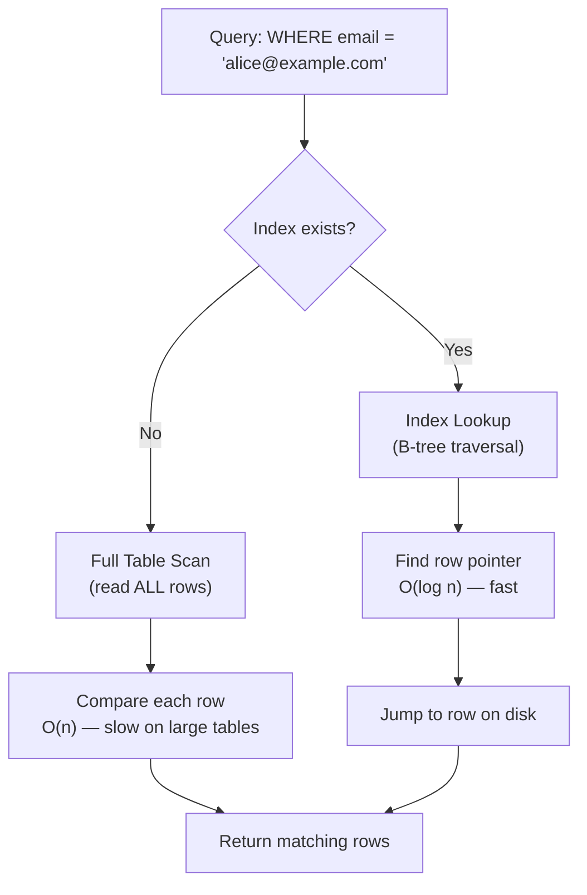

# 11 - Indexes and Query Performance

> "Database table pe index bilkul kitab ke index jaisa hota hai — har page palatne ke bajaye, tum seedha sahi page pe pahunch jaate ho."

---

## 📖 Table of Contents

1. [Index Kya Hota Hai?](#1-what-is-an-index)
2. [Index vs Full Scan — Visual](#2-visualizing-index-vs-full-scan)
3. [EXPLAIN: Query Plan Padhna](#3-explain-reading-the-query-plan)
4. [Query Plan Output Samajhna](#4-understanding-query-plan-output)
5. [Index Types](#5-index-types)
6. [Composite Index Mein Column Order](#6-composite-index-column-order)
7. [Index-Only Scan aur Covering Indexes](#7-index-only-scan-and-covering-indexes)
8. [Partial Indexes](#8-partial-indexes)
9. [Expression Indexes](#9-expression-indexes)
10. [Index Maintenance](#10-index-maintenance)
11. [N+1 Query Problem](#11-the-n1-query-problem)
12. [Common Slow Query Patterns aur Fixes](#12-common-slow-query-patterns-and-fixes)
13. [Query Optimization Checklist](#13-query-optimization-checklist)
14. [Key Takeaways](#key-takeaways)
15. [Quiz](#quiz)

---

## 1 - Index Kya Hota Hai?

Jab tum ek query chalate ho jaise `SELECT * FROM users WHERE email = 'alice@example.com'`, toh database ke paas do options hote hain:

1. **Full Table Scan (Seq Scan)**: Table ka har ek row disk se padho aur check karo ki `email` match karta hai ya nahi. 100 rows ke liye theek hai, lekin 1 crore rows ke liye ye disaster hai.
2. **Index Scan**: Ek pre-built data structure use karo jo email values ko seedha disk pe unki physical location se map karta hai. Bas seedha wahan jump kar do.

Ek **index** wahi pre-built data structure hai. Tum thoda sa extra disk space (aur thodi slow writes) ke badle mein dramatically fast reads paate ho — bilkul Zomato jaisa: agar restaurant list "cuisine type" se sorted ho toh "Chinese" dhundhna instant hai, warna tumhe har restaurant scroll karna padega.

```sql
-- Basic index banana (syntax sab major databases mein same hai)
CREATE INDEX idx_users_email ON users (email);

-- Index hatana
DROP INDEX idx_users_email;             -- PostgreSQL, MySQL, Oracle
DROP INDEX idx_users_email ON users;    -- MySQL (alternative form)
```

> **Rule of thumb**: Un columns ko index karo jo `WHERE`, `JOIN ON`, aur `ORDER BY` clauses mein baar-baar aate hain — lekin blindly har column ko index mat karo. Har index `INSERT`, `UPDATE`, aur `DELETE` ko slow karta hai.

---

## 2 - Index vs Full Scan — Visual



Asli farak hai **algorithmic complexity** ka: full scan O(n) hota hai — table jitna bada, utna hi slow. Lekin B-tree index lookup O(log n) hota hai — table lakhon rows tak bhi grow ho jaaye, speed fast hi rehti hai.

---

## 3 - EXPLAIN: Query Plan Padhna

Kisi query ko optimize karne se pehle, tumhe dekhna hoga ki database usko execute kaise karne wala hai. Har major database ke paas iske liye ek command hai, syntax alag hota hai.

| Database | Basic Explain | Detailed / Actual Runtime Stats |
|---|---|---|
| PostgreSQL | `EXPLAIN SELECT ...` | `EXPLAIN ANALYZE SELECT ...` |
| MySQL | `EXPLAIN SELECT ...` | `EXPLAIN FORMAT=JSON SELECT ...` |
| SQL Server | `SET STATISTICS IO ON` (fir query run karo) | SSMS mein Execution Plan button, ya `SET STATISTICS TIME ON` |
| Oracle | `EXPLAIN PLAN FOR SELECT ...;` fir `SELECT * FROM DBMS_XPLAN.DISPLAY;` | `SELECT * FROM DBMS_XPLAN.DISPLAY_CURSOR` actual plans ke liye |

### PostgreSQL

```sql
-- PostgreSQL
-- Estimated plan dikhata hai (query actually execute nahi hoti)
EXPLAIN SELECT * FROM users WHERE email = 'alice@example.com';

-- Estimated + actual timing dikhata hai (query EXECUTE hoti hai)
EXPLAIN ANALYZE SELECT * FROM users WHERE email = 'alice@example.com';

-- Sabse detailed: buffers info bhi add karo (cache hits vs disk reads)
EXPLAIN (ANALYZE, BUFFERS) SELECT * FROM users WHERE email = 'alice@example.com';
```

### MySQL

```sql
-- MySQL
-- Basic plan (key, rows, Extra columns dikhata hai)
EXPLAIN SELECT * FROM users WHERE email = 'alice@example.com';

-- Detailed JSON format — cost estimates, nested loops dikhata hai
EXPLAIN FORMAT=JSON SELECT * FROM users WHERE email = 'alice@example.com';
```

### SQL Server

```sql
-- SQL Server
-- Query run karne se pehle I/O statistics on karo
SET STATISTICS IO ON;
SET STATISTICS TIME ON;
SELECT * FROM users WHERE email = 'alice@example.com';

-- Ya SSMS mein graphical Execution Plan use karo (Ctrl+M toggle)
-- Text-based plan ke liye:
SET SHOWPLAN_TEXT ON;
GO
SELECT * FROM users WHERE email = 'alice@example.com';
GO
```

### Oracle

```sql
-- Oracle
EXPLAIN PLAN FOR
  SELECT * FROM users WHERE email = 'alice@example.com';

-- Fir plan padho:
SELECT * FROM DBMS_XPLAN.DISPLAY;

-- Already execute ho chuki query ka actual runtime plan chahiye toh:
SELECT * FROM DBMS_XPLAN.DISPLAY_CURSOR(FORMAT => 'ALLSTATS LAST');
```

---

## 4 - Query Plan Output Samajhna

PostgreSQL ka output seekhne ke liye sabse readable hai, isliye hum isko primary example ki tarah use karenge. Concepts baaki sab databases mein bhi same hi hain.

### Sample Output

```
EXPLAIN ANALYZE SELECT * FROM orders WHERE customer_id = 42;

-- Index KE BINA:
Seq Scan on orders  (cost=0.00..4250.00 rows=15 width=120) (actual time=0.043..38.201 rows=15 loops=1)
  Filter: (customer_id = 42)
  Rows Removed by Filter: 99985
Planning Time: 0.3 ms
Execution Time: 38.4 ms

-- customer_id PE index KE SAATH:
Index Scan using idx_orders_customer_id on orders  (cost=0.43..32.10 rows=15 width=120) (actual time=0.021..0.089 rows=15 loops=1)
  Index Cond: (customer_id = 42)
Planning Time: 0.4 ms
Execution Time: 0.2 ms
```

Dekha? Index ke bina 38.4 ms lagi, index ke saath sirf 0.2 ms — yani almost 200x faster. Ye bilkul waise hi hai jaise IRCTC pe seedha PNR number se ticket dhundhna vs har ticket ka record khol ke check karna.

### Jaanne Layak Key Terms

| Term | Kya Matlab Hai |
|---|---|
| `Seq Scan` | Full table scan — har row padhna. Bade tables pe ye ek red flag hai. |
| `Index Scan` | Index se rows mili, fir table se pura row data fetch kiya. |
| `Index Only Scan` | Query poori tarah index se hi answer ho gayi — table ko touch hi nahi kiya. Bahut fast. |
| `Bitmap Index Scan` | Multi-condition queries ke liye use hota hai. Matching pages ka bitmap banata hai, fir fetch karta hai. |
| `cost=X..Y` | Estimated startup cost .. total cost (planner ki apni units mein). Kam = better. |
| `rows=N` | Estimated rows jo return hongi. Agar ye `actual` se bahut alag hai, toh statistics stale ho sakte hain. |
| `actual time=X..Y` | Real milliseconds (startup..total). Sirf `EXPLAIN ANALYZE` ke saath dikhta hai. |
| `loops=N` | Ye node kitni baar run hua (nested loops mein important). Actual time ko loops se multiply karo. |

> **Tip**: Jab `rows` (estimated) `actual rows` se bahut alag ho, toh `ANALYZE tablename;` chala do taaki planner ke paas fresh statistics ho aur woh better decisions le sake.

---

## 5 - Index Types

### B-tree (Default)

Indexing ka workhorse. Ek balanced tree structure jo data ko sorted rakhta hai.

```sql
-- CREATE INDEX mein type specify na karo toh ye automatically banta hai
CREATE INDEX idx_users_email ON users (email);

-- Explicitly:
CREATE INDEX idx_users_email ON users USING BTREE (email);
```

**Best for**: `=`, `<`, `>`, `<=`, `>=`, `BETWEEN`, `IN`, `LIKE 'prefix%'`, `ORDER BY`, `GROUP BY`

**Not for**: `LIKE '%suffix'` (leading wildcard B-tree use nahi kar sakta)

### Hash (PostgreSQL)

Column value ka hash store karta hai. Exact equality ke liye B-tree se bhi fast — lekin sirf equality.

```sql
-- Sirf PostgreSQL
CREATE INDEX idx_users_email_hash ON users USING HASH (email);
```

**Best for**: Sirf `=`. Range queries ya sorting support nahi karta.

### GIN — Generalized Inverted Index (PostgreSQL)

Un columns ke liye perfect jinme multiple values hoti hain (arrays, JSONB, full-text vectors). Ye har element se un rows tak ek inverted map banata hai jinme woh element hai.

```sql
-- PostgreSQL: ek JSONB column index karo
CREATE INDEX idx_products_tags ON products USING GIN (tags);

-- Query jisko fayda hoga:
SELECT * FROM products WHERE tags @> '["electronics", "sale"]';

-- Full-text search:
CREATE INDEX idx_articles_tsv ON articles USING GIN (to_tsvector('english', body));
SELECT * FROM articles WHERE to_tsvector('english', body) @@ to_tsquery('postgresql & index');
```

**Best for**: JSONB containment (`@>`), array operators (`&&`, `@>`), full-text search (`@@`)

### GiST — Generalized Search Tree (PostgreSQL)

Geometric, range, aur doosre complex data types ko index karne ke liye ek flexible framework.

```sql
-- PostgreSQL: ek date range column index karo
CREATE INDEX idx_bookings_period ON bookings USING GIST (period);

-- Query jisko fayda hoga (overlapping ranges):
SELECT * FROM bookings WHERE period && '[2024-01-01, 2024-01-31]'::daterange;
```

**Best for**: Geometric types (`point`, `polygon`), range types (`daterange`, `tsrange`), nearest-neighbor searches

### FULLTEXT (MySQL)

MySQL ka dedicated full-text search index, `MATCH ... AGAINST` ke saath use hota hai.

```sql
-- MySQL
ALTER TABLE articles ADD FULLTEXT INDEX ft_articles_body (title, body);

-- Ya creation time pe:
CREATE FULLTEXT INDEX ft_articles_body ON articles (title, body);

-- Query:
SELECT * FROM articles
WHERE MATCH(title, body) AGAINST('query optimization' IN BOOLEAN MODE);
```

**Best for**: Natural language search, relevance ranking. Normal columns pe B-tree ka substitute nahi hai.

### Columnstore (SQL Server)

Data ko row-by-row store karne ke bajaye, columnstore data ko column-by-column store karta hai, high compression ke saath. Ye analytical queries ke liye design kiya gaya hai jo bade volume ka data scan aur aggregate karti hain.

```sql
-- SQL Server: Non-clustered columnstore (read-heavy analytics ke liye)
CREATE NONCLUSTERED COLUMNSTORE INDEX idx_sales_cs
ON sales (product_id, sale_date, amount, region);

-- Clustered columnstore (poora table columnstore ki tarah store hota hai)
CREATE CLUSTERED COLUMNSTORE INDEX idx_sales_ccs ON sales;
```

**Best for**: Lakhon rows pe `GROUP BY`, `SUM`, `AVG`, `COUNT`. Data warehousing workloads. OLTP (bahut saare chhote updates) ke liye ideal nahi.

### Index Type Quick Reference

| Index Type | Database | Best Use Case |
|---|---|---|
| B-tree | Sab | General purpose: =, <, >, BETWEEN, ORDER BY |
| Hash | PostgreSQL | Equality-only lookups (=) |
| GIN | PostgreSQL | Arrays, JSONB, full-text search |
| GiST | PostgreSQL | Geometric data, range types |
| FULLTEXT | MySQL | Natural language search |
| Columnstore | SQL Server | Analytics, aggregations bade tables pe |

---

## 6 - Composite Index Mein Column Order

Composite index multiple columns ko cover karta hai. **Column ka order bahut zyada matter karta hai.**

```sql
-- Composite index
CREATE INDEX idx_orders_customer_status ON orders (customer_id, status);
```

Ye index in queries mein use ho sakta hai:
- `WHERE customer_id = 1` (leading column)
- `WHERE customer_id = 1 AND status = 'shipped'` (dono columns)

Ye index in queries mein **effectively use nahi** ho sakta:
- `WHERE status = 'shipped'` akela (non-leading column — index scan possible nahi)

### Left-Prefix Rule

Composite index `(A, B, C)` ko ek phone book ki tarah socho jo pehle last name se sorted hai, fir first name se, fir city se. Tum last name se search kar sakte ho, ya last name + first name se, lekin sirf first name se nahi.

**Ordering ke do strategies:**

1. **Most selective column pehle**: Us column ko pehle rakho jisme sabse zyada unique values hoti hain. Ye rows ko sabse fast filter karta hai.
   ```sql
   -- email mein near-unique values hain; is_active mein sirf 2 values
   -- email ko pehle rakho
   CREATE INDEX idx_users ON users (email, is_active);
   ```

2. **Apni query pattern match karo**: Agar queries hamesha `status` pe filter karti hain aur optionally `created_at` pe, toh `status` se lead karo.
   ```sql
   CREATE INDEX idx_orders ON orders (status, created_at);
   -- Ye query power karta hai: WHERE status = 'pending' ORDER BY created_at DESC
   ```

---

## 7 - Index-Only Scan aur Covering Indexes

**Index-Only Scan** tab hota hai jab index mein wo saara data hota hai jo query ko chahiye — database ko actual table rows padhne ki zaroorat hi nahi padti. Ye sabse fast possible read hai.

**Covering Index** ek aisa index hai jo index-only scans enable karne ke liye design kiya gaya hai — filter columns ke alawa extra columns bhi shaamil karke.

```sql
-- PostgreSQL: INCLUDE clause extra columns ko index leaf pages mein add karta hai
-- lekin unhe sort key ka part nahi banata
CREATE INDEX idx_orders_customer_covering
ON orders (customer_id)
INCLUDE (order_date, total_amount);

-- Ab ye query poori tarah index se hi answer ho sakti hai:
SELECT order_date, total_amount
FROM orders
WHERE customer_id = 42;
-- Result: Index Only Scan — main table ko kabhi touch nahi karta
```

MySQL aur SQL Server mein, same effect paane ke liye tum bas index definition mein saare zaroori columns list kar sakte ho:

```sql
-- MySQL / SQL Server
CREATE INDEX idx_orders_covering ON orders (customer_id, order_date, total_amount);
```

> **Note**: PostgreSQL ka `INCLUDE` columns ko key mein add karne se better hai, kyunki non-key columns internal B-tree nodes ko bloat nahi karte — woh sirf leaf pages mein appear hote hain.

---

## 8 - Partial Indexes

**Partial index** sirf un rows ko index karta hai jo ek `WHERE` condition match karte hain. Index chhota hota hai, build karne mein fast hota hai, scan karne mein fast hota hai, aur kam disk space use karta hai.

```sql
-- PostgreSQL: Sirf un rows ko index karo jo abhi complete nahi hue
-- WHERE clause index ke andar hi baked hota hai
CREATE INDEX idx_orders_pending
ON orders (customer_id)
WHERE status = 'pending';

-- Ye query partial index efficiently use karti hai:
SELECT * FROM orders WHERE customer_id = 5 AND status = 'pending';

-- Ek common pattern: soft-delete tables
CREATE INDEX idx_users_active_email
ON users (email)
WHERE is_deleted = false;
```

**Ye kyun powerful hai**: Agar tumhare 95% orders `'completed'` hain aur sirf 5% `'pending'`, toh saare orders pe pura index banana wasteful hai. Partial index sirf us 5% ko cover karta hai jo tum actually query karte ho — bilkul Swiggy jaisa: sirf "active orders" ka ek chhota, fast list maintain karna, past ke crores completed orders ko baar-baar scan karne ke bajaye.

> Partial indexes ek PostgreSQL feature hain. MySQL, SQL Server, aur Oracle natively support nahi karte (SQL Server mein filtered indexes ka similar concept hai: `CREATE INDEX ... WHERE ...` — same syntax, SQL Server 2008 se supported).

---

## 9 - Expression Indexes

**Expression index** (jise functional index bhi kehte hain) column ki raw value ko nahi, balki kisi function ya expression ke result ko index karta hai.

```sql
-- PostgreSQL: Case-insensitive email lookup
-- Iske bina, LOWER(email) = '...' ek full scan force karta hai
CREATE INDEX idx_users_email_lower ON users (LOWER(email));

-- Ab ye query index use karti hai:
SELECT * FROM users WHERE LOWER(email) = 'alice@example.com';

-- Timestamp se extracted year pe index
CREATE INDEX idx_orders_year ON orders (EXTRACT(YEAR FROM created_at));
SELECT * FROM orders WHERE EXTRACT(YEAR FROM created_at) = 2024;
```

```sql
-- MySQL: Function-based indexes (MySQL 8.0+)
CREATE INDEX idx_users_email_lower ON users ((LOWER(email)));
-- Extra parentheses note karo — MySQL mein expressions ke liye zaroori hai
```

```sql
-- SQL Server: Computed column approach
ALTER TABLE users ADD email_lower AS LOWER(email);
CREATE INDEX idx_users_email_lower ON users (email_lower);
```

> **Key insight**: Agar tum apne `WHERE` clause mein ek column ko function mein wrap karte ho bina matching expression index ke, toh database us column pe normal index use nahi kar sakta — usko har row ke liye woh function compute karna padega.

---

## 10 - Index Maintenance

Indexes time ke saath bloated ya outdated ho sakte hain. Maintenance unhe healthy rakhta hai.

### PostgreSQL

```sql
-- VACUUM: dead rows se storage reclaim karta hai (rows jo delete/update ho gaye lekin abhi free nahi hue)
VACUUM users;

-- VACUUM FULL: table ko poora rewrite karta hai, maximum space reclaim (table lock ho jaata hai)
VACUUM FULL users;

-- ANALYZE: statistics update karta hai taaki query planner accurate estimates de
ANALYZE users;

-- Dono ek saath (sabse common maintenance command):
VACUUM ANALYZE users;

-- Bina lock kiye index rebuild karo (PostgreSQL 12+)
REINDEX INDEX CONCURRENTLY idx_users_email;
```

PostgreSQL ka **autovacuum** daemon in commands ko background mein automatically chalata rehta hai. Tumhe manually run karne ki zaroorat kam hi padti hai, jab tak koi massive bulk load na kiya ho.

### MySQL

```sql
-- MySQL: Table aur uske indexes ko rebuild karo, space reclaim karo
OPTIMIZE TABLE users;

-- Statistics manually update karo:
ANALYZE TABLE users;
```

### SQL Server

```sql
-- SQL Server: Index fragmentation check karo
SELECT index_id, avg_fragmentation_in_percent
FROM sys.dm_db_index_physical_stats(DB_ID(), OBJECT_ID('users'), NULL, NULL, 'LIMITED');

-- Index rebuild karo (offline, heavy — fragmentation poori tarah fix karta hai)
ALTER INDEX idx_users_email ON users REBUILD;

-- Index reorganize karo (online, lighter — minor fragmentation fix karta hai)
ALTER INDEX idx_users_email ON users REORGANIZE;

-- Statistics update karo:
UPDATE STATISTICS users;
```

### Oracle

```sql
-- Oracle: Ek index rebuild karo
ALTER INDEX idx_users_email REBUILD;

-- Statistics gather karo (DBMS_STATS package ke through):
EXEC DBMS_STATS.GATHER_TABLE_STATS('schema_name', 'users');
```

---

## 11 - N+1 Query Problem

Ye real applications mein sabse common performance killers mein se ek hai, jo aksar ORMs (Object-Relational Mappers jaise Hibernate, ActiveRecord, SQLAlchemy) ki wajah se aata hai.

### Ye Hai Kya?

N+1 problem tab hota hai jab tum 1 query se N records ki list nikalte ho, fir har record ke related data ke liye N additional queries chala dete ho.

**Example — broken version (N+1)**:

```sql
-- Query 1: Saare customers laao (500 rows return karti hai)
SELECT id, name FROM customers LIMIT 500;

-- Fir application code mein, HAR customer ke liye, ek aur query chalti hai:
-- Query 2:   SELECT * FROM orders WHERE customer_id = 1;
-- Query 3:   SELECT * FROM orders WHERE customer_id = 2;
-- Query 4:   SELECT * FROM orders WHERE customer_id = 3;
-- ...
-- Query 501: SELECT * FROM orders WHERE customer_id = 500;
```

Tumne abhi **501 queries** chala di, jabki 1 query kaafi thi. Network round-trip latency ke saath, iss data ke liye jo milliseconds mein return hona chahiye tha, seconds lag sakte hain.

### Ise Kaise Detect Karein

- Apne application logs check karo — dekho ki koi same query baar-baar repeat toh nahi ho rahi, sirf ID change ho rahi ho.
- Query monitoring tools use karo (PostgreSQL mein pg_stat_statements, MySQL mein slow query log).
- Symptom: Pages slow feel hote hain, jabki individual queries fast hoti hain.

### Isse Fix Kaise Karein — JOIN Use Karo

```sql
-- Fix: ek query JOIN use karke
SELECT
    c.id,
    c.name,
    o.id       AS order_id,
    o.total_amount,
    o.created_at
FROM customers c
LEFT JOIN orders o ON o.customer_id = c.id
ORDER BY c.id, o.created_at DESC;
```

Ab tumhe saare customers aur unke saare orders sirf ek round-trip mein mil jaate hain.

### Alternative Fix — IN Use Karo

Agar JOIN clean na lage, toh related records ko ek batch mein fetch karo:

```sql
-- Pehli query: customer IDs laao
SELECT id FROM customers LIMIT 500;

-- Doosri query: IN use karke unke SAARE orders ek saath fetch karo
SELECT * FROM orders WHERE customer_id IN (1, 2, 3, ..., 500);
```

501 ki jagah sirf do queries. Bahut better. Zyadatar ORMs "eager loading" support karte hain isse automatically karne ke liye (Rails mein `includes`, SQLAlchemy mein `joinedload`, JPQL mein `fetch join`).

---

## 12 - Common Slow Query Patterns aur Fixes

| Pattern | Slow Kyun Hai | Fix |
|---|---|---|
| `WHERE LOWER(email) = ?` bina expression index ke | Function index ko disable kar deta hai | `CREATE INDEX ON users (LOWER(email))` |
| `WHERE name LIKE '%smith%'` | Leading wildcard — B-tree kaam nahi karta | `FULLTEXT` (MySQL), `GIN` + `pg_trgm` (PostgreSQL), ya full-text search use karo |
| Wide tables pe `SELECT *` | Zaroorat na hone wale columns bhi fetch hote hain; index-only scans block hote hain | Sirf zaroori columns select karo |
| Unindexed column pe `ORDER BY` | Result ka pura sort chahiye hota hai | `ORDER BY` column pe index add karo |
| Foreign key pe missing index | Har JOIN/DELETE child table pe seq scan trigger karta hai | Foreign key columns ko hamesha index karo |
| `OR` conditions | Aksar index use hone se rok deta hai | `UNION ALL` se rewrite karo ya check karo ki covering index help karta hai |
| Bade `IN (...)` lists | Seq scan mein degrade ho sakta hai | Temporary table ya `JOIN` use karo |
| Implicit type cast | `WHERE user_id = '42'` jab `user_id` integer hai | Data types match karo — implicit casting se bacho |
| Outdated statistics | Planner ke estimates galat hote hain; galat plan choose kar leta hai | `ANALYZE` (PostgreSQL/MySQL) ya `UPDATE STATISTICS` (SQL Server) chalao |

### Example: pg_trgm Se Slow LIKE Query Fix Karna

```sql
-- PostgreSQL: Trigram extension enable karo
CREATE EXTENSION IF NOT EXISTS pg_trgm;

-- Trigrams use karke ek GIN index banao (LIKE '%...%' support karta hai)
CREATE INDEX idx_products_name_trgm ON products USING GIN (name gin_trgm_ops);

-- Ab ye query leading wildcard ke saath bhi index use karti hai:
SELECT * FROM products WHERE name LIKE '%wireless%';
```

---

## 13 - Query Optimization Checklist

Jab koi query expected se slower ho, ye checklist use karo:

- [ ] **EXPLAIN ANALYZE chalao** — plan padho. Bade tables pe Seq Scans identify karo.
- [ ] **Estimated vs actual rows check karo** — agar farak zyada hai, `ANALYZE tablename` chalao.
- [ ] **Apne WHERE columns ko index karo** — especially equality ya range filters mein use hone wale columns.
- [ ] **Apne JOIN columns ko index karo** — `ON` condition ke dono sides index hone chahiye.
- [ ] **ORDER BY / GROUP BY columns ko index karo** — agar planner expensive sort kar raha hai, index usko eliminate kar sakta hai.
- [ ] **WHERE mein indexed columns pe functions avoid karo** — zaroorat pade toh expression indexes use karo.
- [ ] **`SELECT *` avoid karo** — sirf zaroori cheez select karo. Index-only scans enable hote hain.
- [ ] **N+1 queries check karo** — logs mein repeated identical queries dhundho. JOINs se consolidate karo.
- [ ] **Composite indexes consider karo** — do separate indexes se ek composite index aksar better hota hai.
- [ ] **Partial indexes consider karo** — agar tum hamesha ek low-cardinality column pe filter karte ho (jaise `status = 'active'`).
- [ ] **Index bloat check karo** — agar table pe bahut saare updates/deletes hue hain toh `VACUUM ANALYZE` (PostgreSQL) ya `OPTIMIZE TABLE` (MySQL) chalao.
- [ ] **Implicit type casts dhundho** — `WHERE int_col = '42'` se `int_col` ka index defeat ho jaata hai.
- [ ] **Different columns pe `OR` avoid karo** — index use hone se rok sakta hai; `UNION ALL` try karo.
- [ ] **Result sets limit karo** — `LIMIT` add karo jahan caller ko saare rows ki zaroorat nahi.

---

## Key Takeaways

- **Index** ek sorted data structure hai jo database ko poore table scan kiye bina rows dhundhne mein madad karta hai. Ye write speed aur disk space ke badle dramatically fast reads deta hai.
- **EXPLAIN ANALYZE** (PostgreSQL), **EXPLAIN** (MySQL), **SET STATISTICS IO ON** (SQL Server), ya **EXPLAIN PLAN** (Oracle) use karo ye dekhne ke liye ki database query ko optimize karne se pehle kaise execute karega.
- Bade table pe **Seq Scan** ek warning sign hai. **Index Scan** ya **Index Only Scan** jo tumhe chahiye.
- **B-tree** general-purpose default hai. PostgreSQL mein JSONB/arrays/full-text ke liye **GIN**, MySQL mein **FULLTEXT**, aur SQL Server mein analytics ke liye **Columnstore** use karo.
- **Composite indexes** mein column order matter karta hai: left-prefix rule decide karta hai kaunsi queries fayda uthaayengi.
- **Partial indexes** aur **expression indexes** (PostgreSQL) chhote, faster, zyada targeted indexes banane ke powerful tools hain.
- **N+1 query problem** real-world ke sabse common performance bugs mein se ek hai. JOINs ya batched IN queries se fix karo.
- **Indexed columns ko WHERE clause mein kabhi function mein wrap mat karo** jab tak matching expression index na ho.
- Statistics accurate aur storage lean rakhne ke liye periodically **VACUUM ANALYZE** (PostgreSQL) ya **OPTIMIZE TABLE** (MySQL) chalao.

---

## Quiz

**Question 1**

Tumhare paas `users` table hai 1 crore (10 million) rows ke saath. Ye query bahut slow hai:

```sql
SELECT * FROM users WHERE LOWER(email) = 'alice@example.com';
```

Tumhare paas already `CREATE INDEX idx_users_email ON users (email)` hai. Query abhi bhi slow kyun hai, aur ise kaise fix karoge?

<details>
<summary>Answer</summary>

`LOWER()` function indexed column ko wrap kar deta hai, jo B-tree index ko use hone se rok deta hai — database ko har row ke liye `LOWER(email)` compute karna padta hai (full table scan). Fix hai ek **expression index** banana:

```sql
CREATE INDEX idx_users_email_lower ON users (LOWER(email));
```

Ab index pre-computed lowercase values store karta hai aur query use directly use kar sakti hai.
</details>

---

**Question 2**

Ye composite index diya gaya hai: `CREATE INDEX idx ON orders (status, customer_id, created_at);`

In queries mein se kaunsi is index se fayda uthayengi, aur kaunsi nahi?

a) `WHERE status = 'pending'`
b) `WHERE customer_id = 5`
c) `WHERE status = 'pending' AND customer_id = 5`
d) `WHERE customer_id = 5 AND created_at > '2024-01-01'`

<details>
<summary>Answer</summary>

- **a) Fayda hota hai** — `status` leading column hai. Index use ho sakta hai.
- **b) Fayda nahi hota** — `customer_id` doosra column hai. Bina leading `status` column ke, B-tree efficiently rows locate nahi kar sakta. Seq scan (ya separate index) chahiye hoga.
- **c) Fayda hota hai** — Dono leading columns present hain. Index ka pura use hota hai.
- **d) Poori index ke liye fayda nahi** — `customer_id` bina leading `status` ke matlab database composite index efficiently use nahi kar sakta. Iske liye `(customer_id, created_at)` pe ek separate index madad karega.
</details>

---

**Question 3**

Ek application 200 blog posts ki list load karti hai, fir har post ke liye author ka naam load karne ke liye ek separate query chalati hai. Total kitni queries execute hoti hain, isse kya problem kehte hain, aur sahi SQL fix kya hai?

<details>
<summary>Answer</summary>

**201 queries** execute hoti hain (1 posts ke liye + 1 per post author ke liye = 1 + 200). Ise **N+1 query problem** kehte hain.

Fix hai ek single JOIN:

```sql
SELECT
    p.id,
    p.title,
    p.published_at,
    u.name AS author_name
FROM posts p
JOIN users u ON u.id = p.author_id
ORDER BY p.published_at DESC
LIMIT 200;
```

Ek query, ek round-trip database tak, same result.
</details>
