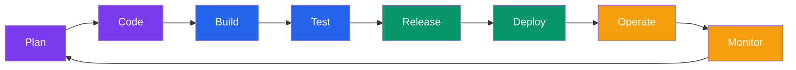

# Introduction to DevOps

## What You'll Learn

- The DevOps philosophy and culture
- Key principles and practices
- DevOps tools landscape
- How DevOps differs from traditional software development

---

## What is DevOps?

**DevOps** is a combination of cultural philosophies, practices, and tools that increases an organization's ability to deliver applications and services at high velocity.

### Traditional Development vs DevOps

| Traditional (Waterfall/Silo) | DevOps |
|------------------------------|--------|
| Separate Dev and Ops teams | Unified teams with shared responsibility |
| Manual deployments | Automated CI/CD pipelines |
| Infrequent releases (months) | Frequent releases (daily/weekly) |
| Long feedback loops | Rapid feedback and iteration |
| "It works on my machine" | "It works in production" mindset |
| Manual testing | Automated testing at every stage |

---

## Core DevOps Principles

### 1. **Collaboration and Communication**
Break down silos between development, operations, QA, and security teams.

### 2. **Automation**
Automate repetitive tasks: testing, builds, deployments, infrastructure provisioning.

### 3. **Continuous Integration & Continuous Delivery (CI/CD)**
- **CI**: Automatically build and test code changes frequently
- **CD**: Automatically deploy tested code to production

### 4. **Infrastructure as Code (IaC)**
Manage infrastructure using code and version control (Terraform, CloudFormation).

### 5. **Monitoring and Logging**
Continuous monitoring of applications and infrastructure to detect and fix issues quickly.

### 6. **Microservices Architecture**
Build applications as small, independent services that can be deployed separately.

---

## The DevOps Lifecycle



```
┌──────────────────────────────────────────┐
│                                          │
│   Plan → Code → Build → Test            │
│     ↓                        ↑           │
│   Monitor ← Operate ← Deploy ← Release   │
│                                          │
└──────────────────────────────────────────┘
```

1. **Plan**: Requirements, user stories, project management
2. **Code**: Version control (Git), code reviews, branching strategies
3. **Build**: Compile code, create artifacts (Docker images, binaries)
4. **Test**: Unit, integration, end-to-end automated tests
5. **Release**: Package and prepare for deployment
6. **Deploy**: Push to staging/production environments
7. **Operate**: Manage infrastructure, handle incidents
8. **Monitor**: Track metrics, logs, alerts, performance

---

## DevOps Tools Landscape

### Version Control
- **Git** (GitHub, GitLab, Bitbucket)

### CI/CD
- **GitHub Actions**, Jenkins, GitLab CI, CircleCI, Travis CI

### Containerization
- **Docker**, containerd, Podman

### Container Orchestration
- **Kubernetes** (K8s), Docker Swarm, AWS ECS, Nomad

### Infrastructure as Code
- **Terraform**, AWS CloudFormation, Pulumi, Ansible

### Cloud Providers
- **AWS** (primary in this guide), Azure, Google Cloud Platform (GCP)

### Monitoring & Observability
- **Prometheus**, Grafana, CloudWatch, Datadog, New Relic, ELK Stack

### Configuration Management
- Ansible, Chef, Puppet, SaltStack

---

## Benefits of DevOps

### For Development Teams
- Faster time to market
- More time for innovation (less manual work)
- Better collaboration
- Faster feedback on code quality

### For Operations Teams
- Fewer production incidents
- Faster incident recovery
- Predictable deployments
- Less manual firefighting

### For Business
- Faster feature delivery
- Higher customer satisfaction
- Lower costs (automation, efficiency)
- Competitive advantage

---

## DevOps Culture: Key Practices

### 1. **Blameless Postmortems**
When incidents occur, focus on fixing the system, not blaming individuals.

### 2. **Shared Responsibility**
Everyone owns the application from development to production.

### 3. **Fail Fast, Learn Fast**
Small, frequent deployments reduce risk and accelerate learning.

### 4. **Everything as Code**
Infrastructure, configuration, documentation should be version-controlled.

### 5. **You Build It, You Run It**
The team that builds a service is responsible for operating it in production.

---

## Real-World DevOps Workflow Example

Let's say you're building a Node.js web application:

### Traditional Approach (Weeks to Deploy)
1. Developer writes code locally
2. Manual code review
3. QA team manually tests (days/weeks)
4. Operations team manually deploys to server
5. Hope nothing breaks in production

### DevOps Approach (Minutes to Deploy)
1. Developer commits code to Git → triggers CI/CD pipeline
2. Automated tests run (unit, integration, e2e)
3. Docker image built automatically
4. Image deployed to staging environment automatically
5. Automated smoke tests verify staging works
6. One-click (or automated) deploy to production
7. Monitoring alerts if anything breaks
8. Rollback in seconds if needed

---

## Common DevOps Metrics

### DORA Metrics (DevOps Research and Assessment)
1. **Deployment Frequency**: How often you deploy to production
2. **Lead Time for Changes**: Time from commit to production
3. **Mean Time to Recovery (MTTR)**: How fast you recover from failures
4. **Change Failure Rate**: Percentage of deployments causing failures

**Elite performers** achieve:
- Multiple deployments per day
- Less than 1 hour lead time
- Less than 1 hour MTTR
- 0-15% change failure rate

---

## DevOps Job Roles

### DevOps Engineer
Bridges development and operations, builds CI/CD pipelines, manages infrastructure.

### Site Reliability Engineer (SRE)
Focuses on reliability, scalability, and performance of production systems.

### Platform Engineer
Builds internal developer platforms and tools for application teams.

### Cloud Engineer
Specializes in cloud infrastructure (AWS, Azure, GCP).

---

## Prerequisites for This DevOps Guide

Before diving into the technical content:

✅ **Basic Linux/Unix command line** (cd, ls, mkdir, cat, grep)  
✅ **Git basics** (clone, commit, push, pull, branches)  
✅ **One programming language** (Node.js, Python, Go, Java)  
✅ **Basic networking** (IP addresses, ports, HTTP)  
✅ **Willingness to learn** (DevOps is vast, take it step by step!)

---

## What's Next?

In the next tutorials, we'll start with **Docker**, the foundation of modern DevOps. You'll learn how to:
- Build container images
- Run containers
- Dockerize applications
- Push images to registries

Then we'll move on to CI/CD, AWS, Kubernetes, Terraform, and monitoring.

---

## Exercise

**Reflect and Research**:
1. What are the main pain points in your current development/deployment workflow?
2. Research one company that successfully adopted DevOps (Netflix, Amazon, Etsy). What practices did they implement?
3. Set up your development environment:
   - Install Docker
   - Install Git
   - Create a GitHub account if you don't have one
   - Install AWS CLI (we'll use it later)

---

## Additional Resources

- [The Phoenix Project](https://www.amazon.com/Phoenix-Project-DevOps-Helping-Business/dp/0988262592) - DevOps novel
- [The DevOps Handbook](https://www.amazon.com/DevOps-Handbook-World-Class-Reliability-Organizations/dp/1942788002)
- [DORA State of DevOps Reports](https://dora.dev/)
- [12 Factor App](https://12factor.net/) - Best practices for cloud-native apps

---

**Next**: [Docker Basics](./02_docker_basics.md) → Learn containerization fundamentals
