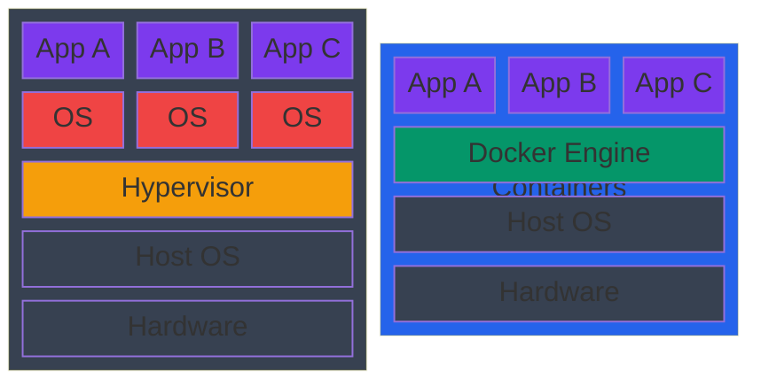
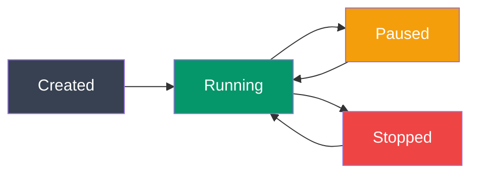

# Docker Basics

## Kya Seekhoge Is File Mein

- Docker hai kya aur yeh itna popular kyun hai
- Docker ke core concepts: images, containers, registries
- Zaruri Docker commands jo roz kaam aayenge
- Apna pehla container kaise banate hain
- Containers ko run aur manage kaise karte hain

---

## Docker Hai Kya?

Socho tumne apne laptop pe ek Node.js app banaya, sab kuch perfectly chal raha hai. Ab tumne wahi code apne friend ko diya, aur uske system pe crash ho gaya — "node version mismatch", "ye package missing hai", "environment variable set nahi hai" jaise 10 errors. Yeh problem har developer ne face ki hai, aur isi problem ko solve karne ke liye **Docker** aaya.

**Docker** ek platform hai jisse tum apps ko **containers** ke andar develop, ship aur run karte ho. Container basically ek chhota, self-contained package hai jisme tumhara code, uski saari dependencies (libraries, runtime, config files) — sab kuch ek saath bandh ke rakha hota hai. Isse jo bhi machine pe yeh container chalega, wahi exact behavior milega — chahe tumhara laptop ho, CI server ho, ya production ka cloud server.

Simple bhasha mein: Docker ek "shipping container" jaisa hai jo real world mein cargo ships pe hota hai. Chahe container mein TV ho ya kapde ho, ship, truck, crane — sabko sirf container ka standard size pata hona chahiye, andar kya hai woh matter nahi karta. Same tarah, Docker container ke andar chahe Node app ho, Python app ho ya database — jo bhi machine Docker samajhti hai, wahan yeh chal jayega.

### Container vs Virtual Machine

Yeh sabse common confusion hai jab log Docker seekhna start karte hain — "yeh toh VM jaisa hi hai na?" Nahi bhai, bahut bada fark hai.

| Virtual Machine | Container |
|----------------|-----------|
| Includes entire OS (GB) | Shares host OS kernel (MB) |
| Minutes to start | Seconds to start |
| Heavy resource usage | Lightweight |
| Strong isolation | Process-level isolation |
| VMware, VirtualBox | Docker, containerd |

> [!tip]
> Yaad rakhne ka tarika: **VM = alag ghar** apni khud ki bijli-paani connection ke saath (matlab poora alag OS chalana padta hai, heavy hai, slow hai). **Container = PG (paying guest) room** — building ka common infrastructure (host OS kernel) use karta hai, lekin apna khud ka alag space, apna saaman rakhta hai. Isliye container fast bhi hai aur lightweight bhi.

Docker container host machine ke kernel ko hi share karta hai — apna alag kernel nahi leke chalta. Isliye size mein MBs mein hota hai aur seconds mein start ho jaata hai. VM apna poora OS leke chalta hai isliye GBs ka hota hai aur boot hone mein minutes lag jaate hain — bilkul aise jaise naya ghar allot hone mein time lagta hai vs PG mein turant shift ho jaate ho.



```
┌─────────────────────────────┐   ┌─────────────────────────────┐
│     Virtual Machines        │   │        Containers           │
├─────────────────────────────┤   ├─────────────────────────────┤
│  App A  │  App B  │  App C  │   │  App A  │  App B  │  App C  │
├─────────┼─────────┼─────────┤   ├─────────┼─────────┼─────────┤
│  OS     │  OS     │  OS     │   │        Docker Engine        │
├─────────┴─────────┴─────────┤   ├─────────────────────────────┤
│       Hypervisor            │   │        Host OS              │
├─────────────────────────────┤   ├─────────────────────────────┤
│       Host OS               │   │        Hardware             │
├─────────────────────────────┤   └─────────────────────────────┘
│       Hardware              │
└─────────────────────────────┘
```

---

## Docker Kyun Use Karein?

Chalo dekhte hain ki Docker itna zaruri kyun ban gaya hai modern development mein.

### 1. **Consistency Across Environments**
Har developer ne kabhi na kabhi bola hai — "bhai mere machine pe toh chal raha tha!" Docker isi problem ko khatam karta hai. Jab tum container bana lete ho, usme sab kuch bundled hota hai — code, dependencies, runtime, config. Result: "it works on my machine" ab ban jaata hai "it works everywhere" — laptop ho, staging ho, production ho, sab jagah same behavior.

```bash
# Same container runs on:
- Developer laptop (Windows, Mac, Linux)
- CI/CD server
- Staging environment
- Production servers
```

### 2. **Fast and Lightweight**
Containers seconds mein start ho jaate hain, minutes nahi lagte — kyunki inhe poora OS boot nahi karna padta, sirf process start hota hai host kernel ke upar.

### 3. **Isolation**
Har container apne aap mein independent chalta hai — apna filesystem, apna network, apna process space. Matlab agar ek container crash bhi ho jaaye, doosre containers pe koi asar nahi padta. Zomato ke microservices socho — order service crash ho jaaye toh payment service bilkul theek chalta rahega, kyunki dono alag-alag isolated containers mein hain.

### 4. **Easy Scaling**
Traffic badh gaya? Bas 10 identical containers spin up kar do seconds mein. Diwali sale pe Flipkart jaise platforms yehi karte hain — traffic spike hote hi automatically zyada containers laa dete hain load handle karne ke liye.

### 5. **Version Control for Infrastructure**
Dockerfile ek plain text file hai — code jaisa hi. Isliye tum ise Git mein commit kar sakte ho, version control kar sakte ho, PR review kar sakte ho. Infrastructure bhi ab "Infrastructure as Code" ban jaata hai.

---

## Docker Ke Key Concepts

Docker seekhne se pehle yeh 5 terms clearly samajhna zaruri hai — aage sab kuch inhi ke upar based hai.

### 1. **Image**

Image ek **blueprint/template** hai containers banane ke liye. Yeh **read-only** hoti hai — matlab isse directly change nahi kar sakte, sirf naye containers bana sakte ho isse.

```bash
# Think of it as:
Image = Class (in OOP)
Container = Instance of that class
```

Agar tum Node.js/TypeScript background se aa rahe ho toh yeh analogy samajhna easy hoga — jaise ek `class` se multiple `object` instances banate ho, waise hi ek image se multiple containers spin up kar sakte ho, sab apna independent state rakhte hue.

### 2. **Container**

Container ek image ka **running instance** hai. Containers isolated processes hote hain — apna alag filesystem, network aur process view rakhte hain, lekin host ke kernel ko share karte hain.

### 3. **Dockerfile**

Dockerfile ek plain text file hai jisme step-by-step instructions likhe hote hain ki image kaise banegi — kaunsa base image use karna hai, kya install karna hai, code kahan copy karna hai, konsa command run karna hai wagera. (Isko detail mein next tutorial mein cover karenge.)

### 4. **Registry**

Registry ek storage/repository hai jahan images store aur share hoti hain — jaise GitHub code ke liye hai, waise Registry images ke liye hai. Sabse popular hai **Docker Hub**, lekin **AWS ECR**, **GitHub Container Registry (ghcr.io)** bhi widely use hote hain, especially production setups mein.

### 5. **Docker Engine**

Yeh actual **runtime** hai jo images build karta hai aur containers run karta hai. Jab tum `docker run` type karte ho, background mein Docker Engine hi kaam kar raha hota hai.

---

## Docker Install Karna

### Windows / Mac

**Docker Desktop** download karo: https://www.docker.com/products/docker-desktop/

Docker Desktop ek GUI application hai jo internally ek lightweight Linux VM chalata hai (kyunki Docker fundamentally Linux kernel features use karta hai), aur upar se ek easy UI + CLI deta hai.

### Linux (Ubuntu/Debian)

```bash
# Install Docker
curl -fsSL https://get.docker.com -o get-docker.sh
sudo sh get-docker.sh

# Add your user to docker group (avoid using sudo)
sudo usermod -aG docker $USER

# Verify installation
docker --version
docker run hello-world
```

> [!info]
> `docker run hello-world` ek chhota test image chalata hai jo verify karta hai ki Docker sahi se install hua hai. Agar yeh output print ho jaaye toh samajh lo setup ho gaya.

---

## Zaruri Docker Commands

Ab practical part start karte hain — yeh commands roz kaam aayenge, isliye inhe muh-zabani yaad ho jaana chahiye.

### Docker Version Check Karna

```bash
docker --version
docker info
```

### Images Ke Saath Kaam Karna

```bash
# List all local images
docker images
docker image ls

# Pull an image from Docker Hub
docker pull nginx
docker pull node:18-alpine

# Remove an image
docker rmi nginx
docker image rm nginx

# Search for images on Docker Hub
docker search postgres
```

`docker pull` basically registry se image download karke tumhare local machine pe rakh deta hai — bilkul jaise `npm install` package download karta hai node_modules mein.

### Containers Ke Saath Kaam Karna

```bash
# List running containers
docker ps

# List all containers (including stopped)
docker ps -a

# Run a container
docker run nginx

# Run container in background (detached mode)
docker run -d nginx

# Run container with a name
docker run -d --name my-nginx nginx

# Run container and map ports (host:container)
docker run -d -p 8080:80 nginx
# Now access at http://localhost:8080

# Stop a container
docker stop my-nginx

# Start a stopped container
docker start my-nginx

# Restart a container
docker restart my-nginx

# Remove a container
docker rm my-nginx

# Remove a running container (force)
docker rm -f my-nginx

# View container logs
docker logs my-nginx
docker logs -f my-nginx  # Follow logs in real-time

# Execute command inside running container
docker exec -it my-nginx bash
docker exec my-nginx ls /usr/share/nginx/html

# Interactive terminal
docker exec -it my-nginx sh
```

> [!tip]
> `docker ps` sirf **running** containers dikhata hai. Agar tumhara container stop ho gaya hai aur woh list mein nahi dikh raha, toh `docker ps -a` use karo — yeh sab containers dikhayega, chahe stopped ho ya running.

---

## Apna Pehla Container Chalao

Chalo ab kuch real containers run karke dekhte hain.

### Example 1: Nginx Web Server

Nginx ek web server hai. Isko container mein chalana matlab bina kuch install kiye, seconds mein ek working web server khada kar dena.

```bash
# Run Nginx on port 8080
docker run -d -p 8080:80 --name web nginx

# Check if it's running
docker ps

# Visit http://localhost:8080 in your browser
# You should see "Welcome to nginx!"

# View logs
docker logs web

# Stop and remove
docker stop web
docker rm web
```

`-p 8080:80` ka matlab hai: tumhare host machine ka port `8080`, container ke andar chal rahe port `80` se map ho raha hai. Jab tum browser mein `localhost:8080` kholte ho, request container ke andar chal rahe nginx tak forward ho jaati hai.

### Example 2: Node.js Application

```bash
# Run Node.js container with interactive shell
docker run -it node:18-alpine sh

# Inside container:
node --version
npm --version
exit
```

Yeh command tumhe seedha ek Node.js environment ke andar drop kar deta hai — bina apne machine pe Node install kiye. Alag-alag project ke liye alag-alag Node version chahiye? Bas alag tag ka image pull kar lo, koi nvm switching ka jhanjhat nahi.

### Example 3: PostgreSQL Database

```bash
# Run PostgreSQL with environment variables
docker run -d \
  --name postgres-db \
  -e POSTGRES_PASSWORD=mysecretpassword \
  -e POSTGRES_DB=myapp \
  -p 5432:5432 \
  postgres:15-alpine

# Connect to it
docker exec -it postgres-db psql -U postgres -d myapp

# Inside PostgreSQL:
\l                    # List databases
CREATE TABLE users (id SERIAL PRIMARY KEY, name TEXT);
\dt                   # List tables
\q                    # Quit

# Stop and remove
docker stop postgres-db
docker rm postgres-db
```

Yeh sabse bada practical benefit hai Docker ka — PostgreSQL apne machine pe install karna, configure karna, phir uninstall karna ek jhanjhat wala kaam hota hai. Container mein bas ek command aur database ready, aur delete bhi ek command se — no leftover mess.

---

## Docker Run Ke Options

### Sabse Zyada Use Hone Wale Flags

```bash
docker run [OPTIONS] IMAGE [COMMAND]

# Most used options:
-d, --detach              # Run in background
-p, --publish 8080:80    # Map ports (host:container)
--name my-container      # Give container a name
-e, --env KEY=value      # Set environment variable
-v, --volume /host:/container  # Mount volume
--rm                     # Remove container when it stops
-it                      # Interactive terminal (combined -i -t)
--network bridge         # Specify network
--restart always         # Restart policy
```

> [!warning]
> `--rm` flag testing ke liye bahut handy hai — container ruk jaane ke baad khud-ba-khud delete ho jaata hai, isliye tumhara `docker ps -a` list clutter nahi hoti. Lekin production containers pe iska use mat karo, warna crash hone pe logs bhi gayab ho jayenge!

### Multiple Options Ke Saath Example

```bash
docker run -d \
  --name my-app \
  -p 3000:3000 \
  -e NODE_ENV=production \
  -e DATABASE_URL=postgres://localhost/mydb \
  --restart unless-stopped \
  node:18-alpine \
  node server.js
```

Yeh real production jaisa setup hai — background mein chal raha hai (`-d`), port expose kiya hai, environment variables pass kiye hain (jaise `NODE_ENV`, `DATABASE_URL`), aur `--restart unless-stopped` bola hai ki agar server crash ho jaaye ya machine reboot ho jaaye, toh Docker khud container ko dobara start kar dega — jaise PM2 karta hai Node apps ke liye, waise hi yeh flag Docker level pe reliability deta hai.

---

## Container Ka Lifecycle

Kya hota hai jab container create hota hai se lekar delete hone tak? Chalo poora lifecycle samajhte hain.



```
┌────────────────────────────────────────────────┐
│                                                │
│   Created → Running → Paused → Stopped         │
│      ↑         │                    │          │
│      └─────────┴────────────────────┘          │
│              (start/restart)                   │
│                                                │
└────────────────────────────────────────────────┘
```

```bash
# Create but don't start
docker create --name my-container nginx

# Start a created/stopped container
docker start my-container

# Pause a running container
docker pause my-container

# Unpause
docker unpause my-container

# Stop (graceful shutdown)
docker stop my-container

# Kill (immediate stop)
docker kill my-container

# Remove
docker rm my-container
```

> [!info]
> `docker stop` aur `docker kill` mein fark samajhna zaruri hai. `stop` container ko ek **SIGTERM** signal bhejta hai — matlab app ko time deta hai gracefully shutdown hone ka (jaise pending requests complete karna, DB connections band karna). Agar woh nahi rukta, kuch time baad `SIGKILL` force karta hai. `kill` seedha `SIGKILL` bhej deta hai — bina warning ke turant band. Production mein hamesha `stop` use karo, `kill` sirf emergency ke liye.

---

## Containers Ko Inspect Karna

### Container Ka Detail Dekhna

```bash
# Full details (JSON)
docker inspect my-container

# Get specific field (IP address)
docker inspect -f '{{.NetworkSettings.IPAddress}}' my-container

# View resource usage
docker stats my-container

# View processes running in container
docker top my-container
```

`docker inspect` container ka poora JSON metadata deta hai — IP address, mounted volumes, environment variables, network settings, sab kuch. Debugging ke time yeh bahut kaam aata hai — jaise "yeh container kis network pe hai" ya "iska actual env var value kya set hua tha" jaanne ke liye. `docker stats` real-time CPU/memory usage dikhata hai, `top` jaisa hi hai bas container ke andar ke processes ke liye.

---

## Cleanup Karna

Docker use karte-karte dhire-dhire disk space bharne lagta hai — purane images, stopped containers, unused volumes jama hote rehte hain. Regular cleanup zaruri hai.

### Stopped Containers Remove Karna

```bash
# Remove one container
docker rm my-container

# Remove all stopped containers
docker container prune

# Remove all containers (running and stopped)
docker rm -f $(docker ps -aq)
```

### Images Remove Karna

```bash
# Remove unused images
docker image prune

# Remove all images
docker rmi $(docker images -q)
```

### Sab Kuch Remove Karna

```bash
# Nuclear option: remove everything (containers, images, volumes, networks)
docker system prune -a --volumes
```

> [!warning]
> `docker system prune -a --volumes` ek "nuclear option" hai — matlab yeh **sab** unused containers, images, networks, aur volumes delete kar dega, jisme tumhara data bhi ja sakta hai agar volume kisi running container se attached nahi hai. Isko chalane se pehle do baar sochna, especially agar kisi database ka data usme stored hai jo backup nahi hai.

---

## Docker Hub: Public Registry

[Docker Hub](https://hub.docker.com/) Docker ka default registry hai — jaise GitHub code ke liye hai, waise Docker Hub images ke liye hai. Yahan lakhon pre-built images available hain jo koi bhi pull karke use kar sakta hai.

### Popular Official Images

- `node` - Node.js runtime
- `python` - Python runtime
- `nginx` - Web server
- `postgres` - PostgreSQL database
- `redis` - Redis cache
- `mongo` - MongoDB database
- `ubuntu` - Ubuntu OS

### Image Tags

Tag basically image ka **version** batata hai. Bina tag specify kiye `latest` tag pull hota hai, jo production mein risky hai kyunki "latest" kal kuch aur ho sakta hai — yeh version pinning ki concept jaisa hi hai jaise `package.json` mein tum exact version lock karte ho.

```bash
# Pull specific version
docker pull node:18-alpine     # Node 18 on Alpine Linux
docker pull node:18            # Node 18 on Debian
docker pull node:latest        # Latest version (not recommended for production!)

# Image naming format:
[registry/][username/]repository:tag

# Examples:
nginx:latest                   # Docker Hub official
myusername/myapp:v1.0         # Docker Hub user image
ghcr.io/myorg/myapp:latest    # GitHub Container Registry
```

> [!tip]
> `alpine` variant wali images (jaise `node:18-alpine`) bahut chhoti hoti hain (~50MB vs ~900MB regular image ke) kyunki yeh Alpine Linux pe based hain jo ek minimal Linux distro hai. Production images mein hamesha alpine ya slim variant prefer karo jab tak koi specific dependency conflict na ho — CI/CD pipelines fast hoti hain aur deployment bhi.

---

## Practical Example: Ek Complete Web App Chalana

Ab dekhte hain ki real project mein multiple containers ek saath kaise use hote hain — jaise ek typical backend jisme cache, database, aur API server teeno chahiye.

```bash
# 1. Run a Redis cache
docker run -d --name redis redis:alpine

# 2. Run a PostgreSQL database
docker run -d \
  --name postgres \
  -e POSTGRES_PASSWORD=secret \
  postgres:15-alpine

# 3. Run a Node.js app (connecting to the above)
docker run -d \
  --name api \
  -p 3000:3000 \
  -e REDIS_HOST=redis \
  -e DB_HOST=postgres \
  --link redis \
  --link postgres \
  node:18-alpine

# Note: --link is deprecated, we'll use Docker networks in the next tutorial
```

Yeh bilkul aisa hi hai jaise ek real-world food delivery app (Swiggy jaisa) architecture hota hai — ek Redis cache jo frequently accessed data (jaise restaurant listings) fast serve karta hai, ek Postgres database jahan orders/users ka permanent data store hota hai, aur ek API server jo dono ko connect karke business logic handle karta hai. `--link` ab deprecated ho chuka hai — agle tutorial mein hum proper **Docker networks** seekhenge jo isका modern replacement hai.

---

## Exercise

### Task 1: Containers Run Aur Explore Karo

```bash
# 1. Pull and run an Nginx container on port 8080
docker run -d -p 8080:80 --name my-nginx nginx

# 2. Check that it's running
docker ps

# 3. Access http://localhost:8080 in your browser

# 4. View the logs
docker logs my-nginx

# 5. Execute a command inside the container
docker exec my-nginx cat /etc/nginx/nginx.conf

# 6. Open an interactive shell
docker exec -it my-nginx bash

# 7. Stop and remove the container
docker stop my-nginx && docker rm my-nginx
```

### Task 2: Ek Database Chalao

```bash
# 1. Run MySQL with a custom password
docker run -d \
  --name mysql-db \
  -e MYSQL_ROOT_PASSWORD=mypassword \
  -e MYSQL_DATABASE=testdb \
  -p 3306:3306 \
  mysql:8

# 2. Connect to it
docker exec -it mysql-db mysql -u root -p
# Enter password: mypassword

# 3. Create a table
USE testdb;
CREATE TABLE users (id INT PRIMARY KEY, name VARCHAR(100));
SHOW TABLES;
exit;

# 4. Clean up
docker stop mysql-db && docker rm mysql-db
```

Yeh dono exercises khud karke dekho — sirf padhne se muscle memory nahi banta. Jab tum khud terminal mein type karoge, tabhi yeh commands zehan mein baith payenge.

---

## Common Pitfalls (Aam Galtiyan)

Yeh woh mistakes hain jo har beginner (aur kabhi-kabhi experienced developer bhi) karta hai. Inhe pehle se jaan lo toh time bachega.

### 1. Port Already in Use

```bash
# Error: port 8080 already allocated
# Solution: Use a different port or stop the conflicting service
docker run -d -p 8081:80 nginx  # Use port 8081 instead
```

Yeh error tab aata hai jab tumhare host machine pe already koi service us port pe chal rahi hoti hai — ya phir tumne pehle se koi container usi port pe run kar rakha hai aur usko stop karna bhool gaye ho. Fix simple hai: ya toh doosra port use karo, ya `docker ps` check karke purana conflicting container band karo.

### 2. Image Not Found

```bash
# Error: Unable to find image 'ngnix:latest' locally
# Solution: Check spelling
docker run nginx  # Correct spelling
```

Spelling mistake sabse common culprit hai. Dhyan se dekho — `ngnix` vs `nginx`. Docker error message hamesha exact typed naam dikhata hai, isliye carefully padhna zaruri hai.

### 3. Permission Denied (Linux)

```bash
# Error: permission denied while trying to connect to Docker daemon
# Solution: Add user to docker group
sudo usermod -aG docker $USER
# Then log out and log back in
```

Linux pe Docker daemon root privileges se chalta hai, isliye normal user ko explicitly `docker` group mein add karna padta hai taaki har command ke aage `sudo` na lagana pade. Group add karne ke baad **logout-login zaruri hai** — sirf command chalane se change turant apply nahi hota.

---

## Key Takeaways

- Containers lightweight, fast, aur isolated hote hain — VM jaisa heavy nahi
- Images blueprints hain, containers unke running instances hain (Class vs Object jaisa)
- Docker Hub images ke liye default public registry hai
- `-d` flag se container background mein (detached mode) chalta hai
- `-p` flag se host aur container ke ports map hote hain
- `docker logs` se container ke andar kya ho raha hai debug kar sakte ho
- `docker exec -it` se running container ke andar shell mil jaata hai
- Regular cleanup (`prune` commands) zaruri hai warna disk space bhar jaayega
- `--link` deprecated hai — proper multi-container setups ke liye Docker networks use karo

---

**Next**: [Dockerfile Best Practices](./03_dockerfile_best_practices.md) → Apni khud ki images banana seekho
