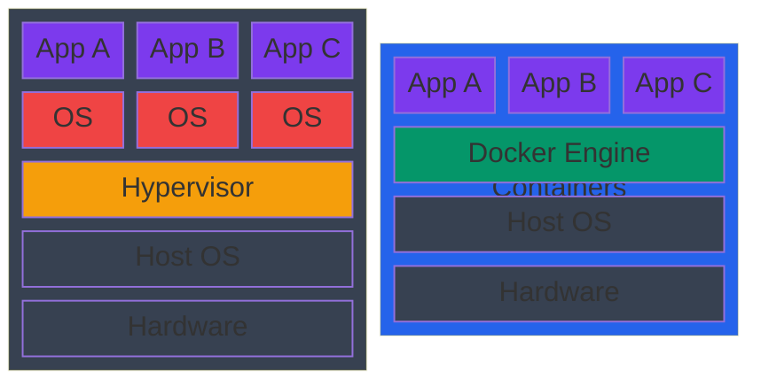
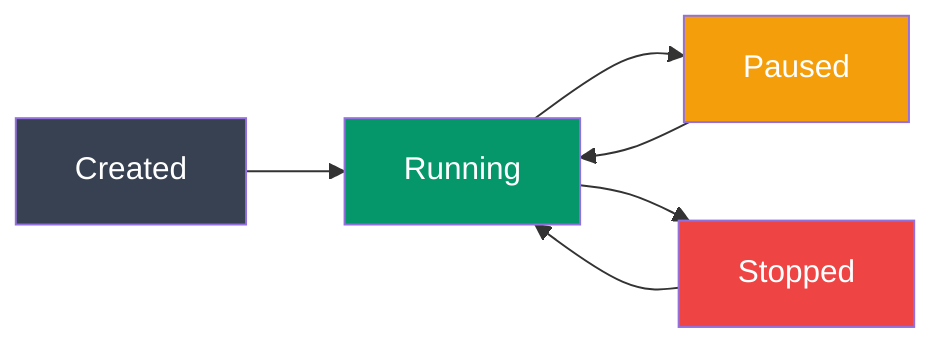

# Docker Basics

## What You'll Learn

- What Docker is and why it matters
- Key Docker concepts: images, containers, registries
- Essential Docker commands
- Building your first container
- Running and managing containers

---

## What is Docker?

**Docker** is a platform for developing, shipping, and running applications in **containers**.

### Container vs Virtual Machine

| Virtual Machine | Container |
|----------------|-----------|
| Includes entire OS (GB) | Shares host OS kernel (MB) |
| Minutes to start | Seconds to start |
| Heavy resource usage | Lightweight |
| Strong isolation | Process-level isolation |
| VMware, VirtualBox | Docker, containerd |



```
┌─────────────────────────────┐   ┌─────────────────────────────┐
│     Virtual Machines        │   │        Containers           │
├─────────────────────────────┤   ├─────────────────────────────┤
│  App A  │  App B  │  App C  │   │  App A  │  App B  │  App C  │
├─────────┼─────────┼─────────┤   ├─────────┼─────────┼─────────┤
│  OS     │  OS     │  OS     │   │        Docker Engine        │
├─────────┴─────────┴─────────┤   ├─────────────────────────────┤
│       Hypervisor            │   │        Host OS              │
├─────────────────────────────┤   ├─────────────────────────────┤
│       Host OS               │   │        Hardware             │
├─────────────────────────────┤   └─────────────────────────────┘
│       Hardware              │
└─────────────────────────────┘
```

---

## Why Use Docker?

### 1. **Consistency Across Environments**
"It works on my machine" → "It works everywhere"

```bash
# Same container runs on:
- Developer laptop (Windows, Mac, Linux)
- CI/CD server
- Staging environment
- Production servers
```

### 2. **Fast and Lightweight**
Containers start in seconds, not minutes.

### 3. **Isolation**
Each container runs independently with its own filesystem, network, and process space.

### 4. **Easy Scaling**
Spin up 10 identical containers in seconds.

### 5. **Version Control for Infrastructure**
Dockerfiles are code → track changes in Git.

---

## Key Docker Concepts

### 1. **Image**
A blueprint/template for containers. Read-only.

```bash
# Think of it as:
Image = Class (in OOP)
Container = Instance of that class
```

### 2. **Container**
A running instance of an image. Containers are isolated processes.

### 3. **Dockerfile**
A text file with instructions to build an image.

### 4. **Registry**
A repository for storing and sharing images (Docker Hub, AWS ECR, GitHub Container Registry).

### 5. **Docker Engine**
The runtime that builds and runs containers.

---

## Installing Docker

### Windows / Mac
Download **Docker Desktop**: https://www.docker.com/products/docker-desktop/

### Linux (Ubuntu/Debian)
```bash
# Install Docker
curl -fsSL https://get.docker.com -o get-docker.sh
sudo sh get-docker.sh

# Add your user to docker group (avoid using sudo)
sudo usermod -aG docker $USER

# Verify installation
docker --version
docker run hello-world
```

---

## Essential Docker Commands

### Check Docker Version
```bash
docker --version
docker info
```

### Images

```bash
# List all local images
docker images
docker image ls

# Pull an image from Docker Hub
docker pull nginx
docker pull node:18-alpine

# Remove an image
docker rmi nginx
docker image rm nginx

# Search for images on Docker Hub
docker search postgres
```

### Containers

```bash
# List running containers
docker ps

# List all containers (including stopped)
docker ps -a

# Run a container
docker run nginx

# Run container in background (detached mode)
docker run -d nginx

# Run container with a name
docker run -d --name my-nginx nginx

# Run container and map ports (host:container)
docker run -d -p 8080:80 nginx
# Now access at http://localhost:8080

# Stop a container
docker stop my-nginx

# Start a stopped container
docker start my-nginx

# Restart a container
docker restart my-nginx

# Remove a container
docker rm my-nginx

# Remove a running container (force)
docker rm -f my-nginx

# View container logs
docker logs my-nginx
docker logs -f my-nginx  # Follow logs in real-time

# Execute command inside running container
docker exec -it my-nginx bash
docker exec my-nginx ls /usr/share/nginx/html

# Interactive terminal
docker exec -it my-nginx sh
```

---

## Running Your First Container

### Example 1: Nginx Web Server

```bash
# Run Nginx on port 8080
docker run -d -p 8080:80 --name web nginx

# Check if it's running
docker ps

# Visit http://localhost:8080 in your browser
# You should see "Welcome to nginx!"

# View logs
docker logs web

# Stop and remove
docker stop web
docker rm web
```

### Example 2: Node.js Application

```bash
# Run Node.js container with interactive shell
docker run -it node:18-alpine sh

# Inside container:
node --version
npm --version
exit
```

### Example 3: PostgreSQL Database

```bash
# Run PostgreSQL with environment variables
docker run -d \
  --name postgres-db \
  -e POSTGRES_PASSWORD=mysecretpassword \
  -e POSTGRES_DB=myapp \
  -p 5432:5432 \
  postgres:15-alpine

# Connect to it
docker exec -it postgres-db psql -U postgres -d myapp

# Inside PostgreSQL:
\l                    # List databases
CREATE TABLE users (id SERIAL PRIMARY KEY, name TEXT);
\dt                   # List tables
\q                    # Quit

# Stop and remove
docker stop postgres-db
docker rm postgres-db
```

---

## Docker Run Options

### Common Flags

```bash
docker run [OPTIONS] IMAGE [COMMAND]

# Most used options:
-d, --detach              # Run in background
-p, --publish 8080:80    # Map ports (host:container)
--name my-container      # Give container a name
-e, --env KEY=value      # Set environment variable
-v, --volume /host:/container  # Mount volume
--rm                     # Remove container when it stops
-it                      # Interactive terminal (combined -i -t)
--network bridge         # Specify network
--restart always         # Restart policy
```

### Example with Multiple Options

```bash
docker run -d \
  --name my-app \
  -p 3000:3000 \
  -e NODE_ENV=production \
  -e DATABASE_URL=postgres://localhost/mydb \
  --restart unless-stopped \
  node:18-alpine \
  node server.js
```

---

## Container Lifecycle



```
┌────────────────────────────────────────────────┐
│                                                │
│   Created → Running → Paused → Stopped         │
│      ↑         │                    │          │
│      └─────────┴────────────────────┘          │
│              (start/restart)                   │
│                                                │
└────────────────────────────────────────────────┘
```

```bash
# Create but don't start
docker create --name my-container nginx

# Start a created/stopped container
docker start my-container

# Pause a running container
docker pause my-container

# Unpause
docker unpause my-container

# Stop (graceful shutdown)
docker stop my-container

# Kill (immediate stop)
docker kill my-container

# Remove
docker rm my-container
```

---

## Inspecting Containers

### Get Container Details
```bash
# Full details (JSON)
docker inspect my-container

# Get specific field (IP address)
docker inspect -f '{{.NetworkSettings.IPAddress}}' my-container

# View resource usage
docker stats my-container

# View processes running in container
docker top my-container
```

---

## Cleaning Up

### Remove Stopped Containers
```bash
# Remove one container
docker rm my-container

# Remove all stopped containers
docker container prune

# Remove all containers (running and stopped)
docker rm -f $(docker ps -aq)
```

### Remove Images
```bash
# Remove unused images
docker image prune

# Remove all images
docker rmi $(docker images -q)
```

### Remove Everything
```bash
# Nuclear option: remove everything (containers, images, volumes, networks)
docker system prune -a --volumes
```

---

## Docker Hub: Public Registry

[Docker Hub](https://hub.docker.com/) is the default registry for Docker images.

### Popular Official Images
- `node` - Node.js runtime
- `python` - Python runtime
- `nginx` - Web server
- `postgres` - PostgreSQL database
- `redis` - Redis cache
- `mongo` - MongoDB database
- `ubuntu` - Ubuntu OS

### Image Tags
```bash
# Pull specific version
docker pull node:18-alpine     # Node 18 on Alpine Linux
docker pull node:18            # Node 18 on Debian
docker pull node:latest        # Latest version (not recommended for production!)

# Image naming format:
[registry/][username/]repository:tag

# Examples:
nginx:latest                   # Docker Hub official
myusername/myapp:v1.0         # Docker Hub user image
ghcr.io/myorg/myapp:latest    # GitHub Container Registry
```

---

## Practical Example: Running a Complete Web App

```bash
# 1. Run a Redis cache
docker run -d --name redis redis:alpine

# 2. Run a PostgreSQL database
docker run -d \
  --name postgres \
  -e POSTGRES_PASSWORD=secret \
  postgres:15-alpine

# 3. Run a Node.js app (connecting to the above)
docker run -d \
  --name api \
  -p 3000:3000 \
  -e REDIS_HOST=redis \
  -e DB_HOST=postgres \
  --link redis \
  --link postgres \
  node:18-alpine

# Note: --link is deprecated, we'll use Docker networks in the next tutorial
```

---

## Exercise

### Task 1: Run and Explore Containers
```bash
# 1. Pull and run an Nginx container on port 8080
docker run -d -p 8080:80 --name my-nginx nginx

# 2. Check that it's running
docker ps

# 3. Access http://localhost:8080 in your browser

# 4. View the logs
docker logs my-nginx

# 5. Execute a command inside the container
docker exec my-nginx cat /etc/nginx/nginx.conf

# 6. Open an interactive shell
docker exec -it my-nginx bash

# 7. Stop and remove the container
docker stop my-nginx && docker rm my-nginx
```

### Task 2: Run a Database
```bash
# 1. Run MySQL with a custom password
docker run -d \
  --name mysql-db \
  -e MYSQL_ROOT_PASSWORD=mypassword \
  -e MYSQL_DATABASE=testdb \
  -p 3306:3306 \
  mysql:8

# 2. Connect to it
docker exec -it mysql-db mysql -u root -p
# Enter password: mypassword

# 3. Create a table
USE testdb;
CREATE TABLE users (id INT PRIMARY KEY, name VARCHAR(100));
SHOW TABLES;
exit;

# 4. Clean up
docker stop mysql-db && docker rm mysql-db
```

---

## Common Pitfalls

### 1. Port Already in Use
```bash
# Error: port 8080 already allocated
# Solution: Use a different port or stop the conflicting service
docker run -d -p 8081:80 nginx  # Use port 8081 instead
```

### 2. Image Not Found
```bash
# Error: Unable to find image 'ngnix:latest' locally
# Solution: Check spelling
docker run nginx  # Correct spelling
```

### 3. Permission Denied (Linux)
```bash
# Error: permission denied while trying to connect to Docker daemon
# Solution: Add user to docker group
sudo usermod -aG docker $USER
# Then log out and log back in
```

---

## Key Takeaways

✅ **Containers are lightweight, fast, and isolated**  
✅ **Images are blueprints, containers are running instances**  
✅ **Docker Hub is the default registry for images**  
✅ **Use `-d` to run containers in the background**  
✅ **Use `-p` to map ports from container to host**  
✅ **Use `docker logs` to debug containers**  
✅ **Use `docker exec -it` to get a shell inside a container**

---

**Next**: [Dockerfile Best Practices](./03_dockerfile_best_practices.md) → Learn to build your own images
