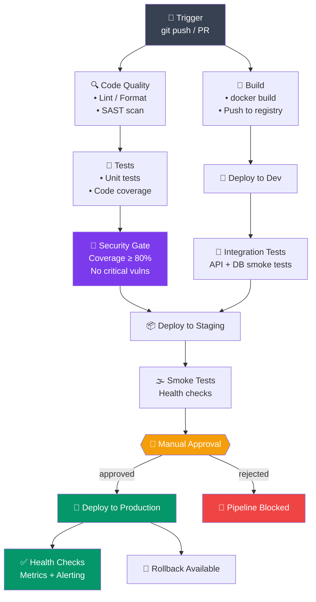

# CI/CD Concepts

> Continuous Integration, Continuous Deployment, aur reliable software delivery ke liye pipelines kaise design karte hain — yeh sab samjhenge is note mein, ekdum devops-engineer-explaining-over-chai style mein.

## Table of Contents
1. [CI vs CD](#ci-vs-cd)
2. [Pipeline Architecture](#pipeline-architecture)
3. [Stages and Gates](#stages-and-gates)
4. [Automated Testing](#automated-testing)
5. [Artifacts and Dependencies](#artifacts-and-dependencies)
6. [Failure Handling](#failure-handling)
7. [Best Practices](#best-practices)

---

## CI vs CD

Socho tum Zomato ke backend team mein kaam karte ho. Roz 15-20 developers alag-alag features pe kaam kar rahe hain — koi payment flow fix kar raha hai, koi restaurant search improve kar raha hai. Agar sabka code hafte ke end mein ek saath merge kiya jaaye, toh conflicts ka tsunami aa jaayega aur "yeh mere machine pe toh chal raha tha" wala classic dialogue sunne ko milega. Isi problem ko solve karne ke liye CI/CD ka concept aaya.

### Continuous Integration (CI)

**Kya hota hai?** CI ka matlab hai — code changes ko baar-baar (ideally din mein kayi baar) ek shared repository mein integrate karna, aur har baar automatically build + test chalana taaki problems jaldi pakड़ mein aayein.

```
Developer commits code
        ↓
Automated build
        ↓
Automated tests
        ↓
Code quality checks
        ↓
Report results
```

**Kyun zaruri hai?** Zara socho — agar tum apna feature branch 2 hafte tak alag rakho aur phir main branch mein merge karo, toh ho sakta hai dusre 5 logon ne bhi same files change kar di ho. Merge conflicts ka nightmare shuru. CI isliye kehta hai — "bhai roz commit karo, roz test karo" — taaki chhoti chhoti problems turant pakड़ mein aa jaayein, bade disaster mein badalne se pehle.

**Goals:**
- Integration issues ko jaldi detect karna (ek din ka bug, ek mahine ka bug nahi banta)
- Code quality maintain rakhna
- Production mein jaane se pehle bugs pakड़na
- Developers ko fast feedback dena — "bhai tumhara code tod diya build" wala message 2 minute mein aana chahiye, 2 din mein nahi

```bash
# CI runs on every commit/PR
git push origin feature/my-feature
# Automatically:
# 1. Builds application
# 2. Runs unit tests
# 3. Runs integration tests
# 4. Checks code quality
# 5. Reports results in PR
```

Jaise hi tum push karte ho, GitHub Actions ya Jenkins jaisa CI tool background mein automatically yeh sab kar deta hai — tumhe manually kuch bhi run karne ki zarurat nahi. Yeh bilkul waise hai jaise Swiggy pe order dete hi automatically restaurant ko notification chala jaata hai, delivery partner assign ho jaata hai — sab kuch pipeline mein chalta hai, koi manually phone nahi karta.

### Continuous Deployment (CD)

**Kya hota hai?** CD ka matlab hai — jo code CI se pass ho gaya (matlab tests clear kar liye), usko automatically production tak deploy kar dena, bina kisi manual intervention ke.

```
Code passes CI
        ↓
Build artifact (Docker image)
        ↓
Deploy to staging
        ↓
Run smoke tests
        ↓
Deploy to production
        ↓
Verify health checks
```

**Kyun zaruri hai?** Manual deployment mein bahut saari human error ki gunjaish hoti hai — koi galat server pe deploy kar de, koi environment variable bhool jaaye, koi ek step skip kar de. CD is poore process ko automate kar deta hai, exactly waise hi jaise IRCTC ka Tatkal booking system — ek defined sequence follow hota hai, har baar same tareeke se, koi manual galti ki gunjaish nahi.

**Goals:**
- Automated, reliable deployments (har baar same process, koi surprises nahi)
- Manual errors kam karna
- Deployment pe fast feedback milna (deploy hua ya nahi, foran pata chal jaaye)
- Rollback easy hona (kuch galat hua toh turant purane version pe wapas jaa sako)

### Continuous Delivery vs. Continuous Deployment

Yahan pe ek common confusion hoti hai — "Continuous Delivery" aur "Continuous Deployment" sunne mein same lagte hain, but inmein ek important fark hai.

**Continuous Delivery** mein code hamesha production-ready state mein rehta hai (saare tests pass, artifact ready), lekin production mein actually push karne ke liye ek **insaan** button dabata hai. Jaise Flipkart Big Billion Day sale se pehle team manually decide karti hai "abhi push karna hai ya nahi" — code toh ready hai, bas final go-ahead insaan deta hai.

**Continuous Deployment** mein yeh manual step bhi hata diya jaata hai — jaise hi code tests pass kar leta hai, woh automatically production mein chala jaata hai. Koi insaan beech mein button nahi dabata.

| Aspect | Continuous Delivery | Continuous Deployment |
|--------|-------------------|----------------------|
| **Deployment** | Manual trigger to prod | Automatic to prod |
| **Risk** | Lower (human approval) | Higher (fully automated) |
| **Speed** | Medium | Fast |
| **Best For** | Production systems | Internal/non-critical |

> [!tip]
> Zyadatar companies (khaas kar fintech ya payment jaisi critical cheezein — CRED, Paytm socho) Continuous **Delivery** use karti hain, kyunki production mein galti ka matlab paise ka loss ho sakta hai. Internal tools ya kam-risk services ke liye Continuous **Deployment** zyada common hai.

---

## Pipeline Architecture

**Kya hota hai pipeline?** Pipeline basically ek automated assembly line hai — jaise Maruti ki factory mein car banti hai step-by-step (chassis → engine → paint → quality check → dispatch), waise hi code bhi ek pipeline se guzarta hai (build → test → deploy).

### Simple Pipeline

Sabse basic version — chhoti team ya side-project ke liye kaafi hai:

```
Trigger (git push)
        ↓
Checkout code
        ↓
Build
        ↓
Test
        ↓
Deploy
```

Yeh bilkul ek chhoti si chai ki dukaan jaisa hai — order aaya, chai bani, cup mein daali, customer ko di. Simple, linear, seedha.

### Complex Pipeline

Ab jab tumhari team badी ho jaati hai aur production ek real business chala raha hota hai (jaise Ola ya OYO ka backend), toh pipeline mein aur bhi checks add karne padते hain — security scanning, code coverage thresholds, manual approval gates, health monitoring, rollback capability. Neeche diagram mein poora enterprise-grade flow dikhaya gaya hai:



Isko dekho aise — **Code Quality** aur **Build** dono ek saath (parallel) shuru hote hain, kyunki dono independent kaam hain, waqt bachate hain. Uske baad Tests aur Dev deployment hoti hai. Fir ek **Security Gate** hai — coverage aur vulnerabilities check hoti hain, agar yeh fail hui toh aage kuch nahi badhega. Staging pe smoke tests hote hain, aur phir production jaane se pehle ek **insaan** ko approve karna padta hai (bilkul jaise UPI mein high-value transaction pe OTP maangta hai — ek extra safety net).

### Workflow Definition

Yeh raha ek real-world jaisa GitHub Actions workflow file (`.github/workflows/ci.yml`):

```yaml
# Pseudo-code pipeline
name: Build and Deploy

on:
  push:
    branches: [main, develop]
  pull_request:
    branches: [main]

jobs:
  build:
    runs-on: ubuntu-latest
    steps:
      - uses: actions/checkout@v3
      - name: Build
        run: npm run build
      - name: Test
        run: npm test
      - name: Upload Artifact
        uses: actions/upload-artifact@v3
        with:
          name: build
          path: dist/

  deploy:
    needs: build
    if: github.ref == 'refs/heads/main'
    runs-on: ubuntu-latest
    steps:
      - uses: actions/download-artifact@v3
        with:
          name: build
      - name: Deploy
        run: ./deploy.sh
```

Yahan `on:` block define karta hai **kab** pipeline trigger hogi (main/develop pe push hone par, ya PR pe). `jobs.build.needs` isn't present here but `deploy` job mein `needs: build` likha hai — matlab **deploy tabhi chalega jab build safaltapoorvak complete ho**. Aur `if: github.ref == 'refs/heads/main'` ka matlab hai — deploy sirf tab hoga jab branch `main` ho, feature branches pe nahi. Yeh bilkul waise hai jaise IRCTC sirf confirmed ticket ko hi boarding allow karta hai — waitlist wale ko nahi.

---

## Stages and Gates

**Kya hote hain gates?** Gates basically "checkpoints" hain pipeline mein — jaise airport security check. Agar tumhare paas boarding pass nahi hai, toh tum aage nahi badh sakte, chahe tumhara flight kितna bhi zaruri ho. Waise hi, agar koi gate fail hota hai (jaise coverage 80% se kam hai), toh pipeline aage nahi badhegi, chahe deployment kितna bhi urgent kyun na ho.

### Build Stage

```yaml
stage: Build
script:
  - npm install
  - npm run build
artifacts:
  paths:
    - dist/
  expire_in: 1 week
```

**Gates:**
- Syntax validation (code compile hota hai ya nahi)
- Dependency resolution (saare packages sahi se install hue ya nahi)
- Compilation success

Yeh sabse pehla gate hai — agar tumhara code hi compile nahi ho raha, toh aage test karne ka koi matlab nahi. Bilkul waise jaise recipe follow karne se pehle check karte ho ki saari sabziyan ghar pe hain ya nahi.

### Test Stage

```yaml
stage: Test
script:
  - npm test -- --coverage
  - npm run test:integration
dependencies:
  - build
coverage: '/Coverage: (\d+\.\d+%)/'
```

**Gates:**
- Unit test pass rate (e.g., >80%)
- Integration test success
- Code coverage threshold

`dependencies: - build` batata hai ki test stage ko build stage ke artifacts chahiye (jaise compiled files). `coverage:` regex se CI tool coverage percentage nikaal ke usko UI mein dikhata hai.

### Quality Gate

```yaml
stage: Quality
script:
  - npm run lint
  - npm run security:audit
  - sonar-scanner
allow_failure: false  # Blocks pipeline if fails
```

**Gates:**
- Code style compliance
- Security vulnerabilities
- SonarQube quality score

`allow_failure: false` yahan ka sabse important part hai — iska matlab hai agar yeh stage fail hui, toh poori pipeline ruk jaayegi. Isse yeh confirm hota hai ki koi bhi buggy ya insecure code aage staging/production tak na pahunche.

### Approval Gate

```yaml
deploy_production:
  stage: Deploy
  environment:
    name: production
    url: https://app.example.com
  script:
    - ./deploy.sh
  when: manual  # Requires manual approval
  only:
    - main
```

`when: manual` ka matlab hai — pipeline automatically yahan pahunch toh jaayegi, but production deploy ka button koi insaan (usually team lead ya on-call engineer) manually click karega. Yeh CRED ke high-value UPI transactions jaisa hai — system sab kuch ready kar deta hai, but final "confirm" ek insaan hi dabata hai.

---

## Automated Testing

**Kya hota hai Test Pyramid?** Yeh ek mental model hai jo batata hai — kitne tests kis type ke hone chahiye. Neeche wala layer (Unit Tests) sabse zyada hona chahiye kyunki woh fast aur cheap hote hain, aur upar wala layer (E2E) sabse kam kyunki woh slow aur costly hote hain.

```
                    Test Pyramid
                       /\
                      /  \
                   E2E /  \ (5%)
                     /      \
                    /────────\
                  /            \
            Integration      (15%)
              /                  \
            /────────────────────\
          /                        \
      Unit Tests                  (80%)
    /──────────────────────────────\
```

Socho isko IRCTC ke testing strategy jaisa — pehle chhoti-chhoti cheezein test hoti hain (kya seat allocation function sahi kaam kar raha hai?), phir modules ke beech interaction (kya payment module aur booking module sahi se baat kar rahe hain?), aur sabse kam hote hain full end-to-end tests (poora ek user journey — login se lekar ticket book hone tak).

### Unit Tests

**Kya hote hain?** Sabse chhote, sabse isolated tests — ek single function ya component ko test karte hain, bina kisi external dependency (database, API, network) ke.

```javascript
// test.js
describe('Calculator', () => {
  it('should add two numbers', () => {
    expect(add(2, 3)).toBe(5);
  });
});
```

```yaml
# CI step
test:unit:
  script: npm test
  coverage: '/Statements\s*:\s*(\d+\.?\d*)%/'
```

Yeh milliseconds mein chalte hain, isliye har commit pe chalane mein koi dikkat nahi hoti. Zomato ke context mein socho — "kya discount calculation function sahi discount nikaal raha hai?" — yeh ek unit test hoga, koi real order ki zarurat nahi.

### Integration Tests

**Kya hote hain?** Yeh check karte hain ki tumhare system ke alag-alag parts (jaise API aur database) sahi se saath mein kaam kar rahe hain ya nahi.

```javascript
// test.integration.js
describe('API Integration', () => {
  it('should fetch users from database', async () => {
    const users = await api.get('/users');
    expect(users).toHaveLength(3);
  });
});
```

Isme actual database ya ek test database use hota hai — matlab yeh unit test se thoda slow hota hai, kyunki real network calls involve hoti hain.

### End-to-End Tests

**Kya hote hain?** Poore user journey ko simulate karna, jaise real user browser mein click kar raha ho.

```javascript
// test.e2e.js
describe('User Flow', () => {
  it('should login and view dashboard', () => {
    cy.visit('/login');
    cy.get('[name=email]').type('user@example.com');
    cy.get('[name=password]').type('password');
    cy.get('button[type=submit]').click();
    cy.url().should('include', '/dashboard');
  });
});
```

Yeh Cypress jaisa tool use karke poora flow test karta hai — login karo, dashboard dikhna chahiye. Bilkul jaise Swiggy app pe QA team manually check karti thi (ab automated hai) — "order place karo, payment karo, order tracking dikhna chahiye" — poora flow ek saath.

> [!warning]
> E2E tests slow aur flaky (kabhi pass, kabhi fail bina code change ke) hote hain, isliye inhe kam rakho aur sirf critical user journeys ke liye use karo — poore app ke har button ke liye E2E test mat likho, warna pipeline ghante bhar chalegi.

### Test Reporting

```yaml
test:
  script:
    - npm test -- --reporters=junit,coverage
  artifacts:
    when: always
    reports:
      junit: test-results.xml
      coverage_report:
        coverage_format: cobertura
        path: coverage/cobertura-coverage.xml
```

`when: always` important hai — matlab test fail bhi ho jaaye, tab bhi report generate hogi aur save hogi, taaki tum baad mein dekh sako ki kya galat hua. Agar sirf success pe hi report save hoti, toh failure debug karna mushkil ho jaata.

---

## Artifacts and Dependencies

### Artifacts

**Kya hote hain artifacts?** Build stage ke output files — jaise compiled JavaScript bundle, Docker image, ya `.jar` file — jo baad ke stages (test, deploy) use karte hain. Inhe baar-baar build karne ki zarurat nahi, ek baar bana ke store kar liya, aage pass kar diya.

```yaml
build:
  script:
    - npm run build
  artifacts:
    paths:
      - dist/
      - build/
    exclude:
      - dist/temp/**
    name: build-$CI_COMMIT_SHA
    expire_in: 30 days
```

Socho isko aise — Swiggy kitchen mein khaana bana (build), usko packed box mein rakha (artifact), phir delivery partner (deploy stage) usi packed box ko pick karke customer tak le jaata hai — khaana dobara nahi banana padता. `expire_in: 30 days` matlab 30 din baad yeh artifact automatically delete ho jaayega — storage bachane ke liye.

### Dependencies Between Jobs

**Kyun zaruri hai?** Kuch jobs doosre jobs ke complete hone ka wait karti hain — jaise test job ko build job ke output (artifacts) chahiye hote hain.

```yaml
workflow:
  rules:
    - if: $CI_PIPELINE_SOURCE == 'merge_request_event'

build:
  stage: build
  script: npm run build
  artifacts:
    paths: [dist/]

test:
  stage: test
  needs: ["build"]  # This job needs build to complete
  dependencies:
    - build
  script: npm test

deploy:
  stage: deploy
  needs:
    - job: test
      artifacts: true
    - job: build
      artifacts: true
  script: npm run deploy
```

`needs:` keyword batata hai job dependency graph — `test` job `build` khatam hone ka wait karega, aur `deploy` job dono `test` aur `build` ke artifacts use karega. Yeh bilkul railway reservation system jaisa hai — pehle seat availability check hoti hai (build), phir payment process hota hai (test), tab jaake ticket confirm hota hai (deploy). Ek step doosre pe depend karta hai.

### Parallel Jobs

**Kyun zaruri hai?** Agar teen alag-alag test suites (unit, integration, e2e) ek doosre pe depend nahi karte, toh unhe ek ke baad ek chalane ka koi fayda nahi — parallel mein chalao, time bachao.

```yaml
test:unit:
  stage: test
  script: npm run test:unit

test:integration:
  stage: test
  script: npm run test:integration
  # Runs in parallel with test:unit

test:e2e:
  stage: test
  script: npm run test:e2e
  # All three test jobs run simultaneously
  allow_failure: true  # Don't fail pipeline
```

Yeh teeno jobs same `stage: test` mein hain, isliye CI tool inhe automatically parallel mein chalata hai — jaise Zomato mein ek saath teen alag kitchens teen alag orders bana rahi hon, ek doosre ka wait nahi kar rahi. `allow_failure: true` batata hai ki agar E2E test fail bhi ho jaaye, toh poori pipeline red nahi hogi (kyunki E2E flaky ho sakte hain).

---

## Failure Handling

**Kyun zaruri hai?** Real world mein network glitches, temporary server issues, ya flaky tests ki wajah se pipeline kabhi-kabhi fail ho jaati hai bina kisi real bug ke. Isliye smart retry aur notification logic hona chahiye.

### Retry Logic

```yaml
deploy:
  script: npm run deploy
  retry:
    max: 2
    when:
      - script_failure
      - runner_system_failure
```

Yeh batata hai — agar deploy fail ho, toh 2 baar aur try karo (total 3 attempts), lekin sirf `script_failure` ya `runner_system_failure` jaisi wajah se. Yeh bilkul waise hai jaise UPI transaction fail hone pe app automatically ek do baar retry karta hai before showing "transaction failed" — kyunki ho sakta hai temporary network glitch ho, tumhara paisa toh sahi hai.

### Conditional Execution

```yaml
test:
  script: npm test
  only:
    - merge_requests
    - main
  except:
    - tags

deploy:
  script: npm run deploy
  only:
    - main
  when: on_success  # Only if previous steps succeeded
```

`only` aur `except` control karte hain **kab** ek job chalegi. Yahan test sirf merge requests aur main branch pe chalega, tags pe nahi. `when: on_success` ka matlab hai — deploy tabhi chalega jab pehle ke saare steps successfully pass ho gaye ho, warna nahi — bilkul waise jaise IRCTC payment successful hone ke baad hi ticket generate hota hai, uske pehle nahi.

### Error Notifications

```yaml
on_failure:
  name: slack-notification
  script: |
    curl -X POST $SLACK_WEBHOOK \
      -d "{'text': 'Pipeline failed: $CI_COMMIT_MESSAGE'}"
```

Jab pipeline fail hoti hai, team ko turant pata chalna chahiye — Slack notification bhej do. Yeh bilkul Ola driver app jaisa hai — agar ride cancel ho jaaye, turant driver aur rider dono ko notification jaati hai, koi manually check nahi karta.

> [!info]
> Production-grade setups mein sirf Slack hi nahi, PagerDuty ya OpsGenie jaise tools bhi use hote hain jo on-call engineer ko raat 3 baje bhi phone call kar dete hain agar critical pipeline fail ho — kyunki kuch failures itni urgent hoti hain ki Slack message kaafi nahi hota.

---

## Best Practices

### 1. Fast Feedback

**Kyun zaruri hai?** Agar tumhe pata chalega ki tumhara code toड़ diya hai 2 minute mein, toh fix karna easy hai — context fresh hai dimaag mein. Lekin agar 30 minute baad pata chale, tab tak tum kisi aur kaam mein lag chuke hoge aur context switch karna padega.

```yaml
# ✅ Good: Quick feedback
build_and_test:
  parallel:
    - npm run lint
    - npm run test:unit
    - npm run build
  timeout: 5 minutes

# ❌ Bad: Slow feedback
build_and_test:
  script:
    - npm run lint
    - npm test
    - npm run test:integration
    - npm run test:e2e
    - npm run build
  timeout: 30 minutes
```

Sequentially sab kuch chalane ki bajaye, jo independent hai usse parallel mein chalao. Fast feedback loop = happy developers.

### 2. Fail Fast

**Kyun zaruri hai?** Agar lint hi fail ho gaya, toh build aur test chalane ka koi fayda nahi — resources aur time dono waste honge.

```yaml
# Stop pipeline on first failure
stages:
  - lint
  - build
  - test
  - deploy

lint:
  stage: lint
  script: npm run lint
  # If this fails, rest of pipeline stops immediately

build:
  stage: build
  script: npm run build
  # Only runs if lint passes
```

Cheapest aur fastest checks pehle rakho (lint), expensive checks baad mein (E2E tests, deploy). Yeh bilkul waise hai jaise interview mein pehle resume screening hoti hai (fast, cheap), tab jaake technical round hota hai (slow, expensive) — pehle hi filter kar do jo qualify nahi karta.

### 3. Cache Dependencies

**Kyun zaruri hai?** `npm install` har baar poori duniya se packages download karna time-consuming hai. Agar dependencies change nahi hui, toh cache use karo — pipeline fast chalegi.

```yaml
stages:
  - build
  - test

variables:
  npm_config_cache: "$CI_PROJECT_DIR/.npm"
  npm_config_prefer_offline: "true"

cache:
  paths:
    - .npm
    - node_modules/

build:
  stage: build
  cache:
    paths:
      - node_modules/
  script:
    - npm ci
    - npm run build
```

Isko socho aise — ghar pe har baar kirana saaman lene bazaar jaane ki bajaye, ek hafte ka saaman ek saath store kar lo (cache). Zaruri cheez already available hai, baar-baar bazaar jaane ki zarurat nahi.

### 4. Secure Secrets

**Kyun zaruri hai?** API keys, database passwords, AWS credentials — inhe kabhi bhi plaintext mein code mein ya YAML file mein hardcode nahi karna chahiye. CI/CD tools "secret variables" ka feature dete hain jo encrypted store hote hain.

```yaml
deploy:
  script:
    - aws s3 cp file.txt s3://bucket/
  environment:
    name: production
  variables:
    AWS_ACCESS_KEY_ID: $PROD_AWS_KEY  # Stored as secret variable
    AWS_SECRET_ACCESS_KEY: $PROD_AWS_SECRET
```

> [!warning]
> Kabhi bhi secrets ko GitHub repo mein commit mat karo — chahe woh private repo hi kyun na ho. Ek baar git history mein aa gaya, permanently wahan rahega jab tak history rewrite na karo. Hamesha `$SECRET_NAME` jaisa environment variable use karo jo CI/CD platform ki secret storage (GitHub Secrets, GitLab CI/CD Variables) se aata hai.

### 5. Clear Status Reporting

**Kyun zaruri hai?** Jab pipeline fail ho, developer ko turant samajh aana chahiye **kya** aur **kahan** galat hua — vague error message se time waste hota hai.

```bash
# CI should report:
✓ Tests passed (456 tests)
✓ Code coverage: 85%
✓ Security scan: 0 vulnerabilities
✓ Deployment successful

Or:

✗ Build failed
  └─ TypeError: Cannot read property of undefined
    at src/index.js:42:15
```

Achha CI setup exact file aur line number bata deta hai jahan problem hai — bilkul Google Maps jaisa, "yahan galat mud gaye" nahi bolta, exact turn bata deta hai.

---

## Practical Example: Complete Pipeline

Ab yeh sab concepts ko ek real GitHub Actions workflow mein jodते hain — ek typical Node.js app ka lint → test → build → deploy pipeline:

```yaml
name: CI/CD Pipeline

on:
  push:
    branches: [main, develop]
  pull_request:
    branches: [main]

jobs:
  # Lint Code
  lint:
    runs-on: ubuntu-latest
    steps:
      - uses: actions/checkout@v3
      - uses: actions/setup-node@v3
        with:
          node-version: 18
          cache: 'npm'
      - run: npm ci
      - run: npm run lint

  # Run Tests
  test:
    runs-on: ubuntu-latest
    needs: lint
    steps:
      - uses: actions/checkout@v3
      - uses: actions/setup-node@v3
        with:
          node-version: 18
          cache: 'npm'
      - run: npm ci
      - run: npm test -- --coverage
      - uses: codecov/codecov-action@v3
        with:
          files: ./coverage/coverage-final.json

  # Build Docker Image
  build:
    runs-on: ubuntu-latest
    needs: test
    if: github.event_name == 'push' && github.ref == 'refs/heads/main'
    steps:
      - uses: actions/checkout@v3
      - uses: docker/build-push-action@v4
        with:
          context: .
          push: true
          tags: myapp:${{ github.sha }}

  # Deploy
  deploy:
    runs-on: ubuntu-latest
    needs: build
    if: github.event_name == 'push' && github.ref == 'refs/heads/main'
    environment:
      name: production
    steps:
      - name: Deploy to Production
        run: |
          curl -X POST ${{ secrets.DEPLOY_WEBHOOK }} \
            -d '{"image": "myapp:${{ github.sha }}"}'
```

Is poori pipeline ko step-by-step samjho:

1. **lint** — sabse pehle chalega, kyunki sabse fast aur cheap check hai
2. **test** — `needs: lint` ki wajah se sirf tab chalega jab lint pass ho
3. **build** — `needs: test` ki wajah se tests pass hone ke baad hi Docker image banegi, aur woh bhi sirf `main` branch pe push hone par
4. **deploy** — sabse aakhri, `secrets.DEPLOY_WEBHOOK` jaise secret variable ka use karke production ko notify karta hai ki naya image deploy karo

Yeh pura flow bilkul ek assembly line jaisa hai — har station apna specific kaam karta hai, aur agla station tabhi shuru hota hai jab pichla successfully complete ho jaaye.

## Key Takeaways

- **CI** har commit pe automated build + test chalata hai, taaki integration issues jaldi pakड़ mein aayein
- **CD** tested code ko automatically production tak deploy karta hai, manual errors kam karta hai
- **Continuous Delivery** mein production push manual hai, **Continuous Deployment** mein fully automatic
- **Pipeline** ek assembly-line jaisa structure hai — build → test → deploy, jahan complex pipelines mein parallel stages, security gates, aur manual approvals bhi hote hain
- **Gates** checkpoints hain — coverage threshold, security scan, lint — jo fail hone par aage badhne se rokte hain
- **Test Pyramid** batata hai testing strategy — zyada Unit tests (fast, cheap), kam Integration, sabse kam E2E (slow, costly)
- **Artifacts** build outputs hain jo stages ke beech pass hote hain, dobara build karne ki zarurat nahi padती
- **`needs`/`dependencies`** job order define karte hain — kaunsa job kiske complete hone ka wait karega
- **Failure handling** (retry, conditional execution, notifications) pipeline ko resilient banata hai
- Best practices: fast feedback do, fail fast raho, dependencies cache karo, secrets ko encrypted rakho, clear error reporting do

Next: [GitHub Actions Basics](./02_github_actions_basics.md) - implement CI/CD with GitHub
