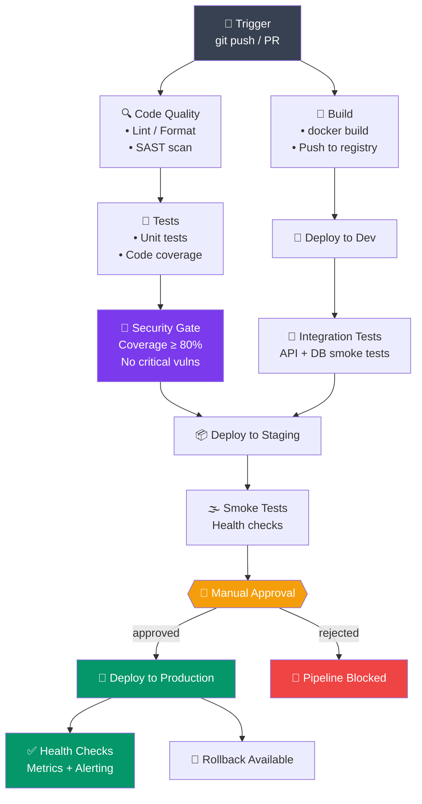

# CI/CD Concepts

> Understand continuous integration, continuous deployment, and how to design pipelines for reliable software delivery.

## Table of Contents
1. [CI vs CD](#ci-vs-cd)
2. [Pipeline Architecture](#pipeline-architecture)
3. [Stages and Gates](#stages-and-gates)
4. [Automated Testing](#automated-testing)
5. [Artifacts and Dependencies](#artifacts-and-dependencies)
6. [Failure Handling](#failure-handling)
7. [Best Practices](#best-practices)

---

## CI vs CD

### Continuous Integration (CI)

Frequent integration of code changes with automated testing.

```
Developer commits code
        ↓
Automated build
        ↓
Automated tests
        ↓
Code quality checks
        ↓
Report results
```

**Goals:**
- Detect integration issues early
- Maintain code quality
- Catch bugs before production
- Fast feedback to developers

```bash
# CI runs on every commit/PR
git push origin feature/my-feature
# Automatically:
# 1. Builds application
# 2. Runs unit tests
# 3. Runs integration tests
# 4. Checks code quality
# 5. Reports results in PR
```

### Continuous Deployment (CD)

Automatically deploy tested code to production.

```
Code passes CI
        ↓
Build artifact (Docker image)
        ↓
Deploy to staging
        ↓
Run smoke tests
        ↓
Deploy to production
        ↓
Verify health checks
```

**Goals:**
- Automated, reliable deployments
- Reduce manual errors
- Fast feedback on deployments
- Easy rollback capability

### Continuous Delivery vs. Continuous Deployment

| Aspect | Continuous Delivery | Continuous Deployment |
|--------|-------------------|----------------------|
| **Deployment** | Manual trigger to prod | Automatic to prod |
| **Risk** | Lower (human approval) | Higher (fully automated) |
| **Speed** | Medium | Fast |
| **Best For** | Production systems | Internal/non-critical |

---

## Pipeline Architecture

### Simple Pipeline

```
Trigger (git push)
        ↓
Checkout code
        ↓
Build
        ↓
Test
        ↓
Deploy
```

### Complex Pipeline



### Workflow Definition

```yaml
# Pseudo-code pipeline
name: Build and Deploy

on:
  push:
    branches: [main, develop]
  pull_request:
    branches: [main]

jobs:
  build:
    runs-on: ubuntu-latest
    steps:
      - uses: actions/checkout@v3
      - name: Build
        run: npm run build
      - name: Test
        run: npm test
      - name: Upload Artifact
        uses: actions/upload-artifact@v3
        with:
          name: build
          path: dist/

  deploy:
    needs: build
    if: github.ref == 'refs/heads/main'
    runs-on: ubuntu-latest
    steps:
      - uses: actions/download-artifact@v3
        with:
          name: build
      - name: Deploy
        run: ./deploy.sh
```

---

## Stages and Gates

### Build Stage

```yaml
stage: Build
script:
  - npm install
  - npm run build
artifacts:
  paths:
    - dist/
  expire_in: 1 week
```

**Gates:**
- Syntax validation
- Dependency resolution
- Compilation success

### Test Stage

```yaml
stage: Test
script:
  - npm test -- --coverage
  - npm run test:integration
dependencies:
  - build
coverage: '/Coverage: (\d+\.\d+%)/'
```

**Gates:**
- Unit test pass rate (e.g., >80%)
- Integration test success
- Code coverage threshold

### Quality Gate

```yaml
stage: Quality
script:
  - npm run lint
  - npm run security:audit
  - sonar-scanner
allow_failure: false  # Blocks pipeline if fails
```

**Gates:**
- Code style compliance
- Security vulnerabilities
- SonarQube quality score

### Approval Gate

```yaml
deploy_production:
  stage: Deploy
  environment:
    name: production
    url: https://app.example.com
  script:
    - ./deploy.sh
  when: manual  # Requires manual approval
  only:
    - main
```

---

## Automated Testing

### Test Types in CI/CD

```
                    Test Pyramid
                       /\
                      /  \
                   E2E /  \ (5%)
                     /      \
                    /────────\
                  /            \
            Integration      (15%)
              /                  \
            /────────────────────\
          /                        \
      Unit Tests                  (80%)
    /──────────────────────────────\
```

### Unit Tests

```javascript
// test.js
describe('Calculator', () => {
  it('should add two numbers', () => {
    expect(add(2, 3)).toBe(5);
  });
});
```

```yaml
# CI step
test:unit:
  script: npm test
  coverage: '/Statements\s*:\s*(\d+\.?\d*)%/'
```

### Integration Tests

```javascript
// test.integration.js
describe('API Integration', () => {
  it('should fetch users from database', async () => {
    const users = await api.get('/users');
    expect(users).toHaveLength(3);
  });
});
```

### End-to-End Tests

```javascript
// test.e2e.js
describe('User Flow', () => {
  it('should login and view dashboard', () => {
    cy.visit('/login');
    cy.get('[name=email]').type('user@example.com');
    cy.get('[name=password]').type('password');
    cy.get('button[type=submit]').click();
    cy.url().should('include', '/dashboard');
  });
});
```

### Test Reporting

```yaml
test:
  script:
    - npm test -- --reporters=junit,coverage
  artifacts:
    when: always
    reports:
      junit: test-results.xml
      coverage_report:
        coverage_format: cobertura
        path: coverage/cobertura-coverage.xml
```

---

## Artifacts and Dependencies

### Artifacts

Build outputs saved for later stages.

```yaml
build:
  script:
    - npm run build
  artifacts:
    paths:
      - dist/
      - build/
    exclude:
      - dist/temp/**
    name: build-$CI_COMMIT_SHA
    expire_in: 30 days
```

### Dependencies Between Jobs

```yaml
workflow:
  rules:
    - if: $CI_PIPELINE_SOURCE == 'merge_request_event'

build:
  stage: build
  script: npm run build
  artifacts:
    paths: [dist/]

test:
  stage: test
  needs: ["build"]  # This job needs build to complete
  dependencies:
    - build
  script: npm test

deploy:
  stage: deploy
  needs:
    - job: test
      artifacts: true
    - job: build
      artifacts: true
  script: npm run deploy
```

### Parallel Jobs

```yaml
test:unit:
  stage: test
  script: npm run test:unit

test:integration:
  stage: test
  script: npm run test:integration
  # Runs in parallel with test:unit

test:e2e:
  stage: test
  script: npm run test:e2e
  # All three test jobs run simultaneously
  allow_failure: true  # Don't fail pipeline
```

---

## Failure Handling

### Retry Logic

```yaml
deploy:
  script: npm run deploy
  retry:
    max: 2
    when:
      - script_failure
      - runner_system_failure
```

### Conditional Execution

```yaml
test:
  script: npm test
  only:
    - merge_requests
    - main
  except:
    - tags

deploy:
  script: npm run deploy
  only:
    - main
  when: on_success  # Only if previous steps succeeded
```

### Error Notifications

```yaml
on_failure:
  name: slack-notification
  script: |
    curl -X POST $SLACK_WEBHOOK \
      -d "{'text': 'Pipeline failed: $CI_COMMIT_MESSAGE'}"
```

---

## Best Practices

### 1. Fast Feedback

```yaml
# ✅ Good: Quick feedback
build_and_test:
  parallel:
    - npm run lint
    - npm run test:unit
    - npm run build
  timeout: 5 minutes

# ❌ Bad: Slow feedback
build_and_test:
  script:
    - npm run lint
    - npm test
    - npm run test:integration
    - npm run test:e2e
    - npm run build
  timeout: 30 minutes
```

### 2. Fail Fast

```yaml
# Stop pipeline on first failure
stages:
  - lint
  - build
  - test
  - deploy

lint:
  stage: lint
  script: npm run lint
  # If this fails, rest of pipeline stops immediately

build:
  stage: build
  script: npm run build
  # Only runs if lint passes
```

### 3. Cache Dependencies

```yaml
stages:
  - build
  - test

variables:
  npm_config_cache: "$CI_PROJECT_DIR/.npm"
  npm_config_prefer_offline: "true"

cache:
  paths:
    - .npm
    - node_modules/

build:
  stage: build
  cache:
    paths:
      - node_modules/
  script:
    - npm ci
    - npm run build
```

### 4. Secure Secrets

```yaml
deploy:
  script:
    - aws s3 cp file.txt s3://bucket/
  environment:
    name: production
  variables:
    AWS_ACCESS_KEY_ID: $PROD_AWS_KEY  # Stored as secret variable
    AWS_SECRET_ACCESS_KEY: $PROD_AWS_SECRET
```

### 5. Clear Status Reporting

```bash
# CI should report:
✓ Tests passed (456 tests)
✓ Code coverage: 85%
✓ Security scan: 0 vulnerabilities
✓ Deployment successful

Or:

✗ Build failed
  └─ TypeError: Cannot read property of undefined
    at src/index.js:42:15
```

---

## Practical Example: Complete Pipeline

```yaml
name: CI/CD Pipeline

on:
  push:
    branches: [main, develop]
  pull_request:
    branches: [main]

jobs:
  # Lint Code
  lint:
    runs-on: ubuntu-latest
    steps:
      - uses: actions/checkout@v3
      - uses: actions/setup-node@v3
        with:
          node-version: 18
          cache: 'npm'
      - run: npm ci
      - run: npm run lint

  # Run Tests
  test:
    runs-on: ubuntu-latest
    needs: lint
    steps:
      - uses: actions/checkout@v3
      - uses: actions/setup-node@v3
        with:
          node-version: 18
          cache: 'npm'
      - run: npm ci
      - run: npm test -- --coverage
      - uses: codecov/codecov-action@v3
        with:
          files: ./coverage/coverage-final.json

  # Build Docker Image
  build:
    runs-on: ubuntu-latest
    needs: test
    if: github.event_name == 'push' && github.ref == 'refs/heads/main'
    steps:
      - uses: actions/checkout@v3
      - uses: docker/build-push-action@v4
        with:
          context: .
          push: true
          tags: myapp:${{ github.sha }}

  # Deploy
  deploy:
    runs-on: ubuntu-latest
    needs: build
    if: github.event_name == 'push' && github.ref == 'refs/heads/main'
    environment:
      name: production
    steps:
      - name: Deploy to Production
        run: |
          curl -X POST ${{ secrets.DEPLOY_WEBHOOK }} \
            -d '{"image": "myapp:${{ github.sha }}"}'
```

---

## Summary

- **CI** automates testing on every commit
- **CD** automates deployment to production
- **Pipelines** orchestrate build, test, deploy stages
- **Gates** control advancement between stages
- **Testing** should be fast and comprehensive
- **Artifacts** preserve build outputs between stages
- **Failure handling** ensures reliability and fast recovery

Next: [GitHub Actions Basics](./02_github_actions_basics.md) - implement CI/CD with GitHub
