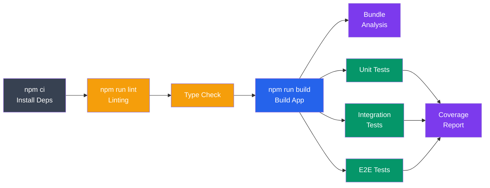

# Building and Testing in CI/CD

> Apne CI/CD pipeline mein automated build process aur solid testing strategy set up karna — taaki har commit ke baad tumhe pata ho code chal raha hai ya nahi, bina manually check kiye.

Socho zara — Swiggy ka backend team din mein 50 baar deploy karta hai. Agar har deploy se pehle koi insaan manually build karke, test chalake, coverage dekh ke "sab thik hai" bolta, toh company band ho jaati. Isliye build aur test — dono cheezein pipeline mein automate ho jaati hain. Tum code push karo, baaki sab CI server sambhal leta hai — build banata hai, tests chalata hai, coverage nikaalta hai, security check karta hai — sab kuch bina tumhare intervention ke.

## Table of Contents
1. [Build Automation](#build-automation)
2. [Testing Frameworks](#testing-frameworks)
3. [Test Organization](#test-organization)
4. [Code Coverage](#code-coverage)
5. [Performance Testing](#performance-testing)
6. [Security Testing](#security-testing)
7. [Build Optimization](#build-optimization)

---

## Build Automation

### Kya hota hai "Build"?

Jab tum React/TS code likhte ho, browser usse directly nahi samajhta — usko bundle, minify, transpile karna padta hai. "Build" step yehi karta hai: tumhare `src/` folder ke saare files ko utha ke ek optimized `dist/` folder bana deta hai jo production mein serve ho sake. Yeh manually terminal mein `npm run build` chalane jaisa hi hai, bas CI isse automatically har push par karta hai.

### Build Scripts

Sabse pehle apne `package.json` mein saare build commands define karo — taaki CI aur tum, dono same command use karo (local pe jo chala, CI pe bhi wahi chalega, koi surprise nahi):

```json
{
  "scripts": {
    "build": "webpack --mode production",
    "build:dev": "webpack --mode development",
    "build:analyze": "webpack-bundle-analyzer dist/stats.json",
    "build:clean": "rm -rf dist && npm run build"
  }
}
```

```bash
# CI/CD runs
npm run build
# Compiles source to dist/
# Minifies, optimizes
# Generates source maps
```

> [!tip]
> `build:clean` jaisa script rakhna acchi practice hai — kabhi kabhi purana `dist/` folder ka stale cache CI mein weird bugs de deta hai. Fresh build hamesha safe hota hai.

### Build Pipeline Stages

Ek proper build pipeline sirf "build karo aur khatam" nahi hota — usme kayi stages hote hain jo ek dusre ke baad (ya parallel mein) chalte hain. Socho isko IRCTC ke ticket booking flow jaisa — pehle login check hota hai, phir seat availability, phir payment, phir confirmation. Har stage apna kaam karta hai aur agla stage tabhi chalta hai jab pichla pass ho:



Is diagram mein notice karo — `npm ci` (installation) sabse pehle, kyunki baaki sab kuch dependencies pe depend karta hai. Fir lint aur type-check jaldi fail-fast ke liye pehle chalte hain (agar code mein hi type error hai toh build karne ka kya fayda?). Build ke baad, teeno test types (unit, integration, e2e) parallel mein chal sakte hain kyunki woh ek dusre pe depend nahi karte — isse CI time bachta hai.

```yaml
build_stage:
  image: node:18
  stage: build
  script:
    # Install dependencies
    - npm ci
    # Run linting
    - npm run lint
    # Run type checking
    - npm run type-check
    # Build application
    - npm run build
    # Analyze bundle size
    - npm run build:analyze
  artifacts:
    paths:
      - dist/
      - coverage/
    reports:
      bundle-report: dist/stats.json
  cache:
    paths:
      - node_modules/
```

> [!info]
> `npm ci` use karo, `npm install` nahi — CI environments mein. `npm ci` `package-lock.json` ko strictly follow karta hai aur agar lock file se mismatch hai toh fail ho jaata hai. Yeh guarantee deta hai ki jo dependencies local pe test hui hain wahi exact versions CI mein bhi install hongi. `npm install` lock file ko update bhi kar sakta hai — jo CI mein bilkul nahi chahiye.

### Docker Build in CI

Ab agar tum apni app ko container mein deploy kar rahe ho (jaisa aajkal almost har company karti hai), toh build step Dockerfile ke through hota hai. Yahan ek important pattern hai — **multi-stage build**:

```dockerfile
# Dockerfile
FROM node:18 AS builder
WORKDIR /app
COPY package*.json ./
RUN npm ci
COPY . .
RUN npm run build

FROM node:18-alpine
WORKDIR /app
COPY package*.json ./
RUN npm ci --only=production
COPY --from=builder /app/dist ./dist
EXPOSE 3000
CMD ["node", "dist/index.js"]
```

Yahan do stages hain — pehla stage (`builder`) full Node image use karta hai, saara build tooling install karta hai, aur `dist/` banata hai. Doosra stage sirf lightweight `alpine` image leta hai aur pehle stage se sirf built `dist/` folder copy karta hai. Kyun? Kyunki production image mein tumhe webpack, TypeScript compiler, dev-dependencies — inn sabki zaroorat nahi. Yeh Ola ki tarah hai — car banane ki poori factory (heavy machinery, tools) alag jagah hoti hai, lekin customer ko sirf final ready car milti hai, poori factory nahi. Isse final image size drastically kam ho jaata hai (kabhi 1GB se 100MB tak) aur security surface bhi chota hota hai.

```yaml
# .github/workflows/build.yml
build_docker:
  runs-on: ubuntu-latest
  steps:
    - uses: actions/checkout@v3
    - uses: docker/build-push-action@v4
      with:
        context: .
        push: true
        tags: myregistry/myapp:latest
        cache-from: type=registry,ref=myregistry/myapp:buildcache
        cache-to: type=registry,ref=myregistry/myapp:buildcache,mode=max
```

`cache-from`/`cache-to` yahan Docker layer caching enable karta hai — matlab agar tumhara `package.json` change nahi hua, toh CI dobara `npm ci` nahi chalayega, purani cached layer reuse kar lega. Isse build time minutes se seconds tak aa sakta hai.

---

## Testing Frameworks

### Kyun zaruri hai testing?

"Mera code local pe chal raha hai" — yeh sabse dangerous sentence hai kisi bhi developer ke muh se. Production mein alag data, alag load, alag edge cases hote hain. Tests likhna matlab apne code ko systematically prove karna ki woh expected tarike se behave karta hai — bina har baar manually browser khol ke click-click karke check kiye. Zomato jaise app mein agar "add to cart" function break ho jaaye aur koi test na pakde, toh directly revenue loss hota hai.

### JavaScript Testing

Teen popular options hain — Jest (sabse common, Facebook/Meta ne banaya), Mocha+Chai (older, flexible), aur Vitest (Vite projects ke liye native, bahut fast):

```javascript
// Jest - Unit Testing
describe('Calculator', () => {
  test('adds numbers correctly', () => {
    expect(add(2, 3)).toBe(5);
  });
});

// Mocha + Chai - Alternative
describe('Calculator', function() {
  it('should add numbers', function() {
    expect(add(2, 3)).to.equal(5);
  });
});

// Vitest - Vite-native testing
describe('Utils', () => {
  it('formats date correctly', () => {
    expect(formatDate(new Date('2024-01-01'))).toBe('Jan 1, 2024');
  });
});
```

`describe` ek group hota hai (jaise "Calculator" ke saare tests), aur `it`/`test` individual test case hota hai. Yeh naming convention se hi test report readable ban jaata hai.

```yaml
test:unit:
  image: node:18
  script:
    - npm ci
    - npm test -- --coverage --testPathPattern=unit
  artifacts:
    reports:
      coverage_report:
        coverage_format: cobertura
        path: coverage/cobertura-coverage.xml
```

### Python Testing

Agar backend Python mein hai (Django/FastAPI), toh `pytest` industry standard hai:

```python
# pytest - Testing framework
import pytest

def test_add():
    assert add(2, 3) == 5

def test_divide_by_zero():
    with pytest.raises(ZeroDivisionError):
        divide(10, 0)

# Run tests
# pytest tests/ --cov=src
```

`pytest.raises` ek context manager hai jo verify karta hai ki given block mein exact expected exception aaye — agar exception nahi aaya, test fail ho jaata hai. Yeh error-handling code test karne ka clean tareeka hai.

### Integration Testing

Unit test individual function/component ko isolate karke test karta hai. Integration test check karta hai ki multiple parts saath mein sahi kaam karte hain ya nahi — jaise database ke saath actual connection banake CRUD operations test karna:

```javascript
// Database integration tests
describe('User Database', () => {
  let db;

  beforeAll(async () => {
    db = await connectDB('test');
  });

  afterAll(async () => {
    await db.disconnect();
  });

  test('creates user', async () => {
    const user = await db.users.create({
      name: 'John',
      email: 'john@example.com'
    });
    expect(user.id).toBeDefined();
  });

  test('retrieves user by email', async () => {
    const user = await db.users.findByEmail('john@example.com');
    expect(user.name).toBe('John');
  });
});
```

Notice `beforeAll`/`afterAll` — yeh setup/teardown hooks hain. Test database se connect hoke, tests khatam hone ke baad disconnect ho jaata hai. Real production DB pe tests kabhi mat chalao — hamesha ek alag test DB (jaise upar `test` naam ka DB) use karo, warna galti se real user data corrupt ho sakta hai.

```yaml
test:integration:
  image: node:18
  services:
    - postgres:15
  variables:
    POSTGRES_DB: test
    POSTGRES_PASSWORD: secret
  script:
    - npm ci
    - npm run test:integration
```

`services: - postgres:15` CI runner ko bolta hai ki test ke liye ek temporary Postgres container spin up karo — yeh sirf is job ki duration tak live rehta hai, test khatam hote hi destroy ho jaata hai. Bilkul fresh, isolated database, har baar.

### API Testing

Backend API ko end-to-end HTTP level pe test karna — jaise koi client actual request bhej raha ho:

```javascript
// Supertest - HTTP assertions
const request = require('supertest');
const app = require('../app');

describe('User API', () => {
  test('GET /api/users returns users', async () => {
    const response = await request(app)
      .get('/api/users')
      .expect(200)
      .expect('Content-Type', /json/);

    expect(response.body).toBeInstanceOf(Array);
  });

  test('POST /api/users creates user', async () => {
    const response = await request(app)
      .post('/api/users')
      .send({ name: 'Jane', email: 'jane@example.com' })
      .expect(201);

    expect(response.body.id).toBeDefined();
  });
});
```

`supertest` tumhare Express app ko bina actual server port pe start kiye directly test kar sakta hai — status codes, headers, response body sab verify ho jaata hai. Yeh CRED jaisa payment API ho ya IRCTC ka booking API, iss layer pe tests likhna critical hai kyunki yehi contract hai jo frontend/mobile app se consume hota hai.

### E2E Testing

End-to-end test poore user flow ko real browser mein simulate karta hai — jaise ek actual user login karke, click karke, form fill karke app use kar raha ho:

```javascript
// Cypress - User flow testing
describe('User Dashboard', () => {
  beforeEach(() => {
    cy.login('user@example.com', 'password');
  });

  it('displays user profile', () => {
    cy.visit('/dashboard');
    cy.get('[data-cy=user-name]').should('contain', 'John Doe');
  });

  it('updates user profile', () => {
    cy.visit('/dashboard');
    cy.get('[data-cy=edit-btn]').click();
    cy.get('[name=name]').clear().type('Jane Doe');
    cy.get('[data-cy=save-btn]').click();
    cy.get('[data-cy=user-name]').should('contain', 'Jane Doe');
  });
});
```

Socho isko OYO ki app ka "book a room" flow test karna jaisa — search karo, room select karo, payment karo, confirmation dekho — sab kuch ek real browser mein automate hoke chalega. E2E tests sabse "realistic" hote hain lekin sabse slow bhi — isliye inhe kam number mein, sirf critical user journeys ke liye likha jaata hai.

```yaml
test:e2e:
  image: cypress/included:13.0.0
  script:
    - npm ci
    - npm run cypress:run
  artifacts:
    paths:
      - cypress/videos/
      - cypress/screenshots/
    when: on_failure
```

> [!tip]
> `when: on_failure` — matlab screenshots/videos sirf tab save honge jab test fail ho. Yeh debug karne mein bahut kaam aata hai — tumhe pata chal jaata hai exact wahi moment pe screen kaisi dikh rahi thi jab test fail hua, bina CI logs mein guess kiye.

**Testing Pyramid samajhlo** — Unit tests sabse zyada honi chahiye (fast, cheap, focused), Integration tests thodi kam (medium speed), aur E2E sabse kam (slow, expensive, but most realistic). Agar tum uska ulta karoge — sirf E2E tests likhoge — toh CI pipeline itna slow ho jaayega ki 10 minute ka deploy 1 ghante ka ho jaayega.

---

## Test Organization

### Kyun zaruri hai organize karna?

Jaise jaise codebase badhta hai, tests bhi badhte hain. Agar organization proper nahi hai, toh 6 mahine baad koi bhi (khud tum bhi) confused ho jaayega ki kaunsa test kya cover karta hai. Achi organization = maintainability.

### Directory Structure

```
src/
├── components/
│   ├── Button.js
│   └── Button.test.js
├── utils/
│   ├── format.js
│   └── format.test.js
└── services/
    ├── api.js
    └── api.test.js

tests/
├── integration/
│   ├── auth.test.js
│   └── database.test.js
└── e2e/
    ├── login.spec.js
    └── dashboard.spec.js
```

Yahan pattern simple hai — unit tests apne source file ke bilkul saath rakho (co-location), jaise `Button.js` ke saath `Button.test.js`. Isse easily pata chalta hai ki kaunsi file ka test missing hai. Lekin integration aur e2e tests — jo multiple files/services ko cover karte hain — unko alag `tests/` folder mein rakho, kyunki woh kisi ek specific file se bandhe nahi hote.

### Test Naming

Test ka naam padh ke hi samajh aana chahiye ki woh kya check kar raha hai — bina implementation dekhe:

```javascript
// ✅ Good: Clear, descriptive test names
describe('UserService', () => {
  describe('createUser', () => {
    it('should create user with valid email', () => {});
    it('should reject user with invalid email', () => {});
    it('should hash password before saving', () => {});
  });
});

// ❌ Bad: Vague test names
describe('tests', () => {
  it('test1', () => {});
  it('test2', () => {});
  it('works', () => {});
});
```

Jab koi test fail hota hai CI mein, tumhe sirf test name dikhta hai (initially). `test1 failed` bolne se kuch pata nahi chalta, lekin `should reject user with invalid email failed` se turant clarity mil jaati hai ki kya toota. Yeh utna hi zaruri hai jitna variable naming — descriptive naam future-you ka time bachate hain.

### Test Data Management

Har test mein manually same object baar baar likhna repetitive aur error-prone hai. Factory pattern use karo — ek function jo default test data return kare, aur zaroorat ke hisaab se overrides le sake:

```javascript
// Factory pattern for test data
const createUser = (overrides = {}) => ({
  id: '1',
  name: 'John Doe',
  email: 'john@example.com',
  role: 'user',
  ...overrides
});

describe('User permissions', () => {
  it('allows admin to delete user', () => {
    const user = createUser({ role: 'admin' });
    expect(user.canDelete()).toBe(true);
  });

  it('denies regular user from deleting', () => {
    const user = createUser({ role: 'user' });
    expect(user.canDelete()).toBe(false);
  });
});
```

Yeh Flipkart ke seller-dashboard test data jaisa hai — instead of har test mein ek naya poora "seller" object likhne ke, ek factory function bana lo jo default seller de, aur sirf jo field change karni hai (jaise `role`) usko override kar do. Clean aur DRY (Don't Repeat Yourself).

---

## Code Coverage

### Kya hota hai coverage?

Code coverage batata hai ki tumhare tests ne code ka kitna percentage actually "chalaya" hai. Agar coverage 85% hai, matlab 15% code kabhi kisi test ke through execute hi nahi hua — matlab woh untested hai, aur wahan bug chhup sakta hai bina kisi ko pata chale.

### Coverage Metrics

```
Statement coverage: 85%  - % of statements executed
Branch coverage: 78%     - % of conditional branches tested
Function coverage: 90%   - % of functions called
Line coverage: 85%       - % of lines executed
```

Yahan **branch coverage** sabse important metric hai kyunki yeh `if/else` ke dono paths cover karta hai. Socho ek function jisme `if (user.isPremium) { applyDiscount() } else { chargeFullPrice() }` hai — sirf ek test jo premium user pass kare, statement coverage 100% dikha dega (dono lines chali), lekin agar `else` branch kabhi test nahi hui, toh woh branch untested reh jaata hai. Branch coverage isko pakadta hai.

### Setting Coverage Thresholds

CI ko bolo ki coverage ek certain % se neeche gira toh build hi fail kar do — isse coverage gradually girta nahi rehta:

```json
{
  "jest": {
    "collectCoverageFrom": [
      "src/**/*.js",
      "!src/**/*.test.js"
    ],
    "coverageThreshold": {
      "global": {
        "branches": 80,
        "functions": 80,
        "lines": 80,
        "statements": 80
      },
      "src/critical/": {
        "branches": 95,
        "functions": 95,
        "lines": 95,
        "statements": 95
      }
    }
  }
}
```

Notice — `src/critical/` folder ke liye threshold 95% rakha hai jabki baaki codebase ke liye 80%. Yeh smart approach hai: payment processing, authentication jaise critical modules ko strictest coverage chahiye (jaise CRED ka payment module — yahan 1% bug bhi expensive), jabki UI components thoda relaxed rakh sakte ho.

```yaml
test:coverage:
  script:
    - npm test -- --coverage
  coverage: '/Statement : (\d+\.\d+)%/'
  artifacts:
    reports:
      coverage_report:
        coverage_format: cobertura
        path: coverage/cobertura-coverage.xml
```

### Coverage Reporting

```bash
# Generate HTML report
npm test -- --coverage

# Output
# ================== Coverage summary ==================
# Statements   : 85.5% ( 342/400 )
# Branches     : 78.2% ( 123/157 )
# Functions    : 90.0% ( 45/50 )
# Lines        : 85.3% ( 341/399 )
# =====================================================
```

> [!warning]
> 100% coverage ka obsession mat karo. Har line test karna zaruri nahi — jaise console.log statements, simple getters. Coverage ek **signal** hai, target nahi. High coverage ka matlab "bug-free code" nahi hota — tum bhi bekaar assertions likh ke coverage badha sakte ho bina actual behavior verify kiye.

---

## Performance Testing

### Kyun zaruri hai?

Functional testing check karta hai "kya code sahi kaam karta hai". Performance testing check karta hai "kya code load ke neeche bhi sahi kaam karta hai". Diwali sale ke din agar Flipkart ka server 10 users pe sahi chale lekin 10 lakh users pe crash ho jaaye, toh functional tests kuch nahi bata paayenge — sirf performance/load tests hi pakad payenge.

### Load Testing

```bash
# Apache Bench
ab -n 1000 -c 10 http://localhost:3000/

# Results
# Requests per second: 500
# Time per request: 20ms
# Failed requests: 0
```

`ab -n 1000 -c 10` matlab total 1000 requests bhejo, 10 concurrent connections ke saath. Isse pata chalta hai server kitna throughput handle kar sakta hai aur average response time kya hai.

### Stress Testing

Load testing normal expected traffic simulate karta hai. Stress testing jaan-boojh kar limit se zyada load daalta hai yeh dekhne ke liye ki system kaise fail hota hai (gracefully ya crash karke) aur breaking point kya hai:

```yaml
performance:
  image: loadimpact/k6:latest
  script:
    - k6 run tests/load.js
  artifacts:
    reports:
      performance: performance-results.json
```

```javascript
// tests/load.js - k6 load test
import http from 'k6/http';
import { check } from 'k6';

export let options = {
  stages: [
    { duration: '30s', target: 20 },   // Ramp up
    { duration: '1m', target: 100 },   // Ramp to load
    { duration: '30s', target: 0 },    // Ramp down
  ],
};

export default function() {
  let response = http.get('http://localhost:3000');
  check(response, {
    'status is 200': (r) => r.status === 200,
    'response time < 200ms': (r) => r.timings.duration < 200,
  });
}
```

Yeh `stages` config ek IRCTC Tatkal booking window jaisa simulate karta hai — 30 second mein traffic 0 se 20 users tak ramp-up hota hai, phir 1 minute tak 100 concurrent users maintain hota hai (peak load, jaise Tatkal khulne ke turant baad), phir 30 second mein wapas 0 pe ramp-down. `check()` function verify karta hai ki har response 200 status aur 200ms se kam time mein aaye — agar nahi aata toh yeh fail count mein jud jaata hai.

### Bundle Size Analysis

Frontend performance ka ek bada factor hai — JS bundle ka size. Bada bundle matlab slow page load, especially 3G/4G connections pe (India mein bahut relevant):

```yaml
bundle-size:
  script:
    - npm run build
    - npx bundlesize
  only:
    - merge_requests
```

```json
{
  "files": [
    {
      "path": "./dist/main.js",
      "maxSize": "100kb"
    },
    {
      "path": "./dist/vendor.js",
      "maxSize": "150kb"
    }
  ]
}
```

Agar koi PR bundle size limit cross kar de (jaise koi bhaari library accidentally import kar di), CI fail ho jaayega — isse pehle hi pakad liya jaata hai production mein jaane se pehle.

---

## Security Testing

### Kyun zaruri hai?

Ek security bug production mein data breach, downtime, ya legal trouble bana sakta hai. Security testing ko bhi pipeline mein automate karna chahiye — taaki har commit ke saath vulnerabilities check ho jaayein, sirf saal mein ek baar manual audit ke bharose na raho.

### Dependency Scanning

Tumhara code toh secure hoga, lekin uss code ki dependencies (npm packages) mein known vulnerabilities ho sakti hain — kayi baar third-party package mein CVE (Common Vulnerabilities and Exposures) report hota hai:

```yaml
security:dependencies:
  script:
    - npm audit
  allow_failure: true
  only:
    - merge_requests
```

`npm audit` npm registry ke security database ke against tumhari dependencies check karta hai. `allow_failure: true` rakha hai kyunki shuru mein bahut saare pre-existing warnings mil sakte hain jo turant fix karna practical nahi — pipeline ko turant block nahi karna chahte, lekin visibility zaruri hai.

### SAST (Static Application Security Testing)

SAST tools tumhara actual source code (bina run kiye) scan karte hain common vulnerability patterns dhoondne ke liye — jaise SQL injection risk, XSS, hardcoded credentials, insecure crypto usage:

```yaml
security:sast:
  stage: test
  image: returntocorp/semgrep
  script:
    - semgrep --config=p/owasp-top-ten src/
  allow_failure: true
```

`p/owasp-top-ten` ek predefined ruleset hai jo OWASP (industry-standard security body) ke top 10 vulnerability categories check karta hai — jaise injection attacks, broken authentication, sensitive data exposure. Payment ya login system likhte waqt yeh especially zaruri hai.

### Secret Detection

Sabse common galti — API key, database password, ya JWT secret galti se code mein hardcode ho jaana aur commit ho jaana. Ek baar Git history mein aa gaya toh remove karna bhi mushkil hota hai:

```yaml
security:secrets:
  script:
    - npm install -g detect-secrets
    - detect-secrets scan --baseline .secrets.baseline
```

> [!warning]
> Agar galti se secret commit ho jaaye — sirf usko delete karke naya commit karna kaafi nahi hai. Woh purane commit history mein reh jaata hai. Turant us secret/key ko rotate (revoke aur naya generate) karna padta hai, chahe history clean bhi kar do.

---

## Build Optimization

### Kyun zaruri hai?

Agar CI pipeline 30 minute leta hai har baar, toh developer productivity directly hit hoti hai — din mein 20 baar deploy karne wali team ke liye yeh bahut costly hai. Optimization ka goal hai: same kaam, kam time mein.

### Caching Strategy

`node_modules/` har baar fresh install karna time-consuming hai jab dependencies change hi nahi hui. Caching se CI purani cached copy reuse kar leta hai:

```yaml
cache:
  key:
    files:
      - package-lock.json
      - yarn.lock
    prefix: $CI_COMMIT_REF_SLUG
  paths:
    - node_modules/
    - .cache/
  policy: pull-push

stages:
  - build

build:
  stage: build
  cache:
    policy: pull  # Only pull, don't write
  script:
    - npm ci
    - npm run build
```

Cache `key` yahan `package-lock.json` ke content pe based hai — matlab jab tak lock file change nahi hoti, wahi cache reuse hoga (cache hit). Jaise hi dependency badalti hai, key change ho jaata hai aur naya cache banta hai (cache miss, fresh install). `policy: pull` wale jobs sirf cache padhte hain, likhte nahi — isse race conditions avoid hoti hain jab multiple parallel jobs chal rahe ho.

### Incremental Builds

Webpack jaise bundlers khud bhi apna internal build cache maintain kar sakte hain — taaki agla build sirf changed files ko re-process kare, poore codebase ko nahi:

```javascript
// webpack.config.js with caching
module.exports = {
  cache: {
    type: 'filesystem',
    buildDependencies: {
      config: [__filename],
    },
  },
  // ...
};
```

`type: 'filesystem'` matlab cache disk pe persist hoti hai (memory mein nahi), toh CI runs ke beech mein bhi (agar disk cache carry-forward ho) reuse ho sakti hai.

### Parallel Test Execution

Agar tumhare paas 1000 tests hain aur woh sequentially chal rahe hain, toh CI slow hoga. Tests ko multiple machines/workers mein baat do (sharding):

```yaml
test_unit:
  parallel: 4
  script:
    - npm test -- --shard=${CI_NODE_INDEX}/${CI_NODE_TOTAL}
```

`parallel: 4` matlab yeh job 4 alag instances mein simultaneously chalega, aur har instance apna `CI_NODE_INDEX` (1,2,3,4) jaanta hai. Test runner (`--shard`) tests ko 4 groups mein baant deta hai — har machine sirf apna 1/4th tests chalata hai. 4 machines pe parallel chalne se total time roughly 4x kam ho jaata hai (Amdahl's law thoda apply hota hai but broadly yehi idea hai).

---

## Practical Example: Complete Test Suite

Ab sab kuch ek saath jodkar dekhte hain — ek real-world jaisi complete test pipeline:

```yaml
test:
  stage: test
  image: node:18
  services:
    - postgres:15
  variables:
    POSTGRES_DB: test_db
    POSTGRES_PASSWORD: test_password
    NODE_ENV: test
  before_script:
    - npm ci
    - npm run db:migrate
  script:
    # Unit tests
    - npm run test:unit -- --coverage
    # Integration tests
    - npm run test:integration
    # API tests
    - npm run test:api
    # E2E tests
    - npm run test:e2e
    # Security audit
    - npm audit --audit-level=high
  coverage: '/Statement : (\d+\.\d+)%/'
  artifacts:
    when: always
    reports:
      coverage_report:
        coverage_format: cobertura
        path: coverage/cobertura-coverage.xml
      junit: test-results.xml
    paths:
      - coverage/
      - test-results/
    expire_in: 30 days
  retry:
    max: 2
    when:
      - runner_system_failure
```

Isko ek-ek karke samjho:
- `services: postgres:15` — fresh test database spin hota hai isi job ke liye
- `before_script` — dependencies install aur DB migrations chalte hain, tests shuru hone se pehle
- `script` mein order matlabi hai — pehle fast unit tests, phir integration, phir API, phir slow E2E tests, aur end mein security audit
- `artifacts: when: always` — chahe test pass ho ya fail, coverage aur test-results dono save honge (debugging ke liye zaruri)
- `expire_in: 30 days` — artifacts hamesha ke liye storage nahi khaate, 30 din baad auto-delete
- `retry: max: 2, when: runner_system_failure` — agar CI runner khud crash ho jaaye (infra issue, tumhare test ki galti nahi), toh automatically 2 baar retry hoga. Yeh sirf infra failures ke liye hai — agar tumhara test genuinely fail ho raha hai, retry usse pass nahi karayega (flaky tests ke alawa).

> [!tip]
> Yeh pura setup basically ek "quality gate" hai — jab tak yeh saari checks pass nahi hoti, code merge/deploy hi nahi ho sakta. Isi wajah se bade teams (jaise Paytm, Zomato scale pe) confidently din mein kayi baar production deploy kar paate hain — kyunki automation ne already verify kar diya hai ki basic quality bar maintain hai.

## Key Takeaways

- **Build automation** ensure karta hai ki har environment mein reproducible, consistent build bane — koi "mere machine pe chal raha tha" wali problem nahi
- **Multiple test types** (unit, integration, API, E2E) mil ke comprehensive coverage dete hain — testing pyramid follow karo (zyada unit, kam E2E)
- **Test organization** — co-locate unit tests source ke saath, alag folder integration/e2e ke liye; descriptive naming se debugging easy hoti hai
- **Code coverage** ek useful signal hai lekin target nahi — 100% coverage ka piche mat bhaago, critical modules pe zyada strict threshold rakho
- **Performance testing** (load + stress) batata hai app scale pe kaisa behave karega — functional tests yeh nahi bata sakte
- **Security testing** (dependency scan, SAST, secret detection) ko pipeline mein automate karo — manual audits par depend mat raho
- **Caching aur parallelization** CI/CD pipeline ko fast rakhte hain — slow pipeline directly developer productivity kill karta hai
- Sab kuch mil ke ek "quality gate" banata hai jo confident, frequent deployments possible banata hai

Next: [Docker Image CI/CD](./04_docker_image_cicd.md) - automated Docker builds
