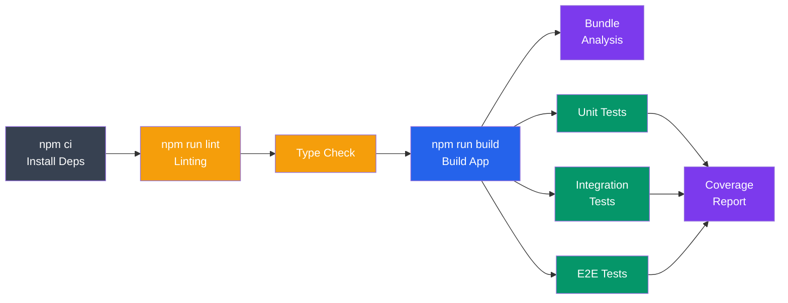

# Building and Testing in CI/CD

> Implement automated build processes and comprehensive testing strategies in your CI/CD pipeline.

## Table of Contents
1. [Build Automation](#build-automation)
2. [Testing Frameworks](#testing-frameworks)
3. [Test Organization](#test-organization)
4. [Code Coverage](#code-coverage)
5. [Performance Testing](#performance-testing)
6. [Security Testing](#security-testing)
7. [Build Optimization](#build-optimization)

---

## Build Automation

### Build Scripts

```json
{
  "scripts": {
    "build": "webpack --mode production",
    "build:dev": "webpack --mode development",
    "build:analyze": "webpack-bundle-analyzer dist/stats.json",
    "build:clean": "rm -rf dist && npm run build"
  }
}
```

```bash
# CI/CD runs
npm run build
# Compiles source to dist/
# Minifies, optimizes
# Generates source maps
```

### Build Pipeline Stages



```yaml
build_stage:
  image: node:18
  stage: build
  script:
    # Install dependencies
    - npm ci
    # Run linting
    - npm run lint
    # Run type checking
    - npm run type-check
    # Build application
    - npm run build
    # Analyze bundle size
    - npm run build:analyze
  artifacts:
    paths:
      - dist/
      - coverage/
    reports:
      bundle-report: dist/stats.json
  cache:
    paths:
      - node_modules/
```

### Docker Build in CI

```dockerfile
# Dockerfile
FROM node:18 AS builder
WORKDIR /app
COPY package*.json ./
RUN npm ci
COPY . .
RUN npm run build

FROM node:18-alpine
WORKDIR /app
COPY package*.json ./
RUN npm ci --only=production
COPY --from=builder /app/dist ./dist
EXPOSE 3000
CMD ["node", "dist/index.js"]
```

```yaml
# .github/workflows/build.yml
build_docker:
  runs-on: ubuntu-latest
  steps:
    - uses: actions/checkout@v3
    - uses: docker/build-push-action@v4
      with:
        context: .
        push: true
        tags: myregistry/myapp:latest
        cache-from: type=registry,ref=myregistry/myapp:buildcache
        cache-to: type=registry,ref=myregistry/myapp:buildcache,mode=max
```

---

## Testing Frameworks

### JavaScript Testing

```javascript
// Jest - Unit Testing
describe('Calculator', () => {
  test('adds numbers correctly', () => {
    expect(add(2, 3)).toBe(5);
  });
});

// Mocha + Chai - Alternative
describe('Calculator', function() {
  it('should add numbers', function() {
    expect(add(2, 3)).to.equal(5);
  });
});

// Vitest - Vite-native testing
describe('Utils', () => {
  it('formats date correctly', () => {
    expect(formatDate(new Date('2024-01-01'))).toBe('Jan 1, 2024');
  });
});
```

```yaml
test:unit:
  image: node:18
  script:
    - npm ci
    - npm test -- --coverage --testPathPattern=unit
  artifacts:
    reports:
      coverage_report:
        coverage_format: cobertura
        path: coverage/cobertura-coverage.xml
```

### Python Testing

```python
# pytest - Testing framework
import pytest

def test_add():
    assert add(2, 3) == 5

def test_divide_by_zero():
    with pytest.raises(ZeroDivisionError):
        divide(10, 0)

# Run tests
# pytest tests/ --cov=src
```

### Integration Testing

```javascript
// Database integration tests
describe('User Database', () => {
  let db;

  beforeAll(async () => {
    db = await connectDB('test');
  });

  afterAll(async () => {
    await db.disconnect();
  });

  test('creates user', async () => {
    const user = await db.users.create({
      name: 'John',
      email: 'john@example.com'
    });
    expect(user.id).toBeDefined();
  });

  test('retrieves user by email', async () => {
    const user = await db.users.findByEmail('john@example.com');
    expect(user.name).toBe('John');
  });
});
```

```yaml
test:integration:
  image: node:18
  services:
    - postgres:15
  variables:
    POSTGRES_DB: test
    POSTGRES_PASSWORD: secret
  script:
    - npm ci
    - npm run test:integration
```

### API Testing

```javascript
// Supertest - HTTP assertions
const request = require('supertest');
const app = require('../app');

describe('User API', () => {
  test('GET /api/users returns users', async () => {
    const response = await request(app)
      .get('/api/users')
      .expect(200)
      .expect('Content-Type', /json/);

    expect(response.body).toBeInstanceOf(Array);
  });

  test('POST /api/users creates user', async () => {
    const response = await request(app)
      .post('/api/users')
      .send({ name: 'Jane', email: 'jane@example.com' })
      .expect(201);

    expect(response.body.id).toBeDefined();
  });
});
```

### E2E Testing

```javascript
// Cypress - User flow testing
describe('User Dashboard', () => {
  beforeEach(() => {
    cy.login('user@example.com', 'password');
  });

  it('displays user profile', () => {
    cy.visit('/dashboard');
    cy.get('[data-cy=user-name]').should('contain', 'John Doe');
  });

  it('updates user profile', () => {
    cy.visit('/dashboard');
    cy.get('[data-cy=edit-btn]').click();
    cy.get('[name=name]').clear().type('Jane Doe');
    cy.get('[data-cy=save-btn]').click();
    cy.get('[data-cy=user-name]').should('contain', 'Jane Doe');
  });
});
```

```yaml
test:e2e:
  image: cypress/included:13.0.0
  script:
    - npm ci
    - npm run cypress:run
  artifacts:
    paths:
      - cypress/videos/
      - cypress/screenshots/
    when: on_failure
```

---

## Test Organization

### Directory Structure

```
src/
├── components/
│   ├── Button.js
│   └── Button.test.js
├── utils/
│   ├── format.js
│   └── format.test.js
└── services/
    ├── api.js
    └── api.test.js

tests/
├── integration/
│   ├── auth.test.js
│   └── database.test.js
└── e2e/
    ├── login.spec.js
    └── dashboard.spec.js
```

### Test Naming

```javascript
// ✅ Good: Clear, descriptive test names
describe('UserService', () => {
  describe('createUser', () => {
    it('should create user with valid email', () => {});
    it('should reject user with invalid email', () => {});
    it('should hash password before saving', () => {});
  });
});

// ❌ Bad: Vague test names
describe('tests', () => {
  it('test1', () => {});
  it('test2', () => {});
  it('works', () => {});
});
```

### Test Data Management

```javascript
// Factory pattern for test data
const createUser = (overrides = {}) => ({
  id: '1',
  name: 'John Doe',
  email: 'john@example.com',
  role: 'user',
  ...overrides
});

describe('User permissions', () => {
  it('allows admin to delete user', () => {
    const user = createUser({ role: 'admin' });
    expect(user.canDelete()).toBe(true);
  });

  it('denies regular user from deleting', () => {
    const user = createUser({ role: 'user' });
    expect(user.canDelete()).toBe(false);
  });
});
```

---

## Code Coverage

### Coverage Metrics

```
Statement coverage: 85%  - % of statements executed
Branch coverage: 78%     - % of conditional branches tested
Function coverage: 90%   - % of functions called
Line coverage: 85%       - % of lines executed
```

### Setting Coverage Thresholds

```json
{
  "jest": {
    "collectCoverageFrom": [
      "src/**/*.js",
      "!src/**/*.test.js"
    ],
    "coverageThreshold": {
      "global": {
        "branches": 80,
        "functions": 80,
        "lines": 80,
        "statements": 80
      },
      "src/critical/": {
        "branches": 95,
        "functions": 95,
        "lines": 95,
        "statements": 95
      }
    }
  }
}
```

```yaml
test:coverage:
  script:
    - npm test -- --coverage
  coverage: '/Statement : (\d+\.\d+)%/'
  artifacts:
    reports:
      coverage_report:
        coverage_format: cobertura
        path: coverage/cobertura-coverage.xml
```

### Coverage Reporting

```bash
# Generate HTML report
npm test -- --coverage

# Output
# ================== Coverage summary ==================
# Statements   : 85.5% ( 342/400 )
# Branches     : 78.2% ( 123/157 )
# Functions    : 90.0% ( 45/50 )
# Lines        : 85.3% ( 341/399 )
# =====================================================
```

---

## Performance Testing

### Load Testing

```bash
# Apache Bench
ab -n 1000 -c 10 http://localhost:3000/

# Results
# Requests per second: 500
# Time per request: 20ms
# Failed requests: 0
```

### Stress Testing

```yaml
performance:
  image: loadimpact/k6:latest
  script:
    - k6 run tests/load.js
  artifacts:
    reports:
      performance: performance-results.json
```

```javascript
// tests/load.js - k6 load test
import http from 'k6/http';
import { check } from 'k6';

export let options = {
  stages: [
    { duration: '30s', target: 20 },   // Ramp up
    { duration: '1m', target: 100 },   // Ramp to load
    { duration: '30s', target: 0 },    // Ramp down
  ],
};

export default function() {
  let response = http.get('http://localhost:3000');
  check(response, {
    'status is 200': (r) => r.status === 200,
    'response time < 200ms': (r) => r.timings.duration < 200,
  });
}
```

### Bundle Size Analysis

```yaml
bundle-size:
  script:
    - npm run build
    - npx bundlesize
  only:
    - merge_requests
```

```json
{
  "files": [
    {
      "path": "./dist/main.js",
      "maxSize": "100kb"
    },
    {
      "path": "./dist/vendor.js",
      "maxSize": "150kb"
    }
  ]
}
```

---

## Security Testing

### Dependency Scanning

```yaml
security:dependencies:
  script:
    - npm audit
  allow_failure: true
  only:
    - merge_requests
```

### SAST (Static Application Security Testing)

```yaml
security:sast:
  stage: test
  image: returntocorp/semgrep
  script:
    - semgrep --config=p/owasp-top-ten src/
  allow_failure: true
```

### Secret Detection

```yaml
security:secrets:
  script:
    - npm install -g detect-secrets
    - detect-secrets scan --baseline .secrets.baseline
```

---

## Build Optimization

### Caching Strategy

```yaml
cache:
  key:
    files:
      - package-lock.json
      - yarn.lock
    prefix: $CI_COMMIT_REF_SLUG
  paths:
    - node_modules/
    - .cache/
  policy: pull-push

stages:
  - build

build:
  stage: build
  cache:
    policy: pull  # Only pull, don't write
  script:
    - npm ci
    - npm run build
```

### Incremental Builds

```javascript
// webpack.config.js with caching
module.exports = {
  cache: {
    type: 'filesystem',
    buildDependencies: {
      config: [__filename],
    },
  },
  // ...
};
```

### Parallel Test Execution

```yaml
test_unit:
  parallel: 4
  script:
    - npm test -- --shard=${CI_NODE_INDEX}/${CI_NODE_TOTAL}
```

---

## Practical Example: Complete Test Suite

```yaml
test:
  stage: test
  image: node:18
  services:
    - postgres:15
  variables:
    POSTGRES_DB: test_db
    POSTGRES_PASSWORD: test_password
    NODE_ENV: test
  before_script:
    - npm ci
    - npm run db:migrate
  script:
    # Unit tests
    - npm run test:unit -- --coverage
    # Integration tests
    - npm run test:integration
    # API tests
    - npm run test:api
    # E2E tests
    - npm run test:e2e
    # Security audit
    - npm audit --audit-level=high
  coverage: '/Statement : (\d+\.\d+)%/'
  artifacts:
    when: always
    reports:
      coverage_report:
        coverage_format: cobertura
        path: coverage/cobertura-coverage.xml
      junit: test-results.xml
    paths:
      - coverage/
      - test-results/
    expire_in: 30 days
  retry:
    max: 2
    when:
      - runner_system_failure
```

---

## Summary

- **Build automation** ensures reproducible builds
- **Multiple test types** provide comprehensive coverage
- **Test organization** improves maintainability
- **Code coverage** metrics guide testing efforts
- **Performance testing** ensures scalability
- **Security testing** catches vulnerabilities early
- **Caching and parallelization** speed up CI/CD

Next: [Docker Image CI/CD](./04_docker_image_cicd.md) - automated Docker builds
