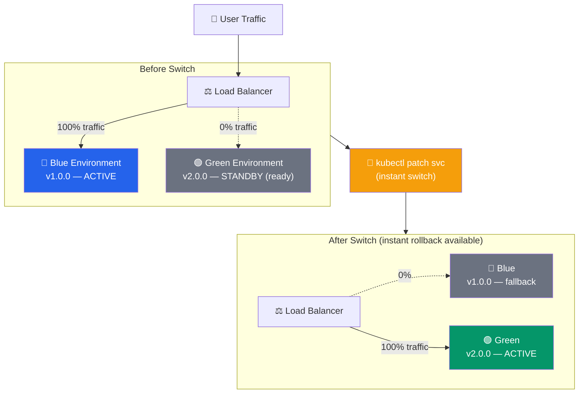
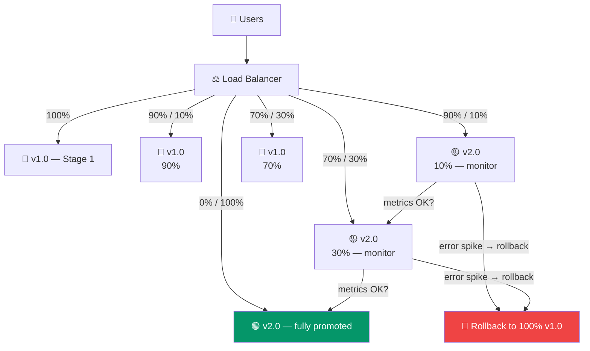

# Deployment Strategies

> Alag-alag deployment patterns seekhna zaruri hai taaki production mein reliable, zero-downtime releases ho sakein.

Socho ek Friday raat hai, sabse zyada Zomato orders aa rahe hain, aur tumhe naya version deploy karna hai. Agar galat tarike se deploy kiya toh poore India ke users ko "Something went wrong" dikhega. Isi wajah se deployment strategies seekhna itna important hai — yeh decide karti hain ki naya code production mein kaise, kitni safely, aur kitni jaldi live hota hai, aur kuch galat hone par kitni jaldi wapas purane version pe aa sakte ho.

## Table of Contents
1. [Blue-Green Deployment](#blue-green-deployment)
2. [Canary Deployment](#canary-deployment)
3. [Rolling Deployment](#rolling-deployment)
4. [Feature Flags](#feature-flags)
5. [A/B Testing](#ab-testing)
6. [Rollback Strategies](#rollback-strategies)
7. [Monitoring Deployments](#monitoring-deployments)

---

## Blue-Green Deployment

### Kya hota hai?

Blue-Green deployment mein tumhare paas do bilkul identical production environments hote hain — ek "Blue" (jo abhi live hai, active traffic serve kar raha hai) aur ek "Green" (jo standby mein hai, naya version leke ready khada hai). Socho isko aise — tumhare ghar mein do identical kitchens hain. Ek kitchen (Blue) mein abhi khana ban raha hai aur waiter usi se serve kar raha hai. Doosri kitchen (Green) mein tumne pehle se naya menu test kar liya hai, sab kuch check kar liya hai. Jab tumhe confident ho jaaye ki naya menu sahi hai, toh sirf waiter ko bol do "ab Green kitchen se serve karo" — instant switch, customer ko pata bhi nahi chalega.

### Kyun zaruri hai?

Traditional deployment mein tum seedha live server pe naya code daal dete ho — agar kuch bug hai toh sab users ko dikh jayega, aur rollback bhi slow hota hai (purana code wapas deploy karna padta hai). Blue-Green mein rollback literally ek switch flip karne jaisa hai kyunki purana environment already chal raha hota hai, bas traffic switch karna hai.

### Architecture



Yahan dekho — pehle Blue environment 100% traffic le raha hai aur Green sirf ready khada hai (0% traffic, but fully deployed aur tested). Switch hone ke baad Green active ho jaata hai aur Blue fallback ban jaata hai — agar kuch gadbad hui toh usi second traffic wapas Blue pe bhej sakte ho.

### Implementation

```yaml
deploy_bluegreen:
  stage: deploy
  script:
    # Deploy to green environment
    - kubectl apply -f green-deployment.yaml

    # Wait for green to be ready
    - kubectl rollout status deployment/myapp-green --timeout=5m

    # Run smoke tests on green
    - ./run-smoke-tests.sh green

    # Switch traffic from blue to green
    - kubectl patch service myapp -p '{"spec":{"selector":{"version":"green"}}}'

    # Keep blue running for quick rollback
    - echo "Blue environment still running as fallback"
  environment:
    name: production
    action: prepare
```

Is pipeline mein pehle Green deploy hota hai, uske ready hone ka wait karte hain, phir smoke tests chalate hain (yeh basic sanity checks hote hain — "kya app crash toh nahi ho raha") — aur tab jaake traffic switch hota hai. Blue ko turant delete nahi karte, kyunki agar kuch fail ho jaaye toh usi pe wapas jaana hai.

### Switching Traffic

```bash
# Check current version
kubectl get svc myapp -o jsonpath='{.spec.selector.version}'
# Output: blue

# Deploy green version
kubectl apply -f green-deployment.yaml
kubectl wait --for=condition=available deployment/myapp-green --timeout=5m

# Run verification
./smoke-tests.sh

# Switch traffic
kubectl patch svc myapp -p '{"spec":{"selector":{"version":"green"}}}'

# Verify
curl http://myapp/version  # Shows v2.0.0

# Rollback if needed (instant)
kubectl patch svc myapp -p '{"spec":{"selector":{"version":"blue"}}}'
```

Yeh `kubectl patch svc` command actually Kubernetes Service ke selector ko change kar deta hai — jo pods "version: green" label wale hain unhi ko traffic bhejna shuru ho jaata hai. Koi restart nahi, koi downtime nahi — bas ek label switch.

> [!tip]
> Rollback command ko hamesha ready rakho — copy-paste ke liye alag se note kar lo, kyunki 2 AM incident ke waqt dhoondhne ka time nahi hota.

### Advantages

- Zero-downtime deployment
- Instant rollback (jaise UPI transaction cancel karna — turant reverse ho jaata hai)
- Easy to test before switching traffic — Green pe production-jaisa real testing kar sakte ho bina users ko affect kiye
- Simple to understand and implement

### Disadvantages

- Requires 2x resources — do poore environments chalane padte hain, matlab do ghar ka kiraya (double cost). Startups ke liye yeh expensive ho sakta hai
- No gradual rollout (all or nothing) — agar Green mein koi subtle bug hai jo sirf edge cases mein dikhta hai, poora traffic ek saath us bug se takra sakta hai
- Database migrations can be complex — agar naya version DB schema change karta hai, toh Blue aur Green dono ko usi DB se compatible rehna padta hai (backward compatibility maintain karni padti hai)

---

## Canary Deployment

### Kya hota hai?

Canary deployment mein naya version poore users ko ek saath nahi dikhate — pehle chhote se percentage (jaise 5% ya 10%) users ko dikhate hain, unke metrics dekhte hain, aur agar sab theek hai toh dheere-dheere percentage badhate jaate ho jab tak 100% traffic naye version pe na aa jaaye.

Naam "Canary" isliye hai kyunki purane zamane mein coal miners canary bird ko khaan mein le jaate the — agar hawa mein zeher (toxic gas) hoti thi toh bird pehle marta tha, aur miners ko warning mil jaati thi. Yahan bhi wahi concept hai — chhota sa user group "canary" ban jaata hai jo pehle naye version ko face karta hai, aur agar kuch galat hai toh baaki 95% users tak wo problem pahunchne se pehle hi pata chal jaata hai.

Real-life analogy socho — Swiggy jab koi naya checkout flow launch karta hai, toh wo pehle Bangalore ke 5% users ko dikhate hain. Agar conversion rate girta hai ya errors badhte hain, turant rollback kar dete hain — baaki 95% users ko pata bhi nahi chalta ki kuch naya try kiya gaya tha.

### Progressive Traffic Shift



Yahan clearly dikh raha hai — traffic dheere-dheere v1.0 se v2.0 ki taraf shift ho raha hai (10% → 30% → 100%), aur har step ke baad metrics check hote hain. Agar kahin bhi error spike aaye, seedha 100% rollback ho jaata hai.

### Kubernetes with Istio

Istio ek service mesh hai jo Kubernetes cluster ke andar traffic ko fine-grained control ke saath route karne deta hai — jaise ek smart traffic police jo bata sakti hai "10% gaadiyaan is route se jaayengi, 90% us route se."

```yaml
apiVersion: networking.istio.io/v1beta1
kind: VirtualService
metadata:
  name: myapp
spec:
  hosts:
  - myapp
  http:
  - match:
    - headers:
        user-type:
          exact: "canary"
    route:
    - destination:
        host: myapp
        subset: v2
      weight: 100
  - route:
    - destination:
        host: myapp
        subset: v1
      weight: 90
    - destination:
        host: myapp
        subset: v2
      weight: 10
```

Is config mein do rules hain: agar request mein header `user-type: canary` hai, toh wo hamesha v2 pe jaayegi (internal testers ke liye useful). Baaki sabke liye weight-based split hai — 90% v1, 10% v2.

### Automated Canary with Flagger

Flagger ek Kubernetes operator hai jo canary rollout ko poora automate kar deta hai — tumhe manually weight badhane ki zaroorat nahi, wo khud metrics dekh ke decide karta hai.

```yaml
apiVersion: flagger.app/v1beta1
kind: Canary
metadata:
  name: myapp
spec:
  targetRef:
    apiVersion: apps/v1
    kind: Deployment
    name: myapp

  service:
    port: 8080

  # Analysis
  analysis:
    interval: 1m
    threshold: 5
    maxWeight: 50
    stepWeight: 5

  # Metrics to check during canary
  metrics:
  - name: request-success-rate
    thresholdRange:
      min: 99
    interval: 1m
  - name: request-duration
    thresholdRange:
      max: 500
    interval: 1m

  webhooks:
  - name: smoke-tests
    url: http://flagger-loadtester/
    metadata:
      type: smoke
      cmd: "curl -sd 'test' http://myapp:8080/api/info"
```

Yahan `stepWeight: 5` matlab har interval mein 5% traffic badhega, `maxWeight: 50` matlab 50% tak jaake full promotion hogi, aur `threshold: 5` matlab agar 5 baar metric check fail ho gaya toh automatically rollback ho jaayega. Metrics mein success-rate 99% se kam ya latency 500ms se zyada — dono cases mein rollback trigger hoga. Yeh bilkul waise hai jaise CRED ka fraud-detection system automatically transaction block kar deta hai agar kuch suspicious lage — koi insaan manually check nahi karta har transaction.

### Manual Canary Control

```bash
# Deploy new version
kubectl set image deployment/myapp myapp=myapp:v2.0.0

# Route 10% to new version
kubectl patch virtualservice myapp --type='json' \
  -p='[{"op": "replace", "path": "/spec/http/0/route/1/weight", "value":10}]'

# Monitor metrics (errors, latency)
kubectl logs -l app=myapp,version=v2

# If good, increase
kubectl patch virtualservice myapp --type='json' \
  -p='[{"op": "replace", "path": "/spec/http/0/route/1/weight", "value":50}]'

# Complete rollout
kubectl patch virtualservice myapp --type='json' \
  -p='[{"op": "replace", "path": "/spec/http/0/route/1/weight", "value":100}]'

# Or rollback
kubectl rollout undo deployment/myapp
```

Agar automation set up nahi hai, toh yeh manually bhi kar sakte ho — dheere-dheere weight badhate jao aur beech-beech mein logs/metrics check karte raho.

### Advantages

- Gradual rollout reduces blast radius — matlab agar kuch galat hua bhi, sirf chhota sa user group affect hoga, poora India nahi
- Early detection of issues — real production traffic pe test hota hai, staging environment mein kabhi na milne wale bugs yahan pakde jaate hain
- Easy to rollback — chhota traffic hai toh rollback ka impact bhi chhota
- Good user feedback from small group

### Disadvantages

- More complex to implement — Istio jaisa service mesh ya Flagger jaisa tool setup karna padta hai
- Longer deployment time — 100% tak pahunchne mein ghante lag sakte hain (safety ke liye)
- Requires monitoring setup — bina proper metrics ke canary ka koi fayda nahi, kyunki tumhe pata hi nahi chalega ki 10% users pe kya ho raha hai

---

## Rolling Deployment

### Kya hota hai?

Rolling deployment mein purane instances ko ek-ek karke naye instances se replace karte hain — sabko ek saath nahi. Socho tumhare paas 4 pods chal rahe hain v1 pe. Rolling update mein pehle ek pod ko naye version (v2) se replace karoge, check karoge sab theek hai, phir doosra, phir teesra, aise hi. Yeh IRCTC ki tatkal booking jaisa hai jaha server ek-ek karke restart hote hain, sabko ek saath band nahi karte — warna poora system down ho jaayega aur sab users ko dikh jaayega.

Yeh Blue-Green se alag hai kyunki yahan do poore separate environments nahi chahiye — same environment mein hi purane aur naye pods thodi der ke liye saath-saath chalte hain.

### Kubernetes Rolling Update

```yaml
apiVersion: apps/v1
kind: Deployment
metadata:
  name: myapp
spec:
  replicas: 4
  strategy:
    type: RollingUpdate
    rollingUpdate:
      maxSurge: 1        # One extra pod during update
      maxUnavailable: 1  # Max one pod down at a time
  template:
    # ...
```

`maxSurge: 1` ka matlab hai update ke time ek extra pod temporarily bana sakte hain (total 5 ho sakte hain kuch der ke liye), aur `maxUnavailable: 1` ka matlab hai ek time pe sirf ek pod down ho sakta hai — baaki 3 hamesha available rahenge users ke liye.

```bash
# Update deployment
kubectl set image deployment/myapp myapp=myapp:v2.0.0 --record

# Watch the rollout
kubectl rollout status deployment/myapp

# View rollout history
kubectl rollout history deployment/myapp

# Rollback if needed
kubectl rollout undo deployment/myapp
```

`kubectl rollout status` se tum live dekh sakte ho ki kitne pods update ho chuke hain, aur agar kuch galat lage toh `rollout undo` se ek command mein purane version pe wapas aa sakte ho.

### Docker Compose Rolling Update

```bash
# Update image in docker-compose.yml
# Then:
docker-compose up -d --no-deps --build myapp

# Services update one instance at a time
```

Docker Compose mein rolling update utna sophisticated nahi hota jitna Kubernetes mein, but chhote setups ke liye kaafi hai — especially jab tumhare paas Kubernetes cluster ka overhead nahi chahiye.

### Advantages

- Automatic rollback on failure — agar naya pod readiness check fail karta hai, Kubernetes khud rollout rok deta hai
- Graceful shutdown (readiness probes) — purana pod tabhi terminate hota hai jab naya pod fully ready ho, isliye traffic drop nahi hota
- No 2x resource requirement — Blue-Green ke comparison mein bahut kam resources chahiye
- Works well for stateless apps — jaise typical REST APIs jo koi local state store nahi karte

### Disadvantages

- Longer deployment time — pod-by-pod update hone mein time lagta hai
- Mixed versions running temporarily — kuch der ke liye v1 aur v2 dono live hote hain, jo agar API contract mein breaking change hai toh problem create kar sakta hai
- Complex database migrations — agar dono versions ek hi DB use kar rahe hain, toh schema ko dono versions ke saath backward-compatible rakhna padta hai

---

## Feature Flags

### Kya hota hai?

Feature flags (feature toggles bhi kehte hain) se tum code ko deploy toh kar dete ho production mein, lekin feature ko "chalu" nahi karte — wo ek flag ke peeche chhupa rehta hai. Baad mein bina naya deployment kiye, sirf ek config change karke us feature ko on/off kar sakte ho, ya kuch specific users ke liye enable kar sakte ho.

### Kyun zaruri hai?

Yeh **deployment** aur **release** ko decouple kar deta hai — matlab code production servers pe pahunch jaana ek alag cheez hai, aur wo feature users ko dikhna ek alag cheez hai. Socho Flipkart Big Billion Days se pehle naya checkout flow deploy karta hai, but usse "off" rakhta hai jab tak sale ka din na aa jaaye. Sale wale din bas ek flag flip karna hai, koi naya deployment nahi karna padta — risk kam ho jaata hai kyunki deployment aur launch alag-alag time pe ho sakte hain.

### Feature Flag Implementation

```javascript
// featureFlags.js
const flags = {
  'new-dashboard': {
    enabled: true,
    rollout: 50,  // 50% of users
    userIds: ['user123', 'user456'],  // Specific users
  },
  'payment-v2': {
    enabled: false,
  },
};

function isFeatureEnabled(featureName, userId) {
  const flag = flags[featureName];
  if (!flag || !flag.enabled) return false;

  if (flag.userIds && flag.userIds.includes(userId)) return true;
  if (flag.rollout) {
    return (userId.charCodeAt(0) % 100) < flag.rollout;
  }

  return false;
}

// In application
if (isFeatureEnabled('new-dashboard', userId)) {
  showNewDashboard();
} else {
  showOldDashboard();
}
```

Yeh ek simple in-house implementation hai — `new-dashboard` flag 50% users ko naya dashboard dikhata hai, plus kuch specific test users (`user123`, `user456`) ko hamesha dikhta hai chahe rollout percentage kuch bhi ho. `payment-v2` abhi bilkul off hai — code production mein hai but koi bhi use nahi kar raha.

### LaunchDarkly Integration

Production-grade apps mein aksar koi managed service use karte hain jaise LaunchDarkly, jisse tumhe khud yeh logic maintain nahi karna padta — dashboard se hi flags control ho jaate hain, real-time mein, bina redeploy ke.

```javascript
const LaunchDarkly = require('launchdarkly-js-client-sdk');

const client = LaunchDarkly.initialize('client-id', {
  user: {
    key: userId,
    email: userEmail,
    custom: {
      tier: 'premium',
    },
  },
});

client.on('ready', () => {
  const showNewFeature = client.variation('new-payment', false);
  if (showNewFeature) {
    // Show new payment feature
  }
});
```

Yahan `custom: { tier: 'premium' }` jaisa data pass karke tum targeting bhi kar sakte ho — jaise sirf premium (CRED jaisa) users ko naya feature dikhana, ya sirf ek specific city ke users ko.

> [!warning]
> Feature flags jitne zyada honge, code utna hi complex hota jaata hai — purane, ab-use-na-hone-wale flags ko clean up karna mat bhoolna, warna "if-else ka jungle" ban jaata hai.

### Advantages

- Deploy without enabling — code production mein safely reh sakta hai bina live hue
- Easy on/off without new deployment — kuch galat hone par instant off kar sakte ho, redeploy ka wait nahi karna padta
- Gradual rollout control — percentage-based rollout kar sakte ho, jaise canary deployment ka application-level version
- A/B testing capability — same mechanism se experiments bhi chala sakte ho

### Disadvantages

- Code complexity increases — har jagah `if (isFeatureEnabled(...))` checks lagane padte hain
- Requires external service (usually) — LaunchDarkly jaisi service ka extra cost aur dependency
- Technical debt from old features — agar flags clean up nahi kiye toh code messy ho jaata hai purane dead branches se bhara hua

---

## A/B Testing

### Kya hota hai?

A/B testing mein alag-alag users ko alag-alag versions dikhate ho (Version A aur Version B), aur dekhte ho kaunsa version better perform karta hai kisi metric pe — jaise conversion rate, revenue, ya engagement. Yeh feature flags jaisa hi mechanism use karta hai, but purpose alag hai — feature flags risk kam karne ke liye hain, A/B testing **decision lene** ke liye hai ki kaunsa design/flow better hai.

Zomato jab naya "order tracking" UI test karta hai, toh half users ko purana UI dikhata hai (Variant A) aur half ko naya (Variant B). Do hafte baad data dekh ke decide karte hain ki kaunsa UI zyada orders complete karwata hai.

### A/B Test Setup

```javascript
// Assign user to variant
function assignVariant(userId) {
  const hash = hashUserId(userId);
  return (hash % 2) === 0 ? 'A' : 'B';
}

// Consistent assignment
const variant = assignVariant(userId);  // Same user always gets same variant

if (variant === 'A') {
  showVersion1();  // Old version
} else {
  showVersion2();  // New version
}

// Track metrics
analytics.track('purchase', {
  variant: variant,
  amount: purchaseAmount,
});
```

Important cheez yahan yeh hai — user ID ko hash karke variant assign kar rahe hain, taaki wahi user hamesha wahi variant dekhe (consistent experience). Agar aaj A dikha aur kal B dikha diya, toh user confuse ho jaayega aur data bhi galat ho jaayega.

### Measuring A/B Tests

```sql
-- Analysis after 2 weeks
SELECT
  variant,
  COUNT(*) as users,
  SUM(CASE WHEN converted = 1 THEN 1 ELSE 0 END) as conversions,
  (SUM(CASE WHEN converted = 1 THEN 1 ELSE 0 END) / COUNT(*)) * 100 as conversion_rate,
  AVG(revenue) as avg_revenue
FROM events
WHERE experiment = 'checkout_flow'
  AND event_date >= NOW() - INTERVAL 14 DAY
GROUP BY variant;

-- Results
-- Variant A (old): 1000 users, 5% conversion, $45 avg revenue
-- Variant B (new): 1000 users, 7% conversion, $52 avg revenue
-- → B is better, deploy it!
```

Do hafte ka data collect karne ke baad yeh query batayegi kaunsa variant better conversion aur revenue de raha hai. Yahan Variant B clearly jeet raha hai (7% vs 5% conversion), toh decision hoga — B ko sabke liye rollout kar do.

> [!info]
> A/B test ka result trust karne se pehle statistical significance zaroor check karo — sirf 100-200 users ke sample se decision lena risky hota hai, "noise" ko "signal" samajh sakte ho.

---

## Rollback Strategies

### Kya hota hai?

Chahe kitni bhi careful deployment strategy use karo, kabhi na kabhi kuch galat ho hi jaata hai — bug production mein slip ho jaata hai, ya koi dependency down ho jaati hai. Rollback strategy yeh define karti hai ki jab aisa ho, toh kitni jaldi aur kitni safely purane, stable version pe wapas aa sakte ho.

### Instant Rollback

```bash
# Blue-Green: Switch traffic instantly
kubectl patch svc myapp -p '{"spec":{"selector":{"version":"blue"}}}'

# Rolling: Undo deployment
kubectl rollout undo deployment/myapp

# Database: Need migration reversal
./migrate-down.sh
```

Blue-Green mein rollback sabse fast hota hai — bas selector switch karo. Rolling deployment mein `rollout undo` chalate hain jo purane ReplicaSet ko wapas scale up kar deta hai. Database migrations sabse tricky part hain — agar naya schema change kiya tha, toh usko reverse karna alag se handle karna padta hai (isliye migrations hamesha backward-compatible design karo jab bhi possible ho).

### Automated Rollback on Errors

```yaml
deploy:
  script:
    - kubectl apply -f deployment.yaml
    - kubectl wait --for=condition=ready pod -l app=myapp --timeout=5m

  on_failure:
    script:
      # Health checks fail
      - if ! ./health-check.sh; then
          kubectl rollout undo deployment/myapp
          exit 1
        fi
```

Yahan pipeline khud health-check chalata hai, aur agar wo fail ho jaaye toh automatically rollback trigger ho jaata hai — koi insaan manually intervene nahi karta. Yeh bilkul Ola/Uber ke surge-pricing algorithm jaisa hai jo khud detect karke automatically adjust kar leta hai, bina kisi manual approval ke.

### Canary Automatic Rollback

```yaml
canary:
  analysis:
    interval: 1m
    threshold: 5  # Max 5 failed metric checks

    # Auto-rollback if metrics bad
  webhooks:
  - name: error-rate-check
    url: http://prometheus-checker
    # If error rate > 5%, rollback triggers
```

Flagger jaisa canary tool khud metrics ko monitor karta rehta hai, aur agar threshold cross ho jaaye (yahan 5 baar failed checks), toh apne aap rollback shuru kar deta hai — kisi ko paitience se dashboard dekhte rehne ki zaroorat nahi.

---

## Monitoring Deployments

### Kya hota hai?

Deployment sirf code ko push kar dena nahi hai — usse pehle aur baad mein proper checks hone chahiye taaki tumhe pata chale ki sab kuch expected tarike se chal raha hai. Isko socho jaise flight takeoff se pehle pilot ka checklist — engine check, fuel check, weather check — sab kuch verify karne ke baad hi takeoff hota hai.

### Pre-Deployment Checks

```bash
#!/bin/bash
# pre-deploy-checks.sh

set -e

echo "Running pre-deployment checks..."

# Database connectivity
psql -h $DB_HOST -d $DB_NAME -c "SELECT 1"

# Dependency health
curl -f http://auth-service/health
curl -f http://payment-service/health

# Config validation
./validate-config.sh

echo "✓ All checks passed"
```

Deploy karne se pehle yeh confirm karte hain ki database reachable hai, dependent services (auth, payment) healthy hain, aur config file mein koi galti nahi hai. `set -e` isliye lagaya hai taaki koi bhi command fail ho, poora script turant ruk jaaye — half-broken deployment na ho.

### Post-Deployment Verification

```yaml
post_deploy:
  script:
    # Wait for health checks
    - kubectl wait --for=condition=ready pod -l app=myapp --timeout=5m

    # Run smoke tests
    - npm run test:smoke

    # Check error rates
    - |
      ERROR_RATE=$(curl -s http://prometheus/api/v1/query?query=error_rate | jq .result[0].value[1])
      if (( $(echo "$ERROR_RATE > 1" | bc -l) )); then
        echo "Error rate too high: $ERROR_RATE%"
        exit 1
      fi

    # Verify traffic
    - curl -f http://myapp/api/health
```

Deploy hone ke baad bhi verification zaroori hai — smoke tests chalate hain (basic sanity checks), Prometheus se live error rate check karte hain, aur agar 1% se zyada errors ho rahe hain toh pipeline fail kar dete hain, jo aage automated rollback ko trigger kar sakta hai.

### Deployment Metrics

```javascript
// Track deployment success
const deployment = {
  version: 'v2.0.0',
  startTime: Date.now(),
  strategy: 'canary',
  status: 'in-progress',
  metrics: {
    errorRate: 0.2,
    p99Latency: 245,
    cpuUsage: 65,
    memoryUsage: 512,
  },
};

// Alert on bad metrics
if (deployment.metrics.errorRate > 1.0) {
  alert('High error rate during deployment');
  triggerRollback();
}

if (deployment.metrics.p99Latency > 500) {
  alert('High latency during deployment');
  triggerRollback();
}
```

Yahan har deployment ka apna metrics object hai — error rate, p99 latency (matlab 99% requests kitni der mein complete hui), CPU aur memory usage. Agar koi bhi threshold cross ho, alert bhejo aur rollback trigger karo. Yeh real-time monitoring ke bina koi bhi advanced deployment strategy (canary, blue-green) adhoori hai — bina aankhein khole gaadi chalane jaisa hoga.

---

## Practical Example: Complete Deployment

Ab sab kuch ek saath jodkar dekhte hain — ek real GitHub Actions workflow jisme user khud choose kar sakta hai kaunsi strategy use karni hai (bluegreen, canary, ya rolling), aur pipeline pre-checks se lekar post-verification tak sab kuch handle karta hai.

```yaml
name: Deploy to Production

on:
  workflow_dispatch:
    inputs:
      strategy:
        description: Deployment strategy
        required: true
        default: 'canary'
        type: choice
        options:
          - bluegreen
          - canary
          - rolling

jobs:
  deploy:
    runs-on: ubuntu-latest
    environment: production

    steps:
      - uses: actions/checkout@v3

      - name: Run pre-deployment checks
        run: ./scripts/pre-deploy-checks.sh

      - name: Deploy with selected strategy
        run: |
          case "${{ github.event.inputs.strategy }}" in
            bluegreen)
              ./deploy/bluegreen.sh
              ;;
            canary)
              ./deploy/canary.sh
              ;;
            rolling)
              ./deploy/rolling.sh
              ;;
          esac

      - name: Run post-deployment verification
        run: ./scripts/post-deploy-checks.sh

      - name: Slack notification
        if: always()
        run: |
          curl -X POST ${{ secrets.SLACK_WEBHOOK }} \
            -d "{\"text\": \"Deployment ${{ job.status }}\"}"
```

Is workflow mein `workflow_dispatch` ka matlab hai isse manually trigger karna padega (GitHub UI se) aur strategy dropdown se choose karni padegi. `if: always()` wali Slack notification step hamesha chalegi — chahe deployment pass ho ya fail, team ko pata chal jaayega.

---

## Key Takeaways

- **Blue-Green** instant rollback deta hai but 2x resources maangta hai — jaldi rollback chahiye aur resources ki kami nahi toh best option
- **Canary** blast radius kam karta hai gradual rollout ke through — production-grade, safety-first approach jo real traffic pe test karta hai
- **Rolling** update dheere-dheere hota hai bina extra resources ke — stateless apps ke liye default, practical choice
- **Feature flags** deployment aur release ko alag kar dete hain — code deploy karo, feature baad mein switch on karo
- **A/B testing** real users ke data se decide karta hai kaunsa version better hai — feature flags jaisa mechanism, but decision-making ke liye
- **Automated rollback** insaan ke react karne se pehle hi problem fix kar deta hai — errors/latency spike hote hi khud purane version pe wapas
- **Monitoring** (pre-deploy aur post-deploy dono) har deployment strategy ki backbone hai — bina data ke koi bhi strategy bharose ki nahi hai

Next: [Secrets Management](./06_secrets_management.md) - secure credential handling
