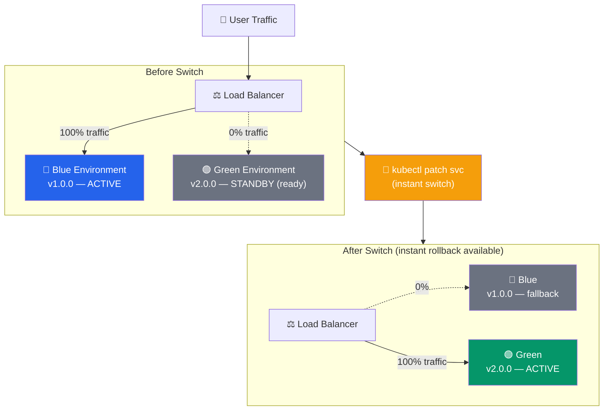
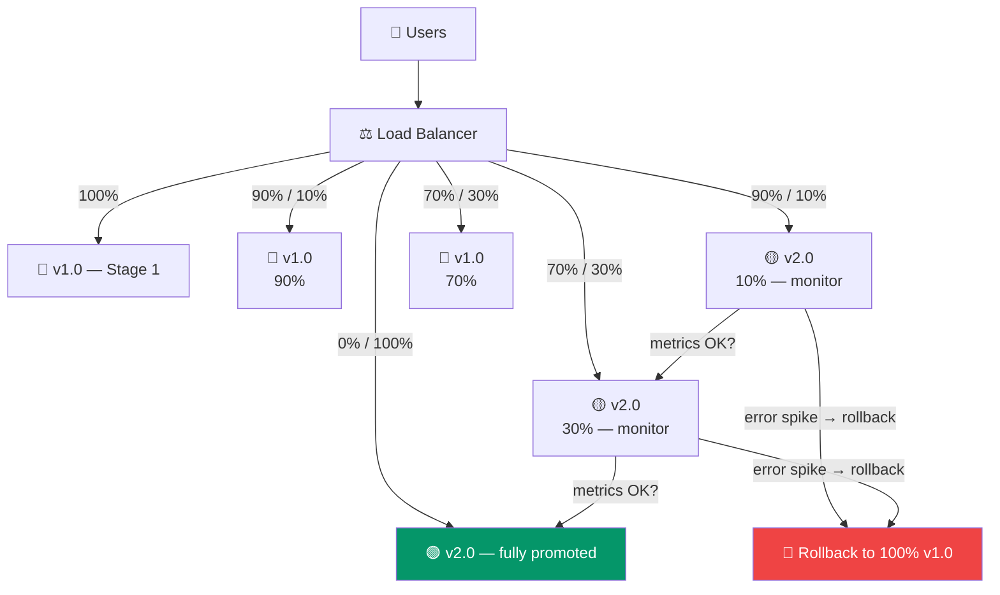

# Deployment Strategies

> Master different deployment patterns to ensure reliable, zero-downtime releases in production.

## Table of Contents
1. [Blue-Green Deployment](#blue-green-deployment)
2. [Canary Deployment](#canary-deployment)
3. [Rolling Deployment](#rolling-deployment)
4. [Feature Flags](#feature-flags)
5. [A/B Testing](#ab-testing)
6. [Rollback Strategies](#rollback-strategies)
7. [Monitoring Deployments](#monitoring-deployments)

---

## Blue-Green Deployment

Two identical production environments: one active (Blue), one standby (Green).

### Architecture



### Implementation

```yaml
deploy_bluegreen:
  stage: deploy
  script:
    # Deploy to green environment
    - kubectl apply -f green-deployment.yaml

    # Wait for green to be ready
    - kubectl rollout status deployment/myapp-green --timeout=5m

    # Run smoke tests on green
    - ./run-smoke-tests.sh green

    # Switch traffic from blue to green
    - kubectl patch service myapp -p '{"spec":{"selector":{"version":"green"}}}'

    # Keep blue running for quick rollback
    - echo "Blue environment still running as fallback"
  environment:
    name: production
    action: prepare
```

### Switching Traffic

```bash
# Check current version
kubectl get svc myapp -o jsonpath='{.spec.selector.version}'
# Output: blue

# Deploy green version
kubectl apply -f green-deployment.yaml
kubectl wait --for=condition=available deployment/myapp-green --timeout=5m

# Run verification
./smoke-tests.sh

# Switch traffic
kubectl patch svc myapp -p '{"spec":{"selector":{"version":"green"}}}'

# Verify
curl http://myapp/version  # Shows v2.0.0

# Rollback if needed (instant)
kubectl patch svc myapp -p '{"spec":{"selector":{"version":"blue"}}}'
```

### Advantages

✅ Zero-downtime deployment
✅ Instant rollback
✅ Easy to test before switching traffic
✅ Simple to understand and implement

### Disadvantages

❌ Requires 2x resources
❌ No gradual rollout (all or nothing)
❌ Database migrations can be complex

---

## Canary Deployment

Gradually roll out new version to small percentage of users first.

### Progressive Traffic Shift



### Kubernetes with Istio

```yaml
apiVersion: networking.istio.io/v1beta1
kind: VirtualService
metadata:
  name: myapp
spec:
  hosts:
  - myapp
  http:
  - match:
    - headers:
        user-type:
          exact: "canary"
    route:
    - destination:
        host: myapp
        subset: v2
      weight: 100
  - route:
    - destination:
        host: myapp
        subset: v1
      weight: 90
    - destination:
        host: myapp
        subset: v2
      weight: 10
```

### Automated Canary with Flagger

```yaml
apiVersion: flagger.app/v1beta1
kind: Canary
metadata:
  name: myapp
spec:
  targetRef:
    apiVersion: apps/v1
    kind: Deployment
    name: myapp

  service:
    port: 8080

  # Analysis
  analysis:
    interval: 1m
    threshold: 5
    maxWeight: 50
    stepWeight: 5

  # Metrics to check during canary
  metrics:
  - name: request-success-rate
    thresholdRange:
      min: 99
    interval: 1m
  - name: request-duration
    thresholdRange:
      max: 500
    interval: 1m

  webhooks:
  - name: smoke-tests
    url: http://flagger-loadtester/
    metadata:
      type: smoke
      cmd: "curl -sd 'test' http://myapp:8080/api/info"
```

### Manual Canary Control

```bash
# Deploy new version
kubectl set image deployment/myapp myapp=myapp:v2.0.0

# Route 10% to new version
kubectl patch virtualservice myapp --type='json' \
  -p='[{"op": "replace", "path": "/spec/http/0/route/1/weight", "value":10}]'

# Monitor metrics (errors, latency)
kubectl logs -l app=myapp,version=v2

# If good, increase
kubectl patch virtualservice myapp --type='json' \
  -p='[{"op": "replace", "path": "/spec/http/0/route/1/weight", "value":50}]'

# Complete rollout
kubectl patch virtualservice myapp --type='json' \
  -p='[{"op": "replace", "path": "/spec/http/0/route/1/weight", "value":100}]'

# Or rollback
kubectl rollout undo deployment/myapp
```

### Advantages

✅ Gradual rollout reduces blast radius
✅ Early detection of issues
✅ Easy to rollback
✅ Good user feedback from small group

### Disadvantages

❌ More complex to implement
❌ Longer deployment time
❌ Requires monitoring setup

---

## Rolling Deployment

Gradually replace old instances with new ones, one at a time.

### Kubernetes Rolling Update

```yaml
apiVersion: apps/v1
kind: Deployment
metadata:
  name: myapp
spec:
  replicas: 4
  strategy:
    type: RollingUpdate
    rollingUpdate:
      maxSurge: 1        # One extra pod during update
      maxUnavailable: 1  # Max one pod down at a time
  template:
    # ...
```

```bash
# Update deployment
kubectl set image deployment/myapp myapp=myapp:v2.0.0 --record

# Watch the rollout
kubectl rollout status deployment/myapp

# View rollout history
kubectl rollout history deployment/myapp

# Rollback if needed
kubectl rollout undo deployment/myapp
```

### Docker Compose Rolling Update

```bash
# Update image in docker-compose.yml
# Then:
docker-compose up -d --no-deps --build myapp

# Services update one instance at a time
```

### Advantages

✅ Automatic rollback on failure
✅ Graceful shutdown (readiness probes)
✅ No 2x resource requirement
✅ Works well for stateless apps

### Disadvantages

❌ Longer deployment time
❌ Mixed versions running temporarily
❌ Complex database migrations

---

## Feature Flags

Deploy code with features hidden behind flags.

### Feature Flag Implementation

```javascript
// featureFlags.js
const flags = {
  'new-dashboard': {
    enabled: true,
    rollout: 50,  // 50% of users
    userIds: ['user123', 'user456'],  // Specific users
  },
  'payment-v2': {
    enabled: false,
  },
};

function isFeatureEnabled(featureName, userId) {
  const flag = flags[featureName];
  if (!flag || !flag.enabled) return false;

  if (flag.userIds && flag.userIds.includes(userId)) return true;
  if (flag.rollout) {
    return (userId.charCodeAt(0) % 100) < flag.rollout;
  }

  return false;
}

// In application
if (isFeatureEnabled('new-dashboard', userId)) {
  showNewDashboard();
} else {
  showOldDashboard();
}
```

### LaunchDarkly Integration

```javascript
const LaunchDarkly = require('launchdarkly-js-client-sdk');

const client = LaunchDarkly.initialize('client-id', {
  user: {
    key: userId,
    email: userEmail,
    custom: {
      tier: 'premium',
    },
  },
});

client.on('ready', () => {
  const showNewFeature = client.variation('new-payment', false);
  if (showNewFeature) {
    // Show new payment feature
  }
});
```

### Advantages

✅ Deploy without enabling
✅ Easy on/off without new deployment
✅ Gradual rollout control
✅ A/B testing capability

### Disadvantages

❌ Code complexity increases
❌ Requires external service (usually)
❌ Technical debt from old features

---

## A/B Testing

Show different versions to different users and measure outcomes.

### A/B Test Setup

```javascript
// Assign user to variant
function assignVariant(userId) {
  const hash = hashUserId(userId);
  return (hash % 2) === 0 ? 'A' : 'B';
}

// Consistent assignment
const variant = assignVariant(userId);  // Same user always gets same variant

if (variant === 'A') {
  showVersion1();  // Old version
} else {
  showVersion2();  // New version
}

// Track metrics
analytics.track('purchase', {
  variant: variant,
  amount: purchaseAmount,
});
```

### Measuring A/B Tests

```sql
-- Analysis after 2 weeks
SELECT
  variant,
  COUNT(*) as users,
  SUM(CASE WHEN converted = 1 THEN 1 ELSE 0 END) as conversions,
  (SUM(CASE WHEN converted = 1 THEN 1 ELSE 0 END) / COUNT(*)) * 100 as conversion_rate,
  AVG(revenue) as avg_revenue
FROM events
WHERE experiment = 'checkout_flow'
  AND event_date >= NOW() - INTERVAL 14 DAY
GROUP BY variant;

-- Results
-- Variant A (old): 1000 users, 5% conversion, $45 avg revenue
-- Variant B (new): 1000 users, 7% conversion, $52 avg revenue
-- → B is better, deploy it!
```

---

## Rollback Strategies

### Instant Rollback

```bash
# Blue-Green: Switch traffic instantly
kubectl patch svc myapp -p '{"spec":{"selector":{"version":"blue"}}}'

# Rolling: Undo deployment
kubectl rollout undo deployment/myapp

# Database: Need migration reversal
./migrate-down.sh
```

### Automated Rollback on Errors

```yaml
deploy:
  script:
    - kubectl apply -f deployment.yaml
    - kubectl wait --for=condition=ready pod -l app=myapp --timeout=5m

  on_failure:
    script:
      # Health checks fail
      - if ! ./health-check.sh; then
          kubectl rollout undo deployment/myapp
          exit 1
        fi
```

### Canary Automatic Rollback

```yaml
canary:
  analysis:
    interval: 1m
    threshold: 5  # Max 5 failed metric checks

    # Auto-rollback if metrics bad
  webhooks:
  - name: error-rate-check
    url: http://prometheus-checker
    # If error rate > 5%, rollback triggers
```

---

## Monitoring Deployments

### Pre-Deployment Checks

```bash
#!/bin/bash
# pre-deploy-checks.sh

set -e

echo "Running pre-deployment checks..."

# Database connectivity
psql -h $DB_HOST -d $DB_NAME -c "SELECT 1"

# Dependency health
curl -f http://auth-service/health
curl -f http://payment-service/health

# Config validation
./validate-config.sh

echo "✓ All checks passed"
```

### Post-Deployment Verification

```yaml
post_deploy:
  script:
    # Wait for health checks
    - kubectl wait --for=condition=ready pod -l app=myapp --timeout=5m

    # Run smoke tests
    - npm run test:smoke

    # Check error rates
    - |
      ERROR_RATE=$(curl -s http://prometheus/api/v1/query?query=error_rate | jq .result[0].value[1])
      if (( $(echo "$ERROR_RATE > 1" | bc -l) )); then
        echo "Error rate too high: $ERROR_RATE%"
        exit 1
      fi

    # Verify traffic
    - curl -f http://myapp/api/health
```

### Deployment Metrics

```javascript
// Track deployment success
const deployment = {
  version: 'v2.0.0',
  startTime: Date.now(),
  strategy: 'canary',
  status: 'in-progress',
  metrics: {
    errorRate: 0.2,
    p99Latency: 245,
    cpuUsage: 65,
    memoryUsage: 512,
  },
};

// Alert on bad metrics
if (deployment.metrics.errorRate > 1.0) {
  alert('High error rate during deployment');
  triggerRollback();
}

if (deployment.metrics.p99Latency > 500) {
  alert('High latency during deployment');
  triggerRollback();
}
```

---

## Practical Example: Complete Deployment

```yaml
name: Deploy to Production

on:
  workflow_dispatch:
    inputs:
      strategy:
        description: Deployment strategy
        required: true
        default: 'canary'
        type: choice
        options:
          - bluegreen
          - canary
          - rolling

jobs:
  deploy:
    runs-on: ubuntu-latest
    environment: production

    steps:
      - uses: actions/checkout@v3

      - name: Run pre-deployment checks
        run: ./scripts/pre-deploy-checks.sh

      - name: Deploy with selected strategy
        run: |
          case "${{ github.event.inputs.strategy }}" in
            bluegreen)
              ./deploy/bluegreen.sh
              ;;
            canary)
              ./deploy/canary.sh
              ;;
            rolling)
              ./deploy/rolling.sh
              ;;
          esac

      - name: Run post-deployment verification
        run: ./scripts/post-deploy-checks.sh

      - name: Slack notification
        if: always()
        run: |
          curl -X POST ${{ secrets.SLACK_WEBHOOK }} \
            -d "{\"text\": \"Deployment ${{ job.status }}\"}"
```

---

## Summary

- **Blue-green** enables instant rollback at cost of 2x resources
- **Canary** minimizes blast radius through gradual rollout
- **Rolling** updates gradually with no extra resources
- **Feature flags** decouple deployment from release
- **A/B testing** validates features with real users
- **Automatic rollback** catches issues before users notice
- **Monitoring** ensures deployments don't degrade service

Next: [Secrets Management](./06_secrets_management.md) - secure credential handling
