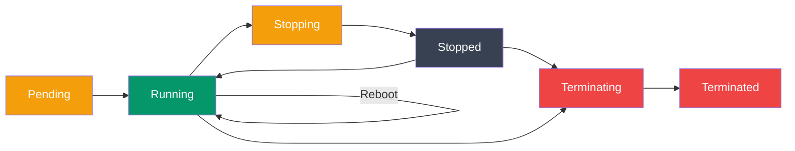

# EC2 Essentials

> EC2 (Elastic Compute Cloud) matlab AWS ka wo service jisse tum ek button click karke (ya ek CLI command chalake) internet pe kahin bhi ek virtual machine spin up kar sakte ho — apna server, apni marzi ka OS, apni marzi ki configuration ke saath.

Socho aise — tumhe agar ek server chahiye Zomato jaisa app chalane ke liye, to purane zamane mein tumhe ek physical machine kharidni padti, data center mein rakhni padti, network cable lagani padti — hafton ka kaam. EC2 ke saath yeh sab kaam 2 minute mein ho jaata hai. Tum bas bolo "mujhe itna CPU, itna RAM, yeh OS chahiye" aur AWS turant tumhe ek virtual server de deta hai — jitni der use karo utna hi paisa lagta hai (pay-as-you-go, bilkul Ola/Uber ki tarah — jitna safar utna fare).

## Table of Contents
1. [EC2 Basics](#ec2-basics)
2. [Launching Instances](#launching-instances)
3. [Instance Types](#instance-types)
4. [Security Groups](#security-groups)
5. [Key Pairs & SSH](#key-pairs--ssh)
6. [Elastic IPs](#elastic-ips)
7. [Monitoring & Status](#monitoring--status)

---

## EC2 Basics

### Kya hota hai EC2?

EC2 tumhe resizable virtual machines ("instances") deta hai cloud mein. "Resizable" ka matlab — aaj tumne chhota server liya, kal traffic badha to bade server pe upgrade kar sakte ho, bina naya hardware kharide. Yeh flexibility hi cloud ka sabse bada fayda hai.

### Key Concepts

Pehle in terms ko clear kar lete hain — inko samajhna zaruri hai kyunki aage sab yehi terms baar baar aayenge:

```
Instance = Virtual machine (server)
AMI = Amazon Machine Image (OS + software template)
Instance Type = CPU, Memory, Storage specs
Key Pair = SSH authentication
Security Group = Firewall rules
Elastic IP = Static public IP
```

Isko aise samjho — jab tum naya laptop kharidte ho:
- **Instance** = wo actual laptop jo chal raha hai
- **AMI** = wo pre-installed OS image jisse laptop banaya gaya (jaise Windows ka recovery image, ya ek "golden image" jisme Ubuntu + Node.js already installed hai)
- **Instance Type** = laptop ka model — i3 wala sasta laptop ya i9 wala gaming beast
- **Key Pair** = ghar ki chaabi jisse tum laptop mein login karte ho (password ki jagah cryptographic key)
- **Security Group** = society ka gate/watchman jo decide karta hai kaun andar aa sakta hai
- **Elastic IP** = tumhare ghar ka fixed address jo change nahi hota, chahe tum ghar band karke wapas kholo

> [!info]
> AMI ek bahut powerful concept hai — tum apna khud ka custom AMI bana sakte ho jisme tumhara app, saari dependencies, configs already installed hon. Phir jab bhi naya server chahiye ho, us AMI se seconds mein launch kar do — bilkul ready-to-use, koi setup nahi karna padta. Isse deployment bahut fast ho jaata hai.

### Instance Lifecycle

Ek EC2 instance apni zindagi mein alag-alag states se guzarta hai — bilkul railway reservation ki tarah jahan ticket "Pending" se "Confirmed" ho ke phir "Boarded" hoti hai.



```
Pending → Running → Stopping → Stopped → Terminating → Terminated
  ↓         ↓          ↓         ↑
  └─────────────────────────────┘ (Reboot)

  Stopped instance can be restarted
  Terminated instance is deleted permanently
```

Har state ka matlab:
- **Pending** — instance launch ho raha hai, AWS backend pe resources allocate ho rahe hain. Bilkul jaise Zomato order "Order placed" state mein hota hai.
- **Running** — instance chal raha hai, tum SSH kar sakte ho, app deploy kar sakte ho. Yeh "Order out for delivery" jaisa hai — sab kuch live hai.
- **Stopping/Stopped** — instance band ho gaya lekin delete nahi hua. EBS volume (disk) intact rehta hai. **Yaad rakho — Stopped instance ka bhi EBS storage cost lagta hai**, lekin compute (CPU/RAM) ka charge nahi lagta. Bilkul jaise gaadi parking mein khadi hai — fuel nahi jal raha lekin parking fee to lagegi.
- **Terminating/Terminated** — instance permanently delete ho gaya. Ab wapas nahi aa sakta. Ye ek one-way street hai — socho jaise ek baar Ola cancel kar diya to wahi ride wapas nahi milegi, nayi book karni padegi.

> [!warning]
> **Stop** aur **Terminate** mein confusion mat karo. Stop = pause (wapas start kar sakte ho, data safe rehta hai). Terminate = permanently delete (instance aur uska root volume by default delete ho jaata hai, wapas nahi aayega). Production mein galti se terminate mat kar dena — bahut developers ne isse seekha hai ki termination protection enable karna kitna zaruri hai.

---

## Launching Instances

### Console Launch (Simple)

Agar tum shuru mein ho, to AWS Console se click-click karke launch karna sabse aasan hai — bilkul jaise BigBasket app pe order place karna, sab kuch UI se guide hota hai.

```bash
# AWS Console → EC2 → Launch Instance
# Select AMI, instance type, configure, launch
# Takes ~5 minutes
```

Isme tum AMI choose karte ho (kaunsa OS chahiye), instance type (kitna CPU/RAM), key pair banate ho, security group configure karte ho aur launch kar dete ho. Console UI ke through karna seekhne walon ke liye best hai kyunki visually samajh aata hai kya options available hain.

### CLI Launch

Real-world mein, khaaskar automation/CI-CD ke liye, tum AWS CLI use karoge. Yeh scriptable hai — matlab tum isko bash script mein daal ke repeatable deployments bana sakte ho.

```bash
# List available AMIs (Amazon Linux 2)
aws ec2 describe-images \
  --owners amazon \
  --filters "Name=name,Values=amzn2-ami-hvm-*" \
  --query 'Images[0].ImageId'

# Launch instance
aws ec2 run-instances \
  --image-id ami-0c55b159cbfafe1f0 \
  --instance-type t2.micro \
  --key-name my-key-pair \
  --security-group-ids sg-12345678 \
  --subnet-id subnet-12345678 \
  --tag-specifications 'ResourceType=instance,Tags=[{Key=Name,Value=web-server}]'
```

Yahan `--tag-specifications` important hai — production mein tumhare paas dozens ya hundreds instances honge, agar unko proper naam (tag) nahi doge to console mein pata hi nahi chalega kaunsa instance kis kaam ka hai. Bilkul jaise Swiggy delivery boy ke paas agar order ID na ho to pata nahi chalega kaunsa parcel kiske liye hai.

### User Data Script

Ab yeh feature bahut powerful hai — **User Data**. Isse tum instance ko bolte ho "jab tum boot ho, khud-ba-khud yeh sab kaam karna" — bina manually SSH karke commands chalaye.

```bash
# Launch with bootstrap script
aws ec2 run-instances \
  --image-id ami-0c55b159cbfafe1f0 \
  --instance-type t2.micro \
  --key-name my-key-pair \
  --user-data file://init-script.sh

# init-script.sh
#!/bin/bash
yum update -y
yum install -y nodejs
npm install -g pm2
cd /home/ec2-user
git clone https://github.com/myrepo/myapp.git
cd myapp
npm install
pm2 start app.js --name myapp
pm2 startup
pm2 save
```

Yeh script instance boot hote hi ek baar chalta hai (root user ke tor pe). Isse tum bilkul "auto-pilot" deployment bana sakte ho — instance banao, script attach karo, aur wo khud apna Node.js, dependencies, app sab install/start kar leta hai. Yeh especially Auto Scaling Groups ke saath bahut kaam aata hai jahan naye instances automatically spin up hote hain traffic badhne pe — har naya instance khud-ba-khud ready ho jaata hai bina kisi manual intervention ke.

> [!tip]
> User data script sirf **first boot** pe chalta hai by default (Linux instances mein cloud-init ke through). Agar tumhe har reboot pe chalana hai to script ke andar special config likhni padti hai. Zyada production setups mein user data ka use sirf basic bootstrap (jaise CloudWatch agent install karna ya config files fetch karna) ke liye hota hai — heavy lifting Ansible/Terraform jaise config management tools karte hain.

### CloudFormation Template

Agar tum Infrastructure as Code (IaC) ki taraf jaana chahte ho — matlab tumhara pura infrastructure ek YAML/JSON file mein defined ho, git mein version-controlled ho — to CloudFormation use hota hai.

```yaml
AWSTemplateFormatVersion: '2010-09-09'
Resources:
  MyInstance:
    Type: AWS::EC2::Instance
    Properties:
      ImageId: ami-0c55b159cbfafe1f0
      InstanceType: t2.micro
      KeyName: my-key-pair
      SecurityGroupIds:
        - sg-12345678
      UserData: !Base64 |
        #!/bin/bash
        yum update -y
        yum install -y nodejs
      Tags:
        - Key: Name
          Value: web-server
```

Iska fayda yeh hai ki tum ek command se pura infrastructure spin up/destroy kar sakte ho, aur agar tumhare paas 10 alag environments (dev, staging, prod) hain, sabko exactly same tarike se banaya ja sakta hai — koi manual click karke galti hone ka chance nahi. (Terraform bhi isi kaam ke liye use hota hai, bas AWS-specific nahi, multi-cloud hota hai.)

---

## Instance Types

### Kyun zaruri hai sahi instance type choose karna?

Har application ki alag zarurat hoti hai — kuch ko zyada CPU chahiye (jaise video encoding), kuch ko zyada RAM chahiye (jaise database), kuch ko dono balanced chahiye (jaise ek simple web server). Galat instance type choose karoge to ya to paisa waste hoga (zyada powerful machine le li jiski zarurat nahi thi) ya performance kharab hogi (kam powerful machine li jo load handle nahi kar payi).

### Categories

```
General Purpose (t2, t3, m5)
- Balanced CPU, memory, networking
- Use: Web servers, small apps

Compute Optimized (c5, c6)
- High CPU
- Use: Batch jobs, ML training, gaming

Memory Optimized (r5, r6)
- High RAM
- Use: Databases, caches, data warehouses

Storage Optimized (i3, h1)
- High disk I/O
- Use: NoSQL databases, data warehouses

Accelerated Computing (p3, g4)
- GPU/TPU
- Use: ML training, graphics rendering
```

Real-world analogy se samjho:
- **General Purpose (t2, t3, m5)** — jaise ek all-rounder cricket player, har cheez thodi thodi achi karta hai. Zyada tar apps ke liye yehi kaafi hai — ek simple Node.js API server, blog, small e-commerce site.
- **Compute Optimized (c5, c6)** — jaise ek fast bowler jiska sirf ek kaam hai — speed. High CPU chahiye jaise video processing, ML model training, ya gaming servers ke liye.
- **Memory Optimized (r5, r6)** — jaise ek bada godown jisme bahut saara saaman rakh sakte ho. Database servers (Postgres, MySQL), in-memory caches (Redis) jaha bahut saara data RAM mein rakhna padta hai — inke liye best.
- **Storage Optimized (i3, h1)** — high-speed disk I/O ke liye, jaise NoSQL databases (Cassandra, MongoDB) jaha bahut fast read/write chahiye disk se.
- **Accelerated Computing (p3, g4)** — GPU wale instances, ML training aur graphics rendering ke liye — bahut expensive hote hain, sirf tab lo jab genuinely GPU ki zarurat ho (jaise deep learning models train karna).

### Sizing

```
t2.micro   = 1 vCPU, 1 GB RAM      (Free tier eligible)
t2.small   = 1 vCPU, 2 GB RAM
t2.medium  = 2 vCPU, 4 GB RAM
t3.medium  = 2 vCPU, 4 GB RAM      (Cheaper than t2)
m5.large   = 2 vCPU, 8 GB RAM
m5.xlarge  = 4 vCPU, 16 GB RAM
c5.large   = 2 vCPU, 4 GB RAM      (Compute optimized)
r5.large   = 2 vCPU, 16 GB RAM     (Memory optimized)
```

**t2.micro** wahi hai jo AWS free tier mein milta hai — perfect hai learning/experimenting ke liye. Yeh note khud isi type ke instance pe test kiya ja sakta hai bina paisa kharch kiye (free tier limits ke andar).

> [!tip]
> `t2` family "burstable" hai — matlab normal load pe kam CPU use karta hai, lekin achanak spike aaye to thodi der ke liye extra CPU "burst credits" use karke fast ho jaata hai. Agar tumhara app consistently high CPU use karta hai (jaise ek busy API), to `t3`/`m5` jaise non-burstable ya better balanced family use karo, warna credits khatam hone pe performance achanak gir jaayegi — bilkul jaise mobile data pack khatam hone ke baad speed throttle ho jaati hai.

### Right-Sizing

**Kyun zaruri hai?** Bahut saare developers ek bada instance le lete hain "just in case" soch ke, aur phir mahine ke end mein bill dekh ke chauk jaate hain. Right-sizing ka matlab hai — actual usage dekho, aur uske hisaab se instance choose karo. Yeh bilkul aise hai jaise CRED pe apna spending track karna — agar dekha ki tum apni gym membership use hi nahi kar rahe, to downgrade kar do.

```bash
# Check CloudWatch metrics
aws cloudwatch get-metric-statistics \
  --namespace AWS/EC2 \
  --metric-name CPUUtilization \
  --dimensions Name=InstanceId,Value=i-1234567890abcdef0 \
  --start-time 2024-01-01T00:00:00Z \
  --end-time 2024-01-31T23:59:59Z \
  --period 86400 \
  --statistics Average

# If average CPU < 5%, downsize to smaller instance type
```

Agar tumhara CloudWatch data dikhata hai ki mahine bhar CPU average 5% se kam use ho raha hai, to matlab tumne zaruri se zyada powerful machine le rakhi hai — downsize karo aur paisa bachao.

---

## Security Groups

### Kya hota hai?

Security Group ek **virtual firewall** hai jo control karta hai kaun sa traffic instance mein aa sakta hai (inbound) aur kaun sa bahar ja sakta hai (outbound). Isko socho apne society ke gate ke watchman ki tarah — watchman decide karta hai kaunse visitors ko andar aane doon, kaunse ko nahi. Bina uski permission ke koi bhi andar nahi aa sakta, chahe wo kitna bhi genuine dikhe.

```bash
# Create security group
aws ec2 create-security-group \
  --group-name web-sg \
  --description "Security group for web servers" \
  --vpc-id vpc-12345678

# Output: GroupId = sg-0123456789abcdef0
```

### Inbound Rules

Inbound rules decide karti hain — bahar se kaun andar aa sakta hai, kis port pe, kahan se.

```bash
# Allow HTTP from anywhere
aws ec2 authorize-security-group-ingress \
  --group-id sg-0123456789abcdef0 \
  --protocol tcp --port 80 --cidr 0.0.0.0/0

# Allow HTTPS from anywhere
aws ec2 authorize-security-group-ingress \
  --group-id sg-0123456789abcdef0 \
  --protocol tcp --port 443 --cidr 0.0.0.0/0

# Allow SSH from specific IP
aws ec2 authorize-security-group-ingress \
  --group-id sg-0123456789abcdef0 \
  --protocol tcp --port 22 --cidr 203.0.113.0/32

# Allow traffic from another security group
aws ec2 authorize-security-group-ingress \
  --group-id sg-0123456789abcdef0 \
  --protocol tcp --port 5432 \
  --source-group sg-db-layer
```

`0.0.0.0/0` ka matlab hai "puri duniya" — kisi se bhi allow karo. Yeh HTTP/HTTPS ke liye theek hai (kyunki tumhari website public hi honi chahiye), lekin SSH ke liye bahut risky hai. `--cidr 203.0.113.0/32` ka matlab hai sirf uss exact IP se allow karo (`/32` matlab ek hi IP address, poora range nahi).

Aur ek cool trick — `--source-group sg-db-layer` — isse tum bolte ho "sirf uss security group wale instances se traffic allow karo", IP address ki jagah. Yeh bahut useful hai jab tumhare paas multiple app servers hain jo ek hi database se baat karte hain — IP hardcode karne ki zarurat nahi, group-to-group rule bana do.

### Outbound Rules

```bash
# By default, all outbound allowed
# To restrict, delete default rule and add specific rules

# Allow outbound HTTP only
aws ec2 authorize-security-group-egress \
  --group-id sg-0123456789abcdef0 \
  --protocol tcp --port 80 --cidr 0.0.0.0/0

# Revoke existing outbound rules first
aws ec2 revoke-security-group-egress \
  --group-id sg-0123456789abcdef0 \
  --ip-permissions IpProtocol=-1,IpRanges='[{CidrIp=0.0.0.0/0}]'
```

By default, EC2 instance kahin bhi bahar traffic bhej sakta hai (koi restriction nahi). Zyadatar cases mein yeh theek hai, lekin high-security environments (jaise banking apps, PCI-compliant systems) mein tum outbound bhi lock down karte ho — taaki agar server compromise ho jaaye to attacker bahar data exfiltrate na kar sake.

### Best Practices

**Kyun zaruri hai "least privilege"?** Socho aise — tumhare ghar ka gate agar 24x7 khula rahe har kisi ke liye, to chor ke liye kaam aasan ho jaata hai. Bilkul waise hi, agar tum security group mein zyada permissive rules rakhoge, to attack surface badh jaata hai — jitna kam khula rahega, utna safe.

```bash
# ✅ Good: Principle of least privilege
aws ec2 authorize-security-group-ingress \
  --group-id sg-web \
  --protocol tcp --port 443 --cidr 0.0.0.0/0  # HTTPS only

# ✅ Good: Restrict SSH to known IPs
aws ec2 authorize-security-group-ingress \
  --group-id sg-web \
  --protocol tcp --port 22 --cidr 203.0.113.0/32

# ❌ Bad: Allow all traffic
aws ec2 authorize-security-group-ingress \
  --group-id sg-web \
  --ip-permissions IpProtocol=-1,IpRanges='[{CidrIp=0.0.0.0/0}]'

# ❌ Bad: Allow SSH to everyone
aws ec2 authorize-security-group-ingress \
  --group-id sg-web \
  --protocol tcp --port 22 --cidr 0.0.0.0/0
```

> [!warning]
> `port 22 --cidr 0.0.0.0/0` (SSH khulа sabke liye) ek sabse common security mistake hai jo naye developers karte hain. Internet pe bots literally 24x7 scan karte rehte hain open SSH ports dhundhne ke liye, aur brute-force attacks try karte hain. Isse bachne ke liye — SSH sirf apne office/ghar ke IP se allow karo, ya better, **AWS Systems Manager Session Manager** use karo jisse bina SSH port khole hi instance mein access mil jaata hai.

---

## Key Pairs & SSH

### Kya hota hai?

Key Pair ek cryptographic authentication mechanism hai — password ki jagah. Isme do keys hoti hain: **private key** (tumhare paas, `.pem` file) aur **public key** (AWS instance pe stored). Jab tum SSH karte ho, dono keys match honi chahiye — bilkul jaise ek lock aur uski unique chaabi. Duplicate chaabi nahi bana sakte, isliye password se zyada secure hai.

### Create Key Pair

```bash
# Create and save key pair
aws ec2 create-key-pair --key-name my-key-pair \
  --query 'KeyMaterial' --output text > my-key-pair.pem

# Secure the key
chmod 400 my-key-pair.pem

# Or import existing key
aws ec2 import-key-pair --key-name my-key-pair \
  --public-key-material fileb://~/.ssh/id_rsa.pub
```

`chmod 400` bahut important hai — yeh permission set karta hai ki sirf tum (owner) hi is file ko read kar sakte ho, koi aur nahi. Agar yeh permission loose rakhoge (jaise 644), SSH khud mana kar dega connect karne se — kyunki agar koi bhi tumhari private key padh sakta hai to security ka koi matlab nahi raha.

> [!warning]
> `.pem` file ek baar generate hone ke baad, AWS iski copy apne paas nahi rakhta. Agar tumne file khoi (delete kar di, laptop crash ho gaya), to us key se banaya hua instance access karna mushkil ho jaayega (though EC2 Instance Connect ya user-data trick se recover kiya ja sakta hai). Isliye `.pem` file ko safe jagah backup karo — kabhi bhi git repo mein commit mat karna!

### SSH Connection

```bash
# Get instance public IP
INSTANCE_IP=$(aws ec2 describe-instances \
  --instance-ids i-1234567890abcdef0 \
  --query 'Reservations[0].Instances[0].PublicIpAddress' \
  --output text)

# SSH to instance (Amazon Linux 2)
ssh -i my-key-pair.pem ec2-user@$INSTANCE_IP

# For Ubuntu AMI
ssh -i my-key-pair.pem ubuntu@$INSTANCE_IP

# For RHEL AMI
ssh -i my-key-pair.pem ec2-user@$INSTANCE_IP
```

Notice karo — SSH username OS ke hisaab se badalta hai. Amazon Linux/RHEL mein `ec2-user` hota hai, Ubuntu mein `ubuntu`. Yeh galti bahut common hai — agar tumne galat username daala to "Permission denied" error milega, aur log soch lete hain key galat hai jabki actually username galat hota hai.

### SSH Config

Baar baar `ssh -i my-key-pair.pem ec2-user@<long-ip-address>` type karna boring ho jaata hai. SSH config file isko shortcut bana deti hai.

```bash
# ~/.ssh/config
Host my-instance
  HostName <instance-ip>
  User ec2-user
  IdentityFile ~/.ssh/my-key-pair.pem
  StrictHostKeyChecking no

# Usage
ssh my-instance
```

Bas ek baar config set kar do, phir sirf `ssh my-instance` type karke connect ho jaao — Swiggy ke "reorder" button jaisa, ek click mein wahi order phir se.

---

## Elastic IPs

### Kya hota hai aur kyun chahiye?

Jab tum ek EC2 instance stop karke phir start karte ho, uska public IP address **change ho jaata hai** by default. Ab socho — agar tumhari website ka DNS record ek IP pe point kar raha hai, aur wo IP change ho jaaye, to tumhari puri site down ho jaayegi jab tak tum DNS update na karo. Isse bachne ke liye Elastic IP use hota hai — ek **static/fixed public IP** jo persist karta hai chahe tum instance stop/start karo.

Socho isko apna khud ka permanent mobile number ki tarah — chahe tum operator badlo (port karo), number wahi rehta hai. Yeh consistency zaruri hai jab log/systems tumhe uss fixed address se identify karte hain.

### Allocate Elastic IP

```bash
# Allocate
aws ec2 allocate-address --domain vpc
# Returns: PublicIp, AllocationId

# Associate with instance
aws ec2 associate-address \
  --instance-id i-1234567890abcdef0 \
  --allocation-id eipalloc-64d5890a

# Disassociate
aws ec2 disassociate-address --association-id eipassoc-2bebb745

# Release
aws ec2 release-address --allocation-id eipalloc-64d5890a
```

### Best Practices

```bash
# ✅ Use Elastic IPs for:
# - Web servers needing static IP
# - DNS pointing to instance
# - Applications requiring persistent connectivity

# ❌ Don't use for:
# - Temporary development instances
# - Auto-scaling groups (use ALB instead)

# Elastic IPs cost money when not in use!
# Release unused Elastic IPs
aws ec2 describe-addresses --query 'Addresses[?AssociationId==null].AllocationId'
```

> [!warning]
> Yeh AWS ka ek quirky billing rule hai jo bahut logo ko surprise deta hai — **Elastic IP free hai jab tak wo ek RUNNING instance se attached hai**. Lekin agar tumne IP allocate kar liya aur kisi instance se attach nahi kiya, ya jis instance se attached hai wo STOPPED hai — tab AWS tumse charge leta hai! Idea yeh hai ki AWS chahta hai IPv4 addresses (jo limited resource hain) waste na ho, isliye unused Elastic IPs pe penalty lagati hai. Isliye agar use nahi kar rahe to turant release kar do.

Auto Scaling Groups ke saath Elastic IP use nahi karte — wahan Application Load Balancer (ALB) use hota hai jo multiple instances ke beech traffic distribute karta hai, kyunki ek fixed IP kisi ek instance se bandh ke rakhna scaling ke concept ke against hi hai.

---

## Monitoring & Status

### Kyun zaruri hai monitoring?

Bina monitoring ke tumhe pata hi nahi chalega server kab struggle kar raha hai, kab crash hone wala hai, ya kab traffic spike ho raha hai. Yeh bilkul aise hai jaise IRCTC tatkal booking ke waqt agar unka monitoring system na ho to unko pata hi nahi chalega ki server load se dab raha hai jab tak website crash na ho jaaye. CloudWatch AWS ka built-in monitoring service hai jo automatically CPU, network, disk jaise metrics collect karta hai.

### CloudWatch Metrics

```bash
# Get CPU utilization
aws cloudwatch get-metric-statistics \
  --namespace AWS/EC2 \
  --metric-name CPUUtilization \
  --dimensions Name=InstanceId,Value=i-1234567890abcdef0 \
  --start-time 2024-01-01T00:00:00Z \
  --end-time 2024-01-02T00:00:00Z \
  --period 3600 \
  --statistics Average,Maximum

# Get network traffic
aws cloudwatch get-metric-statistics \
  --namespace AWS/EC2 \
  --metric-name NetworkIn \
  --dimensions Name=InstanceId,Value=i-1234567890abcdef0 \
  --start-time 2024-01-01T00:00:00Z \
  --end-time 2024-01-02T00:00:00Z \
  --period 3600 \
  --statistics Sum
```

### Instance Status

```bash
# Get instance status
aws ec2 describe-instance-status \
  --instance-ids i-1234567890abcdef0 \
  --query 'InstanceStatuses[0]'

# Output shows:
# - InstanceStatus: ok (system status)
# - SystemStatus: ok (AWS infrastructure)
```

Yahan do alag status checks hote hain — **InstanceStatus** batata hai ki tumhare instance ke andar (OS level) kuch problem to nahi (jaise network configuration, memory corruption). **SystemStatus** batata hai ki AWS ka underlying hardware/infrastructure theek hai ya nahi (jaise power supply, network connectivity to physical host). Agar SystemStatus fail ho jaaye, to fix karne ke liye tumhe instance "stop → start" karna pad sakta hai (jisse wo naye physical hardware pe migrate ho jaaye) — sirf reboot se kaam nahi chalega.

### CloudWatch Alarms

Manually metrics check karte rehna practical nahi hai. Isliye CloudWatch Alarms banate hain — jaise ek smart notification system jo khud batata hai jab kuch galat ho raha ho, bina tumhe baar baar dashboard check karne ki zarurat pade.

```bash
# Alert on high CPU
aws cloudwatch put-metric-alarm \
  --alarm-name cpu-high \
  --alarm-description "Alert when CPU > 80%" \
  --metric-name CPUUtilization \
  --namespace AWS/EC2 \
  --statistic Average \
  --period 300 \
  --threshold 80 \
  --comparison-operator GreaterThanThreshold \
  --alarm-actions arn:aws:sns:us-east-1:123456789012:my-topic
```

Yeh alarm har 5 minute (`--period 300`) mein CPU check karta hai, aur agar average 80% se zyada gaya to SNS topic ke through notification bhej deta hai (jo email, SMS, Slack — kisi bhi channel pe forward ho sakta hai). Production systems mein aisi alarms critical hoti hain — matlab tumhe pata chal jaata hai problem hone se pehle hi, bilkul waise jaise CRED tumhe bill due date se pehle remind karta hai.

---

## Practical Example: Launch Web Server

Ab sab kuch jodke ek complete end-to-end script dekhte hain — jaise ek recipe jisme sabhi ingredients (key pair, security group, instance, elastic IP) ek saath use hote hain ek working web server banane ke liye.

```bash
#!/bin/bash
# launch-web-server.sh

set -e

# 1. Create key pair
aws ec2 create-key-pair --key-name web-server \
  --query 'KeyMaterial' --output text > web-server.pem
chmod 400 web-server.pem

# 2. Create security group
SG=$(aws ec2 create-security-group \
  --group-name web-sg \
  --description "Web server security group" \
  --query 'GroupId' --output text)

# Allow HTTP, HTTPS, SSH
aws ec2 authorize-security-group-ingress --group-id $SG \
  --protocol tcp --port 80 --cidr 0.0.0.0/0
aws ec2 authorize-security-group-ingress --group-id $SG \
  --protocol tcp --port 443 --cidr 0.0.0.0/0
aws ec2 authorize-security-group-ingress --group-id $SG \
  --protocol tcp --port 22 --cidr $(curl -s ipinfo.io/ip)/32

# 3. Launch instance
INSTANCE=$(aws ec2 run-instances \
  --image-id ami-0c55b159cbfafe1f0 \
  --instance-type t2.micro \
  --key-name web-server \
  --security-group-ids $SG \
  --user-data file://init.sh \
  --tag-specifications 'ResourceType=instance,Tags=[{Key=Name,Value=web-server}]' \
  --query 'Instances[0].InstanceId' --output text)

# 4. Allocate Elastic IP
ALLOC=$(aws ec2 allocate-address --domain vpc \
  --query 'AllocationId' --output text)

sleep 10  # Wait for instance to be running

aws ec2 associate-address \
  --instance-id $INSTANCE \
  --allocation-id $ALLOC

# 5. Get details
IP=$(aws ec2 describe-addresses --allocation-ids $ALLOC \
  --query 'Addresses[0].PublicIp' --output text)

echo "Web server launched!"
echo "Instance ID: $INSTANCE"
echo "Public IP: $IP"
echo "SSH: ssh -i web-server.pem ec2-user@$IP"
```

Notice karo `$(curl -s ipinfo.io/ip)/32` wala trick — yeh script khud detect karta hai tumhara current public IP aur usi ko SSH access deta hai, poori duniya ko nahi. Yeh bilkul wahi "least privilege" principle hai jo humne upar security groups mein discuss kiya. Aur `sleep 10` isliye lagaya hai kyunki instance ko "Running" state mein aane mein thoda time lagta hai — Elastic IP associate karne se pehle instance ready hona chahiye, warna API call fail ho sakti hai.

> [!tip]
> Real production environments mein yeh sab manual bash scripting ki jagah Terraform ya CloudFormation se hota hai — jisse tumhe `sleep 10` jaisi race-condition hacks nahi karni padti, tool khud dependencies handle karta hai (jaise "Elastic IP tabhi associate karo jab instance Running ho jaaye").

## Key Takeaways

- **EC2** cloud mein resizable virtual machines deta hai — pay-as-you-go model, jaise Ola/Uber ka fare system
- Instance ki **lifecycle** hoti hai: Pending → Running → Stopped/Terminated — Stop reversible hai, Terminate permanent
- **Instance types** categories mein bante hain — General Purpose, Compute Optimized, Memory Optimized, Storage Optimized, Accelerated Computing — apni app ki zarurat ke hisaab se choose karo
- **Right-sizing** (CloudWatch metrics dekh ke) paisa bachata hai — zyada powerful machine lena waste hai
- **Security Groups** virtual firewall hain — hamesha "least privilege" follow karo, SSH ko `0.0.0.0/0` pe kabhi mat kholo
- **Key Pairs** password ki jagah cryptographic authentication dete hain — `.pem` file safe rakho, `chmod 400` zaruri hai
- **Elastic IPs** static public IP dete hain jo stop/start ke baad bhi change nahi hote — lekin unused hone pe cost lagta hai, isliye release kar do
- **CloudWatch** monitoring aur alarms se pehle hi pata chal jaata hai problem hone se pehle
- **User Data scripts** se instance boot hote hi khud-ba-khud apna setup kar leta hai — automation ka base yahi hai

Next: [ECS & ECR](./03_ecs_and_ecr.md) - container orchestration on AWS
