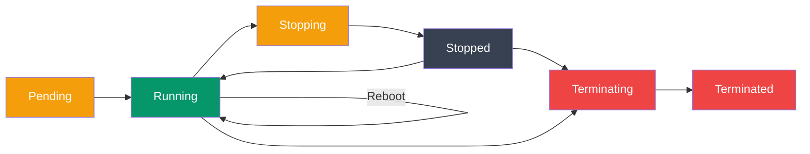

# EC2 Essentials

> Launch, manage, and scale virtual machines on AWS with EC2 (Elastic Compute Cloud).

## Table of Contents
1. [EC2 Basics](#ec2-basics)
2. [Launching Instances](#launching-instances)
3. [Instance Types](#instance-types)
4. [Security Groups](#security-groups)
5. [Key Pairs & SSH](#key-pairs--ssh)
6. [Elastic IPs](#elastic-ips)
7. [Monitoring & Status](#monitoring--status)

---

## EC2 Basics

EC2 provides resizable virtual machines (instances) in the cloud.

### Key Concepts

```
Instance = Virtual machine (server)
AMI = Amazon Machine Image (OS + software template)
Instance Type = CPU, Memory, Storage specs
Key Pair = SSH authentication
Security Group = Firewall rules
Elastic IP = Static public IP
```

### Instance Lifecycle



```
Pending → Running → Stopping → Stopped → Terminating → Terminated
  ↓         ↓          ↓         ↑
  └─────────────────────────────┘ (Reboot)

  Stopped instance can be restarted
  Terminated instance is deleted permanently
```

---

## Launching Instances

### Console Launch (Simple)

```bash
# AWS Console → EC2 → Launch Instance
# Select AMI, instance type, configure, launch
# Takes ~5 minutes
```

### CLI Launch

```bash
# List available AMIs (Amazon Linux 2)
aws ec2 describe-images \
  --owners amazon \
  --filters "Name=name,Values=amzn2-ami-hvm-*" \
  --query 'Images[0].ImageId'

# Launch instance
aws ec2 run-instances \
  --image-id ami-0c55b159cbfafe1f0 \
  --instance-type t2.micro \
  --key-name my-key-pair \
  --security-group-ids sg-12345678 \
  --subnet-id subnet-12345678 \
  --tag-specifications 'ResourceType=instance,Tags=[{Key=Name,Value=web-server}]'
```

### User Data Script

```bash
# Launch with bootstrap script
aws ec2 run-instances \
  --image-id ami-0c55b159cbfafe1f0 \
  --instance-type t2.micro \
  --key-name my-key-pair \
  --user-data file://init-script.sh

# init-script.sh
#!/bin/bash
yum update -y
yum install -y nodejs
npm install -g pm2
cd /home/ec2-user
git clone https://github.com/myrepo/myapp.git
cd myapp
npm install
pm2 start app.js --name myapp
pm2 startup
pm2 save
```

### CloudFormation Template

```yaml
AWSTemplateFormatVersion: '2010-09-09'
Resources:
  MyInstance:
    Type: AWS::EC2::Instance
    Properties:
      ImageId: ami-0c55b159cbfafe1f0
      InstanceType: t2.micro
      KeyName: my-key-pair
      SecurityGroupIds:
        - sg-12345678
      UserData: !Base64 |
        #!/bin/bash
        yum update -y
        yum install -y nodejs
      Tags:
        - Key: Name
          Value: web-server
```

---

## Instance Types

### Categories

```
General Purpose (t2, t3, m5)
- Balanced CPU, memory, networking
- Use: Web servers, small apps

Compute Optimized (c5, c6)
- High CPU
- Use: Batch jobs, ML training, gaming

Memory Optimized (r5, r6)
- High RAM
- Use: Databases, caches, data warehouses

Storage Optimized (i3, h1)
- High disk I/O
- Use: NoSQL databases, data warehouses

Accelerated Computing (p3, g4)
- GPU/TPU
- Use: ML training, graphics rendering
```

### Sizing

```
t2.micro   = 1 vCPU, 1 GB RAM      (Free tier eligible)
t2.small   = 1 vCPU, 2 GB RAM
t2.medium  = 2 vCPU, 4 GB RAM
t3.medium  = 2 vCPU, 4 GB RAM      (Cheaper than t2)
m5.large   = 2 vCPU, 8 GB RAM
m5.xlarge  = 4 vCPU, 16 GB RAM
c5.large   = 2 vCPU, 4 GB RAM      (Compute optimized)
r5.large   = 2 vCPU, 16 GB RAM     (Memory optimized)
```

### Right-Sizing

```bash
# Check CloudWatch metrics
aws cloudwatch get-metric-statistics \
  --namespace AWS/EC2 \
  --metric-name CPUUtilization \
  --dimensions Name=InstanceId,Value=i-1234567890abcdef0 \
  --start-time 2024-01-01T00:00:00Z \
  --end-time 2024-01-31T23:59:59Z \
  --period 86400 \
  --statistics Average

# If average CPU < 5%, downsize to smaller instance type
```

---

## Security Groups

Firewall rules controlling inbound/outbound traffic.

### Create Security Group

```bash
# Create security group
aws ec2 create-security-group \
  --group-name web-sg \
  --description "Security group for web servers" \
  --vpc-id vpc-12345678

# Output: GroupId = sg-0123456789abcdef0
```

### Inbound Rules

```bash
# Allow HTTP from anywhere
aws ec2 authorize-security-group-ingress \
  --group-id sg-0123456789abcdef0 \
  --protocol tcp --port 80 --cidr 0.0.0.0/0

# Allow HTTPS from anywhere
aws ec2 authorize-security-group-ingress \
  --group-id sg-0123456789abcdef0 \
  --protocol tcp --port 443 --cidr 0.0.0.0/0

# Allow SSH from specific IP
aws ec2 authorize-security-group-ingress \
  --group-id sg-0123456789abcdef0 \
  --protocol tcp --port 22 --cidr 203.0.113.0/32

# Allow traffic from another security group
aws ec2 authorize-security-group-ingress \
  --group-id sg-0123456789abcdef0 \
  --protocol tcp --port 5432 \
  --source-group sg-db-layer
```

### Outbound Rules

```bash
# By default, all outbound allowed
# To restrict, delete default rule and add specific rules

# Allow outbound HTTP only
aws ec2 authorize-security-group-egress \
  --group-id sg-0123456789abcdef0 \
  --protocol tcp --port 80 --cidr 0.0.0.0/0

# Revoke existing outbound rules first
aws ec2 revoke-security-group-egress \
  --group-id sg-0123456789abcdef0 \
  --ip-permissions IpProtocol=-1,IpRanges='[{CidrIp=0.0.0.0/0}]'
```

### Best Practices

```bash
# ✅ Good: Principle of least privilege
aws ec2 authorize-security-group-ingress \
  --group-id sg-web \
  --protocol tcp --port 443 --cidr 0.0.0.0/0  # HTTPS only

# ✅ Good: Restrict SSH to known IPs
aws ec2 authorize-security-group-ingress \
  --group-id sg-web \
  --protocol tcp --port 22 --cidr 203.0.113.0/32

# ❌ Bad: Allow all traffic
aws ec2 authorize-security-group-ingress \
  --group-id sg-web \
  --ip-permissions IpProtocol=-1,IpRanges='[{CidrIp=0.0.0.0/0}]'

# ❌ Bad: Allow SSH to everyone
aws ec2 authorize-security-group-ingress \
  --group-id sg-web \
  --protocol tcp --port 22 --cidr 0.0.0.0/0
```

---

## Key Pairs & SSH

Cryptographic key for authenticating to instances.

### Create Key Pair

```bash
# Create and save key pair
aws ec2 create-key-pair --key-name my-key-pair \
  --query 'KeyMaterial' --output text > my-key-pair.pem

# Secure the key
chmod 400 my-key-pair.pem

# Or import existing key
aws ec2 import-key-pair --key-name my-key-pair \
  --public-key-material fileb://~/.ssh/id_rsa.pub
```

### SSH Connection

```bash
# Get instance public IP
INSTANCE_IP=$(aws ec2 describe-instances \
  --instance-ids i-1234567890abcdef0 \
  --query 'Reservations[0].Instances[0].PublicIpAddress' \
  --output text)

# SSH to instance (Amazon Linux 2)
ssh -i my-key-pair.pem ec2-user@$INSTANCE_IP

# For Ubuntu AMI
ssh -i my-key-pair.pem ubuntu@$INSTANCE_IP

# For RHEL AMI
ssh -i my-key-pair.pem ec2-user@$INSTANCE_IP
```

### SSH Config

```bash
# ~/.ssh/config
Host my-instance
  HostName <instance-ip>
  User ec2-user
  IdentityFile ~/.ssh/my-key-pair.pem
  StrictHostKeyChecking no

# Usage
ssh my-instance
```

---

## Elastic IPs

Static public IP addresses that persist across stop/start.

### Allocate Elastic IP

```bash
# Allocate
aws ec2 allocate-address --domain vpc
# Returns: PublicIp, AllocationId

# Associate with instance
aws ec2 associate-address \
  --instance-id i-1234567890abcdef0 \
  --allocation-id eipalloc-64d5890a

# Disassociate
aws ec2 disassociate-address --association-id eipassoc-2bebb745

# Release
aws ec2 release-address --allocation-id eipalloc-64d5890a
```

### Best Practices

```bash
# ✅ Use Elastic IPs for:
# - Web servers needing static IP
# - DNS pointing to instance
# - Applications requiring persistent connectivity

# ❌ Don't use for:
# - Temporary development instances
# - Auto-scaling groups (use ALB instead)

# Elastic IPs cost money when not in use!
# Release unused Elastic IPs
aws ec2 describe-addresses --query 'Addresses[?AssociationId==null].AllocationId'
```

---

## Monitoring & Status

### CloudWatch Metrics

```bash
# Get CPU utilization
aws cloudwatch get-metric-statistics \
  --namespace AWS/EC2 \
  --metric-name CPUUtilization \
  --dimensions Name=InstanceId,Value=i-1234567890abcdef0 \
  --start-time 2024-01-01T00:00:00Z \
  --end-time 2024-01-02T00:00:00Z \
  --period 3600 \
  --statistics Average,Maximum

# Get network traffic
aws cloudwatch get-metric-statistics \
  --namespace AWS/EC2 \
  --metric-name NetworkIn \
  --dimensions Name=InstanceId,Value=i-1234567890abcdef0 \
  --start-time 2024-01-01T00:00:00Z \
  --end-time 2024-01-02T00:00:00Z \
  --period 3600 \
  --statistics Sum
```

### Instance Status

```bash
# Get instance status
aws ec2 describe-instance-status \
  --instance-ids i-1234567890abcdef0 \
  --query 'InstanceStatuses[0]'

# Output shows:
# - InstanceStatus: ok (system status)
# - SystemStatus: ok (AWS infrastructure)
```

### CloudWatch Alarms

```bash
# Alert on high CPU
aws cloudwatch put-metric-alarm \
  --alarm-name cpu-high \
  --alarm-description "Alert when CPU > 80%" \
  --metric-name CPUUtilization \
  --namespace AWS/EC2 \
  --statistic Average \
  --period 300 \
  --threshold 80 \
  --comparison-operator GreaterThanThreshold \
  --alarm-actions arn:aws:sns:us-east-1:123456789012:my-topic
```

---

## Practical Example: Launch Web Server

```bash
#!/bin/bash
# launch-web-server.sh

set -e

# 1. Create key pair
aws ec2 create-key-pair --key-name web-server \
  --query 'KeyMaterial' --output text > web-server.pem
chmod 400 web-server.pem

# 2. Create security group
SG=$(aws ec2 create-security-group \
  --group-name web-sg \
  --description "Web server security group" \
  --query 'GroupId' --output text)

# Allow HTTP, HTTPS, SSH
aws ec2 authorize-security-group-ingress --group-id $SG \
  --protocol tcp --port 80 --cidr 0.0.0.0/0
aws ec2 authorize-security-group-ingress --group-id $SG \
  --protocol tcp --port 443 --cidr 0.0.0.0/0
aws ec2 authorize-security-group-ingress --group-id $SG \
  --protocol tcp --port 22 --cidr $(curl -s ipinfo.io/ip)/32

# 3. Launch instance
INSTANCE=$(aws ec2 run-instances \
  --image-id ami-0c55b159cbfafe1f0 \
  --instance-type t2.micro \
  --key-name web-server \
  --security-group-ids $SG \
  --user-data file://init.sh \
  --tag-specifications 'ResourceType=instance,Tags=[{Key=Name,Value=web-server}]' \
  --query 'Instances[0].InstanceId' --output text)

# 4. Allocate Elastic IP
ALLOC=$(aws ec2 allocate-address --domain vpc \
  --query 'AllocationId' --output text)

sleep 10  # Wait for instance to be running

aws ec2 associate-address \
  --instance-id $INSTANCE \
  --allocation-id $ALLOC

# 5. Get details
IP=$(aws ec2 describe-addresses --allocation-ids $ALLOC \
  --query 'Addresses[0].PublicIp' --output text)

echo "Web server launched!"
echo "Instance ID: $INSTANCE"
echo "Public IP: $IP"
echo "SSH: ssh -i web-server.pem ec2-user@$IP"
```

---

## Summary

- **EC2** provides on-demand virtual machines
- **Instance types** range from t2.micro (free) to GPU-accelerated
- **Security groups** control network access
- **Key pairs** enable SSH authentication
- **Elastic IPs** provide static public addresses
- **CloudWatch** monitors CPU, memory, network
- **Right-sizing** reduces costs

Next: [ECS & ECR](./03_ecs_and_ecr.md) - container orchestration on AWS
