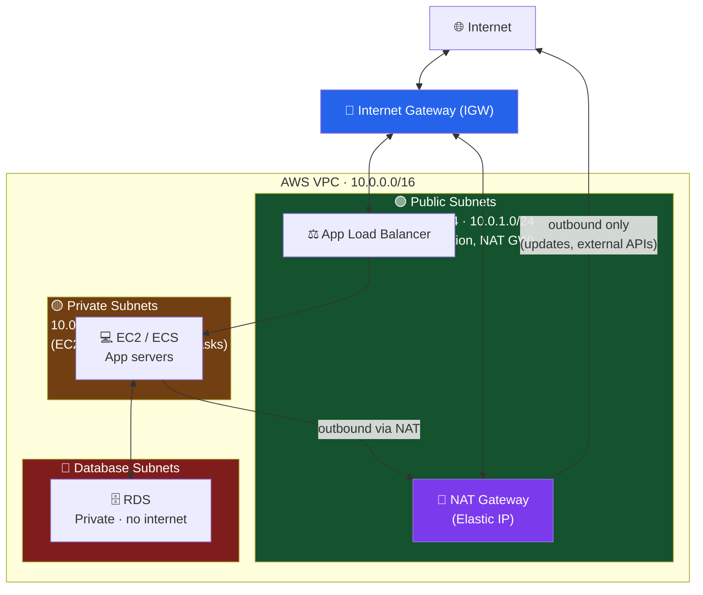

# VPC Networking

> Design secure, scalable networks with VPCs, subnets, route tables, and NAT gateways.

Socho tum Zomato ka poora backend infrastructure AWS pe khada kar rahe ho. Ab agar tum sab kuch — database, app servers, load balancer — ek hi khule maidan mein daal do jahan koi bhi internet se seedha andar aa sakta hai, toh yeh basically apna ghar bina taala lagaye chhodne jaisa hai. **VPC (Virtual Private Cloud)** wahi taala hai — tumhara apna private, isolated network jo AWS ke andar hi banta hai, jisme tum decide karte ho kaun andar aa sakta hai, kaun bahar ja sakta hai, aur kaun sirf andar hi ghoom sakta hai.

Ismein hum seekhenge ki kaise ek secure, scalable network banate hain — public subnets (jo internet se directly baat karte hain), private subnets (jo hidden rehte hain), aur database subnets (jo poori tarah lock hote hain), plus inke beech traffic control karne wale route tables aur NAT gateways.

## VPC Architecture

**Kya hota hai?** VPC ek bada virtual data-center jaisa hai jo sirf tumhare liye reserved hai — jaise ek gated society jisme tumhara apna security guard, apna gate, apna internal road network hota hai. Is society ke andar tum alag-alag "sectors" (subnets) banate ho — kuch sectors road pe khule hain (public), kuch andar chhupe hain (private), aur ek sector toh itna secure hai ki uska darwaza bahar ki taraf khulta hi nahi (database subnet).



Is diagram ko Zomato ke restaurant model se samjho:

- **Internet Gateway (IGW)** — yeh tumhari society ka main gate hai. Bina iske koi bhi traffic VPC ke andar-bahar nahi ja sakta. Ek VPC pe ek hi IGW attach hota hai.
- **Public Subnet (🟢)** — yeh society ka wo hissa hai jo road-facing hai, jahan tumhara reception counter (Load Balancer) baitha hai. Yahan koi bhi customer (internet user) seedha aa sakta hai kyunki route table mein `0.0.0.0/0 → IGW` ka route explicitly diya hua hai.
- **Private Subnet (🟡)** — yeh kitchen jaisa hai. Customer seedha kitchen mein nahi ghus sakta — order Load Balancer se hoke app server (EC2/ECS) tak jaata hai. Lekin kitchen ko bhi kabhi-kabhi bahar se ration (updates, third-party APIs jaise Razorpay, Twilio) chahiye hota hai — uske liye NAT Gateway ka use hota hai.
- **Database Subnet (🔴)** — yeh tumhara locked store-room hai jahan raw material (customer data, orders) rakha hai. Isme koi route hi nahi hai internet ki taraf — na koi andar aa sakta hai, na yeh khud bahar ja sakta hai. Sirf app servers hi isse baat kar sakte hain, andar hi andar.

> [!tip]
> Real production setups mein hamesha subnets ko **multiple Availability Zones (AZ)** mein spread karo — jaise upar diagram mein `10.0.0.0/24` AZ-a mein hai aur `10.0.1.0/24` AZ-b mein. Agar Mumbai ka ek data center down ho jaaye, toh Delhi wala backup sambhal le — yeh hi high-availability ka core idea hai.

### Create VPC

**Kyun zaruri hai?** Yeh VPC ka skeleton hai — sabse pehle tumhe apni "society" ki boundary define karni padti hai (CIDR block), phir usme plots (subnets) katne padte hain.

```bash
# Create VPC
aws ec2 create-vpc --cidr-block 10.0.0.0/16

# Create subnets
aws ec2 create-subnet \
  --vpc-id vpc-123 \
  --cidr-block 10.0.1.0/24 \
  --availability-zone us-east-1a

# Create public and private subnets
# Public: attach IGW + route to 0.0.0.0/0 → IGW
# Private: route to 0.0.0.0/0 → NAT Gateway
# Database: no route to internet
```

`10.0.0.0/16` matlab tumhare paas 65,536 IP addresses ka pool hai poore VPC ke liye — yeh tumhari society ka total land hai. Har subnet (`/24`) usme se 256 addresses ka ek chhota plot hai. Ek subnet ko "public" ya "private" banane wali cheez CIDR range nahi hai — balki uska **route table** hai, jo hum aage dekhenge.

> [!info]
> AWS har subnet mein 5 IP addresses reserve rakhta hai internal use ke liye (network address, VPC router, DNS, future use, aur broadcast address). Toh ek `/24` subnet (256 IPs) mein actually usable sirf 251 IPs milte hain — planning karte waqt yeh dhyan rakhna.

### NAT Gateway

**Kya hota hai NAT Gateway?** Socho tumhare kitchen staff (private subnet ke EC2/ECS servers) ko bahar se sabzi mangwani hai (jaise ek external payment API se baat karni hai), lekin customer unhe directly dekh ya call nahi kar sakta. NAT Gateway ek trusted delivery boy jaisa hai — woh bahar jaake saaman le aata hai, lekin bahar wala kabhi seedha kitchen tak nahi pahunch sakta. Yeh **one-way outbound access** deta hai: private subnet bahar jaa sakta hai, lekin bahar se koi private subnet mein ghus nahi sakta.

```bash
# NAT Gateway allows private instances to access internet
# (for updates, external APIs)

# 1. Allocate Elastic IP
aws ec2 allocate-address --domain vpc

# 2. Create NAT Gateway in public subnet
aws ec2 create-nat-gateway \
  --subnet-id subnet-public \
  --allocation-id eipalloc-123

# 3. Create route in private subnet
aws ec2 create-route \
  --route-table-id rtb-private \
  --destination-cidr-block 0.0.0.0/0 \
  --nat-gateway-id nat-123
```

Notice karo — NAT Gateway hamesha **public subnet** mein banta hai (kyunki usko khud internet tak pahunchna hota hai via IGW), aur phir private subnet ka route table usi NAT Gateway ki taraf point karta hai. Yeh thoda confusing lagta hai shuru mein, but logic simple hai: NAT khud IGW ke through internet se baat karta hai, aur private servers apna traffic NAT ko forward karte hain.

> [!warning]
> NAT Gateway paisa leta hai — per-hour charge + per-GB data processing charge, chaahe traffic kam ho ya zyada. Production mein agar cost bachani hai aur high-availability zaruri nahi, toh chhote projects ke liye **NAT Instance** (ek chhota EC2 jo NAT jaisa kaam kare) use kar sakte ho, lekin woh manually manage karna padta hai. Bade production systems (jaise Flipkart-scale) NAT Gateway hi use karte hain kyunki woh AWS-managed, highly available hai.

### Security Groups & NACLs

**Yeh dono firewall hi hain, but different level pe kaam karte hain — inko confuse mat karo.**

```bash
# Security Group (stateful firewall)
# Only allow what you need

# NACL (stateless firewall - subnet level)
# Default: allow all in/out
# Custom: explicitly allow/deny
```

Inka farak samajhne ke liye ek CRED ka analogy lo:

- **Security Group** ek **instance-level bouncer** hai — jaise CRED app ka login screen jo check karta hai "yeh request legit hai kya?". Yeh **stateful** hai, matlab agar tumne ek request andar aane di, toh uska response automatically bahar jaane diya jaayega — tumhe return traffic ke liye alag rule nahi likhna padta. Default mein Security Group sab kuch **deny** karta hai jab tak tum explicitly allow na karo.

- **NACL (Network ACL)** ek **subnet-level building gate** hai — poore subnet ke liye ek common rule set. Yeh **stateless** hai, matlab agar tumne inbound traffic allow kiya, toh outbound (return traffic) ke liye bhi alag se rule likhna padega. Default NACL sab allow karta hai, lekin custom NACL banaओगे toh explicitly allow/deny dono likhne padte hain, aur yeh rules **numbered order** mein evaluate hote hain (jaise 100, 200, 300 — kam number pehle check hota hai).

| | Security Group | NACL |
|---|---|---|
| Level | Instance (EC2/ENI) | Subnet |
| State | Stateful (return traffic auto-allowed) | Stateless (return traffic explicitly allow karna) |
| Rules | Sirf Allow | Allow aur Deny dono |
| Evaluation | Sab rules check hote hain | Number order mein, pehla match jeetta hai |
| Default | Sab deny (inbound), sab allow (outbound) | Sab allow |

> [!tip]
> Practical advice: 90% cases mein sirf **Security Groups** se kaam chal jaata hai. NACLs tab use karo jab tumhe subnet-level pe kisi specific IP range ko explicitly block karna ho (jaise ek malicious IP range) — yeh ek extra safety layer hai, defense-in-depth ke liye.

---

## Practical VPC Setup

Ab yeh sab concepts ko ek real script mein jodte hain — jaise IRCTC ka poora infrastructure setup karna ho scratch se: pehle VPC, phir gate (IGW), phir plots (subnets), phir road-map (route tables), aur phir unhe jodna (associations).

```bash
#!/bin/bash
# setup-vpc.sh

# Create VPC
VPC=$(aws ec2 create-vpc --cidr-block 10.0.0.0/16 \
  --query 'Vpc.VpcId' --output text)

# Create IGW
IGW=$(aws ec2 create-internet-gateway \
  --query 'InternetGateway.InternetGatewayId' --output text)
aws ec2 attach-internet-gateway --vpc-id $VPC --internet-gateway-id $IGW

# Create public subnet
PUBLIC=$(aws ec2 create-subnet --vpc-id $VPC --cidr-block 10.0.1.0/24 \
  --query 'Subnet.SubnetId' --output text)

# Create private subnet
PRIVATE=$(aws ec2 create-subnet --vpc-id $VPC --cidr-block 10.0.2.0/24 \
  --query 'Subnet.SubnetId' --output text)

# Create route tables
PUB_RTB=$(aws ec2 create-route-table --vpc-id $VPC \
  --query 'RouteTable.RouteTableId' --output text)
aws ec2 create-route --route-table-id $PUB_RTB \
  --destination-cidr-block 0.0.0.0/0 --gateway-id $IGW

PRIV_RTB=$(aws ec2 create-route-table --vpc-id $VPC \
  --query 'RouteTable.RouteTableId' --output text)

# Associate subnets
aws ec2 associate-route-table --subnet-id $PUBLIC --route-table-id $PUB_RTB
aws ec2 associate-route-table --subnet-id $PRIVATE --route-table-id $PRIV_RTB

echo "VPC: $VPC"
echo "Public Subnet: $PUBLIC"
echo "Private Subnet: $PRIVATE"
```

Is script ko step-by-step samjho:

1. **VPC banaya** — apni society ki boundary khींची (`10.0.0.0/16`).
2. **IGW banake attach kiya** — society ka main gate laga diya, taki internet se connection possible ho.
3. **Public aur Private subnet banaye** — do plots kaate, society ke andar.
4. **Route tables banaye** — yeh sabse important step hai. Ek subnet "public" tab banta hai jab uske route table mein `0.0.0.0/0 → IGW` likha ho. Notice karo — private subnet ke route table mein humne koi internet route add hi nahi kiya (agar NAT chahiye toh alag se add karna padega jaisa upar dikhaya).
5. **Associate kiya** — subnet ko uske respective route table se jod diya. Yeh association hi decide karta hai ki subnet ka traffic kis direction jaayega.

> [!warning]
> Ek common mistake yeh hoti hai ki log subnet bana lete hain lekin route table associate karna bhool jaate hain — is case mein subnet automatically VPC ke **main route table** (default) se associate ho jaata hai, jo shaayad wahi behavior na de jo tum chahte ho. Hamesha explicitly check karo ki kaunsa route table kis subnet se juda hai.

---

## Summary

- **VPC** isolates infrastructure — tumhara apna private network AWS cloud ke andar
- **Public subnets** have internet access via IGW — jahan Load Balancer, Bastion host, NAT Gateway rehte hain
- **Private subnets** use NAT for outbound internet — app servers yahan chhupe rehte hain, sirf outbound access milta hai
- **Security groups** control instance-level traffic — stateful, per-EC2/ENI firewall
- **NACLs** control subnet-level traffic — stateless, subnet-wide firewall, numbered rules
- **Route tables** direct traffic — yeh decide karte hain ki subnet "public" hai ya "private"

Next: [AWS Complete](../04_orchestration/) - Container Orchestration

## Key Takeaways

- VPC ek isolated virtual network hai jisme tum apni infrastructure ko subnets mein divide karte ho — public (internet-facing), private (app layer), aur database (fully locked) — jaise ek gated society ke andar alag-alag security zones.
- Internet Gateway (IGW) VPC ka ek hi entry-exit gate hota hai; usके bina koi bhi traffic bahar ya andar nahi aa sakta.
- NAT Gateway private subnet ko sirf **outbound** internet access deta hai (updates, external APIs ke liye) — bina inbound traffic allow kiye, aur hamesha public subnet mein rehta hai.
- Kisi subnet ka "public" ya "private" hona uske CIDR range se nahi, uske **route table** se decide hota hai (`0.0.0.0/0 → IGW` hoga toh public).
- Security Groups instance-level, stateful firewall hain (return traffic auto-allow); NACLs subnet-level, stateless firewall hain (numbered rules, explicit allow/deny dono direction mein).
- Database subnets ko internet se poori tarah cut off rakho — koi route hi mat do bahar ki taraf, taki sensitive data leak hone ka chance zero ho.
- Multiple Availability Zones mein subnets spread karna high-availability ke liye zaruri hai — ek AZ down hone pe doosra sambhal le.
