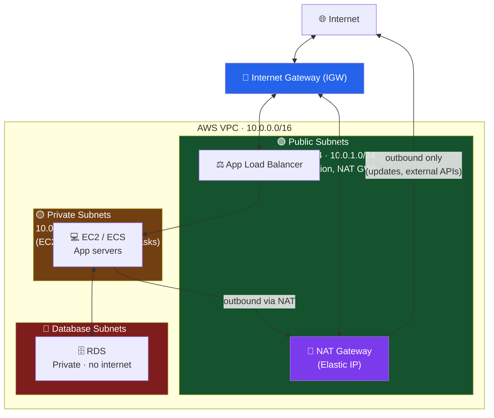

# VPC Networking

> Design secure, scalable networks with VPCs, subnets, route tables, and NAT gateways.

## VPC Architecture



### Create VPC

```bash
# Create VPC
aws ec2 create-vpc --cidr-block 10.0.0.0/16

# Create subnets
aws ec2 create-subnet \
  --vpc-id vpc-123 \
  --cidr-block 10.0.1.0/24 \
  --availability-zone us-east-1a

# Create public and private subnets
# Public: attach IGW + route to 0.0.0.0/0 → IGW
# Private: route to 0.0.0.0/0 → NAT Gateway
# Database: no route to internet
```

### NAT Gateway

```bash
# NAT Gateway allows private instances to access internet
# (for updates, external APIs)

# 1. Allocate Elastic IP
aws ec2 allocate-address --domain vpc

# 2. Create NAT Gateway in public subnet
aws ec2 create-nat-gateway \
  --subnet-id subnet-public \
  --allocation-id eipalloc-123

# 3. Create route in private subnet
aws ec2 create-route \
  --route-table-id rtb-private \
  --destination-cidr-block 0.0.0.0/0 \
  --nat-gateway-id nat-123
```

### Security Groups & NACLs

```bash
# Security Group (stateful firewall)
# Only allow what you need

# NACL (stateless firewall - subnet level)
# Default: allow all in/out
# Custom: explicitly allow/deny
```

---

## Practical VPC Setup

```bash
#!/bin/bash
# setup-vpc.sh

# Create VPC
VPC=$(aws ec2 create-vpc --cidr-block 10.0.0.0/16 \
  --query 'Vpc.VpcId' --output text)

# Create IGW
IGW=$(aws ec2 create-internet-gateway \
  --query 'InternetGateway.InternetGatewayId' --output text)
aws ec2 attach-internet-gateway --vpc-id $VPC --internet-gateway-id $IGW

# Create public subnet
PUBLIC=$(aws ec2 create-subnet --vpc-id $VPC --cidr-block 10.0.1.0/24 \
  --query 'Subnet.SubnetId' --output text)

# Create private subnet
PRIVATE=$(aws ec2 create-subnet --vpc-id $VPC --cidr-block 10.0.2.0/24 \
  --query 'Subnet.SubnetId' --output text)

# Create route tables
PUB_RTB=$(aws ec2 create-route-table --vpc-id $VPC \
  --query 'RouteTable.RouteTableId' --output text)
aws ec2 create-route --route-table-id $PUB_RTB \
  --destination-cidr-block 0.0.0.0/0 --gateway-id $IGW

PRIV_RTB=$(aws ec2 create-route-table --vpc-id $VPC \
  --query 'RouteTable.RouteTableId' --output text)

# Associate subnets
aws ec2 associate-route-table --subnet-id $PUBLIC --route-table-id $PUB_RTB
aws ec2 associate-route-table --subnet-id $PRIVATE --route-table-id $PRIV_RTB

echo "VPC: $VPC"
echo "Public Subnet: $PUBLIC"
echo "Private Subnet: $PRIVATE"
```

---

## Summary

- **VPC** isolates infrastructure
- **Public subnets** have internet access via IGW
- **Private subnets** use NAT for outbound internet
- **Security groups** control instance-level traffic
- **NACLs** control subnet-level traffic
- **Route tables** direct traffic

Next: [AWS Complete](../04_orchestration/) - Container Orchestration
