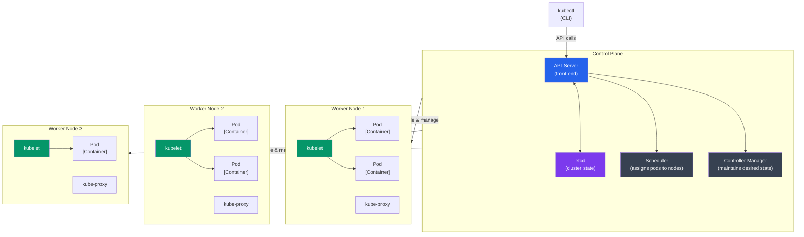

# Kubernetes Basics

## What You'll Learn

- Kubernetes hai kya aur container orchestration ka "industry standard" kyun bana
- Core concepts — Pods, Nodes, Clusters
- kubectl ke basics
- Pods banana aur manage karna
- Kubernetes ka architecture samajhna

---

## Kubernetes hai kya?

Socho ek second ke liye — tumne apna Node.js app Docker mein containerize kar diya, `docker run` kiya, sab kuch local mein badhiya chal raha hai. Ab boss bola "isko production mein daalo, 10,000 users handle karna hai, aur agar koi container crash ho jaaye to khud restart ho jaana chahiye, bina kisi ko jagaye raat ke 3 baje." Ab kya karoge? Ek server pe manually `docker run` chalate rahoge? Agar wo server hi crash ho gaya to?

Yahi exact problem solve karne ke liye **Kubernetes (K8s)** bana hai. Ye ek open-source **container orchestration platform** hai jo tumhare containerized applications ko automatically deploy, scale, aur manage karta hai — across multiple machines (jinhe "nodes" bolte hain).

Isko aise socho: Zomato ka backend agar sirf ek single server pe chal raha hota, to Friday night ke rush mein pura system baith jaata. Isliye Zomato jaisi companies apne services ko multiple machines pe distribute karke rakhti hain, aur ek "traffic controller" system chahiye jo decide kare — kaunsa request kaunsi machine pe jaaye, kaunsa container down hai to naya kaunsa spin up karo, aur load kaise balance karo. Kubernetes exactly wahi traffic controller hai, lekin containers ke liye.

**K8s naam kyun?** "Kubernetes" Greek word hai jiska matlab hai "helmsman" ya "pilot" (jahaz chalane wala). Aur "K8s" isliye likhte hain kyunki K aur s ke beech mein 8 letters hain (u-b-e-r-n-e-t-e). Bas ek shortcut hai, kuch fancy nahi.

### Kyun zaruri hai Kubernetes?

✅ **Auto-scaling** — Traffic badhne pe khud-ba-khud extra containers spin up ho jaate hain. Diwali sale pe Flipkart traffic 10x ho jaata hai — Kubernetes automatically zyada pods laga deta hai, sale khatam hote hi wapas kam kar deta hai.

✅ **Self-healing** — Koi container crash ho gaya? Kubernetes usko khud restart kar dega, bina tumhe pata chale. Jaise Swiggy delivery partner agar order cancel kare, system automatically dusra partner assign kar deta hai — waise hi K8s dusra container spin kar deta hai.

✅ **Load balancing** — Incoming traffic ko multiple containers mein evenly distribute karta hai, taaki ek hi container overload na ho jaaye.

✅ **Rolling updates** — Naya version deploy karte waqt zero-downtime — users ko pata bhi nahi chalega ki backend update ho raha hai. UPI apps jab naya feature push karte hain, tab bhi payment processing rukti nahi — yehi rolling update ka kamaal hai.

✅ **Service discovery** — Containers ko automatically DNS milta hai, taaki ek service dusri service ko naam se dhoondh sake, IP address yaad rakhne ki zarurat nahi.

✅ **Secret management** — Passwords, API keys, DB credentials jaisi sensitive cheezein securely store karta hai (encrypted, code mein hardcode nahi karna padta).

✅ **Multi-cloud** — AWS, Azure, GCP, ya apne khud ke on-prem servers — kahin bhi chala sakte ho, same YAML files ke saath. Vendor lock-in ka tension khatam.

> [!info]
> Kubernetes originally Google ne banaya tha (based on unke internal system "Borg" pe), aur ab ye Cloud Native Computing Foundation (CNCF) ke under open-source project hai. Almost har badi company — Flipkart, Ola, Paytm, Swiggy — apne backend mein Kubernetes ya uske managed version (EKS, GKE, AKS) use karti hain.

---

## Docker Compose vs Kubernetes

Bahut logo ka confusion yahin start hota hai — "Docker Compose se hi to multiple containers chala sakte hain, phir Kubernetes kyun?"

Answer simple hai: **Docker Compose ek single machine ke liye hai, Kubernetes multiple machines (cluster) ke liye hai.** Compose tumhare laptop pe "dev environment quickly spin up karne" ke liye perfect hai, lekin production mein jab tumhe hazaaron requests handle karni ho, multiple servers pe redundancy chahiye ho, aur automatic failover chahiye ho — tab Compose kaafi nahi padta.

| Docker Compose | Kubernetes |
|----------------|------------|
| Single machine | Multi-machine cluster |
| Development focus | Production focus |
| Simple YAML | Thoda complex YAML |
| No auto-scaling | Built-in auto-scaling |
| No self-healing | Self-healing |
| Local development ke liye best | Enterprise-grade orchestration ke liye best |

> [!tip]
> Rule of thumb: Local development aur chhote side projects ke liye Docker Compose use karo. Production mein jab scale, high-availability, aur zero-downtime deployments chahiye ho, tab Kubernetes pe move karo.

---

## Kubernetes Architecture

Ab samajhte hain ki Kubernetes ke andar chalta kya hai. Isko ek railway reservation system jaisa socho — ek central control room hai (Control Plane) jo decide karta hai kaunsi train kaunse platform pe jaayegi, aur alag-alag stations (Worker Nodes) hain jahan actual trains (Pods/Containers) khadi hoti hain.



### Control Plane Components — yaani "Head Office"

Control Plane wo brain hai jo pura cluster manage karta hai. Isme 4 main components hote hain:

- **API Server**: Ye Kubernetes ka "front desk" hai — har request (chahe `kubectl` se aaye ya kisi dusre tool se) sabse pehle yahin aati hai. Socho isko IRCTC ki website jaisa — tum ticket book karna chaho to seedhe train ke paas nahi jaate, website (API Server) ke through request bhejte ho.
- **etcd**: Ye ek key-value store hai jisme cluster ka poora "state" store hota hai — kaunsa pod kahan chal raha hai, kaunsi config set hai, sab kuch. Isko cluster ki "diary" samjho — agar kuch bhi crash ho jaaye, etcd ke paas record hota hai ki actually state kya hona chahiye tha.
- **Scheduler**: Ye decide karta hai ki naya pod kaunse node pe launch hoga — based on resources available (CPU, memory), constraints, etc. Jaise Swiggy ka system decide karta hai ki tumhara order kaunse restaurant/delivery partner ko assign karna hai based on availability.
- **Controller Manager**: Ye continuously background mein check karta rehta hai ki "desired state" (jo tumne YAML mein bola tha) aur "actual state" (jo abhi cluster mein ho raha hai) match kar rahe hain ya nahi. Agar mismatch hai (jaise ek pod crash ho gaya), to ye action leta hai use fix karne ke liye.

### Worker Node Components — yaani "Ground Staff"

Worker Nodes wo actual machines hain jahan tumhare containers chalte hain:

- **kubelet**: Har node pe chalne wala agent jo control plane se instructions leta hai aur ensure karta hai ki uss node pe sahi containers chal rahe hain.
- **kube-proxy**: Network proxy jo network rules maintain karta hai — traffic ko sahi pod tak route karne ke liye.
- **Container Runtime**: Actual engine jo containers ko run karta hai — Docker, containerd, ya CRI-O.

> [!info]
> Simple analogy: Control Plane = Zomato ka head office jo decide karta hai kaunsa order kis restaurant/delivery partner ko jaayega. Worker Nodes = actual restaurants aur delivery partners jo kaam karte hain ground pe.

---

## Core Concepts

### 1. Pod

**Pod Kubernetes ka sabse chhota deployable unit hai.** Ye ek ya usse zyada containers ka group hota hai jo saath mein chalte hain, same network aur storage share karte hain.

> [!warning]
> Confusion mat karo — Pod aur Container same nahi hain! Ek Pod ke andar usually ek container hota hai, lekin agar zaruri ho (jaise ek helper/sidecar container chahiye) to multiple containers bhi ek Pod mein rakh sakte ho. Wo sab containers ek hi "ghar" (Pod) mein rehte hain — same IP address share karte hain, localhost pe ek dusre se baat kar sakte hain.

```yaml
apiVersion: v1
kind: Pod
metadata:
  name: nginx-pod
spec:
  containers:
  - name: nginx
    image: nginx:alpine
    ports:
    - containerPort: 80
```

### 2. Node

Ek **worker machine** (VM ya physical server) jispe actual pods chalte hain. Isko socho ek delivery partner ki bike jaisa — wo actual "kaam" (containers run karna) yahin hota hai.

### 3. Cluster

Ek **Cluster** matlab multiple nodes ka group jo Kubernetes manage karta hai — 1 control plane + N worker nodes milke ek cluster banate hain.

### 4. Namespace

**Namespace** ek virtual cluster hai jo tumhe ek hi physical cluster ke andar resources ko logically organize/separate karne deta hai. Jaise ek hi office building mein alag-alag floors ho — dev team ka floor alag, QA team ka alag, production ka alag — sab same building (cluster) mein hain, lekin apne apne space mein.

```bash
# Default namespaces
default         # Default namespace
kube-system     # Kubernetes system components
kube-public     # Public resources
kube-node-lease # Node heartbeat data
```

Real projects mein log usually `dev`, `staging`, aur `production` jaise custom namespaces bhi banate hain, taaki ek hi cluster mein multiple environments isolate karke rakh sakein.

---

## kubectl Install Karna

`kubectl` (pronounced "kube-control" ya "kube-C-T-L", log dono bolte hain) wo CLI tool hai jisse tum apne Kubernetes cluster se baat karte ho.

### macOS
```bash
brew install kubectl
```

### Linux
```bash
curl -LO "https://dl.k8s.io/release/$(curl -L -s https://dl.k8s.io/release/stable.txt)/bin/linux/amd64/kubectl"
chmod +x kubectl
sudo mv kubectl /usr/local/bin/
```

### Windows
```powershell
choco install kubernetes-cli
```

### Verify Installation
```bash
kubectl version --client
```

---

## Local Kubernetes Setup

Production cluster (AWS EKS, GCP GKE) directly use karna mehenga aur complex hai jab tak tum seekh nahi rahe. Isliye local machine pe practice karne ke liye ye options use karo:

### Option 1: Minikube (Single-node cluster)

Minikube ek chhota, single-node Kubernetes cluster spin up karta hai tumhare laptop pe — learning ke liye best hai.

```bash
# Install minikube
brew install minikube  # macOS
# ya download karo: https://minikube.sigs.k8s.io/

# Cluster start karo
minikube start

# Status check karo
minikube status

# Cluster stop karo
minikube stop

# Cluster delete karo
minikube delete
```

### Option 2: Docker Desktop

Docker Desktop settings mein Kubernetes enable karo — beginners ke liye sabse aasan tarika hai, bas ek checkbox tick karna hai.

### Option 3: kind (Kubernetes in Docker)

`kind` Docker containers ke andar hi Kubernetes nodes simulate karta hai — CI/CD pipelines mein bhi popular hai kyunki lightweight hai.

```bash
# Install kind
brew install kind

# Cluster banao
kind create cluster --name my-cluster

# Cluster delete karo
kind delete cluster --name my-cluster
```

> [!tip]
> Agar tum bas seekh rahe ho aur Docker Desktop already installed hai, to Option 2 sabse fast raasta hai — koi extra install nahi karna padega.

---

## Essential kubectl Commands

### Cluster Info

```bash
# Cluster ki info dekho
kubectl cluster-info

# Nodes dekho
kubectl get nodes

# Ek node ki detailed info
kubectl describe node <node-name>
```

### Namespaces

```bash
# Namespaces list karo
kubectl get namespaces
kubectl get ns

# Naya namespace banao
kubectl create namespace dev

# Default namespace set karo (baar baar -n dev likhne se bachne ke liye)
kubectl config set-context --current --namespace=dev
```

### Pods

```bash
# Pods list karo
kubectl get pods
kubectl get po

# Saare namespaces ke pods list karo
kubectl get pods --all-namespaces
kubectl get pods -A

# Ek pod ki detailed info
kubectl describe pod <pod-name>

# Pod ke logs
kubectl logs <pod-name>
kubectl logs -f <pod-name>  # Live logs follow karo (jaise tail -f)

# Pod ke andar command chalao
kubectl exec <pod-name> -- ls /app
kubectl exec -it <pod-name> -- bash  # Interactive shell (pod ke andar ghus jao)

# Pod delete karo
kubectl delete pod <pod-name>
```

---

## Apna Pehla Pod Banate Hain

### Method 1: Imperative (Direct Command)

Imperative approach matlab tum seedha command se bol rahe ho "ye kar do" — quick testing ke liye theek hai, lekin production ke liye recommended nahi.

```bash
# Pod directly banao
kubectl run nginx-pod --image=nginx:alpine

# Status check karo
kubectl get pods

# Pod access karo
kubectl port-forward nginx-pod 8080:80
# Browser mein visit karo: http://localhost:8080
```

### Method 2: Declarative (YAML)

Declarative approach mein tum ek YAML file likhte ho jisme bolte ho "mujhe end mein aisa result chahiye" — Kubernetes khud figure out karta hai kaise pahunchna hai wahan. **Production mein hamesha ye approach use karo** — reason simple hai: YAML file ko git mein commit kar sakte ho, version control mil jaata hai, aur team ke saath share karna easy hota hai.

**nginx-pod.yaml**:
```yaml
apiVersion: v1
kind: Pod
metadata:
  name: nginx-pod
  labels:
    app: nginx
spec:
  containers:
  - name: nginx
    image: nginx:alpine
    ports:
    - containerPort: 80
```

```bash
# YAML se pod banao
kubectl apply -f nginx-pod.yaml

# Pod update karo (same command — Kubernetes diff samajh ke apply karta hai)
kubectl apply -f nginx-pod.yaml

# Pod delete karo
kubectl delete -f nginx-pod.yaml
```

> [!tip]
> `kubectl apply` idempotent hai — matlab jitni baar chalao, agar YAML same hai to kuch nahi hoga; agar change hai to sirf wo diff apply hoga. Isliye production mein hamesha `apply` use karo, `create` nahi.

---

## Pods Ke Saath Kaam Karna

### Multi-Container Pod

Kabhi kabhi ek main container ke saath ek "helper" container bhi chahiye hota hai — isko **sidecar pattern** kehte hain. Jaise IRCTC ka main booking service ho, aur uske saath ek logging/monitoring sidecar chal raha ho jo silently background mein data collect karta rahe.

```yaml
apiVersion: v1
kind: Pod
metadata:
  name: multi-container-pod
spec:
  containers:
  - name: app
    image: myapp:latest
    ports:
    - containerPort: 3000
  
  - name: sidecar
    image: nginx:alpine
    ports:
    - containerPort: 80
```

Yaad rakho — dono containers same Pod mein hone ki wajah se `localhost` pe ek dusre se baat kar sakte hain, kyunki wo same network namespace share karte hain.

### Environment Variables Wala Pod

Real apps mein config aur secrets ko code mein hardcode nahi karte — environment variables ke through pass karte hain. Sensitive cheezein (jaise API keys) ke liye Kubernetes ka `Secret` object use karo, plain `value` nahi.

```yaml
apiVersion: v1
kind: Pod
metadata:
  name: env-pod
spec:
  containers:
  - name: app
    image: node:18-alpine
    env:
    - name: NODE_ENV
      value: "production"
    - name: DATABASE_URL
      value: "postgres://localhost/mydb"
    - name: API_KEY
      valueFrom:
        secretKeyRef:
          name: api-secret
          key: key
```

### Volume Wala Pod

Containers by default **ephemeral** hote hain — matlab container restart hote hi uske andar ka data gayab ho jaata hai. Agar data persist karna hai (chahe temporarily), to **Volume** attach karna padta hai.

```yaml
apiVersion: v1
kind: Pod
metadata:
  name: volume-pod
spec:
  containers:
  - name: app
    image: nginx:alpine
    volumeMounts:
    - name: data
      mountPath: /usr/share/nginx/html
  
  volumes:
  - name: data
    emptyDir: {}
```

> [!warning]
> `emptyDir` volume Pod ke saath hi delete ho jaata hai — ye sirf temporary scratch space ke liye hai (jaise cache), permanent storage ke liye nahi. Permanent data ke liye `PersistentVolume` use karna padta hai, jo ek alag advanced topic hai.

---

## Pod Lifecycle

```
Pending → Running → Succeeded/Failed
```

Jab tum ek Pod create karte ho, wo turant "Running" nahi ho jaata — usse ek journey se guzarna padta hai:

### Pod Phases

- **Pending**: Pod ko abhi kisi node pe schedule nahi kiya gaya, ya image pull ho rahi hai. Jaise Swiggy order "confirmed" hua hai lekin abhi tak koi delivery partner assign nahi hua.
- **Running**: Pod ek node pe successfully chal raha hai, aur kam se kam ek container active hai.
- **Succeeded**: Saare containers apna kaam poora karke successfully terminate ho gaye (usually ek-baar-chalne-wale jobs mein hota hai, long-running services mein nahi).
- **Failed**: Saare containers terminate ho gaye, aur kam se kam ek fail hua.
- **Unknown**: Kubernetes ko pod ki state hi pata nahi chal rahi — usually node se connection lost hone ki wajah se.

### Container States

- **Waiting**: Container start hone ka wait kar raha hai (image pull ho rahi hai, ya kisi dependency ka wait).
- **Running**: Container active hai aur chal raha hai.
- **Terminated**: Container apna kaam khatam karke ruk gaya (successfully ya crash hoke).

---

## Labels and Selectors

### Labels Kya Hain?

Labels basically **key-value tags** hote hain jo tum apne resources pe laga sakte ho, taaki unhe organize aur filter kar sako. Isko socho Swiggy/Zomato ke restaurants pe lage tags jaise — "Pure Veg", "Fast Delivery", "Top Rated" — inse tum easily filter kar pate ho.

```yaml
metadata:
  labels:
    app: nginx
    environment: production
    tier: frontend
```

### Labels Ka Use

```bash
# Pods ko unke labels ke saath list karo
kubectl get pods --show-labels

# Label se filter karo
kubectl get pods -l app=nginx
kubectl get pods -l environment=production,tier=frontend

# Existing pod pe label add karo
kubectl label pod nginx-pod version=v1

# Label remove karo
kubectl label pod nginx-pod version-
```

> [!info]
> Labels sirf organizing ke liye nahi — Kubernetes internally Services aur Deployments jaise objects labels ke through hi pods ko "select" karte hain. Matlab agar tumhare labels galat set hue, to Service ko pata hi nahi chalega ki kaunsa pod uska hai!

---

## Real-World Example: Node.js API Pod

Ab dekhte hain ek practical, production-jaisa example — jisme resource limits, health checks, sab kuch set hai. Ye woh cheezein hain jo har Node.js developer ko production Kubernetes YAML likhte waqt zaroor daalni chahiye.

**nodejs-api-pod.yaml**:
```yaml
apiVersion: v1
kind: Pod
metadata:
  name: nodejs-api
  labels:
    app: api
    tier: backend
spec:
  containers:
  - name: api
    image: node:18-alpine
    command: ["node", "server.js"]
    ports:
    - containerPort: 3000
    env:
    - name: NODE_ENV
      value: "production"
    - name: PORT
      value: "3000"
    resources:
      requests:
        memory: "128Mi"
        cpu: "100m"
      limits:
        memory: "256Mi"
        cpu: "200m"
    livenessProbe:
      httpGet:
        path: /health
        port: 3000
      initialDelaySeconds: 10
      periodSeconds: 5
    readinessProbe:
      httpGet:
        path: /ready
        port: 3000
      initialDelaySeconds: 5
      periodSeconds: 3
```

Chalo isko samajhte hain piece by piece:

- **resources.requests**: Ye batata hai Kubernetes ko "iss container ko kam se kam itna CPU/memory chahiye guaranteed" — scheduler isi basis pe decide karta hai kaunse node pe pod fit hoga.
- **resources.limits**: Ye maximum cap hai — container isse zyada resource use nahi kar sakta. Agar memory limit cross kar de, to Kubernetes container ko kill kar dega (OOMKilled).
- **livenessProbe**: Kubernetes periodically `/health` endpoint hit karta rahega. Agar response na aaye, samajh jaayega container "stuck" ho gaya hai, aur usse restart kar dega. Jaise koi delivery partner agar app pe "online" show ho raha hai lekin respond nahi kar raha, system usko automatically "offline" mark karke replace kar deta hai.
- **readinessProbe**: Ye check karta hai ki container traffic receive karne ke liye "ready" hai ya nahi. Jab tak `/ready` sahi response na de, Kubernetes uss pod ko traffic hi nahi bhejega — matlab agar app abhi startup mein DB connection bana raha hai, usse premature requests nahi milengi.

```bash
# Pod banao
kubectl apply -f nodejs-api-pod.yaml

# Status check karo
kubectl get pods

# Logs dekho
kubectl logs nodejs-api

# Local machine pe access karne ke liye port forward karo
kubectl port-forward nodejs-api 3000:3000

# Test karo
curl http://localhost:3000/health
```

---

## Pods Debug Karna

Production mein cheezein hamesha smoothly nahi chalti — kabhi na kabhi Pod fail hoga, aur tumhe pata hona chahiye debug kaise karte hain.

### Pod Status Check Karo

```bash
kubectl get pods
kubectl describe pod <pod-name>
```

`describe` command tumhara best dost hai — ye pod ka poora event history dikhata hai, including koi bhi error ya warning.

### Logs Dekhna

```bash
# Current logs
kubectl logs <pod-name>

# Purane container ke logs (agar restart hua ho)
kubectl logs <pod-name> --previous

# Multi-container pod mein specific container ke logs
kubectl logs <pod-name> -c <container-name>

# Logs ko live stream karo
kubectl logs -f <pod-name>
```

### Commands Execute Karna

```bash
# Command run karo
kubectl exec <pod-name> -- env

# Interactive shell (pod ke andar ghuso, debug karo)
kubectl exec -it <pod-name> -- sh

# Specific container mein
kubectl exec -it <pod-name> -c <container-name> -- bash
```

### Common Issues — Ye Errors Baar Baar Aayenge, Yaad Rakho

**ImagePullBackOff**: Image pull nahi ho pa rahi. Usually image ka naam galat likha hota hai, ya private registry ke credentials missing hain.
```bash
kubectl describe pod <pod-name>
# Image name aur registry credentials check karo
```

**CrashLoopBackOff**: Container baar baar crash ho raha hai aur Kubernetes usse restart karte-karte thak raha hai. Usually application-level bug hota hai (jaise missing env variable ki wajah se app start hi nahi ho pa rahi).
```bash
kubectl logs <pod-name>
# Application logs check karo
```

**Pending**: Pod ko schedule nahi kiya ja pa raha. Usually cluster mein enough resources nahi hain, ya koi node selector/affinity rule match nahi ho rahi.
```bash
kubectl describe pod <pod-name>
# Node resources aur pod requirements check karo
```

> [!tip]
> 90% Kubernetes debugging `kubectl describe pod` aur `kubectl logs` se hi solve ho jaati hai. Pehle ye do commands chalao, phir aage sochna.

---

## Best Practices

✅ **YAML files use karo** (declarative) production ke liye — imperative commands sirf quick testing ke liye  
✅ **Resource requests aur limits zaroor add karo** — nahi to ek container pura node ka resource kha sakta hai  
✅ **Health checks use karo** (liveness aur readiness probes) — bina inke Kubernetes ko pata hi nahi chalega ki container asal mein healthy hai ya nahi  
✅ **Labels use karo** organization ke liye — bina proper labels ke Services aur Deployments confuse ho jaayenge  
✅ **Container ke andar root user se mat chalao** — security risk hai  
✅ **Specific image tags use karo** (`latest` nahi) — warna production mein pata bhi nahi chalega kaunsa version chal raha hai  
✅ **Configs ko ConfigMaps mein aur secrets ko Secrets mein store karo** — kabhi bhi hardcode mat karo

---

## Exercise

### Task 1: Apna Pehla Pod Deploy Karo

```bash
# 1. nginx pod banao
kubectl run nginx --image=nginx:alpine

# 2. Status check karo
kubectl get pods

# 3. Details dekho
kubectl describe pod nginx

# 4. Logs access karo
kubectl logs nginx

# 5. Port forward karo
kubectl port-forward nginx 8080:80

# 6. Browser mein test karo: http://localhost:8080

# 7. Cleanup karo
kubectl delete pod nginx
```

### Task 2: Multi-Container Pod

Ek Pod banao jisme ho:
- Main container: Tumhara Node.js/Python app
- Sidecar container: nginx reverse proxy

---

## Key Takeaways

- Kubernetes ek container orchestration platform hai jo deployment, scaling, aur self-healing automate karta hai — Docker Compose single machine ke liye hai, Kubernetes multi-machine production clusters ke liye.
- Architecture do parts mein bant hai: **Control Plane** (brain — API Server, etcd, Scheduler, Controller Manager) aur **Worker Nodes** (jahan actual containers chalte hain — kubelet, kube-proxy, container runtime).
- **Pod** sabse chhota deployable unit hai — usually ek container, kabhi kabhi sidecar pattern ke saath multiple containers.
- Declarative approach (`kubectl apply -f`) production ke liye best hai — YAML files version-controlled hoti hain, imperative commands sirf quick testing ke liye.
- Resource requests/limits aur liveness/readiness probes production-grade Pods ke liye must-have hain — inke bina Kubernetes ko pata hi nahi chalega container healthy hai ya nahi.
- Debugging ka bread-and-butter: `kubectl describe pod` aur `kubectl logs` — inhi do commands se zyadatar issues (ImagePullBackOff, CrashLoopBackOff, Pending) diagnose ho jaate hain.

---

**Next**: [Kubernetes Deployments](./03_kubernetes_deployments.md) → Pod replicas aur rolling updates manage karna
