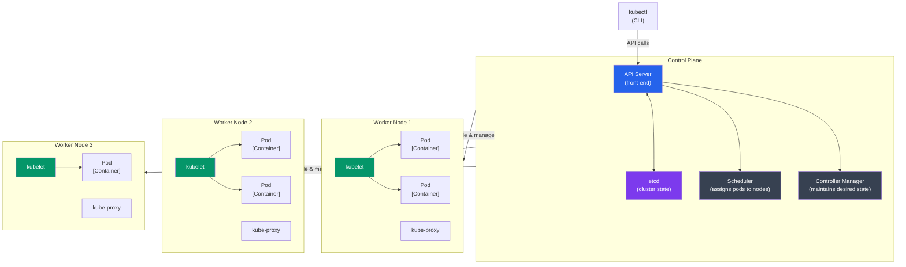

# Kubernetes Basics

## What You'll Learn

- What Kubernetes is and why it's the standard for container orchestration
- Core Kubernetes concepts: Pods, Nodes, Clusters
- kubectl basics
- Creating and managing Pods
- Understanding Kubernetes architecture

---

## What is Kubernetes?

**Kubernetes (K8s)** is an open-source container orchestration platform that automates deployment, scaling, and management of containerized applications.

### Why Kubernetes?

✅ **Auto-scaling** - Scale applications based on demand  
✅ **Self-healing** - Restart failed containers automatically  
✅ **Load balancing** - Distribute traffic across containers  
✅ **Rolling updates** - Zero-downtime deployments  
✅ **Service discovery** - Automatic DNS for services  
✅ **Secret management** - Securely store sensitive data  
✅ **Multi-cloud** - Run anywhere (AWS, Azure, GCP, on-prem)

---

## Docker Compose vs Kubernetes

| Docker Compose | Kubernetes |
|----------------|------------|
| Single machine | Multi-machine cluster |
| Development focus | Production focus |
| Simple YAML | More complex YAML |
| No auto-scaling | Built-in auto-scaling |
| No self-healing | Self-healing |
| Local development | Enterprise-grade orchestration |

---

## Kubernetes Architecture



### Control Plane Components

- **API Server**: Front-end for Kubernetes control plane
- **etcd**: Key-value store for cluster data
- **Scheduler**: Assigns pods to nodes
- **Controller Manager**: Runs controller processes

### Worker Node Components

- **kubelet**: Agent that runs on each node
- **kube-proxy**: Network proxy
- **Container Runtime**: Docker, containerd, or CRI-O

---

## Core Concepts

### 1. Pod
Smallest deployable unit. Contains one or more containers.

```yaml
apiVersion: v1
kind: Pod
metadata:
  name: nginx-pod
spec:
  containers:
  - name: nginx
    image: nginx:alpine
    ports:
    - containerPort: 80
```

### 2. Node
A worker machine (VM or physical server) that runs pods.

### 3. Cluster
A set of nodes managed by Kubernetes.

### 4. Namespace
Virtual cluster for organizing resources.

```bash
# Default namespaces
default         # Default namespace
kube-system     # Kubernetes system components
kube-public     # Public resources
kube-node-lease # Node heartbeat data
```

---

## Installing kubectl

### macOS
```bash
brew install kubectl
```

### Linux
```bash
curl -LO "https://dl.k8s.io/release/$(curl -L -s https://dl.k8s.io/release/stable.txt)/bin/linux/amd64/kubectl"
chmod +x kubectl
sudo mv kubectl /usr/local/bin/
```

### Windows
```powershell
choco install kubernetes-cli
```

### Verify Installation
```bash
kubectl version --client
```

---

## Local Kubernetes Setup

### Option 1: Minikube (Single-node cluster)
```bash
# Install minikube
brew install minikube  # macOS
# or download from: https://minikube.sigs.k8s.io/

# Start cluster
minikube start

# Check status
minikube status

# Stop cluster
minikube stop

# Delete cluster
minikube delete
```

### Option 2: Docker Desktop
Enable Kubernetes in Docker Desktop settings (easiest for beginners).

### Option 3: kind (Kubernetes in Docker)
```bash
# Install kind
brew install kind

# Create cluster
kind create cluster --name my-cluster

# Delete cluster
kind delete cluster --name my-cluster
```

---

## Essential kubectl Commands

### Cluster Info
```bash
# View cluster info
kubectl cluster-info

# View nodes
kubectl get nodes

# Detailed node info
kubectl describe node <node-name>
```

### Namespaces
```bash
# List namespaces
kubectl get namespaces
kubectl get ns

# Create namespace
kubectl create namespace dev

# Set default namespace
kubectl config set-context --current --namespace=dev
```

### Pods
```bash
# List pods
kubectl get pods
kubectl get po

# List pods in all namespaces
kubectl get pods --all-namespaces
kubectl get pods -A

# Detailed pod info
kubectl describe pod <pod-name>

# Pod logs
kubectl logs <pod-name>
kubectl logs -f <pod-name>  # Follow logs

# Execute command in pod
kubectl exec <pod-name> -- ls /app
kubectl exec -it <pod-name> -- bash  # Interactive shell

# Delete pod
kubectl delete pod <pod-name>
```

---

## Creating Your First Pod

### Method 1: Imperative (Command)
```bash
# Create pod directly
kubectl run nginx-pod --image=nginx:alpine

# Check status
kubectl get pods

# Access pod
kubectl port-forward nginx-pod 8080:80
# Visit http://localhost:8080
```

### Method 2: Declarative (YAML)

**nginx-pod.yaml**:
```yaml
apiVersion: v1
kind: Pod
metadata:
  name: nginx-pod
  labels:
    app: nginx
spec:
  containers:
  - name: nginx
    image: nginx:alpine
    ports:
    - containerPort: 80
```

```bash
# Create pod from YAML
kubectl apply -f nginx-pod.yaml

# Update pod
kubectl apply -f nginx-pod.yaml

# Delete pod
kubectl delete -f nginx-pod.yaml
```

---

## Working with Pods

### Multi-Container Pod

```yaml
apiVersion: v1
kind: Pod
metadata:
  name: multi-container-pod
spec:
  containers:
  - name: app
    image: myapp:latest
    ports:
    - containerPort: 3000
  
  - name: sidecar
    image: nginx:alpine
    ports:
    - containerPort: 80
```

### Pod with Environment Variables

```yaml
apiVersion: v1
kind: Pod
metadata:
  name: env-pod
spec:
  containers:
  - name: app
    image: node:18-alpine
    env:
    - name: NODE_ENV
      value: "production"
    - name: DATABASE_URL
      value: "postgres://localhost/mydb"
    - name: API_KEY
      valueFrom:
        secretKeyRef:
          name: api-secret
          key: key
```

### Pod with Volume

```yaml
apiVersion: v1
kind: Pod
metadata:
  name: volume-pod
spec:
  containers:
  - name: app
    image: nginx:alpine
    volumeMounts:
    - name: data
      mountPath: /usr/share/nginx/html
  
  volumes:
  - name: data
    emptyDir: {}
```

---

## Pod Lifecycle

```
Pending → Running → Succeeded/Failed
```

### Pod Phases
- **Pending**: Waiting to be scheduled
- **Running**: Pod is running on a node
- **Succeeded**: All containers terminated successfully
- **Failed**: All containers terminated, at least one failed
- **Unknown**: Cannot determine pod state

### Container States
- **Waiting**: Container is waiting to start
- **Running**: Container is running
- **Terminated**: Container has finished

---

## Labels and Selectors

### Labels (Key-Value Pairs)
```yaml
metadata:
  labels:
    app: nginx
    environment: production
    tier: frontend
```

### Using Labels
```bash
# List pods with labels
kubectl get pods --show-labels

# Filter by label
kubectl get pods -l app=nginx
kubectl get pods -l environment=production,tier=frontend

# Add label to existing pod
kubectl label pod nginx-pod version=v1

# Remove label
kubectl label pod nginx-pod version-
```

---

## Real-World Example: Node.js API Pod

**nodejs-api-pod.yaml**:
```yaml
apiVersion: v1
kind: Pod
metadata:
  name: nodejs-api
  labels:
    app: api
    tier: backend
spec:
  containers:
  - name: api
    image: node:18-alpine
    command: ["node", "server.js"]
    ports:
    - containerPort: 3000
    env:
    - name: NODE_ENV
      value: "production"
    - name: PORT
      value: "3000"
    resources:
      requests:
        memory: "128Mi"
        cpu: "100m"
      limits:
        memory: "256Mi"
        cpu: "200m"
    livenessProbe:
      httpGet:
        path: /health
        port: 3000
      initialDelaySeconds: 10
      periodSeconds: 5
    readinessProbe:
      httpGet:
        path: /ready
        port: 3000
      initialDelaySeconds: 5
      periodSeconds: 3
```

```bash
# Create pod
kubectl apply -f nodejs-api-pod.yaml

# Check status
kubectl get pods

# View logs
kubectl logs nodejs-api

# Port forward to access locally
kubectl port-forward nodejs-api 3000:3000

# Test
curl http://localhost:3000/health
```

---

## Debugging Pods

### Check Pod Status
```bash
kubectl get pods
kubectl describe pod <pod-name>
```

### View Logs
```bash
# Current logs
kubectl logs <pod-name>

# Previous container logs (if restarted)
kubectl logs <pod-name> --previous

# Specific container in multi-container pod
kubectl logs <pod-name> -c <container-name>

# Stream logs
kubectl logs -f <pod-name>
```

### Execute Commands
```bash
# Run command
kubectl exec <pod-name> -- env

# Interactive shell
kubectl exec -it <pod-name> -- sh

# Specific container
kubectl exec -it <pod-name> -c <container-name> -- bash
```

### Common Issues

**ImagePullBackOff**: Cannot pull image
```bash
kubectl describe pod <pod-name>
# Check image name and registry credentials
```

**CrashLoopBackOff**: Container keeps crashing
```bash
kubectl logs <pod-name>
# Check application logs
```

**Pending**: Cannot schedule pod
```bash
kubectl describe pod <pod-name>
# Check node resources and pod requirements
```

---

## Best Practices

✅ **Use YAML files** (declarative) for production  
✅ **Add resource requests and limits**  
✅ **Use health checks** (liveness and readiness probes)  
✅ **Use labels** for organization  
✅ **Don't run as root** in containers  
✅ **Use specific image tags** (not `latest`)  
✅ **Store configs in ConfigMaps** and secrets in Secrets

---

## Exercise

### Task 1: Deploy Your First Pod

```bash
# 1. Create nginx pod
kubectl run nginx --image=nginx:alpine

# 2. Check status
kubectl get pods

# 3. View details
kubectl describe pod nginx

# 4. Access logs
kubectl logs nginx

# 5. Port forward
kubectl port-forward nginx 8080:80

# 6. Test in browser: http://localhost:8080

# 7. Clean up
kubectl delete pod nginx
```

### Task 2: Multi-Container Pod

Create a pod with:
- Main container: Your Node.js/Python app
- Sidecar container: nginx reverse proxy

---

**Next**: [Kubernetes Deployments](./03_kubernetes_deployments.md) → Manage pod replicas and rolling updates
