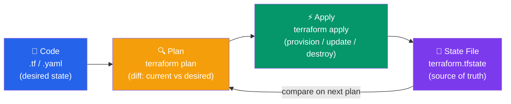

# Infrastructure as Code Concepts

Socho tumhare paas ek naya project aaya hai aur usme 5 servers, 2 databases, ek load balancer, aur networking setup chahiye. Purane zamane mein (aur aaj bhi kai companies mein) koi engineer AWS console mein login karke click-click-click karke sab kuch banata tha. Ab imagine karo — 6 mahine baad woh setup replicate karna hai staging environment mein. Kya woh sab steps yaad rakhega? Nahi. Kya do engineers same steps follow karenge? Bilkul nahi. Yehi wahi jagah hai jahan **Infrastructure as Code (IaC)** kaam aata hai.

**Kya hota hai IaC?** Simple bhasha mein — apni infrastructure (servers, databases, networks, load balancers, sab kuch) ko **code likh ke** define karna, na ki manually console mein click karke. Jaise tum apna Node.js app ka code Git mein rakhte ho, waise hi apna infrastructure ka "blueprint" bhi code files mein rakhte ho — `.tf`, `.yaml`, jo bhi tool use karo.

**Kyun zaruri hai?** Socho Zomato ka backend team hai. Unhe production mein jo infra chal raha hai, wahi exact infra staging aur dev mein bhi chahiye taaki "mere machine pe toh chal raha tha" wala problem na ho. Agar infra code mein likha hai, toh bas `terraform apply` chalao aur same setup kahin bhi spin up ho jayega — chahe woh naya region ho ya disaster recovery ke liye backup environment.

> [!tip]
> IaC ko aise socho jaise tumhara restaurant ka recipe book hai. Ek baar recipe (code) likh do, phir chahe Delhi ki branch ho ya Mumbai ki, wahi dish (infrastructure) consistently banegi. Koi chef apni marzi se ingredient kam-zyada nahi karega.

## IaC Approaches

IaC likhne ke do main tareeke hain — **Declarative** aur **Imperative**. Dono ka apna use case hai, aur dono ke tools alag hain.

### Declarative (Desired State)

**Kya hota hai?** Declarative approach mein tum bas yeh batate ho ki **end result kya chahiye** — "mujhe ek `t2.micro` type ka EC2 instance chahiye is AMI se". Tum yeh nahi batate ki *kaise* banega — woh kaam tool (jaise Terraform) khud figure out karta hai.

Isko aise socho — jaise tum Swiggy pe order karte waqt bolte ho "mujhe ek Butter Chicken chahiye", tum restaurant ko yeh nahi batate ki chicken kaise marinate karna hai, kitni der pakana hai. Tum sirf **desired outcome** batate ho, baaki restaurant (Terraform engine) sambhal leta hai.

```hcl
# Terraform - describe what you want
resource "aws_instance" "web" {
  ami           = "ami-0c55b159cbfafe1f0"
  instance_type = "t2.micro"
}
```

Is code ko jitni baar chalao, Terraform pehle check karega ki "current state" kya hai, aur phir sirf utna hi change karega jitna zaruri hai desired state tak pahunchne ke liye. Isi property ko **idempotency** kehte hain.

- **Idempotent**: Running twice = same state. Matlab agar instance already chal raha hai, toh dubara `apply` karne se doosra instance nahi ban jayega — Terraform samajhdaar hai, dekhega "arre yeh toh already exist karta hai, kuch karne ki zarurat nahi".
- **Easy to understand desired state**: Code padh ke hi pata chal jata hai ki final infrastructure kaisa dikhega — jaise ek blueprint padh ke building ka design samajh aata hai.
- **Tools**: Terraform, CloudFormation, Pulumi

> [!info]
> Declarative approach production infra ke liye zyada popular hai kyunki predictability aur idempotency safety dete hain — accidental duplicate resources ban ne ka risk kam ho jata hai.

### Imperative (Step-by-Step)

**Kya hota hai?** Imperative approach mein tum exact **steps** batate ho ki kya-kya karna hai, kis order mein. Yeh bilkul aise hai jaise tum khud kitchen mein khada ho ke bata rahe ho — "pehle pyaz kaato, phir tel garam karo, phir chicken daalo..." Har step explicitly likha hota hai.

```bash
#!/bin/bash
# Ansible - describe steps to take
aws ec2 run-instances --image-id ami-0c55b159cbfafe1f0 --instance-type t2.micro
```

- **Exact steps executed**: Script line-by-line chalti hai, jaisa likha hai waisa hi hoga.
- **Harder to ensure idempotency**: Agar tumne yeh script dubara chala di bina check kiye, toh ek naya instance aur ban jayega! Isliye imperative scripts mein manually "already exists?" wala check likhna padta hai — extra kaam.
- **Tools**: Ansible, Chef, Puppet

**Real-world analogy**: Socho IRCTC ka ek internal script hai jo naya server provision karta hai har baar jab traffic spike expect hota hai (jaise Tatkal booking time). Agar yeh script imperative hai aur usme idempotency check nahi hai, toh galti se do baar run karne pe do extra servers ban jayenge — paisa bhi waste, confusion bhi.

> [!warning]
> Imperative scripts mein hamesha yeh dhyan rakho ki woh **safe-to-rerun** hon. Nahi toh production mein duplicate resources ya broken state ban sakta hai.

**Declarative vs Imperative — quick comparison:**

| Aspect | Declarative | Imperative |
|--------|-------------|------------|
| Tum kya likhte ho | "What" (desired end state) | "How" (exact steps) |
| Idempotency | Built-in, automatic | Manually ensure karna padta hai |
| Debugging | Diff dekh ke samajh aata hai kya change hoga | Step-by-step trace karna padta hai |
| Best suited for | Infra provisioning (servers, networks) | Configuration management (software install, config tweaks) |

## Benefits of IaC

**Kyun poori industry IaC pe shift ho gayi hai?** Kyunki manual infra management scale nahi karta. Ek do server tak toh theek hai, lekin jaise hi tumhara Flipkart-scale traffic aata hai aur hundreds of servers manage karne padte hain, manual approach ek disaster hai. IaC ke fayde dekho:

1. **Version Control** — Infrastructure ke changes bhi Git mein track hote hain, bilkul jaise application code. Kal agar production mein kuch toot gaya, toh `git blame` karke pata chal jayega kis commit ne kya badla.
2. **Reproducibility** — Same infrastructure har baar. Dev, staging, prod — teeno environments ka base structure same code se banega, sirf variables (jaise instance size) alag honge.
3. **Documentation** — Code khud hi architecture ka documentation ban jata hai. Naya engineer join kare toh usse Terraform files padh ke pata chal jayega poora setup kaisa hai — koi outdated Confluence page dhundhne ki zarurat nahi.
4. **Automation** — Manual errors kam hote hain. Insaan galti se galat security group attach kar sakta hai console mein, lekin reviewed code usually zyada safe hota hai.
5. **Collaboration** — Team ek hi codebase pe kaam karti hai, Pull Requests ke through changes propose karti hai — jaise normal software development.
6. **Testing** — Deploy karne se pehle validate kar sakte ho (jaise `terraform plan` se dry-run dekh sakte ho ki kya change hoga).
7. **Cost Tracking** — Tumhe pata rehta hai exactly kya provision ho raha hai, isliye cost estimate karna aasan ho jata hai — CRED jaisi company mein finance team ko pata chal sakta hai ki naya feature launch karne se infra cost kitni badhegi, code review se hi.

> [!tip]
> Ek bada practical fayda yeh bhi hai — agar production mein disaster aa jaye (server crash, region down), toh IaC ke saath tum minutes mein pura infra dobara khada kar sakte ho kisi doosri jagah, bas apna code re-apply karke. Bina IaC ke yeh recovery ghanton ya din le sakta hai.

## State Management

**Kya hota hai State?** Jab tum declarative tool (jaise Terraform) use karte ho, usse yeh pata hona chahiye ki "abhi actual duniya mein kya bana hua hai" taaki woh compare kar sake tumhare code (desired state) se. Yeh tracking mechanism hi **State** kehlata hai — Terraform ke case mein yeh ek `terraform.tfstate` file mein store hota hai.

Socho isko IRCTC ke seat reservation system jaisa — system ko pata hona chahiye kaunsi seats already book hain (current state) taaki jab naya passenger book kare (desired state ka request), tab woh sahi decision le sake — konsi seat allot karni hai ya "no seats available" bolna hai.



Iska flow samjho step-by-step:

1. **Code**: Tum `.tf` file mein likhte ho ki tumhe kya chahiye (desired state).
2. **Plan**: `terraform plan` command chalate ho — yeh current state (state file se) ko desired state (code se) se compare karta hai aur batata hai "yeh 3 cheezein add hongi, 1 modify hogi, 1 delete hogi".
3. **Apply**: `terraform apply` chalane se woh actual changes cloud provider (AWS, GCP, etc.) pe execute hote hain.
4. **State File**: Apply ke baad, naya current state `terraform.tfstate` mein save ho jata hai — yeh "source of truth" ban jata hai agli baar ke comparison ke liye.

> [!warning]
> State file bahut sensitive hoti hai — isme resource IDs, kabhi-kabhi secrets bhi ho sakte hain plain text mein. Isko kabhi bhi Git mein commit mat karo local file ke roop mein! Hamesha **remote backend** use karo (jaise S3 + DynamoDB lock, ya Terraform Cloud) taaki team collaborate kar sake bina state corrupt kiye.

**Common gotcha**: Agar do engineers ek saath `terraform apply` chala den bina remote state locking ke, toh state file corrupt ho sakti hai ya race condition aa sakti hai — jaise do log ek hi railway seat book karne ki koshish karein ek saath bina proper locking mechanism ke.

---

## IaC Tools Comparison

| Tool | Cloud | Type | Language |
|------|-------|------|----------|
| **Terraform** | Multi-cloud | Declarative | HCL |
| **CloudFormation** | AWS only | Declarative | JSON/YAML |
| **Pulumi** | Multi-cloud | Imperative | Python/Go/TS |
| **Ansible** | Multi-cloud | Imperative | YAML |

Thoda deep dive kar lete hain har tool pe:

- **Terraform**: Sabse popular multi-cloud tool hai. HashiCorp ne banaya hai. Agar tum AWS, GCP, Azure teeno use karte ho ya kisi bhi cloud-agnostic setup chahiye, Terraform best choice hai. Bahut bada community + modules ecosystem hai.
- **CloudFormation**: AWS ka apna native tool hai. Agar tum 100% AWS-only shop ho aur AWS ecosystem mein deeply integrated rehna chahte ho (jaise AWS SAM, CDK), toh yeh acha option hai. Lekin doosre cloud pe migrate karna ho toh dobara sab likhna padega.
- **Pulumi**: Yeh interesting hai kyunki tum apni familiar programming language (TypeScript, Python, Go) mein infra likh sakte ho — Node.js developer ke liye yeh bahut natural feel hota hai kyunki loops, conditionals, functions sab apni known language mein milte hain, HCL jaisi nayi syntax seekhne ki zarurat nahi.
- **Ansible**: Yeh mainly **configuration management** ke liye use hota hai — jaise server provision hone ke baad usme software install karna, config files update karna, services restart karna. Agentless hai (SSH use karta hai), isliye setup simple hai.

> [!info]
> Real-world mein aksar dono use hote hain saath mein — Terraform se infra (servers, networking) provision karo, phir Ansible se un servers ke andar software configure karo. Jaise pehle ghar banate ho (Terraform), phir usme furniture aur interior set karte ho (Ansible).

---

## Best Practices

Production mein IaC use karte waqt yeh cheezein zaroor follow karo — inhe seekhne ka best tareeka hai kisi outage se seekhna, lekin better hai pehle hi follow kar lo:

1. **Keep state files safe** — Remote backend, encrypted. State file ko local machine pe rakhna aisा hai jaise apna bank locker ki chaabi apne mez ki dabbe mein rakh dena. S3 bucket + encryption + versioning use karo.
2. **Use modules** — Reusable, composable. Agar tumhe baar-baar similar VPC ya EC2 setup chahiye alag-alag projects mein, ek module bana lo — jaise React mein reusable component banate ho, waise hi Terraform module.
3. **Environment separation** — Dev/staging/prod. In teeno environments ke liye **alag state files** aur ideally **alag AWS accounts** rakho, taaki galti se dev ka change production ko na chhoo jaye.
4. **Code review** — Peer review infrastructure changes. Jaise application code PR review hoti hai, waise hi infra changes bhi kisi senior se review karwao — ek galat security group rule pura system expose kar sakta hai.
5. **Plan before apply** — Review changes first. Kabhi bhi blindly `apply` mat chalao — hamesha `plan` output padho, samjho kya change hone wala hai. Especially production mein.
6. **Backup state** — Disaster recovery. Remote backend ke saath versioning enable karo taaki agar state corrupt ho jaye, previous version se recover kar sako.
7. **Test in dev first** — Validate before prod. Naya module ya bada change pehle dev/staging mein try karo, phir production mein — bilkul jaise koi naya feature pehle staging pe test hota hai phir Zomato app mein release hota hai.

> [!warning]
> Sabse common mistake jo naye developers karte hain — production state file directly edit karna ya `terraform apply` production pe bina `plan` dekhe chala dena. Ek chhoti si typo pura database delete kar sakti hai agar resource replace ho gaya (kuch changes "in-place update" nahi hote, woh "destroy + recreate" hote hain).

---

## Key Takeaways

- **IaC** matlab infrastructure ko code se manage karna — consistency, version control, aur automation ke liye.
- **Declarative** approach mein tum "what" batate ho (desired state) — Terraform, CloudFormation, Pulumi jaise tools isse follow karte hain, aur yeh idempotent hota hai.
- **Imperative** approach mein tum "how" batate ho (exact steps) — Ansible, Chef, Puppet jaise tools, jinme idempotency manually ensure karni padti hai.
- **State file** hi source of truth hai jo batata hai current infra ka snapshot kya hai — ise hamesha remote aur encrypted backend mein rakho, kabhi bhi local ya Git mein commit mat karo.
- IaC ke fayde — reproducibility, documentation, automation, collaboration, aur cost tracking — sab milke manual errors kam karte hain aur team ko scale karne mein madad karte hain.
- Real projects mein Terraform (provisioning) aur Ansible (configuration) dono saath use hote hain — infra banane aur usko configure karne ke liye alag-alag tools.
- Best practices follow karo: modules use karo, environment separate rakho, code review karwao, aur hamesha `plan` dekh ke hi `apply` karo.

Next: [Terraform Basics](./02_terraform_basics.md)
