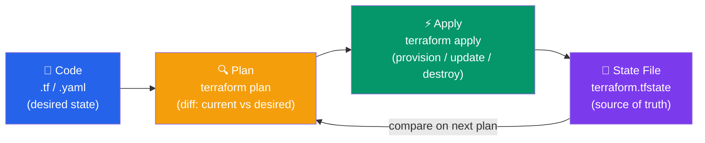

# Infrastructure as Code Concepts

> Manage infrastructure with code for consistency, version control, and automation.

## IaC Approaches

### Declarative (Desired State)

```hcl
# Terraform - describe what you want
resource "aws_instance" "web" {
  ami           = "ami-0c55b159cbfafe1f0"
  instance_type = "t2.micro"
}
```

- Idempotent: running twice = same state
- Easy to understand desired state
- Tools: Terraform, CloudFormation, Pulumi

### Imperative (Step-by-Step)

```bash
#!/bin/bash
# Ansible - describe steps to take
aws ec2 run-instances --image-id ami-0c55b159cbfafe1f0 --instance-type t2.micro
```

- Exact steps executed
- Harder to ensure idempotency
- Tools: Ansible, Chef, Puppet

## Benefits of IaC

1. **Version Control** - Track infrastructure changes
2. **Reproducibility** - Same infrastructure every time
3. **Documentation** - Code documents architecture
4. **Automation** - Reduce manual errors
5. **Collaboration** - Teams work on same code
6. **Testing** - Validate before deployment
7. **Cost Tracking** - Know what you're provisioning

## State Management



---

## IaC Tools Comparison

| Tool | Cloud | Type | Language |
|------|-------|------|----------|
| **Terraform** | Multi-cloud | Declarative | HCL |
| **CloudFormation** | AWS only | Declarative | JSON/YAML |
| **Pulumi** | Multi-cloud | Imperative | Python/Go/TS |
| **Ansible** | Multi-cloud | Imperative | YAML |

---

## Best Practices

1. **Keep state files safe** - Remote backend, encrypted
2. **Use modules** - Reusable, composable
3. **Environment separation** - Dev/staging/prod
4. **Code review** - Peer review infrastructure changes
5. **Plan before apply** - Review changes first
6. **Backup state** - Disaster recovery
7. **Test in dev first** - Validate before prod

---

## Summary

- **IaC** codifies infrastructure for consistency
- **Declarative** describes desired state
- **Imperative** describes steps
- **State** tracks current infrastructure
- **Version control** enables collaboration
- **Automation** reduces manual errors

Next: [Terraform Basics](./02_terraform_basics.md)
