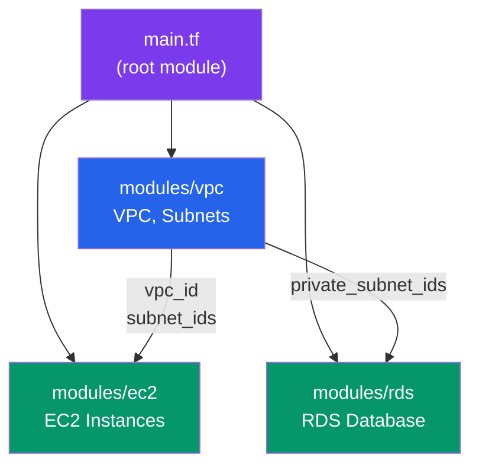

# Terraform Modules

Socho tumne pehle ek VPC banaya, phir kal ek naye project mein phir se wahi VPC ka code copy-paste kiya, phir teesre project mein bhi wahi kahani. Ek din VPC ke security group rule mein bug mila — ab tumhe teeno jagah jaake fix karna padega. Yeh exactly wahi problem hai jo **Terraform Modules** solve karte hain.

Module basically ek **reusable Terraform package** hai — jaise NPM package hota hai Node.js mein, ya jaise ek common `UserCard` component banate ho React mein aur use har jagah reuse karte ho. Ek baar VPC module likh liya, ab har project mein bas usko "import" karo, kuch variables pass karo, aur poora VPC infra ready. Bug fix karna ho toh ek hi jagah fix karo — module update karo, sab jagah propagate ho jayega.

> [!info]
> Terraform mein har `.tf` file jis folder mein hoti hai wo apne aap ek "module" hi hota hai. Jab tum root directory se `terraform apply` chalate ho, wo **root module** hota hai. Jab tum kisi sub-folder ko `module` block se call karte ho, wo **child module** ban jaata hai. Matlab modules koi alag feature nahi hai — Terraform ka fundamental building block hi module hai.

## Module Structure — Folder kaisa dikhta hai?

**Kya hota hai?** Ek convention hai jise Terraform community follow karti hai — har module ke andar teen zaruri files hoti hain: `main.tf` (resources), `variables.tf` (inputs), `outputs.tf` (exports). Sochlo isko ek Express.js route module ki tarah — jisme `index.js` (logic), config/params, aur exports alag-alag organize hote hain taaki koi bhi dev aake seedha samajh jaaye ki kya expect karna hai.

```
modules/
├── vpc/
│   ├── main.tf
│   ├── variables.tf
│   ├── outputs.tf
│   └── README.md
├── ec2/
│   ├── main.tf
│   ├── variables.tf
│   └── outputs.tf
└── rds/
    ├── main.tf
    ├── variables.tf
    └── outputs.tf
```

**Kyun zaruri hai?** Agar tum Zomato ke infra team mein ho, toh VPC, EC2, RDS — yeh sab alag-alag services har team use karegi (orders team, restaurant-partner team, delivery-tracking team). Agar sabko apna khud ka VPC code likhna pade, toh naming conventions, security rules, tagging — sab kuch inconsistent ho jayega. Ek shared `modules/vpc` folder banaake, sabko bolo "isi module ko use karo, bas apne parameters do" — consistency automatically aa jaati hai.

> [!tip]
> `README.md` module ke andar rakhna optional nahi samjho — yeh module ka "API documentation" hai. Jab koi naya dev tumhara module use karega, wo pehle README padhega, seedha `main.tf` khodne nahi baithega.

## Module Banana — Ek VPC module likhte hain

**Kya karna hai?** Module ke andar normal Terraform resources hi likhte ho, bas hardcoded values ki jagah `var.xyz` use karte ho taaki caller apni values pass kar sake. Socho isko ek function ki tarah — jaise JavaScript mein tum `createVPC(name, cidr, azs)` function likhte ho, jisme `name`, `cidr`, `azs` parameters hain, output mein VPC object milta hai.

```hcl
# modules/vpc/main.tf
resource "aws_vpc" "main" {
  cidr_block           = var.cidr_block
  enable_dns_hostnames = true

  tags = {
    Name = var.vpc_name
  }
}

resource "aws_subnet" "public" {
  count             = length(var.availability_zones)
  vpc_id            = aws_vpc.main.id
  cidr_block        = var.public_subnets[count.index]
  availability_zone = var.availability_zones[count.index]
}

resource "aws_subnet" "private" {
  count             = length(var.availability_zones)
  vpc_id            = aws_vpc.main.id
  cidr_block        = var.private_subnets[count.index]
  availability_zone = var.availability_zones[count.index]
}
```

Yahan gaur karo — `count = length(var.availability_zones)` ka matlab hai agar tum 2 AZs doge (`us-east-1a`, `us-east-1b`), toh Terraform automatically 2 public subnet aur 2 private subnet bana dega, ek-ek har AZ mein. Yeh IRCTC ki tatkal booking system jaisa hai — agar tumne 3 alag servers (AZs) mein deploy karna hai high-availability ke liye, toh yeh loop automatically utne hi subnets bana dega, tumhe manually copy-paste nahi karna.

### Variables — Module ke "inputs"

**Kya hota hai?** `variables.tf` mein tum define karte ho ki caller ko kaunse parameters dene **zaruri** hain. Yeh bilkul waise hai jaise TypeScript mein tum kisi function ka interface define karte ho — `type` batata hai kya expect kiya jaa raha hai.

```hcl
# modules/vpc/variables.tf
variable "vpc_name" {
  type = string
}

variable "cidr_block" {
  type = string
}

variable "availability_zones" {
  type = list(string)
}

variable "public_subnets" {
  type = list(string)
}

variable "private_subnets" {
  type = list(string)
}
```

> [!tip]
> Production mein hamesha `description` aur jahan sensible ho `default` bhi add karo:
> ```hcl
> variable "vpc_name" {
>   type        = string
>   description = "Name tag jo VPC ko diya jayega, e.g. 'production-vpc'"
> }
> ```
> Isse tumhara module self-documenting ban jaata hai — jaise JSDoc comments function ke upar likhte ho, waise hi yeh description Terraform docs mein aur `terraform-docs` tool se generate hone wali documentation mein dikhti hai.

### Outputs — Module se "return values" nikalna

**Kya hota hai?** Module ke andar resource banne ke baad us resource ki ID, ARN, ya kisi bhi attribute ko bahar expose karna hota hai taaki root module ya doosre modules usko use kar sakein. Yeh function ke `return` statement jaisa hai — module apna kaam karke kuch values wapas deta hai.

```hcl
# modules/vpc/outputs.tf
output "vpc_id" {
  value = aws_vpc.main.id
}

output "public_subnet_ids" {
  value = aws_subnet.public[*].id
}

output "private_subnet_ids" {
  value = aws_subnet.private[*].id
}
```

`aws_subnet.public[*].id` ka matlab hai — saare public subnets ka `id` nikaal ke ek **list** bana do (splat expression). Isse agla module (jaise EC2) directly `module.vpc.public_subnet_ids[0]` use karke pehla subnet pick kar sakta hai.

> [!warning]
> Agar tumne koi resource attribute ko output mein expose nahi kiya, toh module ke bahar se wo attribute access hi nahi hoga — chaahe wo resource internally exist kare. Matlab agar tum RDS module se `db_endpoint` output karna bhool gaye, toh koi bhi app us database se connect nahi kar payega bina us endpoint ko manually hardcode kiye — jo ek badi anti-pattern hai.

## Module Use Karna — Compose karke poora infra banate hain

Ab jab humare paas alag-alag modules ready hain (VPC, EC2, RDS), inko root `main.tf` mein jodna hai. Socho isko microservices architecture ki tarah — jaise Swiggy mein order-service, payment-service, aur delivery-service alag-alag chalte hain lekin ek dusre se data pass karte hain, waise hi yahan VPC module apna output (vpc_id, subnet_ids) EC2 aur RDS modules ko deta hai.



Is diagram mein dekho — VPC pehle banta hai, uske baad uska output (`vpc_id`, `subnet_ids`) EC2 aur RDS ko milta hai. Terraform automatically samajh jaata hai ki VPC pehle create hona chahiye kyunki EC2/RDS ka code VPC ke output ko reference kar raha hai — yeh **implicit dependency** hai, tumhe khud se `depends_on` likhne ki zarurat nahi.

```hcl
# main.tf
module "vpc" {
  source = "./modules/vpc"

  vpc_name           = "production"
  cidr_block         = "10.0.0.0/16"
  availability_zones = ["us-east-1a", "us-east-1b"]
  public_subnets    = ["10.0.1.0/24", "10.0.2.0/24"]
  private_subnets   = ["10.0.11.0/24", "10.0.12.0/24"]
}

module "ec2" {
  source = "./modules/ec2"

  vpc_id             = module.vpc.vpc_id
  subnet_id          = module.vpc.public_subnet_ids[0]
  instance_type      = "t3.medium"
  instance_count     = 3
}
```

Yahan `source = "./modules/vpc"` bata raha hai Terraform ko ki module ka code kahan milega — yeh local path hai. `module.vpc.vpc_id` likhna bilkul aise hai jaise JavaScript mein `import { vpcId } from './vpc'` karke uski value use karna — bas Terraform ka syntax thoda alag hai.

> [!warning]
> Naya module add karne ya `source` change karne ke baad `terraform init` chalana **mandatory** hai. Terraform ko naye module ka code download/register karna padta hai, warna `terraform plan` seedha error de dega — "Module not installed" jaisa.

## Published Modules — Registry se ready-made modules use karna

**Kya hota hai?** Har baar apna khud ka module likhna zaroori nahi. Terraform ka apna public **Registry** hai (registry.terraform.io) jahan community ne already battle-tested modules publish kar rakhe hain — RDS, EKS, Lambda, S3, VPC — sab kuch. Yeh bilkul NPM registry jaisa hai — jaise tum `express` ya `lodash` NPM se install karte ho instead of khud likhne ke, waise hi yahan tum `terraform-aws-modules/rds/aws` jaise verified modules use kar sakte ho.

```hcl
# Use community modules from registry
module "rds" {
  source = "terraform-aws-modules/rds/aws"
  version = "5.0.0"

  identifier = "mydb"

  engine            = "postgres"
  engine_version    = "15.0"
  family            = "postgres15"
  major_engine_version = "15"

  instance_class = "db.t3.micro"

  allocated_storage = 20

  db_name  = "mydb"
  username = "admin"
  password = random_password.db.result

  multi_az = true
}
```

`terraform-aws-modules/rds/aws` naam ka format hai `<namespace>/<name>/<provider>` — matlab yeh AWS provider ke liye `terraform-aws-modules` org ka publish kiya hua `rds` module hai. `version = "5.0.0"` pin karna bahut zaruri hai — production mein kabhi bhi `version` field chhodo mat, warna kal registry pe koi major breaking update aa gaya toh tumhara `terraform apply` bina warning ke fail ho sakta hai (ya worse, silently kuch tod sakta hai).

> [!tip]
> Community module use karne se pehle uska GitHub repo, stars, aur "last updated" date check karo — jaise tum CRED ya PhonePe integrate karne se pehle unki official SDK docs dekhte ho, na ki kisi random tutorial se copy karte ho. Registry pe verified badge waale modules (jinke aage blue checkmark hota hai) generally safe hote hain kyunki HashiCorp partner ya well-maintained org unko publish karta hai.

> [!warning]
> Community modules apne saath bahut saare defaults aur "extra" resources laate hain (jaise monitoring, backups, parameter groups). Blindly use mat karo — pehle `terraform plan` chala ke dekho kitne resources create ho rahe hain, kyunki kabhi-kabhi ek chhota sa RDS module 15-20 resources bana deta hai jinme se tumhe sirf 5 chahiye the. Isse cost aur complexity dono badh sakte hain agar tumne review nahi kiya.

## Best Practices — Kuch gotchas jo dhyan mein rakhne chahiye

1. **Modules ko chhota aur focused rakho** — ek module ek hi cheez ka zimmedaar ho (single responsibility, jaise clean code mein function bhi ek hi kaam kare). VPC module sirf networking sambhale, EC2 module sirf compute — inko mix mat karo.
2. **Naming consistency** — agar `vpc_name` variable ek module mein hai, toh doosre modules mein bhi similar naming convention follow karo, warna team confuse ho jayegi ki kaunsa module kaunsa naam expect karta hai.
3. **Version pinning** — chahe local module ho ya registry module, agar version control system (Git) use kar rahe ho toh Git tag/branch pin karo:
   ```hcl
   module "vpc" {
     source = "git::https://github.com/org/terraform-modules.git//vpc?ref=v1.2.0"
   }
   ```
4. **Testing** — bade modules ke liye `terraform plan` ke alawa tools jaise `terratest` (Go-based) ya `checkov`/`tflint` use karo taaki security misconfigurations pehle hi pakad liye jaayein — jaise CI/CD pipeline mein unit tests chalate ho waise hi.

## Key Takeaways

- **Modules** Terraform code ko reusable units mein organize karte hain — jaise NPM packages ya React components, ek baar likho, har jagah use karo
- Har module conventionally teen files rakhta hai: `main.tf` (resources), `variables.tf` (inputs), `outputs.tf` (exports)
- **Input variables** module ko parameterize karte hain — bina inke module hardcoded aur non-reusable ban jaata hai
- **Outputs** module ke andar bane resources ke attributes bahar expose karte hain taaki doosre modules unhe consume kar sakein
- Modules ke beech dependency Terraform khud detect kar leta hai jab ek module doosre ka output reference karta hai — koi manual `depends_on` nahi chahiye
- **Terraform Registry** community-maintained ready-made modules deta hai (jaise NPM registry) — lekin version pin karna aur `terraform plan` se resources verify karna mat bhoolna
- Naya module add karne ya `source` badalne ke baad `terraform init` chalana zaroori hai
- Modules ko chhota, focused, aur consistent naming ke saath likho taaki poori team asani se use kar sake

Next: [AWS with Terraform](./04_aws_with_terraform.md)
