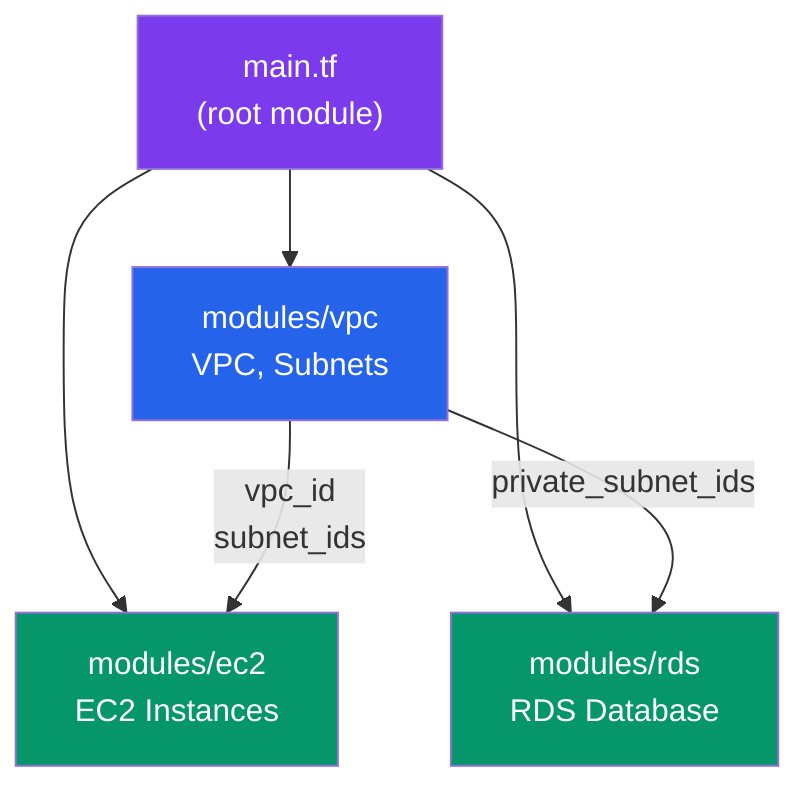

# Terraform Modules

> Reusable, composable Terraform code for scalable infrastructure.

## Module Structure

```
modules/
├── vpc/
│   ├── main.tf
│   ├── variables.tf
│   ├── outputs.tf
│   └── README.md
├── ec2/
│   ├── main.tf
│   ├── variables.tf
│   └── outputs.tf
└── rds/
    ├── main.tf
    ├── variables.tf
    └── outputs.tf
```

## Create Module

```hcl
# modules/vpc/main.tf
resource "aws_vpc" "main" {
  cidr_block           = var.cidr_block
  enable_dns_hostnames = true

  tags = {
    Name = var.vpc_name
  }
}

resource "aws_subnet" "public" {
  count             = length(var.availability_zones)
  vpc_id            = aws_vpc.main.id
  cidr_block        = var.public_subnets[count.index]
  availability_zone = var.availability_zones[count.index]
}

resource "aws_subnet" "private" {
  count             = length(var.availability_zones)
  vpc_id            = aws_vpc.main.id
  cidr_block        = var.private_subnets[count.index]
  availability_zone = var.availability_zones[count.index]
}
```

```hcl
# modules/vpc/variables.tf
variable "vpc_name" {
  type = string
}

variable "cidr_block" {
  type = string
}

variable "availability_zones" {
  type = list(string)
}

variable "public_subnets" {
  type = list(string)
}

variable "private_subnets" {
  type = list(string)
}
```

```hcl
# modules/vpc/outputs.tf
output "vpc_id" {
  value = aws_vpc.main.id
}

output "public_subnet_ids" {
  value = aws_subnet.public[*].id
}

output "private_subnet_ids" {
  value = aws_subnet.private[*].id
}
```

## Use Module



```hcl
# main.tf
module "vpc" {
  source = "./modules/vpc"

  vpc_name           = "production"
  cidr_block         = "10.0.0.0/16"
  availability_zones = ["us-east-1a", "us-east-1b"]
  public_subnets    = ["10.0.1.0/24", "10.0.2.0/24"]
  private_subnets   = ["10.0.11.0/24", "10.0.12.0/24"]
}

module "ec2" {
  source = "./modules/ec2"

  vpc_id             = module.vpc.vpc_id
  subnet_id          = module.vpc.public_subnet_ids[0]
  instance_type      = "t3.medium"
  instance_count     = 3
}
```

## Published Modules

```hcl
# Use community modules from registry
module "rds" {
  source = "terraform-aws-modules/rds/aws"
  version = "5.0.0"

  identifier = "mydb"

  engine            = "postgres"
  engine_version    = "15.0"
  family            = "postgres15"
  major_engine_version = "15"

  instance_class = "db.t3.micro"

  allocated_storage = 20

  db_name  = "mydb"
  username = "admin"
  password = random_password.db.result

  multi_az = true
}
```

---

## Summary

- **Modules** organize code into reusable units
- **Input variables** parameterize modules
- **Outputs** expose module resources
- **Registry** provides community modules
- **Composability** enables building complex infrastructure
- **Documentation** essential for modules

Next: [AWS with Terraform](./04_aws_with_terraform.md)
