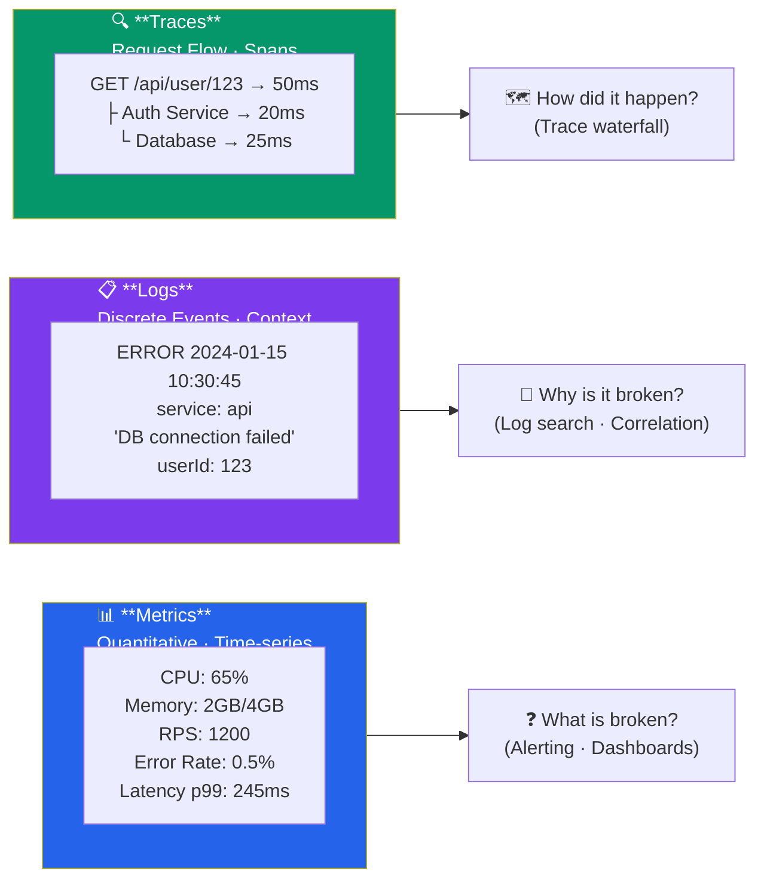

# Observability Concepts

> Understand the three pillars of observability: metrics, logs, and traces.

## Three Pillars of Observability



### Metrics

Quantitative measurements over time.

```
CPU Usage: 65%
Memory: 2GB / 4GB
Requests/sec: 1200
Error Rate: 0.5%
Latency: p99=245ms
```

### Logs

Discrete events with context.

```json
{
  "timestamp": "2024-01-15T10:30:45Z",
  "level": "ERROR",
  "service": "api",
  "message": "Database connection failed",
  "context": {
    "userId": "123",
    "action": "fetch-profile"
  },
  "stackTrace": "..."
}
```

### Traces

Request flow across services.

```
Request: GET /api/user/123
├─ API Service (50ms)
│  ├─ Auth Service (20ms)
│  └─ Database (25ms)
├─ Cache Service (5ms)
└─ Response (5ms)
Total: 50ms
```

## Benefits

- **Debugging** - Understand failures
- **Performance** - Identify bottlenecks
- **Alerting** - Proactive response
- **Capacity Planning** - Growth prediction
- **SLA Tracking** - Service level compliance

---

## Common Metrics

```
System Metrics:
- CPU Usage
- Memory Usage
- Disk I/O
- Network I/O

Application Metrics:
- Request Rate
- Error Rate
- Latency (p50, p95, p99)
- Cache Hit Rate
- Database Connections

Business Metrics:
- Transactions
- Conversions
- Revenue
- User Activity
```

---

## Red, Yellow, Green (R.Y.G.)

**RED:**
- Request rate
- Error rate
- Duration

**YELLOW:**
- Resource saturation
- Utilization
- Connections

**GREEN:**
- User experience
- Business impact
- Success metrics

---

## Tools Overview

| Category | Tools |
|----------|-------|
| **Metrics** | Prometheus, CloudWatch, Datadog, New Relic |
| **Logs** | ELK, Splunk, CloudWatch, Datadog |
| **Traces** | Jaeger, Zipkin, New Relic, Datadog |
| **Integrated** | Datadog, New Relic, Sumo Logic |

---

## Summary

- **Metrics** answer "what happened and how much"
- **Logs** answer "why did it happen"
- **Traces** answer "how did the request flow"
- **All three** needed for true observability
- **Alerting** on metrics, investigate with logs/traces

Next: [Application Logging](./02_application_logging.md)
