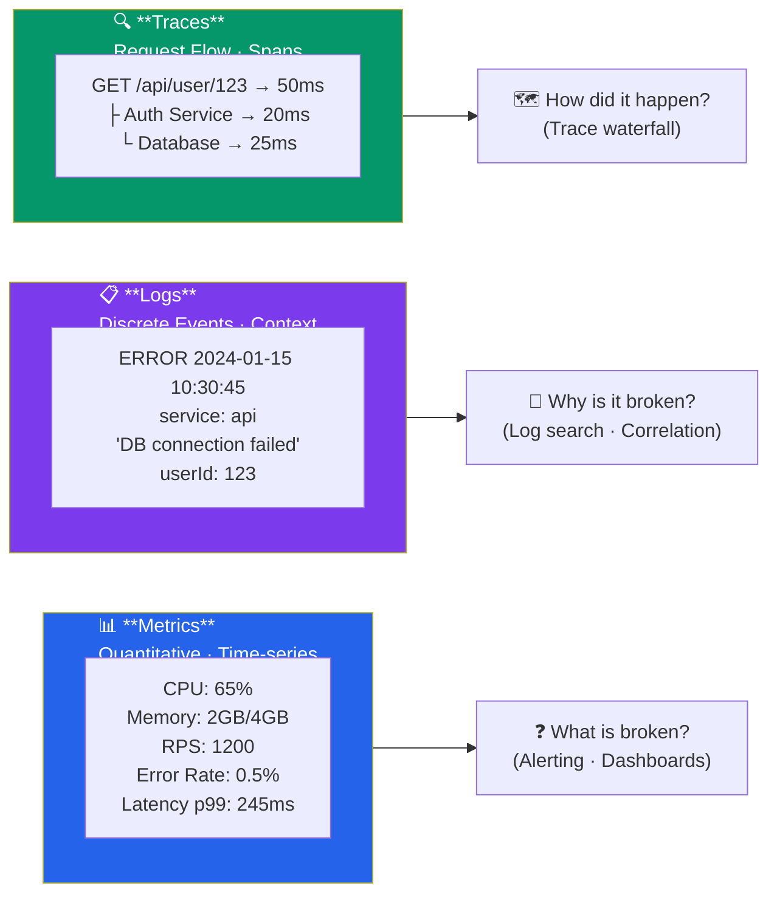

# Observability Concepts

Socho tum Zomato ke backend team mein ho, aur raat 2 baje production mein orders fail hone lag jaate hain. Ab tumhare paas do options hain — ya toh tum blindly server mein SSH karke logs khangaalte raho, ya phir tumhare paas already ek proper **observability setup** ho jo tumhe turant bataye "kya toota hai, kyun toota hai, aur kaise toota hai". Yeh dusra wala option hi observability hai — aur isi ka gyaan is note mein milega.

> [!info]
> Observability aur Monitoring mein farak hai. Monitoring tumhe batata hai ki "system down hai" (jo cheezein tum already track kar rahe ho). Observability tumhe woh sawaal poochne deta hai jo tumne pehle kabhi socha bhi nahi tha — jaise "sirf Mumbai region ke users ke liye, jinke paas coupon code hai, checkout kyun slow ho raha hai?" — bina naya code deploy kiye.

## Three Pillars of Observability — Teen Khambe

Observability teen cheezon pe khadi hoti hai, bilkul teen-tangi table ki tarah — koi ek pair bhi gayab ho toh table gir jaata hai:

1. **Metrics** — Numbers, time ke saath (CPU 65%, error rate 0.5%)
2. **Logs** — Discrete events, apne context ke saath ("DB connection failed for userId 123")
3. **Traces** — Ek request ka poora safar, service se service tak



Yeh diagram jo bata raha hai woh actually production debugging ka real workflow hai:

- **Metrics** tumhe alert karte hain — "Kya kuch toota hai?" (dashboard pe error rate ka spike dikh gaya)
- **Logs** tumhe batate hain — "Yeh kyun toota?" (specific error message aur stack trace mila)
- **Traces** tumhe dikhate hain — "Yeh kaise hua?" (poori request journey ka waterfall view)

Ek IRCTC ticket booking fail hone ka example lete hain: metric dashboard pe payment failure rate 15% se 40% jump kar gaya (Kya?). Logs mein dikha "Payment gateway timeout after 30s" (Kyun?). Trace mein dikha ki request Auth Service se 20ms mein nikli, lekin Payment Service ke andar hi 29 second phas gayi kyunki woh third-party bank API ko call kar rahi thi jo down tha (Kaise?). Teenon pillars milke poori kahani sunate hain — akela koi bhi adhoora hai.

### Metrics — Numbers Jo Time Ke Saath Chalte Hain

**Kya hota hai?** Metrics matlab quantitative measurements jo time ke saath collect hote hain — jaise tumhare phone ka battery percentage graph, bas yahan CPU, memory, requests, errors track hote hain.

**Kyun zaruri hai?** Kyunki numbers compress ho jaate hain — lakhon requests ka data ek chhota sa time-series graph mein fit ho jaata hai. Isse tum turant trend dekh sakte ho: "Diwali sale ke time traffic 10x badh gaya" ya "last deploy ke baad latency double ho gayi".

```
CPU Usage: 65%
Memory: 2GB / 4GB
Requests/sec: 1200
Error Rate: 0.5%
Latency: p99=245ms
```

Isko Swiggy ke restaurant dashboard jaisa socho — restaurant owner ko exact pata nahi hota har order ka detail, lekin usse pata chalta hai "aaj 500 orders aaye, average delivery time 32 min hai, 2% orders cancel hue". Yeh macro-level health check hai. Metrics ka sabse bada fayda hai ki yeh **cheap to store aur query karna** hote hain — chaahe 1 crore requests aaye ho, tumhe bas ek number chahiye (average, p99, count) — poora raw data store nahi karna padta.

> [!tip]
> Latency ke liye hamesha **percentiles (p50, p95, p99)** dekho, average nahi. Kyunki average deceiving hota hai — agar 99 requests 50ms mein complete ho rahi hain aur 1 request 10 second le rahi hai, toh average theek-thaak dikhega, lekin woh 1 user jo 10 second wait kar raha tha, uska experience bahut bura tha. p99 batata hai "100 mein se 99 requests is time se kam mein complete hoti hain" — jo real user pain ko better capture karta hai.

### Logs — Har Event Ki Diary Entry

**Kya hota hai?** Logs matlab discrete events, apne poore context ke saath — jaise ek diary entry jisme likha ho "10:30:45 baje, user 123 ne profile fetch karne ki koshish ki, lekin DB connection fail ho gaya".

**Kyun zaruri hai?** Metrics tumhe batate hain "kuch gadbad hai", lekin exact detail nahi dete. Logs woh detail dete hain — kaunsa user affected hua, kaunsa error message aaya, kaunsi request ID thi.

```json
{
  "timestamp": "2024-01-15T10:30:45Z",
  "level": "ERROR",
  "service": "api",
  "message": "Database connection failed",
  "context": {
    "userId": "123",
    "action": "fetch-profile"
  },
  "stackTrace": "..."
}
```

Yeh structured log format hai (JSON) — modern systems mein plain text logs ("ERROR: something broke") ki jagah structured logs use karte hain kyunki inhe search aur filter karna aasan hota hai. Socho CRED app mein customer support ko complaint aayi "mera payment fail ho gaya" — agar logs structured hain, toh engineer seedha query kar sakta hai `userId: 123 AND level: ERROR` aur exact culprit log turant mil jaayega. Agar plain text logs hote, toh usse manually thousands of lines mein Ctrl+F karna padta.

> [!warning]
> Logs mein kabhi bhi sensitive data — password, credit card number, OTP, full Aadhar number — mat daalo. Yeh common security mistake hai. Logging tool (jaise ELK, Datadog) mein access control kamzor ho sakta hai, aur logs aksar third-party services ko bhi forward hote hain.

### Traces — Request Ka Poora Safar

**Kya hota hai?** Trace batata hai ek single request microservices ke beech kaise travel karti hai — kaunsi service ko call kiya, kitna time laga, kya sequentially hua ya parallel mein.

**Kyun zaruri hai?** Aaj kal koi bhi bada system monolith nahi hota — Zomato ka ek order place karna matlab Order Service, Payment Service, Restaurant Service, Notification Service, sab ek saath involve hote hain. Agar order slow hai, toh sawaal yeh hai — **kaunsi service** slow thi? Traces yeh exactly dikhate hain.

```
Request: GET /api/user/123
├─ API Service (50ms)
│  ├─ Auth Service (20ms)
│  └─ Database (25ms)
├─ Cache Service (5ms)
└─ Response (5ms)
Total: 50ms
```

Isko ek railway journey ki tarah socho — Delhi se Mumbai jaane wali train ka pura route map: "Delhi se Kota tak 4 ghante, Kota se Vadodara tak 3 ghante, Vadodara se Mumbai tak 2 ghante". Agar poori journey mein delay hui, toh tumhe pata chal jaayega exactly kaunsa segment slow tha, na ki sirf "total journey late hai". Har chhota segment ek **span** kehlata hai, aur poori trace multiple spans ka tree hoti hai. Tools jaise Jaeger aur Zipkin isi waterfall view ko visualize karte hain.

> [!tip]
> Distributed tracing setup karne ke liye tumhe **trace ID** ko har service call ke saath propagate karna padta hai (usually HTTP header mein, jaise `traceparent`). Yeh OpenTelemetry standard follow karta hai. Agar tum Node.js use kar rahe ho, toh `@opentelemetry/api` package se easily instrument kar sakte ho.

## Benefits — Yeh Sab Karne Se Fayda Kya?

- **Debugging** — Failures ko jaldi samajhna, guesswork nahi karna padta
- **Performance** — Bottlenecks identify karna (kaunsi service/query slow hai)
- **Alerting** — Proactive response — user ke complain karne se pehle hi pata chal jaana
- **Capacity Planning** — Growth predict karna (agle mahine kitna traffic aayega, kitne servers chahiye)
- **SLA Tracking** — Service level compliance (jaise "99.9% uptime guarantee" ko track karna)

Ek real scenario: BigBasket ke liye agar observability na ho, toh unhe pata hi tab chalega jab customers Twitter pe complain karna shuru karenge "app hang ho raha hai!". Achi observability ke saath, unka on-call engineer alert milte hi 2 minute mein pata laga lega ki "checkout service ka DB connection pool exhaust ho gaya hai" — customer ko pata chalne se pehle hi fix ho jaayega.

---

## Common Metrics — Kya Kya Track Karna Chahiye

Metrics ko roughly teen categories mein baant sakte ho — **system**, **application**, aur **business** level:

```
System Metrics:
- CPU Usage
- Memory Usage
- Disk I/O
- Network I/O

Application Metrics:
- Request Rate
- Error Rate
- Latency (p50, p95, p99)
- Cache Hit Rate
- Database Connections

Business Metrics:
- Transactions
- Conversions
- Revenue
- User Activity
```

**System metrics** batate hain machine health kaisi hai — jaise gaadi ka fuel gauge aur engine temperature. **Application metrics** batate hain code kaisa perform kar raha hai — jaise gaadi ki speed aur mileage. **Business metrics** batate hain actual business impact kya hai — jaise "aaj kitne passengers ne safar kiya, kitna revenue aaya".

Interesting baat yeh hai ki teeno layers connected hote hain. Maan lo Ola cabs ka CPU usage 90% ho gaya (system metric) → is wajah se API response time badh gaya (application metric) → jisse users ride book karte waqt frustrate hoke app band kar de rahe hain (business metric — conversion rate down). Achi observability strategy in teenon layers ko ek saath dekhti hai, sirf ek layer pe focus nahi karti.

---

## Red, Yellow, Green (R.Y.G.) — Signal System

Yeh ek mental model hai jo traffic signal jaisa kaam karta hai — teen categories mein metrics ko organize karne ka tareeka, taaki dashboard dekhte hi priority samajh aa jaaye:

**RED (Ruk jao, kuch galat hai — request-level health):**
- Request rate
- Error rate
- Duration

**YELLOW (Saavdhani — resource health):**
- Resource saturation
- Utilization
- Connections

**GREEN (Sab theek — user/business health):**
- User experience
- Business impact
- Success metrics

> [!info]
> Yeh RED method (Rate, Errors, Duration) actually ek famous observability pattern hai jo Weaveworks ne popularize kiya tha — microservices monitor karne ke liye. Iska cousin hai **USE method** (Utilization, Saturation, Errors) jo infrastructure/resources ke liye use hota hai. Dono ko yaad rakhna: RED requests ke liye, USE resources ke liye.

Practical example — Flipkart ke checkout service ka RYG dashboard aisa dikhega: RED mein "checkout API error rate 0.3%, p99 latency 200ms"; YELLOW mein "DB connection pool 80% utilized, Redis cache 60% full"; GREEN mein "order success rate 99.7%, revenue on-track". Ek glance mein poori health pata chal jaati hai.

---

## Tools Overview — Konsa Tool Kis Kaam Ke Liye

| Category | Tools |
|----------|-------|
| **Metrics** | Prometheus, CloudWatch, Datadog, New Relic |
| **Logs** | ELK, Splunk, CloudWatch, Datadog |
| **Traces** | Jaeger, Zipkin, New Relic, Datadog |
| **Integrated** | Datadog, New Relic, Sumo Logic |

Startup ya solo developer level pe aksar log **Prometheus + Grafana** (metrics ke liye, dono open-source aur free) aur **ELK stack** (Elasticsearch + Logstash + Kibana, logs ke liye) use karte hain — kyunki yeh self-hosted ho sakte hain aur cost control mein rehti hai. Bade enterprises jinke paas budget hai, woh **Datadog** ya **New Relic** jaise integrated platforms leते hain jo metrics + logs + traces sabkuch ek hi jagah, ek hi UI mein dete hain — setup fast hota hai but subscription costly hoti hai.

> [!tip]
> Agar tum Node.js/TypeScript background se ho aur khud experiment karna chahte ho, toh Prometheus + Grafana + `prom-client` npm package se shuru karo — free hai aur industry-standard bhi hai. Docker Compose se local setup 10 minute mein ho jaata hai.

## Key Takeaways

- Observability ke **teen pillars** hain: **Metrics** (numbers/trends), **Logs** (discrete event details), **Traces** (request ka cross-service journey)
- Metrics batate hain **"kya toota hai"**, logs batate hain **"kyun toota"**, traces batate hain **"kaise hua"** — teeno saath milke poori kahani banate hain
- Latency ke liye hamesha **percentiles (p99)** dekho, average kabhi bhi misleading hota hai
- Logs ko **structured (JSON)** rakho taaki search/filter karna aasan ho, aur kabhi bhi sensitive data log mat karo
- Metrics ko **System, Application, aur Business** level pe categorize karo — teeno layers connected hote hain
- **RED method** (Rate, Errors, Duration) requests ke liye, **USE method** (Utilization, Saturation, Errors) resources ke liye — RYG dashboard is model pe based hota hai
- Tool choice depend karta hai budget aur scale pe — **Prometheus/Grafana/ELK** open-source route ke liye, **Datadog/New Relic** integrated all-in-one solution ke liye
- Alerting **metrics** pe set karo (fast, cheap signal), aur deep investigation **logs + traces** se karo

Next: [Application Logging](./02_application_logging.md)
