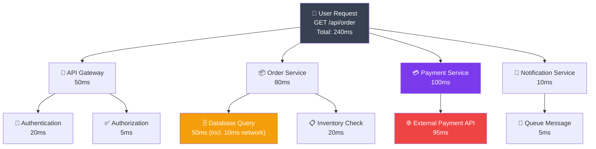

# Distributed Tracing

> Trace requests across microservices with Jaeger and OpenTelemetry.

## Jaeger

Open-source distributed tracing system.

```yaml
# docker-compose.yml
services:
  jaeger:
    image: jaegertracing/all-in-one
    ports:
      - "6831:6831/udp"  # Jaeger agent
      - "16686:16686"    # UI
```

## Instrumentation with OpenTelemetry

```javascript
// Node.js tracing
const { NodeSDK } = require('@opentelemetry/sdk-node');
const { getNodeAutoInstrumentations } = require('@opentelemetry/auto-instrumentations-node');
const { JaegerExporter } = require('@opentelemetry/exporter-trace-jaeger');

const jaegerExporter = new JaegerExporter({
  endpoint: 'http://localhost:6831',
});

const sdk = new NodeSDK({
  traceExporter: jaegerExporter,
  instrumentations: [getNodeAutoInstrumentations()],
});

sdk.start();

// Automatic tracing of HTTP, database, etc.
```

## Manual Spans

```javascript
const tracer = require('@opentelemetry/api').trace.getTracer('my-app');

async function processOrder(orderId) {
  const span = tracer.startSpan('processOrder');

  try {
    // Span operations
    span.setAttribute('orderId', orderId);

    const span2 = tracer.startSpan('fetchInventory', {
      parent: span
    });
    // Fetch inventory
    span2.end();

    const span3 = tracer.startSpan('processPayment', {
      parent: span
    });
    // Process payment
    span3.end();

    return result;
  } catch (error) {
    span.recordException(error);
    throw error;
  } finally {
    span.end();
  }
}
```

## Trace Visualization



Access at: http://localhost:16686

---

## Summary

- **Traces** show request flow across services
- **Spans** represent individual operations
- **OpenTelemetry** is vendor-neutral standard
- **Jaeger** is open-source tracing backend
- **Automatic instrumentation** requires minimal code
- **Debugging** distributed systems made easy

Next: [Health Checks & Alerts](./06_health_checks_and_alerts.md)
